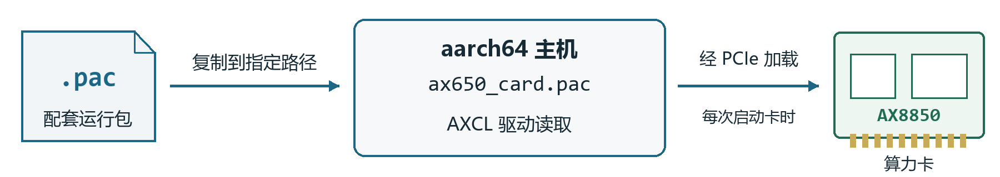
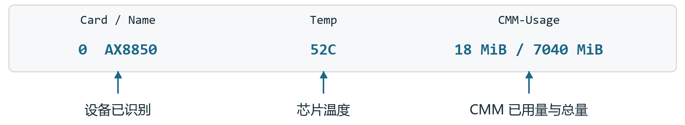

# AX8850 算力卡快速上手

aarch64 主机　Ubuntu / Debian　8GB 与 16GB 版本

按以下 6 步完成主机安装、PAC 部署和运行检查。适用于已完成出厂配置的算力卡。

**所有命令均在主机的 Linux 终端或 SSH 中执行。** 首次安装先不接卡，完成软件和 PAC 部署后再断电接卡。每一步确认无报错后，再继续操作。

算力卡配套资料：链接: https://pan.baidu.com/s/1IiO7MG_pfI555qdxRYgHNg?pwd=2pee 提取码: 2pee

## 1 准备安装文件

按卡容量进入下载目录，选择文件名含 **aarch64**、后缀为 **.deb** 的安装包。

| 卡容量 | 安装包下载入口 |
|---|---|
| 8GB | [打开 8GB 下载目录](https://huggingface.co/AXERA-TECH/AXCL/tree/main/V3.16.0_8G)，如果无法下载可以访问上方配套资料中 `03_软件安装包\8GB`目录下的安装包 |
| 16GB | [打开 16GB 下载目录](https://huggingface.co/AXERA-TECH/AXCL/tree/main/V3.16.0_16G)，如果无法下载可以访问上方配套资料中 `03_软件安装包\16GB`目录下的安装包 |

按卡容量进入获取配套PAC。

| 卡容量 | 安装包下载入口                               |
| ------ | -------------------------------------------- |
| 8GB    | 配套资料中 `02_设备固件\8GB`目录下的pac固件  |
| 16GB   | 配套资料中 `02_设备固件\16GB`目录下的pac固件 |

在主机创建工作目录：

```sh
mkdir -p ~/axcl-setup
cd ~/axcl-setup
```

将安装包和**随卡提供的配套 PAC**上传到该目录，分别命名为 `axcl-aarch64.deb` 和 `card-runtime.pac`，以便直接使用下方命令。8GB 与 16GB 的 PAC 不能混用；安装包自带的默认 PAC 不一定匹配本卡。

## 2 安装依赖与内核头

```sh
uname -m
uname -r
sudo apt update
sudo apt install -y build-essential patch kmod udev pciutils \
  libssl-dev bc flex bison libelf-dev
sudo apt install -y "linux-headers-$(uname -r)"
```

`uname -m` 应输出 `aarch64`。若找不到 headers 包，向开发板系统提供方获取与 `uname -r` **完全匹配**的包，放入当前目录并命名为 `kernel-headers.deb`，然后执行：

```sh
sudo apt install -y ./kernel-headers.deb
```

执行以下命令，确认输出的内核版本与 `uname -r` 一致，再继续安装驱动：

```sh
grep UTS_RELEASE \
  "/lib/modules/$(uname -r)/build/include/generated/utsrelease.h"
```

## 3 安装 AXCL 主机软件

```sh
cd ~/axcl-setup
sudo apt install -y ./axcl-aarch64.deb
dpkg-query -W -f='${Status} ${Version}\n' axclhost
modinfo -F vermagic axcl_host
```

**成功标志**：软件包状态为 **install ok installed**，模块信息中的内核版本与 `uname -r` 一致。安装包已提供主机驱动、运行库和工具，无需另行复制 SDK 中的 `.ko` 文件。

## 4 部署配套 PAC



将随卡提供的 `card-runtime.pac` 复制到主机指定目录即可，无需解包或烧录。驱动会在启动卡时自动加载。

复制配套 PAC：

```sh
cd ~/axcl-setup
if [ -f /lib/firmware/axcl/ax650_card.pac ]; then
  sudo cp -p /lib/firmware/axcl/ax650_card.pac \
    "/lib/firmware/axcl/ax650_card.pac.bak-$(date +%Y%m%d-%H%M%S)"
fi
sudo cp card-runtime.pac /lib/firmware/axcl/ax650_card.pac
sudo sync
```

检查复制结果：

```sh
cmp card-runtime.pac /lib/firmware/axcl/ax650_card.pac
```

**成功标志**：cmp 没有输出且没有报错，表示两个文件相同。目标文件名必须为 **ax650_card.pac**。复制或检查报错时，先处理再继续。

首次安装继续第 5 步，断电接卡后开机；已在使用的卡更新 PAC 后，停止相关应用并执行 `sudo reboot`。后续开机无需重复复制，重新安装或升级 AXCL 包后需重新部署配套 PAC。

## 5 接卡启动并检查状态

```sh
sudo poweroff
```

等待主机关机后**断电**，插好 AX8850 卡，固定散热片并接好风扇，再一起上电。进入主机 Linux 后执行：

```sh
lspci -nn | grep -iE 'axera|1f4b:0650'
sudo /usr/bin/axcl/axcl-smi
```

**成功标志**：能够发现 PCIe 设备，axcl-smi 显示卡、温度和 CMM 信息，且没有 `init fail` 或 `no device connected`。此时可继续运行模型。



8GB 实测输出节选，仅保留关键字段。当前配套 PAC 的 CMM 总量参考：**8GB 为 7040MiB，16GB 为 15232MiB**；温度和已用内存随运行变化。

## 6 运行模型验证

安装AXCL软件后，会提供`axcl_ut_npu`命令进行测试，可使用这个命令进行测试，运行效果如下：

```
baiwen@dshanpi-a1:~$ axcl_ut_npu
device index: 0, bus number: 1
[==========] Running 20 tests from 1 test suite.
[----------] Global test environment set-up.
[----------] 20 tests from axclrtDeviceTest
[ RUN      ] axclrtDeviceTest.Case01_AXCL_ENGINE_NPUReset
[       OK ] axclrtDeviceTest.Case01_AXCL_ENGINE_NPUReset (0 ms)
[ RUN      ] axclrtDeviceTest.Case02_AXCL_ENGINE_GetVersion
[       OK ] axclrtDeviceTest.Case02_AXCL_ENGINE_GetVersion (0 ms)
[ RUN      ] axclrtDeviceTest.Case03_AXCL_EngineInitDeinit
[       OK ] axclrtDeviceTest.Case03_AXCL_EngineInitDeinit (214 ms)
[ RUN      ] axclrtDeviceTest.Case04_AXCL_ENGINE_GetVNPUAttr
[       OK ] axclrtDeviceTest.Case04_AXCL_ENGINE_GetVNPUAttr (840 ms)
[ RUN      ] axclrtDeviceTest.Case05_AXCL_ENGINE_GetModelType
[       OK ] axclrtDeviceTest.Case05_AXCL_ENGINE_GetModelType (840 ms)
[ RUN      ] axclrtDeviceTest.Case06_AXCL_ENGINE_CreateHandle
[       OK ] axclrtDeviceTest.Case06_AXCL_ENGINE_CreateHandle (862 ms)
[ RUN      ] axclrtDeviceTest.Case07_AXCL_ENGINE_CreateHandleV2
[       OK ] axclrtDeviceTest.Case07_AXCL_ENGINE_CreateHandleV2 (864 ms)
[ RUN      ] axclrtDeviceTest.Case08_AXCL_ENGINE_CreateContext
[       OK ] axclrtDeviceTest.Case08_AXCL_ENGINE_CreateContext (863 ms)
[ RUN      ] axclrtDeviceTest.Case09_AXCL_ENGINE_CreateContextV2
[       OK ] axclrtDeviceTest.Case09_AXCL_ENGINE_CreateContextV2 (862 ms)
[ RUN      ] axclrtDeviceTest.Case10_AXCL_ENGINE_GetHandleModelType
[       OK ] axclrtDeviceTest.Case10_AXCL_ENGINE_GetHandleModelType (215 ms)
[ RUN      ] axclrtDeviceTest.Case11_AXCL_ENGINE_GetModelToolsVersion
[       OK ] axclrtDeviceTest.Case11_AXCL_ENGINE_GetModelToolsVersion (215 ms)
[ RUN      ] axclrtDeviceTest.Case12_AXCL_ENGINE_GetCMMUsage
[       OK ] axclrtDeviceTest.Case12_AXCL_ENGINE_GetCMMUsage (215 ms)
[ RUN      ] axclrtDeviceTest.Case13_AXCL_ENGINE_GetGroupIOInfoCount
[       OK ] axclrtDeviceTest.Case13_AXCL_ENGINE_GetGroupIOInfoCount (215 ms)
[ RUN      ] axclrtDeviceTest.Case14_AXCL_ENGINE_SetAffinity
[       OK ] axclrtDeviceTest.Case14_AXCL_ENGINE_SetAffinity (215 ms)
[ RUN      ] axclrtDeviceTest.Case15_AXCL_ENGINE_GetAffinity
[       OK ] axclrtDeviceTest.Case15_AXCL_ENGINE_GetAffinity (1511 ms)
[ RUN      ] axclrtDeviceTest.Case16_AX_ENGINE_GetIOInfo
[       OK ] axclrtDeviceTest.Case16_AX_ENGINE_GetIOInfo (1256 ms)
[ RUN      ] axclrtDeviceTest.Case17_AXCL_ENGINE_GetGroupIOInfo
[       OK ] axclrtDeviceTest.Case17_AXCL_ENGINE_GetGroupIOInfo (214 ms)
[ RUN      ] axclrtDeviceTest.Case18_AX_ENGINE_RunSync
[       OK ] axclrtDeviceTest.Case18_AX_ENGINE_RunSync (295 ms)
[ RUN      ] axclrtDeviceTest.Case19_AX_ENGINE_RunSyncV2
[       OK ] axclrtDeviceTest.Case19_AX_ENGINE_RunSyncV2 (295 ms)
[ RUN      ] axclrtDeviceTest.Case20_AXCL_ENGINE_RunGroupIOSync
[       OK ] axclrtDeviceTest.Case20_AXCL_ENGINE_RunGroupIOSync (295 ms)
[----------] 20 tests from axclrtDeviceTest (10303 ms total)

[----------] Global test environment tear-down
[==========] 20 tests from 1 test suite ran. (10304 ms total)
[  PASSED  ] 20 tests.
============= UT PASS =============
```

继续按[YOLO 图片检测](../../models/deploy/yolo11.md)检查真实输入，业务效果仍需验证；ONNX 等文件不能直接代替 `.axmodel`。

### 常见问题

**安装失败**：运行 `sudo tail -n 80 /var/log/axclhost-install.log` 查看原因，优先核对 headers 和依赖。

**PCIe 有卡但 SMI 无设备**：核对配套 PAC 和 SHA256，保存 `sudo dmesg` 输出并提供给供货方。卡端未启动时，不要反复查询 SMI。

运行期间保持风扇工作，禁止带电插拔。升级主机内核后，重新匹配 headers 和驱动。
