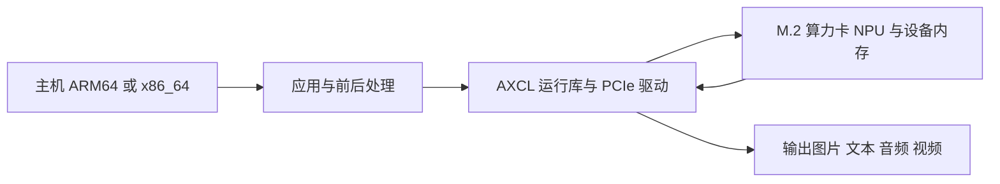

# 开始使用算力卡

使用顺序为：确认卡版本，安装主机 AXCL，部署配套 PAC，断电接卡，检查设备，最后运行应用。主机无需进入算力卡内部系统操作。

## 确认运行位置

模型包中的 `axcl_aarch64` 用于 ARM64 主机，`axcl_x86_64` 用于 x86_64 主机。`ax_aarch64`、`ax_run_model`、`libax_engine` 通常用于 AX 芯片板端，不能因主机同为 ARM64 就直接套用。RK3576 的 RKNN 工具链也不负责运行本卡的 `.axmodel`。

## 选择安装步骤

| 主机 | 安装入口 | 后续应用 |
|---|---|---|
| RK3576 等 ARM64 Linux | [ARM64 快速上手](quick-start/arm64.md) | 本站 Linux 应用章节；内核头需匹配主机系统 |
| Intel / AMD Linux | [Linux x86_64 快速上手](quick-start/linux-x86.md) | 同一套 AXCL 应用，程序按 x86_64 编译 |
| Windows x64 | [Windows 快速上手](quick-start/windows.md) | 先完成设备和模型工具检查；Linux shell 命令不直接适用 |

首次接卡前阅读[准备事项](../getting-started/prepare.md)。8GB 与 16GB 卡使用各自配套 PAC；磁盘空间、主机内存和卡端 CMM 是三个独立资源。

## 完成安装后的检查

1. 按[设备检查](../usage/device-check.md)保存设备状态。
2. 按[下载模型](../usage/download-models.md)保存仓库版本、模型与样例图片。
3. 使用 [YOLO11 检测示例](../models/deploy/yolo11.md)确认真实图片的推理结果。
4. 根据[模型选择说明](../models/selection.md)逐项增加任务。先运行单模型，再增加视频路数或服务并发。

模型可以加载不等于业务效果已通过，单次运行也不等于长期稳定。按[验证模板](../reference/validation.md)分别记录。
