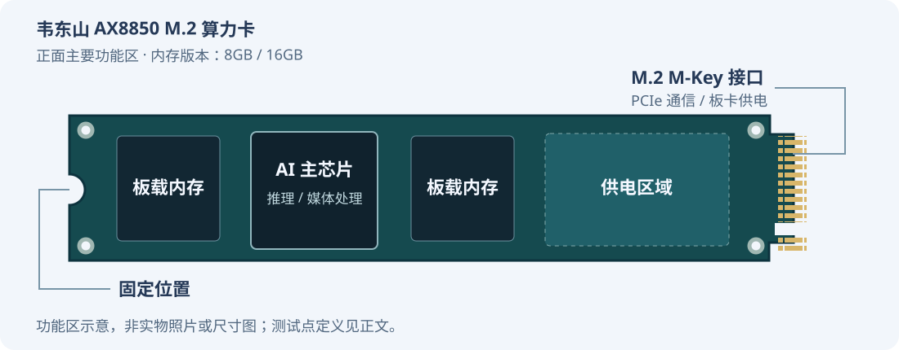
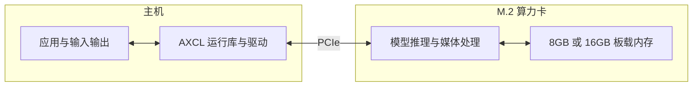

import {GuideHero, GuideNext} from '@site/src/components/ModelGuideLayout';

# 韦东山 AX8850 M.2 算力卡硬件介绍

<GuideHero
  label="韦东山 · 爱芯元智 AX8850"
  title="为现有主机增加本地 AI 计算能力"
  description="主机运行应用，通过 AXCL 调用算力卡完成模型推理与媒体处理。"
  facts={[["NPU 标称算力", "24 TOPS · INT8"], ["主机连接", "M.2 M-Key · PCIe"], ["内存版本", "8GB / 16GB"]]}
/>

**韦东山爱芯元智 AX8850 M.2 算力卡目前仅提供 8GB 和 16GB 两种内存版本。** 本页帮助软件开发者确认主机兼容性、选择容量，并了解运行模型所需的供电与散热条件。

购买链接：[查看产品与购买配置](https://detail.tmall.com/item.htm?abbucket=0&id=1081943918327)

## 查看硬件布局



图中展示主要功能区的相对位置，便于识别板卡与安排散热。实际器件外观以所购版本为准。8GB、16GB 指整卡内存容量。

| 功能区 | 软件开发者需要了解的用途 |
|---|---|
| AI 主芯片 | 执行模型推理与媒体处理，运行时需保持有效散热 |
| 板载内存 | 保存卡端系统、模型运行数据与媒体缓冲 |
| 供电区域 | 为板卡运行提供电源，不需要应用程序单独配置 |
| M.2 接口 | 连接主机，提供 PCIe 通信与板卡供电 |
| 固定位置 | 配合主机或转接板固定板卡，安装时预留散热空间 |

## 了解硬件能力

| 项目 | 规格与用途 |
|---|---|
| AI 推理 | NPU 标称算力 24 TOPS @ INT8，通过 AXCL 运行适配模型 |
| 板载内存 | 8GB 或 16GB，用于卡端系统、模型运行和媒体缓冲 |
| 主机接口 | M.2 M-Key，PCIe 2.0 ×2；实际连接速率与链路宽度以主机检查结果为准 |
| 板卡尺寸 | M.2 2280，名义尺寸 22 × 80 mm；安装时另需预留散热组件空间 |
| 媒体处理 | 支持 H.264 / H.265 编解码，具体格式和处理能力以 AXCL 配套接口及项目实测为准 |
| 板卡供电 | M.2 接口提供 3.3V 电源，主机或转接板需满足配套供电要求 |
| 板卡功耗 | 实测约 8W，实际功耗随模型负载与运行配置变化 |

芯片能力参考[原厂产品介绍](https://axera-tech.com/index.php/zh-hans/product/2896.html)与[芯片简介](https://www.axera-tech.com/sites/default/files/2025-11/AX8850_0.pdf)。TOPS 不能直接换算为模型的 FPS 或 tokens/s；实际部署效果见各模型和项目页面。

## 认识主机与算力卡的分工



主机负责模型文件存储、应用控制、输入输出及业务接入，算力卡负责执行推理与支持的媒体任务。摄像头、显示器和网络设备连接主机，应用通过 AXCL 使用卡端能力。[AXCL 架构说明](https://axcl-docs.readthedocs.io/zh-cn/latest/doc_introduction.html)

## 确认主机连接条件

安装前确认以下条件：

- **接口匹配**：主机具有支持 PCIe 的 M.2 M-Key 插槽，或使用适配的 PCIe 转接板。仅支持 SATA 的 M.2 插槽不适用。
- **空间足够**：提供 2280 长度的固定位置，并为散热器、风扇和走线预留空间。
- **软件匹配**：准备适用于主机系统与架构的 AXCL 驱动、运行库和安装包，具体步骤见[安装指南](../ax650n/user-guide.md)。
- **供电与散热就绪**：按主机、转接板和散热附件的说明连接电源，运行模型时保持风扇开启。

主机关机并断电后再插拔算力卡，安装后将板卡固定牢靠。首次连接按[准备主机与算力卡](prepare.md)完成检查。

## 识别调试测试点

正常使用只需在上位机安装 AXCL，通过 PCIe 调用算力卡，无需连接调试测试点。

<details>
<summary>展开 UART / USB 调试测试点说明</summary>

板卡预留 UART 与 USB 测试点，用于串口日志查看和配套工具调试。

| 测试点 | 信号 | 用途与连接说明 |
|---|---|---|
| TP3 | UART0_TXD | 卡端串口发送，连接调试适配器的 RX，用于接收卡端输出 |
| TP4 | UART0_RXD | 卡端串口接收；需要输入命令时连接调试适配器的 TX |
| TP5 | USB2_DP2（D+） | USB 差分信号正端，配合 TP6 使用 |
| TP6 | USB2_DM2（D−） | USB 差分信号负端，具体功能取决于配套固件与调试工具 |

**UART 为 1.8V 逻辑电平**，使用支持 1.8V 的串口适配器或匹配的电平转换模块，并与板卡共地。不要将 3.3V、5V TTL 或 RS-232 信号直接接入；适配器的电源输出也不要接到信号测试点。仅查看日志时，可先连接 TP3 与适配器 RX，并连接地线；串口参数按配套固件说明设置。

测试点是焊盘，不是已安装的外部插座。上表列出信号定义，不表示焊盘排列顺序；操作前按实物标识与配套调试资料确认位置和地线。USB 测试点不等同于完整 USB 接口，不能仅凭 D+、D− 两条信号推定供电、连接方式或刷机流程。

</details>

## 选择内存容量

**目前提供 8GB 和 16GB 两种内存版本，暂无其他容量版本。** 选购时按目标模型的运行内存需求选择，部署时使用与卡容量匹配的 PAC 固件包。

| 内存版本 | 部署前核对 |
|---|---|
| 8GB 版 | 查看模型部署页是否有 8GB 实测结果，并核对上下文长度、输入规格与并发配置 |
| 16GB 版 | 查看模型部署页的 16GB 运行配置，为模型权重、上下文缓存和媒体缓冲预留空间 |

更大的内存容量可容纳更多模型运行数据，不表示推理速度翻倍。模型在 16GB 上运行成功，不代表已通过 8GB 验证。选型时查看[模型与容量说明](../models/selection.mdx)。

部署时注意区分以下资源：

| 资源 | 主要用途 |
|---|---|
| 主机内存 | 应用进程、前后处理、分词与输入缓存 |
| 卡端内存 | 卡端系统、模型运行与媒体处理 |
| CMM 内存 | 卡端内存的一部分，供 NPU 与媒体任务使用 |
| 主机磁盘或存储卡 | 保存安装包、模型文件和输出结果 |

`CMM-Usage` 显示的总量由配套固件的内存分配决定，不必等于卡标称容量。主机磁盘的剩余空间也不能替代卡端运行内存。

## 了解供电与功耗

算力卡通过 M.2 接口使用 **3.3V 供电**。主机或转接板的外部电源、风扇电源按各自标注连接。

**本产品实测功耗约 8W**，可作为部署时的功耗参考。实际功耗随模型负载与运行配置变化，电源配置按主机或转接板的配套要求选择。

AXCL-SMI 可查看温度、利用率和内存，但其 `Pwr:Usage/Cap` 与 `Fan` 字段未提供有效读数时，不能用来判断实际功耗或风扇状态。[AXCL-SMI 字段说明](https://axcl-docs.readthedocs.io/zh-cn/latest/doc_guide_axcl_smi.html)

评估项目功耗时，使用外部测量设备，并注明测量的是整卡还是整机，以及是否包含风扇和外设。固定模型、输入、并发数和散热条件后，再比较空闲与运行状态的功率。

## 保持散热并检查状态

使用配套散热器与风扇，保持进出风口畅通。运行模型期间保持风扇工作；机箱内使用时，确保热空气能够排出。

安装 AXCL 后，在 Linux 主机执行：

```bash
sudo /usr/bin/axcl/axcl-smi
sudo /usr/bin/axcl/axcl-smi info --temp -d 0
sudo /usr/bin/axcl/axcl-smi info --cmm -d 0
```

`-d 0` 表示设备索引 0，多卡环境按实际索引替换。列表中的 `Temp` 为芯片结温；`info --temp` 数值的单位为摄氏度 × 1000。

先确认设备可识别，再运行已验证的模型。若温度持续升高、性能明显下降或设备掉线，停止负载并检查供电与散热，参阅[故障处理](../usage/troubleshooting.md)。

## 继续连接与部署

<GuideNext items={[
  {to: '/docs/getting-started/prepare', title: '准备主机与算力卡', text: '核对主机、卡容量、安装包与配套 PAC。'},
  {to: '/docs/ax650n/user-guide', title: '安装 AXCL 环境', text: '按 ARM64、x86_64 或 Windows 选择安装步骤。'},
  {to: '/docs/usage/device-check', title: '检查设备', text: '确认 PCIe、驱动、设备温度与内存状态。'},
  {to: '/docs/models/selection', title: '选择部署模型', text: '按任务、容量和实测结果选择模型。'}
]} />
