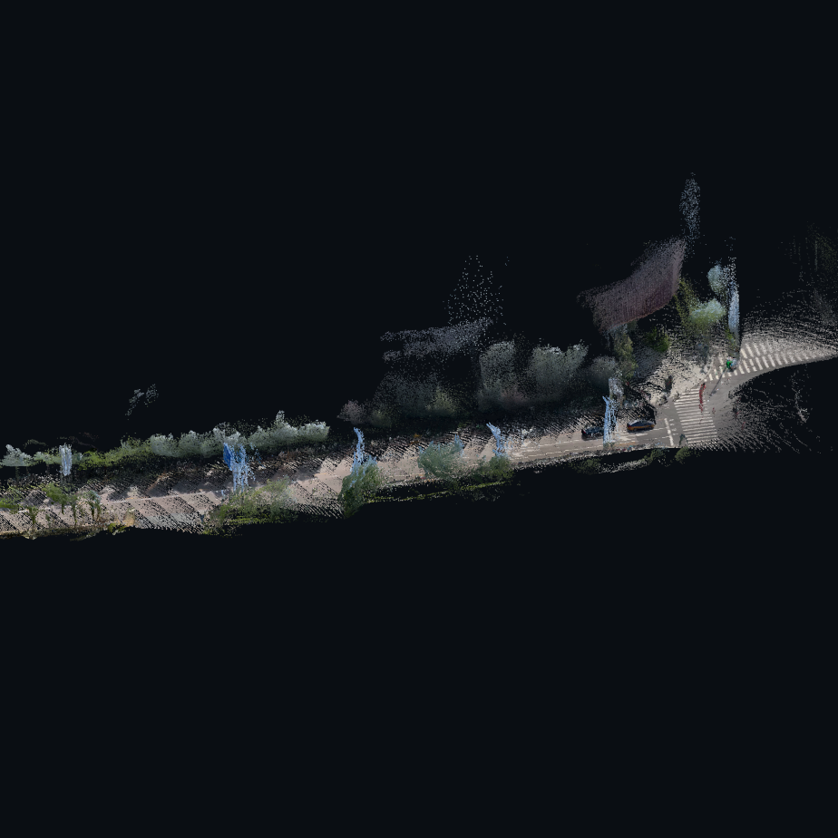
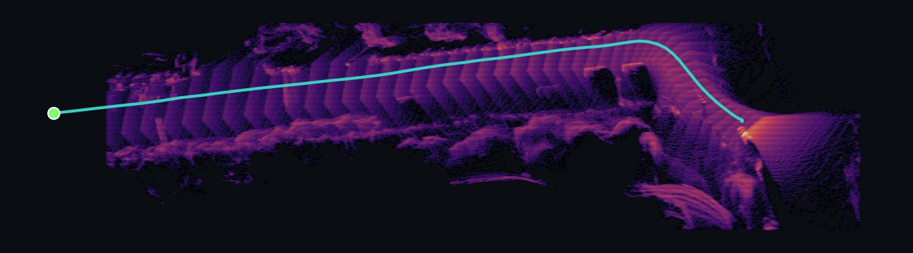
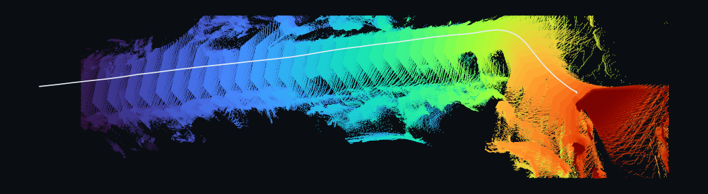

# ABot-Recon-Axera 部署指南

ABot-Recon-Axera 用于图像三维重建。本页说明 M.2 算力卡的接入条件、部署步骤与结果检查方法。

> 已实测，效果仍需评估。[查看部署效果](#查看部署效果)。

## 准备运行环境

本页效果展示使用 **RK3576 + AX8850 16GB M.2**；其他容量或平台需重新确认模型能否加载并正确运行。

在连接算力卡的 Linux 主机终端执行，RK3576 使用 ARM64 环境。首次部署先完成[驱动与设备检查](../../usage/device-check.md)、[准备主机环境](../../getting-started/prepare.md)和[下载工具安装](../../usage/download-models.md#使用-hugging-face-下载)。已完成这些步骤可直接下载模型。

后文使用设备 0，运行前用 `axcl-smi` 确认设备可用。

## 下载模型与样例

本页使用 `AXERA-TECH/ABot-Recon-Axera` 的固定版本。下面下载本页选用的 13 个文件。

```bash
MODEL_DIR=~/edgeaccel/models/abot-recon-axera/fbe73fc5686c
mkdir -p "$MODEL_DIR"
~/edgeaccel/hf-env/bin/hf download AXERA-TECH/ABot-Recon-Axera \
  --include "LICENSE" "MODEL_LICENSE.md" "MODEL_USAGE_GUIDELINES.md" "MODEL_USAGE_GUIDELINES_ZH.md" "NOTICE" "README.md" "THIRD_PARTY_NOTICES.md" "config.json" "decoder_step_kitti02.axmodel" "encoder_kitti02.axmodel" "heads_kitti02.axmodel" "host_pose_head/pose_head.safetensors" "host_pose_head/pose_head_config.json" \
  --revision fbe73fc5686c6c0ed2af5255272cf3ebf248da58 \
  --local-dir "$MODEL_DIR"
cd "$MODEL_DIR"
```

保留当前终端中的 `MODEL_DIR` 变量，后续命令沿用此目录。下载受阻或需要离线复制时，见[下载方式与文件校验](../../usage/download-models.md)。

## 准备视频重建程序

本例在 ARM64 Linux 主机连接 M.2 算力卡，使用三套编译模型从视频生成相机轨迹、点云和重建图片。NPU 执行编码器、逐帧解码器和输出头；主机执行视频解码、位姿头与后处理。

下载[固定版本源码与视频样例](../../../static/examples/abot-recon-native-20261001.tar.gz)，保存到 Linux 主机的 `~/edgeaccel`。源码对应官方 `AXERA-TECH/ABot-Recon-Axera` 提交 `30407e2129898050056e996285c110e12144cc9a`。在前文下载模型的同一终端执行：

```bash
cd ~/edgeaccel
tar -xzf abot-recon-native-20261001.tar.gz
source ~/edgeaccel/python-env/bin/activate
sudo apt-get install -y build-essential
python -m pip install 'numpy==1.26.4' 'cffi==2.1.1' 'Pillow==11.3.0' \
  'opencv-python-headless==4.11.0.86' 'matplotlib==3.10.8'
python -c "import axengine; print('PyAXEngine 已安装')"
```

PyAXEngine 使用已安装 AXCL 对应的 SDK 包，安装方法见 [Python 接口](../../usage/python.md)。首次运行会编译预处理 C 库。本例使用 CPU 解码视频，未启用硬件视频解码。

模型权重的 `MODEL_LICENSE.md` 标注为 CC BY-NC 4.0；源码许可证与模型权重许可证分别适用。具体使用条件见下载目录中的许可证与用途说明。

## 设置算力卡与权重路径

保留前文的 `MODEL_DIR`，明确指定 AXCL 设备 0：

```bash
export ABOT_DEVICE=axcl
export ABOT_DEVICE_ID=0
export ABOT_RUNNER=native
export ABOT_DECODER=cv2
export ABOT_MODELS="$MODEL_DIR"
export ABOT_MODEL_SUFFIX=_kitti02
export ABOT_POSE_WEIGHTS="$MODEL_DIR/host_pose_head/pose_head.safetensors"
export ABOT_POSE_CONFIG="$MODEL_DIR/host_pose_head/pose_head_config.json"
export OMP_NUM_THREADS=2
export OPENBLAS_NUM_THREADS=2
export MPLBACKEND=Agg
cd ~/edgeaccel/abot-recon-native
```

模型目录应包含 `encoder_kitti02.axmodel`、`decoder_step_kitti02.axmodel`、`heads_kitti02.axmodel` 和 `host_pose_head`。运行包不包含权重，需先完成本页下载步骤。

## 从完整视频生成点云

输入为上游演示视频，约 31 秒，960×544。`--fps 2` 设置抽帧率，不表示推理能达到实时 2fps。输出使用新的目录名：

```bash
python -m service.mapping_pipeline \
  fixtures/demo0.mp4 ~/edgeaccel/results/abot-recon-01 --fps 2
```

程序应显示 `axcl-native` 推理进度，依次处理采样帧。运行完成后检查：

```bash
python - <<'PY'
import json
from pathlib import Path
root = Path.home() / 'edgeaccel/results/abot-recon-01'
meta = json.loads((root / 'meta.json').read_text())
assert meta['frames'] > 0 and meta['cloud_points'] > 0 and meta['splats'] > 0
for name in ['cloud.ply', 'splats.ply', 'floorplan.png', 'view_ob.png', 'view_top.png']:
    assert (root / name).stat().st_size > 0
print(json.dumps(meta, ensure_ascii=False, indent=2))
PY
```

## 查看重建文件

将输出目录复制到桌面主机，直接打开三张 PNG 图片。需要交互查看时，可将 PLY 文件导入支持该格式的三维查看工具。

| 文件 | 内容 |
| --- | --- |
| `view_ob.png` | 使用视频原始颜色的点云斜视图 |
| `floorplan.png` | 点云密度俯视图与相机轨迹 |
| `view_top.png` | 按采样时间着色的俯视点云 |
| `cloud.ply` | RGB 点云 |
| `splats.ply` | 官方后处理生成的 Gaussian splat 数据 |
| `recon.npz` | 相机轨迹与位姿 |
| `meta.json` | 帧数、点数和处理耗时 |

这些图片展示单目模型重建结果，不是测量标定后的户型图。实际几何精度、尺度、闭环漂移和弱纹理场景需要结合参考数据评估。

## 更换输入视频

将命令中的 `fixtures/demo0.mp4` 改为自己的视频路径，并指定新的输出目录。模型输入为 280×504，优先使用横向视频；竖向输入会裁掉较多边缘内容。增加视频长度或抽帧率会增加帧数、内存和处理时间，先用短片确认结果。

本节覆盖离线视频生成重建文件。官方 Web 上传、交互三维界面和硬件视频解码需要分别验证。


## 查看部署效果

**已运行，效果仍需评估** · RK3576 + AX8850 16GB M.2。以下输入与输出来自本页固定版本的实际运行。

已在 16GB M.2 算力卡处理完整样例视频，生成相机位姿、RGB 点云、Gaussian splat 数据及三张重建视图。

**完整视频：相机轨迹与点云重建**

输入为约 31 秒的城市道路视频。实际重建中可辨认道路延伸、路口及两侧树木和建筑轮廓；俯视图显示连续前进后转弯的相机轨迹。远处结构不完整，点云仍可见条带重影和空洞。以下图片为官方后处理的原始输出，未手工修补；几何精度尚无独立基准核验。

<div className="model-effect-gallery">

<figure>

[](../../../static/validation/effects/abot-recon-axera-20261001/view_ob.png)

<figcaption>实际重建：RGB 点云斜视图</figcaption>
</figure>

<figure>

[](../../../static/validation/effects/abot-recon-axera-20261001/floorplan.png)

<figcaption>实际重建：点云密度与相机轨迹</figcaption>
</figure>

<figure>

[](../../../static/validation/effects/abot-recon-axera-20261001/view_top.png)

<figcaption>实际重建：按采样时间着色的俯视图</figcaption>
</figure>

</div>

| 输入时长 | 采样帧数 | AXCL 调用 | RGB 点云点数 | Gaussian splat 数 |
| --- | --- | --- | --- | --- |
| 31.033 s | 60 | 180 | 531664 | 531664 |

| 重建流程耗时 | 含校验的总耗时 | 视频解码 |
| --- | --- | --- |
| 282.9 s | 440.031 s | cv2 |

本次完整输入视频：上游演示样例

<video className="model-effect-video" controls playsInline preload="metadata" src="/validation/effects/abot-recon-axera-20261001/abot-tested-input.mp4" aria-label="本次完整输入视频：上游演示样例"></video>

[下载视频](../../../static/validation/effects/abot-recon-axera-20261001/abot-tested-input.mp4)

**使用时注意：**

- 本次为 16GB 卡的离线重建；真实 8GB、Web 上传、交互三维界面、硬件视频解码和长时间运行尚未验证。
- 结果为单目模型估计，没有对应真实位姿或三维扫描作精度基准；不作为精确测量、标定户型图或稳定闭环证明。

这些结果用于对照部署后的输出，未覆盖完整数据集精度或长期连续运行。

<details>
<summary>查看样例环境与运行耗时</summary>

环境：RK3576 + AX8850 16GB M.2。模型版本：`fbe73fc5686c6c0ed2af5255272cf3ebf248da58`。

| 组件 | 版本或配置 |
| --- | --- |
| 主机 / 内核 | RK3576，约 4GB RAM，6.1.115-vendor-rk35xx |
| AXCL / 驱动 | V3.16.0_20260729180218 |
| 固件 / CMM | V3.16.0 / 15232 MiB |
| 运行方式 | 官方固定版本 NumPy + 原生 AXCL C API；CPU 视频解码与位姿头 |

| 指标 | 实测值 | 计时或统计范围 |
| --- | --- | --- |
| 模型链路 | 3 个 AXModel | 编码器、逐帧解码器、输出头均使用原生 AXCL；位姿头与后处理在主机执行。 |
| 视频覆盖 | 60 个采样帧 | 完整视频按 2fps 设置抽帧；抽帧率不等于推理速度。 |
| 调用总数 | 180 次 | 每个采样帧依次执行三个模型，检查最终输出及设备缓存计数。 |

适用范围：

- 逐帧检查输出头张量及最终位姿、点云、置信度；设备端中间 KV 张量未完整回读，不声明所有中间张量均已核验。
- 视图由官方后处理生成，Gaussian splat 文件不是训练完成的场景模型。
- 模型权重声明为 CC BY-NC 4.0，请分别查看模型权重和源码许可证。
- 重建流程耗时包含视频解码、NPU 推理和主机后处理；含校验总耗时另含加载、校验与记录。

</details>

遇到加载、内存或后端错误时，按[常见问题](../../usage/troubleshooting.md)处理。需要更换输入或接入业务时，按[检查输出与记录结果](../../reference/validation.md)保留自己的结果。

<details>
<summary>查看文件用途与版本信息</summary>

| 文件 / 目录内路径 | 用途 |
| --- | --- |
| [`decoder_step_kitti02.axmodel`](https://huggingface.co/AXERA-TECH/ABot-Recon-Axera/blob/fbe73fc5686c6c0ed2af5255272cf3ebf248da58/decoder_step_kitti02.axmodel) | 编译模型；按目录区分芯片和规格 |
| [`encoder_kitti02.axmodel`](https://huggingface.co/AXERA-TECH/ABot-Recon-Axera/blob/fbe73fc5686c6c0ed2af5255272cf3ebf248da58/encoder_kitti02.axmodel) | 编译模型；按目录区分芯片和规格 |
| [`heads_kitti02.axmodel`](https://huggingface.co/AXERA-TECH/ABot-Recon-Axera/blob/fbe73fc5686c6c0ed2af5255272cf3ebf248da58/heads_kitti02.axmodel) | 编译模型；按目录区分芯片和规格 |
| [`config.json`](https://huggingface.co/AXERA-TECH/ABot-Recon-Axera/blob/fbe73fc5686c6c0ed2af5255272cf3ebf248da58/config.json) | 运行配置 |
| [`host_pose_head/pose_head_config.json`](https://huggingface.co/AXERA-TECH/ABot-Recon-Axera/blob/fbe73fc5686c6c0ed2af5255272cf3ebf248da58/host_pose_head/pose_head_config.json) | 运行配置 |

仓库提交：`fbe73fc5686c6c0ed2af5255272cf3ebf248da58`。仓库中的 3 个 `.axmodel` 文件可能包括多个芯片、规格和分片。运行时使用本页指定的配套文件，完整列表见[固定版本目录](https://huggingface.co/AXERA-TECH/ABot-Recon-Axera/tree/fbe73fc5686c6c0ed2af5255272cf3ebf248da58)。

</details>

<details>
<summary>补充说明与版本差异</summary>

- 用于三维重建。核对输入视角顺序与输出坐标系，并使用有参考尺寸的样本检查几何比例。

</details>

## 参考资料

- [常用术语](../../reference/glossary.md)：AXCL、CMM、分词器与推理指标。
- [固定版本文件表](https://huggingface.co/AXERA-TECH/ABot-Recon-Axera/tree/fbe73fc5686c6c0ed2af5255272cf3ebf248da58)。
- [模型卡 / 使用说明](https://huggingface.co/AXERA-TECH/ABot-Recon-Axera/blob/fbe73fc5686c6c0ed2af5255272cf3ebf248da58/README.md)。
- [配套项目：AXERA-TECH/ABot-Recon-Axera](https://github.com/AXERA-TECH/ABot-Recon-Axera)。
- [配套项目：AXERA-TECH/ABot-Recon-Axera.git](https://github.com/AXERA-TECH/ABot-Recon-Axera.git)。
- [配套项目：amap-cvlab/ABot-Recon](https://github.com/amap-cvlab/ABot-Recon)。

返回[完整模型目录](../catalog.mdx)。
