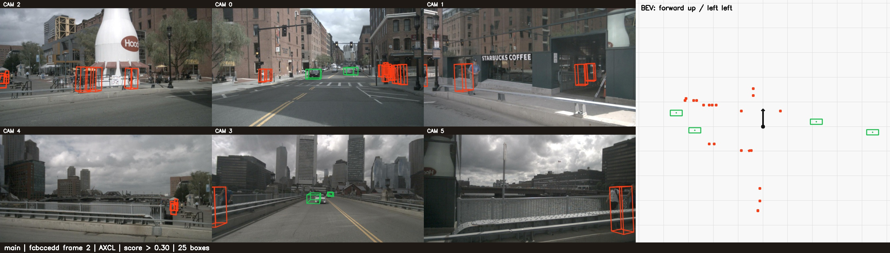
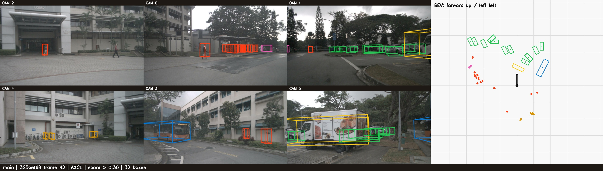

# bevformer 部署指南

bevformer 用于目标检测。本页说明 M.2 算力卡的接入条件、部署步骤与结果检查方法。

> 已实测，效果仍需评估。[查看部署效果](#查看部署效果)。

## 准备运行环境

本页效果展示使用 **RK3576 + AX8850 16GB M.2**；其他容量或平台需重新确认模型能否加载并正确运行。

在连接算力卡的 Linux 主机终端执行，RK3576 使用 ARM64 环境。首次部署先完成[驱动与设备检查](../../usage/device-check.md)、[安装 PyAXEngine](../../usage/python.md)和[下载工具安装](../../usage/download-models.md#使用-hugging-face-下载)。已完成这些步骤可直接下载模型。

后文使用设备 0，运行前用 `axcl-smi` 确认设备可用。

## 下载模型与样例

本页使用 `AXERA-TECH/bevformer` 的固定版本。下面下载本页选用的 50 个文件。

```bash
MODEL_DIR=~/edgeaccel/models/bevformer/b5f3bf44f743
mkdir -p "$MODEL_DIR"
~/edgeaccel/hf-env/bin/hf download AXERA-TECH/bevformer \
  "README.md" \
  "config.json" \
  "inference_config.json" \
  "inference_axmodel.py" \
  "inference_onnx.py" \
  "ax650/compiled.axmodel" \
  "bevformer_tiny_fixed.onnx" \
  "inference_data/scene_index.json" \
  "inference_data/fcbccedd61424f1b85dcbf8f897f9754/meta_000000.json" \
  "inference_data/fcbccedd61424f1b85dcbf8f897f9754/cam_00_000000.png" \
  "inference_data/fcbccedd61424f1b85dcbf8f897f9754/cam_01_000000.png" \
  "inference_data/fcbccedd61424f1b85dcbf8f897f9754/cam_02_000000.png" \
  "inference_data/fcbccedd61424f1b85dcbf8f897f9754/cam_03_000000.png" \
  "inference_data/fcbccedd61424f1b85dcbf8f897f9754/cam_04_000000.png" \
  "inference_data/fcbccedd61424f1b85dcbf8f897f9754/cam_05_000000.png" \
  "inference_data/fcbccedd61424f1b85dcbf8f897f9754/meta_000001.json" \
  "inference_data/fcbccedd61424f1b85dcbf8f897f9754/cam_00_000001.png" \
  "inference_data/fcbccedd61424f1b85dcbf8f897f9754/cam_01_000001.png" \
  "inference_data/fcbccedd61424f1b85dcbf8f897f9754/cam_02_000001.png" \
  "inference_data/fcbccedd61424f1b85dcbf8f897f9754/cam_03_000001.png" \
  "inference_data/fcbccedd61424f1b85dcbf8f897f9754/cam_04_000001.png" \
  "inference_data/fcbccedd61424f1b85dcbf8f897f9754/cam_05_000001.png" \
  "inference_data/fcbccedd61424f1b85dcbf8f897f9754/meta_000002.json" \
  "inference_data/fcbccedd61424f1b85dcbf8f897f9754/cam_00_000002.png" \
  "inference_data/fcbccedd61424f1b85dcbf8f897f9754/cam_01_000002.png" \
  "inference_data/fcbccedd61424f1b85dcbf8f897f9754/cam_02_000002.png" \
  "inference_data/fcbccedd61424f1b85dcbf8f897f9754/cam_03_000002.png" \
  "inference_data/fcbccedd61424f1b85dcbf8f897f9754/cam_04_000002.png" \
  "inference_data/fcbccedd61424f1b85dcbf8f897f9754/cam_05_000002.png" \
  "inference_data/325cef682f064c55a255f2625c533b75/meta_000040.json" \
  "inference_data/325cef682f064c55a255f2625c533b75/cam_00_000040.png" \
  "inference_data/325cef682f064c55a255f2625c533b75/cam_01_000040.png" \
  "inference_data/325cef682f064c55a255f2625c533b75/cam_02_000040.png" \
  "inference_data/325cef682f064c55a255f2625c533b75/cam_03_000040.png" \
  "inference_data/325cef682f064c55a255f2625c533b75/cam_04_000040.png" \
  "inference_data/325cef682f064c55a255f2625c533b75/cam_05_000040.png" \
  "inference_data/325cef682f064c55a255f2625c533b75/meta_000041.json" \
  "inference_data/325cef682f064c55a255f2625c533b75/cam_00_000041.png" \
  "inference_data/325cef682f064c55a255f2625c533b75/cam_01_000041.png" \
  "inference_data/325cef682f064c55a255f2625c533b75/cam_02_000041.png" \
  "inference_data/325cef682f064c55a255f2625c533b75/cam_03_000041.png" \
  "inference_data/325cef682f064c55a255f2625c533b75/cam_04_000041.png" \
  "inference_data/325cef682f064c55a255f2625c533b75/cam_05_000041.png" \
  "inference_data/325cef682f064c55a255f2625c533b75/meta_000042.json" \
  "inference_data/325cef682f064c55a255f2625c533b75/cam_00_000042.png" \
  "inference_data/325cef682f064c55a255f2625c533b75/cam_01_000042.png" \
  "inference_data/325cef682f064c55a255f2625c533b75/cam_02_000042.png" \
  "inference_data/325cef682f064c55a255f2625c533b75/cam_03_000042.png" \
  "inference_data/325cef682f064c55a255f2625c533b75/cam_04_000042.png" \
  "inference_data/325cef682f064c55a255f2625c533b75/cam_05_000042.png" \
  --revision b5f3bf44f7430371c77d7719edd6569fd772ad77 \
  --local-dir "$MODEL_DIR"
cd "$MODEL_DIR"
```

保留当前终端中的 `MODEL_DIR` 变量，后续命令沿用此目录。下载受阻或需要离线复制时，见[下载方式与文件校验](../../usage/download-models.md)。

## 安装模型运行依赖

本页在 RK3576 主机上通过 AXCL 调用 AX8850 16GB M.2 算力卡，将六路相机图像转换为三维检测框和鸟瞰图（BEV）。模型使用前一帧的 BEV 特征，因此同一场景应按帧顺序运行，切换场景时清空历史状态。

保留上方下载得到的 `$MODEL_DIR`，在 RK3576 主机执行：

```bash
source ~/edgeaccel/python-env/bin/activate
python -m pip install 'numpy==1.26.4' 'opencv-python-headless==4.11.0.86'
python -c "import axengine; print(axengine.get_available_providers())"
```

输出须包含 `AXCLRTExecutionProvider`。推理使用算力卡；图像处理、三维框解码和绘制使用主机 CPU。

## 检查模型与六路输入

| 文件 | 用途 |
| --- | --- |
| `ax650/compiled.axmodel` | 算力卡推理模型 |
| `inference_config.json` | 类别、BEV 大小和检测范围 |
| `inference_data/scene_index.json` | 官方场景和帧顺序 |
| `inference_data/<场景>/cam_00_*.png` 至 `cam_05_*.png` | 每帧六路图像 |
| `inference_data/<场景>/meta_*.json` | 相机投影矩阵、图像归一化参数和车辆状态 |
| `bevformer_tiny_fixed.onnx` | 官方浮点参考模型；不参与下面的算力卡推理 |

下载清单选取两个官方场景的前三帧：`fcbccedd…` 的 0、1、2 帧，以及 `325cef68…` 的 40、41、42 帧，共 36 张图像。原始索引包含 81 帧；示例明确只运行已下载的六帧，不修改索引。

每次推理输入包括 `1×6×3×480×800` 图像、六个投影矩阵、18 维车辆状态和 `2500×1×256` 历史 BEV。自备数据时必须同时提供这些条件，不能只替换某一路图片。

## 运行三维检测

下载 [BEVFormer 算力卡示例包](../../../static/examples/bevformer-card-example.zip)，保存到 `~/edgeaccel/` 后执行：

```bash
mkdir -p ~/edgeaccel/bevformer-example
unzip ~/edgeaccel/bevformer-card-example.zip -d ~/edgeaccel/bevformer-example
python ~/edgeaccel/bevformer-example/bevformer_card.py \
  --model-dir "$MODEL_DIR" \
  --output ~/edgeaccel/results/bevformer-01 \
  --repeat
```

输出目录须尚不存在。程序先核对下载文件 SHA256，再运行两个场景各三帧，最后清空历史状态并重复第一个场景的三帧。

只检查第一帧时，使用另一个输出目录并将 `--repeat` 改为 `--first-only`。默认不加这两个参数时，运行两个场景的六帧。

## 查看六路画面与鸟瞰图

`deployment-result.json` 中的 `completed` 应为 `true`，输出目录包含：

| 文件 | 内容 |
| --- | --- |
| `main-fcbccedd-000000.jpg` 至 `000002.jpg` | 第一个场景的连续三帧 |
| `main-325cef68-000040.jpg` 至 `000042.jpg` | 第二个场景的连续三帧 |
| `repeat-fcbccedd-000000.jpg` 至 `000002.jpg` | 重复运行第一个场景 |
| 同名 `.json` | 检测类别、分数、三维框、投影线段和耗时 |
| 同名 `.npz` | 实际模型输入与原始输出 |

将 JPG 复制到桌面主机查看。左侧为六路相机画面，上排依次为 CAM 2、0、1，下排为 CAM 4、3、5；右侧为鸟瞰图，前方朝上、左侧朝左，黑色箭头表示车辆朝向。

示例使用固定分数阈值 **大于 0.30** 和按类别设置半径的圆形 NMS。绿色为汽车，红色为行人；完整类别和颜色定义见示例中的 `COLORS` 与配置 `class_names`。三维框按原始 LiDAR 坐标定义绘制，保留模型输出的尺寸和方向；跨越相机近裁剪面的框先裁剪再投影。

本次六帧分别检出 **22、34、25、18、29、32** 个目标。重复三帧的模型输入输出、检测框及投影结果与首次运行一致。图片上的框不代表每个目标均已通过标注核验。

## 对照部署效果

下方图片和短片均来自本次算力卡输出。短片每个包含三帧，按 3 FPS 播放，播放速度不等于实时处理速度。

本次算力卡单次调用约 191–212 ms；包括图像读取、后处理、原始张量保存和图片写入的流程约 4.50–5.35 秒/帧。两种耗时范围不同。

使用仓库 FP32 ONNX 在桌面 CPU 上进行了同输入对照和独立时序对照。检测数量及部分框与量化模型存在差异，当前仅确认基本部署、数据流和重复性；尚未完成 nuScenes 全量精度、长序列稳定性或实际 8GB 卡回归。


## 查看部署效果

**已运行，效果仍需评估** · RK3576 + AX8850 16GB M.2。以下输入与输出来自本页固定版本的实际运行。

完成两个场景六帧三维检测和三帧重复，展示实际六路投影、BEV 画面与浮点模型对照差异。

**场景一：六路图像与三维检测**

运行官方场景 fcbccedd… 的第 0、1、2 帧。左侧为六路相机的实际框投影，右侧为同一批三维框的鸟瞰图；没有使用仓库预制结果。

<div className="model-effect-gallery">

<figure>

[](../../../static/validation/effects/bevformer-20260928/fcbccedd.jpg)

<figcaption>场景一最后一帧实际检测画面</figcaption>
</figure>

</div>

| 帧号 | 检测目标 | AXCL / ms | 含记录流程 / s |
| --- | --- | --- | --- |
| 0 | 22 | 197.935 | 4.574 |
| 1 | 34 | 194.736 | 5.312 |
| 2 | 25 | 211.753 | 5.349 |

场景一连续三帧，3 FPS 播放

<video className="model-effect-video" controls playsInline preload="metadata" src="/validation/effects/bevformer-20260928/fcbccedd.mp4" aria-label="场景一连续三帧，3 FPS 播放"></video>

[下载视频](../../../static/validation/effects/bevformer-20260928/fcbccedd.mp4)

**场景二：六路图像与三维检测**

运行官方场景 325cef68… 的第 40、41、42 帧。左侧为六路相机的实际框投影，右侧为同一批三维框的鸟瞰图；没有使用仓库预制结果。

<div className="model-effect-gallery">

<figure>

[](../../../static/validation/effects/bevformer-20260928/325cef68.jpg)

<figcaption>场景二最后一帧实际检测画面</figcaption>
</figure>

</div>

| 帧号 | 检测目标 | AXCL / ms | 含记录流程 / s |
| --- | --- | --- | --- |
| 40 | 18 | 192.352 | 4.519 |
| 41 | 29 | 194.040 | 5.230 |
| 42 | 32 | 193.262 | 5.267 |

场景二连续三帧，3 FPS 播放

<video className="model-effect-video" controls playsInline preload="metadata" src="/validation/effects/bevformer-20260928/325cef68.mp4" aria-label="场景二连续三帧，3 FPS 播放"></video>

[下载视频](../../../static/validation/effects/bevformer-20260928/325cef68.mp4)

**核对时序与重复性**

每个场景第一帧将历史 BEV 和位姿增量清零，后续帧接收前一帧的真实特征。清空状态后重复场景一，三帧的全部网络输入输出、检测框和投影结果均一致。

| 项目 | 结果 |
| --- | --- |
| 实际调用 | 6 帧 + 3 帧重复，共 9 次 |
| 分数阈值 | 固定大于 0.30 |
| 三维框绘制 | 保留原始尺寸与方向，按相机可见范围裁剪 |

**对照官方浮点模型**

桌面 CPU 使用同版本 FP32 ONNX，分别接收完全相同的输入，以及自身前一帧的 BEV 特征。下表保留实际差异。“同查询同类别”仅比较检测条目来源，不代表三维框精度或召回率通过。

| 场景 / 帧 | 算力卡目标 | 同输入 CPU | 独立时序 CPU | 同查询同类别 |
| --- | --- | --- | --- | --- |
| fcbccedd-000000 | 22 | 16 | 16 | 15 |
| fcbccedd-000001 | 34 | 38 | 38 | 32 |
| fcbccedd-000002 | 25 | 28 | 28 | 20 |
| 325cef68-000040 | 18 | 20 | 20 | 14 |
| 325cef68-000041 | 29 | 29 | 29 | 26 |
| 325cef68-000042 | 32 | 30 | 30 | 26 |

**查看原始输出差异**

六帧同输入对照的张量余弦相似度如下。另对算力卡保留的输出编号逐个比较平面位置：每帧的最大差异为 1.54～2.27 米。因此整体张量相似度不能代替三维框位置核对。位置比较采用每帧同一组输出编号，不要求 CPU 也保留该框；编号对应不等于真实目标匹配，表中距离不是标注定位误差，也不是 mAP 或 NDS。 “同输入”和“独立时序”列均比较算力卡与 CPU；最后一列只比较两次 CPU 输出，二者分别使用算力卡历史特征和 CPU 自身历史特征。两个场景首帧均从零状态开始，两种 CPU 结果完全一致；后续四帧仅切换历史特征时最大变化为 2.218 毫米。此结论只覆盖当前六帧，完整序列仍需验证。

| 输出 | 余弦相似度范围 |
| --- | --- |
| bev_embed | 0.939341–0.962542 |
| outputs_classes | 0.996759–0.998424 |
| outputs_coords | 0.999083–0.999327 |

| 帧号 | 输出编号数 | 同输入平均差 / m | 同输入最大差 / m | 独立时序最大差 / m | 仅切换历史特征最大变化 / mm |
| --- | --- | --- | --- | --- | --- |
| 0 | 22 | 0.784 | 1.959 | 1.959 | 0.000 |
| 1 | 34 | 0.723 | 1.837 | 1.837 | 2.218 |
| 2 | 25 | 0.748 | 1.539 | 1.539 | 1.251 |
| 40 | 18 | 1.078 | 1.832 | 1.832 | 0.000 |
| 41 | 29 | 1.062 | 1.953 | 1.953 | 0.980 |
| 42 | 32 | 1.048 | 2.268 | 2.268 | 0.492 |

**使用时注意：**

- FP32 对照的目标数量和部分框存在差异，尚未完成 nuScenes 标注精度、mAP 或 NDS 评估。
- 仅测试两个场景各三帧，不代表完整 81 帧或长序列稳定性。3 FPS 为短片播放速度。

这些结果用于对照部署后的输出，未覆盖完整数据集精度或长期连续运行。

<details>
<summary>查看样例环境与运行耗时</summary>

环境：RK3576 + AX8850 16GB M.2。模型版本：`b5f3bf44f7430371c77d7719edd6569fd772ad77`。

| 组件 | 版本或配置 |
| --- | --- |
| 主机 / 内核 | RK3576，约 4GB RAM，6.1.115-vendor-rk35xx |
| AXCL / 驱动 | V3.16.0_20260729180218 |
| 固件 / CMM | V3.16.0 / 15232 MiB |
| Python 推理 | Python 3.12 / PyAXEngine 0.1.3.rc3 / NumPy 1.26.4 / AXCLRTExecutionProvider |

| 指标 | 实测值 | 计时或统计范围 |
| --- | --- | --- |
| 实际输入 | 两个场景，各三帧 | 官方 81 帧中的 0、1、2 和 40、41、42 帧；另重复第一个场景。 |
| 单次 AXCL 调用 | 191–212 ms | 9 次 session.run，不含前后处理和证据保存。 |
| 重复性 | 三帧输入输出及检测结果一致 | 每次从零历史状态开始。 |

适用范围：

- 本次为 AX8850 16GB 实测，实际 8GB 卡需另行回归。

</details>

遇到加载、内存或后端错误时，按[常见问题](../../usage/troubleshooting.md)处理。需要更换输入或接入业务时，按[检查输出与记录结果](../../reference/validation.md)保留自己的结果。

<details>
<summary>查看文件用途与版本信息</summary>

| 文件 / 目录内路径 | 用途 |
| --- | --- |
| [`inference_axmodel.py`](https://huggingface.co/AXERA-TECH/bevformer/blob/b5f3bf44f7430371c77d7719edd6569fd772ad77/inference_axmodel.py) | Python 程序 / 前后处理 |
| [`ax650/compiled.axmodel`](https://huggingface.co/AXERA-TECH/bevformer/blob/b5f3bf44f7430371c77d7719edd6569fd772ad77/ax650/compiled.axmodel) | 编译模型；按目录区分芯片和规格 |
| [`config.json`](https://huggingface.co/AXERA-TECH/bevformer/blob/b5f3bf44f7430371c77d7719edd6569fd772ad77/config.json) | 运行配置 |
| [`inference_config.json`](https://huggingface.co/AXERA-TECH/bevformer/blob/b5f3bf44f7430371c77d7719edd6569fd772ad77/inference_config.json) | 运行配置 |

仓库提交：`b5f3bf44f7430371c77d7719edd6569fd772ad77`。仓库中的 1 个 `.axmodel` 文件可能包括多个芯片、规格和分片。运行时使用本页指定的配套文件，完整列表见[固定版本目录](https://huggingface.co/AXERA-TECH/bevformer/tree/b5f3bf44f7430371c77d7719edd6569fd772ad77)。

</details>

<details>
<summary>补充说明与版本差异</summary>

- 这是多摄像头三维感知链路，输入含多视角图像与标定、时间信息。必须保留 inference_config 和配套输入数据，不能按单张 YOLO 图片部署。

</details>

## 参考资料

- [常用术语](../../reference/glossary.md)：AXCL、CMM、分词器与推理指标。
- [固定版本文件表](https://huggingface.co/AXERA-TECH/bevformer/tree/b5f3bf44f7430371c77d7719edd6569fd772ad77)。
- [模型卡 / 使用说明](https://huggingface.co/AXERA-TECH/bevformer/blob/b5f3bf44f7430371c77d7719edd6569fd772ad77/README.md)。
- [主要程序入口：inference_axmodel.py](https://huggingface.co/AXERA-TECH/bevformer/blob/b5f3bf44f7430371c77d7719edd6569fd772ad77/inference_axmodel.py)。

返回[完整模型目录](../catalog.mdx)。
