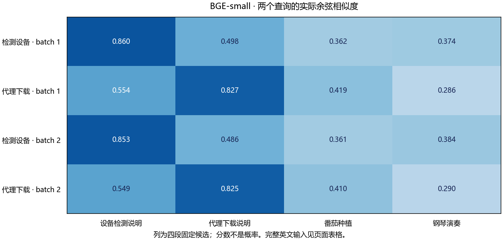

# bge-small-en-v1.5 部署指南

bge-small-en-v1.5 用于文本向量检索。本页说明 M.2 算力卡的接入条件、部署步骤与结果检查方法。

> 已实测，效果仍需评估。[查看部署效果](#查看部署效果)。

## 准备运行环境

本页效果展示使用 **RK3576 + AX8850 16GB M.2**；其他容量或平台需重新确认模型能否加载并正确运行。

在连接算力卡的 Linux 主机终端执行，RK3576 使用 ARM64 环境。首次部署先完成[驱动与设备检查](../../usage/device-check.md)、[安装 PyAXEngine](../../usage/python.md)和[下载工具安装](../../usage/download-models.md#使用-hugging-face-下载)。已完成这些步骤可直接下载模型。

后文使用设备 0，运行前用 `axcl-smi` 确认设备可用。

## 下载模型与样例

本页使用 `AXERA-TECH/bge-small-en-v1.5` 的固定版本。下面下载本页选用的 7 个文件。

```bash
MODEL_DIR=~/edgeaccel/models/bge-small-en-v1-5/7a15f5aa8ecb
mkdir -p "$MODEL_DIR"
~/edgeaccel/hf-env/bin/hf download AXERA-TECH/bge-small-en-v1.5 \
  "README.md" \
  "model/bge-small-en-v1.5.onnx" \
  "model/bge-small-en-v1.5_b2.onnx" \
  "model/bge-small-en-v1.5_b2_u16_npu3.axmodel" \
  "model/bge-small-en-v1.5_u16_npu3.axmodel" \
  "python/axmodel_infer.py" \
  "python/onnx_infer.py" \
  --revision 7a15f5aa8ecb76e1f87c4e8e6c9c73f87d33f7b4 \
  --local-dir "$MODEL_DIR"
cd "$MODEL_DIR"
```

保留当前终端中的 `MODEL_DIR` 变量，后续命令沿用此目录。下载受阻或需要离线复制时，见[下载方式与文件校验](../../usage/download-models.md)。

## 准备分词器与运行环境

本例在 **RK3576 + AX8850 16GB M.2** 上运行英文文本向量模型，覆盖官方 batch 1 和 batch 2 两份权重。算力卡负责生成向量，主机完成分词、归一化和相似度计算；同目录中的 ONNX 文件用于 CPU 参考对照。

在已安装 PyAXEngine 的 Python 环境中执行：

```bash
python -m pip install 'numpy==1.26.4' 'transformers==4.51.3' 'onnxruntime==1.20.1'
python -c "import axengine; print(axengine.get_available_providers())"
axcl-smi
```

确认提供者列表包含 `AXCLRTExecutionProvider`。本例使用 PyAXEngine `0.1.3.rc3`，下载约 413 MB 模型和参考文件。

官方 AXERA 示例使用 BAAI 分词器。单独下载下面的固定版本，保留当前终端中的 `TOKENIZER_DIR`：

```bash
TOKENIZER_DIR=~/edgeaccel/tokenizers/bge-small-en-v1.5/5c38ec7c405e
~/edgeaccel/hf-env/bin/hf download BAAI/bge-small-en-v1.5 \
  config.json special_tokens_map.json tokenizer.json tokenizer_config.json vocab.txt \
  --revision 5c38ec7c405ec4b44b94cc5a9bb96e735b38267a \
  --local-dir "$TOKENIZER_DIR"
```

无需下载 BAAI 仓库中的 PyTorch 权重。本例以 AXERA 提供的 ONNX 为参考，不能据此直接代表原始 PyTorch 模型的精度。

## 运行句子相似度与文本检索

下载 [BGE-small 算力卡示例](../../../static/examples/bge_small_card.py)，保存为 `~/edgeaccel/bge_small_card.py`。沿用前面的 `MODEL_DIR` 与 `TOKENIZER_DIR`，指定尚不存在的输出目录：

```bash
python ~/edgeaccel/bge_small_card.py \
  --model-dir "$MODEL_DIR" \
  --tokenizer-dir "$TOKENIZER_DIR" \
  --output ~/edgeaccel/results/bge-small-01
```

程序对 8 条英文文本分别执行 batch 1 和 batch 2 推理，并运行对应 ONNX 对照。每条输入补齐至 512 个 token，输出中取第一个 token 的 384 维向量，再进行 L2 归一化。余弦相似度越高，表示这组向量越接近；分数不是概率或准确率。

示例先比较 `I really love math` 与 `I pretty like mathematics`，再用两个问题检索四段候选文本：

- 如何检查算力卡是否被识别？候选包含设备检查、代理下载、植物养护和音乐内容。
- 如何通过代理下载模型？使用同一组候选，观察最高分是否转向代理下载说明。

本例沿用官方 CLS 池化方法，没有给问题追加检索指令前缀。修改脚本中的 `TEXTS` 可更换文本；当前批处理与表格索引按 8 条固定样例组织，修改时需同步调整查询和候选索引。超过 512 个 token 的文本应先分段，程序不会静默截断。

## 查看检索结果

| 文件或字段 | 内容 |
| --- | --- |
| `deployment-result.json` | 原始文本、token、两份权重的实际调用、检索排序与参考误差 |
| `variants` | batch 1、batch 2 各自的相似度与候选排序 |
| `sessions` / `cpuSessions` | 分别记录算力卡与 CPU 参考调用，不混记耗时 |
| `embeddings.npz` | 四组归一化向量与实际输入 token，可用于复核分数 |

下方展示本次实际分数。耗时为 `session.run` 墙钟时间，包含 AXCL 数据传输，不含模型加载、分词、归一化和文件保存；batch 2 一次处理两条，不能直接把其整批耗时当作单条延迟。

这里仅检查少量英文文本的运行和排序。业务检索仍需使用真实问题、相似干扰项、长文本及召回率指标评估，真实 8GB 卡另行回归。


## 查看部署效果

**已运行，效果仍需评估** · RK3576 + AX8850 16GB M.2。以下输入与输出来自本页固定版本的实际运行。

两个英文问题在 batch 1 和 batch 2 下均将预期答案排在首位，完整候选顺序与 CPU ONNX 相同。新增热力图展示实际分数；八条文本仅 6–20 个 token，长文本、位置交换和更难候选仍待验证。

**英文相似度与双批量检索**

8条固定英文文本分别按batch 1和batch 2运行。两个问题的最高分均对应相关说明，两份AXMODEL的完整候选顺序也与各自CPU ONNX参考一致。表内为实际余弦相似度，不是概率。 热力图以候选主题作列名，完整英文文本保留在下表。当前八条文本含特殊符号共 6–20 个 token，远未达到 512-token 上限；两种批量均命中不代表批次位置交换或长文档边界已经验证。

<div className="model-effect-gallery">

<figure>

[](../../../static/validation/effects/bge-small-en-v1-5-20260928/bge-small-retrieval.png)

<figcaption>实际查询与候选文本分数热力图（分数不是概率）</figcaption>
</figure>

</div>

| 相似句子 | batch 1 | batch 2 | CPU ONNX |
| --- | --- | --- | --- |
| I really love math / I pretty like mathematics | 0.883219 | 0.880684 | 0.877314 |

| How can I check whether my accelerator card is detected? | batch 1 | batch 2 | CPU ONNX |
| --- | --- | --- | --- |
| Run axcl-smi to list detected accelerator cards and check their device status. | 0.859970 | 0.853324 | 0.856149 |
| Set http_proxy and https_proxy to the proxy address before downloading model files. | 0.498207 | 0.485923 | 0.475008 |
| The pianist played a quiet melody at the concert. | 0.374062 | 0.384055 | 0.366667 |
| Tomatoes need regular watering and sunlight. | 0.362301 | 0.361241 | 0.352654 |

| How do I download a model through a proxy? | batch 1 | batch 2 | CPU ONNX |
| --- | --- | --- | --- |
| Set http_proxy and https_proxy to the proxy address before downloading model files. | 0.826789 | 0.824641 | 0.820785 |
| Run axcl-smi to list detected accelerator cards and check their device status. | 0.554015 | 0.549011 | 0.537072 |
| Tomatoes need regular watering and sunlight. | 0.419347 | 0.410221 | 0.405796 |
| The pianist played a quiet melody at the concert. | 0.285710 | 0.289548 | 0.279566 |

| 批量 | 调用次数 | 平均整批耗时 | 折算每条耗时 |
| --- | --- | --- | --- |
| 1 | 8 | 37.968 ms | 37.968 ms |
| 2 | 4 | 72.420 ms | 36.210 ms |

| 样例覆盖检查 | 本次范围 |
| --- | --- |
| 独立查询 / 候选文本 | 2 / 4 |
| 输入长度（含特殊 token） | 6–20 token；固定输入补齐至 512 |
| 预期答案首位命中 | batch 1：2/2；batch 2：2/2 |
| 首位与次位分差 | batch 1：0.361763 / 0.272774；batch 2：0.367401 / 0.275630 |
| 统计范围 | 相同两个问题在不同批量下运行，不计作四个独立问题 |

**使用时注意：**

- 当前仅验证8条英文文本和两个查询；尚未评估真实检索数据集、长文本、相似干扰项或召回率。
- AXMODEL与ONNX输出存在数值差异：当前相似度矩阵最大绝对差约0.028；相同候选排序不代表所有输入等价。

这些结果用于对照部署后的输出，未覆盖完整数据集精度或长期连续运行。

<details>
<summary>查看样例环境与运行耗时</summary>

环境：RK3576 + AX8850 16GB M.2。模型版本：`7a15f5aa8ecb76e1f87c4e8e6c9c73f87d33f7b4`。

| 组件 | 版本或配置 |
| --- | --- |
| 主机 / 内核 | RK3576，约 4GB RAM，6.1.115-vendor-rk35xx |
| AXCL / 驱动 | V3.16.0_20260729180218 |
| 固件 / CMM | V3.16.0 / 15232 MiB |
| Python 推理 | Python 3.12 / PyAXEngine 0.1.3.rc3 / NumPy 1.26.4 / AXCLRTExecutionProvider |

| 指标 | 实测值 | 计时或统计范围 |
| --- | --- | --- |
| 固定样例 | 8条文本 / 2个查询 / 4个候选 | 每份权重使用相同输入token、CLS池化和L2归一化。 |
| 向量与ONNX参考的余弦 | 0.991709–0.999629 | 8个归一化向量、两份权重；不表示业务准确率。 |

适用范围：

- batch 2每次处理两条，表中每条耗时是整批耗时除以2；不是单独请求的延迟。
- CPU对照来自AXERA固定仓库的ONNX，未与原始PyTorch权重对照；真实8GB卡与长期运行仍待验证。

</details>

遇到加载、内存或后端错误时，按[常见问题](../../usage/troubleshooting.md)处理。需要更换输入或接入业务时，按[检查输出与记录结果](../../reference/validation.md)保留自己的结果。

<details>
<summary>查看文件用途与版本信息</summary>

| 文件 / 目录内路径 | 用途 |
| --- | --- |
| [`python/axmodel_infer.py`](https://huggingface.co/AXERA-TECH/bge-small-en-v1.5/blob/7a15f5aa8ecb76e1f87c4e8e6c9c73f87d33f7b4/python/axmodel_infer.py) | Python 程序 / 前后处理 |
| [`model/bge-small-en-v1.5_b2_u16_npu3.axmodel`](https://huggingface.co/AXERA-TECH/bge-small-en-v1.5/blob/7a15f5aa8ecb76e1f87c4e8e6c9c73f87d33f7b4/model/bge-small-en-v1.5_b2_u16_npu3.axmodel) | 编译模型；按目录区分芯片和规格 |
| [`model/bge-small-en-v1.5_u16_npu3.axmodel`](https://huggingface.co/AXERA-TECH/bge-small-en-v1.5/blob/7a15f5aa8ecb76e1f87c4e8e6c9c73f87d33f7b4/model/bge-small-en-v1.5_u16_npu3.axmodel) | 编译模型；按目录区分芯片和规格 |
| [`config.json`](https://huggingface.co/AXERA-TECH/bge-small-en-v1.5/blob/7a15f5aa8ecb76e1f87c4e8e6c9c73f87d33f7b4/config.json) | 运行配置 |
| [`python/onnx_infer.py`](https://huggingface.co/AXERA-TECH/bge-small-en-v1.5/blob/7a15f5aa8ecb76e1f87c4e8e6c9c73f87d33f7b4/python/onnx_infer.py) | Python 程序 / 前后处理 |
| [`requirements.txt`](https://huggingface.co/AXERA-TECH/bge-small-en-v1.5/blob/7a15f5aa8ecb76e1f87c4e8e6c9c73f87d33f7b4/requirements.txt) | Python 依赖清单 |

仓库提交：`7a15f5aa8ecb76e1f87c4e8e6c9c73f87d33f7b4`。仓库中的 2 个 `.axmodel` 文件可能包括多个芯片、规格和分片。运行时使用本页指定的配套文件，完整列表见[固定版本目录](https://huggingface.co/AXERA-TECH/bge-small-en-v1.5/tree/7a15f5aa8ecb76e1f87c4e8e6c9c73f87d33f7b4)。

</details>

## 参考资料

- [常用术语](../../reference/glossary.md)：AXCL、CMM、分词器与推理指标。
- [固定版本文件表](https://huggingface.co/AXERA-TECH/bge-small-en-v1.5/tree/7a15f5aa8ecb76e1f87c4e8e6c9c73f87d33f7b4)。
- [模型卡 / 使用说明](https://huggingface.co/AXERA-TECH/bge-small-en-v1.5/blob/7a15f5aa8ecb76e1f87c4e8e6c9c73f87d33f7b4/README.md)。
- [主要程序入口：python/axmodel_infer.py](https://huggingface.co/AXERA-TECH/bge-small-en-v1.5/blob/7a15f5aa8ecb76e1f87c4e8e6c9c73f87d33f7b4/python/axmodel_infer.py)。

返回[完整模型目录](../catalog.mdx)。
