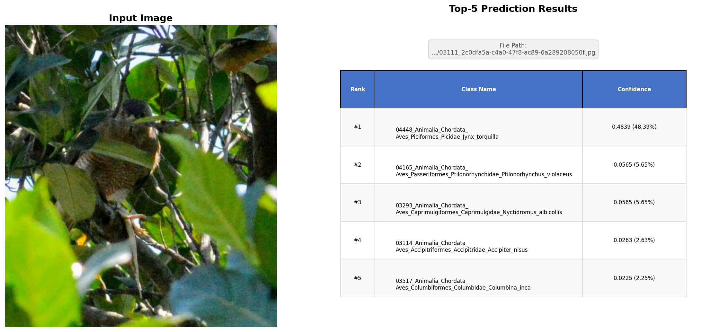
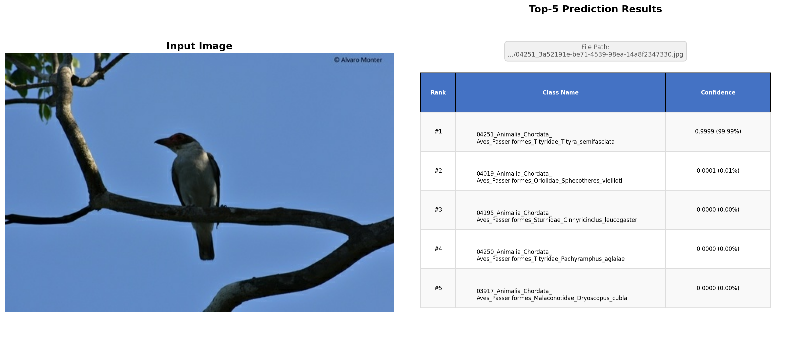
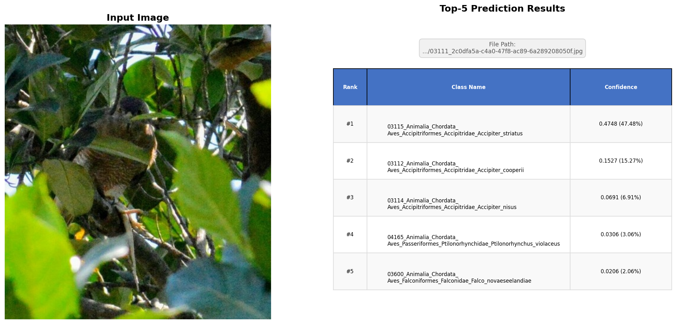
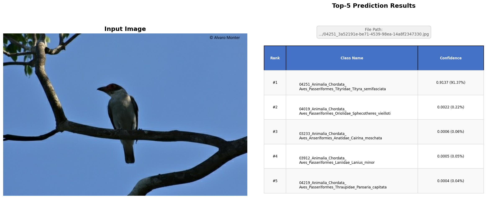
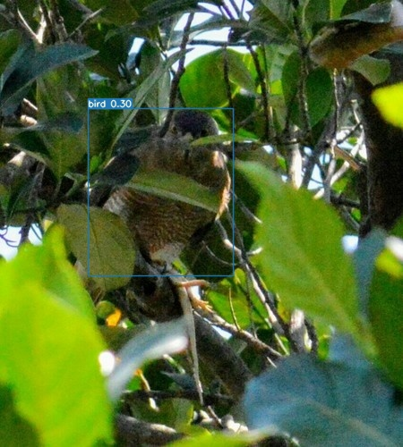
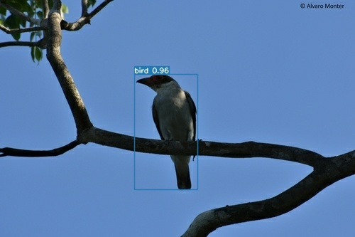
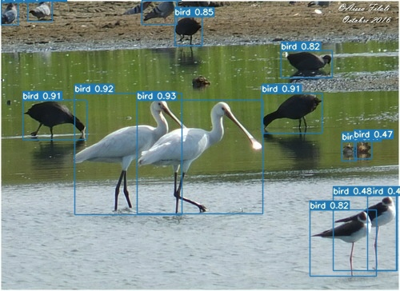
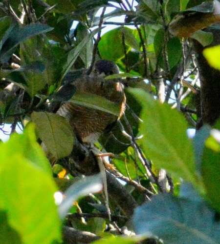

# Bird-Species-Classification 部署指南

Bird-Species-Classification 用于图像分类。本页说明 M.2 算力卡的接入条件、部署步骤与结果检查方法。本页选择 `model/bird-s/AX650/bird_650_npu3.axmodel`。

> 已实测，效果仍需评估。[查看部署效果](#查看部署效果)。

## 准备运行环境

本页包含 **RK3576 DshanPi A1 + AX8850 16GB M.2** 与 **RK3576 DshanPi A1 + AX8850 8GB M.2** 的样例。按效果展示中的权重和容量对应使用，不同环境的结果不能互相替代。

在连接算力卡的 Linux 主机终端执行，RK3576 使用 ARM64 环境。首次部署先完成[驱动与设备检查](../../usage/device-check.md)、[安装 PyAXEngine](../../usage/python.md)和[下载工具安装](../../usage/download-models.md#使用-hugging-face-下载)。已完成这些步骤可直接下载模型。

后文使用设备 0，运行前用 `axcl-smi` 确认设备可用。

## 下载模型与样例

本页使用 `AXERA-TECH/Bird-Species-Classification` 的固定版本。下面下载本页选用的 20 个文件。

```bash
MODEL_DIR=~/edgeaccel/models/bird-species-classification/b81b4cb3be06
mkdir -p "$MODEL_DIR"
~/edgeaccel/hf-env/bin/hf download AXERA-TECH/Bird-Species-Classification \
  "README.md" \
  "axmodel_infer.py" \
  "axmodel_infer_end2end.py" \
  "class_name.txt" \
  "config.json" \
  "onnx_infer.py" \
  "onnx_infer_end2end.py" \
  "quant_model_eval.py" \
  "test_images/03111_2c0dfa5a-c4a0-47f8-ac89-6a289208050f.jpg" \
  "test_images/03332_01b365c3-a741-4f45-bac2-4345bc901ec6.jpg" \
  "test_images/03412_0ffc115b-43b4-4474-a373-24233f391de3.jpg" \
  "test_images/03615_0dfbf6ae-434d-4648-b5d2-08412546ea64.jpg" \
  "test_images/04251_3a52191e-be71-4539-98ea-14a8f2347330.jpg" \
  "test_images/04405_0c5a6785-0bc2-49d9-9702-b9e94ba9b686.jpg" \
  "test_images/04593_3d74d5a7-15b1-4bb9-af6f-1bcd78485787.jpg" \
  "model/bird-end2end/AX650/bird_det_650_npu1.axmodel" \
  "model/bird-end2end/AX650/bird_rec_650_npu1.axmodel" \
  "model/bird-l/AX650/bird_650_npu3.axmodel" \
  "model/bird-m/AX650/bird_650_npu3.axmodel" \
  "model/bird-s/AX650/bird_650_npu3.axmodel" \
  --revision b81b4cb3be067a85ba730c5b2a67c566d3d9af68 \
  --local-dir "$MODEL_DIR"
cd "$MODEL_DIR"
```

保留当前终端中的 `MODEL_DIR` 变量，后续命令沿用此目录。下载受阻或需要离线复制时，见[下载方式与文件校验](../../usage/download-models.md)。

## 配置 Python 后端

激活已安装 PyAXEngine 的主机虚拟环境。先检查可用 provider：

```bash
source ~/edgeaccel/python-env/bin/activate
python -c "import axengine; print(axengine.get_available_providers())"
```

必须包含 `AXCLRTExecutionProvider`。保留已安装的 PyAXEngine，按下面命令安装本例依赖。

在已激活的环境中安装该入口直接使用的依赖；以下依赖用于本页的命令行示例：

```bash
python -m pip install numpy==1.26.4 ml-dtypes==0.5.3 opencv-python-headless==4.11.0.86 matplotlib Pillow
```


按本页已核对的修改配置 AXCL 后端。脚本在首次修改前保留 `.upstream` 备份；原表达式不匹配时停止，避免误改其他版本。

```bash
cd "$MODEL_DIR"
python - <<'PY'
from pathlib import Path
edits = [
    {"path": "axmodel_infer.py", "old": "providers = ['AxEngineExecutionProvider']", "new": "providers = ['AXCLRTExecutionProvider']"},
    {"path": "axmodel_infer_end2end.py", "old": "providers=['AxEngineExecutionProvider']", "new": "providers=['AXCLRTExecutionProvider']"},
    {"path": "axmodel_infer_end2end.py", "old": "providers = ['AxEngineExecutionProvider']", "new": "providers = ['AXCLRTExecutionProvider']"}
]
for edit in edits:
    path = Path(edit.get("path", "axmodel_infer.py"))
    source = path.read_text(encoding="utf-8")
    if edit["old"] not in source:
        assert edit["new"] in source, f"补丁目标不匹配：{path}"
        continue
    backup = path.with_name(path.name + ".upstream")
    if not backup.exists():
        backup.write_text(source, encoding="utf-8")
    path.write_text(source.replace(edit["old"], edit["new"]), encoding="utf-8")
    print(f"已修改 {path}")
PY
```

重新下载原始源码后，需要再次执行此修改。

## 运行模型

在模型根目录执行，输入与权重使用该提交的实际路径：

```bash
cd "$MODEL_DIR"
test -s model/bird-s/AX650/bird_650_npu3.axmodel
test -s test_images/03111_2c0dfa5a-c4a0-47f8-ac89-6a289208050f.jpg
set -o pipefail
python axmodel_infer.py --model_file model/bird-s/AX650/bird_650_npu3.axmodel --class_map_file class_name.txt --image test_images/03111_2c0dfa5a-c4a0-47f8-ac89-6a289208050f.jpg --image_size 224 2>&1 | tee run.log
```

日志中的实际执行后端应为 `AXCLRTExecutionProvider`。检查 `prediction_result_top5.png` 是本次新生成的文件，内容与输入相符。使用仓库现成结果图或只检查程序退出码均不足以判断效果。

参数依据：[`axmodel_infer.py` 源码](https://huggingface.co/AXERA-TECH/Bird-Species-Classification/blob/b81b4cb3be067a85ba730c5b2a67c566d3d9af68/axmodel_infer.py)。

## 运行 bird-m 和 bird-l

前面的下载命令已包含下表权重和七张样图。沿用已配置的 Python 环境及 `MODEL_DIR`。本节权重在16GB卡实测。

| 模型 | 权重 | 输入尺寸 |
| --- | --- | --- |
| bird-m | `model/bird-m/AX650/bird_650_npu3.axmodel` | 224×224 |
| bird-l | `model/bird-l/AX650/bird_650_npu3.axmodel` | 384×384 |

在主机选择一种规格运行，尺寸必须与权重对应：

```bash
VARIANT=m
case "$VARIANT" in
  m) SIZE=224 ;;
  l) SIZE=384 ;;
  *) echo "请选择m或l" >&2; exit 1 ;;
esac
OUT=~/edgeaccel/results/bird-$VARIANT
mkdir -p "$OUT"
cd "$OUT"
set -o pipefail
python "$MODEL_DIR/axmodel_infer.py" \
  --model_file "$MODEL_DIR/model/bird-$VARIANT/AX650/bird_650_npu3.axmodel" \
  --class_map_file "$MODEL_DIR/class_name.txt" --image_size "$SIZE" \
  --image "$MODEL_DIR/test_images/04251_3a52191e-be71-4539-98ea-14a8f2347330.jpg" \
  2>&1 | tee run.log
```

打开当前目录新生成的 `prediction_result_top5.png`，核对Top-5类别和分数。替换 `--image` 可逐张测试其余样图；结果图会覆盖，需另存。

## 运行鸟类检测与识别

配置 Python 后端时已将两个入口切换至 AXCL。检测模型以480×480输入定位鸟类，识别模型对外扩30%的裁剪图进行224×224分类。

```bash
OUT=~/edgeaccel/results/bird-end2end
mkdir -p "$OUT"
cd "$MODEL_DIR"
set -o pipefail
python axmodel_infer_end2end.py \
  --det_model model/bird-end2end/AX650/bird_det_650_npu1.axmodel \
  --rec_model model/bird-end2end/AX650/bird_rec_650_npu1.axmodel \
  --class_map_file class_name.txt --image_dir test_images \
  --output_dir "$OUT" 2>&1 | tee "$OUT/run.log"
```

检测框图保存到 `OUT`，实际识别裁剪图保存到 `OUT/crops`，每只鸟的Top-5写入 `OUT/results.json`。检查七张输入均被处理、框的位置合理，并核对JSON中的类别。上游脚本可能捕获异常后仍返回0，必须同时检查日志和新生成的文件。


## 查看部署效果

### bird-m / bird-l / 检测识别：16GB卡样例

**已运行，效果仍需评估** · RK3576 DshanPi A1 + AX8850 16GB M.2。以下输入与输出来自本页固定版本的实际运行。

四个AX650权重组成三条运行链路，各执行两轮七张样图，保存完整1486类输出并复算Top-5。部分Top-1与样图类别编号不一致，本记录仅表示基本运行完成。

**bird-m**

输入224×224，整图分类。七张官方样图，两次独立启动的输入张量、输出张量及结果图一致。7个分类结果中，Top-1与样图文件名类别编号一致2个，Top-5包含该编号4个。文件名编号仅用于样例对照，不作为独立标注精度评测。

<div className="model-effect-gallery">

<figure>

[](../../../static/validation/effects/bird-variants-20261005/m/03111_2c0dfa5a-c4a0-47f8-ac89-6a289208050f-top5.png)

<figcaption>m实际输出：样图03111</figcaption>
</figure>

<figure>

[](../../../static/validation/effects/bird-variants-20261005/m/04251_3a52191e-be71-4539-98ea-14a8f2347330-top5.png)

<figcaption>m实际输出：样图04251</figcaption>
</figure>

</div>

| 样图类别编号 | Top-1鸟种 | Softmax分数 | 与样图编号比较 |
| --- | --- | --- | --- |
| 03111 | Jynx_torquilla | 0.4839 | 不一致 |
| 03332 | Penelope_purpurascens | 0.1321 | 不一致 |
| 03412 | Chroicocephalus_philadelphia | 0.2973 | 不一致 |
| 03615 | Tigrisoma_mexicanum | 0.1297 | 不一致 |
| 04251 | Tityra_semifasciata | 0.9999 | 一致 |
| 04405 | Platalea_flavipes | 0.5151 | 不一致 |
| 04593 | Trogon_elegans | 0.9574 | 一致 |

**bird-l**

输入384×384，整图分类。七张官方样图，两次独立启动的输入张量、输出张量及结果图一致。7个分类结果中，Top-1与样图文件名类别编号一致4个，Top-5包含该编号6个。文件名编号仅用于样例对照，不作为独立标注精度评测。

<div className="model-effect-gallery">

<figure>

[](../../../static/validation/effects/bird-variants-20261005/l/03111_2c0dfa5a-c4a0-47f8-ac89-6a289208050f-top5.png)

<figcaption>l实际输出：样图03111</figcaption>
</figure>

<figure>

[](../../../static/validation/effects/bird-variants-20261005/l/04251_3a52191e-be71-4539-98ea-14a8f2347330-top5.png)

<figcaption>l实际输出：样图04251</figcaption>
</figure>

</div>

| 样图类别编号 | Top-1鸟种 | Softmax分数 | 与样图编号比较 |
| --- | --- | --- | --- |
| 03111 | Accipiter_striatus | 0.4748 | 不一致 |
| 03332 | Anthracoceros_albirostris | 0.2181 | 不一致 |
| 03412 | Larus_californicus | 0.6984 | 不一致 |
| 03615 | Ortalis_vetula | 0.6992 | 一致 |
| 04251 | Tityra_semifasciata | 0.9137 | 一致 |
| 04405 | Platalea_leucorodia | 0.7024 | 一致 |
| 04593 | Trogon_elegans | 0.9026 | 一致 |

**检测与识别完整链路**

七张官方样图各检测一次，再将检测框外扩30%并裁剪后识别，共产生20个分类结果。两次独立启动的输入、输出张量及结果图一致。04405群鸟图检测到14只鸟，包含不同鸟种；文件名编号不能作为每个裁剪的真实类别，尚需逐框标注验证。03111遮挡样图的检测分数约0.30，不能仅凭框出现判定定位和识别质量。

<div className="model-effect-gallery">

<figure>

[](../../../static/validation/effects/bird-variants-20261005/end2end/03111_2c0dfa5a-c4a0-47f8-ac89-6a289208050f.jpg)

<figcaption>end2end实际输出：样图03111</figcaption>
</figure>

<figure>

[](../../../static/validation/effects/bird-variants-20261005/end2end/04251_3a52191e-be71-4539-98ea-14a8f2347330.jpg)

<figcaption>end2end实际输出：样图04251</figcaption>
</figure>

<figure>

[](../../../static/validation/effects/bird-variants-20261005/end2end/04405_0c5a6785-0bc2-49d9-9702-b9e94ba9b686.jpg)

<figcaption>end2end实际输出：样图04405</figcaption>
</figure>

<figure>

[](../../../static/validation/effects/bird-variants-20261005/end2end/crop-04251.jpg)

<figcaption>04251检测框外扩30%后的实际识别输入</figcaption>
</figure>

</div>

| 样图类别编号 | Top-1鸟种 | Softmax分数 | 与样图编号比较 |
| --- | --- | --- | --- |
| 03111 | Accipiter_badius | 0.3658 | 需逐框标注 |
| 03332 | Ramphastos_toco | 0.2592 | 需逐框标注 |
| 03412 | Larus_glaucoides | 0.6481 | 需逐框标注 |
| 03615 | Ortalis_vetula | 0.7692 | 需逐框标注 |
| 04251 | Tityra_semifasciata | 0.9083 | 需逐框标注 |
| 04405 | Recurvirostra_americana | 0.2611 | 需逐框标注 |
| 04405 | Mareca_penelope | 0.3419 | 需逐框标注 |
| 04405 | Calidris_pugnax | 0.2006 | 需逐框标注 |
| 04405 | Calidris_melanotos | 0.1053 | 需逐框标注 |
| 04405 | Columba_livia | 0.3250 | 需逐框标注 |
| 04405 | Columba_livia | 0.6173 | 需逐框标注 |
| 04405 | Threskiornis_molucca | 0.1427 | 需逐框标注 |
| 04405 | Limosa_haemastica | 0.1052 | 需逐框标注 |
| 04405 | Fulica_ardesiaca | 0.1381 | 需逐框标注 |
| 04405 | Fulica_cristata | 0.3322 | 需逐框标注 |
| 04405 | Eudocimus_albus | 0.3739 | 需逐框标注 |
| 04405 | Platalea_ajaja | 0.1665 | 需逐框标注 |
| 04405 | Platalea_leucorodia | 0.5067 | 需逐框标注 |
| 04405 | Platalea_flavipes | 0.3971 | 需逐框标注 |
| 04593 | Trogon_elegans | 0.9438 | 需逐框标注 |

**使用时注意：**

- 样图文件名中的类别编号仅作为对照；尚未用独立标注数据集测量准确率，存在识别偏差。
- 16GB卡实测不替代这些权重的8GB回归；Softmax分数不能直接解释为业务准确率。

这些结果用于对照部署后的输出，未覆盖完整数据集精度或长期连续运行。

### bird-s：原8GB卡样例

**已运行，效果仍需评估** · RK3576 DshanPi A1 + AX8850 8GB M.2。以下输入与输出来自本页固定版本的实际运行。

224×224 输入完成鸟种分类，Top-1 为 Ciccaba_virgata，日志分数为 0.0727。类别表的 1486 项与输出维度一致，Top-5 名称及索引已核对；完整分数向量和独立样本标签缺失，分类质量仍待验证。

点击图片可查看原尺寸。

<div className="model-effect-gallery">

<figure>

[](../../../static/validation/effects/bird-species-classification/inputs/03111_2c0dfa5a-c4a0-47f8-ac89-6a289208050f.jpg)

<figcaption>输入图片</figcaption>
</figure>

<figure>

[](../../../static/validation/effects/bird-species-classification/outputs/prediction_result_top5.png)

<figcaption>实际输出</figcaption>
</figure>

</div>

下表来自原始运行日志，分数保留日志中的四位小数。输出索引按[本次固定版本类别表](https://huggingface.co/AXERA-TECH/Bird-Species-Classification/blob/b81b4cb3be067a85ba730c5b2a67c566d3d9af68/class_name.txt)从 0 开始计数，与类别名称前缀编号不同。

| 排名 | 输出索引 | 类别编号 | 物种名称 | 日志分数 |
| --- | --- | --- | --- | --- |
| 1 | 1439 | 04550 | Ciccaba virgata | 0.0727 |
| 2 | 1270 | 04381 | Ixobrychus exilis | 0.0537 |
| 3 | 692 | 03803 | Spermestes cucullata | 0.0537 |
| 4 | 1408 | 04519 | Psittacara leucophthalmus | 0.0292 |
| 5 | 1398 | 04509 | Brotogeris chiriri | 0.0292 |

前处理：RGB，双三次缩放到 224×224，uint8 NCHW；本例程不在主机上另做 mean/std 归一化。

原始记录没有保存完整的 1486 维输出，无法重新计算 Softmax 或复核全部类别排序。

文件名编号 03111 与类别表首项相符，但不是独立核验的样本标注，不能据此计算准确率。

**使用时注意：**

- 初次沿用脚本默认 384×384，模型要求 224×224，出现 shape 错误；脚本捕获异常后仍返回 0，不能只看退出码。
- 修正输入尺寸后分数仍低，文件名编号 03111 未出现在本次 Top-5 编号中；需进一步核对类别映射、前处理与该样本标注。

这些结果用于对照部署后的输出，未覆盖完整数据集精度或长期连续运行。

**bird-m / bird-l / 检测识别：16GB卡样例**

<details>
<summary>查看样例环境与运行耗时</summary>

环境：RK3576 DshanPi A1 + AX8850 16GB M.2。模型版本：`b81b4cb3be067a85ba730c5b2a67c566d3d9af68`。

| 组件 | 版本或配置 |
| --- | --- |
| AXCL / 固件 | V3.16.0_20260729180218 / V3.16.0 |
| 输入与后端 | 官方七张样图；PyAXEngine AXCLRTExecutionProvider；原始前后处理 |
| 卡侧CMM | 15232 MiB；每个进程结束后恢复空闲18 MiB |

| 指标 | 实测值 | 计时或统计范围 |
| --- | --- | --- |
| m / bird_650_npu3.axmodel | 14次；3.270–9.377 ms | 两次独立进程，session.run墙钟包含数据传输；不含加载、前后处理与结果存盘，包含首次调用，不代表稳定吞吐。 |
| l / bird_650_npu3.axmodel | 14次；10.663–14.642 ms | 两次独立进程，session.run墙钟包含数据传输；不含加载、前后处理与结果存盘，包含首次调用，不代表稳定吞吐。 |
| end2end / bird_det_650_npu1.axmodel | 14次；8.506–13.010 ms | 两次独立进程，session.run墙钟包含数据传输；不含加载、前后处理与结果存盘，包含首次调用，不代表稳定吞吐。 |
| end2end / bird_rec_650_npu1.axmodel | 40次；8.803–9.386 ms | 两次独立进程，session.run墙钟包含数据传输；不含加载、前后处理与结果存盘，包含首次调用，不代表稳定吞吐。 |

</details>

**bird-s：原8GB卡样例**

<details>
<summary>查看样例环境与运行耗时</summary>

环境：RK3576 DshanPi A1 + AX8850 8GB M.2。模型版本：`b81b4cb3be067a85ba730c5b2a67c566d3d9af68`。

| 组件 | 版本或配置 |
| --- | --- |
| 主机系统 | Ubuntu 24.04 / Armbian 25.11.0-trunk，aarch64 |
| 内核 | 6.1.115-vendor-rk35xx |
| AXCL / 驱动 | V3.16.0_20260729180218 |
| 固件 / CMM | V3.16.0；CMM 总量 7040 MiB，空闲基线占用 18 MiB |
| C++ 视觉示例提交 | cbfa4c76891758983ca2b0c99c11d6621d59af39 |
| Python 后端 | Python 3.12.3；PyAXEngine 0.1.3.rc3 发布的 0.1.3 wheel；NumPy 1.26.4 / ml-dtypes 0.5.3 |
| AX-LLM 提交 | 8501c22b940f8c5804cb35044c5ffc136918b8f1；Release / AXCL / Linux aarch64 |

| 指标 | 实测值 | 计时或统计范围 |
| --- | --- | --- |
| Top-1 分数 | 0.0727 | 单个固定样本的 Softmax 分数，非准确率 |
| session.run：bird_650_npu3.axmodel | 8.519 ms / 1 次 | 实际 AXCL Python 调用墙钟，含数据复制；不含返回后的张量统计。含首次调用，非统一预热基准；多阶段模型各自计时 |

适用范围：

- 本次不作为鸟种分类精度验证，不推荐仅按 Top-1 结果直接做业务判断。
- 运行源码包含显式 AXCL 后端或本页说明的适配修改；result.json 保存逐项替换及修改后 SHA256。

</details>

遇到加载、内存或后端错误时，按[常见问题](../../usage/troubleshooting.md)处理。需要更换输入或接入业务时，按[检查输出与记录结果](../../reference/validation.md)保留自己的结果。

<details>
<summary>查看文件用途与版本信息</summary>

| 文件 / 目录内路径 | 用途 |
| --- | --- |
| [`axmodel_infer.py`](https://huggingface.co/AXERA-TECH/Bird-Species-Classification/blob/b81b4cb3be067a85ba730c5b2a67c566d3d9af68/axmodel_infer.py) | Python 程序 / 前后处理 |
| [`model/bird-s/AX650/bird_650_npu3.axmodel`](https://huggingface.co/AXERA-TECH/Bird-Species-Classification/blob/b81b4cb3be067a85ba730c5b2a67c566d3d9af68/model/bird-s/AX650/bird_650_npu3.axmodel) | 编译模型；按目录区分芯片和规格 |
| [`class_name.txt`](https://huggingface.co/AXERA-TECH/Bird-Species-Classification/blob/b81b4cb3be067a85ba730c5b2a67c566d3d9af68/class_name.txt) | 配套资源 |
| [`test_images/03111_2c0dfa5a-c4a0-47f8-ac89-6a289208050f.jpg`](https://huggingface.co/AXERA-TECH/Bird-Species-Classification/blob/b81b4cb3be067a85ba730c5b2a67c566d3d9af68/test_images/03111_2c0dfa5a-c4a0-47f8-ac89-6a289208050f.jpg) | 示例输入 |

仓库提交：`b81b4cb3be067a85ba730c5b2a67c566d3d9af68`。仓库中的 20 个 `.axmodel` 文件可能包括多个芯片、规格和分片。运行时使用本页指定的配套文件，完整列表见[固定版本目录](https://huggingface.co/AXERA-TECH/Bird-Species-Classification/tree/b81b4cb3be067a85ba730c5b2a67c566d3d9af68)。

</details>

<details>
<summary>补充说明与版本差异</summary>

- 仓库包含 bird-s、bird-m、bird-l 和 bird-end2end。端到端方案分检测与识别两段，不能只加载其中一段就视为分类链路完成。
- 上游主函数捕获推理异常并打印 Inference failed 后可能退出码仍为 0，必须检查输出文件与 Top-5 文本。
- bird-s 这份 AX650 权重的输入为 224×224，必须显式传入 --image_size 224。上游脚本默认 384×384 与此文件不匹配；首次实测因此未生成结果，修正尺寸后完成推理。
- 修正尺寸后的本次 Top-1 分数仅 0.0727。必须检查 Top-5 文本和新生成的 prediction_result_top5.png；退出码 0、完成推理或低置信度 Top-1 都不能单独证明鸟种识别正确。
- bird-m、bird-l与检测+识别链路已在16GB卡运行七张官方样图；各链路仍存在Top-1与样图类别编号不一致的结果，见效果展示。

</details>

## 参考资料

- [常用术语](../../reference/glossary.md)：AXCL、CMM、分词器与推理指标。
- [固定版本文件表](https://huggingface.co/AXERA-TECH/Bird-Species-Classification/tree/b81b4cb3be067a85ba730c5b2a67c566d3d9af68)。
- [模型卡 / 使用说明](https://huggingface.co/AXERA-TECH/Bird-Species-Classification/blob/b81b4cb3be067a85ba730c5b2a67c566d3d9af68/README.md)。
- [主要程序入口：axmodel_infer.py](https://huggingface.co/AXERA-TECH/Bird-Species-Classification/blob/b81b4cb3be067a85ba730c5b2a67c566d3d9af68/axmodel_infer.py)。
- [ModelScope 对应资源](https://modelscope.cn/models/AXERA-TECH/Bird-Species-Classification)。不同平台的 revision 不通用，另行记录版本。

返回[完整模型目录](../catalog.mdx)。
