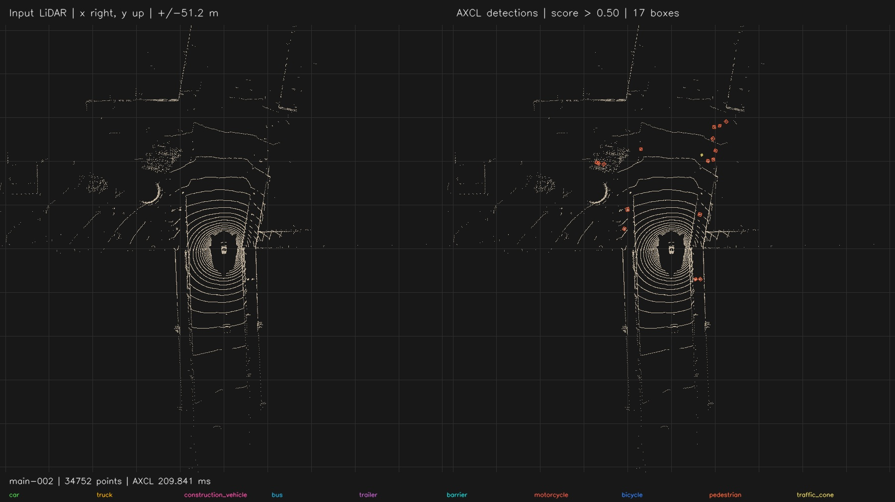
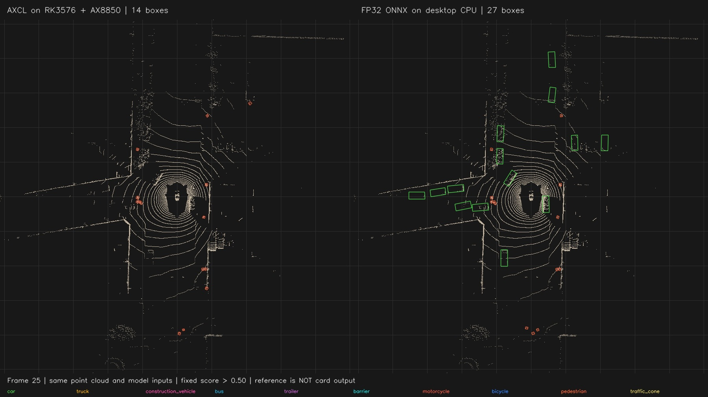
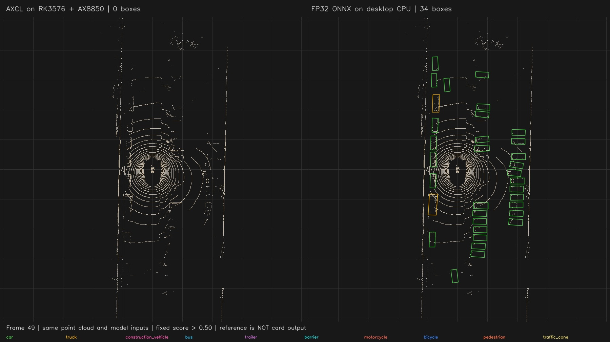

# centerpoint 部署指南

centerpoint 用于目标检测。本页说明 M.2 算力卡的接入条件、部署步骤与结果检查方法。

> 已实测，效果仍需评估。[查看部署效果](#查看部署效果)。

## 准备运行环境

本页效果展示使用 **RK3576 + AX8850 16GB M.2**；其他容量或平台需重新确认模型能否加载并正确运行。

在连接算力卡的 Linux 主机终端执行，RK3576 使用 ARM64 环境。首次部署先完成[驱动与设备检查](../../usage/device-check.md)、[安装 PyAXEngine](../../usage/python.md)和[下载工具安装](../../usage/download-models.md#使用-hugging-face-下载)。已完成这些步骤可直接下载模型。

后文使用设备 0，运行前用 `axcl-smi` 确认设备可用。

## 下载模型与样例

本页使用 `AXERA-TECH/centerpoint` 的固定版本。下面下载本页选用的 108 个文件。

```bash
MODEL_DIR=~/edgeaccel/models/centerpoint/186e6a83fac0
mkdir -p "$MODEL_DIR"
~/edgeaccel/hf-env/bin/hf download AXERA-TECH/centerpoint \
  --include "README.md" "config.json" "inference_axmodel.py" "inference_onnx.py" "ax650/centerpoint.axmodel" "pointpillars.onnx" "extracted_data/*" \
  --revision 186e6a83fac0f4e89b6989628d1e214e4746e877 \
  --local-dir "$MODEL_DIR"
cd "$MODEL_DIR"
```

保留当前终端中的 `MODEL_DIR` 变量，后续命令沿用此目录。下载受阻或需要离线复制时，见[下载方式与文件校验](../../usage/download-models.md)。

## 安装点云处理依赖

本页通过 RK3576 主机调用 AX8850 16GB M.2 算力卡，对官方 50 帧点云运行 CenterPoint 检测并保存鸟瞰图。

**当前权重仅完成基本运行核对，车辆检测效果尚未通过。** 第 49 帧在固定阈值下，算力卡未检出目标，桌面 CPU 浮点参考检出 34 个。接入业务前先查看下方对照结果。

在 RK3576 主机执行，沿用前文的 `$MODEL_DIR`：

```bash
source ~/edgeaccel/python-env/bin/activate
python -m pip install 'numpy==1.26.4' 'numba==0.67.0' 'llvmlite==0.49.0' 'tqdm==4.70.1' 'opencv-python-headless==4.11.0.86'
python -c "import axengine; print(axengine.get_available_providers())"
```

输出应包含 `AXCLRTExecutionProvider`。点云分组、后处理和绘图使用主机 CPU；神经网络使用算力卡。首次执行会编译 Numba 函数，首帧耗时明显较长。

## 检查点云与运行配置

| 文件 | 用途 |
| --- | --- |
| `ax650/centerpoint.axmodel` | 算力卡推理模型 |
| `extracted_data/config.json` | 点云范围、体素尺寸与类别配置 |
| `extracted_data/sample_index.json` | 50 帧输入顺序 |
| `extracted_data/points/*.bin` | 每点五个 float32：x、y、z、强度、时间差 |
| `inference_axmodel.py` | 固定版本的点云预处理和 NMS 函数 |
| `pointpillars.onnx` | 桌面 CPU 对照使用的浮点模型；不参与下面的算力卡推理 |

运行配置使用 `extracted_data/config.json`；仓库根目录的 `config.json` 是模型转换配置，不能替代运行配置。

本页输入为单帧扫描，时间差均为 0。体素尺寸为 `0.2×0.2×8.0` 米，每柱最多 20 个点，模型接收最多 30000 个柱。输入张量为 `1×10×30000×20` float32 特征与 `1×30000×2` int32 索引。

自备点云必须使用相同坐标、单位和特征定义。不能把原始传感器的线束编号直接放入时间差通道。本页示例固定读取官方样例，接入新数据时需同步修改样例索引和输入校验。

## 运行点云检测

下载 [CenterPoint 算力卡示例包](/examples/centerpoint-card-example.zip)，保存为 `~/edgeaccel/centerpoint-card-example.zip`，然后执行：

```bash
mkdir -p ~/edgeaccel/centerpoint-example
unzip ~/edgeaccel/centerpoint-card-example.zip -d ~/edgeaccel/centerpoint-example
python ~/edgeaccel/centerpoint-example/centerpoint_card.py \
  --model-dir "$MODEL_DIR" \
  --output ~/edgeaccel/results/centerpoint-01 \
  --limit 50 \
  --repeat
```

输出目录须尚不存在。程序先核对固定文件的 SHA256，再按索引运行 50 帧，最后重复前三帧。只试跑一帧时，将 `--limit 50 --repeat` 改为 `--limit 1`，并使用新的输出目录。

示例使用仓库的轴对齐、跨类别 NMS，IoU 阈值为 `0.2`，候选阈值为 `0.1`，最终保留分数 **大于 `0.5`** 的框。尺寸按训练及导出定义中的宽、长、高读取。该简化后处理不等同于标准 nuScenes 评估流程。

## 查看检测画面

正常结束后，`deployment-result.json` 中 `completed` 为 `true`，目录中包含：

| 文件 | 内容 |
| --- | --- |
| `main-000.jpg` 至 `main-049.jpg` | 50 帧点云及实际检测框 |
| `repeat-000.jpg` 至 `repeat-002.jpg` | 前三帧的重复运行结果 |
| 同名 `.json` | 类别、分数、框、点数及分阶段耗时 |
| 同名 `.npz` | 两路实际输入与 42 路原始输出 |
| `deployment-result.json` | 本次完整结果 |

将 JPG 复制到桌面主机查看。每张图左侧为输入点云，右侧为算力卡检测；x 轴朝右、y 轴朝上，范围为正负 51.2 米。矩形保留模型的原始尺寸，短线表示方向，类别颜色见图片底部。

本次 50 帧共保留 474 个检测框，**这是逐帧框数之和，不是 474 个独立目标**。前三帧分别为 8、9、17 个，重复运行结果一致。第二个场景的十帧中，只有第 41 帧保留 1 个框，其余为 0；没有通过降低阈值替换展示结果。

下面两段短片由实际输出图片按 **2 FPS** 编码，分别包含 40 帧和 10 帧。播放速度不代表推理帧率。

## 判断结果适用范围

本次算力卡调用约 `208–221 ms/帧`。含读取、后处理、张量压缩保存和绘图的后续帧流程约 `1.36–1.74 秒/帧`，首帧约 `21.93 秒`，包含首次 JIT 编译。实际应用关闭记录后的吞吐量需要另测。

浮点对照使用相同输入和阈值，在桌面 CPU 上运行；它不是算力卡效果。第 49 帧的浮点参考包含 32 个汽车框、2 个卡车框，算力卡为 0，当前版本不宜直接用于车辆检测业务。

仓库的 `gt_annotations` 是空占位文件，无法据此计算 mAP、NDS 或漏检率。本次未完成带标注精度、长期稳定性和实际 8GB 卡回归。


## 查看部署效果

**已运行，效果仍需评估** · RK3576 + AX8850 16GB M.2。以下输入与输出来自本页固定版本的实际运行。

完成官方 50 帧点云推理和三帧重复。全部 50 帧汽车分数最高为 0.5，固定阈值下未保留汽车框；浮点参考存在明显差异，车辆检测效果未通过。

**场景一：查看点云与检测框**

第 0 至 39 帧使用固定分数阈值大于 0.5。左侧为输入点云，右侧为实际算力卡检测框；视频保留完整 40 帧。

<div className="model-effect-gallery">

<figure>

[](../../../static/validation/effects/centerpoint-20260928/frame-002.jpg)

<figcaption>第 2 帧：算力卡实际保留 17 个框</figcaption>
</figure>

</div>

| 帧号 | 检测框数 | AXCL / ms |
| --- | --- | --- |
| 0 | 8 | 216.937 |
| 1 | 9 | 214.284 |
| 2 | 17 | 209.841 |
| 25 | 14 | 208.888 |
| 39 | 6 | 213.317 |

场景一完整 40 帧，2 FPS 播放

<video className="model-effect-video" controls playsInline preload="metadata" src="/validation/effects/centerpoint-20260928/scene-one.mp4" aria-label="场景一完整 40 帧，2 FPS 播放"></video>

[下载视频](../../../static/validation/effects/centerpoint-20260928/scene-one.mp4)

**场景二：保留低检出结果**

第 40 至 49 帧中，仅第 41 帧保留 1 个框，其余为 0。视频展示本次真实结果，没有改阈值或替换输出；没有检测框不表示场景中没有目标。

| 帧号 | 检测框数 |
| --- | --- |
| 40 | 0 |
| 41 | 1 |
| 42 | 0 |
| 43 | 0 |
| 44 | 0 |
| 45 | 0 |
| 46 | 0 |
| 47 | 0 |
| 48 | 0 |
| 49 | 0 |

场景二完整 10 帧，2 FPS 播放

<video className="model-effect-video" controls playsInline preload="metadata" src="/validation/effects/centerpoint-20260928/scene-two.mp4" aria-label="场景二完整 10 帧，2 FPS 播放"></video>

[下载视频](../../../static/validation/effects/centerpoint-20260928/scene-two.mp4)

**对照浮点参考模型**

以下五帧在桌面 CPU 上使用同一版本 FP32 ONNX、同输入和同阈值。第 49 帧算力卡为 0 个框，CPU 参考为 34 个框，其中 32 个汽车、2 个卡车。进一步核对全部 50 帧的原始输出：算力卡汽车类别的最高分均为 0.5，没有候选满足例程的“分数大于 0.5”，因此这 50 帧均未保留汽车框。差异在框筛选前已经存在；保持原阈值展示，不将降低阈值作为修复。当前车辆检测效果未通过。

<div className="model-effect-gallery">

<figure>

[](../../../static/validation/effects/centerpoint-20260928/comparison-025.jpg)

<figcaption>第 25 帧：左侧算力卡 14 框，右侧桌面 CPU 27 框</figcaption>
</figure>

<figure>

[](../../../static/validation/effects/centerpoint-20260928/comparison-049.jpg)

<figcaption>第 49 帧：左侧算力卡 0 框，右侧桌面 CPU 34 框</figcaption>
</figure>

</div>

| 帧号 | 算力卡框数 | 桌面 CPU 框数 |
| --- | --- | --- |
| 0 | 8 | 11 |
| 1 | 9 | 17 |
| 2 | 17 | 19 |
| 25 | 14 | 27 |
| 49 | 0 | 34 |

| 帧号 | 汽车最高分 / AXCL | 汽车最高分 / CPU | 汽车框数 / AXCL | 汽车框数 / CPU |
| --- | --- | --- | --- | --- |
| 0 | 0.500000 | 0.803479 | 0 | 2 |
| 1 | 0.500000 | 0.728832 | 0 | 3 |
| 2 | 0.500000 | 0.716642 | 0 | 3 |
| 25 | 0.500000 | 0.896695 | 0 | 14 |
| 49 | 0.500000 | 0.842355 | 0 | 32 |

**核对重复运行与结果范围**

重复前三帧时，两路输入、42 路原始输出、检测结果及绘制坐标全部一致。这验证了本组样例的重复性，不能替代带标注精度评估。

| 项目 | 结果 |
| --- | --- |
| 实际运行 | 50 帧 + 3 帧重复，共 53 次 |
| 单次算力卡调用 | 208–221 ms |
| 后续帧完整记录流程 | 1.36–1.74 秒/帧 |
| 首次 JIT 与第一帧流程 | 21.93 秒 |
| 标注文件 | 官方 50 个标注文件均为空占位，未计算精度 |

**使用时注意：**

- 量化权重与浮点参考差异较大，尤其是汽车类别；第49帧为0框与34框，当前版本不宜直接用于车辆检测业务。
- 官方标注为空占位，尚未完成标准nuScenes精度；简化轴对齐NMS不等同于标准评估。

这些结果用于对照部署后的输出，未覆盖完整数据集精度或长期连续运行。

<details>
<summary>查看样例环境与运行耗时</summary>

环境：RK3576 + AX8850 16GB M.2。模型版本：`186e6a83fac0f4e89b6989628d1e214e4746e877`。

| 组件 | 版本或配置 |
| --- | --- |
| 主机 / 内核 | RK3576，约 4GB RAM，6.1.115-vendor-rk35xx |
| AXCL / 驱动 | V3.16.0_20260729180218 |
| 固件 / CMM | V3.16.0 / 15232 MiB |
| Python 推理 | Python 3.12 / PyAXEngine 0.1.3.rc3 / NumPy 1.26.4 / AXCLRTExecutionProvider |

| 指标 | 实测值 | 计时或统计范围 |
| --- | --- | --- |
| 已运行样例 | 50 帧 + 3 帧重复 | 官方两个场景；阈值固定大于0.5。 |
| 纯 AXCL 调用 | 208–221 ms | 不含读取、前后处理与记录。 |
| 重复性 | 前三帧输入输出完全一致 | 全部网络输入输出、检测与绘制坐标。 |

适用范围：

- 视频2 FPS仅为播放速度。实际8GB卡及长期稳定性另行验证。

</details>

遇到加载、内存或后端错误时，按[常见问题](../../usage/troubleshooting.md)处理。需要更换输入或接入业务时，按[检查输出与记录结果](../../reference/validation.md)保留自己的结果。

<details>
<summary>查看文件用途与版本信息</summary>

| 文件 / 目录内路径 | 用途 |
| --- | --- |
| [`inference_axmodel.py`](https://huggingface.co/AXERA-TECH/centerpoint/blob/186e6a83fac0f4e89b6989628d1e214e4746e877/inference_axmodel.py) | Python 程序 / 前后处理 |
| [`ax650/centerpoint.axmodel`](https://huggingface.co/AXERA-TECH/centerpoint/blob/186e6a83fac0f4e89b6989628d1e214e4746e877/ax650/centerpoint.axmodel) | 编译模型；按目录区分芯片和规格 |
| [`config.json`](https://huggingface.co/AXERA-TECH/centerpoint/blob/186e6a83fac0f4e89b6989628d1e214e4746e877/config.json) | 运行配置 |
| [`extracted_data/config.json`](https://huggingface.co/AXERA-TECH/centerpoint/blob/186e6a83fac0f4e89b6989628d1e214e4746e877/extracted_data/config.json) | 运行配置 |

仓库提交：`186e6a83fac0f4e89b6989628d1e214e4746e877`。仓库中的 1 个 `.axmodel` 文件可能包括多个芯片、规格和分片。运行时使用本页指定的配套文件，完整列表见[固定版本目录](https://huggingface.co/AXERA-TECH/centerpoint/tree/186e6a83fac0f4e89b6989628d1e214e4746e877)。

</details>

<details>
<summary>补充说明与版本差异</summary>

- 处理点云三维检测。输入数据、体素化规则与 extracted_data/config.json 配套，输出三维坐标不能直接解释为图像像素坐标。

</details>

## 参考资料

- [常用术语](../../reference/glossary.md)：AXCL、CMM、分词器与推理指标。
- [固定版本文件表](https://huggingface.co/AXERA-TECH/centerpoint/tree/186e6a83fac0f4e89b6989628d1e214e4746e877)。
- [模型卡 / 使用说明](https://huggingface.co/AXERA-TECH/centerpoint/blob/186e6a83fac0f4e89b6989628d1e214e4746e877/README.md)。
- [主要程序入口：inference_axmodel.py](https://huggingface.co/AXERA-TECH/centerpoint/blob/186e6a83fac0f4e89b6989628d1e214e4746e877/inference_axmodel.py)。

返回[完整模型目录](../catalog.mdx)。
