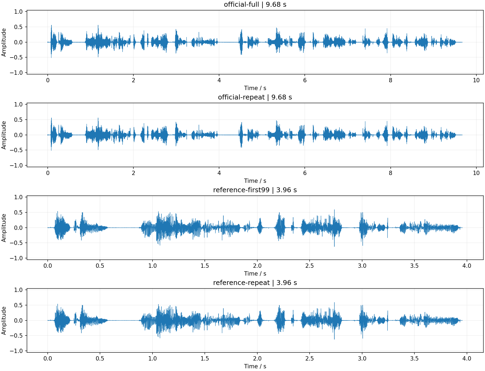

# chatterbox-onestep 部署指南

chatterbox-onestep 用于语音合成。本页说明 M.2 算力卡的接入条件、部署步骤与结果检查方法。

> 已实测，效果仍需评估。[查看部署效果](#查看部署效果)。

## 准备运行环境

本页效果展示使用 **RK3576 + AX8850 16GB M.2**；其他容量或平台需重新确认模型能否加载并正确运行。

在连接算力卡的 Linux 主机终端执行，RK3576 使用 ARM64 环境。首次部署先完成[驱动与设备检查](../../usage/device-check.md)、[安装 PyAXEngine](../../usage/python.md)和[下载工具安装](../../usage/download-models.md#使用-hugging-face-下载)。已完成这些步骤可直接下载模型。

后文使用设备 0，运行前用 `axcl-smi` 确认设备可用。

## 下载模型与样例

本页使用 `AXERA-TECH/chatterbox-onestep` 的固定版本。下面下载本页选用的 31 个文件。

```bash
MODEL_DIR=~/edgeaccel/models/chatterbox-onestep/2bec38c6ef8b
mkdir -p "$MODEL_DIR"
~/edgeaccel/hf-env/bin/hf download AXERA-TECH/chatterbox-onestep \
  --include "models/*" "python/*" "sample_input/*" "clone_reference.wav" "README.md" "NPU_ONLY_SDK.md" "run.sh" "setup.sh" \
  --revision 2bec38c6ef8b34b721422d41d2030f6a226bfaac \
  --local-dir "$MODEL_DIR"
cd "$MODEL_DIR"
```

保留当前终端中的 `MODEL_DIR` 变量，后续命令沿用此目录。下载受阻或需要离线复制时，见[下载方式与文件校验](../../usage/download-models.md)。

## 准备算力卡运行环境

本页在 RK3576 主机上通过 AXCL 调用 AX8850 16GB M.2 算力卡，将 S3 语音 token 转为 24 kHz 音频，并运行带参考音频条件的合成。

本仓库提供的是 **语音 token → 频谱 → 音频** 流程。它不直接接收文字；文字生成语音 token 需要另配 T3 模型。下例使用仓库提供的 `sample_input`，不将语音 token 当作文本分词结果。

保留上方下载得到的 `$MODEL_DIR`，在 RK3576 主机执行：

```bash
source ~/edgeaccel/python-env/bin/activate
python -m pip install 'numpy==1.26.4'
python -c "import axengine; print(axengine.get_available_providers())"
```

输出须包含 `AXCLRTExecutionProvider`。模型推理使用算力卡，频谱处理和 WAV 写入使用主机 CPU；板端不需要安装 PyTorch。

## 检查模型和输入文件

| 文件 | 用途 |
| --- | --- |
| `models/model.axmodel` | 基础语音 token → mel 频谱 |
| `models/model_clone.axmodel` | 带参考音频条件的 token → mel 频谱 |
| `models/hifift_f0.axmodel` | HiFT 基频预测 |
| `models/hifift_decode.axmodel` | HiFT 声码器 |
| `sample_input/*.npy` | 官方样例的 token、有效长度、音色向量和初始噪声 |
| `python/hift_linear_w.npy`、`python/hift_linear_b.npy` | 声码器激励参数 |
| `python/hift_vocoder.py` | CPU 频谱处理 |
| `clone_reference.wav` | 仓库提供的参考音频 LJ001-0001 |

保留完整固定版本文件。示例启动时逐文件检查 SHA256，不混用其他提交的权重和参数。

## 运行基础音频合成

下载 [Chatterbox 算力卡示例包](../../../static/examples/chatterbox-card-example.zip)，保存到 `~/edgeaccel/` 后执行：

```bash
mkdir -p ~/edgeaccel/chatterbox-example
unzip ~/edgeaccel/chatterbox-card-example.zip -d ~/edgeaccel/chatterbox-example
python ~/edgeaccel/chatterbox-example/chatterbox_card.py \
  --model-dir "$MODEL_DIR" \
  --output ~/edgeaccel/results/chatterbox-base-01
```

输出目录须尚不存在。程序执行官方样例及一次重复运行，结果分别位于 `official-full/output.wav` 和 `official-repeat/output.wav`。

官方输入包含 242 个有效语音 token，生成 484 帧 mel。声码器每次接收 198 帧，因此示例按 **198 + 198 + 88 帧** 分三段处理，拼接有效输出，得到完整的 9.68 秒音频。这里未使用交叠或淡入淡出；分段连接处的听感仍需单独评估。

## 运行参考音频条件合成

示例包的 `reference` 目录包含由仓库 `clone_reference.wav` 实际提取的三个条件文件：

| 文件 | 形状 |
| --- | --- |
| `ref_embedding.npy` | `1 × 192` 音色向量 |
| `ref_prompt_token.npy` | `1 × 157` 参考语音 token |
| `ref_prompt_feat.npy` | `1 × 314 × 80` 参考频谱 |

这些条件由 [ResembleAI/chatterbox 固定版本](https://huggingface.co/ResembleAI/chatterbox/tree/5bb1f6ee58e50c3b8d408bc82a6d3740c2db6e18) 的 `s3gen.safetensors` 和官方 Chatterbox 0.1.4 的 `embed_ref` 方法在桌面 CPU 上生成。参考音频转为单声道 24 kHz，取前 6.28 秒；来源、权重与输出校验值记录在 `reference-preparation.json`。

在 RK3576 主机执行：

```bash
python ~/edgeaccel/chatterbox-example/chatterbox_card.py \
  --model-dir "$MODEL_DIR" \
  --reference-dir ~/edgeaccel/chatterbox-example/reference \
  --output ~/edgeaccel/results/chatterbox-clone-01
```

该命令依次执行两次基础合成，再执行两次参考条件合成。本次参考条件样例明确使用官方输入的 **前 99 个 token**，配合 157 个参考 token 填入模型，输出 3.96 秒音频；不是完整 242 token 样例的克隆。每次对四组固定种子的初始噪声分别推理，再平均生成频谱。

更换参考音频时，应使用仓库的 `python/extract_voice_embedding.py` 重新生成全部三个文件。仅替换音色向量不能复现完整参考条件路径；本页只验证示例包中的固定参考。

## 检查并播放结果

`deployment-result.json` 中的 `completed` 应为 `true`，输出目录包含以下音频：

| 目录 | 内容 | 音频长度 |
| --- | --- | --- |
| `official-full` | 完整官方 token 样例 | 9.68 秒 |
| `official-repeat` | 完整样例重复运行 | 9.68 秒 |
| `reference-first99` | 前 99 token，带参考音频条件 | 3.96 秒 |
| `reference-repeat` | 相同参考条件重复运行 | 3.96 秒 |

音频为 24 kHz、单声道、PCM16。可复制到桌面主机播放，或在已配置音频输出的 Linux 主机执行：

```bash
aplay ~/edgeaccel/results/chatterbox-clone-01/reference-first99/output.wav
```

下方展示本次算力卡生成的音频及实际波形。流程耗时包含推理、CPU 频谱处理、原始张量保存和 WAV 写入，不含权重加载或桌面端参考条件提取；AXCL 耗时只累计网络 `run` 调用。

本次核对了模型数据流、频谱还原、音频长度和重复性。发音准确率、音色相似度、分段听感以及实际 8GB 卡容量仍待专项验证。


## 查看部署效果

**已运行，效果仍需评估** · RK3576 + AX8850 16GB M.2。以下输入与输出来自本页固定版本的实际运行。

完成基础及参考音频条件的AXCL合成，展示完整9.68秒样例、3.96秒参考条件样例与两次重复结果。

**生成完整官方样例**

输入仓库提供的242个语音token，生成484帧频谱；声码器按198、198、88帧分段处理并拼接，保留全部9.68秒音频。这里未执行文字到语音token的T3阶段。

| 语音token | 有效mel帧 | 声码器分段 | 音频 / s |
| --- | --- | --- | --- |
| 242 | 484 | 3 | 9.68 |

official-full：本次生成音频

<audio controls preload="metadata" src="/validation/effects/chatterbox-onestep-20260928/official-full.wav" aria-label="official-full：本次生成音频"></audio>

[下载音频](../../../static/validation/effects/chatterbox-onestep-20260928/official-full.wav)

**使用参考音频条件**

条件来自官方参考音频LJ001-0001的前6.28秒。本例使用样例前99个token，四组固定噪声各推理一次并平均频谱，生成3.96秒音频；未将它标成完整242 token样例。

| 项目 | 结果 |
| --- | --- |
| 参考语音token | 157 |
| 参考频谱形状 | 1 × 314 × 80 |
| 本次生成token | 前99个 |
| 平均次数 | 4 |

reference-first99：本次生成音频

<audio controls preload="metadata" src="/validation/effects/chatterbox-onestep-20260928/reference-first99.wav" aria-label="reference-first99：本次生成音频"></audio>

[下载音频](../../../static/validation/effects/chatterbox-onestep-20260928/reference-first99.wav)

**核对重复结果**

基础和参考条件样例各重复一次，两组的所有网络输入输出与各自WAV完全一致。重复性通过不代表发音或音色相似度验收。

| 项目 | 结果 |
| --- | --- |
| 基础样例重复 | 网络输入输出与WAV一致 |
| 参考条件重复 | 网络输入输出与WAV一致 |
| 音频格式 | 24 kHz / 单声道 / PCM16 |
| 发生限幅的有效采样点 | 0 |

official-repeat：本次生成音频

<audio controls preload="metadata" src="/validation/effects/chatterbox-onestep-20260928/official-repeat.wav" aria-label="official-repeat：本次生成音频"></audio>

[下载音频](../../../static/validation/effects/chatterbox-onestep-20260928/official-repeat.wav)

reference-repeat：本次生成音频

<audio controls preload="metadata" src="/validation/effects/chatterbox-onestep-20260928/reference-repeat.wav" aria-label="reference-repeat：本次生成音频"></audio>

[下载音频](../../../static/validation/effects/chatterbox-onestep-20260928/reference-repeat.wav)

**查看实际波形**

以下波形来自本次四段实际生成音频。完整样例分段连接未使用交叠或淡入淡出，连接处听感仍需专项评估。

<div className="model-effect-gallery">

<figure>

[](../../../static/validation/effects/chatterbox-onestep-20260928/waveforms.png)

<figcaption>完整样例和参考条件样例的实际波形</figcaption>
</figure>

</div>

**比较实际运行耗时**

流程耗时包含模型调用、CPU频谱还原、张量归档和WAV写入，不含模型加载或桌面参考条件提取。AXCL列只累计网络run调用。

| 输入 | AXCL调用 | AXCL合计 / ms | 含证据保存流程 / s | 音频 / s |
| --- | --- | --- | --- | --- |
| official-full | 7 | 324.621 | 4.743 | 9.68 |
| official-repeat | 7 | 328.387 | 4.671 | 9.68 |
| reference-first99 | 6 | 281.674 | 1.947 | 3.96 |
| reference-repeat | 6 | 283.669 | 1.916 | 3.96 |

**使用时注意：**

- 本仓库接收S3语音token，未包含T3文字转token完整TTS验证。
- 本次仅验证基础部署和数据流；未完成ASR、听感、音色相似度、分段连接质量或原始FP32模型对照。

这些结果用于对照部署后的输出，未覆盖完整数据集精度或长期连续运行。

<details>
<summary>查看样例环境与运行耗时</summary>

环境：RK3576 + AX8850 16GB M.2。模型版本：`2bec38c6ef8b34b721422d41d2030f6a226bfaac`。

| 组件 | 版本或配置 |
| --- | --- |
| 主机 / 内核 | RK3576，约 4GB RAM，6.1.115-vendor-rk35xx |
| AXCL / 驱动 | V3.16.0_20260729180218 |
| 固件 / CMM | V3.16.0 / 15232 MiB |
| Python 推理 | Python 3.12 / PyAXEngine 0.1.3.rc3 / NumPy 1.26.4 / AXCLRTExecutionProvider |

| 指标 | 实测值 | 计时或统计范围 |
| --- | --- | --- |
| 实际音频 | 4段 | 两段完整样例各9.68秒，两段参考条件样例各3.96秒。 |
| 算力卡模型 | 4个 | 基础与参考条件S3Gen、HiFT基频和解码器。 |
| 重复性 | 网络输入输出与WAV一致 | 两组各重复一次，固定随机种子。 |

适用范围：

- 当前为AX8850 16GB实测；实际8GB卡的容量和稳定性另行验证。

</details>

遇到加载、内存或后端错误时，按[常见问题](../../usage/troubleshooting.md)处理。需要更换输入或接入业务时，按[检查输出与记录结果](../../reference/validation.md)保留自己的结果。

<details>
<summary>查看文件用途与版本信息</summary>

| 文件 / 目录内路径 | 用途 |
| --- | --- |
| [`python/openai_client.py`](https://huggingface.co/AXERA-TECH/chatterbox-onestep/blob/2bec38c6ef8b34b721422d41d2030f6a226bfaac/python/openai_client.py) | Python 程序 / 前后处理 |
| [`python/openai_server.py`](https://huggingface.co/AXERA-TECH/chatterbox-onestep/blob/2bec38c6ef8b34b721422d41d2030f6a226bfaac/python/openai_server.py) | Python 程序 / 前后处理 |
| [`models/hifift_decode.axmodel`](https://huggingface.co/AXERA-TECH/chatterbox-onestep/blob/2bec38c6ef8b34b721422d41d2030f6a226bfaac/models/hifift_decode.axmodel) | 编译模型；按目录区分芯片和规格 |
| [`models/hifift_f0.axmodel`](https://huggingface.co/AXERA-TECH/chatterbox-onestep/blob/2bec38c6ef8b34b721422d41d2030f6a226bfaac/models/hifift_f0.axmodel) | 编译模型；按目录区分芯片和规格 |
| [`models/model.axmodel`](https://huggingface.co/AXERA-TECH/chatterbox-onestep/blob/2bec38c6ef8b34b721422d41d2030f6a226bfaac/models/model.axmodel) | 编译模型；按目录区分芯片和规格 |
| [`models/model_clone.axmodel`](https://huggingface.co/AXERA-TECH/chatterbox-onestep/blob/2bec38c6ef8b34b721422d41d2030f6a226bfaac/models/model_clone.axmodel) | 编译模型；按目录区分芯片和规格 |
| [`config.json`](https://huggingface.co/AXERA-TECH/chatterbox-onestep/blob/2bec38c6ef8b34b721422d41d2030f6a226bfaac/config.json) | 运行配置 |
| [`python/chatterbox_s3gen_onestep_sdk/requirements.txt`](https://huggingface.co/AXERA-TECH/chatterbox-onestep/blob/2bec38c6ef8b34b721422d41d2030f6a226bfaac/python/chatterbox_s3gen_onestep_sdk/requirements.txt) | Python 依赖清单 |
| [`run.sh`](https://huggingface.co/AXERA-TECH/chatterbox-onestep/blob/2bec38c6ef8b34b721422d41d2030f6a226bfaac/run.sh) | 启动或构建脚本 |

仓库提交：`2bec38c6ef8b34b721422d41d2030f6a226bfaac`。仓库中的 4 个 `.axmodel` 文件可能包括多个芯片、规格和分片。运行时使用本页指定的配套文件，完整列表见[固定版本目录](https://huggingface.co/AXERA-TECH/chatterbox-onestep/tree/2bec38c6ef8b34b721422d41d2030f6a226bfaac)。

</details>

## 参考资料

- [常用术语](../../reference/glossary.md)：AXCL、CMM、分词器与推理指标。
- [固定版本文件表](https://huggingface.co/AXERA-TECH/chatterbox-onestep/tree/2bec38c6ef8b34b721422d41d2030f6a226bfaac)。
- [模型卡 / 使用说明](https://huggingface.co/AXERA-TECH/chatterbox-onestep/blob/2bec38c6ef8b34b721422d41d2030f6a226bfaac/README.md)。
- [主要程序入口：python/openai_client.py](https://huggingface.co/AXERA-TECH/chatterbox-onestep/blob/2bec38c6ef8b34b721422d41d2030f6a226bfaac/python/openai_client.py)。

返回[完整模型目录](../catalog.mdx)。
