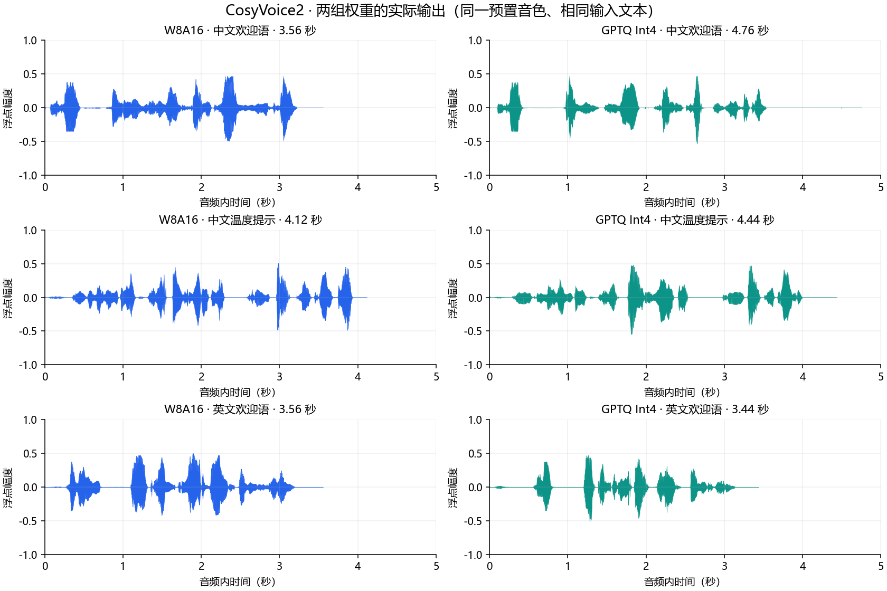

# CosyVoice2 部署指南

CosyVoice2 用于语音合成。本页说明 M.2 算力卡的接入条件、部署步骤与结果检查方法。

> 已实测，效果仍需评估。[查看部署效果](#查看部署效果)。

## 准备运行环境

本页效果展示使用 **RK3576 + AX8850 16GB M.2**；其他容量或平台需重新确认模型能否加载并正确运行。

在连接算力卡的 Linux 主机终端执行，RK3576 使用 ARM64 环境。首次部署先完成[驱动与设备检查](../../usage/device-check.md)、[准备主机环境](../../getting-started/prepare.md)和[下载工具安装](../../usage/download-models.md#使用-hugging-face-下载)。已完成这些步骤可直接下载模型。

后文使用设备 0，运行前用 `axcl-smi` 确认设备可用。

## 下载模型与样例

本页使用 `AXERA-TECH/CosyVoice2` 的固定版本。下面下载本页选用的 109 个文件。

```bash
MODEL_DIR=~/edgeaccel/models/cosyvoice2/047c1933de85
mkdir -p "$MODEL_DIR"
~/edgeaccel/hf-env/bin/hf download AXERA-TECH/CosyVoice2 \
  "CosyVoice-BlankEN-Ax650-prefill_512/llm.llm_embedding.float16.bin" \
  "CosyVoice-BlankEN-Ax650-prefill_512/llm.speech_embedding.float16.bin" \
  "CosyVoice-BlankEN-Ax650-prefill_512/llm_decoder.axmodel" \
  "CosyVoice-BlankEN-Ax650-prefill_512/model.embed_tokens.weight.bfloat16.bin" \
  "CosyVoice-BlankEN-Ax650-prefill_512/qwen2_p128_l0_together.axmodel" \
  "CosyVoice-BlankEN-Ax650-prefill_512/qwen2_p128_l10_together.axmodel" \
  "CosyVoice-BlankEN-Ax650-prefill_512/qwen2_p128_l11_together.axmodel" \
  "CosyVoice-BlankEN-Ax650-prefill_512/qwen2_p128_l12_together.axmodel" \
  "CosyVoice-BlankEN-Ax650-prefill_512/qwen2_p128_l13_together.axmodel" \
  "CosyVoice-BlankEN-Ax650-prefill_512/qwen2_p128_l14_together.axmodel" \
  "CosyVoice-BlankEN-Ax650-prefill_512/qwen2_p128_l15_together.axmodel" \
  "CosyVoice-BlankEN-Ax650-prefill_512/qwen2_p128_l16_together.axmodel" \
  "CosyVoice-BlankEN-Ax650-prefill_512/qwen2_p128_l17_together.axmodel" \
  "CosyVoice-BlankEN-Ax650-prefill_512/qwen2_p128_l18_together.axmodel" \
  "CosyVoice-BlankEN-Ax650-prefill_512/qwen2_p128_l19_together.axmodel" \
  "CosyVoice-BlankEN-Ax650-prefill_512/qwen2_p128_l1_together.axmodel" \
  "CosyVoice-BlankEN-Ax650-prefill_512/qwen2_p128_l20_together.axmodel" \
  "CosyVoice-BlankEN-Ax650-prefill_512/qwen2_p128_l21_together.axmodel" \
  "CosyVoice-BlankEN-Ax650-prefill_512/qwen2_p128_l22_together.axmodel" \
  "CosyVoice-BlankEN-Ax650-prefill_512/qwen2_p128_l23_together.axmodel" \
  "CosyVoice-BlankEN-Ax650-prefill_512/qwen2_p128_l2_together.axmodel" \
  "CosyVoice-BlankEN-Ax650-prefill_512/qwen2_p128_l3_together.axmodel" \
  "CosyVoice-BlankEN-Ax650-prefill_512/qwen2_p128_l4_together.axmodel" \
  "CosyVoice-BlankEN-Ax650-prefill_512/qwen2_p128_l5_together.axmodel" \
  "CosyVoice-BlankEN-Ax650-prefill_512/qwen2_p128_l6_together.axmodel" \
  "CosyVoice-BlankEN-Ax650-prefill_512/qwen2_p128_l7_together.axmodel" \
  "CosyVoice-BlankEN-Ax650-prefill_512/qwen2_p128_l8_together.axmodel" \
  "CosyVoice-BlankEN-Ax650-prefill_512/qwen2_p128_l9_together.axmodel" \
  "CosyVoice-BlankEN-Ax650-prefill_512/qwen2_post.axmodel" \
  "CosyVoice-BlankEN-GPTQ-Int4-Ax650-prefill_512-c64/llm.llm_embedding.float16.bin" \
  "CosyVoice-BlankEN-GPTQ-Int4-Ax650-prefill_512-c64/llm.speech_embedding.float16.bin" \
  "CosyVoice-BlankEN-GPTQ-Int4-Ax650-prefill_512-c64/llm_decoder.axmodel" \
  "CosyVoice-BlankEN-GPTQ-Int4-Ax650-prefill_512-c64/model.embed_tokens.weight.bfloat16.bin" \
  "CosyVoice-BlankEN-GPTQ-Int4-Ax650-prefill_512-c64/qwen2_p64_l0_together.axmodel" \
  "CosyVoice-BlankEN-GPTQ-Int4-Ax650-prefill_512-c64/qwen2_p64_l10_together.axmodel" \
  "CosyVoice-BlankEN-GPTQ-Int4-Ax650-prefill_512-c64/qwen2_p64_l11_together.axmodel" \
  "CosyVoice-BlankEN-GPTQ-Int4-Ax650-prefill_512-c64/qwen2_p64_l12_together.axmodel" \
  "CosyVoice-BlankEN-GPTQ-Int4-Ax650-prefill_512-c64/qwen2_p64_l13_together.axmodel" \
  "CosyVoice-BlankEN-GPTQ-Int4-Ax650-prefill_512-c64/qwen2_p64_l14_together.axmodel" \
  "CosyVoice-BlankEN-GPTQ-Int4-Ax650-prefill_512-c64/qwen2_p64_l15_together.axmodel" \
  "CosyVoice-BlankEN-GPTQ-Int4-Ax650-prefill_512-c64/qwen2_p64_l16_together.axmodel" \
  "CosyVoice-BlankEN-GPTQ-Int4-Ax650-prefill_512-c64/qwen2_p64_l17_together.axmodel" \
  "CosyVoice-BlankEN-GPTQ-Int4-Ax650-prefill_512-c64/qwen2_p64_l18_together.axmodel" \
  "CosyVoice-BlankEN-GPTQ-Int4-Ax650-prefill_512-c64/qwen2_p64_l19_together.axmodel" \
  "CosyVoice-BlankEN-GPTQ-Int4-Ax650-prefill_512-c64/qwen2_p64_l1_together.axmodel" \
  "CosyVoice-BlankEN-GPTQ-Int4-Ax650-prefill_512-c64/qwen2_p64_l20_together.axmodel" \
  "CosyVoice-BlankEN-GPTQ-Int4-Ax650-prefill_512-c64/qwen2_p64_l21_together.axmodel" \
  "CosyVoice-BlankEN-GPTQ-Int4-Ax650-prefill_512-c64/qwen2_p64_l22_together.axmodel" \
  "CosyVoice-BlankEN-GPTQ-Int4-Ax650-prefill_512-c64/qwen2_p64_l23_together.axmodel" \
  "CosyVoice-BlankEN-GPTQ-Int4-Ax650-prefill_512-c64/qwen2_p64_l2_together.axmodel" \
  "CosyVoice-BlankEN-GPTQ-Int4-Ax650-prefill_512-c64/qwen2_p64_l3_together.axmodel" \
  "CosyVoice-BlankEN-GPTQ-Int4-Ax650-prefill_512-c64/qwen2_p64_l4_together.axmodel" \
  "CosyVoice-BlankEN-GPTQ-Int4-Ax650-prefill_512-c64/qwen2_p64_l5_together.axmodel" \
  "CosyVoice-BlankEN-GPTQ-Int4-Ax650-prefill_512-c64/qwen2_p64_l6_together.axmodel" \
  "CosyVoice-BlankEN-GPTQ-Int4-Ax650-prefill_512-c64/qwen2_p64_l7_together.axmodel" \
  "CosyVoice-BlankEN-GPTQ-Int4-Ax650-prefill_512-c64/qwen2_p64_l8_together.axmodel" \
  "CosyVoice-BlankEN-GPTQ-Int4-Ax650-prefill_512-c64/qwen2_p64_l9_together.axmodel" \
  "CosyVoice-BlankEN-GPTQ-Int4-Ax650-prefill_512-c64/qwen2_post.axmodel" \
  "README.md" \
  "main_axcl_aarch64" \
  "onnxruntime-linux-aarch64-1.23.0/GIT_COMMIT_ID" \
  "onnxruntime-linux-aarch64-1.23.0/LICENSE" \
  "onnxruntime-linux-aarch64-1.23.0/Privacy.md" \
  "onnxruntime-linux-aarch64-1.23.0/README.md" \
  "onnxruntime-linux-aarch64-1.23.0/ThirdPartyNotices.txt" \
  "onnxruntime-linux-aarch64-1.23.0/VERSION_NUMBER" \
  "onnxruntime-linux-aarch64-1.23.0/lib/cmake/onnxruntime/onnxruntimeConfig.cmake" \
  "onnxruntime-linux-aarch64-1.23.0/lib/cmake/onnxruntime/onnxruntimeConfigVersion.cmake" \
  "onnxruntime-linux-aarch64-1.23.0/lib/cmake/onnxruntime/onnxruntimeTargets-release.cmake" \
  "onnxruntime-linux-aarch64-1.23.0/lib/cmake/onnxruntime/onnxruntimeTargets.cmake" \
  "onnxruntime-linux-aarch64-1.23.0/lib/libonnxruntime.so" \
  "onnxruntime-linux-aarch64-1.23.0/lib/libonnxruntime.so.1" \
  "onnxruntime-linux-aarch64-1.23.0/lib/libonnxruntime.so.1.23.0" \
  "onnxruntime-linux-aarch64-1.23.0/lib/libonnxruntime_providers_shared.so" \
  "onnxruntime-linux-aarch64-1.23.0/lib/pkgconfig/libonnxruntime.pc" \
  "prompt_files/flow_embedding.txt" \
  "prompt_files/flow_prompt_speech_token.txt" \
  "prompt_files/llm_embedding.txt" \
  "prompt_files/llm_prompt_speech_token.txt" \
  "prompt_files/prompt_speech_feat.txt" \
  "prompt_files/prompt_text.txt" \
  "run_api_axcl_aarch64.sh" \
  "run_axcl_aarch64.sh" \
  "scripts/CosyVoice-BlankEN/merges.txt" \
  "scripts/CosyVoice-BlankEN/tokenizer_config.json" \
  "scripts/CosyVoice-BlankEN/vocab.json" \
  "scripts/audio.py" \
  "scripts/cosyvoice2_tokenizer.py" \
  "scripts/frontend.py" \
  "scripts/gradio_demo.py" \
  "scripts/meldataset.py" \
  "scripts/process_prompt.py" \
  "scripts/requirements.txt" \
  "scripts/tokenizer/assets/multilingual_zh_ja_yue_char_del.tiktoken" \
  "scripts/tokenizer/tokenizer.py" \
  "token2wav-axmodels/flow.input_embedding.float16.bin" \
  "token2wav-axmodels/flow_encoder_28.axmodel" \
  "token2wav-axmodels/flow_encoder_50_final.axmodel" \
  "token2wav-axmodels/flow_encoder_53.axmodel" \
  "token2wav-axmodels/flow_encoder_78.axmodel" \
  "token2wav-axmodels/flow_estimator_200.axmodel" \
  "token2wav-axmodels/flow_estimator_250.axmodel" \
  "token2wav-axmodels/flow_estimator_300.axmodel" \
  "token2wav-axmodels/hift_p1_50_first.onnx" \
  "token2wav-axmodels/hift_p1_58.onnx" \
  "token2wav-axmodels/hift_p2_50_first.axmodel" \
  "token2wav-axmodels/hift_p2_58.axmodel" \
  "token2wav-axmodels/rand_noise_1_80_300.txt" \
  "token2wav-axmodels/speech_window_2x8x480.txt" \
  --revision 047c1933de85c7bef59eaf726c2ad1c17cda0f71 \
  --local-dir "$MODEL_DIR"
cd "$MODEL_DIR"
```

保留当前终端中的 `MODEL_DIR` 变量，后续命令沿用此目录。下载受阻或需要离线复制时，见[下载方式与文件校验](../../usage/download-models.md)。

## 准备语音合成环境

本例使用官方 ARM64 AXCL 程序，在 RK3576 + AX8850 16GB M.2 算力卡上合成 **24 kHz、单声道语音**。默认 W8A16 和 GPTQ Int4 两组权重分别提供中文与英文示例。

先确认 `axcl-smi` 能识别卡，再创建独立 Python 环境。Python 负责文本分词和结果保存，模型由官方原生程序运行：

```bash
python3 -m venv ~/edgeaccel/cosyvoice2-env
source ~/edgeaccel/cosyvoice2-env/bin/activate
python -m pip install 'numpy==1.26.4' 'torch==2.5.1' \
  'transformers==4.51.3' 'tokenizers==0.21.4' 'soundfile==0.13.1'
```

下载 [语音合成示例](../../../static/examples/cosyvoice2_card.py)，保存为 `~/edgeaccel/cosyvoice2_card.py`。示例复用仓库的 Qwen 分词实现，仅在本机回环地址启动临时服务，运行结束后自动关闭。

模型下载步骤固定了本次实测版本。保持上述 `MODEL_DIR`，不要混用两组 LLM 的层权重与 embedding：

| 参数 | LLM 目录 | 公共依赖 |
| --- | --- | --- |
| `--variant int8` | `CosyVoice-BlankEN-Ax650-prefill_512`，W8A16 | `token2wav-axmodels`、`prompt_files`、`scripts`、ARM64 程序和 ONNX Runtime |
| `--variant int4` | `CosyVoice-BlankEN-GPTQ-Int4-Ax650-prefill_512-c64` | 与默认配置相同 |

本次使用仓库预计算的 `prompt_files`。模型在卡上执行，分词和 HiFT P1 的 ONNX 运算在主机执行。随包 ONNX Runtime 为 1.23.0；示例在结果目录中创建运行库链接，无需覆盖系统 Python 的 ONNX Runtime。

## 运行默认权重与 Int4 权重

分别选择尚不存在的结果目录：

```bash
python ~/edgeaccel/cosyvoice2_card.py \
  --model-dir "$MODEL_DIR" --variant int8 \
  --output ~/edgeaccel/results/cosyvoice2-int8-01

python ~/edgeaccel/cosyvoice2_card.py \
  --model-dir "$MODEL_DIR" --variant int4 \
  --output ~/edgeaccel/results/cosyvoice2-int4-01
```

每种配置依次合成三句话：中文欢迎语、带数字的温度提示、英文欢迎语。每句话独立加载模型，使用设备 0 和单步 Flow 参数 `n_timesteps=1`，完成后释放模型。

合成自己的短句时添加 `--text`；重复该参数可以依次合成多句：

```bash
python ~/edgeaccel/cosyvoice2_card.py \
  --model-dir "$MODEL_DIR" --variant int4 \
  --text '您好，欢迎体验端侧语音合成。' \
  --output ~/edgeaccel/results/cosyvoice2-custom-01
```

本例保留官方预置提示词与音色；更换文本不需要重做提示音频。自定义音色需要另行生成 prompt 特征，本页没有将该流程计入实测通过范围。

## 查看结果与试听

| 文件 | 内容 |
| --- | --- |
| `sample-1.wav` 等 | 实际生成音频的 PCM16 版本，可在浏览器或播放器试听 |
| `sample-1/output.wav` | 原生程序生成的完整浮点 WAV |
| `sample-1/output_0.wav` 等 | 本次生成的各段浮点音频 |
| `deployment-result.json` | 输入文本、音频长度、完整进程耗时、采样率与文件哈希 |

本次两种配置的六段语音均正常结束，输出非空、数值有限且没有削波；完整浮点 WAV 与各分块按顺序拼接的结果逐点一致。下方可以试听这些实际输出。

耗时分两种口径：**生成耗时**取原生程序的 `tts total use time`，**总耗时**从程序启动计至退出，包含模型加载和释放。RTF 为生成耗时除以输出语音时长，数值小于 1 才表示该计时范围快于语音时长；本页没有将这些短句结果作为实时播报或首包延迟承诺。

当前结论为基本运行通过，尚未完成独立语音识别对照、主观听感评分、长文本和自定义音色评测。页面公开输入文本，便于对照试听；不以波形或非空音频代替发音正确性验证。


## 查看部署效果

**已运行，效果仍需评估** · 2026-09-28 · RK3576 + AX8850 16GB M.2。以下输入与输出来自本页固定版本的实际运行。

默认 W8A16 与 GPTQ Int4 均已完成三句中英文语音合成，以下为本次 16GB M.2 卡的六段真实输出。

**默认 W8A16**

三段短句均生成 24 kHz 单声道音频，达到 EOS；浮点分块拼接与完整音频逐点一致，无非有限值或削波。发音和听感仍需独立评测。

<div className="model-effect-gallery">

<figure>

[](../../../static/validation/effects/cosyvoice2-20260928/waveforms.png)

<figcaption>相同三句文本在两组权重下的实际语音波形</figcaption>
</figure>

</div>

| 输入文本 | 音频时长 | 生成耗时 / RTF | 含加载总耗时 |
| --- | --- | --- | --- |
| 你好，欢迎使用算力卡语音合成。 | 3.56 s | 12.081 s / 3.39 | 37.289 s |
| 今天的温度是二十六度，请打开窗户。 | 4.12 s | 13.758 s / 3.34 | 38.486 s |
| Hello, welcome to our voice demonstration. | 3.56 s | 11.631 s / 3.27 | 35.698 s |

默认 W8A16 · 你好，欢迎使用算力卡语音合成。

<audio controls preload="metadata" src="/validation/effects/cosyvoice2-20260928/int8-sample-1.wav" aria-label="默认 W8A16 · 你好，欢迎使用算力卡语音合成。"></audio>

[下载音频](../../../static/validation/effects/cosyvoice2-20260928/int8-sample-1.wav)

默认 W8A16 · 今天的温度是二十六度，请打开窗户。

<audio controls preload="metadata" src="/validation/effects/cosyvoice2-20260928/int8-sample-2.wav" aria-label="默认 W8A16 · 今天的温度是二十六度，请打开窗户。"></audio>

[下载音频](../../../static/validation/effects/cosyvoice2-20260928/int8-sample-2.wav)

默认 W8A16 · Hello, welcome to our voice demonstration.

<audio controls preload="metadata" src="/validation/effects/cosyvoice2-20260928/int8-sample-3.wav" aria-label="默认 W8A16 · Hello, welcome to our voice demonstration."></audio>

[下载音频](../../../static/validation/effects/cosyvoice2-20260928/int8-sample-3.wav)

**GPTQ Int4**

三段短句均生成 24 kHz 单声道音频，达到 EOS；浮点分块拼接与完整音频逐点一致，无非有限值或削波。发音和听感仍需独立评测。

| 输入文本 | 音频时长 | 生成耗时 / RTF | 含加载总耗时 |
| --- | --- | --- | --- |
| 你好，欢迎使用算力卡语音合成。 | 4.76 s | 13.834 s / 2.91 | 37.692 s |
| 今天的温度是二十六度，请打开窗户。 | 4.44 s | 13.205 s / 2.97 | 37.063 s |
| Hello, welcome to our voice demonstration. | 3.44 s | 11.488 s / 3.34 | 34.510 s |

GPTQ Int4 · 你好，欢迎使用算力卡语音合成。

<audio controls preload="metadata" src="/validation/effects/cosyvoice2-20260928/int4-sample-1.wav" aria-label="GPTQ Int4 · 你好，欢迎使用算力卡语音合成。"></audio>

[下载音频](../../../static/validation/effects/cosyvoice2-20260928/int4-sample-1.wav)

GPTQ Int4 · 今天的温度是二十六度，请打开窗户。

<audio controls preload="metadata" src="/validation/effects/cosyvoice2-20260928/int4-sample-2.wav" aria-label="GPTQ Int4 · 今天的温度是二十六度，请打开窗户。"></audio>

[下载音频](../../../static/validation/effects/cosyvoice2-20260928/int4-sample-2.wav)

GPTQ Int4 · Hello, welcome to our voice demonstration.

<audio controls preload="metadata" src="/validation/effects/cosyvoice2-20260928/int4-sample-3.wav" aria-label="GPTQ Int4 · Hello, welcome to our voice demonstration."></audio>

[下载音频](../../../static/validation/effects/cosyvoice2-20260928/int4-sample-3.wav)

**使用时注意：**

- 使用官方预计算音色，未覆盖自定义提示音频、长文本、API / Gradio 服务或 MNN 分支。
- 采用官方 ARM64 AXCL 二进制，HiFT P1 在主机 ONNX Runtime 运行；没有逐层张量与全部动态形状覆盖记录。

这些结果用于对照部署后的输出，未覆盖完整数据集精度或长期连续运行。

<details>
<summary>查看样例环境与运行耗时</summary>

环境：RK3576 + AX8850 16GB M.2。日期：2026-09-28。模型版本：`047c1933de85c7bef59eaf726c2ad1c17cda0f71`。

| 组件 | 版本或配置 |
| --- | --- |
| 主机 / 内核 | RK3576，约 4GB RAM，6.1.115-vendor-rk35xx |
| AXCL / 驱动 | V3.16.0_20260729180218 |
| 固件 / CMM | V3.16.0 / 15232 MiB |
| 运行方式 | 官方 ARM64 AXCL C++ 程序；主机 ONNX Runtime 1.23.0；Python 3.12 / Torch 2.5.1 / Transformers 4.51.3 分词 |

| 指标 | 实测值 | 计时或统计范围 |
| --- | --- | --- |
| 默认 W8A16 中文欢迎语 | 3.56 s 音频 / 12.081 s 生成 | 原生 TTS 计时，含主机与卡的语音生成过程，不含模型加载；详细总耗时见表格。 |
| GPTQ Int4 中文欢迎语 | 4.76 s 音频 / 13.834 s 生成 | 原生 TTS 计时，含主机与卡的语音生成过程，不含模型加载；详细总耗时见表格。 |

适用范围：

- 使用官方预计算音色，未覆盖自定义提示音频、长文本、API / Gradio 服务或 MNN 分支。
- 采用官方 ARM64 AXCL 二进制，HiFT P1 在主机 ONNX Runtime 运行；没有逐层张量与全部动态形状覆盖记录。
- 音频有限且非空属于基本运行检查；发音正确性、音色相似度、听感和真实8GB容量仍需独立验证。

</details>

遇到加载、内存或后端错误时，按[常见问题](../../usage/troubleshooting.md)处理。需要更换输入或接入业务时，按[检查输出与记录结果](../../reference/validation.md)保留自己的结果。

<details>
<summary>查看文件用途与版本信息</summary>

| 文件 / 目录内路径 | 用途 |
| --- | --- |
| [`run_axcl_aarch64.sh`](https://huggingface.co/AXERA-TECH/CosyVoice2/blob/047c1933de85c7bef59eaf726c2ad1c17cda0f71/run_axcl_aarch64.sh) | 启动或构建脚本 |
| [`scripts/cosyvoice2_tokenizer.py`](https://huggingface.co/AXERA-TECH/CosyVoice2/blob/047c1933de85c7bef59eaf726c2ad1c17cda0f71/scripts/cosyvoice2_tokenizer.py) | 旧版分词服务入口 |
| [`scripts/gradio_demo.py`](https://huggingface.co/AXERA-TECH/CosyVoice2/blob/047c1933de85c7bef59eaf726c2ad1c17cda0f71/scripts/gradio_demo.py) | Python 程序 / 前后处理 |
| [`CosyVoice-BlankEN-Ax650-prefill_512/llm_decoder.axmodel`](https://huggingface.co/AXERA-TECH/CosyVoice2/blob/047c1933de85c7bef59eaf726c2ad1c17cda0f71/CosyVoice-BlankEN-Ax650-prefill_512/llm_decoder.axmodel) | 编译模型；按目录区分芯片和规格 |
| [`CosyVoice-BlankEN-Ax650-prefill_512/qwen2_p128_l0_together.axmodel`](https://huggingface.co/AXERA-TECH/CosyVoice2/blob/047c1933de85c7bef59eaf726c2ad1c17cda0f71/CosyVoice-BlankEN-Ax650-prefill_512/qwen2_p128_l0_together.axmodel) | 编译模型；按目录区分芯片和规格 |
| [`CosyVoice-BlankEN-Ax650-prefill_512/qwen2_p128_l10_together.axmodel`](https://huggingface.co/AXERA-TECH/CosyVoice2/blob/047c1933de85c7bef59eaf726c2ad1c17cda0f71/CosyVoice-BlankEN-Ax650-prefill_512/qwen2_p128_l10_together.axmodel) | 编译模型；按目录区分芯片和规格 |
| [`CosyVoice-BlankEN-Ax650-prefill_512/qwen2_p128_l11_together.axmodel`](https://huggingface.co/AXERA-TECH/CosyVoice2/blob/047c1933de85c7bef59eaf726c2ad1c17cda0f71/CosyVoice-BlankEN-Ax650-prefill_512/qwen2_p128_l11_together.axmodel) | 编译模型；按目录区分芯片和规格 |
| [`CosyVoice-BlankEN-Ax650-prefill_512/qwen2_p128_l12_together.axmodel`](https://huggingface.co/AXERA-TECH/CosyVoice2/blob/047c1933de85c7bef59eaf726c2ad1c17cda0f71/CosyVoice-BlankEN-Ax650-prefill_512/qwen2_p128_l12_together.axmodel) | 编译模型；按目录区分芯片和规格 |
| [`config.json`](https://huggingface.co/AXERA-TECH/CosyVoice2/blob/047c1933de85c7bef59eaf726c2ad1c17cda0f71/config.json) | 运行配置 |
| [`run_api_ax650.sh`](https://huggingface.co/AXERA-TECH/CosyVoice2/blob/047c1933de85c7bef59eaf726c2ad1c17cda0f71/run_api_ax650.sh) | 启动或构建脚本 |
| [`run_api_axcl_aarch64.sh`](https://huggingface.co/AXERA-TECH/CosyVoice2/blob/047c1933de85c7bef59eaf726c2ad1c17cda0f71/run_api_axcl_aarch64.sh) | 启动或构建脚本 |
| [`run_api_axcl_x86.sh`](https://huggingface.co/AXERA-TECH/CosyVoice2/blob/047c1933de85c7bef59eaf726c2ad1c17cda0f71/run_api_axcl_x86.sh) | 启动或构建脚本 |
| [`run_ax650.sh`](https://huggingface.co/AXERA-TECH/CosyVoice2/blob/047c1933de85c7bef59eaf726c2ad1c17cda0f71/run_ax650.sh) | 启动或构建脚本 |
| [`run_axcl_x86.sh`](https://huggingface.co/AXERA-TECH/CosyVoice2/blob/047c1933de85c7bef59eaf726c2ad1c17cda0f71/run_axcl_x86.sh) | 启动或构建脚本 |

仓库提交：`047c1933de85c7bef59eaf726c2ad1c17cda0f71`。仓库中的 61 个 `.axmodel` 文件可能包括多个芯片、规格和分片。运行时使用本页指定的配套文件，完整列表见[固定版本目录](https://huggingface.co/AXERA-TECH/CosyVoice2/tree/047c1933de85c7bef59eaf726c2ad1c17cda0f71)。

</details>

## 参考资料

- [常用术语](../../reference/glossary.md)：AXCL、CMM、分词器与推理指标。
- [固定版本文件表](https://huggingface.co/AXERA-TECH/CosyVoice2/tree/047c1933de85c7bef59eaf726c2ad1c17cda0f71)。
- [模型卡 / 使用说明](https://huggingface.co/AXERA-TECH/CosyVoice2/blob/047c1933de85c7bef59eaf726c2ad1c17cda0f71/README.md)。
- [主要程序入口：scripts/cosyvoice2_tokenizer.py](https://huggingface.co/AXERA-TECH/CosyVoice2/blob/047c1933de85c7bef59eaf726c2ad1c17cda0f71/scripts/cosyvoice2_tokenizer.py)。
- [配套项目：AXERA-TECH/Cosyvoice2.Axera](https://github.com/AXERA-TECH/Cosyvoice2.Axera)。
- [配套项目：FunAudioLLM/CosyVoice](https://github.com/FunAudioLLM/CosyVoice)。
- [ModelScope 对应资源](https://modelscope.cn/models/AXERA-TECH/CosyVoice2)。不同平台的 revision 不通用，另行记录版本。

返回[完整模型目录](../catalog.mdx)。
