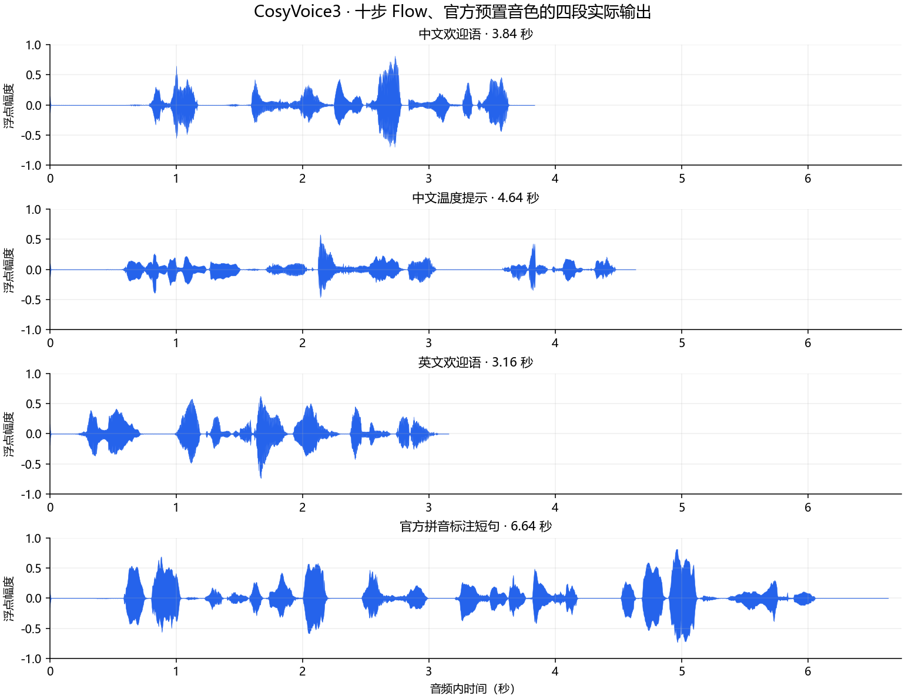

# CosyVoice3 部署指南

CosyVoice3 用于语音合成。本页说明 M.2 算力卡的接入条件、部署步骤与结果检查方法。

> 已实测，效果仍需评估。[查看部署效果](#查看部署效果)。

## 准备运行环境

本页效果展示使用 **RK3576 + AX8850 16GB M.2**；其他容量或平台需重新确认模型能否加载并正确运行。

在连接算力卡的 Linux 主机终端执行，RK3576 使用 ARM64 环境。首次部署先完成[驱动与设备检查](../../usage/device-check.md)、[准备主机环境](../../getting-started/prepare.md)和[下载工具安装](../../usage/download-models.md#使用-hugging-face-下载)。已完成这些步骤可直接下载模型。

后文使用设备 0，运行前用 `axcl-smi` 确认设备可用。

## 下载模型与样例

本页使用 `AXERA-TECH/CosyVoice3` 的固定版本。下面下载本页选用的 68 个文件。

```bash
MODEL_DIR=~/edgeaccel/models/cosyvoice3/6ca7c7e124eb
mkdir -p "$MODEL_DIR"
~/edgeaccel/hf-env/bin/hf download AXERA-TECH/CosyVoice3 \
  "CosyVoice-BlankEN-Ax650-C64-P256-CTX512/llm.speech_embedding.float16.bin" \
  "CosyVoice-BlankEN-Ax650-C64-P256-CTX512/llm_decoder.axmodel" \
  "CosyVoice-BlankEN-Ax650-C64-P256-CTX512/model.embed_tokens.weight.bfloat16.bin" \
  "CosyVoice-BlankEN-Ax650-C64-P256-CTX512/qwen2_p64_l0_together.axmodel" \
  "CosyVoice-BlankEN-Ax650-C64-P256-CTX512/qwen2_p64_l10_together.axmodel" \
  "CosyVoice-BlankEN-Ax650-C64-P256-CTX512/qwen2_p64_l11_together.axmodel" \
  "CosyVoice-BlankEN-Ax650-C64-P256-CTX512/qwen2_p64_l12_together.axmodel" \
  "CosyVoice-BlankEN-Ax650-C64-P256-CTX512/qwen2_p64_l13_together.axmodel" \
  "CosyVoice-BlankEN-Ax650-C64-P256-CTX512/qwen2_p64_l14_together.axmodel" \
  "CosyVoice-BlankEN-Ax650-C64-P256-CTX512/qwen2_p64_l15_together.axmodel" \
  "CosyVoice-BlankEN-Ax650-C64-P256-CTX512/qwen2_p64_l16_together.axmodel" \
  "CosyVoice-BlankEN-Ax650-C64-P256-CTX512/qwen2_p64_l17_together.axmodel" \
  "CosyVoice-BlankEN-Ax650-C64-P256-CTX512/qwen2_p64_l18_together.axmodel" \
  "CosyVoice-BlankEN-Ax650-C64-P256-CTX512/qwen2_p64_l19_together.axmodel" \
  "CosyVoice-BlankEN-Ax650-C64-P256-CTX512/qwen2_p64_l1_together.axmodel" \
  "CosyVoice-BlankEN-Ax650-C64-P256-CTX512/qwen2_p64_l20_together.axmodel" \
  "CosyVoice-BlankEN-Ax650-C64-P256-CTX512/qwen2_p64_l21_together.axmodel" \
  "CosyVoice-BlankEN-Ax650-C64-P256-CTX512/qwen2_p64_l22_together.axmodel" \
  "CosyVoice-BlankEN-Ax650-C64-P256-CTX512/qwen2_p64_l23_together.axmodel" \
  "CosyVoice-BlankEN-Ax650-C64-P256-CTX512/qwen2_p64_l2_together.axmodel" \
  "CosyVoice-BlankEN-Ax650-C64-P256-CTX512/qwen2_p64_l3_together.axmodel" \
  "CosyVoice-BlankEN-Ax650-C64-P256-CTX512/qwen2_p64_l4_together.axmodel" \
  "CosyVoice-BlankEN-Ax650-C64-P256-CTX512/qwen2_p64_l5_together.axmodel" \
  "CosyVoice-BlankEN-Ax650-C64-P256-CTX512/qwen2_p64_l6_together.axmodel" \
  "CosyVoice-BlankEN-Ax650-C64-P256-CTX512/qwen2_p64_l7_together.axmodel" \
  "CosyVoice-BlankEN-Ax650-C64-P256-CTX512/qwen2_p64_l8_together.axmodel" \
  "CosyVoice-BlankEN-Ax650-C64-P256-CTX512/qwen2_p64_l9_together.axmodel" \
  "CosyVoice-BlankEN-Ax650-C64-P256-CTX512/qwen2_post.axmodel" \
  "README.md" \
  "main_axcl_aarch64" \
  "prompt_files/flow_embedding.txt" \
  "prompt_files/flow_prompt_speech_token.txt" \
  "prompt_files/llm_embedding.txt" \
  "prompt_files/llm_prompt_speech_token.txt" \
  "prompt_files/prompt_speech_feat.txt" \
  "prompt_files/prompt_text.txt" \
  "run_axcl_aarch64.sh" \
  "scripts/CosyVoice-BlankEN/merges.txt" \
  "scripts/CosyVoice-BlankEN/tokenizer_config.json" \
  "scripts/CosyVoice-BlankEN/vocab.json" \
  "scripts/audio.py" \
  "scripts/cosyvoice3_tokenizer.py" \
  "scripts/frontend.py" \
  "scripts/gradio_demo.py" \
  "scripts/meldataset.py" \
  "scripts/process_prompt.py" \
  "scripts/requirements.txt" \
  "scripts/tokenizer/assets/multilingual_zh_ja_yue_char_del.tiktoken" \
  "scripts/tokenizer/tokenizer.py" \
  "token2wav-axmodels/flow.input_embedding.float16.bin" \
  "token2wav-axmodels/flow_encoder_28.axmodel" \
  "token2wav-axmodels/flow_encoder_50_final.axmodel" \
  "token2wav-axmodels/flow_encoder_53.axmodel" \
  "token2wav-axmodels/flow_encoder_78.axmodel" \
  "token2wav-axmodels/flow_estimator_200.axmodel" \
  "token2wav-axmodels/flow_estimator_250.axmodel" \
  "token2wav-axmodels/flow_estimator_300.axmodel" \
  "token2wav-axmodels/hift_p1_100.axmodel" \
  "token2wav-axmodels/hift_p1_100_final.axmodel" \
  "token2wav-axmodels/hift_p1_150.axmodel" \
  "token2wav-axmodels/hift_p1_50.axmodel" \
  "token2wav-axmodels/hift_p2_100.axmodel" \
  "token2wav-axmodels/hift_p2_100_final.axmodel" \
  "token2wav-axmodels/hift_p2_150.axmodel" \
  "token2wav-axmodels/hift_p2_50.axmodel" \
  "token2wav-axmodels/llm_decoder.axmodel" \
  "token2wav-axmodels/rand_noise_1_80_300.txt" \
  "token2wav-axmodels/speech_window_2x8x480.txt" \
  --revision 6ca7c7e124eb88d5219be18d4c6aedd159b494f4 \
  --local-dir "$MODEL_DIR"
cd "$MODEL_DIR"
```

保留当前终端中的 `MODEL_DIR` 变量，后续命令沿用此目录。下载受阻或需要离线复制时，见[下载方式与文件校验](../../usage/download-models.md)。

## 准备语音合成环境

本例使用固定版本的官方 ARM64 AXCL 程序，在 RK3576 + AX8850 16GB M.2 卡上运行 W8A16 权重。先确认 `axcl-smi` 能识别卡，再创建分词与音频保存环境：

```bash
python3 -m venv ~/edgeaccel/cosyvoice3-env
source ~/edgeaccel/cosyvoice3-env/bin/activate
python -m pip install 'numpy==1.26.4' 'torch==2.5.1' \
  'transformers==4.51.3' 'tokenizers==0.21.4' 'soundfile==0.13.1'
```

下载 [CosyVoice3 运行示例](../../../static/examples/cosyvoice3_card.py)，保存为 `~/edgeaccel/cosyvoice3_card.py`。示例复用仓库中的 CosyVoice3 分词器，临时服务仅监听本机回环地址；Python 不负责模型推理。

前面的下载命令包含本例需要的 LLM、token2wav、预计算提示特征和 ARM64 程序，约 2.07 GB。使用 `CosyVoice-BlankEN-Ax650-C64-P256-CTX512` 与同版本 `token2wav-axmodels`，保留目录结构。这里使用仓库的预置音色，无需下载生成自定义提示特征的 frontend ONNX 模型。

## 运行文本转语音

保持下载步骤中的 `MODEL_DIR`，选择尚不存在的结果目录：

```bash
python ~/edgeaccel/cosyvoice3_card.py \
  --model-dir "$MODEL_DIR" \
  --output ~/edgeaccel/results/cosyvoice3-01
```

例程依次合成中文欢迎语、中文温度提示、英文欢迎语，以及官方脚本中的拼音标注短句。每句独立加载模型，使用设备 0，结束后释放模型。

本例按官方 ARM64 脚本设置 `n_timesteps=10`，LLM 和 speech embedding 均使用 `llm.speech_embedding.float16.bin`。这些参数与 CosyVoice2 不同，请使用本页例程和对应版本的文件。

合成自己的短句时添加 `--text`，重复该参数可依次合成多句：

```bash
python ~/edgeaccel/cosyvoice3_card.py \
  --model-dir "$MODEL_DIR" \
  --text '您好，欢迎体验端侧语音合成。' \
  --output ~/edgeaccel/results/cosyvoice3-custom-01
```

官方示例使用 `[j][ǐ]` 标注拼音，词表中有对应的特殊 token。本页保留这一输入及其实际输出；标注是否改善发音，需要对照试听和独立评测。

## 查看音频输出

| 文件 | 内容 |
| --- | --- |
| `sample-1.wav` 等 | 完整语音的 PCM16 版本，可在浏览器或播放器试听 |
| `sample-1/output.wav` | 原生程序生成的完整浮点 WAV |
| `deployment-result.json` | 输入文本、采样率、时长、完整进程耗时和文件哈希 |

运行完成后，结果 JSON 中 `completed` 应为 `true`，各样例的 `exitCode` 应为 `0`。页面下方展示本次实际输出，便于将输入文本与生成语音对照。

总耗时包含模型加载、分词、主机处理、AXCL 推理、写文件与释放。若展示原生程序内部的生成耗时，会单独标注；两种计时都不能直接当作首包延迟或实时播放性能。

本页验证预置音色的短文本流程。自定义提示音频、长文本、独立识别对照和主观音质评分仍需按应用场景评测；模型文件已配置或加载，不等于所有形状与分支都已执行。


## 查看部署效果

**已运行，效果仍需评估** · 2026-09-28 · RK3576 + AX8850 16GB M.2。以下输入与输出来自本页固定版本的实际运行。

官方 W8A16 配置已完成两句中文、一句英文和一句拼音标注文本的语音生成，下面展示四段实际输出。

**W8A16 · 十步 Flow**

四段短句均达到 EOS，输出 24 kHz 单声道语音，数值有限且无削波。拼音标注样例也保留实际音频，未据此判定发音准确率。

<div className="model-effect-gallery">

<figure>

[](../../../static/validation/effects/cosyvoice3-20260928/waveforms.png)

<figcaption>四段实际生成语音的浮点波形</figcaption>
</figure>

</div>

| 输入文本 | 音频时长 | 含加载总耗时 | 生成耗时 / RTF |
| --- | --- | --- | --- |
| 你好，欢迎使用算力卡语音合成。 | 3.84 s | 54.540 s | 17.672 s / 4.60 |
| 今天的温度是二十六度，请打开窗户。 | 4.64 s | 58.619 s | 21.617 s / 4.66 |
| Hello, welcome to our voice demonstration. | 3.16 s | 46.516 s | 15.030 s / 4.76 |
| 高管也通过电话、短信、微信等方式对报道[j][ǐ]予好评。 | 6.64 s | 63.748 s | 29.359 s / 4.42 |

你好，欢迎使用算力卡语音合成。

<audio controls preload="metadata" src="/validation/effects/cosyvoice3-20260928/sample-1.wav" aria-label="你好，欢迎使用算力卡语音合成。"></audio>

[下载音频](../../../static/validation/effects/cosyvoice3-20260928/sample-1.wav)

今天的温度是二十六度，请打开窗户。

<audio controls preload="metadata" src="/validation/effects/cosyvoice3-20260928/sample-2.wav" aria-label="今天的温度是二十六度，请打开窗户。"></audio>

[下载音频](../../../static/validation/effects/cosyvoice3-20260928/sample-2.wav)

Hello, welcome to our voice demonstration.

<audio controls preload="metadata" src="/validation/effects/cosyvoice3-20260928/sample-3.wav" aria-label="Hello, welcome to our voice demonstration."></audio>

[下载音频](../../../static/validation/effects/cosyvoice3-20260928/sample-3.wav)

高管也通过电话、短信、微信等方式对报道[j][ǐ]予好评。

<audio controls preload="metadata" src="/validation/effects/cosyvoice3-20260928/sample-4.wav" aria-label="高管也通过电话、短信、微信等方式对报道[j][ǐ]予好评。"></audio>

[下载音频](../../../static/validation/effects/cosyvoice3-20260928/sample-4.wav)

**使用时注意：**

- 本次使用预计算提示音色，未覆盖自定义提示音频、长文本、API / Gradio 服务。
- 采用官方 ARM64 AXCL 二进制，未取得逐模型、逐形状执行轨迹；有限值检查针对最终音频。

这些结果用于对照部署后的输出，未覆盖完整数据集精度或长期连续运行。

<details>
<summary>查看样例环境与运行耗时</summary>

环境：RK3576 + AX8850 16GB M.2。日期：2026-09-28。模型版本：`6ca7c7e124eb88d5219be18d4c6aedd159b494f4`。

| 组件 | 版本或配置 |
| --- | --- |
| 主机 / 内核 | RK3576，约 4GB RAM，6.1.115-vendor-rk35xx |
| AXCL / 驱动 | V3.16.0_20260729180218 |
| 固件 / CMM | V3.16.0 / 15232 MiB |
| 运行方式 | 官方 ARM64 AXCL C++ 程序；Python 3.12 / Torch 2.5.1 / Transformers 4.51.3 分词 |

| 指标 | 实测值 | 计时或统计范围 |
| --- | --- | --- |
| 生成音频 | 4 段，24 kHz / 单声道 | 官方预计算提示音色，n_timesteps=10；每段独立加载和运行。 |
| 单段完整进程耗时 | 46.516–63.748 s | 包含模型加载、主机与卡推理、写文件及释放，不是纯NPU延迟。 |

适用范围：

- 本次使用预计算提示音色，未覆盖自定义提示音频、长文本、API / Gradio 服务。
- 采用官方 ARM64 AXCL 二进制，未取得逐模型、逐形状执行轨迹；有限值检查针对最终音频。
- 发音、音色相似度和主观听感仍需独立评测；16GB结果不等同于真实8GB通过。

</details>

遇到加载、内存或后端错误时，按[常见问题](../../usage/troubleshooting.md)处理。需要更换输入或接入业务时，按[检查输出与记录结果](../../reference/validation.md)保留自己的结果。

<details>
<summary>查看文件用途与版本信息</summary>

| 文件 / 目录内路径 | 用途 |
| --- | --- |
| [`run_axcl_aarch64.sh`](https://huggingface.co/AXERA-TECH/CosyVoice3/blob/6ca7c7e124eb88d5219be18d4c6aedd159b494f4/run_axcl_aarch64.sh) | 启动或构建脚本 |
| [`scripts/cosyvoice3_tokenizer.py`](https://huggingface.co/AXERA-TECH/CosyVoice3/blob/6ca7c7e124eb88d5219be18d4c6aedd159b494f4/scripts/cosyvoice3_tokenizer.py) | 旧版分词服务入口 |
| [`scripts/gradio_demo.py`](https://huggingface.co/AXERA-TECH/CosyVoice3/blob/6ca7c7e124eb88d5219be18d4c6aedd159b494f4/scripts/gradio_demo.py) | Python 程序 / 前后处理 |
| [`CosyVoice-BlankEN-Ax650-C64-P256-CTX512/llm_decoder.axmodel`](https://huggingface.co/AXERA-TECH/CosyVoice3/blob/6ca7c7e124eb88d5219be18d4c6aedd159b494f4/CosyVoice-BlankEN-Ax650-C64-P256-CTX512/llm_decoder.axmodel) | 编译模型；按目录区分芯片和规格 |
| [`CosyVoice-BlankEN-Ax650-C64-P256-CTX512/qwen2_p64_l0_together.axmodel`](https://huggingface.co/AXERA-TECH/CosyVoice3/blob/6ca7c7e124eb88d5219be18d4c6aedd159b494f4/CosyVoice-BlankEN-Ax650-C64-P256-CTX512/qwen2_p64_l0_together.axmodel) | 编译模型；按目录区分芯片和规格 |
| [`CosyVoice-BlankEN-Ax650-C64-P256-CTX512/qwen2_p64_l10_together.axmodel`](https://huggingface.co/AXERA-TECH/CosyVoice3/blob/6ca7c7e124eb88d5219be18d4c6aedd159b494f4/CosyVoice-BlankEN-Ax650-C64-P256-CTX512/qwen2_p64_l10_together.axmodel) | 编译模型；按目录区分芯片和规格 |
| [`CosyVoice-BlankEN-Ax650-C64-P256-CTX512/qwen2_p64_l11_together.axmodel`](https://huggingface.co/AXERA-TECH/CosyVoice3/blob/6ca7c7e124eb88d5219be18d4c6aedd159b494f4/CosyVoice-BlankEN-Ax650-C64-P256-CTX512/qwen2_p64_l11_together.axmodel) | 编译模型；按目录区分芯片和规格 |
| [`CosyVoice-BlankEN-Ax650-C64-P256-CTX512/qwen2_p64_l12_together.axmodel`](https://huggingface.co/AXERA-TECH/CosyVoice3/blob/6ca7c7e124eb88d5219be18d4c6aedd159b494f4/CosyVoice-BlankEN-Ax650-C64-P256-CTX512/qwen2_p64_l12_together.axmodel) | 编译模型；按目录区分芯片和规格 |
| [`config.json`](https://huggingface.co/AXERA-TECH/CosyVoice3/blob/6ca7c7e124eb88d5219be18d4c6aedd159b494f4/config.json) | 运行配置 |
| [`run_api_ax650.sh`](https://huggingface.co/AXERA-TECH/CosyVoice3/blob/6ca7c7e124eb88d5219be18d4c6aedd159b494f4/run_api_ax650.sh) | 启动或构建脚本 |
| [`run_api_axcl_aarch64.sh`](https://huggingface.co/AXERA-TECH/CosyVoice3/blob/6ca7c7e124eb88d5219be18d4c6aedd159b494f4/run_api_axcl_aarch64.sh) | 启动或构建脚本 |
| [`run_api_axcl_x86.sh`](https://huggingface.co/AXERA-TECH/CosyVoice3/blob/6ca7c7e124eb88d5219be18d4c6aedd159b494f4/run_api_axcl_x86.sh) | 启动或构建脚本 |
| [`run_ax650.sh`](https://huggingface.co/AXERA-TECH/CosyVoice3/blob/6ca7c7e124eb88d5219be18d4c6aedd159b494f4/run_ax650.sh) | 启动或构建脚本 |
| [`run_axcl_x86.sh`](https://huggingface.co/AXERA-TECH/CosyVoice3/blob/6ca7c7e124eb88d5219be18d4c6aedd159b494f4/run_axcl_x86.sh) | 启动或构建脚本 |

仓库提交：`6ca7c7e124eb88d5219be18d4c6aedd159b494f4`。仓库中的 42 个 `.axmodel` 文件可能包括多个芯片、规格和分片。运行时使用本页指定的配套文件，完整列表见[固定版本目录](https://huggingface.co/AXERA-TECH/CosyVoice3/tree/6ca7c7e124eb88d5219be18d4c6aedd159b494f4)。

</details>

## 参考资料

- [常用术语](../../reference/glossary.md)：AXCL、CMM、分词器与推理指标。
- [固定版本文件表](https://huggingface.co/AXERA-TECH/CosyVoice3/tree/6ca7c7e124eb88d5219be18d4c6aedd159b494f4)。
- [模型卡 / 使用说明](https://huggingface.co/AXERA-TECH/CosyVoice3/blob/6ca7c7e124eb88d5219be18d4c6aedd159b494f4/README.md)。
- [主要程序入口：scripts/cosyvoice3_tokenizer.py](https://huggingface.co/AXERA-TECH/CosyVoice3/blob/6ca7c7e124eb88d5219be18d4c6aedd159b494f4/scripts/cosyvoice3_tokenizer.py)。
- [配套项目：AXERA-TECH/CosyVoice3.Axera](https://github.com/AXERA-TECH/CosyVoice3.Axera)。
- [配套项目：FunAudioLLM/CosyVoice](https://github.com/FunAudioLLM/CosyVoice)。
- [ModelScope 对应资源](https://modelscope.cn/models/AXERA-TECH/CosyVoice3)。不同平台的 revision 不通用，另行记录版本。

返回[完整模型目录](../catalog.mdx)。
