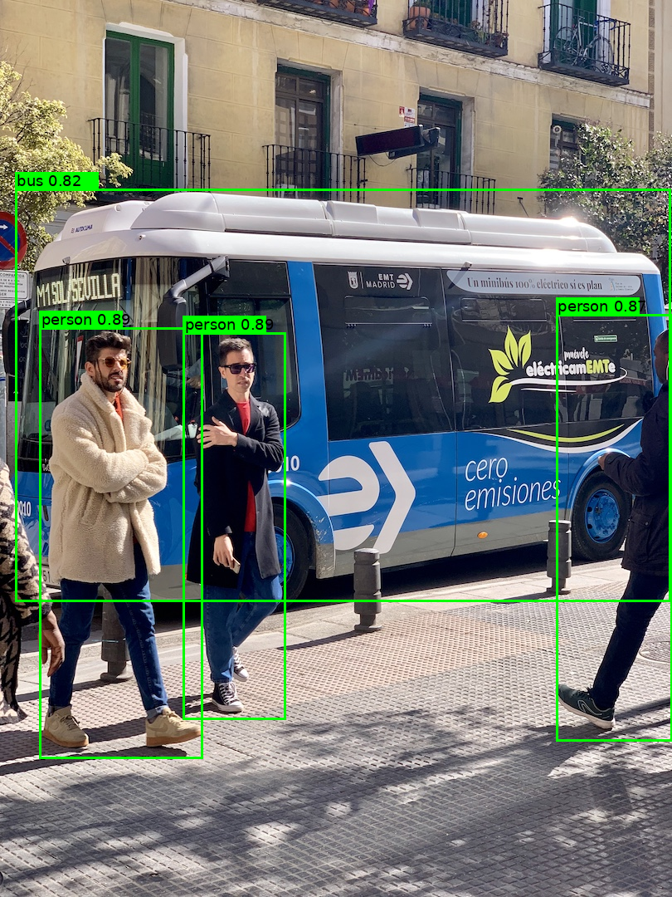

# Deformable-Detr 部署指南

Deformable-Detr 用于目标检测。本页说明 M.2 算力卡的接入条件、部署步骤与结果检查方法。

> 已实测，效果仍需评估。[查看部署效果](#查看部署效果)。

## 准备运行环境

本页效果展示使用 **RK3576 + AX8850 16GB M.2**；其他容量或平台需重新确认模型能否加载并正确运行。

在连接算力卡的 Linux 主机终端执行，RK3576 使用 ARM64 环境。首次部署先完成[驱动与设备检查](../../usage/device-check.md)、[安装 PyAXEngine](../../usage/python.md)和[下载工具安装](../../usage/download-models.md#使用-hugging-face-下载)。已完成这些步骤可直接下载模型。

后文使用设备 0，运行前用 `axcl-smi` 确认设备可用。

## 下载模型与样例

本页使用 `AXERA-TECH/Deformable-Detr` 的固定版本。下面下载本页选用的 5 个文件。

```bash
MODEL_DIR=~/edgeaccel/models/deformable-detr/4c8ecf91689c
mkdir -p "$MODEL_DIR"
~/edgeaccel/hf-env/bin/hf download AXERA-TECH/Deformable-Detr \
  "README.md" \
  "LICENSE" \
  "src/inference.py" \
  "assets/bus.jpg" \
  "output/detr.axmodel" \
  --revision 4c8ecf91689ce36126281c575b1087ba9d04bcc7 \
  --local-dir "$MODEL_DIR"
cd "$MODEL_DIR"
```

保留当前终端中的 `MODEL_DIR` 变量，后续命令沿用此目录。下载受阻或需要离线复制时，见[下载方式与文件校验](../../usage/download-models.md)。

## 准备 Python 环境

先完成 [AXCL Python 环境](../../usage/python.md)，确认可用执行后端包含 `AXCLRTExecutionProvider`。本例使用 PyAXEngine 0.1.3.rc3、NumPy 1.26.4 和 Pillow。

```bash
source ~/edgeaccel/python-env/bin/activate
python -m pip install 'numpy==1.26.4' 'pillow==11.3.0'
python -c "import axengine; print(axengine.get_available_providers())"
```

## 运行官方公交车样例

下载 [Deformable-DETR 算力卡示例](../../../static/examples/deformable_detr_card.py)，保存为 `~/edgeaccel/deformable_detr_card.py`。保持上文下载步骤中的 `MODEL_DIR`，指定一个尚不存在的输出目录：

```bash
python ~/edgeaccel/deformable_detr_card.py \
  --model-dir "$MODEL_DIR" \
  --output ~/edgeaccel/results/deformable-detr-bus \
  --threshold 0.6
```

程序从固定仓库读取 `output/detr.axmodel` 和 `assets/bus.jpg`，显式使用 AXCL。图像缩放、左上角对齐、黑色填充及坐标还原沿用官方 `src/inference.py`；按该脚本关闭均值和标准差归一化。

同一图片运行三次，输出目录包含：

| 文件 | 内容 |
| --- | --- |
| `input.png` | 本次实际输入图片 |
| `output-1.png` 至 `output-3.png` | 三次推理各自的检测框和类别 |
| `deployment-result.json` | 框坐标、类别、置信度和每次推理耗时 |
| `raw-1.npz` 至 `raw-3.npz` | 原始输出张量，供进一步核对 |

在桌面图片查看器中打开 `output-1.png`，即可查看本次生成的结果。`--threshold` 控制保留候选框的最低置信度；下方实测使用 `0.6`。框的数量不能直接当作真实目标数量，仍需对照原图检查误检和漏检。


## 查看部署效果

**已运行，效果仍需评估** · 2026-09-28 · RK3576 + AX8850 16GB M.2。以下输入与输出来自本页固定版本的实际运行。

官方公交车图片完成三次检测，保留公交车和三名行人的候选框，三次原始输出一致；边缘不完整人物存在漏检。

**官方公交车图片**

阈值 0.6，保留 1 个公交车框和 3 个行人框。框对应画面中的公交车及三名主要可见行人；左侧仅露出部分身体的人未检出。同一输入三次原始输出逐项一致。

<div className="model-effect-gallery">

<figure>

[](../../../static/validation/effects/deformable-detr-20260928/input.png)

<figcaption>官方公交车输入图片</figcaption>
</figure>

<figure>

[](../../../static/validation/effects/deformable-detr-20260928/output-1.png)

<figcaption>本次 AXCL 检测结果</figcaption>
</figure>

</div>

| 类别 | 候选框数 |
| --- | --- |
| person | 3 |
| bus | 1 |

**使用时注意：**

- 仅验证一张官方图片和三次重复，未用标注数据计算 mAP 或定位 IoU。
- 图像左侧不完整人物未检出；候选框数量不能视为真实人数。

这些结果用于对照部署后的输出，未覆盖完整数据集精度或长期连续运行。

<details>
<summary>查看样例环境与运行耗时</summary>

环境：RK3576 + AX8850 16GB M.2。日期：2026-09-28。模型版本：`4c8ecf91689ce36126281c575b1087ba9d04bcc7`。

| 组件 | 版本或配置 |
| --- | --- |
| 主机 / 内核 | RK3576，约 4GB RAM，6.1.115-vendor-rk35xx |
| AXCL / 驱动 | V3.16.0_20260729180218 |
| 固件 / CMM | V3.16.0 / 15232 MiB |
| Python 推理 | PyAXEngine 0.1.3.rc3 / AXCLRTExecutionProvider / NumPy 1.26.4 |
| 输入 / 输出 | float32 NHWC [1,608,608,3]；检测 [1,100,5]，类别 [1,100] |

| 指标 | 实测值 | 计时或统计范围 |
| --- | --- | --- |
| AXCL 推理调用平均耗时 | 136.222 ms | 同一输入三次 session.run，包含输入输出传输，不含模型加载、前后处理及画图；未剔除首轮。 |
| 三次推理调用 | 139.596 / 134.457 / 134.612 ms | 按执行顺序记录，非独立 NPU 内核计时。 |
| 模型加载 | 1.504 s | 创建 AXCL InferenceSession 的墙钟耗时。 |

适用范围：

- 仅验证一张官方图片和三次重复，未用标注数据计算 mAP 或定位 IoU。
- 图像左侧不完整人物未检出；候选框数量不能视为真实人数。
- 仅在 16GB 卡验证，8GB、视频及长时间运行待完成。

</details>

遇到加载、内存或后端错误时，按[常见问题](../../usage/troubleshooting.md)处理。需要更换输入或接入业务时，按[检查输出与记录结果](../../reference/validation.md)保留自己的结果。

<details>
<summary>查看文件用途与版本信息</summary>

| 文件 / 目录内路径 | 用途 |
| --- | --- |
| [`src/inference.py`](https://huggingface.co/AXERA-TECH/Deformable-Detr/blob/4c8ecf91689ce36126281c575b1087ba9d04bcc7/src/inference.py) | Python 程序 / 前后处理 |
| [`output/detr.axmodel`](https://huggingface.co/AXERA-TECH/Deformable-Detr/blob/4c8ecf91689ce36126281c575b1087ba9d04bcc7/output/detr.axmodel) | 编译模型；按目录区分芯片和规格 |
| [`config.json`](https://huggingface.co/AXERA-TECH/Deformable-Detr/blob/4c8ecf91689ce36126281c575b1087ba9d04bcc7/config.json) | 运行配置 |
| [`config/config.json`](https://huggingface.co/AXERA-TECH/Deformable-Detr/blob/4c8ecf91689ce36126281c575b1087ba9d04bcc7/config/config.json) | 运行配置 |

仓库提交：`4c8ecf91689ce36126281c575b1087ba9d04bcc7`。仓库中的 1 个 `.axmodel` 文件可能包括多个芯片、规格和分片。运行时使用本页指定的配套文件，完整列表见[固定版本目录](https://huggingface.co/AXERA-TECH/Deformable-Detr/tree/4c8ecf91689ce36126281c575b1087ba9d04bcc7)。

</details>

## 参考资料

- [常用术语](../../reference/glossary.md)：AXCL、CMM、分词器与推理指标。
- [固定版本文件表](https://huggingface.co/AXERA-TECH/Deformable-Detr/tree/4c8ecf91689ce36126281c575b1087ba9d04bcc7)。
- [模型卡 / 使用说明](https://huggingface.co/AXERA-TECH/Deformable-Detr/blob/4c8ecf91689ce36126281c575b1087ba9d04bcc7/README.md)。
- [主要程序入口：src/inference.py](https://huggingface.co/AXERA-TECH/Deformable-Detr/blob/4c8ecf91689ce36126281c575b1087ba9d04bcc7/src/inference.py)。

返回[完整模型目录](../catalog.mdx)。
