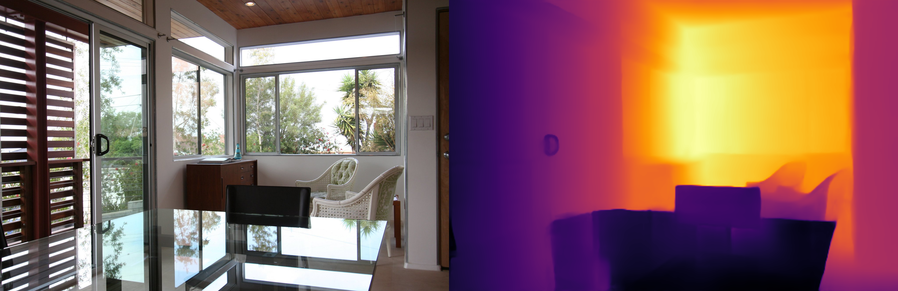
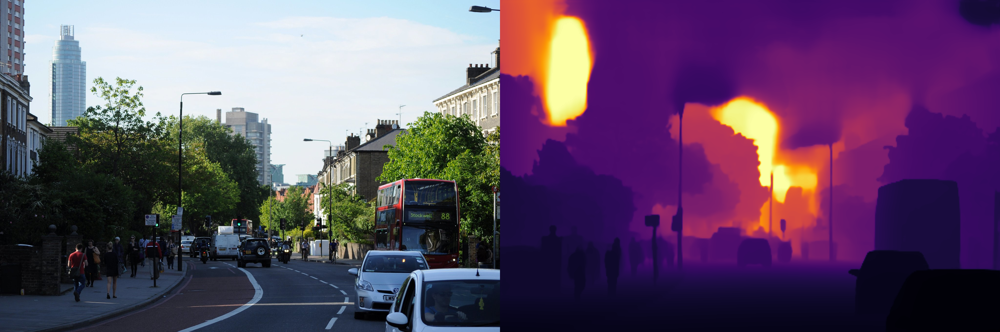
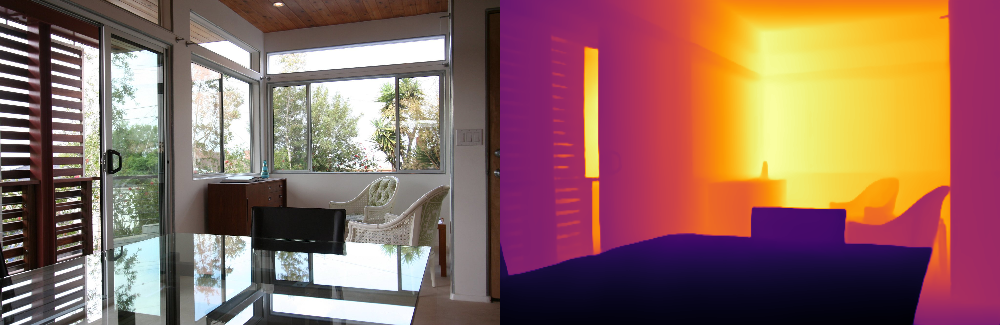
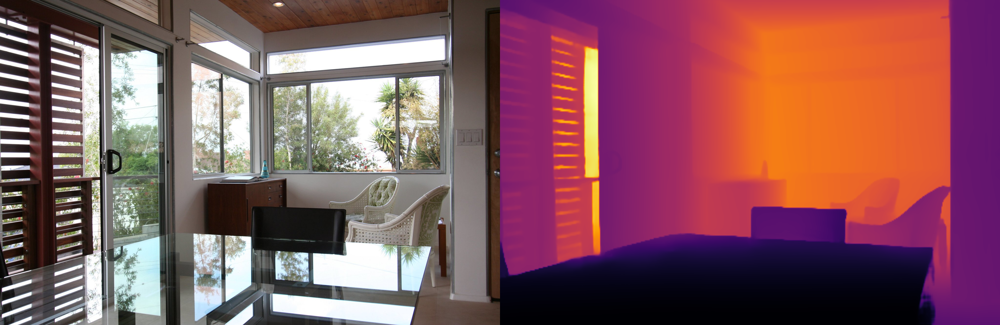

# Depth-Anything-3 部署指南

Depth-Anything-3 用于深度估计。本页说明 M.2 算力卡的接入条件、部署步骤与结果检查方法。本页选择 `models-ax650/da3-small.axmodel`。

> 已实测，效果仍需评估。[查看部署效果](#查看部署效果)。

## 准备运行环境

本页包含 **RK3576 DshanPi A1 + AX8850 16GB M.2** 与 **RK3576 DshanPi A1 + AX8850 8GB M.2** 的样例。按效果展示中的权重和容量对应使用，不同环境的结果不能互相替代。

在连接算力卡的 Linux 主机终端执行，RK3576 使用 ARM64 环境。首次部署先完成[驱动与设备检查](../../usage/device-check.md)、[安装 PyAXEngine](../../usage/python.md)和[下载工具安装](../../usage/download-models.md#使用-hugging-face-下载)。已完成这些步骤可直接下载模型。

后文使用设备 0，运行前用 `axcl-smi` 确认设备可用。

## 下载模型与样例

本页使用 `AXERA-TECH/Depth-Anything-3` 的固定版本。下面下载本页选用的 28 个文件。

```bash
MODEL_DIR=~/edgeaccel/models/depth-anything-3/7bf36032e88d
mkdir -p "$MODEL_DIR"
~/edgeaccel/hf-env/bin/hf download AXERA-TECH/Depth-Anything-3 \
  --include "README.md" "config.json" "python/infer.py" "python/infer_onnx.py" "examples/demo*.jpg" "models-ax650/da3-small.axmodel" "models-ax650/da3-base.axmodel" "models-ax650/da3metric-large.axmodel" "models-ax650/da3mono-large.axmodel" \
  --revision 7bf36032e88d4cfba089a6ddb05fa99724742177 \
  --local-dir "$MODEL_DIR"
cd "$MODEL_DIR"
```

保留当前终端中的 `MODEL_DIR` 变量，后续命令沿用此目录。下载受阻或需要离线复制时，见[下载方式与文件校验](../../usage/download-models.md)。

## 配置 Python 后端

激活已安装 PyAXEngine 的主机虚拟环境。先检查可用 provider：

```bash
source ~/edgeaccel/python-env/bin/activate
python -c "import axengine; print(axengine.get_available_providers())"
```

必须包含 `AXCLRTExecutionProvider`。保留已安装的 PyAXEngine，按下面命令安装本例依赖。

在已激活的环境中安装该入口直接使用的依赖；以下依赖用于本页的命令行示例：

```bash
python -m pip install numpy==1.26.4 ml-dtypes==0.5.3 opencv-python-headless==4.11.0.86
```


按本页已核对的修改配置 AXCL 后端。脚本在首次修改前保留 `.upstream` 备份；原表达式不匹配时停止，避免误改其他版本。

```bash
cd "$MODEL_DIR"
python - <<'PY'
from pathlib import Path
edits = [
    {"path": "python/infer.py", "old": "axe.InferenceSession(model)", "new": "axe.InferenceSession(model, providers=[\"AXCLRTExecutionProvider\"])"}
]
for edit in edits:
    path = Path(edit.get("path", "python/infer.py"))
    source = path.read_text(encoding="utf-8")
    if edit["old"] not in source:
        assert edit["new"] in source, f"补丁目标不匹配：{path}"
        continue
    backup = path.with_name(path.name + ".upstream")
    if not backup.exists():
        backup.write_text(source, encoding="utf-8")
    path.write_text(source.replace(edit["old"], edit["new"]), encoding="utf-8")
    print(f"已修改 {path}")
PY
```

重新下载原始源码后，需要再次执行此修改。

## 运行模型

在模型根目录执行，输入与权重使用该提交的实际路径：

```bash
cd "$MODEL_DIR"
test -s models-ax650/da3-small.axmodel
test -s examples/demo01.jpg
set -o pipefail
python python/infer.py --model models-ax650/da3-small.axmodel --img examples/demo01.jpg 2>&1 | tee run.log
```

日志中的实际执行后端应为 `AXCLRTExecutionProvider`。检查 `output-ax.png` 是本次新生成的文件，内容与输入相符。使用仓库现成结果图或只检查程序退出码均不足以判断效果。

参数依据：[`python/infer.py` 源码](https://huggingface.co/AXERA-TECH/Depth-Anything-3/blob/7bf36032e88d4cfba089a6ddb05fa99724742177/python/infer.py)。

## 运行其他三种 AX650 权重

前面的下载命令包含20张官方样图和下表权重。在已配置AXCL后端的Python环境中运行，输入由官方程序缩放为504×280、RGB uint8。本节组合在16GB卡实测。

| 规格 | 权重 | 结果解读 |
| --- | --- | --- |
| base | `models-ax650/da3-base.axmodel` | 本页使用单图深度输出 |
| metric-large | `models-ax650/da3metric-large.axmodel` | 保留原始输出；本次未进行尺度标定 |
| mono-large | `models-ax650/da3mono-large.axmodel` | 本页使用单图深度输出 |

在主机选择一个权重，运行仓库内20张样图。每张图保存在独立目录，避免覆盖：

```bash
WEIGHT=da3-base
# 也可设为 da3metric-large 或 da3mono-large
OUT=~/edgeaccel/results/depth-anything-3/$WEIGHT
mkdir -p "$OUT"
set -euo pipefail
for INPUT in "$MODEL_DIR"/examples/demo*.jpg; do
  NAME=$(basename "$INPUT" .jpg)
  mkdir -p "$OUT/$NAME"
  (
    cd "$OUT/$NAME"
    python "$MODEL_DIR/python/infer.py" \
      --model "$MODEL_DIR/models-ax650/$WEIGHT.axmodel" \
      --img "$INPUT" 2>&1 | tee run.log
    test -s output-ax.png
  )
done
```

打开新生成的 `OUT/demo01/output-ax.png`：左侧是原图，右侧是深度可视化。依次核对前景汽车、远处建筑、桥梁结构与室内物体的边界及近远关系。玻璃、反射、细小物体和绘画中的层次仍需人工检查。

### 判断可视化结果

官方程序将每张深度图单独归一化到0–255，再应用INFERNO配色。相同颜色在不同图片、不同权重中不代表相同距离；下面表格中的数值是归一化前的模型输出，不标注为米。

[上游metric模型卡](https://huggingface.co/depth-anything/DA3METRIC-LARGE)说明其使用规范化的公制深度表达，恢复实际尺度需要相机焦距。本页固定AXERA入口未接收相机标定参数；如需测距，须保留原始输出、核对导出定义及缩放后的相机参数，再用已知距离验证。不能将彩色图直接用作米制测量。


## 查看部署效果

### base / metric-large / mono-large：16GB卡样例

**已运行，效果仍需评估** · RK3576 DshanPi A1 + AX8850 16GB M.2。以下输入与输出来自本页固定版本的实际运行。

三个新增权重分别完成20张官方样图的两轮推理，保留原始深度张量，重新核对前处理和可视化。以下展示街道、桥梁和室内样图。

**da3-base**

街道近处车辆、远处建筑及桥梁纵深形成可辨认的层次；行人、栏杆和玻璃边缘较模糊。室内桌面反射、线描和绘画的输出不能作为真实几何判断。 20张图均完成两轮，原始输入、输出张量及结果图一致。右侧对每张图单独归一化；颜色表示该图内的输出数值分布，不能跨图比较，也不能从颜色读取米数。

<div className="model-effect-gallery">

<figure>

[](../../../static/validation/effects/depth-anything-3-variants-20261005/da3-base-demo01.png)

<figcaption>da3-base / demo01：左为输入，右为深度可视化</figcaption>
</figure>

<figure>

[](../../../static/validation/effects/depth-anything-3-variants-20261005/da3-base-demo06.png)

<figcaption>da3-base / demo06：左为输入，右为深度可视化</figcaption>
</figure>

<figure>

[](../../../static/validation/effects/depth-anything-3-variants-20261005/da3-base-demo10.png)

<figcaption>da3-base / demo10：左为输入，右为深度可视化</figcaption>
</figure>

</div>

| 样图 | 原始输出最小值 | 原始输出最大值 | 非正值像素数 |
| --- | --- | --- | --- |
| demo01 | 0.325088 | 3.8922 | 0 |
| demo06 | 0.334686 | 1.70934 | 0 |
| demo10 | 0.475097 | 1.47088 | 0 |

| 样图 | 近处区域 | 远处区域 | 近处中位值 | 远处中位值 | 近值小于远值 |
| --- | --- | --- | --- | --- | --- |
| demo01 | 右下前景汽车挡风玻璃 | 左上远处高楼立面 | 0.336211 | 3.02718 | 一致 |
| demo06 | 桥上前景人物上衣 | 远处门洞内部 | 1.17932 | 1.69138 | 一致 |

**da3metric-large**

这组街景和桥梁样图中，行人、路灯与桥梁栏杆的轮廓比base更清楚；室内桌椅与窗户区域存在层次。透明器皿和反射场景仍有含糊区域，未验证这些输出的真实距离。 20张图均完成两轮，原始输入、输出张量及结果图一致。右侧对每张图单独归一化；颜色表示该图内的输出数值分布，不能跨图比较，也不能从颜色读取米数。

<div className="model-effect-gallery">

<figure>

[](../../../static/validation/effects/depth-anything-3-variants-20261005/da3metric-large-demo01.png)

<figcaption>da3metric-large / demo01：左为输入，右为深度可视化</figcaption>
</figure>

<figure>

[](../../../static/validation/effects/depth-anything-3-variants-20261005/da3metric-large-demo06.png)

<figcaption>da3metric-large / demo06：左为输入，右为深度可视化</figcaption>
</figure>

<figure>

[](../../../static/validation/effects/depth-anything-3-variants-20261005/da3metric-large-demo10.png)

<figcaption>da3metric-large / demo10：左为输入，右为深度可视化</figcaption>
</figure>

</div>

| 样图 | 原始输出最小值 | 原始输出最大值 | 非正值像素数 |
| --- | --- | --- | --- |
| demo01 | 2.44407 | 88.5827 | 0 |
| demo06 | 2.21832 | 49.2072 | 0 |
| demo10 | 0.711051 | 5.0828 | 0 |

| 样图 | 近处区域 | 远处区域 | 近处中位值 | 远处中位值 | 近值小于远值 |
| --- | --- | --- | --- | --- | --- |
| demo01 | 右下前景汽车挡风玻璃 | 左上远处高楼立面 | 3.63053 | 88.5827 | 一致 |
| demo06 | 桥上前景人物上衣 | 远处门洞内部 | 9.81532 | 44.1031 | 一致 |

**da3mono-large**

街景车辆、桥梁和室内桌椅的前后层次可见；篮网与自行车轮廓可辨。远处高楼边缘有条纹，线描、绘画和透明器皿的层次需要单独判断，不据此声称深度准确。 20张图均完成两轮，原始输入、输出张量及结果图一致。右侧对每张图单独归一化；颜色表示该图内的输出数值分布，不能跨图比较，也不能从颜色读取米数。

<div className="model-effect-gallery">

<figure>

[](../../../static/validation/effects/depth-anything-3-variants-20261005/da3mono-large-demo01.png)

<figcaption>da3mono-large / demo01：左为输入，右为深度可视化</figcaption>
</figure>

<figure>

[](../../../static/validation/effects/depth-anything-3-variants-20261005/da3mono-large-demo06.png)

<figcaption>da3mono-large / demo06：左为输入，右为深度可视化</figcaption>
</figure>

<figure>

[](../../../static/validation/effects/depth-anything-3-variants-20261005/da3mono-large-demo10.png)

<figcaption>da3mono-large / demo10：左为输入，右为深度可视化</figcaption>
</figure>

</div>

| 样图 | 原始输出最小值 | 原始输出最大值 | 非正值像素数 |
| --- | --- | --- | --- |
| demo01 | 0.217787 | 7.33769 | 0 |
| demo06 | 0.232791 | 6.46587 | 0 |
| demo10 | 0.217787 | 3.03793 | 0 |

| 样图 | 近处区域 | 远处区域 | 近处中位值 | 远处中位值 | 近值小于远值 |
| --- | --- | --- | --- | --- | --- |
| demo01 | 右下前景汽车挡风玻璃 | 左上远处高楼立面 | 0.217787 | 7.33769 | 一致 |
| demo06 | 桥上前景人物上衣 | 远处门洞内部 | 1.23538 | 5.95534 | 一致 |

**使用时注意：**

- 仅验证官方单图入口。附加置信度、姿态或天空输出虽一并保留，但未据此验证姿态估计或天空分割功能。
- 缺少对应相机焦距、标定参数与真实深度标签，未验证metric-large的米制尺度，也未计算AbsRel、RMSE等深度精度指标。

这些结果用于对照部署后的输出，未覆盖完整数据集精度或长期连续运行。

### small：原8GB卡样例

**固定样例已核对** · RK3576 DshanPi A1 + AX8850 8GB M.2。以下输入与输出来自本页固定版本的实际运行。

da3-small 在 AXCL 上生成街景深度可视化；近处车辆和道路、远处建筑的层次与输入场景大致对应，输出张量均为有限数值。

点击图片可查看原尺寸。

<div className="model-effect-gallery">

<figure>

[](../../../static/validation/effects/depth-anything-3/inputs/demo01.jpg)

<figcaption>输入图片</figcaption>
</figure>

<figure>

[](../../../static/validation/effects/depth-anything-3/outputs/output-ax.png)

<figcaption>实际输出</figcaption>
</figure>

</div>

**使用时注意：**

- 仅核对单张图片的相对层次，没有公制距离标定或深度真值。
- 该结果不证明 DA3 的多视角几何、相机估计或长视频功能；本次仅运行 python/infer.py 单图入口。

这些结果用于对照部署后的输出，未覆盖完整数据集精度或长期连续运行。

**base / metric-large / mono-large：16GB卡样例**

<details>
<summary>查看样例环境与运行耗时</summary>

环境：RK3576 DshanPi A1 + AX8850 16GB M.2。模型版本：`7bf36032e88d4cfba089a6ddb05fa99724742177`。

| 组件 | 版本或配置 |
| --- | --- |
| AXCL / 固件 | V3.16.0_20260729180218 / V3.16.0 |
| 输入与后端 | 官方demo01–demo20；RGB uint8 NHWC 280×504；AXCLRTExecutionProvider |
| 前后处理 | 固定版本python/infer.py；逐图min-max归一化及INFERNO配色 |
| 范围 | 三权重×20张图×两轮；完整张量保留，未验证米制距离或姿态输出 |

| 指标 | 实测值 | 计时或统计范围 |
| --- | --- | --- |
| da3-base / session.run | 40次；中位数77.235 ms；范围76.917–85.072 ms | 20张官方样图各两轮；每张重新建立会话，计时仅含推理调用及数据传输，不含模型加载、前后处理或存盘，不是稳态吞吐。 |
| da3metric-large / session.run | 40次；中位数226.739 ms；范围226.364–230.918 ms | 20张官方样图各两轮；每张重新建立会话，计时仅含推理调用及数据传输，不含模型加载、前后处理或存盘，不是稳态吞吐。 |
| da3mono-large / session.run | 40次；中位数226.941 ms；范围226.432–230.833 ms | 20张官方样图各两轮；每张重新建立会话，计时仅含推理调用及数据传输，不含模型加载、前后处理或存盘，不是稳态吞吐。 |

适用范围：

- 20张样图含绘画、玻璃和反射场景；局部颜色合理不等于距离正确。两处近远区域仅为定性核对。
- 本组使用16GB卡，不替代新增权重的实际8GB回归。

</details>

**small：原8GB卡样例**

<details>
<summary>查看样例环境与运行耗时</summary>

环境：RK3576 DshanPi A1 + AX8850 8GB M.2。模型版本：`7bf36032e88d4cfba089a6ddb05fa99724742177`。

| 组件 | 版本或配置 |
| --- | --- |
| 主机系统 | Ubuntu 24.04 / Armbian 25.11.0-trunk，aarch64 |
| 内核 | 6.1.115-vendor-rk35xx |
| AXCL / 驱动 | V3.16.0_20260729180218 |
| 固件 / CMM | V3.16.0；CMM 总量 7040 MiB，空闲基线占用 18 MiB |
| C++ 视觉示例提交 | cbfa4c76891758983ca2b0c99c11d6621d59af39 |
| Python 后端 | Python 3.12.3；PyAXEngine 0.1.3.rc3 发布的 0.1.3 wheel；NumPy 1.26.4 / ml-dtypes 0.5.3 |
| AX-LLM 提交 | 8501c22b940f8c5804cb35044c5ffc136918b8f1；Release / AXCL / Linux aarch64 |

| 指标 | 实测值 | 计时或统计范围 |
| --- | --- | --- |
| session.run：da3-small.axmodel | 39.254 ms / 1 次 | 实际 AXCL Python 调用墙钟，含数据复制；不含返回后的张量统计。含首次调用，非统一预热基准；多阶段模型各自计时 |

适用范围：

- 运行源码包含显式 AXCL 后端或本页说明的适配修改；result.json 保存逐项替换及修改后 SHA256。

</details>

遇到加载、内存或后端错误时，按[常见问题](../../usage/troubleshooting.md)处理。需要更换输入或接入业务时，按[检查输出与记录结果](../../reference/validation.md)保留自己的结果。

<details>
<summary>查看文件用途与版本信息</summary>

| 文件 / 目录内路径 | 用途 |
| --- | --- |
| [`python/infer.py`](https://huggingface.co/AXERA-TECH/Depth-Anything-3/blob/7bf36032e88d4cfba089a6ddb05fa99724742177/python/infer.py) | Python 程序 / 前后处理 |
| [`models-ax650/da3-small.axmodel`](https://huggingface.co/AXERA-TECH/Depth-Anything-3/blob/7bf36032e88d4cfba089a6ddb05fa99724742177/models-ax650/da3-small.axmodel) | 编译模型；按目录区分芯片和规格 |
| [`examples/demo01.jpg`](https://huggingface.co/AXERA-TECH/Depth-Anything-3/blob/7bf36032e88d4cfba089a6ddb05fa99724742177/examples/demo01.jpg) | 示例输入 |

仓库提交：`7bf36032e88d4cfba089a6ddb05fa99724742177`。仓库中的 8 个 `.axmodel` 文件可能包括多个芯片、规格和分片。运行时使用本页指定的配套文件，完整列表见[固定版本目录](https://huggingface.co/AXERA-TECH/Depth-Anything-3/tree/7bf36032e88d4cfba089a6ddb05fa99724742177)。

</details>

<details>
<summary>补充说明与版本差异</summary>

- 仓库有 small、base、mono 和 metric 权重。相对深度与公制深度的语义不同，选择后保留同一前后处理。

</details>

## 参考资料

- [常用术语](../../reference/glossary.md)：AXCL、CMM、分词器与推理指标。
- [固定版本文件表](https://huggingface.co/AXERA-TECH/Depth-Anything-3/tree/7bf36032e88d4cfba089a6ddb05fa99724742177)。
- [模型卡 / 使用说明](https://huggingface.co/AXERA-TECH/Depth-Anything-3/blob/7bf36032e88d4cfba089a6ddb05fa99724742177/README.md)。
- [主要程序入口：python/infer.py](https://huggingface.co/AXERA-TECH/Depth-Anything-3/blob/7bf36032e88d4cfba089a6ddb05fa99724742177/python/infer.py)。
- [ModelScope 对应资源](https://modelscope.cn/models/AXERA-TECH/Depth-Anything-3)。不同平台的 revision 不通用，另行记录版本。

返回[完整模型目录](../catalog.mdx)。
