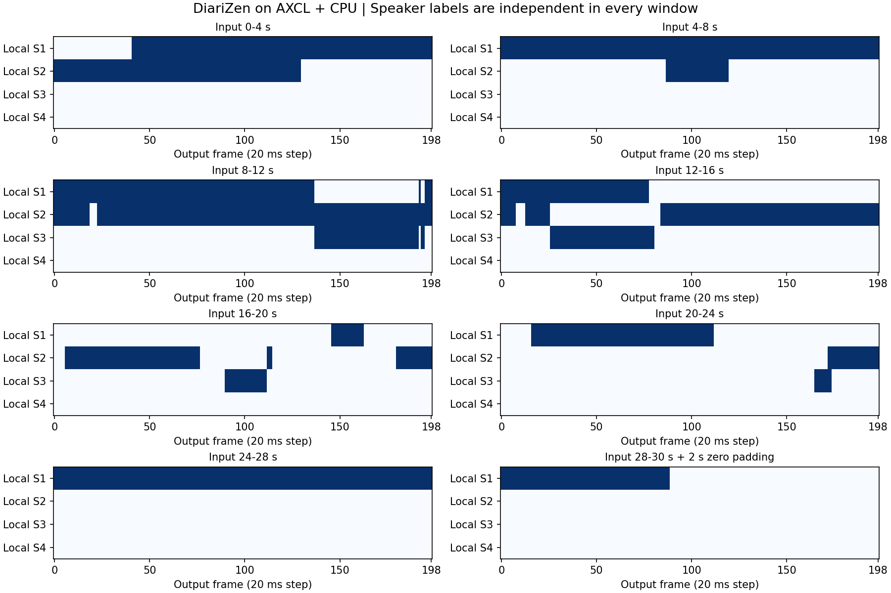
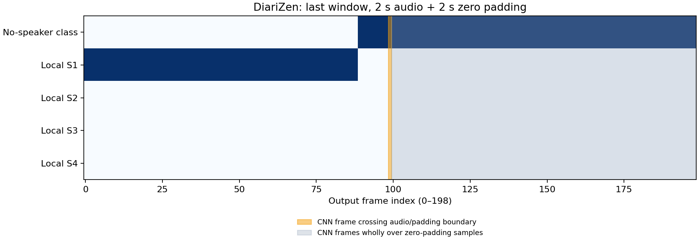
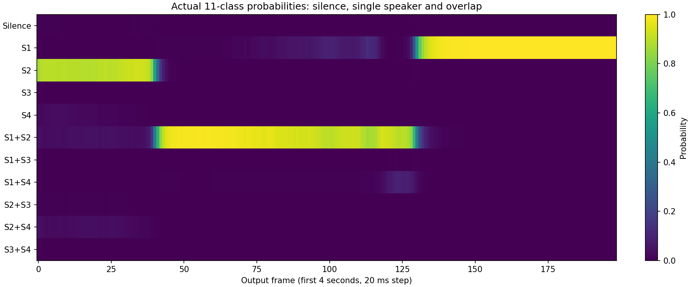

# DiariZen 部署指南

DiariZen 用于说话人识别与分段。本页说明 M.2 算力卡的接入条件、部署步骤与结果检查方法。

> 已实测，效果仍需评估。[查看部署效果](#查看部署效果)。

## 准备运行环境

本页效果展示使用 **RK3576 + AX8850 16GB M.2**；其他容量或平台需重新确认模型能否加载并正确运行。

在连接算力卡的 Linux 主机终端执行，RK3576 使用 ARM64 环境。首次部署先完成[驱动与设备检查](../../usage/device-check.md)、[安装 PyAXEngine](../../usage/python.md)和[下载工具安装](../../usage/download-models.md#使用-hugging-face-下载)。已完成这些步骤可直接下载模型。

后文使用设备 0，运行前用 `axcl-smi` 确认设备可用。

## 下载模型与样例

本页使用 `AXERA-TECH/DiariZen` 的固定版本。下面下载本页选用的 12 个文件。

```bash
MODEL_DIR=~/edgeaccel/models/diarizen/4067c933f382
mkdir -p "$MODEL_DIR"
~/edgeaccel/hf-env/bin/hf download AXERA-TECH/DiariZen \
  "README.md" \
  "models/backend.onnx" \
  "models/cnn_features.axmodel" \
  "models/model_meta.json" \
  "python/diarizen_sdk/README.md" \
  "python/diarizen_sdk/__init__.py" \
  "python/diarizen_sdk/example.py" \
  "python/diarizen_sdk/inference.py" \
  "python/diarizen_sdk/model_meta.json" \
  "python/diarizen_sdk/postprocess.py" \
  "python/diarizen_sdk/preprocess.py" \
  "python/requirements.txt" \
  --revision 4067c933f38204b128f29adbda48a4d0f52d5454 \
  --local-dir "$MODEL_DIR"
cd "$MODEL_DIR"
```

保留当前终端中的 `MODEL_DIR` 变量，后续命令沿用此目录。下载受阻或需要离线复制时，见[下载方式与文件校验](../../usage/download-models.md)。

## 准备 Python 环境

本例运行 DiariZen 的四秒语音分段模型：CNN 特征提取在 M.2 算力卡执行，Transformer、Conformer 和分类后端在 RK3576 的 CPU 执行。先按 [Python 接口](../../usage/python.md) 安装 PyAXEngine，再在主机执行：

```bash
source ~/edgeaccel/python-env/bin/activate
python -m pip install 'numpy==1.26.4' 'onnxruntime==1.20.1' 'soundfile==0.13.1'
python -c "import axengine; print(axengine.get_available_providers())"
```

输出须包含 `AXCLRTExecutionProvider`。模型权重采用 CC BY-NC 4.0，本例用于研究与评估；商用需另行确认授权，见 [上游模型说明](https://huggingface.co/BUT-FIT/diarizen-wavlm-large-s80-md)。

## 下载官方会议录音

沿用上方模型下载步骤的 `MODEL_DIR`，下载上游固定版本中的 30 秒录音：

```bash
curl -fL --retry 3 \
  https://raw.githubusercontent.com/BUTSpeechFIT/DiariZen/844f5555b0a98acd0931511fc641a8c5b8ba92c7/example/EN2002a_30s.wav \
  -o "$MODEL_DIR/EN2002a_30s.wav"
echo '55aa90540de2a01e6824ee2862d08763026d1752a3d7f6f8870015c74424e900  '"$MODEL_DIR/EN2002a_30s.wav" | sha256sum -c -
```

确认校验结果为 `OK`。本例使用原始录音的第一声道，未提供这段录音的人工参考标注。

## 运行分段模型

下载 [DiariZen 算力卡示例](../../../static/examples/diarizen_card.py)，保存为 `~/edgeaccel/diarizen_card.py`：

```bash
python ~/edgeaccel/diarizen_card.py \
  --model-dir "$MODEL_DIR" \
  --audio "$MODEL_DIR/EN2002a_30s.wav" \
  --cpu-threads 4 \
  --output ~/edgeaccel/results/diarizen-01
```

输出目录须尚不存在。示例顺序处理八个不重叠窗口，最后两秒录音补零为四秒，再重复首个窗口并检查四秒静音。每个窗口都有实际 CNN 和 CPU 后端调用记录。

示例适配了官方 SDK 的旧版输入接口，前处理仍按官方流程重采样、截取或补零、归一化。CPU 后端使用四个计算线程和顺序执行；模型加载耗时单独记录。

## 查看活动分布

输出目录中的 `deployment-result.json` 包含每个窗口的起点、补零长度、活跃局部说话人数、11 类的帧计数，以及 CNN、CPU 后端和整个窗口的处理耗时。`window-*.npz` 保留归一化波形、CNN 特征、后端预测和活动矩阵，供本地复核。

11 类不是 11 个说话人。按 [上游模型](https://github.com/BUTSpeechFIT/DiariZen/blob/844f5555b0a98acd0931511fc641a8c5b8ba92c7/diarizen/models/eend/model_wavlm_conformer.py) 的默认设置，它们表示四个局部说话人的静音、单人和双人重叠组合。下方概率热图展示首个窗口的实际预测，活动图展示所有窗口。

每个窗口的 S1～S4 编号独立，跨窗口同名编号不保证是同一个人。本例没有进行声纹提取、跨窗口聚类或整段 RTTM 拼接，不能据此判断会议总人数。末尾补零帧也包含在窗口计数内，帧计数不能直接当作真实发言时长。

## 更换输入录音

将 `--audio` 改为自己的 WAV 路径，并使用新的输出目录。当前示例限制输入最长 60 秒，建议采用 16 kHz 单声道；多声道使用第一声道，其他采样率按官方 SDK 的线性插值重采样。长录音、多人聚类和完整分离错误率仍需进一步验证。


## 查看部署效果

**已运行，效果仍需评估** · RK3576 + AX8850 16GB M.2。以下输入与输出来自本页固定版本的实际运行。

16GB 卡的 CNN 前端与 CPU 后端完成八个窗口、重复和静音测试。末窗 99 个录音范围帧中 89 帧预测为单人，跨界 1 帧及补零范围 99 帧均为无说话人类；窗口编号仍独立，尚不能输出整段会议身份或认证分段准确率。

**会议录音：逐窗口活动分布**

实际处理全部30秒录音，末窗补零两秒。每行图中的S1～S4只对当前窗口有效，没有跨窗口聚类，不能用这些编号推断会议总人数。 末窗实际输入为 28–30 秒录音。按固定上游 CNN 结构的采样范围划分，99 帧完全对应录音、1 帧跨越录音与补零边界、99 帧完全对应补零。录音范围的 89 帧预测为 Local S1，其余为无说话人类；跨界与补零范围没有激活说话人。后端会结合更大的上下文，因此不能据此认定补零对其他帧毫无影响。帧计数不是人工标注的发言时长，仍需逐段标注验证。

<div className="model-effect-gallery">

<figure>

[](../../../static/validation/effects/diarizen-20260928/window-activity.png)

<figcaption>八个窗口的实际活动预测；每个窗口的说话人编号独立</figcaption>
</figure>

<figure>

[](../../../static/validation/effects/diarizen-20260928/last-window-padding.png)

<figcaption>末窗实际分类与补零分界：深色表示该帧的预测类别，橙色为跨界帧，灰色为补零范围</figcaption>
</figure>

</div>

| 录音区间 | 局部人数 | CNN / ms | CPU / ms | 总耗时 / s |
| --- | --- | --- | --- | --- |
| 0–4 s | 2 | 10.323 | 1279.829 | 1.295948 |
| 4–8 s | 2 | 6.384 | 1233.335 | 1.242045 |
| 8–12 s | 3 | 6.773 | 1160.146 | 1.169305 |
| 12–16 s | 3 | 7.555 | 1183.836 | 1.194883 |
| 16–20 s | 3 | 6.595 | 1162.252 | 1.171290 |
| 20–24 s | 3 | 6.775 | 1158.076 | 1.167236 |
| 24–28 s | 1 | 6.101 | 1251.868 | 1.260175 |
| 28–30 s（补零2 s） | 1 | 6.380 | 1204.539 | 1.213375 |

| 末窗 CNN 帧范围 | 总帧数 | 无说话人类 | 有说话人类 | 活动通道数 |
| --- | --- | --- | --- | --- |
| 完全位于实际输入 | 99 | 10 | 89 | 1 |
| 跨越输入 / 补零边界 | 1 | 1 | 0 | 0 |
| 完全位于补零采样范围 | 99 | 99 | 0 | 0 |

实际输入：上游 EN2002a 会议录音，30 秒

<audio controls preload="metadata" src="/validation/effects/diarizen-20260928/input.wav" aria-label="实际输入：上游 EN2002a 会议录音，30 秒"></audio>

[下载音频](../../../static/validation/effects/diarizen-20260928/input.wav)

**首个窗口：类别概率**

颜色由本次后端输出的概率绘制。S1+S2等标签表示同一帧的双人重叠组合，概率较高不等同于经过人工标注的准确率。

<div className="model-effect-gallery">

<figure>

[](../../../static/validation/effects/diarizen-20260928/probabilities.png)

<figcaption>首个四秒窗口的实际类别概率：静音、单人和双人重叠</figcaption>
</figure>

</div>

**重复窗口与静音**

重复首个四秒窗口，CNN与CPU后端的原始输入输出及活动矩阵全部一致。四秒静音的199帧均输出静音类，活跃说话人数为0。

| 输入 | 局部人数 | 静音帧 / 总帧 | 处理耗时 / s |
| --- | --- | --- | --- |
| 重复0–4 s | 2 | 0 / 199 | 1.274064 |
| 四秒静音 | 0 | 199 / 199 | 1.227001 |

**使用时注意：**

- 窗口内编号独立；没有声纹与聚类阶段，不构成整段会议说话人分离系统。
- 11 类按窗口内四个通道、最多双人重叠解码；末窗帧统计包含补零。已按 CNN 采样范围单列补零计数，但后端仍使用上下文，不能将这些计数直接当真实发言时长。

这些结果用于对照部署后的输出，未覆盖完整数据集精度或长期连续运行。

<details>
<summary>查看样例环境与运行耗时</summary>

环境：RK3576 + AX8850 16GB M.2。模型版本：`4067c933f38204b128f29adbda48a4d0f52d5454`。

| 组件 | 版本或配置 |
| --- | --- |
| 主机 / 内核 | RK3576，约 4GB RAM，6.1.115-vendor-rk35xx |
| AXCL / 驱动 | V3.16.0_20260729180218 |
| 固件 / CMM | V3.16.0 / 15232 MiB |
| Python 推理 | Python 3.12 / PyAXEngine 0.1.3.rc3 / NumPy 1.26.4 / AXCLRTExecutionProvider |

| 指标 | 实测值 | 计时或统计范围 |
| --- | --- | --- |
| 窗口处理耗时 | 1.167–1.296 s / 窗口 | 八个四秒模型输入；含前处理、AXCL调用、CPU后端和分类，不含模型加载、文件读写与结果保存。 |
| CNN 算力卡耗时 | 6.101–10.323 ms / 窗口 | 包括首个窗口，实际AXCL调用，不能当作整个模型的端到端耗时。 |
| CPU 后端耗时 | 1158.076–1279.829 ms / 窗口 | RK3576，ONNX Runtime 1.20.1，4个计算线程，顺序执行。 |
| 实际调用 | CNN 10次 / CPU 10次 | 八个录音窗口，加一次重复、一次静音；只有CNN在算力卡上。 |

适用范围：

- 当前无人工参考标注与完整浮点模型对照，活动预测未完成准确率验收。
- 本次为16GB卡，真实8GB容量仍需回归。

</details>

遇到加载、内存或后端错误时，按[常见问题](../../usage/troubleshooting.md)处理。需要更换输入或接入业务时，按[检查输出与记录结果](../../reference/validation.md)保留自己的结果。

<details>
<summary>查看文件用途与版本信息</summary>

| 文件 / 目录内路径 | 用途 |
| --- | --- |
| [`python/diarizen_sdk/example.py`](https://huggingface.co/AXERA-TECH/DiariZen/blob/4067c933f38204b128f29adbda48a4d0f52d5454/python/diarizen_sdk/example.py) | Python 程序 / 前后处理 |
| [`models/cnn_features.axmodel`](https://huggingface.co/AXERA-TECH/DiariZen/blob/4067c933f38204b128f29adbda48a4d0f52d5454/models/cnn_features.axmodel) | 编译模型；按目录区分芯片和规格 |
| [`config.json`](https://huggingface.co/AXERA-TECH/DiariZen/blob/4067c933f38204b128f29adbda48a4d0f52d5454/config.json) | 运行配置 |
| [`model_convert/pulsar2_config.json`](https://huggingface.co/AXERA-TECH/DiariZen/blob/4067c933f38204b128f29adbda48a4d0f52d5454/model_convert/pulsar2_config.json) | 运行配置 |
| [`python/requirements.txt`](https://huggingface.co/AXERA-TECH/DiariZen/blob/4067c933f38204b128f29adbda48a4d0f52d5454/python/requirements.txt) | Python 依赖清单 |

仓库提交：`4067c933f38204b128f29adbda48a4d0f52d5454`。仓库中的 1 个 `.axmodel` 文件可能包括多个芯片、规格和分片。运行时使用本页指定的配套文件，完整列表见[固定版本目录](https://huggingface.co/AXERA-TECH/DiariZen/tree/4067c933f38204b128f29adbda48a4d0f52d5454)。

</details>

<details>
<summary>补充说明与版本差异</summary>

- 用于说话人时间分段。准备含两名以上说话人及重叠发言的录音，检查分段边界和说话人编号是否一致。

</details>

## 参考资料

- [常用术语](../../reference/glossary.md)：AXCL、CMM、分词器与推理指标。
- [固定版本文件表](https://huggingface.co/AXERA-TECH/DiariZen/tree/4067c933f38204b128f29adbda48a4d0f52d5454)。
- [模型卡 / 使用说明](https://huggingface.co/AXERA-TECH/DiariZen/blob/4067c933f38204b128f29adbda48a4d0f52d5454/README.md)。
- [主要程序入口：python/diarizen_sdk/example.py](https://huggingface.co/AXERA-TECH/DiariZen/blob/4067c933f38204b128f29adbda48a4d0f52d5454/python/diarizen_sdk/example.py)。

返回[完整模型目录](../catalog.mdx)。
