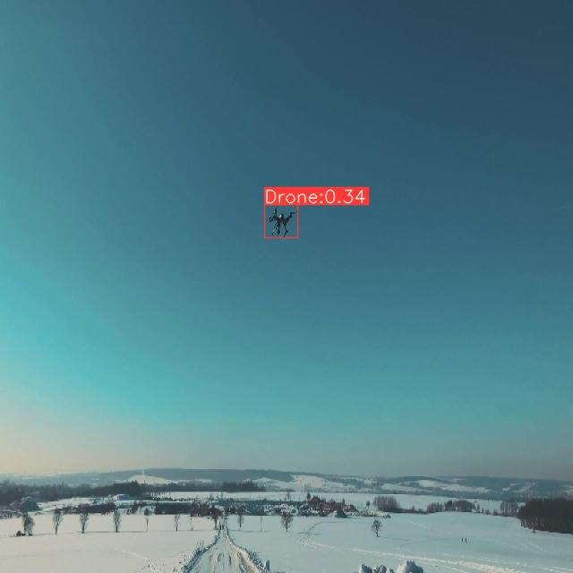
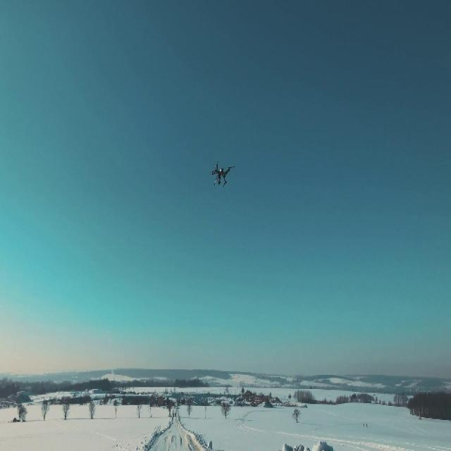
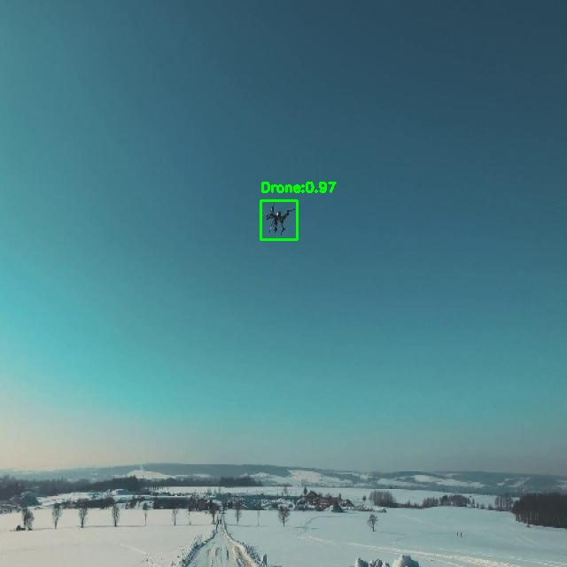

# Drone-axera 部署指南

Drone-axera 用于目标检测。本页说明 M.2 算力卡的接入条件、部署步骤与结果检查方法。本页选择 `AX650/yolo11s_drone_650.axmodel`。

> 已实测，效果仍需评估。[查看部署效果](#查看部署效果)。

## 准备运行环境

本页包含 **RK3576 DshanPi A1 + AX8850 16GB M.2** 与 **RK3576 DshanPi A1 + AX8850 8GB M.2** 的样例。按效果展示中的权重和容量对应使用，不同环境的结果不能互相替代。

在连接算力卡的 Linux 主机终端执行，RK3576 使用 ARM64 环境。首次部署先完成[驱动与设备检查](../../usage/device-check.md)、[安装 PyAXEngine](../../usage/python.md)和[下载工具安装](../../usage/download-models.md#使用-hugging-face-下载)。已完成这些步骤可直接下载模型。

后文使用设备 0，运行前用 `axcl-smi` 确认设备可用。

## 下载模型与样例

本页使用 `AXERA-TECH/Drone-axera` 的固定版本。下面下载本页选用的 3 个文件。

```bash
MODEL_DIR=~/edgeaccel/models/drone-axera/bca09e938a5e
mkdir -p "$MODEL_DIR"
~/edgeaccel/hf-env/bin/hf download AXERA-TECH/Drone-axera \
  "axmodel_infer_yolo11.py" \
  "AX650/yolo11s_drone_650.axmodel" \
  "test/23.jpg" \
  --revision bca09e938a5ef7cdf81862e4acd4b706718558a3 \
  --local-dir "$MODEL_DIR"
cd "$MODEL_DIR"
```

保留当前终端中的 `MODEL_DIR` 变量，后续命令沿用此目录。下载受阻或需要离线复制时，见[下载方式与文件校验](../../usage/download-models.md)。

## 配置 Python 后端

激活已安装 PyAXEngine 的主机虚拟环境。先检查可用 provider：

```bash
source ~/edgeaccel/python-env/bin/activate
python -c "import axengine; print(axengine.get_available_providers())"
```

必须包含 `AXCLRTExecutionProvider`。保留已安装的 PyAXEngine，按下面命令安装本例依赖。

在已激活的环境中安装该入口直接使用的依赖；以下依赖用于本页的命令行示例：

```bash
python -m pip install numpy==1.26.4 ml-dtypes==0.5.3 opencv-python-headless==4.11.0.86
```


按本页已核对的修改配置 AXCL 后端。脚本在首次修改前保留 `.upstream` 备份；原表达式不匹配时停止，避免误改其他版本。

```bash
cd "$MODEL_DIR"
python - <<'PY'
from pathlib import Path
edits = [
    {"path": "axmodel_infer_yolo11.py", "old": "axe.InferenceSession(args.model)", "new": "axe.InferenceSession(args.model, providers=[\"AXCLRTExecutionProvider\"])"}
]
for edit in edits:
    path = Path(edit.get("path", "axmodel_infer_yolo11.py"))
    source = path.read_text(encoding="utf-8")
    if edit["old"] not in source:
        assert edit["new"] in source, f"补丁目标不匹配：{path}"
        continue
    backup = path.with_name(path.name + ".upstream")
    if not backup.exists():
        backup.write_text(source, encoding="utf-8")
    path.write_text(source.replace(edit["old"], edit["new"]), encoding="utf-8")
    print(f"已修改 {path}")
PY
```

重新下载原始源码后，需要再次执行此修改。

## 运行模型

在模型根目录执行，输入与权重使用该提交的实际路径：

```bash
cd "$MODEL_DIR"
test -s AX650/yolo11s_drone_650.axmodel
test -s test/23.jpg
set -o pipefail
python axmodel_infer_yolo11.py --model AX650/yolo11s_drone_650.axmodel --img_path test --save_path drone_yolo11_res 2>&1 | tee run.log
```

日志中的实际执行后端应为 `AXCLRTExecutionProvider`。检查 `drone_yolo11_res/23.jpg` 是本次新生成的文件，内容与输入相符。使用仓库现成结果图或只检查程序退出码均不足以判断效果。

参数依据：[`axmodel_infer_yolo11.py` 源码](https://huggingface.co/AXERA-TECH/Drone-axera/blob/bca09e938a5ef7cdf81862e4acd4b706718558a3/axmodel_infer_yolo11.py)。

## 运行 drone-yolo26 变体

### 准备运行包

在 RK3576 主机激活前文安装的 PyAXEngine 环境，下载[视觉变体运行包](../../../static/examples/vision-variant-deployment-20261005.zip)，保存到`~/edgeaccel`并解压到 `~/edgeaccel`。

```bash
source ~/edgeaccel/python-env/bin/activate
python -m zipfile -e ~/edgeaccel/vision-variant-deployment-20261005.zip ~/edgeaccel
```

### 下载权重和样例

```bash
VARIANT_MODELS=~/edgeaccel/models-variants
~/edgeaccel/hf-env/bin/hf download AXERA-TECH/Drone-axera \
  --revision bca09e938a5ef7cdf81862e4acd4b706718558a3 \
  --include "README.md" "axmodel_infer_yolo11.py" "axmodel_infer_yolo26.py" "config.json" "test/23.jpg" "AX650/yolo26s_drone_650.axmodel" \
  --local-dir "$VARIANT_MODELS/Drone-axera"
```

### 运行模型

```bash
python ~/edgeaccel/vision-variant/vision_variant.py \
  --models-root "$VARIANT_MODELS" --case drone-yolo26 \
  --output ~/edgeaccel/results/drone-yolo26
```

使用尚不存在的结果目录。终端应显示 `AXCLRTExecutionProvider`，结果目录中应生成输出图。


## 查看部署效果

### YOLO26无人机检测：16GB卡样例

**已运行，效果仍需评估** · RK3576 DshanPi A1 + AX8850 16GB M.2。以下输入与输出来自本页固定版本的实际运行。

同一固定样例完成三次独立运行，其中一次使用下方配套运行包入口，原始输出与效果图一致。

**YOLO26无人机检测**

原始雪景样例中一个无人机被框出，框295,228到332,265，置信度约0.34；未覆盖独立数据集或复杂背景。

<div className="model-effect-gallery">

<figure>

[](../../../static/validation/effects/drone-axera-variant-20261005/inputs/23.jpg)

<figcaption>实际输入：test/23.jpg</figcaption>
</figure>

<figure>

[](../../../static/validation/effects/drone-axera-variant-20261005/outputs/23.jpg)

<figcaption>实际输出：YOLO26无人机检测</figcaption>
</figure>

</div>

**使用时注意：**

- 仅验证固定官方样例，未完成独立数据集精度、多场景和长期连续运行测试。
- 本组使用16GB卡；8GB卡样例使用不同权重，不能据此推断该变体已通过8GB容量回归。

这些结果用于对照部署后的输出，未覆盖完整数据集精度或长期连续运行。

### 原默认权重：8GB卡样例

**固定样例已核对** · RK3576 DshanPi A1 + AX8850 8GB M.2。以下输入与输出来自本页固定版本的实际运行。

test/23.jpg 输出 1 个 Drone 框，约 0.97 的分数与天空中可见无人机的位置对应，完成 YOLO11 无人机权重的单样本核对。

点击图片可查看原尺寸。

<div className="model-effect-gallery">

<figure>

[](../../../static/validation/effects/drone-axera/inputs/23.jpg)

<figcaption>输入图片</figcaption>
</figure>

<figure>

[](../../../static/validation/effects/drone-axera/outputs/23.jpg)

<figcaption>实际输出</figcaption>
</figure>

</div>

**使用时注意：**

- 本次只测试 yolo11s_drone_650.axmodel；同仓 yolo26s_drone_650.axmodel 尚未验证。
- 只有单张相对简单天空背景图，不能推断远距离、复杂背景或视频跟踪能力。

这些结果用于对照部署后的输出，未覆盖完整数据集精度或长期连续运行。

**YOLO26无人机检测：16GB卡样例**

<details>
<summary>查看样例环境与运行耗时</summary>

环境：RK3576 DshanPi A1 + AX8850 16GB M.2。模型版本：`bca09e938a5ef7cdf81862e4acd4b706718558a3`。

| 组件 | 版本或配置 |
| --- | --- |
| 主机系统 / 内核 | Ubuntu 24.04 / Armbian；aarch64；6.1.115-vendor-rk35xx |
| AXCL / 驱动 | V3.16.0_20260729180218 |
| 固件 / CMM | V3.16.0；总量15232 MiB，空闲占用18 MiB |
| Python后端 | AXCLRTExecutionProvider；NumPy 1.26.4；OpenCV 4.11.0 |
| 前后处理 | 固定仓库原始脚本；运行包显式选择AXCL，保留原始色序、尺寸处理和后处理 |

| 指标 | 实测值 | 计时或统计范围 |
| --- | --- | --- |
| 单次推理墙钟 | 21.937 / 21.864 / 21.958 ms | 三个独立进程各一次session.run，含传输、不含加载和后处理，无预热。 |

</details>

**原默认权重：8GB卡样例**

<details>
<summary>查看样例环境与运行耗时</summary>

环境：RK3576 DshanPi A1 + AX8850 8GB M.2。模型版本：`bca09e938a5ef7cdf81862e4acd4b706718558a3`。

| 组件 | 版本或配置 |
| --- | --- |
| 主机系统 | Ubuntu 24.04 / Armbian 25.11.0-trunk，aarch64 |
| 内核 | 6.1.115-vendor-rk35xx |
| AXCL / 驱动 | V3.16.0_20260729180218 |
| 固件 / CMM | V3.16.0；CMM 总量 7040 MiB，空闲基线占用 18 MiB |
| C++ 视觉示例提交 | cbfa4c76891758983ca2b0c99c11d6621d59af39 |
| Python 后端 | Python 3.12.3；PyAXEngine 0.1.3.rc3 发布的 0.1.3 wheel；NumPy 1.26.4 / ml-dtypes 0.5.3 |
| AX-LLM 提交 | 8501c22b940f8c5804cb35044c5ffc136918b8f1；Release / AXCL / Linux aarch64 |

| 指标 | 实测值 | 计时或统计范围 |
| --- | --- | --- |
| session.run：yolo11s_drone_650.axmodel | 32.898 ms / 1 次 | 实际 AXCL Python 调用墙钟，含数据复制；不含返回后的张量统计。含首次调用，非统一预热基准；多阶段模型各自计时 |

适用范围：

- 仅一个样例、一次程序启动；没有独立数据集精度评测或长时间稳定性测试。
- 只采集到 1 次 session.run 调用，不能视为预热后的平均性能。
- 运行源码包含显式 AXCL 后端或本页说明的适配修改；result.json 保存逐项替换及修改后 SHA256。

</details>

遇到加载、内存或后端错误时，按[常见问题](../../usage/troubleshooting.md)处理。需要更换输入或接入业务时，按[检查输出与记录结果](../../reference/validation.md)保留自己的结果。

<details>
<summary>查看文件用途与版本信息</summary>

| 文件 / 目录内路径 | 用途 |
| --- | --- |
| [`axmodel_infer_yolo11.py`](https://huggingface.co/AXERA-TECH/Drone-axera/blob/bca09e938a5ef7cdf81862e4acd4b706718558a3/axmodel_infer_yolo11.py) | Python 程序 / 前后处理 |
| [`AX650/yolo11s_drone_650.axmodel`](https://huggingface.co/AXERA-TECH/Drone-axera/blob/bca09e938a5ef7cdf81862e4acd4b706718558a3/AX650/yolo11s_drone_650.axmodel) | 编译模型；按目录区分芯片和规格 |
| [`test/23.jpg`](https://huggingface.co/AXERA-TECH/Drone-axera/blob/bca09e938a5ef7cdf81862e4acd4b706718558a3/test/23.jpg) | 示例输入 |

仓库提交：`bca09e938a5ef7cdf81862e4acd4b706718558a3`。仓库中的 4 个 `.axmodel` 文件可能包括多个芯片、规格和分片。运行时使用本页指定的配套文件，完整列表见[固定版本目录](https://huggingface.co/AXERA-TECH/Drone-axera/tree/bca09e938a5ef7cdf81862e4acd4b706718558a3)。

</details>

<details>
<summary>补充说明与版本差异</summary>

- --img_path test 是输入目录；本次只核对其中的 test/23.jpg，结果为 drone_yolo11_res/23.jpg。其他图片需逐张验证，不能沿用本次单图结论。

</details>

## 参考资料

- [常用术语](../../reference/glossary.md)：AXCL、CMM、分词器与推理指标。
- [固定版本文件表](https://huggingface.co/AXERA-TECH/Drone-axera/tree/bca09e938a5ef7cdf81862e4acd4b706718558a3)。
- [模型卡 / 使用说明](https://huggingface.co/AXERA-TECH/Drone-axera/blob/bca09e938a5ef7cdf81862e4acd4b706718558a3/README.md)。
- [主要程序入口：axmodel_infer_yolo11.py](https://huggingface.co/AXERA-TECH/Drone-axera/blob/bca09e938a5ef7cdf81862e4acd4b706718558a3/axmodel_infer_yolo11.py)。
- [ModelScope 对应资源](https://modelscope.cn/models/AXERA-TECH/Drone-axera)。不同平台的 revision 不通用，另行记录版本。

返回[完整模型目录](../catalog.mdx)。
