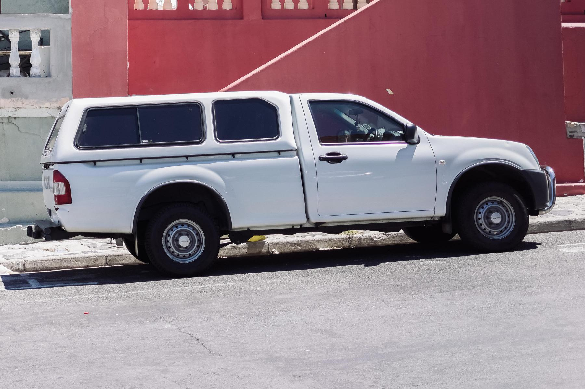
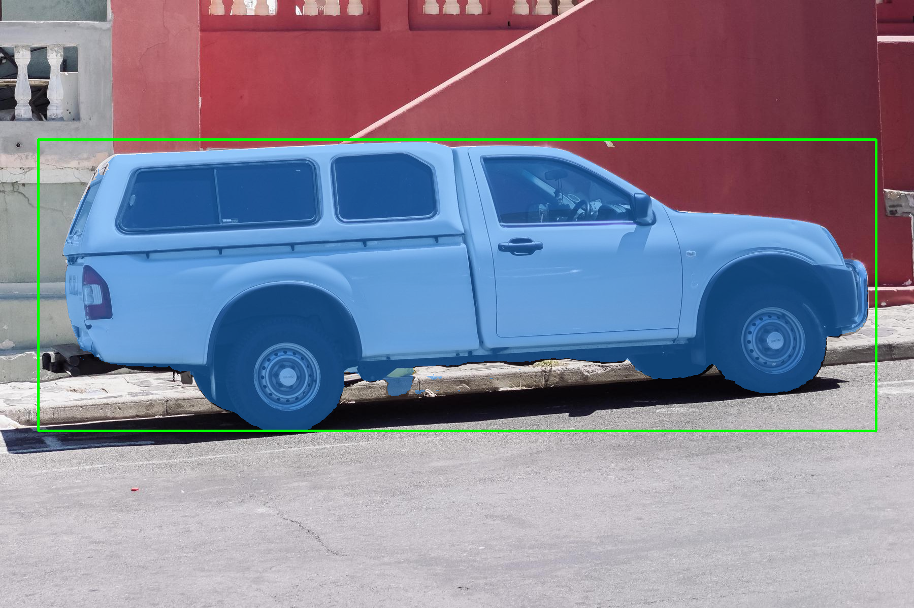
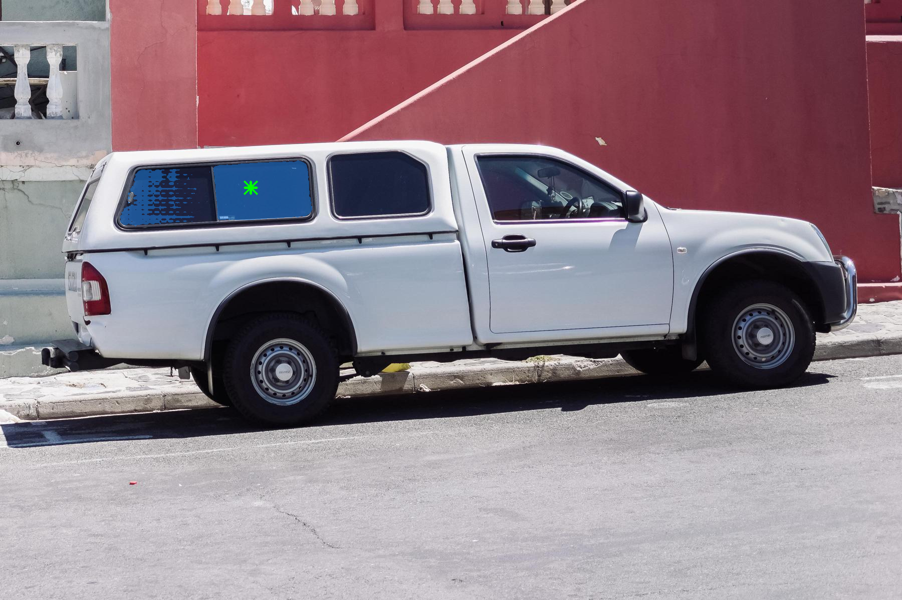
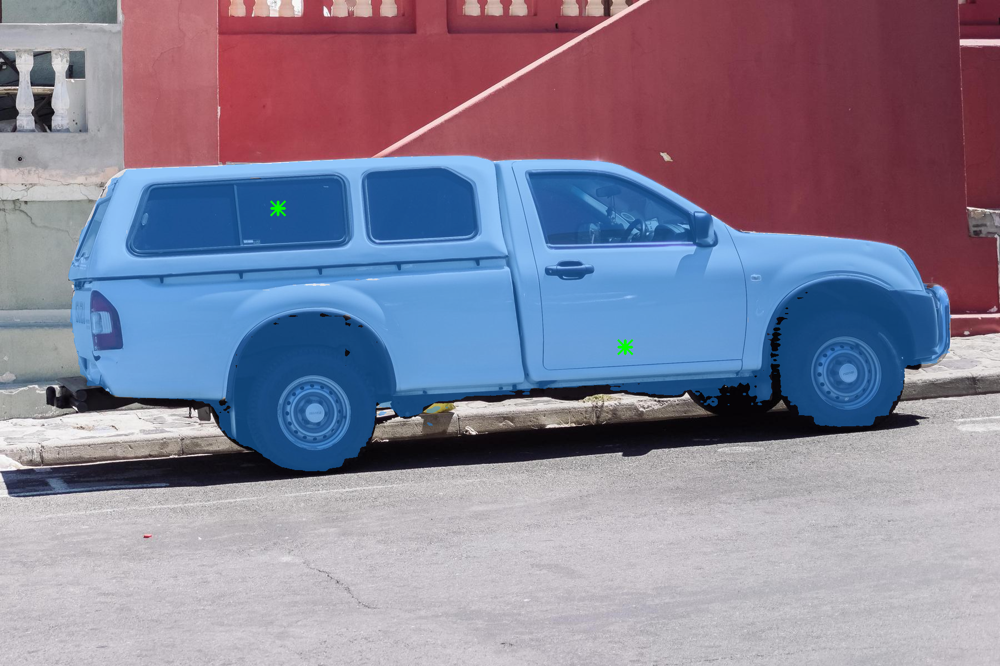
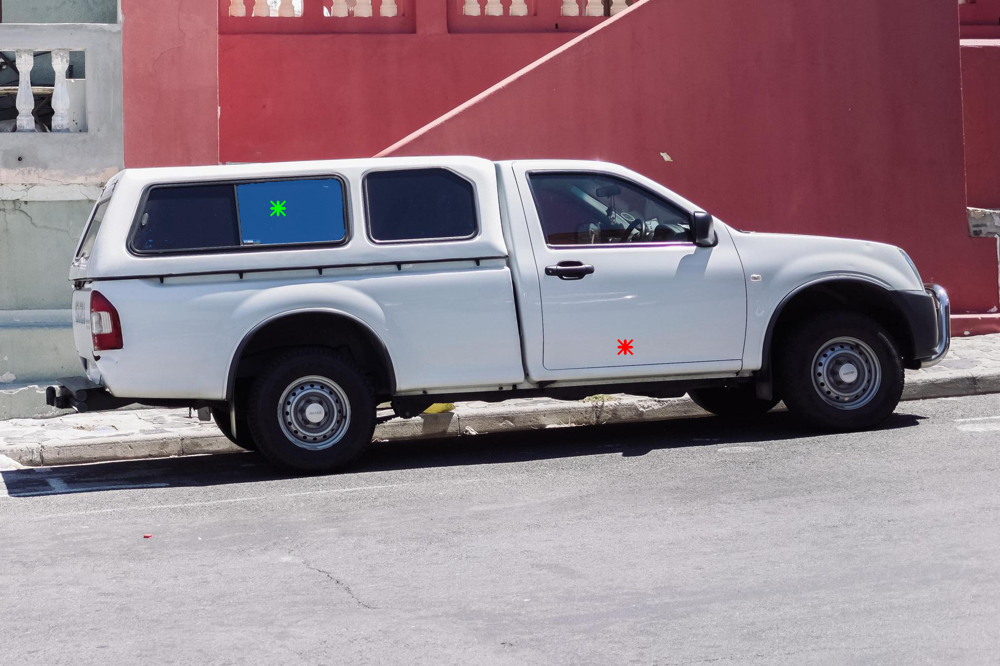
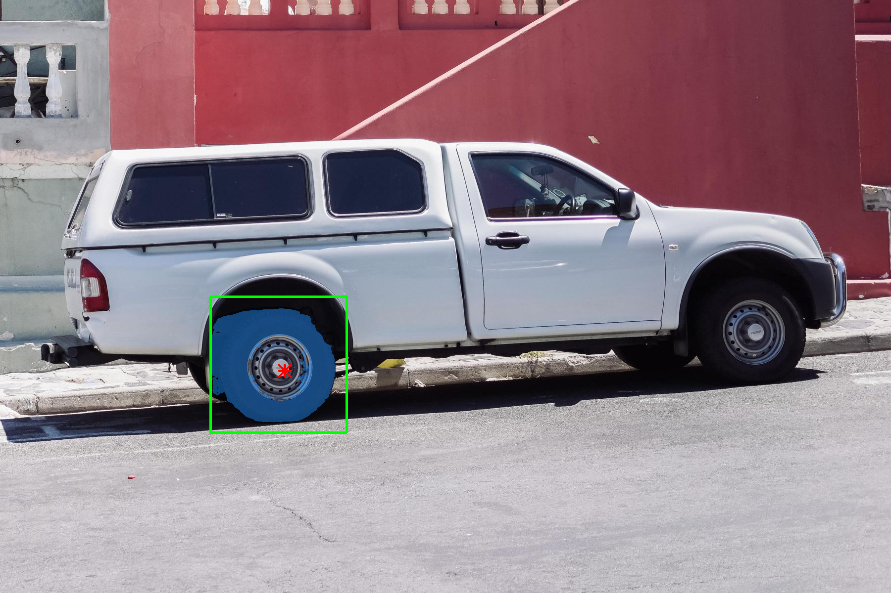

# EdgeTAM 部署指南

EdgeTAM 用于图像分割。本页说明 M.2 算力卡的接入条件、部署步骤与结果检查方法。

> 已实测，效果仍需评估。[查看部署效果](#查看部署效果)。

## 准备运行环境

本页效果展示使用 **RK3576 + AX8850 16GB M.2**；其他容量或平台需重新确认模型能否加载并正确运行。

在连接算力卡的 Linux 主机终端执行，RK3576 使用 ARM64 环境。首次部署先完成[驱动与设备检查](../../usage/device-check.md)、[安装 PyAXEngine](../../usage/python.md)和[下载工具安装](../../usage/download-models.md#使用-hugging-face-下载)。已完成这些步骤可直接下载模型。

后文使用设备 0，运行前用 `axcl-smi` 确认设备可用。

## 下载模型与样例

本页使用 `AXERA-TECH/EdgeTAM` 的固定版本。下面下载本页选用的 13 个文件。

```bash
MODEL_DIR=~/edgeaccel/models/edgetam/c6e1533ccf98
mkdir -p "$MODEL_DIR"
~/edgeaccel/hf-env/bin/hf download AXERA-TECH/EdgeTAM \
  "README.md" \
  "axmodel/dense_embeddings_no_mask.npy" \
  "axmodel/edgetam_image_encoder.axmodel" \
  "axmodel/edgetam_mask_decoder.axmodel" \
  "axmodel/edgetam_prompt_encoder.axmodel" \
  "axmodel/edgetam_prompt_mask_encoder.axmodel" \
  "examples/images/truck.jpg" \
  "image_prediction_ax.py" \
  "image_prediction_onnx.py" \
  "requirements.txt" \
  "utils/EdgeTAM_image_predictor.py" \
  "utils/EdgeTAM_image_predictor_onnx.py" \
  "utils/transforms.py" \
  --revision c6e1533ccf984f76b8c3afbed858ae2336a612fc \
  --local-dir "$MODEL_DIR"
cd "$MODEL_DIR"
```

保留当前终端中的 `MODEL_DIR` 变量，后续命令沿用此目录。下载受阻或需要离线复制时，见[下载方式与文件校验](../../usage/download-models.md)。

## 准备分割例程

在 RK3576 主机激活已安装 [PyAXEngine](../../usage/python.md) 的环境，确认依赖和后端：

```bash
source ~/edgeaccel/python-env/bin/activate
python -m pip install 'numpy==1.26.4' 'opencv-python-headless==4.11.0.86' 'pillow==11.3.0'
python -c "import axengine; print(axengine.get_available_providers())"
```

确认包含 `AXCLRTExecutionProvider`。下载 [EdgeTAM 算力卡例程](../../../static/examples/edgetam_card.py)，保存为 `~/edgeaccel/edgetam_card.py`。

本例使用四个 AX650 子模型和 `dense_embeddings_no_mask.npy`。保持下载后的目录结构；不需要另行下载 ONNX 权重。

## 运行六组交互提示

保持下载步骤中的 `MODEL_DIR`，执行：

```bash
python ~/edgeaccel/edgetam_card.py \
  --model-dir "$MODEL_DIR" \
  --output ~/edgeaccel/results/edgetam
```

结果目录需要尚不存在。例程读取官方车辆图片，依次执行整车框选、车窗单点、双正点、正负点、车轮框加负点，以及输入上一轮掩码的修正。

点标签 `1` 表示希望保留的区域，`0` 表示希望排除的区域。框使用原图像素坐标 `(x1,y1,x2,y2)`。输入图片按官方 AX 流程缩放为 RGB 1024×1024；不追加 ImageNet 归一化。

最后一组使用车窗单点结果的 256×256 低分辨率 logits，再加入车门负点；其中一个像素置为中性值 `0`，核对部分为零的有效掩码仍进入掩码编码器。例程使用“整张掩码全零才视为无掩码”的判断。

## 查看分割结果

打开结果目录中的 `*-overlay.png`：蓝色表示分割区域，绿色表示正点或框，红色表示负点。对照原图判断是否选中了需要的对象；负点未达到预期时，应调整提示后重新检查。

| 文件 | 内容 |
| --- | --- |
| `input.png` | 本次实际输入图片 |
| `*-overlay.png` | 六组提示对应的分割叠加图 |
| `*-mask.png` | 二值掩码 |
| `*-raw.npz` | 分割掩码、模型预测分数和低分辨率 logits |
| `refine-window-mask-input-logits.npy` | 修正步骤实际使用的输入掩码 |
| `deployment-result.json` | 提示坐标、四个子模型的调用次数、耗时及重复一致性 |

完成后应输出 `completed: true`，四个子模型都具有实际调用记录。分数是模型预测值，不能替代人工标注的 IoU。以下展示本页固定版本的实际结果。


## 查看部署效果

**已运行，效果仍需评估** · RK3576 + AX8850 16GB M.2。以下输入与输出来自本页固定版本的实际运行。

16GB 实测六组点、框和掩码修正。逐像素核对确认 5 个正点均被包含、3 个负点均被排除；车轮负点排除轮心，保留周围轮胎。提示响应符合这些坐标的要求，完整边界质量仍待像素标注评测。

**框选整车**

蓝色掩码覆盖车辆主体，包含车身及车轮。 蓝色为掩码，绿色为正点或框，红色为负点。

<div className="model-effect-gallery">

<figure>

[](../../../static/validation/effects/edgetam-20260928/input.webp)

<figcaption>实际输入 · 官方车辆图片</figcaption>
</figure>

<figure>

[](../../../static/validation/effects/edgetam-20260928/whole-truck-box-overlay.webp)

<figcaption>框选整车 · 本次分割</figcaption>
</figure>

</div>

| 参数 | 本次设置 |
| --- | --- |
| 点坐标 / 标签 | None / None |
| 框 XYXY | [75, 275, 1725, 850] |
| 输入掩码 | 无 |
| 掩码面积占比 | 29.40% |

**单点选择车窗**

掩码主要位于后侧窗玻璃，左侧窗部有零散区域。 蓝色为掩码，绿色为正点或框，红色为负点。

<div className="model-effect-gallery">

<figure>

[](../../../static/validation/effects/edgetam-20260928/input.webp)

<figcaption>实际输入 · 官方车辆图片</figcaption>
</figure>

<figure>

[](../../../static/validation/effects/edgetam-20260928/window-point-overlay.webp)

<figcaption>单点选择车窗 · 本次分割</figcaption>
</figure>

</div>

| 参数 | 本次设置 |
| --- | --- |
| 点坐标 / 标签 | [[500, 375]] / [1] |
| 框 XYXY | None |
| 输入掩码 | 无 |
| 掩码面积占比 | 1.31% |

| 提示坐标 | 提示类型 | 原始掩码内 |
| --- | --- | --- |
| [500, 375] | 正点 | 是 |

**两个正点**

在车窗与车门各放一个正点，掩码扩大到车辆主体，车身底部仍有边界缺口。 蓝色为掩码，绿色为正点或框，红色为负点。

<div className="model-effect-gallery">

<figure>

[](../../../static/validation/effects/edgetam-20260928/input.webp)

<figcaption>实际输入 · 官方车辆图片</figcaption>
</figure>

<figure>

[](../../../static/validation/effects/edgetam-20260928/two-positive-points-overlay.webp)

<figcaption>两个正点 · 本次分割</figcaption>
</figure>

</div>

| 参数 | 本次设置 |
| --- | --- |
| 点坐标 / 标签 | [[500, 375], [1125, 625]] / [1, 1] |
| 框 XYXY | None |
| 输入掩码 | 无 |
| 掩码面积占比 | 28.61% |

| 提示坐标 | 提示类型 | 原始掩码内 |
| --- | --- | --- |
| [500, 375] | 正点 | 是 |
| [1125, 625] | 正点 | 是 |

**正点与负点**

车窗正点搭配车门负点后，掩码集中于车窗局部。 蓝色为掩码，绿色为正点或框，红色为负点。

<div className="model-effect-gallery">

<figure>

[](../../../static/validation/effects/edgetam-20260928/input.webp)

<figcaption>实际输入 · 官方车辆图片</figcaption>
</figure>

<figure>

[](../../../static/validation/effects/edgetam-20260928/positive-negative-points-overlay.webp)

<figcaption>正点与负点 · 本次分割</figcaption>
</figure>

</div>

| 参数 | 本次设置 |
| --- | --- |
| 点坐标 / 标签 | [[500, 375], [1125, 625]] / [1, 0] |
| 框 XYXY | None |
| 输入掩码 | 无 |
| 掩码面积占比 | 0.94% |

| 提示坐标 | 提示类型 | 原始掩码内 |
| --- | --- | --- |
| [500, 375] | 正点 | 是 |
| [1125, 625] | 负点 | 否 |

**框选车轮与负点**

原始掩码不包含负点 [575, 750]，轮心被排除，周围轮胎仍被保留。此负点响应符合该坐标的排除要求，不能解释成必须删除整个车轮。蓝色为掩码，绿色为框，红色为负点。

<div className="model-effect-gallery">

<figure>

[](../../../static/validation/effects/edgetam-20260928/input.webp)

<figcaption>实际输入 · 官方车辆图片</figcaption>
</figure>

<figure>

[](../../../static/validation/effects/edgetam-20260928/wheel-box-negative-overlay.webp)

<figcaption>框选车轮与负点 · 本次分割</figcaption>
</figure>

</div>

| 参数 | 本次设置 |
| --- | --- |
| 点坐标 / 标签 | [[575, 750]] / [0] |
| 框 XYXY | [425, 600, 700, 875] |
| 输入掩码 | 无 |
| 掩码面积占比 | 1.66% |

| 提示坐标 | 提示类型 | 原始掩码内 |
| --- | --- | --- |
| [575, 750] | 负点 | 否 |

**使用上一轮掩码修正**

输入单点车窗的低分辨率 logits，再加车门负点，结果集中于后侧车窗局部；未用像素标注量化改进幅度。 蓝色为掩码，绿色为正点或框，红色为负点。 两个提示坐标分别被包含和排除；与不输入上一轮掩码的结果相比，面积变化不代表准确率提高。

<div className="model-effect-gallery">

<figure>

[](../../../static/validation/effects/edgetam-20260928/input.webp)

<figcaption>实际输入 · 官方车辆图片</figcaption>
</figure>

<figure>

[](../../../static/validation/effects/edgetam-20260928/refine-window-mask-overlay.webp)

<figcaption>使用上一轮掩码修正 · 本次分割</figcaption>
</figure>

</div>

| 参数 | 本次设置 |
| --- | --- |
| 点坐标 / 标签 | [[500, 375], [1125, 625]] / [1, 0] |
| 框 XYXY | None |
| 输入掩码 | window-point |
| 掩码面积占比 | 0.93% |

| 提示坐标 | 提示类型 | 原始掩码内 |
| --- | --- | --- |
| [500, 375] | 正点 | 是 |
| [1125, 625] | 负点 | 否 |

**使用时注意：**

- 这六组提示中的 5 个正点和 3 个负点均符合坐标包含/排除要求，但只核对了一张车辆图。没有像素级真值，不能给出整体掩码 IoU、精度或交互稳定性结论。
- 模型预测质量分数不能视为实测精度；负点不保证排除完整目标。

这些结果用于对照部署后的输出，未覆盖完整数据集精度或长期连续运行。

<details>
<summary>查看样例环境与运行耗时</summary>

环境：RK3576 + AX8850 16GB M.2。模型版本：`c6e1533ccf984f76b8c3afbed858ae2336a612fc`。

| 组件 | 版本或配置 |
| --- | --- |
| 主机 / 内核 | RK3576，约 4GB RAM，6.1.115-vendor-rk35xx |
| AXCL / 驱动 | V3.16.0_20260729180218 |
| 固件 / CMM | V3.16.0 / 15232 MiB |
| Python 推理 | PyAXEngine 0.1.3.rc3 / NumPy 1.26.4 / OpenCV 4.11.0 |
| 图像输入 | RGB float32 [1,3,1024,1024]，线性缩放，值域 0–255 |

| 指标 | 实测值 | 计时或统计范围 |
| --- | --- | --- |
| edgetam_image_encoder.axmodel | 153.807 ms（2 次平均） | AXCL session.run 墙钟，包含传输，不含加载、图像处理及保存，未剔除首轮。 |
| edgetam_prompt_encoder.axmodel | 2.472 ms（12 次平均） | AXCL session.run 墙钟，包含传输，不含加载、图像处理及保存，未剔除首轮。 |
| edgetam_prompt_mask_encoder.axmodel | 20.279 ms（2 次平均） | AXCL session.run 墙钟，包含传输，不含加载、图像处理及保存，未剔除首轮。 |
| edgetam_mask_decoder.axmodel | 166.214 ms（12 次平均） | AXCL session.run 墙钟，包含传输，不含加载、图像处理及保存，未剔除首轮。 |

适用范围：

- 仅在 16GB 卡验证，真实 8GB 回归待完成。

</details>

遇到加载、内存或后端错误时，按[常见问题](../../usage/troubleshooting.md)处理。需要更换输入或接入业务时，按[检查输出与记录结果](../../reference/validation.md)保留自己的结果。

<details>
<summary>查看文件用途与版本信息</summary>

| 文件 / 目录内路径 | 用途 |
| --- | --- |
| [`image_prediction_ax.py`](https://huggingface.co/AXERA-TECH/EdgeTAM/blob/c6e1533ccf984f76b8c3afbed858ae2336a612fc/image_prediction_ax.py) | Python 程序 / 前后处理 |
| [`axmodel/edgetam_image_encoder.axmodel`](https://huggingface.co/AXERA-TECH/EdgeTAM/blob/c6e1533ccf984f76b8c3afbed858ae2336a612fc/axmodel/edgetam_image_encoder.axmodel) | 编译模型；按目录区分芯片和规格 |
| [`axmodel/edgetam_mask_decoder.axmodel`](https://huggingface.co/AXERA-TECH/EdgeTAM/blob/c6e1533ccf984f76b8c3afbed858ae2336a612fc/axmodel/edgetam_mask_decoder.axmodel) | 编译模型；按目录区分芯片和规格 |
| [`axmodel/edgetam_prompt_encoder.axmodel`](https://huggingface.co/AXERA-TECH/EdgeTAM/blob/c6e1533ccf984f76b8c3afbed858ae2336a612fc/axmodel/edgetam_prompt_encoder.axmodel) | 编译模型；按目录区分芯片和规格 |
| [`axmodel/edgetam_prompt_mask_encoder.axmodel`](https://huggingface.co/AXERA-TECH/EdgeTAM/blob/c6e1533ccf984f76b8c3afbed858ae2336a612fc/axmodel/edgetam_prompt_mask_encoder.axmodel) | 编译模型；按目录区分芯片和规格 |
| [`config.json`](https://huggingface.co/AXERA-TECH/EdgeTAM/blob/c6e1533ccf984f76b8c3afbed858ae2336a612fc/config.json) | 运行配置 |
| [`requirements.txt`](https://huggingface.co/AXERA-TECH/EdgeTAM/blob/c6e1533ccf984f76b8c3afbed858ae2336a612fc/requirements.txt) | Python 依赖清单 |

仓库提交：`c6e1533ccf984f76b8c3afbed858ae2336a612fc`。仓库中的 4 个 `.axmodel` 文件可能包括多个芯片、规格和分片。运行时使用本页指定的配套文件，完整列表见[固定版本目录](https://huggingface.co/AXERA-TECH/EdgeTAM/tree/c6e1533ccf984f76b8c3afbed858ae2336a612fc)。

</details>

<details>
<summary>补充说明与版本差异</summary>

- 目标分割需要维护图像特征、提示或跨帧状态。先完成单图提示测试，再检查视频中的目标连续性。

</details>

## 参考资料

- [常用术语](../../reference/glossary.md)：AXCL、CMM、分词器与推理指标。
- [固定版本文件表](https://huggingface.co/AXERA-TECH/EdgeTAM/tree/c6e1533ccf984f76b8c3afbed858ae2336a612fc)。
- [模型卡 / 使用说明](https://huggingface.co/AXERA-TECH/EdgeTAM/blob/c6e1533ccf984f76b8c3afbed858ae2336a612fc/README.md)。
- [主要程序入口：image_prediction_ax.py](https://huggingface.co/AXERA-TECH/EdgeTAM/blob/c6e1533ccf984f76b8c3afbed858ae2336a612fc/image_prediction_ax.py)。

返回[完整模型目录](../catalog.mdx)。
