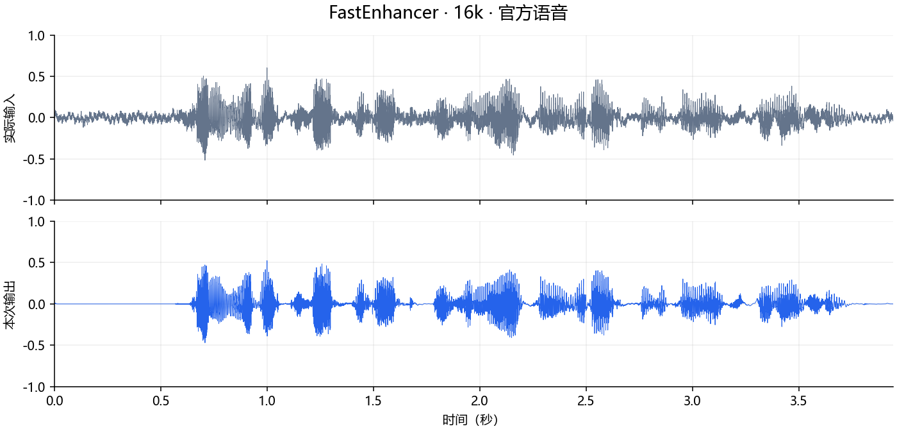
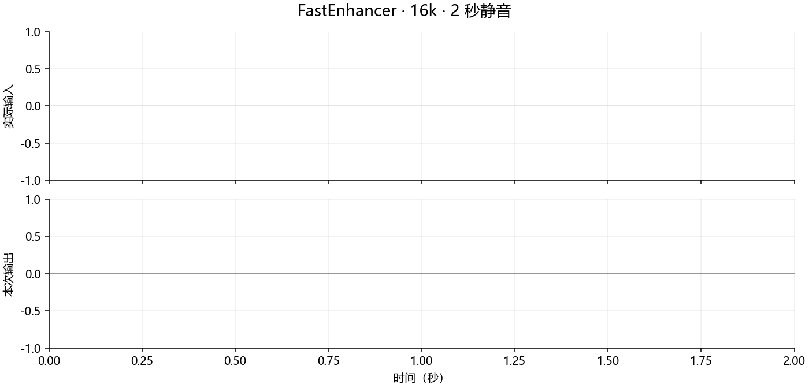
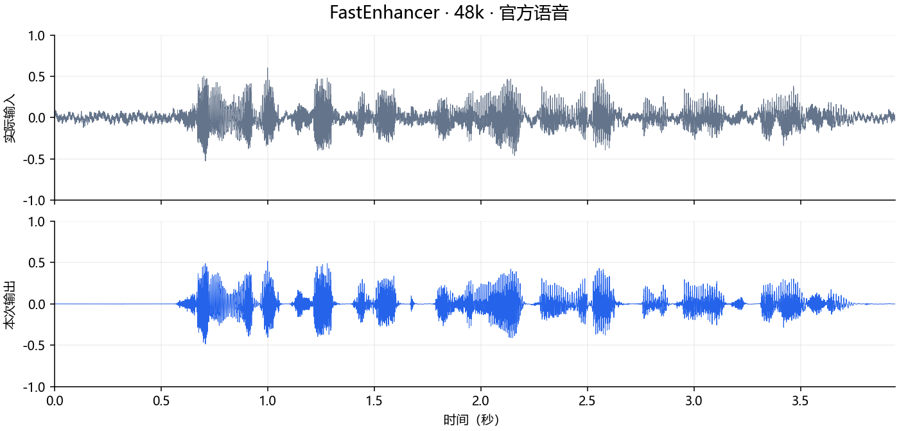
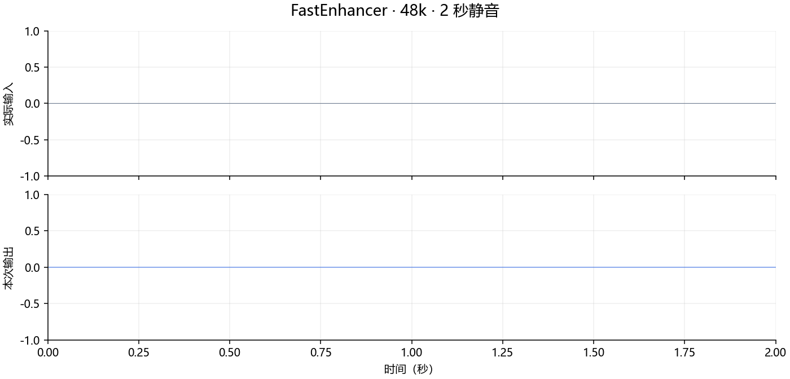

# fastenhancer.axera 部署指南

fastenhancer.axera 用于语音增强与分离。本页说明 M.2 算力卡的接入条件、部署步骤与结果检查方法。

> 已实测，效果仍需评估。[查看部署效果](#查看部署效果)。

## 准备运行环境

本页效果展示使用 **RK3576 + AX8850 16GB M.2**；其他容量或平台需重新确认模型能否加载并正确运行。

在连接算力卡的 Linux 主机终端执行，RK3576 使用 ARM64 环境。首次部署先完成[驱动与设备检查](../../usage/device-check.md)、[安装 PyAXEngine](../../usage/python.md)和[下载工具安装](../../usage/download-models.md#使用-hugging-face-下载)。已完成这些步骤可直接下载模型。

后文使用设备 0，运行前用 `axcl-smi` 确认设备可用。

## 下载模型与样例

本页使用 `AXERA-TECH/fastenhancer.axera` 的固定版本。下面下载本页选用的 14 个文件。

```bash
MODEL_DIR=~/edgeaccel/models/fastenhancer-axera/e1ba7551c386
mkdir -p "$MODEL_DIR"
~/edgeaccel/hf-env/bin/hf download AXERA-TECH/fastenhancer.axera \
  "README.md" \
  "models/16k/model.axmodel" \
  "models/16k/model_meta.json" \
  "models/48k/model.axmodel" \
  "models/48k/model_meta.json" \
  "python/demo.py" \
  "python/fastenhancer_sdk/16k/window.npy" \
  "python/fastenhancer_sdk/16k/window_istft.npy" \
  "python/fastenhancer_sdk/48k/window.npy" \
  "python/fastenhancer_sdk/48k/window_istft.npy" \
  "python/fastenhancer_sdk/__init__.py" \
  "python/fastenhancer_sdk/inference.py" \
  "python/requirements.txt" \
  "samples/p232_013_original.wav" \
  --revision e1ba7551c386e6b3f8f24b5de03db18197593ce3 \
  --local-dir "$MODEL_DIR"
cd "$MODEL_DIR"
```

保留当前终端中的 `MODEL_DIR` 变量，后续命令沿用此目录。下载受阻或需要离线复制时，见[下载方式与文件校验](../../usage/download-models.md)。

## 准备音频增强例程

在 RK3576 主机准备 FFmpeg，并激活已安装 [PyAXEngine](../../usage/python.md) 的环境：

```bash
sudo apt install ffmpeg
source ~/edgeaccel/python-env/bin/activate
python -m pip install 'numpy==1.26.4'
python -c "import axengine; print(axengine.get_available_providers())"
```

输出应包含 `AXCLRTExecutionProvider`。下载 [FastEnhancer 算力卡例程](../../../static/examples/fastenhancer_card.py)，保存为 `~/edgeaccel/fastenhancer_card.py`。

本例保留官方 NumPy 流式前后处理：主机执行 STFT、幅度压缩、解压和 ISTFT，算力卡执行神经网络核心。两种采样率分别使用自己的模型配置、窗函数与循环状态，不能混用。

## 运行 16kHz 和 48kHz 模型

保持下载步骤中的 `MODEL_DIR`。按顺序执行，等待上一条结束后再继续：

```bash
python ~/edgeaccel/fastenhancer_card.py \
  --model-dir "$MODEL_DIR" --rate 16k \
  --output ~/edgeaccel/results/fastenhancer-16k

python ~/edgeaccel/fastenhancer_card.py \
  --model-dir "$MODEL_DIR" --rate 48k \
  --output ~/edgeaccel/results/fastenhancer-48k
```

结果目录需要尚不存在。官方输入 `p232_013_original.wav` 是 48kHz 单声道 PCM16：16kHz 模型先通过 FFmpeg 重采样，48kHz 模型直接使用原音频。每个规格还处理两秒静音；各输入均从初始状态运行两次。

## 试听本次增强结果

在桌面音频播放器中分别打开各结果目录中的文件：

| 文件 | 内容 |
| --- | --- |
| `official-input.wav` | 实际送入该采样率流程的语音 |
| `official-output.wav` | 本次算力卡处理结果 |
| `silence-input.wav`、`silence-output.wav` | 静音输入与输出 |
| `*-raw.npz` | 本次浮点输入与输出数组 |
| `deployment-result.json` | 样本数、耗时、RTF、RMS 与重复一致性 |

完成标志为 `completed: true`，输入与输出样本数相等，重复输出一致且数值有限。本次静音也经过了神经网络处理，并未跳过算力卡调用。

RTF 是完整处理耗时除以音频时长。下方记录包含主机前后处理和 AXCL 调用，不包含模型加载、重采样和文件保存。RTF 小于 1 仅说明这段样例处理耗时少于音频时长；持续麦克风链路还需要单独验证。

试听时同时比较背景噪声、语音清晰度和失真。RMS 下降只是整体幅度变化，不能直接当作音质或降噪准确性指标。


## 查看部署效果

**已运行，效果仍需评估** · 2026-09-28 · RK3576 + AX8850 16GB M.2。以下输入与输出来自本页固定版本的实际运行。

16kHz 与 48kHz 两份权重均完成官方语音和两秒静音处理，样本长度不变，重复输出一致。下方可试听实际输入与输出。

**16k / 官方语音**

官方音频处理后 RMS 变化 -12.69%，样本长度保持一致，未观察到输出削波。RMS 变化不能代表降噪质量。 重置状态后两次浮点输出及全部 NPU 状态一致。

<div className="model-effect-gallery">

<figure>

[](../../../static/validation/effects/fastenhancer-axera-20260928/16k-official-waveform.png)

<figcaption>同一幅度范围的输入与输出波形</figcaption>
</figure>

</div>

| 项目 | 本次结果 |
| --- | --- |
| 采样率 / 样本数 | 16000 Hz / 63095 |
| 单遍完整处理 | 1.399 s |
| RTF | 0.355 |
| 单遍 NPU 调用 | 248 |

实际输入 · 16k

<audio controls preload="metadata" src="/validation/effects/fastenhancer-axera-20260928/16k-official-input.wav" aria-label="实际输入 · 16k"></audio>

[下载音频](../../../static/validation/effects/fastenhancer-axera-20260928/16k-official-input.wav)

本次输出 · 16k

<audio controls preload="metadata" src="/validation/effects/fastenhancer-axera-20260928/16k-official-output.wav" aria-label="本次输出 · 16k"></audio>

[下载音频](../../../static/validation/effects/fastenhancer-axera-20260928/16k-official-output.wav)

**16k / 静音**

两秒静音实际经过神经网络处理，输出保持全零。 重置状态后两次浮点输出及全部 NPU 状态一致。

<div className="model-effect-gallery">

<figure>

[](../../../static/validation/effects/fastenhancer-axera-20260928/16k-silence-waveform.png)

<figcaption>同一幅度范围的输入与输出波形</figcaption>
</figure>

</div>

| 项目 | 本次结果 |
| --- | --- |
| 采样率 / 样本数 | 16000 Hz / 32000 |
| 单遍完整处理 | 0.766 s |
| RTF | 0.383 |
| 单遍 NPU 调用 | 126 |

实际输入 · 16k

<audio controls preload="metadata" src="/validation/effects/fastenhancer-axera-20260928/16k-silence-input.wav" aria-label="实际输入 · 16k"></audio>

[下载音频](../../../static/validation/effects/fastenhancer-axera-20260928/16k-silence-input.wav)

本次输出 · 16k

<audio controls preload="metadata" src="/validation/effects/fastenhancer-axera-20260928/16k-silence-output.wav" aria-label="本次输出 · 16k"></audio>

[下载音频](../../../static/validation/effects/fastenhancer-axera-20260928/16k-silence-output.wav)

**48k / 官方语音**

官方音频处理后 RMS 变化 -11.97%，样本长度保持一致，未观察到输出削波。RMS 变化不能代表降噪质量。 重置状态后两次浮点输出及全部 NPU 状态一致。

<div className="model-effect-gallery">

<figure>

[](../../../static/validation/effects/fastenhancer-axera-20260928/48k-official-waveform.png)

<figcaption>同一幅度范围的输入与输出波形</figcaption>
</figure>

</div>

| 项目 | 本次结果 |
| --- | --- |
| 采样率 / 样本数 | 48000 Hz / 189285 |
| 单遍完整处理 | 2.206 s |
| RTF | 0.560 |
| 单遍 NPU 调用 | 371 |

实际输入 · 48k

<audio controls preload="metadata" src="/validation/effects/fastenhancer-axera-20260928/48k-official-input.wav" aria-label="实际输入 · 48k"></audio>

[下载音频](../../../static/validation/effects/fastenhancer-axera-20260928/48k-official-input.wav)

本次输出 · 48k

<audio controls preload="metadata" src="/validation/effects/fastenhancer-axera-20260928/48k-official-output.wav" aria-label="本次输出 · 48k"></audio>

[下载音频](../../../static/validation/effects/fastenhancer-axera-20260928/48k-official-output.wav)

**48k / 静音**

两秒静音实际经过神经网络处理，输出保持全零。 重置状态后两次浮点输出及全部 NPU 状态一致。

<div className="model-effect-gallery">

<figure>

[](../../../static/validation/effects/fastenhancer-axera-20260928/48k-silence-waveform.png)

<figcaption>同一幅度范围的输入与输出波形</figcaption>
</figure>

</div>

| 项目 | 本次结果 |
| --- | --- |
| 采样率 / 样本数 | 48000 Hz / 96000 |
| 单遍完整处理 | 1.235 s |
| RTF | 0.618 |
| 单遍 NPU 调用 | 189 |

实际输入 · 48k

<audio controls preload="metadata" src="/validation/effects/fastenhancer-axera-20260928/48k-silence-input.wav" aria-label="实际输入 · 48k"></audio>

[下载音频](../../../static/validation/effects/fastenhancer-axera-20260928/48k-silence-input.wav)

本次输出 · 48k

<audio controls preload="metadata" src="/validation/effects/fastenhancer-axera-20260928/48k-silence-output.wav" aria-label="本次输出 · 48k"></audio>

[下载音频](../../../static/validation/effects/fastenhancer-axera-20260928/48k-silence-output.wav)

**使用时注意：**

- 仅测试一段官方语音与静音；未完成人工听音评分，也未用纯净参考计算 PESQ、STOI 或信噪比改善。
- 本样例 RTF 小于 1，不代表麦克风链路、长时间运行或并发应用已满足实时要求；RMS 下降也不能单独证明音质提高。

这些结果用于对照部署后的输出，未覆盖完整数据集精度或长期连续运行。

<details>
<summary>查看样例环境与运行耗时</summary>

环境：RK3576 + AX8850 16GB M.2。日期：2026-09-28。模型版本：`e1ba7551c386e6b3f8f24b5de03db18197593ce3`。

| 组件 | 版本或配置 |
| --- | --- |
| 主机 / 内核 | RK3576，约 4GB RAM，6.1.115-vendor-rk35xx |
| AXCL / 驱动 | V3.16.0_20260729180218 |
| 固件 / CMM | V3.16.0 / 15232 MiB |
| Python 推理 | Python 3.12 / PyAXEngine 0.1.3.rc3 / NumPy 1.26.4 / AXCLRTExecutionProvider |

| 指标 | 实测值 | 计时或统计范围 |
| --- | --- | --- |
| 16k 官方音频 | 1.399 s / RTF 0.355 | 一次完整 enhance 调用，包括 CPU STFT、压缩、AXCL 核心、解压和 ISTFT；不含加载、重采样、保存及第二次复测。 |
| 48k 官方音频 | 2.206 s / RTF 0.560 | 一次完整 enhance 调用，包括 CPU STFT、压缩、AXCL 核心、解压和 ISTFT；不含加载、重采样、保存及第二次复测。 |

适用范围：

- 仅测试一段官方语音与静音；未完成人工听音评分，也未用纯净参考计算 PESQ、STOI 或信噪比改善。
- 本样例 RTF 小于 1，不代表麦克风链路、长时间运行或并发应用已满足实时要求；RMS 下降也不能单独证明音质提高。
- 仅在16GB卡运行，真实8GB与持续流式输入待验证。

</details>

遇到加载、内存或后端错误时，按[常见问题](../../usage/troubleshooting.md)处理。需要更换输入或接入业务时，按[检查输出与记录结果](../../reference/validation.md)保留自己的结果。

<details>
<summary>查看文件用途与版本信息</summary>

| 文件 / 目录内路径 | 用途 |
| --- | --- |
| [`python/demo.py`](https://huggingface.co/AXERA-TECH/fastenhancer.axera/blob/e1ba7551c386e6b3f8f24b5de03db18197593ce3/python/demo.py) | Python 程序 / 前后处理 |
| [`models/16k/model.axmodel`](https://huggingface.co/AXERA-TECH/fastenhancer.axera/blob/e1ba7551c386e6b3f8f24b5de03db18197593ce3/models/16k/model.axmodel) | 编译模型；按目录区分芯片和规格 |
| [`models/48k/model.axmodel`](https://huggingface.co/AXERA-TECH/fastenhancer.axera/blob/e1ba7551c386e6b3f8f24b5de03db18197593ce3/models/48k/model.axmodel) | 编译模型；按目录区分芯片和规格 |
| [`config.json`](https://huggingface.co/AXERA-TECH/fastenhancer.axera/blob/e1ba7551c386e6b3f8f24b5de03db18197593ce3/config.json) | 运行配置 |
| [`python/requirements.txt`](https://huggingface.co/AXERA-TECH/fastenhancer.axera/blob/e1ba7551c386e6b3f8f24b5de03db18197593ce3/python/requirements.txt) | Python 依赖清单 |
| [`requirements.txt`](https://huggingface.co/AXERA-TECH/fastenhancer.axera/blob/e1ba7551c386e6b3f8f24b5de03db18197593ce3/requirements.txt) | Python 依赖清单 |
| [`run_ax650.sh`](https://huggingface.co/AXERA-TECH/fastenhancer.axera/blob/e1ba7551c386e6b3f8f24b5de03db18197593ce3/run_ax650.sh) | 启动或构建脚本 |

仓库提交：`e1ba7551c386e6b3f8f24b5de03db18197593ce3`。仓库中的 2 个 `.axmodel` 文件可能包括多个芯片、规格和分片。运行时使用本页指定的配套文件，完整列表见[固定版本目录](https://huggingface.co/AXERA-TECH/fastenhancer.axera/tree/e1ba7551c386e6b3f8f24b5de03db18197593ce3)。

</details>

<details>
<summary>补充说明与版本差异</summary>

- 16k 与 48k 目录对应不同采样率。输入采样率、STFT 参数和模型必须一起选择。

</details>

## 参考资料

- [常用术语](../../reference/glossary.md)：AXCL、CMM、分词器与推理指标。
- [固定版本文件表](https://huggingface.co/AXERA-TECH/fastenhancer.axera/tree/e1ba7551c386e6b3f8f24b5de03db18197593ce3)。
- [模型卡 / 使用说明](https://huggingface.co/AXERA-TECH/fastenhancer.axera/blob/e1ba7551c386e6b3f8f24b5de03db18197593ce3/README.md)。
- [主要程序入口：python/demo.py](https://huggingface.co/AXERA-TECH/fastenhancer.axera/blob/e1ba7551c386e6b3f8f24b5de03db18197593ce3/python/demo.py)。

返回[完整模型目录](../catalog.mdx)。
