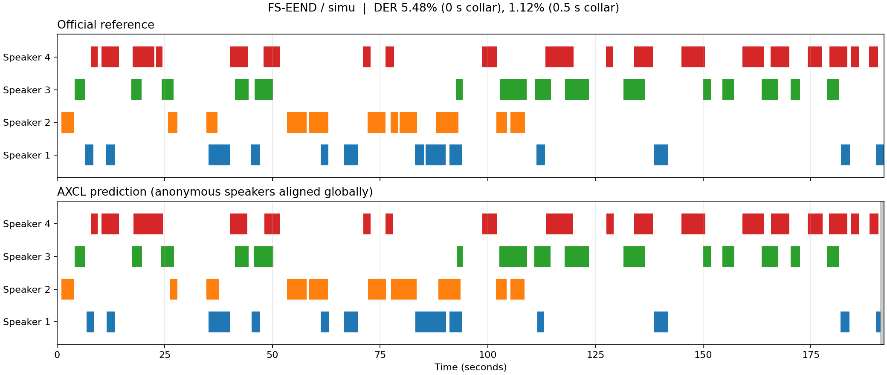
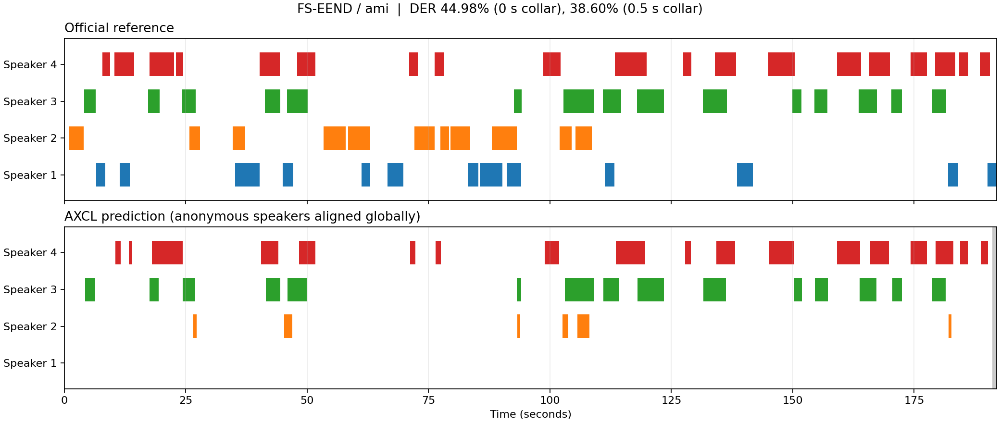

# FS-EEND.AXERA 部署指南

FS-EEND.AXERA 用于说话人识别与分段。本页说明 M.2 算力卡的接入条件、部署步骤与结果检查方法。

> 已实测，效果仍需评估。[查看部署效果](#查看部署效果)。

## 准备运行环境

本页效果展示使用 **RK3576 + AX8850 16GB M.2**；其他容量或平台需重新确认模型能否加载并正确运行。

在连接算力卡的 Linux 主机终端执行，RK3576 使用 ARM64 环境。首次部署先完成[驱动与设备检查](../../usage/device-check.md)、[安装 PyAXEngine](../../usage/python.md)和[下载工具安装](../../usage/download-models.md#使用-hugging-face-下载)。已完成这些步骤可直接下载模型。

后文使用设备 0，运行前用 `axcl-smi` 确认设备可用。

## 下载模型与样例

本页使用 `AXERA-TECH/FS-EEND.AXERA` 的固定版本。下面下载本页选用的 14 个文件。

```bash
MODEL_DIR=~/edgeaccel/models/fs-eend-axera/e775bd5df7cf
mkdir -p "$MODEL_DIR"
~/edgeaccel/hf-env/bin/hf download AXERA-TECH/FS-EEND.AXERA \
  "README.md" \
  "models/ami/model_meta.json" \
  "models/ami/streaming_step.axmodel" \
  "models/simu/model_meta.json" \
  "models/simu/streaming_step.axmodel" \
  "python/example.py" \
  "python/ls_eend_sdk/__init__.py" \
  "python/ls_eend_sdk/diarize.py" \
  "python/ls_eend_sdk/feature.py" \
  "python/ls_eend_sdk/postprocess.py" \
  "python/ls_eend_sdk/session.py" \
  "requirements.txt" \
  "samples/ground_truth_4spk_mix176.rttm" \
  "samples/mix_0000176.wav" \
  --revision e775bd5df7cfffd37a374f29c6e47f8b94e68f09 \
  --local-dir "$MODEL_DIR"
cd "$MODEL_DIR"
```

保留当前终端中的 `MODEL_DIR` 变量，后续命令沿用此目录。下载受阻或需要离线复制时，见[下载方式与文件校验](../../usage/download-models.md)。

## 准备 Python 环境

先按 [Python 接口](../../usage/python.md) 安装 PyAXEngine，在 RK3576 主机执行：

```bash
source ~/edgeaccel/python-env/bin/activate
python -m pip install 'numpy==1.26.4' 'librosa==0.11.0' 'scipy==1.17.1' 'soundfile==0.13.1'
python -c "import axengine; print(axengine.get_available_providers())"
```

输出须包含 `AXCLRTExecutionProvider`。本例分别运行 `models/simu/streaming_step.axmodel` 和 `models/ami/streaming_step.axmodel`，输出录音中各个说话人的活动时间段。说话人编号只是当前录音内的匿名标签，不代表真实身份。

## 运行说话人分离

下载 [FS-EEND 算力卡示例](../../../static/examples/fseend_card.py)，保存为 `~/edgeaccel/fseend_card.py`。沿用上方下载步骤的 `MODEL_DIR`：

```bash
python ~/edgeaccel/fseend_card.py \
  --model-dir "$MODEL_DIR" \
  --output ~/edgeaccel/results/fseend-01
```

输出目录须尚不存在。程序按顺序运行两套权重，每套处理约 192 秒的官方四人混合录音、重复录音和三秒静音。每次录音开始前重置状态，按 0.1 秒特征帧调用算力卡。

## 查看说话人时间段

输出目录中：

- `input.wav`：实际输入录音。
- `simu-official.rttm`、`ami-official.rttm`：两套权重的说话人分段。
- `reference.rttm`：官方示例的参考标注，仅适用于默认示例。
- `deployment-result.json`：实际分段、活跃说话人数、耗时和模型调用记录。
- `*.npz`：特征与原始预测，供本地复核。

RTTM 每行的第 4、5 列分别为开始时间和持续时间，单位为秒；第 8 列为匿名说话人标签。下方效果展示使用相同颜色对齐匿名说话人，便于观察漏检、误检和说话人混淆。

后处理沿用官方设置：取前四个说话人通道、概率阈值 0.5、11 帧中值滤波。此入口只保留最多四个说话人。前九帧用于状态预热，录音末尾约 0.9 秒未刷新输出。

下方说话人分离错误率（DER）用完整录音评分，包含重叠说话和未输出的尾部；分别给出无边界容差和 0.5 秒容差的结果。0.5 秒容差表示参考边界前后各排除 0.25 秒，匿名标签按全局最优匹配对齐。评分使用 [pyannote.metrics](https://pyannote.github.io/pyannote-metrics/reference.html)，并以独立时间区间积分复核。单段示例分数不能代替完整数据集精度。

`rtf` 为逐帧推理耗时除以录音时长，包含传输、状态更新与校验记录，不含音频特征提取、后处理和模型加载；不等同于麦克风实时端到端延迟。

## 处理自己的录音

```bash
python ~/edgeaccel/fseend_card.py \
  --model-dir "$MODEL_DIR" \
  --audio ~/Music/meeting.wav \
  --output ~/edgeaccel/results/fseend-custom-01
```

本入口接受最长十分钟的音频，建议使用 8 kHz 单声道 WAV。其他采样率由前处理重采样到 8 kHz。自定义录音输出为 `simu-custom.rttm` 和 `ami-custom.rttm`，需要另外提供对应参考标注才能计算 DER；随包的 `reference.rttm` 不适用。


## 查看部署效果

**已运行，效果仍需评估** · RK3576 + AX8850 16GB M.2。以下输入与输出来自本页固定版本的实际运行。

16GB 卡完成 simu 与 AMI 权重的同一段官方四人模拟录音。零容差 DER 分别为 5.4844% 与 44.9837%；AMI 的参考说话人 1 无独立匹配通道、说话人 2 匹配覆盖率 11.64%。两套流程尾部约 0.818 秒参考发言未输出，已计入误差。

**simu 权重：四人录音分段**

simu 权重面向模拟混合录音。本图由本次原始预测生成，颜色按匿名说话人的全局匹配对齐。 下表使用与时间轴相同的全局匿名通道匹配，边界容差为 0 秒，保留重叠发言，并计入完整录音。匹配覆盖率为正确匹配时长 / 该说话人参考发言时长；“未匹配参考”同时包含漏检和身份混淆，不能把表内未匹配与参考外预测简单相加作为 DER。 当前流程在 191.200 秒后未输出分段，录音结束于 192.018375 秒。末尾约 0.818 秒在官方参考中仍为说话人 1 发言，已计入上表和 DER，没有裁掉尾部来提高得分；完整句尾输出仍需补充验证。

<div className="model-effect-gallery">

<figure>

[](../../../static/validation/effects/fs-eend-axera-20260928/simu-timeline.png)

<figcaption>simu：参考与实际说话人活动时间轴，灰色为未刷新尾部</figcaption>
</figure>

</div>

| 边界容差 | DER | 漏检 / s | 误检 / s | 混淆 / s | 参考 / s |
| --- | --- | --- | --- | --- | --- |
| 0.0 s | 5.4844% | 5.898 | 4.500 | 0.000 | 189.598 |
| 0.5 s | 1.1214% | 1.150 | 0.350 | 0.000 | 133.760 |

| 输入 | 活跃说话人 | 逐帧推理耗时 | RTF | 实际调用 |
| --- | --- | --- | --- | --- |
| 官方录音 | 4 | 65.353552 s | 0.340351 | 1921 |
| 重复录音 | 4 | 65.601375 s | 0.341641 | 1921 |
| 三秒静音 | 0 | 1.224018 s | 0.408006 | 30 |

| 参考说话人 | 参考发言 / s | 正确匹配 / s | 未匹配参考 / s | 参考外预测 / s | 匹配覆盖率 |
| --- | --- | --- | --- | --- | --- |
| Speaker 1 | 35.278 | 33.150 | 2.128 | 0.650 | 93.97% |
| Speaker 2 | 37.800 | 36.280 | 1.520 | 1.320 | 95.98% |
| Speaker 3 | 50.410 | 49.720 | 0.690 | 1.180 | 98.63% |
| Speaker 4 | 66.110 | 64.550 | 1.560 | 1.350 | 97.64% |

实际输入：官方四人混合录音，192.018375 秒

<audio controls preload="metadata" src="/validation/effects/fs-eend-axera-20260928/input.wav" aria-label="实际输入：官方四人混合录音，192.018375 秒"></audio>

[下载音频](../../../static/validation/effects/fs-eend-axera-20260928/input.wav)

**ami 权重：四人录音分段**

AMI 权重也实际处理了同一段模拟录音；该输入不是 AMI 会议集，不能据此代表真实会议效果。 下表使用与时间轴相同的全局匿名通道匹配，边界容差为 0 秒，保留重叠发言，并计入完整录音。匹配覆盖率为正确匹配时长 / 该说话人参考发言时长；“未匹配参考”同时包含漏检和身份混淆，不能把表内未匹配与参考外预测简单相加作为 DER。 本样例的参考说话人 1 没有独立匹配通道，说话人 2 仅匹配 4.400 / 37.800 秒；这不表示其声音从未触发任何输出，而是没有被正确分配到相应说话人。该结论仅适用于这段模拟录音。 当前流程在 191.200 秒后未输出分段，录音结束于 192.018375 秒。末尾约 0.818 秒在官方参考中仍为说话人 1 发言，已计入上表和 DER，没有裁掉尾部来提高得分；完整句尾输出仍需补充验证。

<div className="model-effect-gallery">

<figure>

[](../../../static/validation/effects/fs-eend-axera-20260928/ami-timeline.png)

<figcaption>ami：参考与实际说话人活动时间轴，灰色为未刷新尾部</figcaption>
</figure>

</div>

| 边界容差 | DER | 漏检 / s | 误检 / s | 混淆 / s | 参考 / s |
| --- | --- | --- | --- | --- | --- |
| 0.0 s | 44.9837% | 81.838 | 0.640 | 2.810 | 189.598 |
| 0.5 s | 38.5990% | 49.710 | 0.000 | 1.920 | 133.760 |

| 输入 | 活跃说话人 | 逐帧推理耗时 | RTF | 实际调用 |
| --- | --- | --- | --- | --- |
| 官方录音 | 3 | 54.354223 s | 0.283068 | 1921 |
| 重复录音 | 3 | 53.997183 s | 0.281208 | 1921 |
| 三秒静音 | 0 | 1.095260 s | 0.365087 | 30 |

| 参考说话人 | 参考发言 / s | 正确匹配 / s | 未匹配参考 / s | 参考外预测 / s | 匹配覆盖率 |
| --- | --- | --- | --- | --- | --- |
| Speaker 1 | 35.278 | 0.000 | 35.278 | 0.000 | 0.00% |
| Speaker 2 | 37.800 | 4.400 | 33.400 | 2.800 | 11.64% |
| Speaker 3 | 50.410 | 45.910 | 4.500 | 0.290 | 91.07% |
| Speaker 4 | 66.110 | 54.640 | 11.470 | 0.360 | 82.65% |

**使用时注意：**

- DER使用完整录音评分，保留重叠说话；0.5秒容差在每个参考边界前后各排除0.25秒。分母为累计说话人时长，可能超过录音时长。
- 当前后处理只取前四个说话人通道；未验证更多说话人。每段末尾约0.9秒未刷新输出，已计入评分范围。

这些结果用于对照部署后的输出，未覆盖完整数据集精度或长期连续运行。

<details>
<summary>查看样例环境与运行耗时</summary>

环境：RK3576 + AX8850 16GB M.2。模型版本：`e775bd5df7cfffd37a374f29c6e47f8b94e68f09`。

| 组件 | 版本或配置 |
| --- | --- |
| 主机 / 内核 | RK3576，约 4GB RAM，6.1.115-vendor-rk35xx |
| AXCL / 驱动 | V3.16.0_20260729180218 |
| 固件 / CMM | V3.16.0 / 15232 MiB |
| Python 推理 | Python 3.12 / PyAXEngine 0.1.3.rc3 / NumPy 1.26.4 / AXCLRTExecutionProvider |

| 指标 | 实测值 | 计时或统计范围 |
| --- | --- | --- |
| 官方录音 | 192.018 s / 4 位匿名说话人 | 同一段模拟混合录音，不能替代完整数据集。 |
| 首次逐帧推理耗时 | 65.354 s / 54.354 s | 依次为simu、AMI；含传输、状态更新和校验记录，不含前处理、后处理及加载。 |
| 实际模型调用 | 3872 / 3872 | 依次为simu、AMI，含完整录音、重复和静音。 |
| 重复与静音 | 重复模型输入输出一致；静音分段见上表 | 重复前清空状态，原始输入输出哈希逐帧核对。 |

适用范围：

- 仅验证一个模拟录音样例，尚无完整测试集或CPU浮点模型对照；AMI真实会议和长时间麦克风输入仍待验证。
- 本次为16GB卡，真实8GB容量仍需回归。
- 逐说话人匹配统计限于本段模拟录音；AMI 结果不能代表真实 AMI 会议集。当前流程有 0.818375 秒未输出尾部，参考仍有发言，需验证末尾刷新后再评价完整分段能力。

</details>

遇到加载、内存或后端错误时，按[常见问题](../../usage/troubleshooting.md)处理。需要更换输入或接入业务时，按[检查输出与记录结果](../../reference/validation.md)保留自己的结果。

<details>
<summary>查看文件用途与版本信息</summary>

| 文件 / 目录内路径 | 用途 |
| --- | --- |
| [`python/example.py`](https://huggingface.co/AXERA-TECH/FS-EEND.AXERA/blob/e775bd5df7cfffd37a374f29c6e47f8b94e68f09/python/example.py) | Python 程序 / 前后处理 |
| [`models/ami/streaming_step.axmodel`](https://huggingface.co/AXERA-TECH/FS-EEND.AXERA/blob/e775bd5df7cfffd37a374f29c6e47f8b94e68f09/models/ami/streaming_step.axmodel) | 编译模型；按目录区分芯片和规格 |
| [`models/simu/streaming_step.axmodel`](https://huggingface.co/AXERA-TECH/FS-EEND.AXERA/blob/e775bd5df7cfffd37a374f29c6e47f8b94e68f09/models/simu/streaming_step.axmodel) | 编译模型；按目录区分芯片和规格 |
| [`config.json`](https://huggingface.co/AXERA-TECH/FS-EEND.AXERA/blob/e775bd5df7cfffd37a374f29c6e47f8b94e68f09/config.json) | 运行配置 |
| [`requirements.txt`](https://huggingface.co/AXERA-TECH/FS-EEND.AXERA/blob/e775bd5df7cfffd37a374f29c6e47f8b94e68f09/requirements.txt) | Python 依赖清单 |
| [`run_ax650.sh`](https://huggingface.co/AXERA-TECH/FS-EEND.AXERA/blob/e775bd5df7cfffd37a374f29c6e47f8b94e68f09/run_ax650.sh) | 启动或构建脚本 |

仓库提交：`e775bd5df7cfffd37a374f29c6e47f8b94e68f09`。仓库中的 2 个 `.axmodel` 文件可能包括多个芯片、规格和分片。运行时使用本页指定的配套文件，完整列表见[固定版本目录](https://huggingface.co/AXERA-TECH/FS-EEND.AXERA/tree/e775bd5df7cfffd37a374f29c6e47f8b94e68f09)。

</details>

<details>
<summary>补充说明与版本差异</summary>

- 这是流式说话人分离任务，simu 与 ami 目录有不同数据域权重。检查重叠发言及状态跨音频块传递。

</details>

## 参考资料

- [常用术语](../../reference/glossary.md)：AXCL、CMM、分词器与推理指标。
- [固定版本文件表](https://huggingface.co/AXERA-TECH/FS-EEND.AXERA/tree/e775bd5df7cfffd37a374f29c6e47f8b94e68f09)。
- [模型卡 / 使用说明](https://huggingface.co/AXERA-TECH/FS-EEND.AXERA/blob/e775bd5df7cfffd37a374f29c6e47f8b94e68f09/README.md)。
- [主要程序入口：python/example.py](https://huggingface.co/AXERA-TECH/FS-EEND.AXERA/blob/e775bd5df7cfffd37a374f29c6e47f8b94e68f09/python/example.py)。

返回[完整模型目录](../catalog.mdx)。
