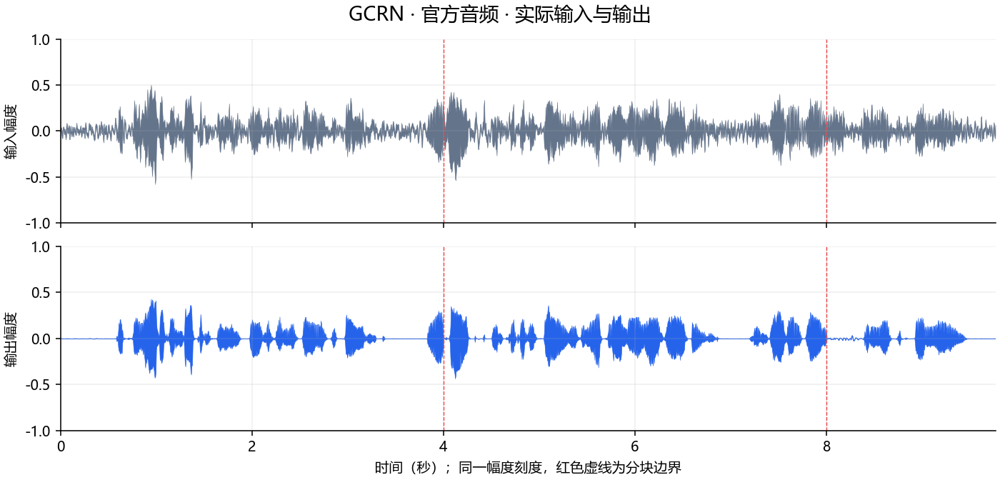
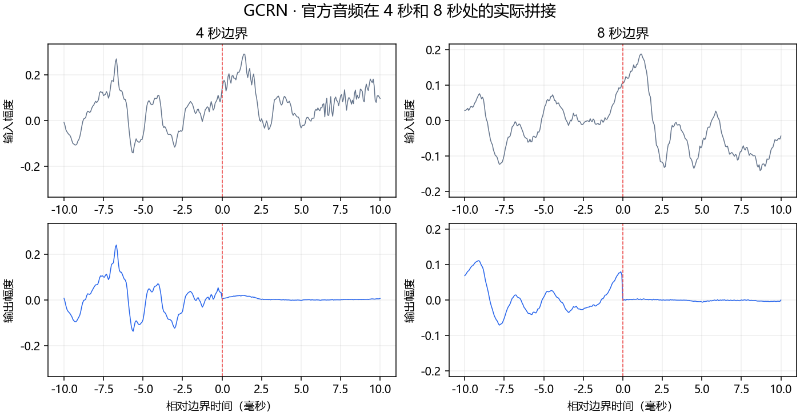
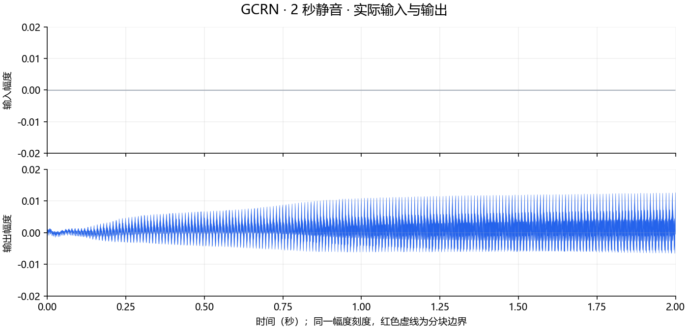
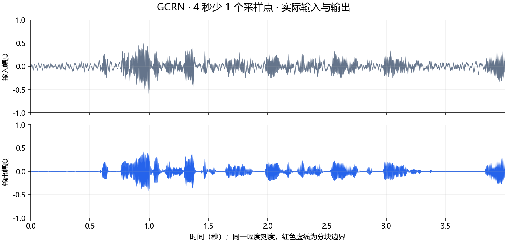
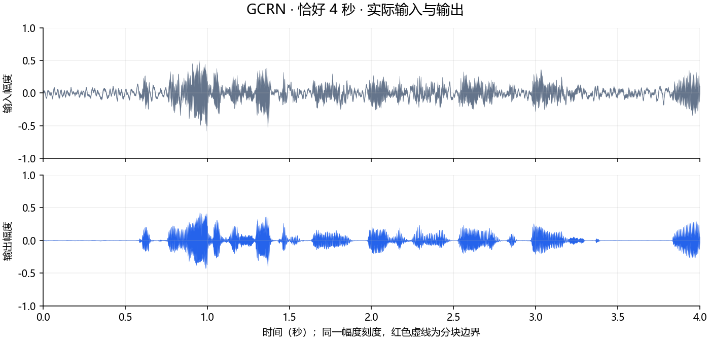
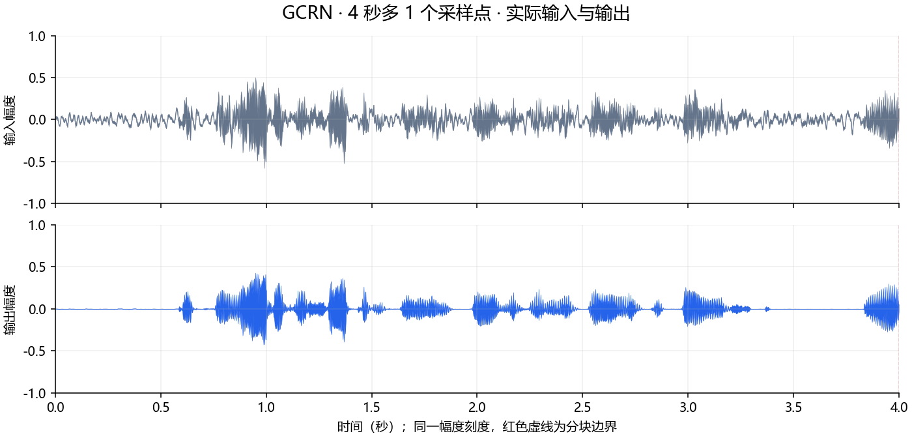

# GCRN 部署指南

GCRN 用于语音增强与分离。本页说明 M.2 算力卡的接入条件、部署步骤与结果检查方法。

> 已实测，效果仍需评估。[查看部署效果](#查看部署效果)。

## 准备运行环境

本页效果展示使用 **RK3576 + AX8850 16GB M.2**；其他容量或平台需重新确认模型能否加载并正确运行。

在连接算力卡的 Linux 主机终端执行，RK3576 使用 ARM64 环境。首次部署先完成[驱动与设备检查](../../usage/device-check.md)、[安装 PyAXEngine](../../usage/python.md)和[下载工具安装](../../usage/download-models.md#使用-hugging-face-下载)。已完成这些步骤可直接下载模型。

后文使用设备 0，运行前用 `axcl-smi` 确认设备可用。

## 下载模型与样例

本页使用 `AXERA-TECH/GCRN` 的固定版本。下面下载本页选用的 11 个文件。

```bash
MODEL_DIR=~/edgeaccel/models/gcrn/5e2371051382
mkdir -p "$MODEL_DIR"
~/edgeaccel/hf-env/bin/hf download AXERA-TECH/GCRN \
  "README.md" \
  "models/model.axmodel" \
  "models/model_meta.json" \
  "python/README.md" \
  "python/demo.py" \
  "python/gcrn_sdk/__init__.py" \
  "python/gcrn_sdk/audio.py" \
  "python/gcrn_sdk/inference.py" \
  "python/gcrn_sdk/runtime.py" \
  "python/requirements.txt" \
  "test_audio/mix.wav" \
  --revision 5e2371051382c0dedd6bc560379059af79121e5f \
  --local-dir "$MODEL_DIR"
cd "$MODEL_DIR"
```

保留当前终端中的 `MODEL_DIR` 变量，后续命令沿用此目录。下载受阻或需要离线复制时，见[下载方式与文件校验](../../usage/download-models.md)。

## 准备分块降噪例程

在 RK3576 主机激活已安装 [PyAXEngine](../../usage/python.md) 的环境，确认算力卡后端可用：

```bash
source ~/edgeaccel/python-env/bin/activate
python -m pip install 'numpy==1.26.4'
python -c "import axengine; print(axengine.get_available_providers())"
```

输出应包含 `AXCLRTExecutionProvider`。下载 [GCRN 算力卡例程](../../../static/examples/gcrn_card.py)，保存为 `~/edgeaccel/gcrn_card.py`。

本例保留官方前后处理，明确使用 AXCL 后端。输入为 16kHz、单声道 PCM16 WAV；每 4 秒为一块，最后不足 4 秒的部分补零，合并后裁回原始样本数。

## 运行官方音频和边界样例

保持下载步骤中的 `MODEL_DIR`，执行：

```bash
python ~/edgeaccel/gcrn_card.py \
  --model-dir "$MODEL_DIR" \
  --output ~/edgeaccel/results/gcrn
```

结果目录需要尚不存在。例程依次处理官方约 9.77 秒音频、两秒静音，以及从官方音频截取的 63999、64000、64001 个采样点；后面三组分别对应 4 秒少一点、恰好 4 秒、多一点。

每组运行两遍。官方 SDK 每次处理前会额外执行一次零输入预热，报告中的 `npuCallsPerPass` 包含这次调用，`dataChunks` 只统计有效音频块。

## 查看并试听输出

结果文件使用 `official`、`silence`、`below-4s`、`exact-4s`、`above-4s` 前缀：

| 文件 | 内容 |
| --- | --- |
| `<前缀>-input.wav` | 本次输入 |
| `<前缀>-output.wav` | 本次实际降噪输出 |
| `<前缀>-raw.npz` | 保存前的浮点输入与输出 |
| `deployment-result.json` | 样本数、分块数、耗时及边界记录 |

基本运行完成时，报告为 `completed: true`，每组 `repeatExact: true`，输出长度与输入相同。`chunkChecks` 核对第一块是否受后续块长度影响。

本次静音输出不是全零，官方音频的 4 秒和 8 秒拼接处也存在幅度跳变。下方保留真实音频和局部波形；这些结果尚不能证明静音抑制或连续音质达到应用要求。

处理耗时包含主机频谱变换、零输入预热、AXCL 调用、输出拼接和记录，不含模型加载及文件读写。RTF 小于 1 表示文件处理耗时短于音频时长，不能替代麦克风延迟测试。


## 查看部署效果

**已运行，效果仍需评估** · 2026-09-28 · RK3576 + AX8850 16GB M.2。以下输入与输出来自本页固定版本的实际运行。

官方音频、静音及三个4秒边界长度完成 AXCL 推理；两次输出一致且长度正确。静音输出和分块拼接仍存在待核对的质量问题。

**官方音频**

输入与输出样本数相同，两次 NPU 原始输出和最终音频一致。 4秒和8秒分块处出现幅度跳变，连续性及听感仍需评估。

<div className="model-effect-gallery">

<figure>

[](../../../static/validation/effects/gcrn-20260928/official-waveform.png)

<figcaption>同一幅度范围的输入与输出</figcaption>
</figure>

<figure>

[](../../../static/validation/effects/gcrn-20260928/official-boundaries.png)

<figcaption>4秒和8秒拼接处的实际波形</figcaption>
</figure>

</div>

| 项目 | 实测结果 |
| --- | --- |
| 样本数 | 156302 |
| 有效音频块 / 预热调用 | 3 / 1 |
| 单遍完整处理 | 0.3296 s |
| RTF | 0.0337 |

| 分块时刻 | 输入相邻点差 | 输出相邻点差 |
| --- | --- | --- |
| 4 s | 0.037140 | -0.028167 |
| 8 s | 0.003143 | -0.068143 |

实际输入 · 官方音频

<audio controls preload="metadata" src="/validation/effects/gcrn-20260928/official-input.wav" aria-label="实际输入 · 官方音频"></audio>

[下载音频](../../../static/validation/effects/gcrn-20260928/official-input.wav)

本次输出 · 官方音频

<audio controls preload="metadata" src="/validation/effects/gcrn-20260928/official-output.wav" aria-label="本次输出 · 官方音频"></audio>

[下载音频](../../../static/validation/effects/gcrn-20260928/official-output.wav)

**两秒静音**

输入与输出样本数相同，两次 NPU 原始输出和最终音频一致。 静音输出不是全零：RMS 0.002996，峰值 0.012729；静音降噪效果未通过核对。

<div className="model-effect-gallery">

<figure>

[](../../../static/validation/effects/gcrn-20260928/silence-waveform.png)

<figcaption>同一幅度范围的输入与输出</figcaption>
</figure>

</div>

| 项目 | 实测结果 |
| --- | --- |
| 样本数 | 32000 |
| 有效音频块 / 预热调用 | 1 / 1 |
| 单遍完整处理 | 0.1468 s |
| RTF | 0.0734 |

实际输入 · 两秒静音

<audio controls preload="metadata" src="/validation/effects/gcrn-20260928/silence-input.wav" aria-label="实际输入 · 两秒静音"></audio>

[下载音频](../../../static/validation/effects/gcrn-20260928/silence-input.wav)

本次输出 · 两秒静音

<audio controls preload="metadata" src="/validation/effects/gcrn-20260928/silence-output.wav" aria-label="本次输出 · 两秒静音"></audio>

[下载音频](../../../static/validation/effects/gcrn-20260928/silence-output.wav)

**4秒少1个采样点**

输入与输出样本数相同，两次 NPU 原始输出和最终音频一致。

<div className="model-effect-gallery">

<figure>

[](../../../static/validation/effects/gcrn-20260928/below-4s-waveform.png)

<figcaption>同一幅度范围的输入与输出</figcaption>
</figure>

</div>

| 项目 | 实测结果 |
| --- | --- |
| 样本数 | 63999 |
| 有效音频块 / 预热调用 | 1 / 1 |
| 单遍完整处理 | 0.1452 s |
| RTF | 0.0363 |

实际输入 · 4秒少1个采样点

<audio controls preload="metadata" src="/validation/effects/gcrn-20260928/below-4s-input.wav" aria-label="实际输入 · 4秒少1个采样点"></audio>

[下载音频](../../../static/validation/effects/gcrn-20260928/below-4s-input.wav)

本次输出 · 4秒少1个采样点

<audio controls preload="metadata" src="/validation/effects/gcrn-20260928/below-4s-output.wav" aria-label="本次输出 · 4秒少1个采样点"></audio>

[下载音频](../../../static/validation/effects/gcrn-20260928/below-4s-output.wav)

**恰好4秒**

输入与输出样本数相同，两次 NPU 原始输出和最终音频一致。

<div className="model-effect-gallery">

<figure>

[](../../../static/validation/effects/gcrn-20260928/exact-4s-waveform.png)

<figcaption>同一幅度范围的输入与输出</figcaption>
</figure>

</div>

| 项目 | 实测结果 |
| --- | --- |
| 样本数 | 64000 |
| 有效音频块 / 预热调用 | 1 / 1 |
| 单遍完整处理 | 0.1464 s |
| RTF | 0.0366 |

实际输入 · 恰好4秒

<audio controls preload="metadata" src="/validation/effects/gcrn-20260928/exact-4s-input.wav" aria-label="实际输入 · 恰好4秒"></audio>

[下载音频](../../../static/validation/effects/gcrn-20260928/exact-4s-input.wav)

本次输出 · 恰好4秒

<audio controls preload="metadata" src="/validation/effects/gcrn-20260928/exact-4s-output.wav" aria-label="本次输出 · 恰好4秒"></audio>

[下载音频](../../../static/validation/effects/gcrn-20260928/exact-4s-output.wav)

**4秒多1个采样点**

输入与输出样本数相同，两次 NPU 原始输出和最终音频一致。 多出的1个采样点进入第二块，第一块与恰好4秒的结果完全一致。

<div className="model-effect-gallery">

<figure>

[](../../../static/validation/effects/gcrn-20260928/above-4s-waveform.png)

<figcaption>同一幅度范围的输入与输出</figcaption>
</figure>

</div>

| 项目 | 实测结果 |
| --- | --- |
| 样本数 | 64001 |
| 有效音频块 / 预热调用 | 2 / 1 |
| 单遍完整处理 | 0.2316 s |
| RTF | 0.0579 |

| 分块时刻 | 输入相邻点差 | 输出相邻点差 |
| --- | --- | --- |
| 4 s | 0.037140 | -0.032877 |

实际输入 · 4秒多1个采样点

<audio controls preload="metadata" src="/validation/effects/gcrn-20260928/above-4s-input.wav" aria-label="实际输入 · 4秒多1个采样点"></audio>

[下载音频](../../../static/validation/effects/gcrn-20260928/above-4s-input.wav)

本次输出 · 4秒多1个采样点

<audio controls preload="metadata" src="/validation/effects/gcrn-20260928/above-4s-output.wav" aria-label="本次输出 · 4秒多1个采样点"></audio>

[下载音频](../../../static/validation/effects/gcrn-20260928/above-4s-output.wav)

**使用时注意：**

- 静音产生非零输出，4秒分块处存在幅度跳变；当前仅确认基本运行，不能作为静音抑制或连续音质已达标的依据。
- 固定仓库未附带可运行的ONNX参考，尚未完成独立参考一致性、PESQ/STOI或听音评分。

这些结果用于对照部署后的输出，未覆盖完整数据集精度或长期连续运行。

<details>
<summary>查看样例环境与运行耗时</summary>

环境：RK3576 + AX8850 16GB M.2。日期：2026-09-28。模型版本：`5e2371051382c0dedd6bc560379059af79121e5f`。

| 组件 | 版本或配置 |
| --- | --- |
| 主机 / 内核 | RK3576，约 4GB RAM，6.1.115-vendor-rk35xx |
| AXCL / 驱动 | V3.16.0_20260729180218 |
| 固件 / CMM | V3.16.0 / 15232 MiB |
| Python 推理 | Python 3.12 / PyAXEngine 0.1.3.rc3 / NumPy 1.26.4 / AXCLRTExecutionProvider |

| 指标 | 实测值 | 计时或统计范围 |
| --- | --- | --- |
| 官方音频 | 0.3296 s / RTF 0.0337 | 一次enhance调用，含零输入预热、分块前后处理、AXCL和记录；不含模型加载、文件读写和复测。 |
| 两秒静音 | 0.1468 s / RTF 0.0734 | 一次enhance调用，含零输入预热、分块前后处理、AXCL和记录；不含模型加载、文件读写和复测。 |
| 4秒少1个采样点 | 0.1452 s / RTF 0.0363 | 一次enhance调用，含零输入预热、分块前后处理、AXCL和记录；不含模型加载、文件读写和复测。 |
| 恰好4秒 | 0.1464 s / RTF 0.0366 | 一次enhance调用，含零输入预热、分块前后处理、AXCL和记录；不含模型加载、文件读写和复测。 |
| 4秒多1个采样点 | 0.2316 s / RTF 0.0579 | 一次enhance调用，含零输入预热、分块前后处理、AXCL和记录；不含模型加载、文件读写和复测。 |

适用范围：

- 静音产生非零输出，4秒分块处存在幅度跳变；当前仅确认基本运行，不能作为静音抑制或连续音质已达标的依据。
- 固定仓库未附带可运行的ONNX参考，尚未完成独立参考一致性、PESQ/STOI或听音评分。
- 本例每块4秒独立处理；文件RTF不能说明麦克风延迟或长期稳定性，真实8GB需另测。

</details>

遇到加载、内存或后端错误时，按[常见问题](../../usage/troubleshooting.md)处理。需要更换输入或接入业务时，按[检查输出与记录结果](../../reference/validation.md)保留自己的结果。

<details>
<summary>查看文件用途与版本信息</summary>

| 文件 / 目录内路径 | 用途 |
| --- | --- |
| [`python/demo.py`](https://huggingface.co/AXERA-TECH/GCRN/blob/5e2371051382c0dedd6bc560379059af79121e5f/python/demo.py) | Python 程序 / 前后处理 |
| [`python/gcrn_sdk/inference.py`](https://huggingface.co/AXERA-TECH/GCRN/blob/5e2371051382c0dedd6bc560379059af79121e5f/python/gcrn_sdk/inference.py) | Python 程序 / 前后处理 |
| [`models/model.axmodel`](https://huggingface.co/AXERA-TECH/GCRN/blob/5e2371051382c0dedd6bc560379059af79121e5f/models/model.axmodel) | 编译模型；按目录区分芯片和规格 |
| [`config.json`](https://huggingface.co/AXERA-TECH/GCRN/blob/5e2371051382c0dedd6bc560379059af79121e5f/config.json) | 运行配置 |
| [`python/requirements.txt`](https://huggingface.co/AXERA-TECH/GCRN/blob/5e2371051382c0dedd6bc560379059af79121e5f/python/requirements.txt) | Python 依赖清单 |
| [`run.sh`](https://huggingface.co/AXERA-TECH/GCRN/blob/5e2371051382c0dedd6bc560379059af79121e5f/run.sh) | 启动或构建脚本 |

仓库提交：`5e2371051382c0dedd6bc560379059af79121e5f`。仓库中的 1 个 `.axmodel` 文件可能包括多个芯片、规格和分片。运行时使用本页指定的配套文件，完整列表见[固定版本目录](https://huggingface.co/AXERA-TECH/GCRN/tree/5e2371051382c0dedd6bc560379059af79121e5f)。

</details>

<details>
<summary>补充说明与版本差异</summary>

- 语音增强包含短时傅里叶变换和重叠相加。检查模型帧长、步长及跨帧状态，避免块边界噪声。

</details>

## 参考资料

- [常用术语](../../reference/glossary.md)：AXCL、CMM、分词器与推理指标。
- [固定版本文件表](https://huggingface.co/AXERA-TECH/GCRN/tree/5e2371051382c0dedd6bc560379059af79121e5f)。
- [模型卡 / 使用说明](https://huggingface.co/AXERA-TECH/GCRN/blob/5e2371051382c0dedd6bc560379059af79121e5f/README.md)。
- [主要程序入口：python/demo.py](https://huggingface.co/AXERA-TECH/GCRN/blob/5e2371051382c0dedd6bc560379059af79121e5f/python/demo.py)。

返回[完整模型目录](../catalog.mdx)。
