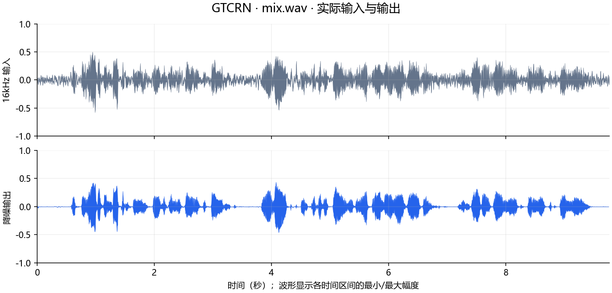
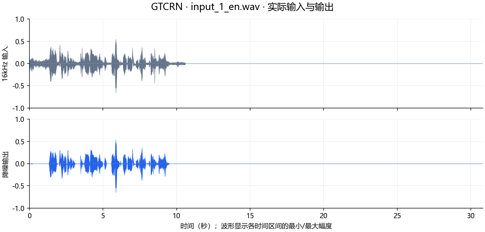
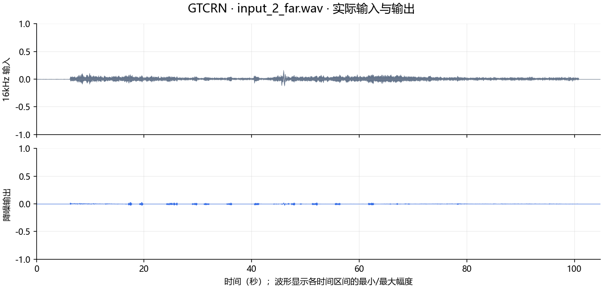
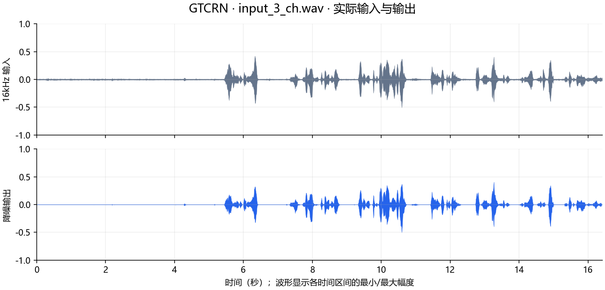
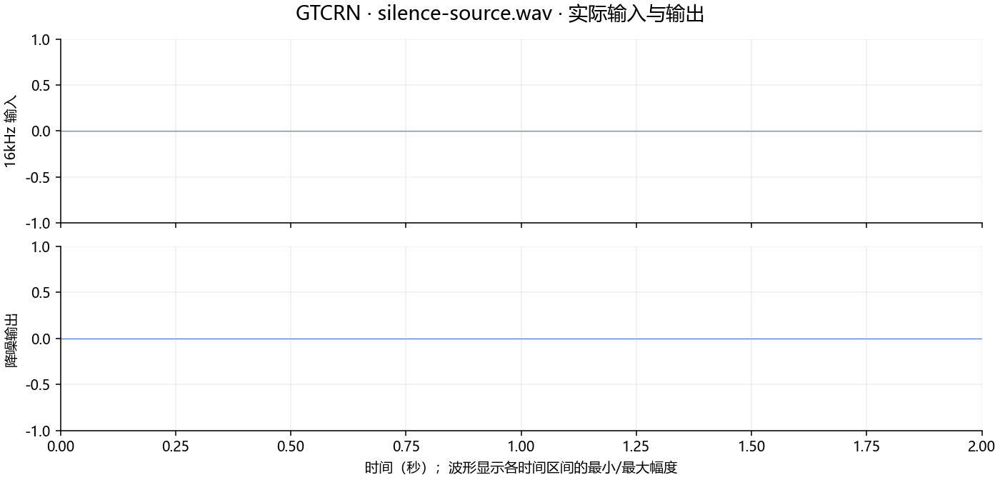

# gtcrn.axera 部署指南

gtcrn.axera 用于语音增强与分离。本页说明 M.2 算力卡的接入条件、部署步骤与结果检查方法。

> 已实测，效果仍需评估。[查看部署效果](#查看部署效果)。

## 准备运行环境

本页效果展示使用 **RK3576 + AX8850 16GB M.2**；其他容量或平台需重新确认模型能否加载并正确运行。

在连接算力卡的 Linux 主机终端执行，RK3576 使用 ARM64 环境。首次部署先完成[驱动与设备检查](../../usage/device-check.md)、[安装 PyAXEngine](../../usage/python.md)和[下载工具安装](../../usage/download-models.md#使用-hugging-face-下载)。已完成这些步骤可直接下载模型。

后文使用设备 0，运行前用 `axcl-smi` 确认设备可用。

## 下载模型与样例

本页使用 `AXERA-TECH/gtcrn.axera` 的固定版本。下面下载本页选用的 8 个文件。

```bash
MODEL_DIR=~/edgeaccel/models/gtcrn-axera/c45728a099cf
mkdir -p "$MODEL_DIR"
~/edgeaccel/hf-env/bin/hf download AXERA-TECH/gtcrn.axera \
  "README.md" \
  "demo_gtcrn_ax.py" \
  "models/gtcrn_650.axmodel" \
  "requirements.txt" \
  "test_wavs/input_1_en.wav" \
  "test_wavs/input_2_far.wav" \
  "test_wavs/input_3_ch.wav" \
  "test_wavs/mix.wav" \
  --revision c45728a099cf257a9b5dcbd44abb1c7842812e86 \
  --local-dir "$MODEL_DIR"
cd "$MODEL_DIR"
```

保留当前终端中的 `MODEL_DIR` 变量，后续命令沿用此目录。下载受阻或需要离线复制时，见[下载方式与文件校验](../../usage/download-models.md)。

## 准备音频处理环境

在 RK3576 主机激活已安装 [PyAXEngine](../../usage/python.md) 的 Python 环境，安装本例使用的音频依赖：

```bash
source ~/edgeaccel/python-env/bin/activate
python -m pip install 'numpy==1.26.4' 'torch==2.5.1' \
  'librosa==0.11.0' 'soundfile==0.13.1' tqdm
python -c "import axengine; print(axengine.get_available_providers())"
```

输出应包含 `AXCLRTExecutionProvider`。下载 [GTCRN 算力卡例程](../../../static/examples/gtcrn_card.py)，保存为 `~/edgeaccel/gtcrn_card.py`。

本例使用 `models/gtcrn_650.axmodel`，主机处理音频频谱，算力卡逐帧执行降噪网络。每帧需要带回 14 组状态，不能把各帧当成互不相关的输入。

## 运行官方音频样例

保持下载步骤中的 `MODEL_DIR`，执行：

```bash
python ~/edgeaccel/gtcrn_card.py \
  --model-dir "$MODEL_DIR" \
  --output ~/edgeaccel/results/gtcrn
```

结果目录需要尚不存在。例程依次处理四份官方音频和两秒静音；每份从空状态运行两遍，记录全部输出及循环状态的重复一致性。

`mix.wav` 为 16kHz，另外三份官方音频为 48kHz，均为单声道。48kHz 音频按官方流程用 librosa 重采样到 16kHz。帧长 512、帧移 256 个采样点，相邻帧间隔 16ms。

## 查看并试听结果

在结果目录中检查以下文件。`<名称>` 对应 `mix`、`input_1_en`、`input_2_far`、`input_3_ch` 或 `silence`。

| 文件 | 用途 |
| --- | --- |
| `<名称>-input.wav` | 16kHz 实际输入的 PCM16 试听副本 |
| `<名称>-output.wav` | 本次降噪输出 |
| `<名称>-repeat.wav` | 重置状态后再次处理的输出 |
| `<名称>-raw.npz` | 处理时的精确浮点输入与输出 |
| `deployment-result.json` | 耗时、帧数、长度差及重复一致性 |

完成标志为 `completed: true`；每份结果应包含 `repeatExact: true`，模型有实际调用记录且数值有限。试听副本使用 PCM16 保存，重采样后的精确浮点值保留在 NPZ 中。

官方逆变换未指定输出长度，末尾不足一个帧移的部分可能被舍去。查看 `tailSamplesOmitted`，本例保留此行为，不通过补零掩盖长度差。

下方耗时包含读文件、必要的重采样、主机前后处理、AXCL 调用、一致性记录和输出保存，不含模型初次加载及第二遍复测。首次重采样还可能包含依赖初始化开销。RTF 小于 1 只说明该次文件处理耗时短于音频时长；麦克风延迟和持续运行需要另行验证。


## 查看部署效果

**已运行，效果仍需评估** · 2026-09-28 · RK3576 + AX8850 16GB M.2。以下输入与输出来自本页固定版本的实际运行。

AX650 权重在算力卡上完成四份官方音频和两秒静音；全部输出与循环状态在重置后复测一致。下方展示本次实际音频和波形。

**mix.wav**

两次原始输出与循环状态一致；官方逆变换舍去末尾 142 个采样点（8.875ms）。 音质尚未完成独立参考评测，请结合下方音频比较语音清晰度、噪声及失真。

<div className="model-effect-gallery">

<figure>

[](../../../static/validation/effects/gtcrn-axera-20260928/mix-waveform.png)

<figcaption>同一幅度范围的输入与输出波形</figcaption>
</figure>

</div>

| 项目 | 本次结果 |
| --- | --- |
| 输入时长 | 9.769 s |
| 单遍完整处理 | 10.135 s |
| 首遍 RTF | 1.037 |
| 第二遍完整处理 | 11.403 s / RTF 1.167 |
| 单遍 NPU 调用 | 611 |
| 输入 / 输出样本数 | 156302 / 156160 |

16kHz 输入 · mix.wav

<audio controls preload="metadata" src="/validation/effects/gtcrn-axera-20260928/mix-input.wav" aria-label="16kHz 输入 · mix.wav"></audio>

[下载音频](../../../static/validation/effects/gtcrn-axera-20260928/mix-input.wav)

本次降噪输出 · mix.wav

<audio controls preload="metadata" src="/validation/effects/gtcrn-axera-20260928/mix-output.wav" aria-label="本次降噪输出 · mix.wav"></audio>

[下载音频](../../../static/validation/effects/gtcrn-axera-20260928/mix-output.wav)

**input_1_en.wav**

两次原始输出与循环状态一致；官方逆变换舍去末尾 63 个采样点（3.938ms）。 音质尚未完成独立参考评测，请结合下方音频比较语音清晰度、噪声及失真。

<div className="model-effect-gallery">

<figure>

[](../../../static/validation/effects/gtcrn-axera-20260928/input_1_en-waveform.png)

<figcaption>同一幅度范围的输入与输出波形</figcaption>
</figure>

</div>

| 项目 | 本次结果 |
| --- | --- |
| 输入时长 | 30.820 s |
| 单遍完整处理 | 91.530 s |
| 首遍 RTF | 2.970 |
| 第二遍完整处理 | 39.079 s / RTF 1.268 |
| 单遍 NPU 调用 | 1927 |
| 输入 / 输出样本数 | 493119 / 493056 |

16kHz 输入 · input_1_en.wav

<audio controls preload="metadata" src="/validation/effects/gtcrn-axera-20260928/input_1_en-input.wav" aria-label="16kHz 输入 · input_1_en.wav"></audio>

[下载音频](../../../static/validation/effects/gtcrn-axera-20260928/input_1_en-input.wav)

本次降噪输出 · input_1_en.wav

<audio controls preload="metadata" src="/validation/effects/gtcrn-axera-20260928/input_1_en-output.wav" aria-label="本次降噪输出 · input_1_en.wav"></audio>

[下载音频](../../../static/validation/effects/gtcrn-axera-20260928/input_1_en-output.wav)

**input_2_far.wav**

两次原始输出与循环状态一致；官方逆变换舍去末尾 111 个采样点（6.938ms）。 音质尚未完成独立参考评测，请结合下方音频比较语音清晰度、噪声及失真。

<div className="model-effect-gallery">

<figure>

[](../../../static/validation/effects/gtcrn-axera-20260928/input_2_far-waveform.png)

<figcaption>同一幅度范围的输入与输出波形</figcaption>
</figure>

</div>

| 项目 | 本次结果 |
| --- | --- |
| 输入时长 | 104.855 s |
| 单遍完整处理 | 144.121 s |
| 首遍 RTF | 1.374 |
| 第二遍完整处理 | 138.124 s / RTF 1.317 |
| 单遍 NPU 调用 | 6554 |
| 输入 / 输出样本数 | 1677679 / 1677568 |

16kHz 输入 · input_2_far.wav

<audio controls preload="metadata" src="/validation/effects/gtcrn-axera-20260928/input_2_far-input.wav" aria-label="16kHz 输入 · input_2_far.wav"></audio>

[下载音频](../../../static/validation/effects/gtcrn-axera-20260928/input_2_far-input.wav)

本次降噪输出 · input_2_far.wav

<audio controls preload="metadata" src="/validation/effects/gtcrn-axera-20260928/input_2_far-output.wav" aria-label="本次降噪输出 · input_2_far.wav"></audio>

[下载音频](../../../static/validation/effects/gtcrn-axera-20260928/input_2_far-output.wav)

**input_3_ch.wav**

两次原始输出与循环状态一致；官方逆变换舍去末尾 64 个采样点（4.000ms）。 音质尚未完成独立参考评测，请结合下方音频比较语音清晰度、噪声及失真。

<div className="model-effect-gallery">

<figure>

[](../../../static/validation/effects/gtcrn-axera-20260928/input_3_ch-waveform.png)

<figcaption>同一幅度范围的输入与输出波形</figcaption>
</figure>

</div>

| 项目 | 本次结果 |
| --- | --- |
| 输入时长 | 16.420 s |
| 单遍完整处理 | 21.728 s |
| 首遍 RTF | 1.323 |
| 第二遍完整处理 | 21.370 s / RTF 1.301 |
| 单遍 NPU 调用 | 1027 |
| 输入 / 输出样本数 | 262720 / 262656 |

16kHz 输入 · input_3_ch.wav

<audio controls preload="metadata" src="/validation/effects/gtcrn-axera-20260928/input_3_ch-input.wav" aria-label="16kHz 输入 · input_3_ch.wav"></audio>

[下载音频](../../../static/validation/effects/gtcrn-axera-20260928/input_3_ch-input.wav)

本次降噪输出 · input_3_ch.wav

<audio controls preload="metadata" src="/validation/effects/gtcrn-axera-20260928/input_3_ch-output.wav" aria-label="本次降噪输出 · input_3_ch.wav"></audio>

[下载音频](../../../static/validation/effects/gtcrn-axera-20260928/input_3_ch-output.wav)

**silence-source.wav**

两次原始输出与循环状态一致；官方逆变换舍去末尾 0 个采样点（0.000ms）。 两秒静音输出全零，模型有实际调用。

<div className="model-effect-gallery">

<figure>

[](../../../static/validation/effects/gtcrn-axera-20260928/silence-waveform.png)

<figcaption>同一幅度范围的输入与输出波形</figcaption>
</figure>

</div>

| 项目 | 本次结果 |
| --- | --- |
| 输入时长 | 2.000 s |
| 单遍完整处理 | 2.402 s |
| 首遍 RTF | 1.201 |
| 第二遍完整处理 | 2.687 s / RTF 1.344 |
| 单遍 NPU 调用 | 126 |
| 输入 / 输出样本数 | 32000 / 32000 |

16kHz 输入 · silence-source.wav

<audio controls preload="metadata" src="/validation/effects/gtcrn-axera-20260928/silence-input.wav" aria-label="16kHz 输入 · silence-source.wav"></audio>

[下载音频](../../../static/validation/effects/gtcrn-axera-20260928/silence-input.wav)

本次降噪输出 · silence-source.wav

<audio controls preload="metadata" src="/validation/effects/gtcrn-axera-20260928/silence-output.wav" aria-label="本次降噪输出 · silence-source.wav"></audio>

[下载音频](../../../static/validation/effects/gtcrn-axera-20260928/silence-output.wav)

**使用时注意：**

- 官方逆变换 length=None，末尾不足一个帧移的部分可能舍去；各样例表格记录真实长度。
- 本次是文件处理，部分样例 RTF 大于 1；不能据此宣称满足实时麦克风延迟。首次重采样可能包含依赖初始化开销。

这些结果用于对照部署后的输出，未覆盖完整数据集精度或长期连续运行。

<details>
<summary>查看样例环境与运行耗时</summary>

环境：RK3576 + AX8850 16GB M.2。日期：2026-09-28。模型版本：`c45728a099cf257a9b5dcbd44abb1c7842812e86`。

| 组件 | 版本或配置 |
| --- | --- |
| 主机 / 内核 | RK3576，约 4GB RAM，6.1.115-vendor-rk35xx |
| AXCL / 驱动 | V3.16.0_20260729180218 |
| 固件 / CMM | V3.16.0 / 15232 MiB |
| Python 推理 | Python 3.12 / PyAXEngine 0.1.3.rc3 / NumPy 1.26.4 / AXCLRTExecutionProvider |

| 指标 | 实测值 | 计时或统计范围 |
| --- | --- | --- |
| mix.wav | 10.135 s / RTF 1.037 | 首遍文件处理，含读文件、重采样、CPU前后处理、AXCL、记录与保存，不含初次加载和第二遍复测。 |
| input_1_en.wav | 91.530 s / RTF 2.970 | 首遍文件处理，含读文件、重采样、CPU前后处理、AXCL、记录与保存，不含初次加载和第二遍复测。 |
| input_2_far.wav | 144.121 s / RTF 1.374 | 首遍文件处理，含读文件、重采样、CPU前后处理、AXCL、记录与保存，不含初次加载和第二遍复测。 |
| input_3_ch.wav | 21.728 s / RTF 1.323 | 首遍文件处理，含读文件、重采样、CPU前后处理、AXCL、记录与保存，不含初次加载和第二遍复测。 |
| silence-source.wav | 2.402 s / RTF 1.201 | 首遍文件处理，含读文件、重采样、CPU前后处理、AXCL、记录与保存，不含初次加载和第二遍复测。 |

适用范围：

- 官方逆变换 length=None，末尾不足一个帧移的部分可能舍去；各样例表格记录真实长度。
- 本次是文件处理，部分样例 RTF 大于 1；不能据此宣称满足实时麦克风延迟。首次重采样可能包含依赖初始化开销。
- 未用纯净参考计算 PESQ/STOI，尚未完成听音评分、长期运行或真实8GB回归。

</details>

遇到加载、内存或后端错误时，按[常见问题](../../usage/troubleshooting.md)处理。需要更换输入或接入业务时，按[检查输出与记录结果](../../reference/validation.md)保留自己的结果。

<details>
<summary>查看文件用途与版本信息</summary>

| 文件 / 目录内路径 | 用途 |
| --- | --- |
| [`demo_gtcrn_ax.py`](https://huggingface.co/AXERA-TECH/gtcrn.axera/blob/c45728a099cf257a9b5dcbd44abb1c7842812e86/demo_gtcrn_ax.py) | Python 程序 / 前后处理 |
| [`models/gtcrn_615.axmodel`](https://huggingface.co/AXERA-TECH/gtcrn.axera/blob/c45728a099cf257a9b5dcbd44abb1c7842812e86/models/gtcrn_615.axmodel) | 编译模型；按目录区分芯片和规格 |
| [`models/gtcrn_630.axmodel`](https://huggingface.co/AXERA-TECH/gtcrn.axera/blob/c45728a099cf257a9b5dcbd44abb1c7842812e86/models/gtcrn_630.axmodel) | 编译模型；按目录区分芯片和规格 |
| [`models/gtcrn_650.axmodel`](https://huggingface.co/AXERA-TECH/gtcrn.axera/blob/c45728a099cf257a9b5dcbd44abb1c7842812e86/models/gtcrn_650.axmodel) | 编译模型；按目录区分芯片和规格 |
| [`requirements.txt`](https://huggingface.co/AXERA-TECH/gtcrn.axera/blob/c45728a099cf257a9b5dcbd44abb1c7842812e86/requirements.txt) | Python 依赖清单 |

仓库提交：`c45728a099cf257a9b5dcbd44abb1c7842812e86`。仓库中的 3 个 `.axmodel` 文件可能包括多个芯片、规格和分片。运行时使用本页指定的配套文件，完整列表见[固定版本目录](https://huggingface.co/AXERA-TECH/gtcrn.axera/tree/c45728a099cf257a9b5dcbd44abb1c7842812e86)。

</details>

## 参考资料

- [常用术语](../../reference/glossary.md)：AXCL、CMM、分词器与推理指标。
- [固定版本文件表](https://huggingface.co/AXERA-TECH/gtcrn.axera/tree/c45728a099cf257a9b5dcbd44abb1c7842812e86)。
- [模型卡 / 使用说明](https://huggingface.co/AXERA-TECH/gtcrn.axera/blob/c45728a099cf257a9b5dcbd44abb1c7842812e86/README.md)。
- [主要程序入口：demo_gtcrn_ax.py](https://huggingface.co/AXERA-TECH/gtcrn.axera/blob/c45728a099cf257a9b5dcbd44abb1c7842812e86/demo_gtcrn_ax.py)。
- [ModelScope 对应资源](https://modelscope.cn/models/AXERA-TECH/gtcrn.axera)。不同平台的 revision 不通用，另行记录版本。

返回[完整模型目录](../catalog.mdx)。
