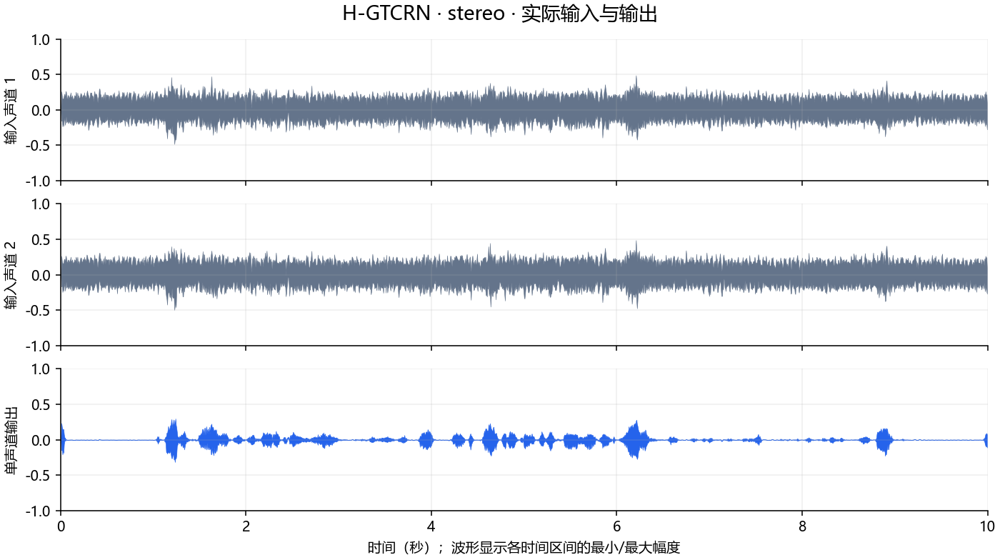
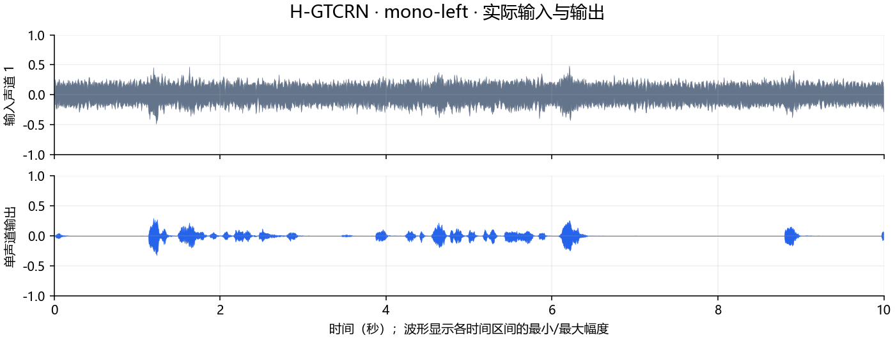
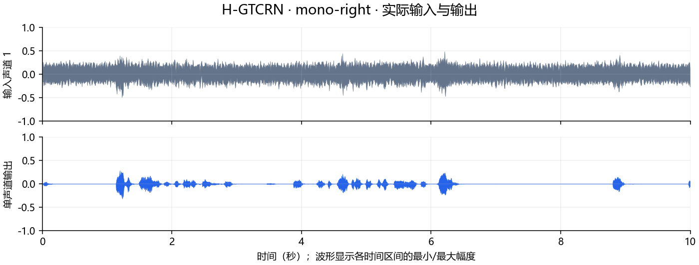
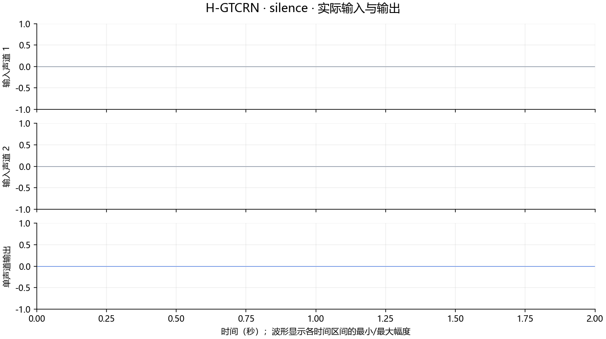

# H-GTCRN.AXERA 部署指南

H-GTCRN.AXERA 用于语音增强与分离。本页说明 M.2 算力卡的接入条件、部署步骤与结果检查方法。

> 已实测，效果仍需评估。[查看部署效果](#查看部署效果)。

## 准备运行环境

本页效果展示使用 **RK3576 + AX8850 16GB M.2**；其他容量或平台需重新确认模型能否加载并正确运行。

在连接算力卡的 Linux 主机终端执行，RK3576 使用 ARM64 环境。首次部署先完成[驱动与设备检查](../../usage/device-check.md)、[安装 PyAXEngine](../../usage/python.md)和[下载工具安装](../../usage/download-models.md#使用-hugging-face-下载)。已完成这些步骤可直接下载模型。

后文使用设备 0，运行前用 `axcl-smi` 确认设备可用。

## 下载模型与样例

本页使用 `AXERA-TECH/H-GTCRN.AXERA` 的固定版本。下面下载本页选用的 15 个文件。

```bash
MODEL_DIR=~/edgeaccel/models/h-gtcrn-axera/283b7b78328c
mkdir -p "$MODEL_DIR"
~/edgeaccel/hf-env/bin/hf download AXERA-TECH/H-GTCRN.AXERA \
  "README.md" \
  "models/model.axmodel" \
  "models/model_meta.json" \
  "python/audio_demo.py" \
  "python/h_gtcrn_core_sdk/README.md" \
  "python/h_gtcrn_core_sdk/__init__.py" \
  "python/h_gtcrn_core_sdk/example.py" \
  "python/h_gtcrn_core_sdk/inference.py" \
  "python/h_gtcrn_core_sdk/postprocess.py" \
  "python/h_gtcrn_core_sdk/preprocess.py" \
  "python/h_gtcrn_core_sdk/requirements.txt" \
  "python/requirements.txt" \
  "samples/Samples1_board_enhanced.wav" \
  "samples/Samples1_core_ref_enhanced.wav" \
  "samples/Samples1_noisy.wav" \
  --revision 283b7b78328c10dc05cdae6fe96d30d16d8317c8 \
  --local-dir "$MODEL_DIR"
cd "$MODEL_DIR"
```

保留当前终端中的 `MODEL_DIR` 变量，后续命令沿用此目录。下载受阻或需要离线复制时，见[下载方式与文件校验](../../usage/download-models.md)。

## 准备离线音频增强例程

在 RK3576 主机激活已安装 [PyAXEngine](../../usage/python.md) 的环境，确认算力卡后端可用：

```bash
source ~/edgeaccel/python-env/bin/activate
python -m pip install 'numpy==1.26.4'
python -c "import axengine; print(axengine.get_available_providers())"
```

输出应包含 `AXCLRTExecutionProvider`。下载 [H-GTCRN 算力卡例程](../../../static/examples/hgtcrn_card.py)，保存为 `~/edgeaccel/hgtcrn_card.py`。

H-GTCRN 使用主机完成去混响、声源分离和频谱处理，算力卡执行神经网络。它按整段音频计算，属于离线处理。输入为 16kHz PCM16 单声道或双声道 WAV，每段不超过 10 秒；单声道在内部复制为双通道。

## 运行音频增强

保持下载步骤中的 `MODEL_DIR`，执行：

```bash
python ~/edgeaccel/hgtcrn_card.py \
  --model-dir "$MODEL_DIR" \
  --output ~/edgeaccel/results/hgtcrn
```

结果目录需要尚不存在。例程运行官方双声道样例、由其左右声道分别生成的单声道样例，以及两秒静音。每种输入均重复处理，检查特征、模型输出和最终音频是否一致。

例程使用 AXCL 后端，并为去混响计算加入零能量保护；正常样例与原始流程的输出也会进行一致性核对。其余特征构造、掩码应用和逆变换沿用官方代码。

## 试听并核对输出

结果目录中的 `stereo`、`mono-left`、`mono-right`、`silence` 分别对应四种输入：

| 文件 | 内容 |
| --- | --- |
| `<名称>-input.wav` | 本次输入 |
| `<名称>-output.wav` | 算力卡处理后的单声道输出 |
| `<名称>-repeat.wav` | 第二次运行输出 |
| `<名称>-raw.npz` | 保存前的浮点音频 |
| `deployment-result.json` | 输出长度、耗时、一致性和参考对比 |

完成标志为 `completed: true`，各样例 `repeatExact: true`，输出数值有限且长度与输入相同。静音样例也会执行神经网络。

下方同时提供实际输入和输出。双声道样例与仓库附带的 ONNX、AX650 输出按采样点直接比较；相似度用于核对部署流程，不能当作降噪质量评分。

完整耗时包含主机去混响、分离、前后处理和文件保存，模型加载单独记录。即使 RTF 小于 1，也不能将整段离线算法视为低延迟流式处理。


## 查看部署效果

**已运行，效果仍需评估** · RK3576 + AX8850 16GB M.2。以下输入与输出来自本页固定版本的实际运行。

官方双声道、单声道与静音样例均完成运行。与两份官方附带输出存在差异，离线调整整体增益后仍有明显残差，不能用单一音量缩放解释；音质验证仍待完成。

**官方双声道音频**

两次特征、NPU 输出和最终音频一致，输出长度与输入相同。 加入零能量保护后，本样例与未修改的官方流程输出逐项一致；与仓库附带参考音频仍有差异，参考一致性尚未通过。 进一步比较同一 PCM 时间轴：互相关最大值对应零偏移；对本卡输出拟合一个整体增益后，相对附带参考的残差 RMS 仍为 28.35%（board）和 71.09%（core_ref）。差异不能只用整体音量缩放解释。这是输出一致性检查，附带增强音频不是纯净语音标注，残差比例也不是音质分数。

<div className="model-effect-gallery">

<figure>

[](../../../static/validation/effects/h-gtcrn-axera-20260928/stereo-waveform.png)

<figcaption>原始各声道与增强输出波形</figcaption>
</figure>

</div>

| 项目 | 本次结果 |
| --- | --- |
| 输入声道 / 样本数 | 2 / 160000 |
| 完整处理 | 2.050 s |
| RTF | 0.205 |
| 单遍 NPU 调用 | 1 |

| 仓库参考输出 | PCM 余弦相似度 | 平均绝对差 |
| --- | --- | --- |
| Samples1_core_ref_enhanced.wav | 0.703278 | 0.05017537 |
| Samples1_board_enhanced.wav | 0.958973 | 0.00469796 |

| 附带参考 | 本卡输出的拟合增益 | 缩放后残差 RMS / 参考 RMS |
| --- | --- | --- |
| Samples1_board_enhanced.wav | 0.963785 | 28.35% |
| Samples1_core_ref_enhanced.wav | 2.010831 | 71.09% |

实际输入 · 官方双声道音频

<audio controls preload="metadata" src="/validation/effects/h-gtcrn-axera-20260928/stereo-input.wav" aria-label="实际输入 · 官方双声道音频"></audio>

[下载音频](../../../static/validation/effects/h-gtcrn-axera-20260928/stereo-input.wav)

本次输出 · 官方双声道音频

<audio controls preload="metadata" src="/validation/effects/h-gtcrn-axera-20260928/stereo-output.wav" aria-label="本次输出 · 官方双声道音频"></audio>

[下载音频](../../../static/validation/effects/h-gtcrn-axera-20260928/stereo-output.wav)

**原样例左声道**

两次特征、NPU 输出和最终音频一致，输出长度与输入相同。

<div className="model-effect-gallery">

<figure>

[](../../../static/validation/effects/h-gtcrn-axera-20260928/mono-left-waveform.png)

<figcaption>原始各声道与增强输出波形</figcaption>
</figure>

</div>

| 项目 | 本次结果 |
| --- | --- |
| 输入声道 / 样本数 | 1 / 160000 |
| 完整处理 | 2.115 s |
| RTF | 0.212 |
| 单遍 NPU 调用 | 1 |

实际输入 · 原样例左声道

<audio controls preload="metadata" src="/validation/effects/h-gtcrn-axera-20260928/mono-left-input.wav" aria-label="实际输入 · 原样例左声道"></audio>

[下载音频](../../../static/validation/effects/h-gtcrn-axera-20260928/mono-left-input.wav)

本次输出 · 原样例左声道

<audio controls preload="metadata" src="/validation/effects/h-gtcrn-axera-20260928/mono-left-output.wav" aria-label="本次输出 · 原样例左声道"></audio>

[下载音频](../../../static/validation/effects/h-gtcrn-axera-20260928/mono-left-output.wav)

**原样例右声道**

两次特征、NPU 输出和最终音频一致，输出长度与输入相同。

<div className="model-effect-gallery">

<figure>

[](../../../static/validation/effects/h-gtcrn-axera-20260928/mono-right-waveform.png)

<figcaption>原始各声道与增强输出波形</figcaption>
</figure>

</div>

| 项目 | 本次结果 |
| --- | --- |
| 输入声道 / 样本数 | 1 / 160000 |
| 完整处理 | 2.048 s |
| RTF | 0.205 |
| 单遍 NPU 调用 | 1 |

实际输入 · 原样例右声道

<audio controls preload="metadata" src="/validation/effects/h-gtcrn-axera-20260928/mono-right-input.wav" aria-label="实际输入 · 原样例右声道"></audio>

[下载音频](../../../static/validation/effects/h-gtcrn-axera-20260928/mono-right-input.wav)

本次输出 · 原样例右声道

<audio controls preload="metadata" src="/validation/effects/h-gtcrn-axera-20260928/mono-right-output.wav" aria-label="本次输出 · 原样例右声道"></audio>

[下载音频](../../../static/validation/effects/h-gtcrn-axera-20260928/mono-right-output.wav)

**两秒双声道静音**

两次特征、NPU 输出和最终音频一致，输出长度与输入相同。 静音实际调用模型，输出保持全零。

<div className="model-effect-gallery">

<figure>

[](../../../static/validation/effects/h-gtcrn-axera-20260928/silence-waveform.png)

<figcaption>原始各声道与增强输出波形</figcaption>
</figure>

</div>

| 项目 | 本次结果 |
| --- | --- |
| 输入声道 / 样本数 | 2 / 32000 |
| 完整处理 | 1.985 s |
| RTF | 0.993 |
| 单遍 NPU 调用 | 1 |

实际输入 · 两秒双声道静音

<audio controls preload="metadata" src="/validation/effects/h-gtcrn-axera-20260928/silence-input.wav" aria-label="实际输入 · 两秒双声道静音"></audio>

[下载音频](../../../static/validation/effects/h-gtcrn-axera-20260928/silence-input.wav)

本次输出 · 两秒双声道静音

<audio controls preload="metadata" src="/validation/effects/h-gtcrn-axera-20260928/silence-output.wav" aria-label="本次输出 · 两秒双声道静音"></audio>

[下载音频](../../../static/validation/effects/h-gtcrn-axera-20260928/silence-output.wav)

**使用时注意：**

- 本模型按整段执行去混响和分离，不是低延迟流式算法；每段输入限制为10秒。
- 与仓库 ONNX 参考音频余弦相似度约0.703，与附带板端输出约0.959；参考一致性尚未通过，不能直接沿用上游质量指标。

这些结果用于对照部署后的输出，未覆盖完整数据集精度或长期连续运行。

<details>
<summary>查看样例环境与运行耗时</summary>

环境：RK3576 + AX8850 16GB M.2。模型版本：`283b7b78328c10dc05cdae6fe96d30d16d8317c8`。

| 组件 | 版本或配置 |
| --- | --- |
| 主机 / 内核 | RK3576，约 4GB RAM，6.1.115-vendor-rk35xx |
| AXCL / 驱动 | V3.16.0_20260729180218 |
| 固件 / CMM | V3.16.0 / 15232 MiB |
| Python 推理 | Python 3.12 / PyAXEngine 0.1.3.rc3 / NumPy 1.26.4 / AXCLRTExecutionProvider |

| 指标 | 实测值 | 计时或统计范围 |
| --- | --- | --- |
| 官方双声道音频 | 2.050 s / RTF 0.205 | 整段主机处理、AXCL、记录及保存，不含模型加载和第二遍复测。 |
| 原样例左声道 | 2.115 s / RTF 0.212 | 整段主机处理、AXCL、记录及保存，不含模型加载和第二遍复测。 |
| 原样例右声道 | 2.048 s / RTF 0.205 | 整段主机处理、AXCL、记录及保存，不含模型加载和第二遍复测。 |
| 两秒双声道静音 | 1.985 s / RTF 0.993 | 整段主机处理、AXCL、记录及保存，不含模型加载和第二遍复测。 |

适用范围：

- 未完成纯净参考音质评估、连续分片接缝、长期运行及真实8GB回归。

</details>

遇到加载、内存或后端错误时，按[常见问题](../../usage/troubleshooting.md)处理。需要更换输入或接入业务时，按[检查输出与记录结果](../../reference/validation.md)保留自己的结果。

<details>
<summary>查看文件用途与版本信息</summary>

| 文件 / 目录内路径 | 用途 |
| --- | --- |
| [`python/audio_demo.py`](https://huggingface.co/AXERA-TECH/H-GTCRN.AXERA/blob/283b7b78328c10dc05cdae6fe96d30d16d8317c8/python/audio_demo.py) | Python 程序 / 前后处理 |
| [`models/model.axmodel`](https://huggingface.co/AXERA-TECH/H-GTCRN.AXERA/blob/283b7b78328c10dc05cdae6fe96d30d16d8317c8/models/model.axmodel) | 编译模型；按目录区分芯片和规格 |
| [`config.json`](https://huggingface.co/AXERA-TECH/H-GTCRN.AXERA/blob/283b7b78328c10dc05cdae6fe96d30d16d8317c8/config.json) | 运行配置 |
| [`python/h_gtcrn_core_sdk/requirements.txt`](https://huggingface.co/AXERA-TECH/H-GTCRN.AXERA/blob/283b7b78328c10dc05cdae6fe96d30d16d8317c8/python/h_gtcrn_core_sdk/requirements.txt) | Python 依赖清单 |
| [`python/requirements.txt`](https://huggingface.co/AXERA-TECH/H-GTCRN.AXERA/blob/283b7b78328c10dc05cdae6fe96d30d16d8317c8/python/requirements.txt) | Python 依赖清单 |
| [`requirements.txt`](https://huggingface.co/AXERA-TECH/H-GTCRN.AXERA/blob/283b7b78328c10dc05cdae6fe96d30d16d8317c8/requirements.txt) | Python 依赖清单 |
| [`run.sh`](https://huggingface.co/AXERA-TECH/H-GTCRN.AXERA/blob/283b7b78328c10dc05cdae6fe96d30d16d8317c8/run.sh) | 启动或构建脚本 |
| [`run_cpp_ax650.sh`](https://huggingface.co/AXERA-TECH/H-GTCRN.AXERA/blob/283b7b78328c10dc05cdae6fe96d30d16d8317c8/run_cpp_ax650.sh) | 启动或构建脚本 |

仓库提交：`283b7b78328c10dc05cdae6fe96d30d16d8317c8`。仓库中的 1 个 `.axmodel` 文件可能包括多个芯片、规格和分片。运行时使用本页指定的配套文件，完整列表见[固定版本目录](https://huggingface.co/AXERA-TECH/H-GTCRN.AXERA/tree/283b7b78328c10dc05cdae6fe96d30d16d8317c8)。

</details>

<details>
<summary>补充说明与版本差异</summary>

- 按模型前端的采样率、窗长和循环状态处理连续音频；先测短文件，再验证实时分块不丢样。

</details>

## 参考资料

- [常用术语](../../reference/glossary.md)：AXCL、CMM、分词器与推理指标。
- [固定版本文件表](https://huggingface.co/AXERA-TECH/H-GTCRN.AXERA/tree/283b7b78328c10dc05cdae6fe96d30d16d8317c8)。
- [模型卡 / 使用说明](https://huggingface.co/AXERA-TECH/H-GTCRN.AXERA/blob/283b7b78328c10dc05cdae6fe96d30d16d8317c8/README.md)。
- [主要程序入口：python/audio_demo.py](https://huggingface.co/AXERA-TECH/H-GTCRN.AXERA/blob/283b7b78328c10dc05cdae6fe96d30d16d8317c8/python/audio_demo.py)。

返回[完整模型目录](../catalog.mdx)。
