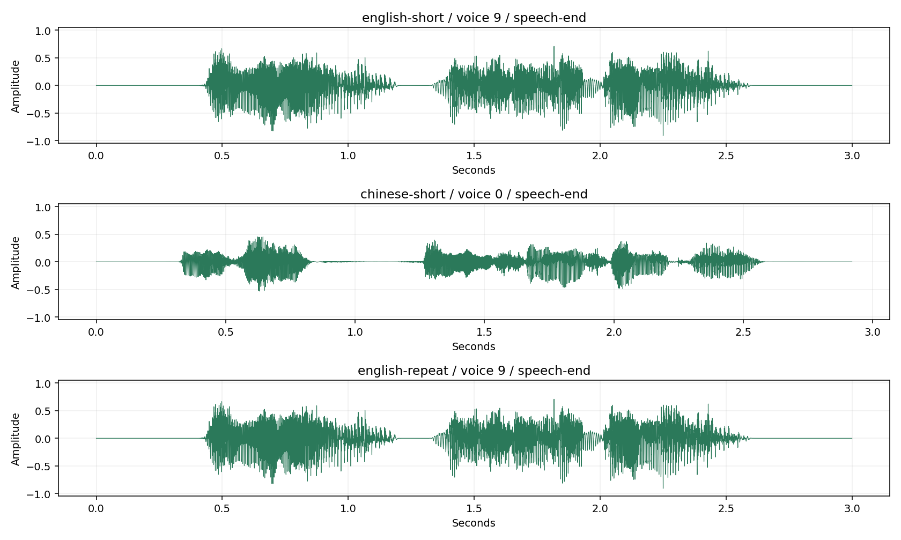

# Hojo-TTS-Light 部署指南

Hojo-TTS-Light 用于语音合成。本页说明 M.2 算力卡的接入条件、部署步骤与结果检查方法。

> 已实测，效果仍需评估。[查看部署效果](#查看部署效果)。

## 准备运行环境

本页效果展示使用 **RK3576 + AX8850 16GB M.2**；其他容量或平台需重新确认模型能否加载并正确运行。

在连接算力卡的 Linux 主机终端执行，RK3576 使用 ARM64 环境。首次部署先完成[驱动与设备检查](../../usage/device-check.md)、[安装 PyAXEngine](../../usage/python.md)和[下载工具安装](../../usage/download-models.md#使用-hugging-face-下载)。已完成这些步骤可直接下载模型。

后文使用设备 0，运行前用 `axcl-smi` 确认设备可用。

## 下载模型与样例

本页使用 `AXERA-TECH/Hojo-TTS-Light` 的固定版本。下面下载本页选用的 27 个文件。

```bash
MODEL_DIR=~/edgeaccel/models/hojo-tts-light/cee17e0534ba
mkdir -p "$MODEL_DIR"
~/edgeaccel/hf-env/bin/hf download AXERA-TECH/Hojo-TTS-Light \
  --include "models/*" "README.md" \
  --revision cee17e0534ba216649d82055a326b995b6cf35c4 \
  --local-dir "$MODEL_DIR"
cd "$MODEL_DIR"
```

保留当前终端中的 `MODEL_DIR` 变量，后续命令沿用此目录。下载受阻或需要离线复制时，见[下载方式与文件校验](../../usage/download-models.md)。

## 安装运行依赖

本页在 RK3576 主机上通过 AXCL 调用 AX8850 16GB M.2 算力卡，完成中文、英文短句合成。十层语言模型、输出层、细节生成网络和声码器共 13 个 AXMODEL 在算力卡上运行；文本处理和音频重建在主机 CPU 上执行。

保留上方下载得到的 `$MODEL_DIR`，在 RK3576 主机执行：

```bash
source ~/edgeaccel/python-env/bin/activate
python -m pip install 'numpy==1.26.4' 'ml_dtypes==0.5.3' 'tokenizers==0.21.4'
python -c "import axengine; print(axengine.get_available_providers())"
```

输出须包含 `AXCLRTExecutionProvider`。本页示例不依赖 PyTorch 或网络分词服务。

## 检查配套文件

| 文件 | 用途 |
| --- | --- |
| `models/lm_s8/qwen3_p8_l0_together.axmodel` 至 `qwen3_p8_l9_together.axmodel` | 十层语言模型 |
| `models/lm_s8/qwen3_post.axmodel` | 预测语音 token |
| `models/fine_local.axmodel` | 生成音频细节 |
| `models/decoder_sq.axmodel` | 生成幅度与相位频谱 |
| `models/Hojo-TTS-Light-40M-voice.npz` | 文本嵌入与 15 组音色参数 |
| `models/tokenizer.json`、`models/id2code.bin` | 分词与语音 token 映射 |
| `models/lm_s8/embed_tokens.bin` | 嵌入表校验 |

本例使用模型实际返回的解码接口：KV 历史容量为 2047 行。保留整套固定版本文件，不混用其他提交的模型或词表。

## 合成中文和英文

下载 [Hojo 算力卡示例包](../../../static/examples/hojo-card-example.zip)，保存到 `~/edgeaccel/` 后执行：

```bash
mkdir -p ~/edgeaccel/hojo-example
unzip ~/edgeaccel/hojo-card-example.zip -d ~/edgeaccel/hojo-example
python ~/edgeaccel/hojo-example/hojo_card.py \
  --model-dir "$MODEL_DIR" \
  --output ~/edgeaccel/results/hojo-01
```

输出目录须尚不存在。程序依次合成英文短句、中文短句和英文重复样例，每组生成 `output.wav`、浮点音频和调用记录。

| 输入目录 | 文本 | 音色索引 |
| --- | --- | --- |
| `english-short` | Hello, this is a demo. | 9 |
| `chinese-short` | 你好，欢迎使用算力卡。 | 0 |
| `english-repeat` | Hello, this is a demo. | 9 |

打开结果目录中的 `deployment-result.json`：`completed` 为 `true` 表示本组运行完成；各样例的 `stopReason` 为 `speech-end` 表示模型输出了语音结束标记。若为 `token-limit`，则已达到生成上限，不能据此判断文本已完整读出。

音频为 24 kHz、单声道、PCM16。可将 WAV 复制到桌面主机播放，或在已配置音频输出的 Linux 主机执行：

```bash
aplay ~/edgeaccel/results/hojo-01/chinese-short/output.wav
```

## 输入自己的短句

`--voice` 取值为 0～14；本页实测索引 0 和 9。将下面的文本替换为需要合成的内容，并使用新的输出目录：

```bash
python ~/edgeaccel/hojo-example/hojo_card.py \
  --model-dir "$MODEL_DIR" \
  --text '你好，欢迎使用算力卡。' \
  --voice 0 \
  --max-new-tokens 256 \
  --output ~/edgeaccel/results/hojo-custom-01
```

自定义结果位于 `custom/output.wav`。本例采用确定性贪心解码，最近 20 个输出 token 使用 1.1 的重复惩罚；未使用仓库默认的温度采样。`--max-new-tokens` 默认 256，允许 1～512。长文本应先分句，并检查每句结束标记和实际音频；增加长度上限不等于改善发音质量。

## 查看结果和耗时

下方音频均由本次算力卡运行生成。三组都输出了结束标记；重复英文样例的网络输入输出与 WAV 完全一致。

流程耗时包含逐 token 解码、细节生成、声码器、CPU 音频重建、原始张量保存和 WAV 写入，不含权重加载、分词与提示嵌入构造。AXCL 耗时累计各网络的 Python `run` 调用；本例保留详细证据，不能将其当作经过优化的语音服务吞吐。

本次完成基本运行与数据流复核，尚未验收发音准确率、音色自然度、长文本表现或实际 8GB 卡容量。


## 查看部署效果

**已运行，效果仍需评估** · RK3576 + AX8850 16GB M.2。以下输入与输出来自本页固定版本的实际运行。

中英文短句与一次英文重复音频均完成主机 ASR 辅助对照，文字内容对应。当前仅核对短句可识别内容，其他音色、长文本、自然度和输入边界仍待验证。

**合成中文和英文短句**

以下两段音频由本次 RK3576 + AX8850 16GB 算力卡生成。英文使用音色索引9，中文使用索引0；两组都正常输出语音结束标记，未达到256 token上限。 下面使用独立 Whisper-base 在主机 CPU 上识别本页实际生成的 WAV，不向识别器提供目标文字。转写可能包含同音字、繁简体和识别器自身误差，用于定位复听位置，不是人工听审或语音合成准确率。

| 文本 | 音色索引 | 时长 / s | 生成token（含结束标记） | 停止原因 |
| --- | --- | --- | --- | --- |
| Hello, this is a demo. | 9 | 3.000 | 151 | speech-end |
| 你好，欢迎使用算力卡。 | 0 | 2.920 | 147 | speech-end |

| 合成输入文字 | 实际音频的 ASR 辅助转写 | 核对说明 |
| --- | --- | --- |
| Hello, this is a demo. | Hello, this is a demo. | 英文词语对应。 |
| 你好，欢迎使用算力卡。 | 你好,歡迎使用算力卡。 | 繁简体与标点不同，句子内容对应。 |

Hello, this is a demo.（音色9）

<audio controls preload="metadata" src="/validation/effects/hojo-tts-light-20260928/english-short.wav" aria-label="Hello, this is a demo.（音色9）"></audio>

[下载音频](../../../static/validation/effects/hojo-tts-light-20260928/english-short.wav)

你好，欢迎使用算力卡。（音色0）

<audio controls preload="metadata" src="/validation/effects/hojo-tts-light-20260928/chinese-short.wav" aria-label="你好，欢迎使用算力卡。（音色0）"></audio>

[下载音频](../../../static/validation/effects/hojo-tts-light-20260928/chinese-short.wav)

**核对重复输入**

在中文样例之后重新输入同一句英文。13个网络的全部输入输出校验值、生成token序列与WAV一致。重复性检查不代表发音或自然度验收。 下面使用独立 Whisper-base 在主机 CPU 上识别本页实际生成的 WAV，不向识别器提供目标文字。转写可能包含同音字、繁简体和识别器自身误差，用于定位复听位置，不是人工听审或语音合成准确率。

| 项目 | 本次结果 |
| --- | --- |
| 网络输入输出 | 完全一致 |
| 生成token与WAV | 完全一致 |
| 音频格式 | 24 kHz / 单声道 / PCM16 |
| 发生PCM裁剪的采样点 | 0 |

| 合成输入文字 | 实际音频的 ASR 辅助转写 | 核对说明 |
| --- | --- | --- |
| Hello, this is a demo. | Hello, this is a demo. | 与首次相同音频和转写；仅用于重复对照。 |

Hello, this is a demo.（音色9）

<audio controls preload="metadata" src="/validation/effects/hojo-tts-light-20260928/english-repeat.wav" aria-label="Hello, this is a demo.（音色9）"></audio>

[下载音频](../../../static/validation/effects/hojo-tts-light-20260928/english-repeat.wav)

**查看实际波形**

波形来自以上三段实际生成音频，用于观察幅度与时序。语言模型、细节生成与声码器在算力卡执行，分词和频谱还原在主机CPU执行。

<div className="model-effect-gallery">

<figure>

[](../../../static/validation/effects/hojo-tts-light-20260928/waveforms.png)

<figcaption>中文、英文与英文重复样例的实际波形</figcaption>
</figure>

</div>

**比较合成耗时**

流程耗时包含解码、声码器、CPU音频重建、张量保存与WAV写入，不含权重加载、分词和提示嵌入构造。AXCL列累计网络run调用；这组带详细证据保存的数据不等于优化后的服务性能。

| 输入 | AXCL调用 | AXCL合计 / ms | 含证据保存流程 / s | 音频 / s |
| --- | --- | --- | --- | --- |
| english-short | 2003 | 18401.217 | 36.042 | 3.000 |
| chinese-short | 1929 | 17468.243 | 29.690 | 2.920 |
| english-repeat | 2003 | 17552.625 | 30.023 | 3.000 |

**使用时注意：**

- 仅实测音色0和9及本页短句；其他音色、长文本与温度采样另行验证。
- 独立复核覆盖KV缓存、网络数据流与音频还原，未完成浮点原模型对照、ASR字错率或人工听感评分，仅计基础部署通过。

这些结果用于对照部署后的输出，未覆盖完整数据集精度或长期连续运行。

<details>
<summary>查看样例环境与运行耗时</summary>

环境：RK3576 + AX8850 16GB M.2。模型版本：`cee17e0534ba216649d82055a326b995b6cf35c4`。

| 组件 | 版本或配置 |
| --- | --- |
| 主机 / 内核 | RK3576，约 4GB RAM，6.1.115-vendor-rk35xx |
| AXCL / 驱动 | V3.16.0_20260729180218 |
| 固件 / CMM | V3.16.0 / 15232 MiB |
| Python 推理 | Python 3.12 / PyAXEngine 0.1.3.rc3 / NumPy 1.26.4 / AXCLRTExecutionProvider |

| 指标 | 实测值 | 计时或统计范围 |
| --- | --- | --- |
| 实际音频 | 3段 | 英文3.000秒、中文2.920秒、英文重复3.000秒，均正常输出语音结束标记。 |
| 算力卡调用 | 5935次 | 13个AXMODEL，CPU负责分词和音频重建。 |
| 重复性 | 输入输出与WAV一致 | 同一进程中先英文、再中文、再重复英文。 |

适用范围：

- 结果来自AX8850 16GB，实际8GB卡仍需容量和稳定性回归。
- 本次 Whisper-base 主机转写仅辅助核对内容，不代替人工听审、发音与自然度评测。

</details>

遇到加载、内存或后端错误时，按[常见问题](../../usage/troubleshooting.md)处理。需要更换输入或接入业务时，按[检查输出与记录结果](../../reference/validation.md)保留自己的结果。

<details>
<summary>查看文件用途与版本信息</summary>

| 文件 / 目录内路径 | 用途 |
| --- | --- |
| [`models/decoder_sq.axmodel`](https://huggingface.co/AXERA-TECH/Hojo-TTS-Light/blob/cee17e0534ba216649d82055a326b995b6cf35c4/models/decoder_sq.axmodel) | 编译模型；按目录区分芯片和规格 |
| [`models/fine_local.axmodel`](https://huggingface.co/AXERA-TECH/Hojo-TTS-Light/blob/cee17e0534ba216649d82055a326b995b6cf35c4/models/fine_local.axmodel) | 编译模型；按目录区分芯片和规格 |
| [`models/lm_s8/qwen3_p8_l0_together.axmodel`](https://huggingface.co/AXERA-TECH/Hojo-TTS-Light/blob/cee17e0534ba216649d82055a326b995b6cf35c4/models/lm_s8/qwen3_p8_l0_together.axmodel) | 编译模型；按目录区分芯片和规格 |
| [`models/lm_s8/qwen3_p8_l1_together.axmodel`](https://huggingface.co/AXERA-TECH/Hojo-TTS-Light/blob/cee17e0534ba216649d82055a326b995b6cf35c4/models/lm_s8/qwen3_p8_l1_together.axmodel) | 编译模型；按目录区分芯片和规格 |
| [`models/lm_s8/qwen3_p8_l2_together.axmodel`](https://huggingface.co/AXERA-TECH/Hojo-TTS-Light/blob/cee17e0534ba216649d82055a326b995b6cf35c4/models/lm_s8/qwen3_p8_l2_together.axmodel) | 编译模型；按目录区分芯片和规格 |
| [`config.json`](https://huggingface.co/AXERA-TECH/Hojo-TTS-Light/blob/cee17e0534ba216649d82055a326b995b6cf35c4/config.json) | 运行配置 |
| [`models/lm_s8/post_config.json`](https://huggingface.co/AXERA-TECH/Hojo-TTS-Light/blob/cee17e0534ba216649d82055a326b995b6cf35c4/models/lm_s8/post_config.json) | 运行配置 |
| [`models/lm_s8/tokenizer_config.json`](https://huggingface.co/AXERA-TECH/Hojo-TTS-Light/blob/cee17e0534ba216649d82055a326b995b6cf35c4/models/lm_s8/tokenizer_config.json) | 运行配置 |
| [`models/tokenizer_config.json`](https://huggingface.co/AXERA-TECH/Hojo-TTS-Light/blob/cee17e0534ba216649d82055a326b995b6cf35c4/models/tokenizer_config.json) | 运行配置 |

仓库提交：`cee17e0534ba216649d82055a326b995b6cf35c4`。仓库中的 13 个 `.axmodel` 文件可能包括多个芯片、规格和分片。运行时使用本页指定的配套文件，完整列表见[固定版本目录](https://huggingface.co/AXERA-TECH/Hojo-TTS-Light/tree/cee17e0534ba216649d82055a326b995b6cf35c4)。

</details>

## 参考资料

- [常用术语](../../reference/glossary.md)：AXCL、CMM、分词器与推理指标。
- [固定版本文件表](https://huggingface.co/AXERA-TECH/Hojo-TTS-Light/tree/cee17e0534ba216649d82055a326b995b6cf35c4)。
- [模型卡 / 使用说明](https://huggingface.co/AXERA-TECH/Hojo-TTS-Light/blob/cee17e0534ba216649d82055a326b995b6cf35c4/README.md)。

返回[完整模型目录](../catalog.mdx)。
