# IGEV-plusplus 部署指南

IGEV-plusplus 用于深度估计。本页说明 M.2 算力卡的接入条件、部署步骤与结果检查方法。

> 已实测，效果仍需评估。[查看部署效果](#查看部署效果)。

## 准备运行环境

本页效果展示使用 **RK3576 + AX8850 16GB M.2**；其他容量或平台需重新确认模型能否加载并正确运行。

在连接算力卡的 Linux 主机终端执行，RK3576 使用 ARM64 环境。首次部署先完成[驱动与设备检查](../../usage/device-check.md)、[安装 PyAXEngine](../../usage/python.md)和[下载工具安装](../../usage/download-models.md#使用-hugging-face-下载)。已完成这些步骤可直接下载模型。

后文使用设备 0，运行前用 `axcl-smi` 确认设备可用。

## 下载模型与样例

本页使用 `AXERA-TECH/IGEV-plusplus` 的固定版本。下面下载本页选用的 18 个文件。

```bash
MODEL_DIR=~/edgeaccel/models/igev-plusplus/b5e505fcaeae
mkdir -p "$MODEL_DIR"
~/edgeaccel/hf-env/bin/hf download AXERA-TECH/IGEV-plusplus \
  "README.md" \
  "demo-imgs/Adirondack/im0.png" \
  "demo-imgs/Adirondack/im1.png" \
  "demo-imgs/Backpack/im0.png" \
  "demo-imgs/Backpack/im1.png" \
  "demo-imgs/Cable/im0.png" \
  "demo-imgs/Cable/im1.png" \
  "demo-imgs/Classroom/im0.png" \
  "demo-imgs/Classroom/im1.png" \
  "demo-imgs/PipesH/im0.png" \
  "demo-imgs/PipesH/im1.png" \
  "demo-imgs/SCARED/im0.png" \
  "demo-imgs/SCARED/im1.png" \
  "demo-imgs/sceneflow/im0.png" \
  "demo-imgs/sceneflow/im1.png" \
  "infer.py" \
  "models/AX650.onnx" \
  "models/AX650_RTIGEV.axmodel" \
  --revision b5e505fcaeaecdcee9bae2959d29c1f1ebec08a5 \
  --local-dir "$MODEL_DIR"
cd "$MODEL_DIR"
```

保留当前终端中的 `MODEL_DIR` 变量，后续命令沿用此目录。下载受阻或需要离线复制时，见[下载方式与文件校验](../../usage/download-models.md)。

## 准备双目推理环境

本例在 RK3576 + AX8850 16GB M.2 上运行 IGEV++，将官方 7 组左右目图片转换为视差图。使用 `models/AX650_RTIGEV.axmodel` 通过 AXCL 推理，并使用同仓库 `models/AX650.onnx` 在主机 CPU 上对照输出。

在已安装 PyAXEngine 的 Python 环境执行：

```bash
python -m pip install 'numpy==1.26.4' 'torch==2.5.1' 'Pillow==11.3.0' \
  'onnxruntime==1.20.1' matplotlib tqdm
python -c "import axengine; print(axengine.get_available_providers())"
axcl-smi
```

确认列表包含 `AXCLRTExecutionProvider`，设备 0 可用。CPU 对照使用两个线程；模型加载和 CPU 推理耗时与算力卡推理分开记录。

下载 [IGEV++ 算力卡示例](../../../static/examples/igev_card.py)，保存为 `~/edgeaccel/igev_card.py`。例程核对官方脚本版本，沿用其图片缩放与输入归一化方法。

## 运行七组双目图片

保持下载步骤中的 `MODEL_DIR`，指定一个尚不存在的输出目录：

```bash
python ~/edgeaccel/igev_card.py --model-dir "$MODEL_DIR" \
  --output ~/edgeaccel/results/igev-01
```

每组输入按官方方法缩放到 512 × 384。算力卡接收 RGB `uint8` NHWC 输入；CPU 参考接收归一化到 `[-1, 1]` 的 `float32` NCHW 输入。每组图片在算力卡上运行两次，在 CPU 上运行一次。

程序逐组打印推理耗时和与 CPU 输出的平均绝对误差。全部七组完成后，`deployment-result.json` 中的 `completed` 为 `true`；`repeatExact` 记录两次算力卡原始输出是否一致。

## 查看视差和数值对照

以 `Adirondack` 为例：

| 输出文件 | 内容 |
| --- | --- |
| `Adirondack-left.png`、`Adirondack-right.png` | 实际送入模型的左右目图片 |
| `Adirondack-card.png` | 算力卡输出视差图 |
| `Adirondack-cpu.png` | CPU ONNX 参考视差图 |
| `Adirondack-error.png` | 两份原始视差的绝对差值 |
| `Adirondack-raw.npz` | 未裁剪的原始视差、重复输出和输入张量 |
| `deployment-result.json` | 全部图片、版本校验、耗时和误差统计 |

视差图统一使用 0–128 像素色阶，蓝色较小、红色较大；误差图统一使用 0–16 像素色阶。超出范围的颜色会截断，原始数值仍完整保存在 NPZ 中。

视差单位是 **512 × 384 输入图上的像素**，不能直接解释为米。真实距离还需要双目相机标定参数。CPU ONNX 用于数值对照，并非视差标注真值；与 CPU 接近不能代替 EPE、D1 等数据集精度评估。

下方展示本次实际输入、输出及统计，算力卡耗时为 `session.run` 的主机侧计时，包含数据传输，不含模型加载、图片缩放、CPU 参考和文件保存。


## 查看部署效果

**已运行，效果仍需评估** · RK3576 + AX8850 16GB M.2。以下输入与输出来自本页固定版本的实际运行。

16GB 算力卡完成七组双目图片推理和 CPU ONNX 对照。其中四组原图与 Middlebury 官方标注逐文件一致，算力卡视差 EPE 为 2.369–4.136 原图像素。以下展示标注、预测和误差图；PipesH 的 CPU 对照差异仍需进一步核对。

**七组双目输入统计**

七组输入各运行两次 AXCL 和一次 CPU ONNX，两次算力卡原始输出逐字节一致。差值以未裁剪的原始视差计算，单位为 512 × 384 输入图上的像素。

| 图片组 | AXCL 两次耗时 / ms | 与 CPU 平均绝对差 / px | 95% 分位差 / px |
| --- | --- | --- | --- |
| Adirondack | 154.267 / 150.470 | 0.120128 | 0.332392 |
| Backpack | 150.342 / 149.677 | 0.117619 | 0.343960 |
| Cable | 150.002 / 149.749 | 0.118753 | 0.335281 |
| Classroom | 150.173 / 149.578 | 0.105799 | 0.272817 |
| PipesH | 150.297 / 150.498 | 2.470881 | 10.368073 |
| SCARED | 150.252 / 149.774 | 0.066494 | 0.171097 |
| sceneflow | 149.857 / 149.750 | 0.215131 | 0.888204 |

**Adirondack：输入与输出对照**

椅背、扶手、杯子及前景物体轮廓可辨，算力卡与 CPU 色图整体接近。局部边缘仍存在数值差异。 两份视差图固定采用 0–128 像素色阶，超出范围仅截断颜色。

<div className="model-effect-gallery">

<figure>

[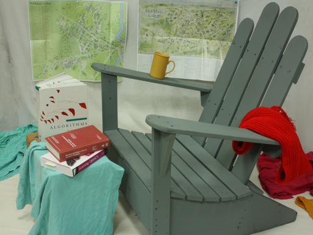](../../../static/validation/effects/igev-plusplus-20260928/Adirondack-left.png)

<figcaption>Adirondack · 实际左目输入</figcaption>
</figure>

<figure>

[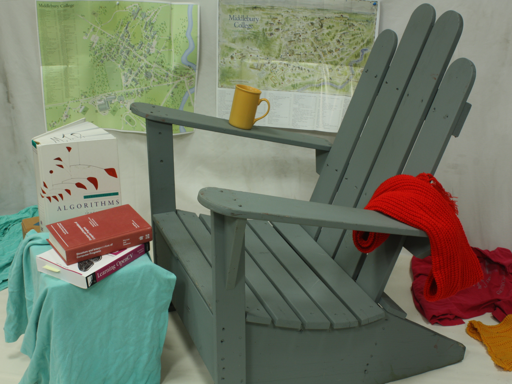](../../../static/validation/effects/igev-plusplus-20260928/Adirondack-right.png)

<figcaption>Adirondack · 实际右目输入</figcaption>
</figure>

<figure>

[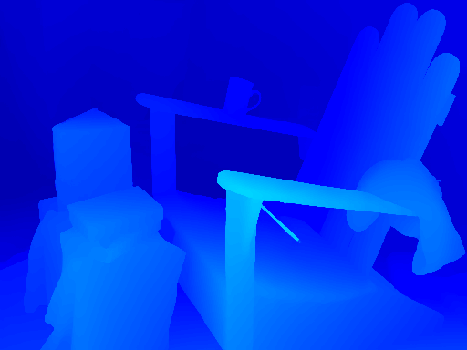](../../../static/validation/effects/igev-plusplus-20260928/Adirondack-card.png)

<figcaption>Adirondack · 算力卡视差</figcaption>
</figure>

<figure>

[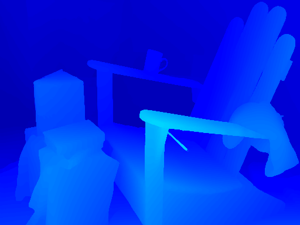](../../../static/validation/effects/igev-plusplus-20260928/Adirondack-cpu.png)

<figcaption>Adirondack · CPU ONNX 参考视差</figcaption>
</figure>

</div>

**PipesH：输入与输出对照**

两份视差图的近处大平面与边界存在明显数值差异，误差图中亮色区域较集中。本组平均差值最高，需要继续核对量化与场景适用性。 两份视差图固定采用 0–128 像素色阶，超出范围仅截断颜色。

<div className="model-effect-gallery">

<figure>

[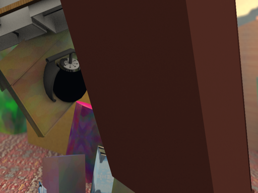](../../../static/validation/effects/igev-plusplus-20260928/PipesH-left.png)

<figcaption>PipesH · 实际左目输入</figcaption>
</figure>

<figure>

[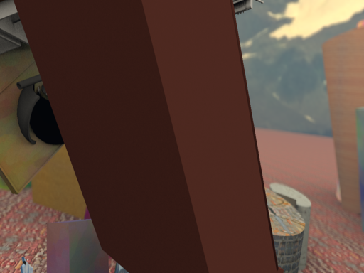](../../../static/validation/effects/igev-plusplus-20260928/PipesH-right.png)

<figcaption>PipesH · 实际右目输入</figcaption>
</figure>

<figure>

[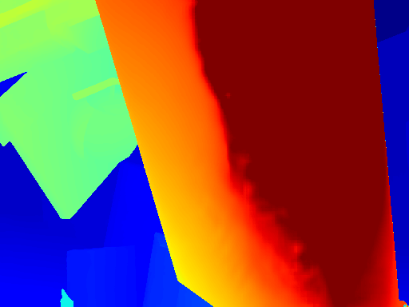](../../../static/validation/effects/igev-plusplus-20260928/PipesH-card.png)

<figcaption>PipesH · 算力卡视差</figcaption>
</figure>

<figure>

[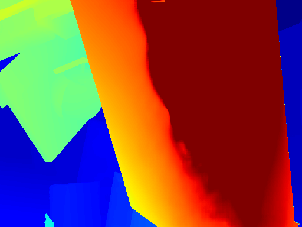](../../../static/validation/effects/igev-plusplus-20260928/PipesH-cpu.png)

<figcaption>PipesH · CPU ONNX 参考视差</figcaption>
</figure>

<figure>

[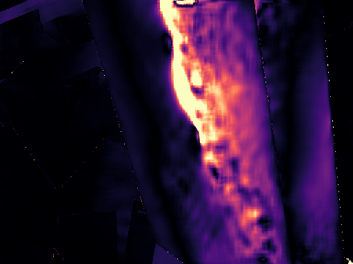](../../../static/validation/effects/igev-plusplus-20260928/PipesH-error.png)

<figcaption>PipesH · 原始视差绝对差，色阶 0–16 px</figcaption>
</figure>

</div>

**sceneflow：输入与输出对照**

管道与立柱形成不同视差区域，两份输出的主要结构接近，局部遮挡边缘仍有差异。 两份视差图固定采用 0–128 像素色阶，超出范围仅截断颜色。

<div className="model-effect-gallery">

<figure>

[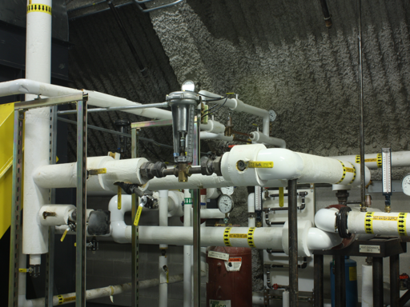](../../../static/validation/effects/igev-plusplus-20260928/sceneflow-left.png)

<figcaption>sceneflow · 实际左目输入</figcaption>
</figure>

<figure>

[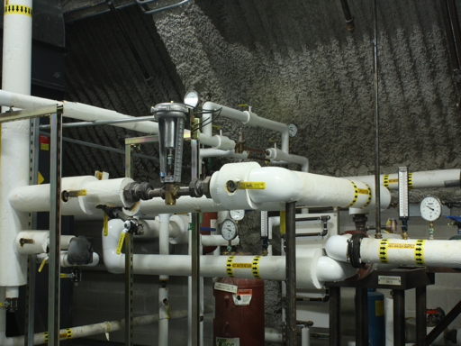](../../../static/validation/effects/igev-plusplus-20260928/sceneflow-right.png)

<figcaption>sceneflow · 实际右目输入</figcaption>
</figure>

<figure>

[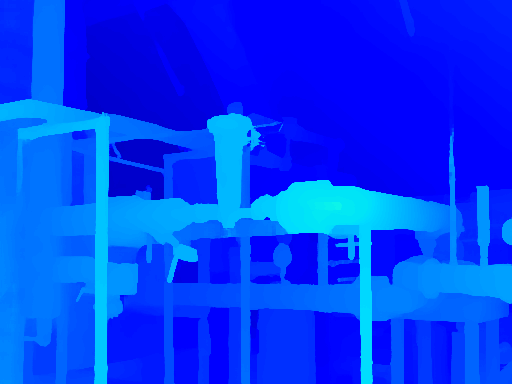](../../../static/validation/effects/igev-plusplus-20260928/sceneflow-card.png)

<figcaption>sceneflow · 算力卡视差</figcaption>
</figure>

<figure>

[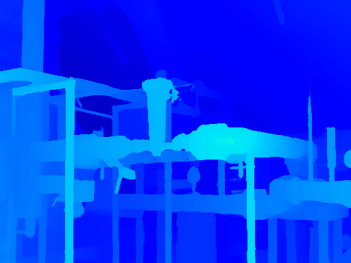](../../../static/validation/effects/igev-plusplus-20260928/sceneflow-cpu.png)

<figcaption>sceneflow · CPU ONNX 参考视差</figcaption>
</figure>

</div>

**四组官方视差标注对照**

使用 [Middlebury 2014 官方标注](https://vision.middlebury.edu/stereo/data/scenes2014/) 的 perfect 校正版本，四组左右原图均与实测来源逐文件一致。评估 保存的 512 × 384 原始输出：双线性放大到原图尺寸，再将水平视差乘以原图宽度 / 512。EPE 为视差绝对误差均值，Bad > 2 px 为误差超过 2 原图像素的比例；仅排除非有限标注，未排除遮挡区。下表均以原图像素计量，与上方 CPU 差值表的输入像素单位不同。此四组结果采用自定义输入尺寸和上采样方法，不是 Middlebury 官方排行榜分数，也不代表米制测距精度。 图中预测与标注共用每组校准文件的视差色阶，误差图色阶为 0–16 原图像素；颜色截断不参与数值统计。Cable 的细线、孔洞及 Classroom 的上方墙面仍可见局部误差。

<div className="model-effect-gallery">

<figure>

[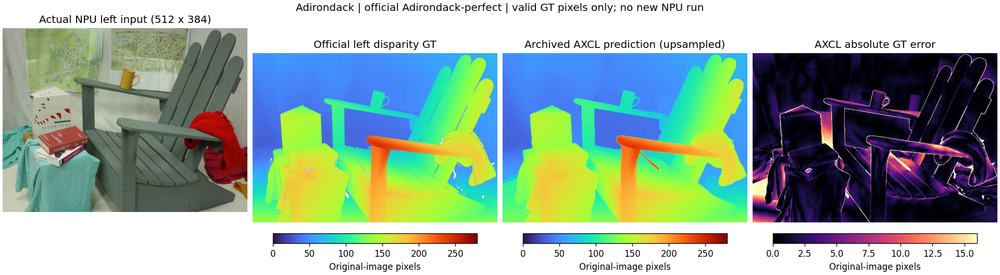](../../../static/validation/effects/igev-plusplus-20260928/Adirondack-ground-truth.png)

<figcaption>Adirondack：左目输入、官方视差标注、算力卡预测、绝对误差（点击放大）</figcaption>
</figure>

<figure>

[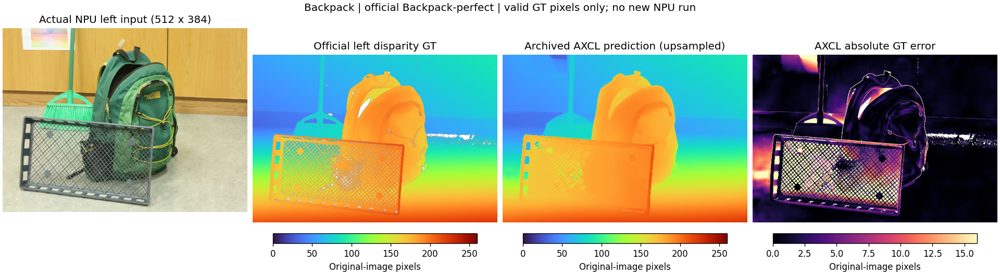](../../../static/validation/effects/igev-plusplus-20260928/Backpack-ground-truth.png)

<figcaption>Backpack：左目输入、官方视差标注、算力卡预测、绝对误差（点击放大）</figcaption>
</figure>

<figure>

[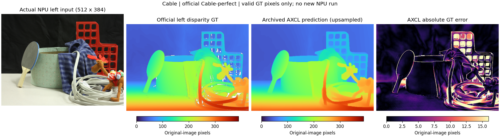](../../../static/validation/effects/igev-plusplus-20260928/Cable-ground-truth.png)

<figcaption>Cable：左目输入、官方视差标注、算力卡预测、绝对误差（点击放大）</figcaption>
</figure>

<figure>

[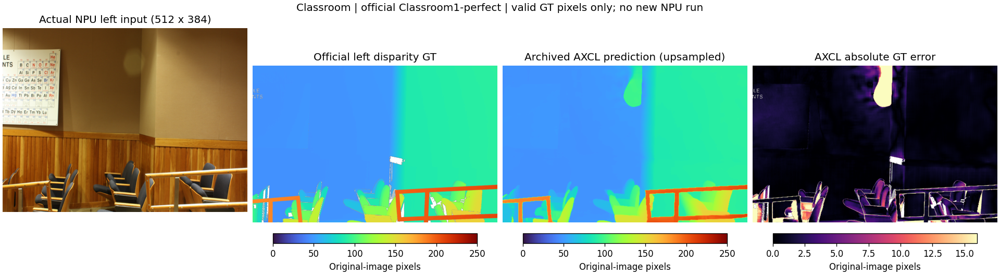](../../../static/validation/effects/igev-plusplus-20260928/Classroom-ground-truth.png)

<figcaption>Classroom：左目输入、官方视差标注、算力卡预测、绝对误差（点击放大）</figcaption>
</figure>

</div>

| 图片组 | 计算后端 | 有效标注像素 | EPE / 原图 px | Bad > 2 原图 px |
| --- | --- | --- | --- | --- |
| Adirondack | 算力卡 | 5691206 | 2.369 | 22.59% |
| Adirondack | CPU ONNX | 5691206 | 2.122 | 19.99% |
| Backpack | 算力卡 | 5786938 | 4.136 | 25.14% |
| Backpack | CPU ONNX | 5786938 | 3.870 | 24.83% |
| Cable | 算力卡 | 5438079 | 4.074 | 37.26% |
| Cable | CPU ONNX | 5438079 | 3.931 | 33.76% |
| Classroom | 算力卡 | 5672088 | 2.471 | 13.06% |
| Classroom | CPU ONNX | 5672088 | 2.342 | 11.87% |

**使用时注意：**

- 四组官方标注已评估，另三组未完成标注精度核对；PipesH 与 CPU 参考差异较大。当前没有完整数据集及约定验收阈值，未判定整体精度通过。
- 只验证静态图和 AX650 编译模型；未测试 AX637 权重、双目摄像头同步、实时视频或米制测距。

这些结果用于对照部署后的输出，未覆盖完整数据集精度或长期连续运行。

<details>
<summary>查看样例环境与运行耗时</summary>

环境：RK3576 + AX8850 16GB M.2。模型版本：`b5e505fcaeaecdcee9bae2959d29c1f1ebec08a5`。

| 组件 | 版本或配置 |
| --- | --- |
| 主机 / 内核 | RK3576，约 4GB RAM，6.1.115-vendor-rk35xx |
| AXCL / 驱动 | V3.16.0_20260729180218 |
| 固件 / CMM | V3.16.0 / 15232 MiB |
| Python 推理 | Python 3.12 / PyAXEngine 0.1.3.rc3 / NumPy 1.26.4 / AXCLRTExecutionProvider |

| 指标 | 实测值 | 计时或统计范围 |
| --- | --- | --- |
| AXCL 平均耗时 | 150.335 ms | 七组输入各两次，共14次 session.run，包含传输，不含加载、缩放、CPU参考和文件保存。 |
| 与 CPU 平均绝对差 | 0.066494–2.470881 px | 每组独立统计；不是与标注真值的EPE，也不是米制距离误差。 |
| 重复运行 | 7 / 7 组输出一致 | 相同输入的两次原始AXCL输出逐字节一致，不代表跨设备或长期稳定性。 |
| 四组标注视差 EPE | 2.369–4.136 原图 px | 四组 perfect 原图的有效左视差标注，包含遮挡区；512×384 输出放大并还原水平尺度。各图独立统计，不是完整基准或距离误差。 |

适用范围：

- 本次为16GB算力卡，真实8GB容量与长期连续运行仍需回归。

</details>

遇到加载、内存或后端错误时，按[常见问题](../../usage/troubleshooting.md)处理。需要更换输入或接入业务时，按[检查输出与记录结果](../../reference/validation.md)保留自己的结果。

<details>
<summary>查看文件用途与版本信息</summary>

| 文件 / 目录内路径 | 用途 |
| --- | --- |
| [`infer.py`](https://huggingface.co/AXERA-TECH/IGEV-plusplus/blob/b5e505fcaeaecdcee9bae2959d29c1f1ebec08a5/infer.py) | Python 程序 / 前后处理 |
| [`models/AX650_RTIGEV.axmodel`](https://huggingface.co/AXERA-TECH/IGEV-plusplus/blob/b5e505fcaeaecdcee9bae2959d29c1f1ebec08a5/models/AX650_RTIGEV.axmodel) | 编译模型；按目录区分芯片和规格 |
| [`config.json`](https://huggingface.co/AXERA-TECH/IGEV-plusplus/blob/b5e505fcaeaecdcee9bae2959d29c1f1ebec08a5/config.json) | 运行配置 |

仓库提交：`b5e505fcaeaecdcee9bae2959d29c1f1ebec08a5`。仓库中的 2 个 `.axmodel` 文件可能包括多个芯片、规格和分片。运行时使用本页指定的配套文件，完整列表见[固定版本目录](https://huggingface.co/AXERA-TECH/IGEV-plusplus/tree/b5e505fcaeaecdcee9bae2959d29c1f1ebec08a5)。

</details>

<details>
<summary>补充说明与版本差异</summary>

- 双目匹配需要相同分辨率、时间同步和校正后的左右图像。单张图片不能完成双目深度验证。

</details>

## 参考资料

- [常用术语](../../reference/glossary.md)：AXCL、CMM、分词器与推理指标。
- [固定版本文件表](https://huggingface.co/AXERA-TECH/IGEV-plusplus/tree/b5e505fcaeaecdcee9bae2959d29c1f1ebec08a5)。
- [模型卡 / 使用说明](https://huggingface.co/AXERA-TECH/IGEV-plusplus/blob/b5e505fcaeaecdcee9bae2959d29c1f1ebec08a5/README.md)。
- [主要程序入口：infer.py](https://huggingface.co/AXERA-TECH/IGEV-plusplus/blob/b5e505fcaeaecdcee9bae2959d29c1f1ebec08a5/infer.py)。
- [ModelScope 对应资源](https://modelscope.cn/models/AXERA-TECH/IGEV-plusplus)。不同平台的 revision 不通用，另行记录版本。

返回[完整模型目录](../catalog.mdx)。
