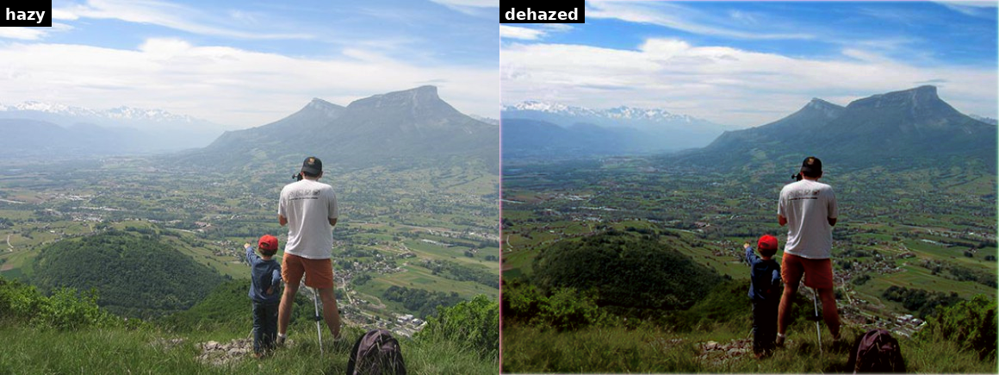
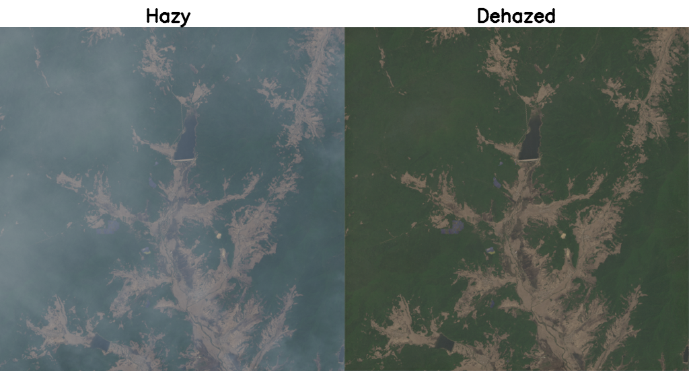
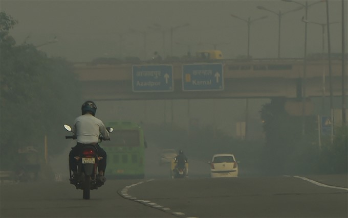
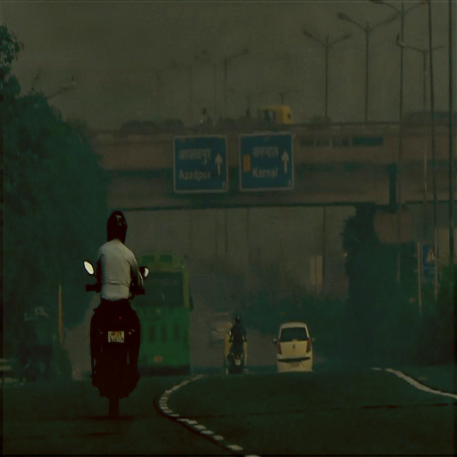
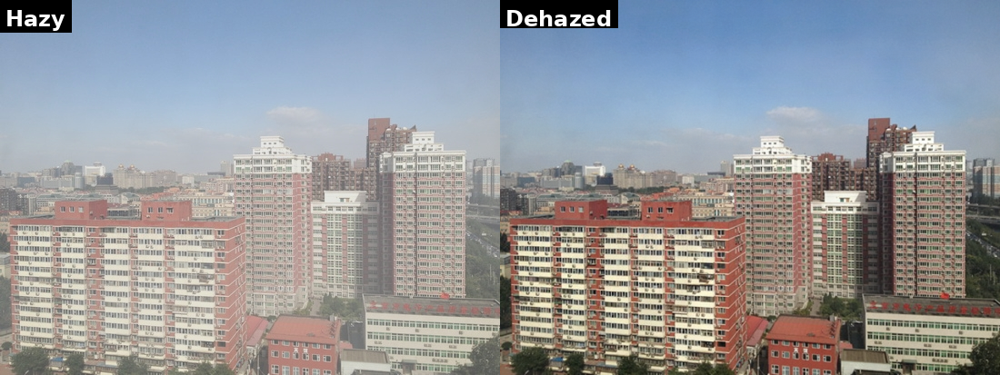
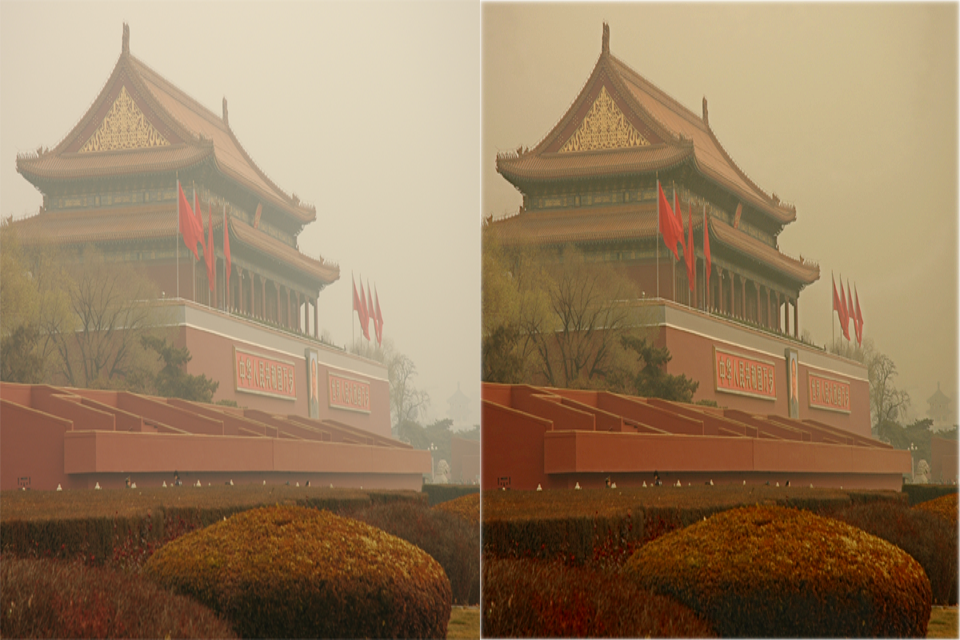
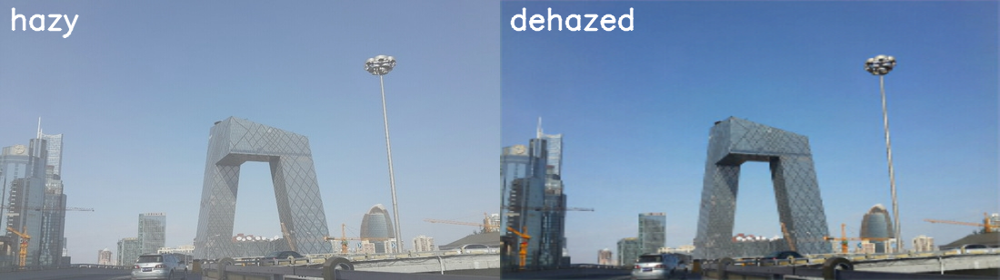
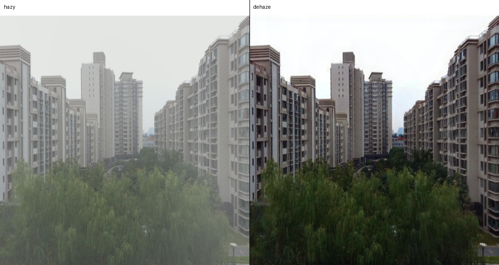

# ImageDehazing 部署指南

ImageDehazing 用于图像增强与修复。本页说明 M.2 算力卡的接入条件、部署步骤与结果检查方法。

> 已实测，效果仍需评估。[查看部署效果](#查看部署效果)。

## 准备运行环境

本页效果展示使用 **RK3576 + AX8850 16GB M.2**；其他容量或平台需重新确认模型能否加载并正确运行。

在连接算力卡的 Linux 主机终端执行，RK3576 使用 ARM64 环境。首次部署先完成[驱动与设备检查](../../usage/device-check.md)、[安装 PyAXEngine](../../usage/python.md)和[下载工具安装](../../usage/download-models.md#使用-hugging-face-下载)。已完成这些步骤可直接下载模型。

后文使用设备 0，运行前用 `axcl-smi` 确认设备可用。

## 下载模型与样例

本页使用 `AXERA-TECH/ImageDehazing` 的固定版本。下面下载本页选用的 21 个文件。

```bash
MODEL_DIR=~/edgeaccel/models/imagedehazing/6a15e0cc1436
mkdir -p "$MODEL_DIR"
~/edgeaccel/hf-env/bin/hf download AXERA-TECH/ImageDehazing \
  "AOD-Net/python/axmodel_infer.py" \
  "AOD-Net/pic/canyon2.jpg" \
  "AOD-Net/model_convert/axmodel/aodnet_1x3x480x640_sim.axmodel" \
  "DehazeFormer/python/axmodel_infer.py" \
  "DehazeFormer/pic/00000_0_0.1800.png" \
  "DehazeFormer/model_convert/axmodel/dehazeformer-t-512-constant.axmodel" \
  "FFA-Net/python/axmodel_infer.py" \
  "FFA-Net/pic/nh(4).jpg" \
  "FFA-Net/model_convert/axmodel/FFANet.axmodel" \
  "GridDehazeNet/python/axmodel_infer.py" \
  "GridDehazeNet/pic/0001_0.8_0.2.jpg" \
  "GridDehazeNet/model_convert/axmodel/GridDehazeNet.axmodel" \
  "LightDehazeNet/python/axmodel_infer.py" \
  "LightDehazeNet/pic/outdoor_natural/nh(5).png" \
  "LightDehazeNet/model_convert/axmodel/LightDehazeNet.axmodel" \
  "MixDehazeNet/python/axmodel_infer.py" \
  "MixDehazeNet/pic/0003_0.8_0.2.jpg" \
  "MixDehazeNet/model_convert/axmodel/MixDehazeNet.axmodel" \
  "GCANet/python/axmodel_infer.py" \
  "GCANet/pic/0051_0.8_0.2_input.png" \
  "GCANet/model_convert/axmodel/GCANet_U16.axmodel" \
  --revision 6a15e0cc1436740ccef0e6f0fe50324b2cdef49b \
  --local-dir "$MODEL_DIR"
cd "$MODEL_DIR"
```

保留当前终端中的 `MODEL_DIR` 变量，后续命令沿用此目录。下载受阻或需要离线复制时，见[下载方式与文件校验](../../usage/download-models.md)。

## 安装图像处理依赖

在 RK3576 主机激活已安装 PyAXEngine 的环境：

```bash
source ~/edgeaccel/python-env/bin/activate
python -m pip install 'numpy==1.26.4' 'opencv-python-headless==4.11.0.86' 'pillow==11.3.0'
python -m pip check
```

下载 [enhancement_card.py](../../../static/examples/enhancement_card.py) 和 [image-enhancement-cases.json](../../../static/examples/image-enhancement-cases.json)，保存到 `$MODEL_DIR`。运行脚本复用固定版本官方前后处理，指定 `AXCLRTExecutionProvider`，并把输入、模型和输出目录替换为本页路径。

## 运行配套样例

以下命令按顺序运行本仓库全部已选变体。使用新的结果目录；同名目录已存在时脚本停止，避免混入旧图。

```bash
cd "$MODEL_DIR"
for name in aod-net dehazeformer ffa-net griddehazenet lightdehazenet mixdehazenet gcanet; do
  python enhancement_card.py --model-dir . \
    --cases image-enhancement-cases.json --case "$name" \
    --output "results/$name" || break
done
```

确认日志使用 `AXCLRTExecutionProvider`，退出码为 0，并在 `results/变体名称/outputs/` 中生成图片。`enhancement-result.json` 记录实际执行的权重、输入校验值、输出尺寸和耗时。只运行一种算法时，将循环中的名称改为对应名称。

输出用于观察本次处理效果；是否符合业务要求，还需用自己的图片检查颜色、细节和伪影。


## 查看部署效果

**已运行，效果仍需评估** · 2026-09-23 · RK3576 + AX8850 16GB M.2。以下输入与输出来自本页固定版本的实际运行。

AOD-Net、DehazeFormer、FFA-Net、GridDehazeNet、LightDehazeNet、MixDehazeNet 与 GCANet 全部完成样例推理。下方展示各算法实际输出；部分结果偏暗或细节变软。

以下图片由本次运行生成，点击可查看原尺寸。各算法的输入、模型分辨率和后处理不同，不能直接根据这些样例比较算法优劣。

**AOD-Net**

左为原图，右为去雾输出。山体和天空对比度提高，前景较暗。

<div className="model-effect-gallery">

<figure>

[](../../../static/validation/effects/imagedehazing/outputs/aod-net.png)

<figcaption>本次运行输出</figcaption>
</figure>

</div>

**DehazeFormer**

左为原图，右为去雾输出。灰雾减轻，画面整体偏绿、偏暗。

<div className="model-effect-gallery">

<figure>

[](../../../static/validation/effects/imagedehazing/outputs/dehazeformer.png)

<figcaption>本次运行输出</figcaption>
</figure>

</div>

**FFA-Net**

输出按官方脚本缩放为 512×512。道路场景仍偏暗，图像生成不代表去雾质量已经通过。

<div className="model-effect-gallery">

<figure>

[](../../../static/validation/effects/imagedehazing/inputs/ffa-net.jpg)

<figcaption>原始输入</figcaption>
</figure>

<figure>

[](../../../static/validation/effects/imagedehazing/outputs/ffa-net.png)

<figcaption>本次运行输出</figcaption>
</figure>

</div>

**GridDehazeNet**

左为原图，右为去雾输出。楼体对比度提高。

<div className="model-effect-gallery">

<figure>

[](../../../static/validation/effects/imagedehazing/outputs/griddehazenet.png)

<figcaption>本次运行输出</figcaption>
</figure>

</div>

**LightDehazeNet**

左为原图，右为去雾输出。建筑轮廓更明显，黄色色调仍然存在。

<div className="model-effect-gallery">

<figure>

[](../../../static/validation/effects/imagedehazing/outputs/lightdehazenet.png)

<figcaption>本次运行输出</figcaption>
</figure>

</div>

**MixDehazeNet**

左为原图，右为去雾输出。天空颜色更深，但建筑细节变软。

<div className="model-effect-gallery">

<figure>

[](../../../static/validation/effects/imagedehazing/outputs/mixdehazenet.png)

<figcaption>本次运行输出</figcaption>
</figure>

</div>

**GCANet**

左为原图，右为去雾输出。建筑和绿植对比度提高。

<div className="model-effect-gallery">

<figure>

[](../../../static/validation/effects/imagedehazing/outputs/gcanet.png)

<figcaption>本次运行输出</figcaption>
</figure>

</div>

**使用时注意：**

- 每种算法仅使用一张配套图片；没有无雾参考图，未计算 PSNR、SSIM 或完整数据集指标。
- 使用 16GB 算力卡，未验证 8GB 容量、并发或长期连续运行。

这些结果用于对照部署后的输出，未覆盖完整数据集精度或长期连续运行。

<details>
<summary>查看样例环境与运行耗时</summary>

环境：RK3576 + AX8850 16GB M.2。日期：2026-09-23。模型版本：`6a15e0cc1436740ccef0e6f0fe50324b2cdef49b`。

| 组件 | 版本或配置 |
| --- | --- |
| 主机系统 | Ubuntu 24.04 / Armbian 25.11.0-trunk，aarch64，主机内存约 4GB |
| 内核 | 6.1.115-vendor-rk35xx |
| AXCL / 驱动 | V3.16.0_20260729180218 |
| 固件 / CMM | V3.16.0；CMM 总量 15232MiB |
| Python / PyAXEngine | Python 3.12；官方 0.1.3.rc3 wheel；AXCLRTExecutionProvider |
| NumPy / OpenCV / Pillow | 1.26.4 / 4.11.0.86 / 11.3.0 |
| Torch / Torchvision | 2.5.1 / 0.20.1 |

| 指标 | 实测值 | 计时或统计范围 |
| --- | --- | --- |
| AOD-Net 样例总耗时 | 1.138857 s | Python 示例主体，包括模型加载、前后处理、推理和保存图片；不单独作为 NPU 性能 |
| DehazeFormer 样例总耗时 | 1.114872 s | Python 示例主体，包括模型加载、前后处理、推理和保存图片；不单独作为 NPU 性能 |
| FFA-Net 样例总耗时 | 2.413688 s | Python 示例主体，包括模型加载、前后处理、推理和保存图片；不单独作为 NPU 性能 |
| GridDehazeNet 样例总耗时 | 1.316145 s | Python 示例主体，包括模型加载、前后处理、推理和保存图片；不单独作为 NPU 性能 |
| LightDehazeNet 样例总耗时 | 1.294948 s | Python 示例主体，包括模型加载、前后处理、推理和保存图片；不单独作为 NPU 性能 |
| MixDehazeNet 样例总耗时 | 0.920301 s | Python 示例主体，包括模型加载、前后处理、推理和保存图片；不单独作为 NPU 性能 |
| GCANet 样例总耗时 | 1.591563 s | Python 示例主体，包括模型加载、前后处理、推理和保存图片；不单独作为 NPU 性能 |

适用范围：

- 每种算法仅使用一张配套图片；没有无雾参考图，未计算 PSNR、SSIM 或完整数据集指标。
- 使用 16GB 算力卡，未验证 8GB 容量、并发或长期连续运行。

</details>

遇到加载、内存或后端错误时，按[常见问题](../../usage/troubleshooting.md)处理。需要更换输入或接入业务时，按[检查输出与记录结果](../../reference/validation.md)保留自己的结果。

<details>
<summary>查看文件用途与版本信息</summary>

| 文件 / 目录内路径 | 用途 |
| --- | --- |
| [`AOD-Net/python/axmodel_infer.py`](https://huggingface.co/AXERA-TECH/ImageDehazing/blob/6a15e0cc1436740ccef0e6f0fe50324b2cdef49b/AOD-Net/python/axmodel_infer.py) | Python 程序 / 前后处理 |
| [`DehazeFormer/python/axmodel_infer.py`](https://huggingface.co/AXERA-TECH/ImageDehazing/blob/6a15e0cc1436740ccef0e6f0fe50324b2cdef49b/DehazeFormer/python/axmodel_infer.py) | Python 程序 / 前后处理 |
| [`AOD-Net/model_convert/axmodel/aodnet_1x3x480x640_sim.axmodel`](https://huggingface.co/AXERA-TECH/ImageDehazing/blob/6a15e0cc1436740ccef0e6f0fe50324b2cdef49b/AOD-Net/model_convert/axmodel/aodnet_1x3x480x640_sim.axmodel) | 编译模型；按目录区分芯片和规格 |
| [`DehazeFormer/model_convert/axmodel/dehazeformer-t-512-constant.axmodel`](https://huggingface.co/AXERA-TECH/ImageDehazing/blob/6a15e0cc1436740ccef0e6f0fe50324b2cdef49b/DehazeFormer/model_convert/axmodel/dehazeformer-t-512-constant.axmodel) | 编译模型；按目录区分芯片和规格 |
| [`FFA-Net/model_convert/axmodel/FFANet.axmodel`](https://huggingface.co/AXERA-TECH/ImageDehazing/blob/6a15e0cc1436740ccef0e6f0fe50324b2cdef49b/FFA-Net/model_convert/axmodel/FFANet.axmodel) | 编译模型；按目录区分芯片和规格 |
| [`GCANet/model_convert/axmodel/GCANet_U16.axmodel`](https://huggingface.co/AXERA-TECH/ImageDehazing/blob/6a15e0cc1436740ccef0e6f0fe50324b2cdef49b/GCANet/model_convert/axmodel/GCANet_U16.axmodel) | 编译模型；按目录区分芯片和规格 |
| [`GridDehazeNet/model_convert/axmodel/GridDehazeNet.axmodel`](https://huggingface.co/AXERA-TECH/ImageDehazing/blob/6a15e0cc1436740ccef0e6f0fe50324b2cdef49b/GridDehazeNet/model_convert/axmodel/GridDehazeNet.axmodel) | 编译模型；按目录区分芯片和规格 |
| [`AOD-Net/python/onnx_infer.py`](https://huggingface.co/AXERA-TECH/ImageDehazing/blob/6a15e0cc1436740ccef0e6f0fe50324b2cdef49b/AOD-Net/python/onnx_infer.py) | Python 程序 / 前后处理 |
| [`DehazeFormer/python/onnx_infer.py`](https://huggingface.co/AXERA-TECH/ImageDehazing/blob/6a15e0cc1436740ccef0e6f0fe50324b2cdef49b/DehazeFormer/python/onnx_infer.py) | Python 程序 / 前后处理 |
| [`FFA-Net/python/axmodel_infer.py`](https://huggingface.co/AXERA-TECH/ImageDehazing/blob/6a15e0cc1436740ccef0e6f0fe50324b2cdef49b/FFA-Net/python/axmodel_infer.py) | Python 程序 / 前后处理 |
| [`FFA-Net/python/onnx_infer.py`](https://huggingface.co/AXERA-TECH/ImageDehazing/blob/6a15e0cc1436740ccef0e6f0fe50324b2cdef49b/FFA-Net/python/onnx_infer.py) | Python 程序 / 前后处理 |
| [`GCANet/python/axmodel_infer.py`](https://huggingface.co/AXERA-TECH/ImageDehazing/blob/6a15e0cc1436740ccef0e6f0fe50324b2cdef49b/GCANet/python/axmodel_infer.py) | Python 程序 / 前后处理 |
| [`GCANet/python/onnx_infer.py`](https://huggingface.co/AXERA-TECH/ImageDehazing/blob/6a15e0cc1436740ccef0e6f0fe50324b2cdef49b/GCANet/python/onnx_infer.py) | Python 程序 / 前后处理 |
| [`GridDehazeNet/python/axmodel_infer.py`](https://huggingface.co/AXERA-TECH/ImageDehazing/blob/6a15e0cc1436740ccef0e6f0fe50324b2cdef49b/GridDehazeNet/python/axmodel_infer.py) | Python 程序 / 前后处理 |

仓库提交：`6a15e0cc1436740ccef0e6f0fe50324b2cdef49b`。仓库中的 7 个 `.axmodel` 文件可能包括多个芯片、规格和分片。运行时使用本页指定的配套文件，完整列表见[固定版本目录](https://huggingface.co/AXERA-TECH/ImageDehazing/tree/6a15e0cc1436740ccef0e6f0fe50324b2cdef49b)。

</details>

## 参考资料

- [常用术语](../../reference/glossary.md)：AXCL、CMM、分词器与推理指标。
- [固定版本文件表](https://huggingface.co/AXERA-TECH/ImageDehazing/tree/6a15e0cc1436740ccef0e6f0fe50324b2cdef49b)。
- [模型卡 / 使用说明](https://huggingface.co/AXERA-TECH/ImageDehazing/blob/6a15e0cc1436740ccef0e6f0fe50324b2cdef49b/README.md)。
- [主要程序入口：AOD-Net/python/axmodel_infer.py](https://huggingface.co/AXERA-TECH/ImageDehazing/blob/6a15e0cc1436740ccef0e6f0fe50324b2cdef49b/AOD-Net/python/axmodel_infer.py)。

返回[完整模型目录](../catalog.mdx)。
