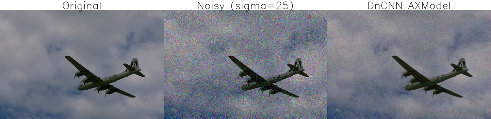
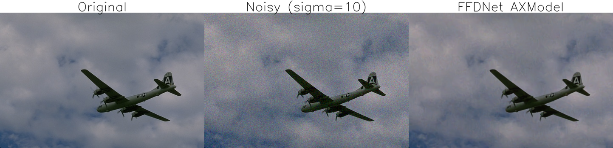
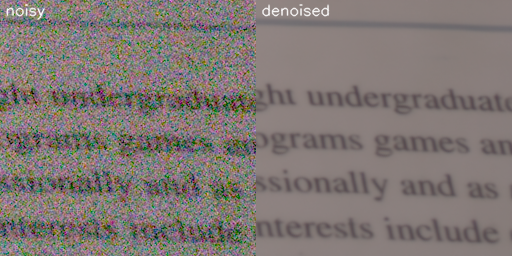

# ImageDenosing 部署指南

ImageDenosing 用于图像增强与修复。本页说明 M.2 算力卡的接入条件、部署步骤与结果检查方法。

> 已实测，效果仍需评估。[查看部署效果](#查看部署效果)。

## 准备运行环境

本页效果展示使用 **RK3576 + AX8850 16GB M.2**；其他容量或平台需重新确认模型能否加载并正确运行。

在连接算力卡的 Linux 主机终端执行，RK3576 使用 ARM64 环境。首次部署先完成[驱动与设备检查](../../usage/device-check.md)、[安装 PyAXEngine](../../usage/python.md)和[下载工具安装](../../usage/download-models.md#使用-hugging-face-下载)。已完成这些步骤可直接下载模型。

后文使用设备 0，运行前用 `axcl-smi` 确认设备可用。

## 下载模型与样例

本页使用 `AXERA-TECH/ImageDenosing` 的固定版本。下面下载本页选用的 9 个文件。

```bash
MODEL_DIR=~/edgeaccel/models/imagedenosing/2bd3be823a15
mkdir -p "$MODEL_DIR"
~/edgeaccel/hf-env/bin/hf download AXERA-TECH/ImageDenosing \
  "DnCNN/python/axmodel_infer.py" \
  "DnCNN/pic/3096.png" \
  "DnCNN/model_convert/axmodel/dncnn_color_blind_416x416_sim.axmodel" \
  "FFDNet/python/axmodel_infer.py" \
  "FFDNet/pic/3096.png" \
  "FFDNet/model_convert/axmodel/ffdnet_color_fixed_sigma10_640x640_sim.axmodel" \
  "NAFNet/python/axmodel_infer.py" \
  "NAFNet/pic/noisy.png" \
  "NAFNet/model_convert/axmodel/NAFNet_1_3_256_256.axmodel" \
  --revision 2bd3be823a15cf79862a9dfaa21979028457f10f \
  --local-dir "$MODEL_DIR"
cd "$MODEL_DIR"
```

保留当前终端中的 `MODEL_DIR` 变量，后续命令沿用此目录。下载受阻或需要离线复制时，见[下载方式与文件校验](../../usage/download-models.md)。

## 安装图像处理依赖

本页运行已取得输出的 DnCNN、FFDNet 与 NAFNet。Restormer 与 FastDVDnet 尚未取得有效部署结果，不包含在以下运行命令中。

在 RK3576 主机激活已安装 PyAXEngine 的环境：

```bash
source ~/edgeaccel/python-env/bin/activate
python -m pip install \
  'numpy==1.26.4' 'opencv-python-headless==4.11.0.86' 'pillow==11.3.0'
python -m pip check
```

下载 [enhancement_card.py](../../../static/examples/enhancement_card.py) 和 [image-denoising-cases.json](../../../static/examples/image-denoising-cases.json)，保存到 `$MODEL_DIR`。脚本复用官方前后处理，指定 `AXCLRTExecutionProvider`，并配置模型、输入和输出路径。

## 运行三种图像降噪算法

在模型目录执行。使用新的结果目录，避免混入旧输出。

```bash
cd "$MODEL_DIR"
for name in dncnn ffdnet nafnet; do
  python enhancement_card.py --model-dir . \
    --cases image-denoising-cases.json --case "$name" \
    --output "results/$name" || break
done
```

DnCNN 与 FFDNet 分别向官方图片添加 sigma=25、sigma=10 的高斯噪声，再运行降噪；NumPy 随机种子固定为 `20260923`。NAFNet 直接使用仓库提供的 `noisy.png`。

确认日志使用 `AXCLRTExecutionProvider`、退出码为 0，并生成以下文件：

| 算法 | 输出文件 | 图片排列 |
| --- | --- | --- |
| DnCNN | `results/dncnn/outputs/axmodel_res.png` | 原图、加噪图、降噪图 |
| FFDNet | `results/ffdnet/outputs/axmodel_res.png` | 原图、加噪图、降噪图 |
| NAFNet | `results/nafnet/outputs/axmodel_compare.png` | 含噪输入、降噪图 |

每个结果目录还包含 `enhancement-result.json`，用于核对实际权重、输入校验值、输出尺寸和耗时。判断效果时同时查看噪点、文字或边缘是否丢失，不能只检查图片是否生成。


## 查看部署效果

**已运行，效果仍需评估** · RK3576 + AX8850 16GB M.2。以下输入与输出来自本页固定版本的实际运行。

DnCNN、FFDNet 和 NAFNet 均减轻了样例噪点；DnCNN 仍有残余颗粒，FFDNet 略有平滑，NAFNet 的文字仍模糊。Restormer 与 FastDVDnet 尚未取得有效输出，仍需补测。

以下图片由本次运行生成，点击可查看原尺寸。各算法的输入、模型分辨率和后处理不同，不能直接根据这些样例比较算法优劣。

**DnCNN**

中间为 sigma=25 的加噪图，右侧输出的彩色噪点减少，飞机轮廓与颜色大体保留；天空仍有明显残余颗粒，不能视为恢复到左侧原图。

<div className="model-effect-gallery">

<figure>

[](../../../static/validation/effects/imagedenosing/outputs/dncnn.png)

<figcaption>本次运行输出</figcaption>
</figure>

</div>

**FFDNet**

中间为 sigma=10 的加噪图，右侧输出的噪点明显减少，飞机轮廓和云层大体保留；细节略有平滑。加噪强度与 DnCNN 不同，不能据此直接排名。

<div className="model-effect-gallery">

<figure>

[](../../../static/validation/effects/imagedenosing/outputs/ffdnet.png)

<figcaption>本次运行输出</figcaption>
</figure>

</div>

**NAFNet**

右侧输出明显减轻彩色噪点，文字行和部分字母变得可见，但文字边缘仍模糊；本样例不证明完整文字内容得到恢复。

<div className="model-effect-gallery">

<figure>

[](../../../static/validation/effects/imagedenosing/outputs/nafnet.png)

<figcaption>本次运行输出</figcaption>
</figure>

</div>

**使用时注意：**

- 三个已展示样例存在残余颗粒或细节平滑；NAFNet 的文字仍模糊，不能作为完整文字恢复的依据。
- 本次只覆盖仓库五个权重中的 DnCNN、FFDNet、NAFNet，不代表 Restormer 或 FastDVDnet 已验证。

这些结果用于对照部署后的输出，未覆盖完整数据集精度或长期连续运行。

<details>
<summary>查看样例环境与运行耗时</summary>

环境：RK3576 + AX8850 16GB M.2。模型版本：`2bd3be823a15cf79862a9dfaa21979028457f10f`。

| 组件 | 版本或配置 |
| --- | --- |
| 主机系统 | Ubuntu 24.04 / Armbian 25.11.0-trunk，aarch64，主机内存约 4GB |
| 内核 | 6.1.115-vendor-rk35xx |
| AXCL / 驱动 | V3.16.0_20260729180218 |
| 固件 / CMM | V3.16.0；CMM 总量 15232MiB |
| Python / PyAXEngine | Python 3.12；官方 0.1.3.rc3 wheel；AXCLRTExecutionProvider |
| NumPy / OpenCV / Pillow | 1.26.4 / 4.11.0.86 / 11.3.0 |
| Torch / Torchvision | 2.5.1 / 0.20.1 |

| 指标 | 实测值 | 计时或统计范围 |
| --- | --- | --- |
| DnCNN 样例总耗时 | 1.001013 s | Python 示例主体，包括加载、加噪或图像处理、推理与保存；不单独作为 NPU 性能 |
| FFDNet 样例总耗时 | 0.870497 s | Python 示例主体，包括加载、加噪或图像处理、推理与保存；不单独作为 NPU 性能 |
| NAFNet 样例总耗时 | 3.387867 s | Python 示例主体，包括加载、加噪或图像处理、推理与保存；不单独作为 NPU 性能 |

适用范围：

- DnCNN/FFDNet 按官方脚本添加高斯噪声，sigma 分别为 25/10，随机种子 20260923；三种模型并非相同测试条件。
- 每种算法仅测试一张图片，未计算 PSNR、SSIM 或完整数据集指标；未验证视频、8GB 容量或长期运行。

</details>

遇到加载、内存或后端错误时，按[常见问题](../../usage/troubleshooting.md)处理。需要更换输入或接入业务时，按[检查输出与记录结果](../../reference/validation.md)保留自己的结果。

<details>
<summary>查看文件用途与版本信息</summary>

| 文件 / 目录内路径 | 用途 |
| --- | --- |
| [`DnCNN/python/axmodel_infer.py`](https://huggingface.co/AXERA-TECH/ImageDenosing/blob/2bd3be823a15cf79862a9dfaa21979028457f10f/DnCNN/python/axmodel_infer.py) | Python 程序 / 前后处理 |
| [`FFDNet/python/axmodel_infer.py`](https://huggingface.co/AXERA-TECH/ImageDenosing/blob/2bd3be823a15cf79862a9dfaa21979028457f10f/FFDNet/python/axmodel_infer.py) | Python 程序 / 前后处理 |
| [`DnCNN/model_convert/axmodel/dncnn_color_blind_416x416_sim.axmodel`](https://huggingface.co/AXERA-TECH/ImageDenosing/blob/2bd3be823a15cf79862a9dfaa21979028457f10f/DnCNN/model_convert/axmodel/dncnn_color_blind_416x416_sim.axmodel) | 编译模型；按目录区分芯片和规格 |
| [`FFDNet/model_convert/axmodel/ffdnet_color_fixed_sigma10_640x640_sim.axmodel`](https://huggingface.co/AXERA-TECH/ImageDenosing/blob/2bd3be823a15cf79862a9dfaa21979028457f10f/FFDNet/model_convert/axmodel/ffdnet_color_fixed_sigma10_640x640_sim.axmodel) | 编译模型；按目录区分芯片和规格 |
| [`NAFNet/model_convert/axmodel/NAFNet_1_3_256_256.axmodel`](https://huggingface.co/AXERA-TECH/ImageDenosing/blob/2bd3be823a15cf79862a9dfaa21979028457f10f/NAFNet/model_convert/axmodel/NAFNet_1_3_256_256.axmodel) | 编译模型；按目录区分芯片和规格 |
| [`Restormer/model_convert/axmodel/Restormer_real_denoising_224x224_sim.axmodel`](https://huggingface.co/AXERA-TECH/ImageDenosing/blob/2bd3be823a15cf79862a9dfaa21979028457f10f/Restormer/model_convert/axmodel/Restormer_real_denoising_224x224_sim.axmodel) | 编译模型；按目录区分芯片和规格 |
| [`fastDVDnet/model_quant/axmodel/fastdvdnet_640x480.axmodel`](https://huggingface.co/AXERA-TECH/ImageDenosing/blob/2bd3be823a15cf79862a9dfaa21979028457f10f/fastDVDnet/model_quant/axmodel/fastdvdnet_640x480.axmodel) | 编译模型；按目录区分芯片和规格 |
| [`DnCNN/python/onnx_infer.py`](https://huggingface.co/AXERA-TECH/ImageDenosing/blob/2bd3be823a15cf79862a9dfaa21979028457f10f/DnCNN/python/onnx_infer.py) | Python 程序 / 前后处理 |
| [`FFDNet/python/onnx_infer.py`](https://huggingface.co/AXERA-TECH/ImageDenosing/blob/2bd3be823a15cf79862a9dfaa21979028457f10f/FFDNet/python/onnx_infer.py) | Python 程序 / 前后处理 |
| [`NAFNet/python/axmodel_infer.py`](https://huggingface.co/AXERA-TECH/ImageDenosing/blob/2bd3be823a15cf79862a9dfaa21979028457f10f/NAFNet/python/axmodel_infer.py) | Python 程序 / 前后处理 |
| [`NAFNet/python/onnx_infer.py`](https://huggingface.co/AXERA-TECH/ImageDenosing/blob/2bd3be823a15cf79862a9dfaa21979028457f10f/NAFNet/python/onnx_infer.py) | Python 程序 / 前后处理 |
| [`Restormer/python/axmodel_infer.py`](https://huggingface.co/AXERA-TECH/ImageDenosing/blob/2bd3be823a15cf79862a9dfaa21979028457f10f/Restormer/python/axmodel_infer.py) | Python 程序 / 前后处理 |
| [`Restormer/python/onnx_infer.py`](https://huggingface.co/AXERA-TECH/ImageDenosing/blob/2bd3be823a15cf79862a9dfaa21979028457f10f/Restormer/python/onnx_infer.py) | Python 程序 / 前后处理 |
| [`config.json`](https://huggingface.co/AXERA-TECH/ImageDenosing/blob/2bd3be823a15cf79862a9dfaa21979028457f10f/config.json) | 运行配置 |

仓库提交：`2bd3be823a15cf79862a9dfaa21979028457f10f`。仓库中的 5 个 `.axmodel` 文件可能包括多个芯片、规格和分片。运行时使用本页指定的配套文件，完整列表见[固定版本目录](https://huggingface.co/AXERA-TECH/ImageDenosing/tree/2bd3be823a15cf79862a9dfaa21979028457f10f)。

</details>

## 参考资料

- [常用术语](../../reference/glossary.md)：AXCL、CMM、分词器与推理指标。
- [固定版本文件表](https://huggingface.co/AXERA-TECH/ImageDenosing/tree/2bd3be823a15cf79862a9dfaa21979028457f10f)。
- [模型卡 / 使用说明](https://huggingface.co/AXERA-TECH/ImageDenosing/blob/2bd3be823a15cf79862a9dfaa21979028457f10f/README.md)。
- [主要程序入口：DnCNN/python/axmodel_infer.py](https://huggingface.co/AXERA-TECH/ImageDenosing/blob/2bd3be823a15cf79862a9dfaa21979028457f10f/DnCNN/python/axmodel_infer.py)。

返回[完整模型目录](../catalog.mdx)。
