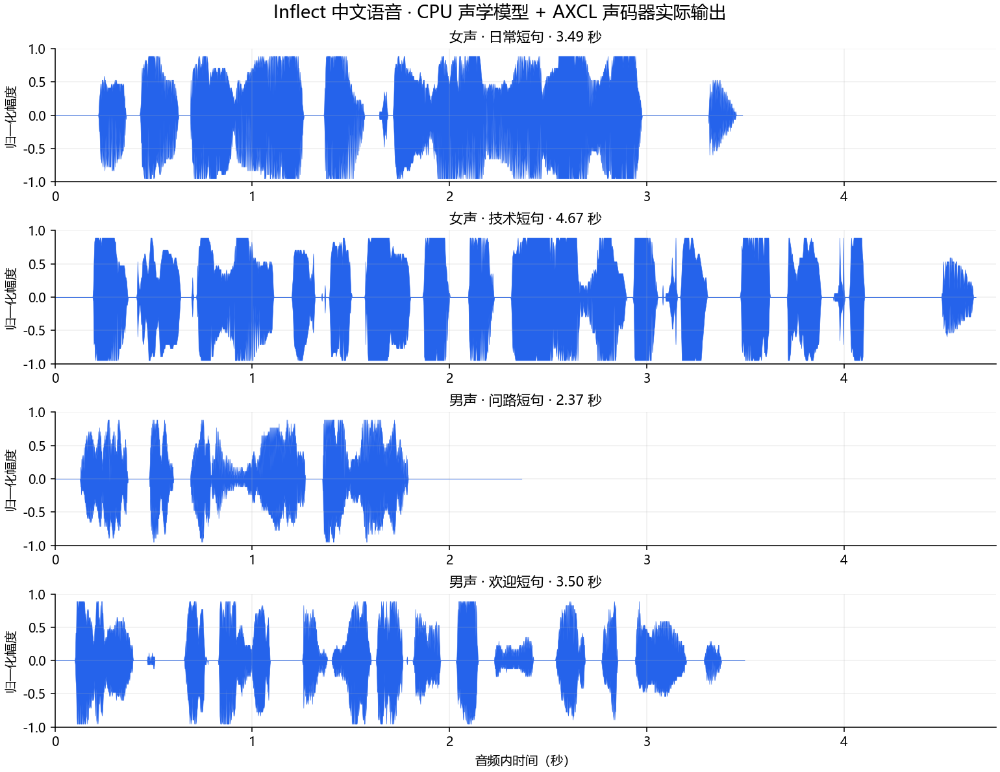

# Inflect-Micro-v2-zh 部署指南

Inflect-Micro-v2-zh 用于语音合成。本页说明 M.2 算力卡的接入条件、部署步骤与结果检查方法。

> 已实测，效果仍需评估。[查看部署效果](#查看部署效果)。

## 准备运行环境

本页效果展示使用 **RK3576 + AX8850 16GB M.2**；其他容量或平台需重新确认模型能否加载并正确运行。

在连接算力卡的 Linux 主机终端执行，RK3576 使用 ARM64 环境。首次部署先完成[驱动与设备检查](../../usage/device-check.md)、[安装 PyAXEngine](../../usage/python.md)和[下载工具安装](../../usage/download-models.md#使用-hugging-face-下载)。已完成这些步骤可直接下载模型。

后文使用设备 0，运行前用 `axcl-smi` 确认设备可用。

## 下载模型与样例

本页使用 `AXERA-TECH/Inflect-Micro-v2-zh` 的固定版本。下面下载本页选用的 14 个文件。

```bash
MODEL_DIR=~/edgeaccel/models/inflect-micro-v2-zh/f5af82ee9c1c
mkdir -p "$MODEL_DIR"
~/edgeaccel/hf-env/bin/hf download AXERA-TECH/Inflect-Micro-v2-zh \
  "README.md" \
  "models/acoustic_female.onnx" \
  "models/acoustic_female.onnx.data" \
  "models/acoustic_male.onnx" \
  "models/acoustic_male.onnx.data" \
  "models/bigvgan_base.axmodel" \
  "models/model_meta.json" \
  "python/cn_frontend/__init__.py" \
  "python/cn_frontend/pinyin_to_sequence.py" \
  "python/cn_frontend/symbols.py" \
  "python/infer_board.py" \
  "python/infer_onnx.py" \
  "python/requirements.txt" \
  "python/vocoder_utils.py" \
  --revision f5af82ee9c1cac911584ccd91f759ab54258e0a1 \
  --local-dir "$MODEL_DIR"
cd "$MODEL_DIR"
```

保留当前终端中的 `MODEL_DIR` 变量，后续命令沿用此目录。下载受阻或需要离线复制时，见[下载方式与文件校验](../../usage/download-models.md)。

## 准备语音合成环境

本例在 **RK3576 + AX8850 16GB M.2** 上运行中文男声、女声合成。文本转声学特征由主机 CPU 完成，BigVGAN 声码器通过 AXCL 调用算力卡。

在已安装 PyAXEngine 的 AXCL Python 环境中执行：

```bash
python -m pip install 'numpy==1.26.4' 'onnxruntime==1.20.1' \
  'soundfile==0.13.1' 'pypinyin==0.55.0'
python -c "import axengine; print(axengine.get_available_providers())"
axcl-smi
```

提供者列表应包含 `AXCLRTExecutionProvider`，且设备 0 可用。本页使用 PyAXEngine `0.1.3.rc3`；安装方法见前面的主机环境步骤。

下载 [Inflect 中文语音运行示例](../../../static/examples/inflect_zh_card.py)，保存为 `~/edgeaccel/inflect_zh_card.py`。前面的模型下载命令包含男、女声 ONNX、各自的外置 `.data` 权重、NPU 声码器和官方前端代码，约 101 MB。保留目录结构和文件名。

例程在结果目录内建立 ONNX 外置权重的文件别名，并核对固定版本哈希，无需手动重命名模型。官方中文前端、mel 后处理和声码器分块流程保持不变。

## 运行男声与女声合成

保持下载步骤中的 `MODEL_DIR`，指定一个尚不存在的结果目录：

```bash
python ~/edgeaccel/inflect_zh_card.py \
  --model-dir "$MODEL_DIR" \
  --output ~/edgeaccel/results/inflect-zh-01
```

程序依次合成两句女声和两句男声，使用 `noise_scale=0`、随机种子 `0`。声码器只加载一次，同一音色的声学模型复用于对应短句；切换音色时重新加载声学模型。

合成自己的短句：

```bash
python ~/edgeaccel/inflect_zh_card.py \
  --model-dir "$MODEL_DIR" \
  --voice female \
  --text '您好，欢迎体验语音合成。' \
  --output ~/edgeaccel/results/inflect-zh-custom-01
```

`--voice` 可设为 `female` 或 `male`。例程检查分句后的输入长度，超过声学模型支持的长度时停止，避免静默截断。先使用简短中文句子，再根据业务需要评估长文本和数字、英文混读。

## 播放并检查音频

| 文件 | 内容 |
| --- | --- |
| `01-female.wav`、`02-female.wav` | 两段女声，24 kHz 单声道 PCM16 |
| `03-male.wav`、`04-male.wav` | 两段男声，24 kHz 单声道 PCM16 |
| `*-raw.wav` | 归一化前的浮点音频 |
| `deployment-result.json` | 输入、后端、模型加载与生成耗时、逐次调用及音频校验值 |

运行成功后，JSON 中 `completed` 应为 `true`，各模型调用的 `allFinite` 应为 `true`，四个 WAV 均存在且时长大于零。进程退出后用 `axcl-smi` 确认模型已释放。下方播放器展示本次实际生成的音频，可逐句对照输入文本。

页面中的生成耗时包含 CPU 声学推理、AXCL 声码器、主机后处理和调用记录开销，不包含模型加载和 WAV 写入；模型加载另行记录。RTF 为生成耗时除以音频时长，不代表首包延迟或纯 NPU 性能。

本次四段原始音频均只有 32 个幅度取值，女声波形出现平顶段。同一 mel 输入与官方 CPU 声码器比较，原始音频 SNR 为 2.65–6.93 dB，存在明显输出差异。当前仅确认流程可以运行，音质尚未通过验收；峰值归一化不会恢复已经损失的波形细节。

下方保留本次实际音频。有限值和非静音检查不能代替发音准确度、音色和听感评测；长文本、分块边界和真实 8GB 卡仍需另行验证。


## 查看部署效果

**已运行，效果仍需评估** · RK3576 + AX8850 16GB M.2。以下输入与输出来自本页固定版本的实际运行。

四段算力卡音频与四段同输入 CPU 声码器参考已做相同 ASR 对照。女声 CPU 参考更接近目标文字，男声两条路径均有偏差；原始量化波形差异及发音仍需进一步核对。

**中文女声与男声 · 短句合成**

四段音频均由 CPU 声学模型和算力卡声码器生成。原始波形只有 32 个幅度取值，女声有平顶段；同输入的官方 CPU 声码器对照也显示明显差异。本页保留实际音频供对照，当前仅确认流程运行，音质尚未通过验收。 使用独立的 Whisper-base 在主机 CPU 上识别本页实际 WAV，未向识别器提供目标文字提示。识别结果可能包含同音字、繁简体差异、漏词或识别器自身错误；下表用于辅助定位需要复听的位置，不是人工听审，也不是语音合成准确率。 CPU 对照使用同一声学输入和官方浮点声码器的已保存输出，两路预览音频都经过相同峰值归一化。CPU 参考本身也不是发音真值。

<div className="model-effect-gallery">

<figure>

[](../../../static/validation/effects/inflect-micro-v2-zh-20260928/waveforms.png)

<figcaption>四段实际输出，经官方峰值归一化；平顶段与量化差异仍需评估</figcaption>
</figure>

</div>

| 输入文本 | 音频时长 | 生成耗时 | RTF |
| --- | --- | --- | --- |
| 今天中午我想吃一碗牛肉面。 | 3.488 s | 0.565 s | 0.162 |
| 人工智能技术正在改变我们的生活方式。 | 4.672 s | 0.568 s | 0.122 |
| 请问最近的医院在哪里。 | 2.368 s | 0.562 s | 0.237 |
| 欢迎使用算力卡，接下来开始语音合成。 | 3.499 s | 0.569 s | 0.163 |

| 合成输入文字 | 实际音频的 ASR 辅助转写 | CPU 声码器参考的 ASR 辅助转写 | 核对说明 |
| --- | --- | --- | --- |
| 今天中午我想吃一碗牛肉面。 | 今天中午我上去用按鈕肉麵 | 今天中午我想吃一碗牛肉面 | CPU 女声参考较接近目标文字；算力卡音频转写有明显偏差。 |
| 人工智能技术正在改变我们的生活方式。 | 人工就能技术正在打掉我们的生活保持 | 人工只能技術正在改變我們的生活方式。 | CPU 女声参考仍有同音识别差异，但比算力卡结果更接近目标。 |
| 请问最近的医院在哪里。 | 我以為你不願意把你當成一人 | 請問B711,到哪裡 | 算力卡与 CPU 参考的男声均有识别偏差，不能仅归因于算力卡。 |
| 欢迎使用算力卡，接下来开始语音合成。 | 再一次再一次再一次……（重复输出，节选） | 歡迎請右下旁邊看看影片觀看 | 识别器重复输出并达到本次长度上限；CPU 参考也有偏差。不能据此断言合成音频在重复同一句话。 |

女声：今天中午我想吃一碗牛肉面。

<audio controls preload="metadata" src="/validation/effects/inflect-micro-v2-zh-20260928/01-female.wav" aria-label="女声：今天中午我想吃一碗牛肉面。"></audio>

[下载音频](../../../static/validation/effects/inflect-micro-v2-zh-20260928/01-female.wav)

女声：人工智能技术正在改变我们的生活方式。

<audio controls preload="metadata" src="/validation/effects/inflect-micro-v2-zh-20260928/02-female.wav" aria-label="女声：人工智能技术正在改变我们的生活方式。"></audio>

[下载音频](../../../static/validation/effects/inflect-micro-v2-zh-20260928/02-female.wav)

男声：请问最近的医院在哪里。

<audio controls preload="metadata" src="/validation/effects/inflect-micro-v2-zh-20260928/03-male.wav" aria-label="男声：请问最近的医院在哪里。"></audio>

[下载音频](../../../static/validation/effects/inflect-micro-v2-zh-20260928/03-male.wav)

男声：欢迎使用算力卡，接下来开始语音合成。

<audio controls preload="metadata" src="/validation/effects/inflect-micro-v2-zh-20260928/04-male.wav" aria-label="男声：欢迎使用算力卡，接下来开始语音合成。"></audio>

[下载音频](../../../static/validation/effects/inflect-micro-v2-zh-20260928/04-male.wav)

**使用时注意：**

- 原始输出只有 32 个幅度取值；同一 mel 输入与官方 CPU 声码器比较，四段原始音频 SNR 为 2.65–6.93 dB。此为输出差异指标，不能代替听感或发音评分。
- 当前仅确认基础流程，尚未完成发音准确度、音色和主观听感验收；不建议直接据此认定生产音质。

这些结果用于对照部署后的输出，未覆盖完整数据集精度或长期连续运行。

<details>
<summary>查看样例环境与运行耗时</summary>

环境：RK3576 + AX8850 16GB M.2。模型版本：`f5af82ee9c1cac911584ccd91f759ab54258e0a1`。

| 组件 | 版本或配置 |
| --- | --- |
| 主机 / 内核 | RK3576，约 4GB RAM，6.1.115-vendor-rk35xx |
| AXCL / 驱动 | V3.16.0_20260729180218 |
| 固件 / CMM | V3.16.0 / 15232 MiB |
| Python 推理 | Python 3.12 / PyAXEngine 0.1.3.rc3 / NumPy 1.26.4 / AXCLRTExecutionProvider |

| 指标 | 实测值 | 计时或统计范围 |
| --- | --- | --- |
| 实际输出 | 4 段 / 24 kHz / 单声道 | CPU 声学模型 + AXCL 声码器；两种音色，noise_scale=0，seed=0。 |
| 单段生成耗时 | 0.562–0.569 s | 含 CPU 声学推理、NPU 声码器及后处理，不含模型加载和写文件。 |
| 生成 RTF | 0.122–0.237 | 生成耗时 / 音频时长；不是首包延迟。 |

适用范围：

- 长文本、多块拼接、数字及中英文混读未覆盖；16GB 结果不代表真实 8GB 回归通过。
- 本次独立 ASR 仅辅助对照可识别文字，未做人类听审、发音准确率或音色自然度验收。

</details>

遇到加载、内存或后端错误时，按[常见问题](../../usage/troubleshooting.md)处理。需要更换输入或接入业务时，按[检查输出与记录结果](../../reference/validation.md)保留自己的结果。

<details>
<summary>查看文件用途与版本信息</summary>

| 文件 / 目录内路径 | 用途 |
| --- | --- |
| [`python/infer_board.py`](https://huggingface.co/AXERA-TECH/Inflect-Micro-v2-zh/blob/f5af82ee9c1cac911584ccd91f759ab54258e0a1/python/infer_board.py) | Python 程序 / 前后处理 |
| [`models/bigvgan_base.axmodel`](https://huggingface.co/AXERA-TECH/Inflect-Micro-v2-zh/blob/f5af82ee9c1cac911584ccd91f759ab54258e0a1/models/bigvgan_base.axmodel) | 编译模型；按目录区分芯片和规格 |
| [`python/requirements.txt`](https://huggingface.co/AXERA-TECH/Inflect-Micro-v2-zh/blob/f5af82ee9c1cac911584ccd91f759ab54258e0a1/python/requirements.txt) | Python 依赖清单 |

仓库提交：`f5af82ee9c1cac911584ccd91f759ab54258e0a1`。仓库中的 1 个 `.axmodel` 文件可能包括多个芯片、规格和分片。运行时使用本页指定的配套文件，完整列表见[固定版本目录](https://huggingface.co/AXERA-TECH/Inflect-Micro-v2-zh/tree/f5af82ee9c1cac911584ccd91f759ab54258e0a1)。

</details>

## 参考资料

- [常用术语](../../reference/glossary.md)：AXCL、CMM、分词器与推理指标。
- [固定版本文件表](https://huggingface.co/AXERA-TECH/Inflect-Micro-v2-zh/tree/f5af82ee9c1cac911584ccd91f759ab54258e0a1)。
- [模型卡 / 使用说明](https://huggingface.co/AXERA-TECH/Inflect-Micro-v2-zh/blob/f5af82ee9c1cac911584ccd91f759ab54258e0a1/README.md)。
- [主要程序入口：python/infer_board.py](https://huggingface.co/AXERA-TECH/Inflect-Micro-v2-zh/blob/f5af82ee9c1cac911584ccd91f759ab54258e0a1/python/infer_board.py)。

返回[完整模型目录](../catalog.mdx)。
