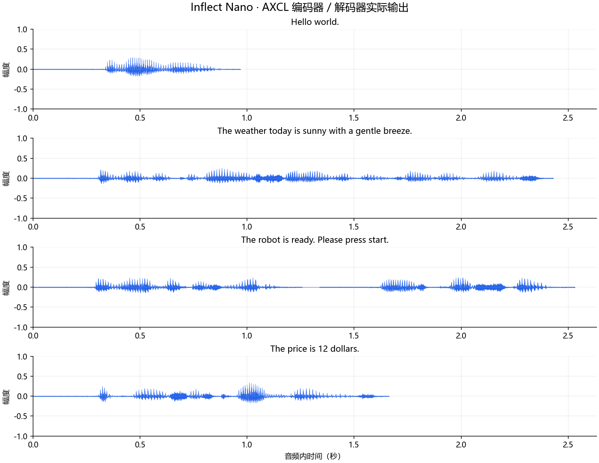

# inflect_nano_v2 部署指南

inflect_nano_v2 用于语音合成。本页说明 M.2 算力卡的接入条件、部署步骤与结果检查方法。

> 已实测，效果仍需评估。[查看部署效果](#查看部署效果)。

## 准备运行环境

本页效果展示使用 **RK3576 + AX8850 16GB M.2**；其他容量或平台需重新确认模型能否加载并正确运行。

在连接算力卡的 Linux 主机终端执行，RK3576 使用 ARM64 环境。首次部署先完成[驱动与设备检查](../../usage/device-check.md)、[安装 PyAXEngine](../../usage/python.md)和[下载工具安装](../../usage/download-models.md#使用-hugging-face-下载)。已完成这些步骤可直接下载模型。

后文使用设备 0，运行前用 `axcl-smi` 确认设备可用。

## 下载模型与样例

本页使用 `AXERA-TECH/inflect_nano_v2` 的固定版本。下面下载本页选用的 31 个文件。

```bash
MODEL_DIR=~/edgeaccel/models/inflect-nano-v2/b57a7ddf5bed
mkdir -p "$MODEL_DIR"
~/edgeaccel/hf-env/bin/hf download AXERA-TECH/inflect_nano_v2 \
  "LICENSE" \
  "NOTICE.md" \
  "README.md" \
  "THIRD_PARTY_NOTICES.md" \
  "models/config.json" \
  "models/dp.onnx" \
  "models/emb_weight.npy" \
  "models/inflect_decoder.axmodel" \
  "models/inflect_encoder.axmodel" \
  "models/model_meta.json" \
  "python/inflect_tts_sdk/README.md" \
  "python/inflect_tts_sdk/__init__.py" \
  "python/inflect_tts_sdk/__main__.py" \
  "python/inflect_tts_sdk/inference.py" \
  "python/inflect_tts_sdk/inflect_nano_v2_frontend.py" \
  "python/inflect_tts_sdk/inflect_vits_frontend.py" \
  "python/inflect_tts_sdk/requirements.txt" \
  "python/inflect_tts_sdk/runtime/attentions.py" \
  "python/inflect_tts_sdk/runtime/commons.py" \
  "python/inflect_tts_sdk/runtime/inflect_alias_free.py" \
  "python/inflect_tts_sdk/runtime/models.py" \
  "python/inflect_tts_sdk/runtime/modules.py" \
  "python/inflect_tts_sdk/runtime/monotonic_align.py" \
  "python/inflect_tts_sdk/runtime/text/LICENSE" \
  "python/inflect_tts_sdk/runtime/text/__init__.py" \
  "python/inflect_tts_sdk/runtime/text/cleaners.py" \
  "python/inflect_tts_sdk/runtime/text/symbols.py" \
  "python/inflect_tts_sdk/runtime/transforms.py" \
  "python/inflect_tts_sdk/runtime/utils.py" \
  "python/inflect_tts_sdk/server.py" \
  "python/inflect_tts_sdk/tts_engine.py" \
  --revision b57a7ddf5bed32338a79153a43479ea9eee3cde2 \
  --local-dir "$MODEL_DIR"
cd "$MODEL_DIR"
```

保留当前终端中的 `MODEL_DIR` 变量，后续命令沿用此目录。下载受阻或需要离线复制时，见[下载方式与文件校验](../../usage/download-models.md)。

## 准备英文语音环境

本例使用官方 AX650 权重，在 **RK3576 + AX8850 16GB M.2** 上运行 Inflect Nano。编码器、解码器通过 AXCL 在卡上执行；音素前端、Embedding、时长预测和对齐由主机 CPU 完成。

在已安装 PyAXEngine 的 AXCL Python 环境中安装依赖：

```bash
python -m pip install 'numpy==1.26.4' 'onnxruntime==1.20.1' \
  'soundfile==0.13.1' 'phonemizer==3.3.0' 'num2words==0.5.14' \
  'Unidecode==1.4.0' 'espeakng-loader==0.2.4'
python -c "import axengine; print(axengine.get_available_providers())"
axcl-smi
```

确认提供者包含 `AXCLRTExecutionProvider`，设备 0 可用。本次使用 PyAXEngine `0.1.3.rc3`，通过 `espeakng-loader` 提供英文音素转换所需的 eSpeak NG 库。

下载 [英文语音运行示例](../../../static/examples/inflect_en_card.py)，保存为 `~/edgeaccel/inflect_en_card.py`。前面的固定版本下载包含约 8.0 MB 文件，保留 `models` 和 `python/inflect_tts_sdk` 目录结构。此例不需要 PyTorch，也不启动 API 服务。

## 运行短句合成

沿用下载步骤中的 `MODEL_DIR`，指定尚不存在的输出目录：

```bash
python ~/edgeaccel/inflect_en_card.py \
  --variant nano --model-dir "$MODEL_DIR" \
  --output ~/edgeaccel/results/inflect-nano-01
```

程序固定 `speed=1.0`、`variation=0.667`、`seed=0`，合成问候、天气、双句提示和数字读法四组输入。模型只加载一次，双句之间保留官方 80 ms 静音间隔。例程使用官方音素转换、对齐和采样流程，补充 AXCL 后端选择、模块导入路径及输入长度检查。

合成自己的英文短句：

```bash
python ~/edgeaccel/inflect_en_card.py \
  --variant nano --model-dir "$MODEL_DIR" \
  --text 'Welcome to the voice assistant.' \
  --output ~/edgeaccel/results/inflect-nano-custom-01
```

每句限制为 200 个含空白符的音素 token，最多解码 500 帧。超限时缩短句子；例程报错停止，不静默截断。本模型面向英文，不能用它替代中文语音模型。

## 播放实际语音

| 文件 | 用途 |
| --- | --- |
| `01-english.wav` 至 `04-english.wav` | 四组实际生成的 24 kHz 单声道 PCM16 音频 |
| `*-raw.wav` | 官方限幅之前的浮点输出 |
| `deployment-result.json` | 原文、归一化文本、音素、后端、耗时和输出校验值 |

JSON 的 `completed` 应为 `true`，`sessions` 中两个 AXCL 模型和 `cpuSessions` 中的时长预测模型均应有实际调用。先播放 `Hello world.`，再对照数字 `12` 和双句停顿。下方播放器展示本页实际运行结果。

生成耗时包含音素前端、CPU 处理、AXCL 推理和调用记录开销，不含模型加载及 WAV 写入；RTF 为生成耗时除以音频时长。不能直接将上游 AX650 本机性能作为 M.2 卡性能。有限值、非静音和无 ±1 限幅不等于发音或听感验收通过，长文本、接口服务及真实 8GB 卡仍需单独验证。


## 查看部署效果

**已运行，效果仍需评估** · RK3576 + AX8850 16GB M.2。以下输入与输出来自本页固定版本的实际运行。

四段实际英文音频完成主机 ASR 辅助对照，三组词语对应，数字样例识别为“$12”。这只核对可识别内容，不代表音色、自然度或完整语音质量通过。

**英文短句、拼接与数字读法**

四组英文输入生成实际语音，包含一次双句拼接；数字输入的前端文本变为“The price is twelve dollars.”。编码器、解码器和 CPU 时长预测各执行五次，输出有限且非静音。尚未据此认定发音和听感合格。 使用独立的 Whisper-base 在主机 CPU 上识别本页实际 WAV，未向识别器提供目标文字提示。识别结果可能包含同音字、繁简体差异、漏词或识别器自身错误；下表用于辅助定位需要复听的位置，不是人工听审，也不是语音合成准确率。

<div className="model-effect-gallery">

<figure>

[](../../../static/validation/effects/inflect-nano-v2-20260928/waveforms.png)

<figcaption>四组实际语音波形，保持官方幅度</figcaption>
</figure>

</div>

| 输入文本 | 音频时长 | 生成耗时 | RTF |
| --- | --- | --- | --- |
| Hello world. | 0.971 s | 0.117 s | 0.121 |
| The weather today is sunny with a gentle breeze. | 2.432 s | 0.110 s | 0.045 |
| The robot is ready. Please press start. | 2.533 s | 0.223 s | 0.088 |
| The price is 12 dollars. | 1.664 s | 0.114 s | 0.068 |

| 合成输入文字 | 实际音频的 ASR 辅助转写 | 核对说明 |
| --- | --- | --- |
| Hello world. | Hello world. | 英文词语对应。 |
| The weather today is sunny with a gentle breeze. | The weather today is sunny with a gentle breeze. | 英文词语对应。 |
| The robot is ready. Please press start. | The robot is ready. Please press start. | 两句文字均被识别，停顿与自然度仍待试听。 |
| The price is 12 dollars. | The price is $12. | 识别为 $12，金额含义对应；未核实数字的实际发音。 |

Hello world.

<audio controls preload="metadata" src="/validation/effects/inflect-nano-v2-20260928/01-english.wav" aria-label="Hello world."></audio>

[下载音频](../../../static/validation/effects/inflect-nano-v2-20260928/01-english.wav)

The weather today is sunny with a gentle breeze.

<audio controls preload="metadata" src="/validation/effects/inflect-nano-v2-20260928/02-english.wav" aria-label="The weather today is sunny with a gentle breeze."></audio>

[下载音频](../../../static/validation/effects/inflect-nano-v2-20260928/02-english.wav)

The robot is ready. Please press start.

<audio controls preload="metadata" src="/validation/effects/inflect-nano-v2-20260928/03-english.wav" aria-label="The robot is ready. Please press start."></audio>

[下载音频](../../../static/validation/effects/inflect-nano-v2-20260928/03-english.wav)

The price is 12 dollars.

<audio controls preload="metadata" src="/validation/effects/inflect-nano-v2-20260928/04-english.wav" aria-label="The price is 12 dollars."></audio>

[下载音频](../../../static/validation/effects/inflect-nano-v2-20260928/04-english.wav)

**使用时注意：**

- 本次仅完成流程与输出检查，尚未做听音和 ASR 对照；前端将12转换为twelve不等同于实际发音已验收。
- 官方输出幅度存在量化台阶；本次波形保持实际幅度，没有另外放大或降噪。长文本、音色和拼接听感需独立评估。

这些结果用于对照部署后的输出，未覆盖完整数据集精度或长期连续运行。

<details>
<summary>查看样例环境与运行耗时</summary>

环境：RK3576 + AX8850 16GB M.2。模型版本：`b57a7ddf5bed32338a79153a43479ea9eee3cde2`。

| 组件 | 版本或配置 |
| --- | --- |
| 主机 / 内核 | RK3576，约 4GB RAM，6.1.115-vendor-rk35xx |
| AXCL / 驱动 | V3.16.0_20260729180218 |
| 固件 / CMM | V3.16.0 / 15232 MiB |
| Python 推理 | Python 3.12 / PyAXEngine 0.1.3.rc3 / NumPy 1.26.4 / AXCLRTExecutionProvider |

| 指标 | 实测值 | 计时或统计范围 |
| --- | --- | --- |
| 实际输出 | 4 段 / 24 kHz / 单声道 | 五个句子片段，speed=1、variation=0.667、seed=0；模型复用。 |
| 单组生成耗时 | 0.110–0.223 s | 包含音素前端、CPU处理和AXCL推理；不含模型加载和WAV写入。 |
| 生成 RTF | 0.045–0.121 | 生成耗时 / 音频时长，不是首包或纯 NPU 延迟。 |

适用范围：

- 采用官方 AX650 权重在 AX8850 16GB 上实测；不代表 AX620E、AX637 或真实 8GB 卡通过。
- 本次独立 ASR 仅辅助对照可识别文字，未做人类听审、发音准确率或音色自然度验收。

</details>

遇到加载、内存或后端错误时，按[常见问题](../../usage/troubleshooting.md)处理。需要更换输入或接入业务时，按[检查输出与记录结果](../../reference/validation.md)保留自己的结果。

<details>
<summary>查看文件用途与版本信息</summary>

| 文件 / 目录内路径 | 用途 |
| --- | --- |
| [`python/inflect_tts_sdk/__main__.py`](https://huggingface.co/AXERA-TECH/inflect_nano_v2/blob/b57a7ddf5bed32338a79153a43479ea9eee3cde2/python/inflect_tts_sdk/__main__.py) | Python 程序 / 前后处理 |
| [`python/inflect_tts_sdk/inference.py`](https://huggingface.co/AXERA-TECH/inflect_nano_v2/blob/b57a7ddf5bed32338a79153a43479ea9eee3cde2/python/inflect_tts_sdk/inference.py) | Python 程序 / 前后处理 |
| [`models/inflect_decoder.axmodel`](https://huggingface.co/AXERA-TECH/inflect_nano_v2/blob/b57a7ddf5bed32338a79153a43479ea9eee3cde2/models/inflect_decoder.axmodel) | 编译模型；按目录区分芯片和规格 |
| [`models/inflect_encoder.axmodel`](https://huggingface.co/AXERA-TECH/inflect_nano_v2/blob/b57a7ddf5bed32338a79153a43479ea9eee3cde2/models/inflect_encoder.axmodel) | 编译模型；按目录区分芯片和规格 |
| [`config.json`](https://huggingface.co/AXERA-TECH/inflect_nano_v2/blob/b57a7ddf5bed32338a79153a43479ea9eee3cde2/config.json) | 运行配置 |
| [`models/config.json`](https://huggingface.co/AXERA-TECH/inflect_nano_v2/blob/b57a7ddf5bed32338a79153a43479ea9eee3cde2/models/config.json) | 运行配置 |
| [`python/inflect_tts_sdk/requirements.txt`](https://huggingface.co/AXERA-TECH/inflect_nano_v2/blob/b57a7ddf5bed32338a79153a43479ea9eee3cde2/python/inflect_tts_sdk/requirements.txt) | Python 依赖清单 |
| [`run.sh`](https://huggingface.co/AXERA-TECH/inflect_nano_v2/blob/b57a7ddf5bed32338a79153a43479ea9eee3cde2/run.sh) | 启动或构建脚本 |

仓库提交：`b57a7ddf5bed32338a79153a43479ea9eee3cde2`。仓库中的 2 个 `.axmodel` 文件可能包括多个芯片、规格和分片。运行时使用本页指定的配套文件，完整列表见[固定版本目录](https://huggingface.co/AXERA-TECH/inflect_nano_v2/tree/b57a7ddf5bed32338a79153a43479ea9eee3cde2)。

</details>

## 参考资料

- [常用术语](../../reference/glossary.md)：AXCL、CMM、分词器与推理指标。
- [固定版本文件表](https://huggingface.co/AXERA-TECH/inflect_nano_v2/tree/b57a7ddf5bed32338a79153a43479ea9eee3cde2)。
- [模型卡 / 使用说明](https://huggingface.co/AXERA-TECH/inflect_nano_v2/blob/b57a7ddf5bed32338a79153a43479ea9eee3cde2/README.md)。
- [主要程序入口：python/inflect_tts_sdk/tts_engine.py](https://huggingface.co/AXERA-TECH/inflect_nano_v2/blob/b57a7ddf5bed32338a79153a43479ea9eee3cde2/python/inflect_tts_sdk/tts_engine.py)。

返回[完整模型目录](../catalog.mdx)。
