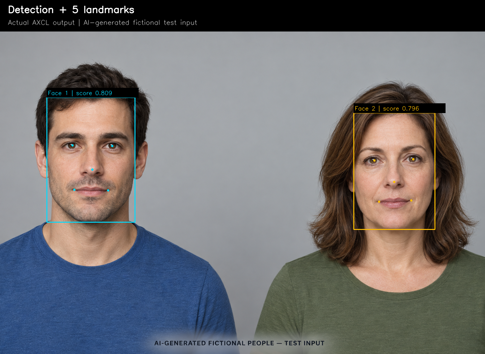
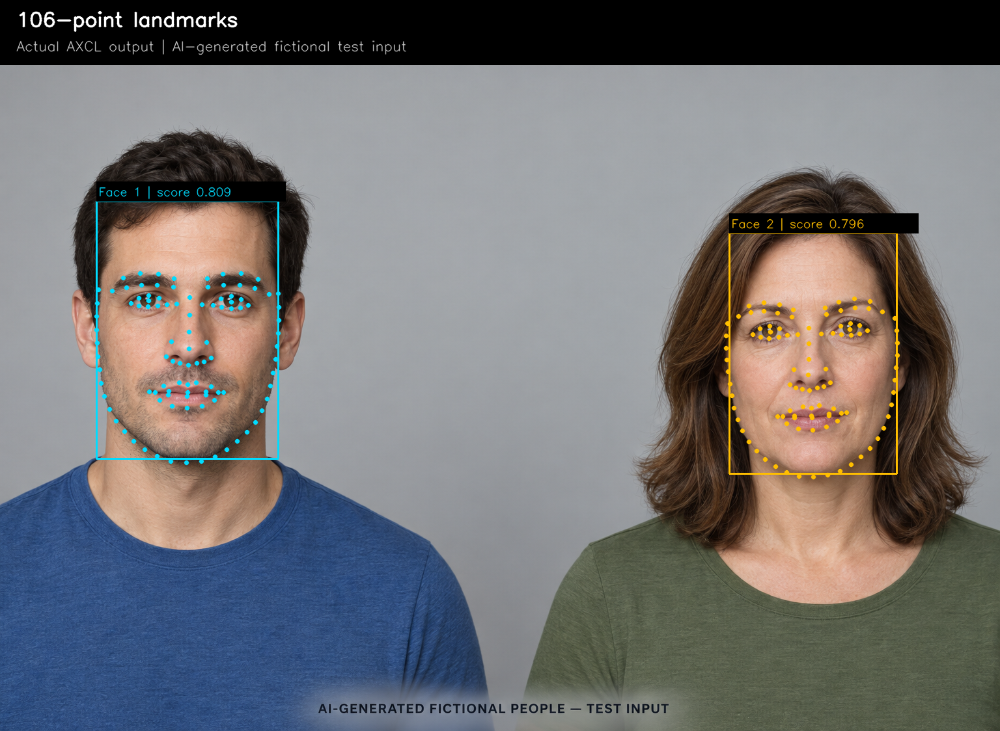
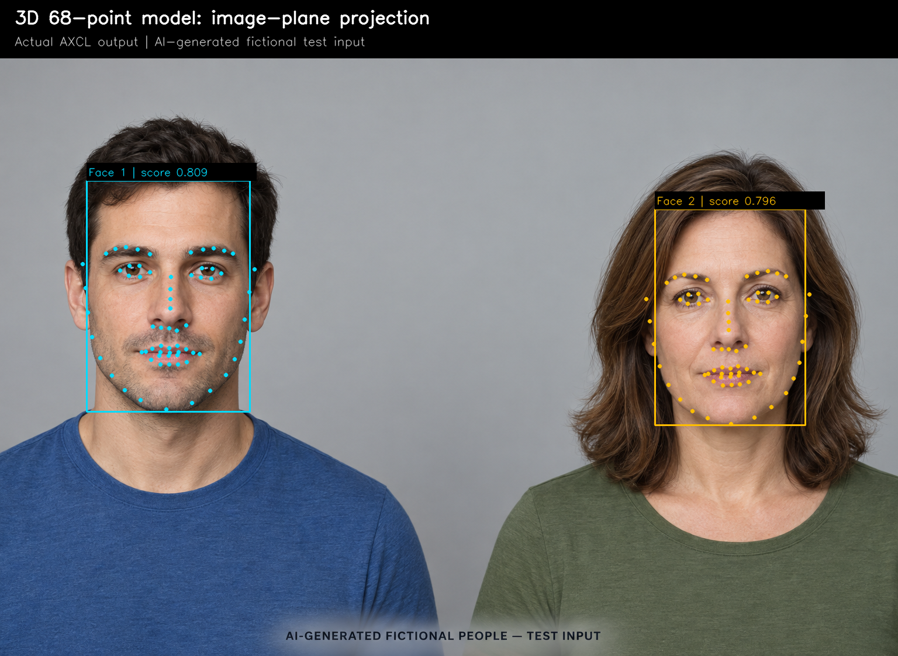

# Insightface 部署指南

Insightface 用于图像特征提取。本页说明 M.2 算力卡的接入条件、部署步骤与结果检查方法。

> 已实测，效果仍需评估。[查看部署效果](#查看部署效果)。

## 准备运行环境

本页效果展示使用 **RK3576 + AX8850 16GB M.2**；其他容量或平台需重新确认模型能否加载并正确运行。

在连接算力卡的 Linux 主机终端执行，RK3576 使用 ARM64 环境。首次部署先完成[驱动与设备检查](../../usage/device-check.md)、[安装 PyAXEngine](../../usage/python.md)和[下载工具安装](../../usage/download-models.md#使用-hugging-face-下载)。已完成这些步骤可直接下载模型。

后文使用设备 0，运行前用 `axcl-smi` 确认设备可用。

## 下载模型与样例

本页使用 `AXERA-TECH/Insightface` 的固定版本。下面下载本页选用的 15 个文件。

```bash
MODEL_DIR=~/edgeaccel/models/insightface/8975d3d5bcfb
mkdir -p "$MODEL_DIR"
~/edgeaccel/hf-env/bin/hf download AXERA-TECH/Insightface \
  "README.md" \
  "insightface/app/common.py" \
  "insightface/data/objects/meanshape_68.pkl" \
  "insightface/model_zoo/arcface_onnx.py" \
  "insightface/model_zoo/attribute.py" \
  "insightface/model_zoo/landmark.py" \
  "insightface/model_zoo/retinaface.py" \
  "insightface/utils/face_align.py" \
  "insightface/utils/transform.py" \
  "models/buffalo_l/1k3d68.axmodel" \
  "models/buffalo_l/2d106det.axmodel" \
  "models/buffalo_l/det_10g.axmodel" \
  "models/buffalo_l/genderage.axmodel" \
  "models/buffalo_l/w600k_r50.axmodel" \
  "requirements.txt" \
  --revision 8975d3d5bcfbbd788e4a97d4bdc4342810bb4d8e \
  --local-dir "$MODEL_DIR"
cd "$MODEL_DIR"
```

保留当前终端中的 `MODEL_DIR` 变量，后续命令沿用此目录。下载受阻或需要离线复制时，见[下载方式与文件校验](../../usage/download-models.md)。

## 准备 Python 环境

先按 [Python 接口](../../usage/python.md) 安装 PyAXEngine，再在连接算力卡的 RK3576 主机执行：

```bash
source ~/edgeaccel/python-env/bin/activate
python -m pip install 'numpy==1.26.4' 'opencv-python-headless==4.11.0.86' 'scikit-image==0.25.2'
python -c "import axengine; print(axengine.get_available_providers())"
```

输出须包含 `AXCLRTExecutionProvider`。本页运行固定版本 `buffalo_l` 的五份权重，覆盖检测、106 点关键点、3D 68 点关键点、属性和 512 维特征。

上游将预训练权重用于非商业研究评估，商业使用需单独确认授权；见 [InsightFace 模型说明](https://github.com/deepinsight/insightface/blob/master/python-package/docs/model_zoo.md)。本页展示部署方法和样例输出，不代表模型已获商业授权。

## 准备测试图片

下载 [两张虚构人脸测试图](../../../static/validation/effects/insightface-20260928/input.png)，保存为 `$MODEL_DIR/fictional-people.png`，并校验：

```bash
echo '16c9acc754c595d92be86b2ea452f603b92d952ad068fc24265406636640b7d4  '"$MODEL_DIR/fictional-people.png" | sha256sum -c -
```

结果须为 `OK`。图片由 AI 生成，人物为虚构角色，没有真实身份或年龄、性别标注。下方检测框和关键点来自算力卡的实际推理，不是生成图片自带的标注。

## 运行五份模型

下载 [Insightface 算力卡示例](../../../static/examples/insightface_card.py)，保存为 `~/edgeaccel/insightface_card.py`。在同一主机终端执行：

```bash
python ~/edgeaccel/insightface_card.py \
  --model-dir "$MODEL_DIR" \
  --image "$MODEL_DIR/fictional-people.png" \
  --output ~/edgeaccel/results/insightface-01
```

输出目录须尚不存在。当前示例固定使用上方图片，依次处理原图、重复图和同尺寸空白图。各模型显式使用 AXCL 后端；图片前后处理在主机完成。

本次检测结果为 `2、2、0` 张人脸。检测模型调用三次；其余四份模型各调用四次，分别处理原图和重复图中的两张人脸，共 19 次调用。空白图没有检测到人脸，因此不调用后续四份模型。

`deployment-result.json` 中的 `completed` 应为 `true`。其中 `faces` 记录检测框、5 点、106 点、3D 68 点、姿态角、属性预测和特征向量；`sessions` 记录每份权重的形状与实际调用耗时。

## 查看检测与关键点

下载 [结果绘图脚本](../../../static/examples/insightface_view.py)，保存为 `~/edgeaccel/insightface_view.py`，执行：

```bash
python ~/edgeaccel/insightface_view.py \
  --result-dir ~/edgeaccel/results/insightface-01
```

在输出目录打开 `detection.png`、`landmarks-106.png` 和 `landmarks-68.png`，依次查看检测框与 5 点、106 点关键点、3D 68 点在原图平面的位置。绘图脚本读取实际结果，不会再次调用模型。

编号按图片从左到右排列，仅表示本张图片中的位置。3D 模型的第三维和姿态角是模型估计，不是经过标定的距离或测量值。

## 查看属性与特征结果

下方列出两张虚构人脸的属性预测，以及两条 512 维向量的余弦相似度。属性输出为模型分类和年龄估计，没有真值可用于计算准确率；相似度也不能直接作为身份判定阈值。

本次重复输入的原始模型输入、输出和最终结果完全一致，空白图未检出人脸。实际业务仍需补充合法测试数据、浮点模型对照和适用阈值评估；本页单张合成图片的结果不代表真实人群精度。


## 查看部署效果

**已运行，效果仍需评估** · 2026-09-28 · RK3576 + AX8850 16GB M.2。以下输入与输出来自本页固定版本的实际运行。

五份Insightface权重已在16GB算力卡实际运行，提供检测、106点、3D 68点、属性及特征输出，并完成重复与空白输入检查。

**检测框与五点关键点**

输入为AI生成的虚构人物；青色为左侧人脸，黄色为右侧人脸。检测框与坐标均来自本次AXCL推理。

<div className="model-effect-gallery">

<figure>

[](../../../static/validation/effects/insightface-20260928/detection.png)

<figcaption>真实检测结果：两张人脸及各自的五点关键点</figcaption>
</figure>

</div>

| 位置 | 检测分数 | 五点数量 |
| --- | --- | --- |
| 左侧 | 0.808870 | 5 |
| 右侧 | 0.796112 | 5 |

**106 点关键点**

每张人脸单独裁剪后运行2d106det，再把106个点映射回原图。下图由板端绘图脚本读取实际结果生成。

<div className="model-effect-gallery">

<figure>

[](../../../static/validation/effects/insightface-20260928/landmarks-106.png)

<figcaption>2d106det 的实际 106 点输出，按原图坐标绘制</figcaption>
</figure>

</div>

**3D 68 点与姿态估计**

图中仅绘制68个点的二维位置。下表为官方后处理计算的俯仰、偏航和滚转角，没有标定真值，不能当作测量精度。

<div className="model-effect-gallery">

<figure>

[](../../../static/validation/effects/insightface-20260928/landmarks-68.png)

<figcaption>1k3d68 的实际 68 点输出，仅展示在原图平面的位置</figcaption>
</figure>

</div>

| 位置 | 俯仰 / ° | 偏航 / ° | 滚转 / ° |
| --- | --- | --- | --- |
| 左侧 | -6.966 | 2.719 | 2.022 |
| 右侧 | -4.580 | 1.312 | -0.993 |

**虚构人脸的属性与特征输出**

属性模型输出左侧类别1、年龄估计35，右侧类别0、年龄估计64。这里保留模型原始类别编码，不将预测当作人物事实。两个512维特征的余弦相似度如下，未设置身份判定阈值。

| 位置 | 属性类别 | 年龄估计 | 特征维数 |
| --- | --- | --- | --- |
| 左侧 | 1 | 35 | 512 |
| 右侧 | 0 | 64 | 512 |

| 向量 | 与左侧相似度 | 与右侧相似度 |
| --- | --- | --- |
| 左侧 | 1.000000 | 0.289102 |
| 右侧 | 0.289102 | 1.000000 |

**五份权重与重复输入**

五份权重均发生了实际推理。原图与重复图的每次输入、输出和最终结果完全一致；空白图只运行检测模型，没有检出人脸。耗时为AXCL调用，包含调用传输，不含加载、前后处理和证据写入。

| 权重 | 调用次数 | 平均 / ms |
| --- | --- | --- |
| det_10g.axmodel | 3 | 31.185 |
| 2d106det.axmodel | 4 | 3.856 |
| 1k3d68.axmodel | 4 | 5.392 |
| genderage.axmodel | 4 | 2.761 |
| w600k_r50.axmodel | 4 | 6.211 |

| 输入 | 检测人数 |
| --- | --- |
| 原图 | 2 |
| 重复图 | 2 |
| 空白图 | 0 |

**使用时注意：**

- 输入为两张AI生成的虚构人脸，没有年龄、属性、身份或关键点真值；当前只能确认基础运行和输出处理。
- 特征相似度没有经过阈值校准，不能作为身份识别准确率。3D坐标与姿态未做相机标定或测量精度评估。

这些结果用于对照部署后的输出，未覆盖完整数据集精度或长期连续运行。

<details>
<summary>查看样例环境与运行耗时</summary>

环境：RK3576 + AX8850 16GB M.2。日期：2026-09-28。模型版本：`8975d3d5bcfbbd788e4a97d4bdc4342810bb4d8e`。

| 组件 | 版本或配置 |
| --- | --- |
| 主机 / 内核 | RK3576，约 4GB RAM，6.1.115-vendor-rk35xx |
| AXCL / 驱动 | V3.16.0_20260729180218 |
| 固件 / CMM | V3.16.0 / 15232 MiB |
| Python 推理 | Python 3.12 / PyAXEngine 0.1.3.rc3 / NumPy 1.26.4 / AXCLRTExecutionProvider |

| 指标 | 实测值 | 计时或统计范围 |
| --- | --- | --- |
| 已运行权重 | 5 / 5 | det_10g、2d106det、1k3d68、genderage、w600k_r50；共19次实际AXCL调用。 |
| 原图 / 重复 / 空白 | 2 / 2 / 0 张人脸 | 同一张1536×1024合成图片及全零图片；不是检测数据集准确率。 |
| 输入输出复核 | 重复结果完全一致 | 独立复算检测解码、NMS、图像裁剪、关键点映射、属性和余弦；无浮点模型精度对照。 |

适用范围：

- 输入为两张AI生成的虚构人脸，没有年龄、属性、身份或关键点真值；当前只能确认基础运行和输出处理。
- 特征相似度没有经过阈值校准，不能作为身份识别准确率。3D坐标与姿态未做相机标定或测量精度评估。
- 本次使用16GB卡，真实8GB容量与长时间连续运行需另行验证。

</details>

遇到加载、内存或后端错误时，按[常见问题](../../usage/troubleshooting.md)处理。需要更换输入或接入业务时，按[检查输出与记录结果](../../reference/validation.md)保留自己的结果。

<details>
<summary>查看文件用途与版本信息</summary>

| 文件 / 目录内路径 | 用途 |
| --- | --- |
| [`insightface_pipeline.py`](https://huggingface.co/AXERA-TECH/Insightface/blob/8975d3d5bcfbbd788e4a97d4bdc4342810bb4d8e/insightface_pipeline.py) | Python 程序 / 前后处理 |
| [`models/buffalo_l/1k3d68.axmodel`](https://huggingface.co/AXERA-TECH/Insightface/blob/8975d3d5bcfbbd788e4a97d4bdc4342810bb4d8e/models/buffalo_l/1k3d68.axmodel) | 编译模型；按目录区分芯片和规格 |
| [`models/buffalo_l/2d106det.axmodel`](https://huggingface.co/AXERA-TECH/Insightface/blob/8975d3d5bcfbbd788e4a97d4bdc4342810bb4d8e/models/buffalo_l/2d106det.axmodel) | 编译模型；按目录区分芯片和规格 |
| [`models/buffalo_l/det_10g.axmodel`](https://huggingface.co/AXERA-TECH/Insightface/blob/8975d3d5bcfbbd788e4a97d4bdc4342810bb4d8e/models/buffalo_l/det_10g.axmodel) | 编译模型；按目录区分芯片和规格 |
| [`models/buffalo_l/genderage.axmodel`](https://huggingface.co/AXERA-TECH/Insightface/blob/8975d3d5bcfbbd788e4a97d4bdc4342810bb4d8e/models/buffalo_l/genderage.axmodel) | 编译模型；按目录区分芯片和规格 |
| [`models/buffalo_l/w600k_r50.axmodel`](https://huggingface.co/AXERA-TECH/Insightface/blob/8975d3d5bcfbbd788e4a97d4bdc4342810bb4d8e/models/buffalo_l/w600k_r50.axmodel) | 编译模型；按目录区分芯片和规格 |
| [`config.json`](https://huggingface.co/AXERA-TECH/Insightface/blob/8975d3d5bcfbbd788e4a97d4bdc4342810bb4d8e/config.json) | 运行配置 |
| [`requirements.txt`](https://huggingface.co/AXERA-TECH/Insightface/blob/8975d3d5bcfbbd788e4a97d4bdc4342810bb4d8e/requirements.txt) | Python 依赖清单 |

仓库提交：`8975d3d5bcfbbd788e4a97d4bdc4342810bb4d8e`。仓库中的 5 个 `.axmodel` 文件可能包括多个芯片、规格和分片。运行时使用本页指定的配套文件，完整列表见[固定版本目录](https://huggingface.co/AXERA-TECH/Insightface/tree/8975d3d5bcfbbd788e4a97d4bdc4342810bb4d8e)。

</details>

## 参考资料

- [常用术语](../../reference/glossary.md)：AXCL、CMM、分词器与推理指标。
- [固定版本文件表](https://huggingface.co/AXERA-TECH/Insightface/tree/8975d3d5bcfbbd788e4a97d4bdc4342810bb4d8e)。
- [模型卡 / 使用说明](https://huggingface.co/AXERA-TECH/Insightface/blob/8975d3d5bcfbbd788e4a97d4bdc4342810bb4d8e/README.md)。
- [主要程序入口：insightface_pipeline.py](https://huggingface.co/AXERA-TECH/Insightface/blob/8975d3d5bcfbbd788e4a97d4bdc4342810bb4d8e/insightface_pipeline.py)。
- [ModelScope 对应资源](https://modelscope.cn/models/AXERA-TECH/Insightface)。不同平台的 revision 不通用，另行记录版本。

返回[完整模型目录](../catalog.mdx)。
