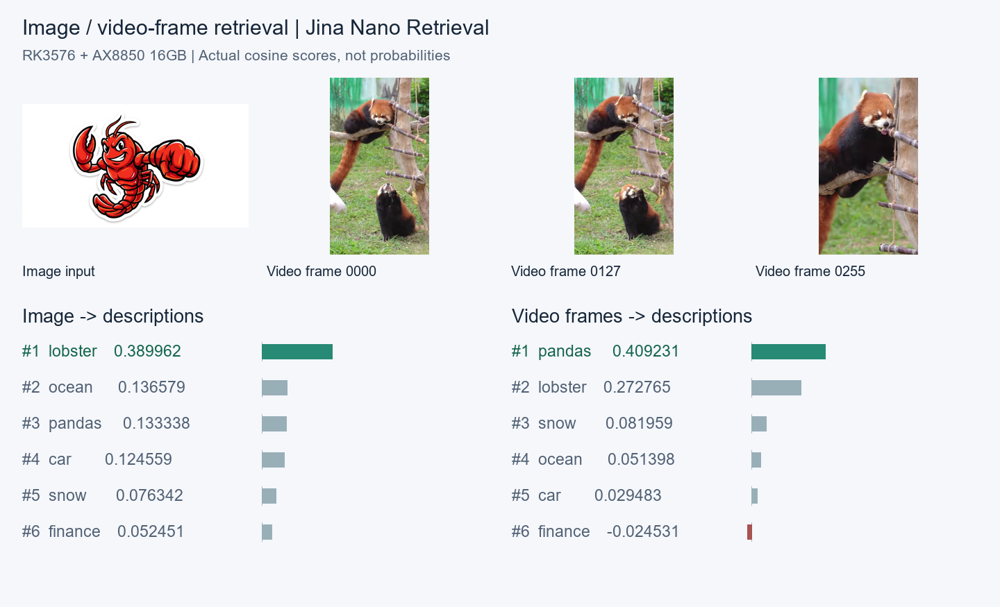

# jina-embeddings-v5-omni-nano-retrieval 部署指南

jina-embeddings-v5-omni-nano-retrieval 用于文本、图片、音频与视频帧检索。本页说明 M.2 算力卡的接入条件、部署步骤与结果检查方法。

> 已实测，效果仍需评估。[查看部署效果](#查看部署效果)。

## 准备运行环境

本页效果展示使用 **RK3576 + AX8850 16GB M.2**；其他容量或平台需重新确认模型能否加载并正确运行。

在连接算力卡的 Linux 主机终端执行，RK3576 使用 ARM64 环境。首次部署先完成[驱动与设备检查](../../usage/device-check.md)、[准备主机环境](../../getting-started/prepare.md)和[下载工具安装](../../usage/download-models.md#使用-hugging-face-下载)。已完成这些步骤可直接下载模型。

后文使用设备 0，运行前用 `axcl-smi` 确认设备可用。

## 下载模型与样例

本页使用 `AXERA-TECH/jina-embeddings-v5-omni-nano-retrieval` 的固定版本。下面下载本页选用的 39 个文件。

```bash
MODEL_DIR=~/edgeaccel/models/jina-embeddings-v5-omni-nano-retrieval/6a92e331bd88
mkdir -p "$MODEL_DIR"
~/edgeaccel/hf-env/bin/hf download AXERA-TECH/jina-embeddings-v5-omni-nano-retrieval \
  --include "jina_v5_omni_tokenizer/*" "assets/*" "jina_v5_omni_nano_audio_30s.axmodel" "jina_v5_omni_nano_audio_8s.axmodel" "jina_v5_omni_nano_vision_256x256.axmodel" "llama_p128_l0_together.axmodel" "llama_p128_l10_together.axmodel" "llama_p128_l11_together.axmodel" "llama_p128_l1_together.axmodel" "llama_p128_l2_together.axmodel" "llama_p128_l3_together.axmodel" "llama_p128_l4_together.axmodel" "llama_p128_l5_together.axmodel" "llama_p128_l6_together.axmodel" "llama_p128_l7_together.axmodel" "llama_p128_l8_together.axmodel" "llama_p128_l9_together.axmodel" "llama_post.axmodel" "model.embed_tokens.weight.bfloat16.bin" \
  --revision 6a92e331bd8813a98e2eac602b6f9412a7eec709 \
  --local-dir "$MODEL_DIR"
cd "$MODEL_DIR"
```

保留当前终端中的 `MODEL_DIR` 变量，后续命令沿用此目录。下载受阻或需要离线复制时，见[下载方式与文件校验](../../usage/download-models.md)。

## 安装算力卡运行包

本例在 RK3576 + AX8850 **16GB M.2** 上运行文本、图片、音频和视频帧检索，输出 768 维归一化向量。固定仓库中的检索权重已经合并任务参数，输入通过 `query`、`document` 区分查询和候选内容。

下载 [算力卡运行包](../../../static/examples/jina-nano-retrieval-native-20260929.tar.gz)，保存为 `~/edgeaccel/jina-nano-retrieval-native-20260929.tar.gz`。包内包含已实测的 ARM64 库、C++ 源码、Python 入口及模型张量配置，通过 **AXCL Native API** 使用设备 0。

在安装了 AXCL V3.16.0 和 Python 3.12 的 ARM64 主机执行：

```bash
cd ~/edgeaccel
tar -xzf jina-nano-retrieval-native-20260929.tar.gz
python3 -m venv jina-retrieval-env
source jina-retrieval-env/bin/activate
python -m pip install 'numpy==1.26.4' 'ml_dtypes==0.5.3' \
  'Pillow==11.3.0' 'tokenizers==0.21.4' 'Jinja2==3.1.6' \
  'scipy==1.17.1' 'soundfile==0.13.1' 'torch==2.5.1' 'transformers==4.51.3'
axcl-smi
```

模型及样例约 2.23GB，另为 Python 依赖、下载缓存和输出预留空间。模型下载完成后，推理只读取本地文件。保留前面下载步骤中的 `MODEL_DIR` 变量。

需要重新编译配套库时，在安装 AXCL 开发头文件的主机执行：

```bash
cd ~/edgeaccel/jina-nano-retrieval
g++ -std=c++17 -O2 -shared -fPIC -Wall -Wextra -Werror \
  jina_native_bridge.cpp -I/usr/include/axcl -L/usr/lib/axcl \
  -laxcl_rt -laxcl_npu -Wl,-rpath,/usr/lib/axcl \
  -o libjina_native_bridge.so
```

## 运行图片与视频帧检索

用仓库中的龙虾图片、小熊猫视频帧，检索六条文字描述：

```bash
python - "$MODEL_DIR" <<'PY'
import json, sys
from pathlib import Path
model = Path(sys.argv[1]).resolve()
requests = [
    {"id": "image", "modality": "image", "role": "query",
     "file": str(model / "assets/sample.png")},
    {"id": "video", "modality": "video", "role": "query",
     "file": str(model / "assets/red-panda-openai.frames")}
]
descriptions = {
    "lobster": "A red cartoon lobster with large claws on a white background.",
    "pandas": "Red pandas climb on branches in an outdoor enclosure.",
    "ocean": "A sunset over the ocean.",
    "car": "An automobile driving on a highway.",
    "finance": "Financial markets and quarterly company earnings.",
    "snow": "A snowy mountain landscape."
}
requests += [{"id": k, "modality": "text", "role": "document", "text": v}
             for k, v in descriptions.items()]
Path.home().joinpath('edgeaccel/jina-retrieval-inputs.json').write_text(
    json.dumps(requests, ensure_ascii=False, indent=2), encoding='utf-8')
PY

python ~/edgeaccel/jina-nano-retrieval/jina_retrieval_card.py \
  --model-dir "$MODEL_DIR" --inputs ~/edgeaccel/jina-retrieval-inputs.json \
  --output ~/edgeaccel/results/jina-retrieval-01
```

输出目录须尚不存在。读取实际排名：

```bash
python - <<'PY'
import json
from pathlib import Path
r = json.loads(Path.home().joinpath(
    'edgeaccel/results/jina-retrieval-01/result.json').read_text(encoding='utf-8'))
print('完成：', r['completed'])
for i in [0, 1]:
    ranked = sorted(range(2, len(r['calls'])),
                    key=lambda j: r['similarityMatrix'][i][j], reverse=True)
    print(r['calls'][i]['id'])
    for j in ranked:
        print(r['calls'][j]['id'], round(r['similarityMatrix'][i][j], 6))
PY
```

图片缩放到 256 × 256，转换为 64 个特征 token。视频输入为按文件名排序的图片目录，本例使用仓库中的三张抽帧图片；每帧分别编码后合并为 192 个特征 token。本入口不直接解码 MP4，也不分析视频音轨。对自有视频先抽帧并检查顺序，再传入帧目录。

## 运行文本检索

把输入 JSON 改为查询与候选文本，运行命令沿用前一节，并更换输出目录：

```json
[
  {"id": "query", "role": "query", "text": "Which planet is known as the Red Planet?"},
  {"id": "mars", "role": "document", "text": "Mars is often called the Red Planet because of its reddish surface."},
  {"id": "finance", "role": "document", "text": "Quarterly revenue increased while operating costs declined."}
]
```

`similarityMatrix[0][1]` 为查询与火星描述的分数，`similarityMatrix[0][2]` 为查询与财务描述的分数。本次分别为 **0.769048**、**0.014609**。分数是余弦相似度，不是概率。

## 编码 8 秒与 30 秒音频

音频必须为 **16kHz、单声道**，时长不超过所选规格。使用仓库的两个 WAV 样例：

```bash
python - "$MODEL_DIR" <<'PY'
import json, sys
from pathlib import Path
model = Path(sys.argv[1]).resolve()
requests = [
    {"id": f"audio-{seconds}s", "modality": "audio", "role": "query",
     "file": str(model / f"assets/audio_test_chunk0_{seconds}s.wav"),
     "audioSeconds": seconds}
    for seconds in [8, 30]
]
Path.home().joinpath('edgeaccel/jina-audio-inputs.json').write_text(
    json.dumps(requests, indent=2), encoding='utf-8')
PY

python ~/edgeaccel/jina-nano-retrieval/jina_retrieval_card.py \
  --model-dir "$MODEL_DIR" --inputs ~/edgeaccel/jina-audio-inputs.json \
  --output ~/edgeaccel/results/jina-audio-01
```

8 秒、30 秒规格分别补齐到 800、3000 个 Mel 帧，输出 200、750 个音频特征 token，再进入文本编码部分。较短录音同样按所选规格补齐。本页验证了两个规格的向量输出和参考向量一致性；音频不会直接返回转录文本。建立音文检索时，需要另外编码候选描述，并用业务录音检查排名。

## 检查输出与输入范围

`result.json` 的 `completed` 应为 `true`。每个 `calls` 项包含 768 维 `embedding`、`tokenCount` 和 `requestSeconds`；`similarityMatrix` 的行列顺序与输入一致。相似度比较应使用本模型编码的查询和候选，不混入其他模型生成的向量。

运行包按每块 128 个 token 编码，保留前面块的缓存，模板与 EOS 计入长度。总长限制为 1024 token，超长输入直接报错。分块编码与整段一次执行双向注意力并不完全相同，应结合下方参考向量差异评估业务效果。

`requestSeconds` 包含当前请求的预处理、模型加载和推理；首次音频请求还包含音频依赖初始化。不含进程启动、共享分词器和词向量初始化、最终结果写盘。当前逐请求加载模型，耗时用于复现本页流程，不代表常驻服务吞吐率。


## 查看部署效果

**已运行，效果仍需评估** · RK3576 + AX8850 16GB M.2。以下输入与输出来自本页固定版本的实际运行。

已在 16GB 算力卡完成文本、图片、8 秒与 30 秒音频、视频帧编码，并展示实际检索分数。

**文本检索：红色星球**

查询与火星描述的分数高于无关财务描述；重复查询的向量完全一致。

| 查询 | 候选文本 | 余弦分数 |
| --- | --- | --- |
| Which planet is known as the Red Planet? | Mars is often called the Red Planet because of its reddish surface. | 0.769048 |
| Which planet is known as the Red Planet? | Quarterly revenue increased while operating costs declined. | 0.014609 |

**图片与视频帧：检索对应文字描述**

单张图片与三张视频帧分别编码后，与同一组六条候选描述比较。本次图片第一名为龙虾描述，视频帧第一名为小熊猫描述。视频只使用下面三张帧，没有处理音轨；两条查询不代表通用检索准确率。

<div className="model-effect-gallery">

<figure>

[](../../../static/validation/effects/jina-embeddings-v5-omni-nano-retrieval-20260929/media-retrieval.png)

<figcaption>原始图片、三张视频帧和实际排序</figcaption>
</figure>

</div>

| 候选描述 | 图片余弦分数 | 视频帧余弦分数 |
| --- | --- | --- |
| A red cartoon lobster with large claws on a white background. | 0.389962 | 0.272765 |
| A sunset over the ocean. | 0.136579 | 0.051398 |
| Red pandas climb on branches in an outdoor enclosure. | 0.133338 | 0.409231 |
| An automobile driving on a highway. | 0.124559 | 0.029483 |
| A snowy mountain landscape. | 0.076342 | 0.081959 |
| Financial markets and quarterly company earnings. | 0.052451 | -0.024531 |

**音频输出与固定参考向量比较**

两种音频规格均输出 768 维归一化向量，8 秒使用 220 个总 token，30 秒使用 770 个总 token。下表用本卡实际输出，与同版本仓库附带的 HF 参考向量比较；参考向量由上游提供。分数衡量数值接近程度，不代表音文检索准确率。图片、8 秒音频和视频帧的重复输出均逐字节一致。

| 输入 | 总 token | 参考向量余弦 | 最大绝对差 |
| --- | --- | --- | --- |
| embedding_doc | 19 | 0.999655 | 0.003988 |
| red_planet_query | 12 | 0.999539 | 0.009185 |
| vision_sample | 82 | 0.996603 | 0.012077 |
| audio_test_chunk0_8s_wav | 220 | 0.992947 | 0.015131 |
| audio_test_chunk0_30s_wav | 770 | 0.995814 | 0.017578 |
| video_visual_red_panda_openai_mp4 | 210 | 0.997011 | 0.016054 |

官方 8 秒规格输入样例

<audio controls preload="metadata" src="/validation/effects/jina-embeddings-v5-omni-nano-retrieval-20260929/audio-8s.wav" aria-label="官方 8 秒规格输入样例"></audio>

[下载音频](../../../static/validation/effects/jina-embeddings-v5-omni-nano-retrieval-20260929/audio-8s.wav)

官方 30 秒规格输入样例

<audio controls preload="metadata" src="/validation/effects/jina-embeddings-v5-omni-nano-retrieval-20260929/audio-30s.wav" aria-label="官方 30 秒规格输入样例"></audio>

[下载音频](../../../static/validation/effects/jina-embeddings-v5-omni-nano-retrieval-20260929/audio-30s.wav)

**运行入口的实际耗时与长度范围**

最终运行入口复现六种官方输入，向量均与前面样例逐字节一致。下表计时包含各请求预处理、模型加载与推理，首次音频请求另含依赖初始化。另执行了 128、256、1024 token 的完整编码，1025 token 会在推理前拒绝；长度检查不代表长文检索质量。

| 输入 | 总 token | 请求耗时（秒） |
| --- | --- | --- |
| embedding_doc | 19 | 5.697 |
| red_planet_query | 12 | 5.429 |
| vision_sample | 82 | 8.817 |
| audio_test_chunk0_8s_wav | 220 | 28.677 |
| audio_test_chunk0_30s_wav | 770 | 45.428 |
| video_visual_red_panda_openai_mp4 | 210 | 17.660 |

**使用时注意：**

- 本次使用 16GB 卡，8GB 容量、并发和长期稳定性仍需回归。
- 音频已检查输出与固定参考向量的一致性，尚未形成有标注的音文检索评测。两条图文查询不构成准确率数据集。

这些结果用于对照部署后的输出，未覆盖完整数据集精度或长期连续运行。

<details>
<summary>查看样例环境与运行耗时</summary>

环境：RK3576 + AX8850 16GB M.2。模型版本：`6a92e331bd8813a98e2eac602b6f9412a7eec709`。

| 组件 | 版本或配置 |
| --- | --- |
| 主机 / 内核 | RK3576，约 4GB RAM，6.1.115-vendor-rk35xx |
| AXCL / 驱动 | V3.16.0_20260729180218 |
| 固件 / CMM | V3.16.0 / 15232 MiB |
| 运行方式 | Python 3.12.3 + 本页 C++ 桥接库 / AXCL Native API（设备 0）；NumPy 1.26.4；Torch 2.5.1；Transformers 4.51.3 |

| 指标 | 实测值 | 计时或统计范围 |
| --- | --- | --- |
| 向量输出 | 768 维 / L2 归一化 | 六种官方输入与固定参考向量的余弦相似度为 0.992947–0.999655。 |
| 编译权重 | 16 / 16 实际执行 | 12 个文本层、1 个后处理、1 个视觉与 2 个音频模型。 |
| 基本检索样例 | 文本 + 图片 + 视频帧 | 相关文本分数高于无关文本，图片与视频帧查询均选中对应描述。 |

适用范围：

- 本入口总长度上限 1024 token，按 128-token 块编码；已检查长度边界，尚未评估长文检索质量。
- 视频仅验证三张抽帧图片；图片固定 256×256；音频要求 16kHz 单声道且不超过所选 8 秒或 30 秒规格。
- 当前逐请求加载模型，耗时不代表常驻服务吞吐。

</details>

遇到加载、内存或后端错误时，按[常见问题](../../usage/troubleshooting.md)处理。需要更换输入或接入业务时，按[检查输出与记录结果](../../reference/validation.md)保留自己的结果。

<details>
<summary>查看文件用途与版本信息</summary>

| 文件 / 目录内路径 | 用途 |
| --- | --- |
| [`python/openai_embedding_demo.py`](https://huggingface.co/AXERA-TECH/jina-embeddings-v5-omni-nano-retrieval/blob/6a92e331bd8813a98e2eac602b6f9412a7eec709/python/openai_embedding_demo.py) | Python 程序 / 前后处理 |
| [`python/openai_multimodal_embedding_demo.py`](https://huggingface.co/AXERA-TECH/jina-embeddings-v5-omni-nano-retrieval/blob/6a92e331bd8813a98e2eac602b6f9412a7eec709/python/openai_multimodal_embedding_demo.py) | Python 程序 / 前后处理 |
| [`config.json`](https://huggingface.co/AXERA-TECH/jina-embeddings-v5-omni-nano-retrieval/blob/6a92e331bd8813a98e2eac602b6f9412a7eec709/config.json) | 运行配置 |
| [`llama_post.axmodel`](https://huggingface.co/AXERA-TECH/jina-embeddings-v5-omni-nano-retrieval/blob/6a92e331bd8813a98e2eac602b6f9412a7eec709/llama_post.axmodel) | 编译模型；按目录区分芯片和规格 |
| [`model.embed_tokens.weight.bfloat16.bin`](https://huggingface.co/AXERA-TECH/jina-embeddings-v5-omni-nano-retrieval/blob/6a92e331bd8813a98e2eac602b6f9412a7eec709/model.embed_tokens.weight.bfloat16.bin) | Embedding 权重 |
| [`jina_v5_omni_tokenizer.txt`](https://huggingface.co/AXERA-TECH/jina-embeddings-v5-omni-nano-retrieval/blob/6a92e331bd8813a98e2eac602b6f9412a7eec709/jina_v5_omni_tokenizer.txt) | 分词器 / 字典，必须配套 |
| [`jina_v5_omni_nano_vision_256x256.axmodel`](https://huggingface.co/AXERA-TECH/jina-embeddings-v5-omni-nano-retrieval/blob/6a92e331bd8813a98e2eac602b6f9412a7eec709/jina_v5_omni_nano_vision_256x256.axmodel) | 编译模型；按目录区分芯片和规格 |
| [`jina_v5_omni_nano_audio_30s.axmodel`](https://huggingface.co/AXERA-TECH/jina-embeddings-v5-omni-nano-retrieval/blob/6a92e331bd8813a98e2eac602b6f9412a7eec709/jina_v5_omni_nano_audio_30s.axmodel) | 编译模型；按目录区分芯片和规格 |
| [`jina_v5_omni_nano_audio_8s.axmodel`](https://huggingface.co/AXERA-TECH/jina-embeddings-v5-omni-nano-retrieval/blob/6a92e331bd8813a98e2eac602b6f9412a7eec709/jina_v5_omni_nano_audio_8s.axmodel) | 编译模型；按目录区分芯片和规格 |
| [`llama_p128_l0_together.axmodel`](https://huggingface.co/AXERA-TECH/jina-embeddings-v5-omni-nano-retrieval/blob/6a92e331bd8813a98e2eac602b6f9412a7eec709/llama_p128_l0_together.axmodel) | 编译模型；按目录区分芯片和规格 |
| [`llama_p128_l10_together.axmodel`](https://huggingface.co/AXERA-TECH/jina-embeddings-v5-omni-nano-retrieval/blob/6a92e331bd8813a98e2eac602b6f9412a7eec709/llama_p128_l10_together.axmodel) | 编译模型；按目录区分芯片和规格 |
| [`jina_v5_omni_tokenizer/config.json`](https://huggingface.co/AXERA-TECH/jina-embeddings-v5-omni-nano-retrieval/blob/6a92e331bd8813a98e2eac602b6f9412a7eec709/jina_v5_omni_tokenizer/config.json) | 运行配置 |
| [`jina_v5_omni_tokenizer/custom_st.py`](https://huggingface.co/AXERA-TECH/jina-embeddings-v5-omni-nano-retrieval/blob/6a92e331bd8813a98e2eac602b6f9412a7eec709/jina_v5_omni_tokenizer/custom_st.py) | 旧版分词服务入口 |
| [`jina_v5_omni_tokenizer/modeling_jina_embeddings_v5_omni.py`](https://huggingface.co/AXERA-TECH/jina-embeddings-v5-omni-nano-retrieval/blob/6a92e331bd8813a98e2eac602b6f9412a7eec709/jina_v5_omni_tokenizer/modeling_jina_embeddings_v5_omni.py) | 旧版分词服务入口 |

仓库提交：`6a92e331bd8813a98e2eac602b6f9412a7eec709`。仓库中的 16 个 `.axmodel` 文件可能包括多个芯片、规格和分片。运行时使用本页指定的配套文件，完整列表见[固定版本目录](https://huggingface.co/AXERA-TECH/jina-embeddings-v5-omni-nano-retrieval/tree/6a92e331bd8813a98e2eac602b6f9412a7eec709)。

</details>

## 参考资料

- [常用术语](../../reference/glossary.md)：AXCL、CMM、分词器与推理指标。
- [固定版本文件表](https://huggingface.co/AXERA-TECH/jina-embeddings-v5-omni-nano-retrieval/tree/6a92e331bd8813a98e2eac602b6f9412a7eec709)。
- [模型卡 / 使用说明](https://huggingface.co/AXERA-TECH/jina-embeddings-v5-omni-nano-retrieval/blob/6a92e331bd8813a98e2eac602b6f9412a7eec709/README.md)。
- [主要程序入口：python/openai_embedding_demo.py](https://huggingface.co/AXERA-TECH/jina-embeddings-v5-omni-nano-retrieval/blob/6a92e331bd8813a98e2eac602b6f9412a7eec709/python/openai_embedding_demo.py)。
- [配套项目：AXERA-TECH/ax-llm](https://github.com/AXERA-TECH/ax-llm)。

返回[完整模型目录](../catalog.mdx)。
