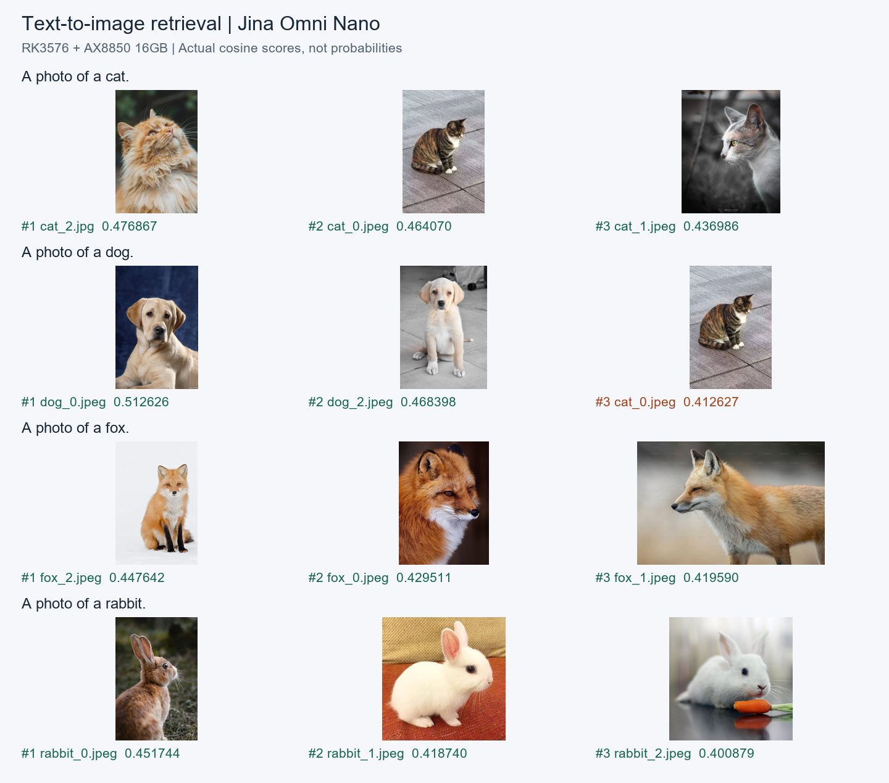
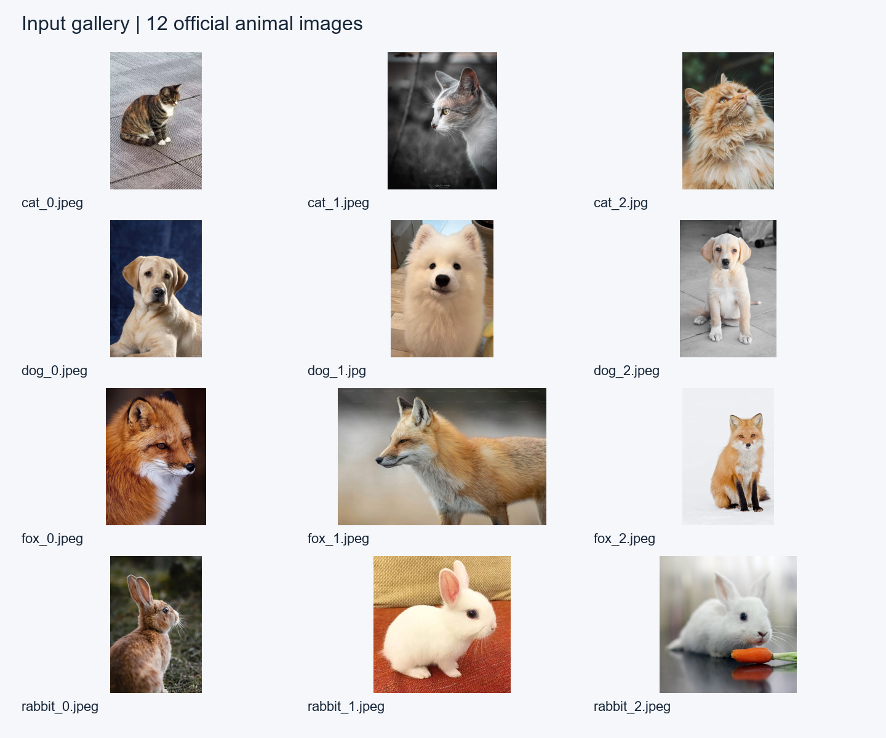

# jina-embeddings-v5-omni-nano 部署指南

jina-embeddings-v5-omni-nano 用于文本、图片与短音频向量编码。本页说明 M.2 算力卡的接入条件、部署步骤与结果检查方法。

> 已实测，效果仍需评估。[查看部署效果](#查看部署效果)。

## 准备运行环境

本页效果展示使用 **RK3576 + AX8850 16GB M.2**；其他容量或平台需重新确认模型能否加载并正确运行。

在连接算力卡的 Linux 主机终端执行，RK3576 使用 ARM64 环境。首次部署先完成[驱动与设备检查](../../usage/device-check.md)、[准备主机环境](../../getting-started/prepare.md)和[下载工具安装](../../usage/download-models.md#使用-hugging-face-下载)。已完成这些步骤可直接下载模型。

后文使用设备 0，运行前用 `axcl-smi` 确认设备可用。

## 下载模型与样例

本页使用 `AXERA-TECH/jina-embeddings-v5-omni-nano` 的固定版本。下面下载本页选用的 91 个文件。

```bash
MODEL_DIR=~/edgeaccel/models/jina-embeddings-v5-omni-nano/6181fa78a788
mkdir -p "$MODEL_DIR"
~/edgeaccel/hf-env/bin/hf download AXERA-TECH/jina-embeddings-v5-omni-nano \
  --include "lora/*" "assets/*" "chat_template.jinja" "jina_embeddings_v5_omni_p128_l0_together.axmodel" "jina_embeddings_v5_omni_p128_l10_together.axmodel" "jina_embeddings_v5_omni_p128_l11_together.axmodel" "jina_embeddings_v5_omni_p128_l1_together.axmodel" "jina_embeddings_v5_omni_p128_l2_together.axmodel" "jina_embeddings_v5_omni_p128_l3_together.axmodel" "jina_embeddings_v5_omni_p128_l4_together.axmodel" "jina_embeddings_v5_omni_p128_l5_together.axmodel" "jina_embeddings_v5_omni_p128_l6_together.axmodel" "jina_embeddings_v5_omni_p128_l7_together.axmodel" "jina_embeddings_v5_omni_p128_l8_together.axmodel" "jina_embeddings_v5_omni_p128_l9_together.axmodel" "jina_embeddings_v5_omni_post.axmodel" "jina_v5_omni_nano_audio_projector_clustering_8s.axmodel" "jina_v5_omni_nano_audio_projector_retrieval_8s.axmodel" "jina_v5_omni_nano_audio_tower_8s.axmodel" "jina_v5_omni_nano_vision_merger_clustering_256x256.axmodel" "jina_v5_omni_nano_vision_merger_retrieval_256x256.axmodel" "jina_v5_omni_nano_vision_tower_256x256.axmodel" "model.embed_tokens.weight.bfloat16.bin" "tokenizer.json" "tokenizer_config.json" \
  --revision 6181fa78a78812dde065f76ad0f73425aec43747 \
  --local-dir "$MODEL_DIR"
cd "$MODEL_DIR"
```

保留当前终端中的 `MODEL_DIR` 变量，后续命令沿用此目录。下载受阻或需要离线复制时，见[下载方式与文件校验](../../usage/download-models.md)。

## 准备多模态向量环境

本例在 RK3576 + AX8850 **16GB M.2** 上运行，输出 768 维归一化向量。文本支持 `retrieval`、`clustering`、`classification`、`text-matching` 四种任务；图片和短音频支持前两种。选择任务决定向量空间，不能混用不同任务的分数。

下载 [算力卡运行包](../../../static/examples/jina-omni-nano-native-20260929.tar.gz)，保存为 `~/edgeaccel/jina-omni-nano-native-20260929.tar.gz`。包内提供已实测的 ARM64 库、C++ 源码、Python 入口及任务 token 配套文件，通过 **AXCL Native API** 使用设备 0。

在已有 AXCL 驱动和 Python 3.12 的 ARM64 主机执行：

```bash
cd ~/edgeaccel
tar -xzf jina-omni-nano-native-20260929.tar.gz
python3 -m venv jina-env
source jina-env/bin/activate
python -m pip install 'numpy==1.26.4' 'ml_dtypes==0.5.3' \
  'Pillow==11.3.0' 'tokenizers==0.21.4' 'Jinja2==3.1.6' \
  'scipy==1.17.1' 'soundfile==0.13.1' 'torch==2.5.1' 'transformers==4.51.3'
axcl-smi
```

以上版本来自本次运行环境；驱动和固件均为 V3.16.0。模型权重约 1.36GB，另需为 Python 依赖、下载缓存和结果预留空间。首次安装依赖需要联网，推理只读取本地文件。

如需重新编译配套库，在安装了 AXCL 开发头文件的主机执行：

```bash
cd ~/edgeaccel/jina-omni-nano
g++ -std=c++17 -O2 -shared -fPIC -Wall -Wextra -Werror \
  jina_native_bridge.cpp -I/usr/include/axcl -L/usr/lib/axcl \
  -laxcl_rt -laxcl_npu -Wl,-rpath,/usr/lib/axcl \
  -o libjina_native_bridge.so
```

`special-tokens/` 配套文件来自原始模型的[固定版本](https://huggingface.co/jinaai/jina-embeddings-v5-omni-nano/tree/009e0d09a98a82227526e8c5aa7b0aa282e36163)，来源和校验值保存在包内清单中。部署时与本页固定的 AXERA 权重一起使用。

## 运行文本与图片检索

保持前面下载步骤中的 `MODEL_DIR`。下面用一句描述检索仓库中的猫、狗图片：

```bash
python - "$MODEL_DIR" <<'PY'
import json, sys
from pathlib import Path
model = Path(sys.argv[1]).resolve()
requests = [
    {"id": "query-cat", "task": "retrieval", "role": "query",
     "text": "A photo of a cat."},
    {"id": "cat", "task": "retrieval", "modality": "image",
     "file": str(model / "assets/cat_0.jpeg")},
    {"id": "dog", "task": "retrieval", "modality": "image",
     "file": str(model / "assets/dog_0.jpeg")}
]
Path.home().joinpath('edgeaccel/jina-inputs.json').write_text(
    json.dumps(requests, ensure_ascii=False, indent=2), encoding='utf-8')
PY

python ~/edgeaccel/jina-omni-nano/jina_card.py \
  --model-dir "$MODEL_DIR" --inputs ~/edgeaccel/jina-inputs.json \
  --output ~/edgeaccel/results/jina-image-01
```

输出目录须尚不存在。读取本次实际分数：

```bash
python - <<'PY'
import json
from pathlib import Path
p = Path.home() / 'edgeaccel/results/jina-image-01/embeddings.json'
r = json.loads(p.read_text(encoding='utf-8'))
print('完成：', r['completed'])
for item, score in zip(r['results'][1:], r['similarityMatrix'][0][1:]):
    print(item['id'], round(score, 6))
PY
```

程序按顺序逐条编码，每个请求输出向量、token 数和耗时。`similarityMatrix` 按输入顺序排列；不同任务之间为 `null`，不进行跨任务比较。图片统一缩放到 256 × 256，使用 64 个图像特征 token。文本经模板和 EOS 处理后最多 128 个 token，超长输入会报错。

## 运行短音频检索

下载 [英文样例](../../../static/validation/effects/jina-embeddings-v5-omni-nano-20260929/english-short.wav)、[中文样例](../../../static/validation/effects/jina-embeddings-v5-omni-nano-20260929/chinese-short.wav) 或 [双语样例](../../../static/validation/effects/jina-embeddings-v5-omni-nano-20260929/combined.wav)，在 `~/edgeaccel/inputs/` 下分别保存为 `english-short.wav`、`chinese-short.wav`、`combined.wav`。这些音频来自本地 TTS 演示，双语样例由前两段按顺序拼接。

将 `jina-inputs.json` 改为下面的内容，其中音频路径相对于该 JSON 文件：

```json
[
  {"id": "query", "task": "retrieval", "role": "query", "text": "Hello, this is a demo. 你好，欢迎使用算力卡。"},
  {"id": "audio", "task": "retrieval", "modality": "audio", "file": "inputs/combined.wav"}
]
```

```bash
python ~/edgeaccel/jina-omni-nano/jina_card.py \
  --model-dir "$MODEL_DIR" --inputs ~/edgeaccel/jina-inputs.json \
  --output ~/edgeaccel/results/jina-audio-01
```

支持不超过 8 秒的单声道音频，程序重采样到 16kHz，提取 128 维 Mel 特征，按实际时长取有效音频 token。特征编码按每块 128 个 token、最多两块执行；这与原始模型对整个序列一次执行双向注意力并不完全等价。更长录音需要由业务明确切段，本例不静默截断。

## 使用其他任务

文本分类、文本匹配和聚类均输出向量，业务需要继续比较标签、候选文本或建立聚类。`classification` 不会直接返回类别名称。将输入记录的 `task` 改为所需任务，并为该任务重新编码全部候选。

音频与音频的聚类可使用 `clustering`。本次仅检查两句语音及其降音量、前置静音版本；**音频与文本的跨模态聚类排序在本次样例中未达到预期**。根据描述检索录音时使用已展示的 `retrieval` 结果，仍需在业务数据上评估。

## 理解结果与耗时

`embeddings.json` 中的分数为余弦相似度，不是概率。向量采用最后一个 EOS 位置的归一化输出，再做 L2 归一化。下面展示原始输入和实测分数，避免只凭“程序正常退出”判断效果。

运行脚本的 `totalSeconds` 包含当前请求的预处理、模型加载和推理；首个音频请求还包含音频依赖初始化。它不包含进程启动、公共分词器和共享权重初始化，也不包含最终结果写盘。当前程序逐请求加载模型，适合复现功能，不代表模型常驻内存后的吞吐性能。完整调用记录保存在输出目录的 `native-calls/` 中。


## 查看部署效果

**已运行，效果仍需评估** · RK3576 + AX8850 16GB M.2。以下输入与输出来自本页固定版本的实际运行。

已在 16GB 算力卡完成四种文本任务、图片检索与聚类、短音频检索和局部音频聚类样例；音频与文本的跨模态聚类仍有质量限制。

**四种文本任务：相关句子的向量更接近**

各任务分别使用匹配的 LoRA。下面每组三条文本包含基准、相关句子和无关句子；四组均为相关分数更高。重复检索输入在切换任务后向量完全一致。

| 任务 | 基准文本 | 相关文本 | 无关文本 | 相关 / 无关余弦 |
| --- | --- | --- | --- | --- |
| retrieval | How do I train a puppy to sit? | Reward the puppy immediately after it sits on command. | Bond yields rose after the central bank announcement. | 0.709410 / 0.018286 |
| clustering | A kitten is sleeping on the sofa. | The cat curled up on a warm blanket. | Quarterly revenue increased while operating costs declined. | 0.919637 / 0.237119 |
| classification | A kitten is sleeping on the sofa. | The cat curled up on a warm blanket. | Quarterly revenue increased while operating costs declined. | 0.856228 / 0.735621 |
| text-matching | A kitten is sleeping on the sofa. | The cat curled up on a warm blanket. | Quarterly revenue increased while operating costs declined. | 0.681916 / 0.205640 |

**文本检索图片与图片聚类**

从官方 12 张动物图片中检索猫、狗、狐狸和兔子，四条查询的第一名均为对应类别。狗查询的第三名是猫，保留这一排序。图片聚类任务中，12 张图片的最近另一张图片均为同类；该小样本结果不代表通用准确率。

<div className="model-effect-gallery">

<figure>

[](../../../static/validation/effects/jina-embeddings-v5-omni-nano-20260929/image-retrieval.png)

<figcaption>四条查询各自的实际前三名及余弦分数</figcaption>
</figure>

<figure>

[](../../../static/validation/effects/jina-embeddings-v5-omni-nano-20260929/image-inputs.png)

<figcaption>参与检索和聚类的全部 12 张原始输入</figcaption>
</figure>

</div>

| 图片 | 最近另一张图片 | 余弦分数 |
| --- | --- | --- |
| assets/cat_0.jpeg | assets/cat_1.jpeg | 0.941070 |
| assets/cat_1.jpeg | assets/cat_0.jpeg | 0.941070 |
| assets/cat_2.jpg | assets/cat_1.jpeg | 0.912820 |
| assets/dog_0.jpeg | assets/dog_2.jpeg | 0.946867 |
| assets/dog_1.jpg | assets/dog_2.jpeg | 0.862194 |
| assets/dog_2.jpeg | assets/dog_0.jpeg | 0.946867 |
| assets/fox_0.jpeg | assets/fox_1.jpeg | 0.954606 |
| assets/fox_1.jpeg | assets/fox_0.jpeg | 0.954606 |
| assets/fox_2.jpeg | assets/fox_1.jpeg | 0.952893 |
| assets/rabbit_0.jpeg | assets/rabbit_1.jpeg | 0.936765 |
| assets/rabbit_1.jpeg | assets/rabbit_2.jpeg | 0.938297 |
| assets/rabbit_2.jpeg | assets/rabbit_1.jpeg | 0.938297 |

**短音频检索：英文、中文与双语输入**

三段音频分别与五条候选文本比较，retrieval 任务的第一名均为对应转录文本。双语音频为 5.92 秒，共 168 个模板与特征 token，实际执行了两块编码。clustering 的音频与文本排序未达到预期，完整分数同时保留。

| 候选文本 | 英文 retrieval | 中文 retrieval | 双语 retrieval |
| --- | --- | --- | --- |
| Hello, this is a demo. | 0.511603 | 0.205077 | 0.386284 |
| 你好，欢迎使用算力卡。 | 0.243560 | 0.417650 | 0.393516 |
| Hello, this is a demo. 你好，欢迎使用算力卡。 | 0.345531 | 0.348859 | 0.430498 |
| A cat is sleeping on the sofa. | -0.027679 | 0.043569 | 0.006361 |
| Quarterly revenue increased while operating costs declined. | -0.011413 | 0.007414 | 0.035543 |

| 候选文本 | 英文 clustering | 中文 clustering | 双语 clustering |
| --- | --- | --- | --- |
| Hello, this is a demo. | 0.020385 | 0.005125 | -0.000066 |
| 你好，欢迎使用算力卡。 | 0.023014 | 0.003276 | 0.008215 |
| Hello, this is a demo. 你好，欢迎使用算力卡。 | 0.020582 | -0.000779 | 0.005740 |
| A cat is sleeping on the sofa. | 0.010434 | -0.035245 | -0.014619 |
| Quarterly revenue increased while operating costs declined. | 0.003792 | -0.010492 | 0.008035 |

english-short.wav：Hello, this is a demo.

<audio controls preload="metadata" src="/validation/effects/jina-embeddings-v5-omni-nano-20260929/english-short.wav" aria-label="english-short.wav：Hello, this is a demo."></audio>

[下载音频](../../../static/validation/effects/jina-embeddings-v5-omni-nano-20260929/english-short.wav)

chinese-short.wav：你好，欢迎使用算力卡。

<audio controls preload="metadata" src="/validation/effects/jina-embeddings-v5-omni-nano-20260929/chinese-short.wav" aria-label="chinese-short.wav：你好，欢迎使用算力卡。"></audio>

[下载音频](../../../static/validation/effects/jina-embeddings-v5-omni-nano-20260929/chinese-short.wav)

combined.wav：Hello, this is a demo. 你好，欢迎使用算力卡。

<audio controls preload="metadata" src="/validation/effects/jina-embeddings-v5-omni-nano-20260929/combined.wav" aria-label="combined.wav：Hello, this is a demo. 你好，欢迎使用算力卡。"></audio>

[下载音频](../../../static/validation/effects/jina-embeddings-v5-omni-nano-20260929/combined.wav)

**音频聚类：音量与前置静音的小样例检查**

两句原始语音分别生成音量降至 60%、前置 150ms 静音的版本，共六段。同源语音最差相似度仍高于另一句语音的最高相似度。该结果只覆盖本次扰动，不代表说话人识别、开放集聚类或跨模态质量。

| 音频 | 同源最低分 | 异源最高分 |
| --- | --- | --- |
| english-short-original.wav | 0.979921 | 0.860875 |
| english-short-gain-60pct.wav | 0.980082 | 0.859104 |
| english-short-silence-150ms.wav | 0.979921 | 0.866034 |
| chinese-short-original.wav | 0.943513 | 0.835395 |
| chinese-short-gain-60pct.wav | 0.937946 | 0.825366 |
| chinese-short-silence-150ms.wav | 0.937946 | 0.866034 |

**同一运行入口的实际耗时**

最终提供的 jina_card.py 完成六个请求；输出向量逐字节与上面对应样例一致。计时包含当前请求预处理和模型加载，首个音频请求另含依赖初始化，不是纯 NPU 耗时。

| 请求 | token 数 | 请求耗时（秒） |
| --- | --- | --- |
| classification | 11 | 5.706 |
| matching | 11 | 6.132 |
| image-retrieval | 82 | 9.898 |
| image-clustering | 82 | 9.831 |
| audio-retrieval | 168 | 32.010 |
| audio-clustering | 95 | 19.655 |

**使用时注意：**

- 本次是 16GB 卡的基本运行验证，8GB 容量、长时间稳定性、并发和业务检索质量仍需回归。
- 四条图片查询第一名正确，但狗查询前三名未全部命中；音频与文本 clustering 三段样例均未选中对应文本为第一名。

这些结果用于对照部署后的输出，未覆盖完整数据集精度或长期连续运行。

<details>
<summary>查看样例环境与运行耗时</summary>

环境：RK3576 + AX8850 16GB M.2。模型版本：`6181fa78a78812dde065f76ad0f73425aec43747`。

| 组件 | 版本或配置 |
| --- | --- |
| 主机 / 内核 | RK3576，约 4GB RAM，6.1.115-vendor-rk35xx |
| AXCL / 驱动 | V3.16.0_20260729180218 |
| 固件 / CMM | V3.16.0 / 15232 MiB |
| 运行方式 | Python 3.12.3 + 本页 C++ 桥接库 / AXCL Native API（设备 0）；NumPy 1.26.4；Torch 2.5.1；Transformers 4.51.3 |

| 指标 | 实测值 | 计时或统计范围 |
| --- | --- | --- |
| 向量输出 | 768 维 / L2 归一化 | 本次全部样例为有限数值；相同输入的重复向量一致。 |
| 编译权重 | 19 / 19 实际执行 | 12 个文本层、1 个后处理、3 个视觉模型、3 个音频模型；覆盖本页任务。 |
| 样例范围 | 15 文本 + 30 图文 + 18 音文 + 6 音频聚类 | 另用最终运行入口复现六个请求；这些数量不构成准确率数据集。 |

适用范围：

- 文本最多 128 token；单声道音频不超过 8 秒；最多两块 128-token 编码。未验证视频和任意长上下文。
- 图片固定缩放到 256×256。当前逐请求加载模型；性能数据不能作为常驻服务吞吐指标。

</details>

遇到加载、内存或后端错误时，按[常见问题](../../usage/troubleshooting.md)处理。需要更换输入或接入业务时，按[检查输出与记录结果](../../reference/validation.md)保留自己的结果。

<details>
<summary>查看文件用途与版本信息</summary>

| 文件 / 目录内路径 | 用途 |
| --- | --- |
| [`demo/openai_task_switch_web.py`](https://huggingface.co/AXERA-TECH/jina-embeddings-v5-omni-nano/blob/6181fa78a78812dde065f76ad0f73425aec43747/demo/openai_task_switch_web.py) | Python 程序 / 前后处理 |
| [`scripts/test_retrieval_clustering.py`](https://huggingface.co/AXERA-TECH/jina-embeddings-v5-omni-nano/blob/6181fa78a78812dde065f76ad0f73425aec43747/scripts/test_retrieval_clustering.py) | Python 程序 / 前后处理 |
| [`config.json`](https://huggingface.co/AXERA-TECH/jina-embeddings-v5-omni-nano/blob/6181fa78a78812dde065f76ad0f73425aec43747/config.json) | 运行配置 |
| [`jina_embeddings_v5_omni_post.axmodel`](https://huggingface.co/AXERA-TECH/jina-embeddings-v5-omni-nano/blob/6181fa78a78812dde065f76ad0f73425aec43747/jina_embeddings_v5_omni_post.axmodel) | 编译模型；按目录区分芯片和规格 |
| [`model.embed_tokens.weight.bfloat16.bin`](https://huggingface.co/AXERA-TECH/jina-embeddings-v5-omni-nano/blob/6181fa78a78812dde065f76ad0f73425aec43747/model.embed_tokens.weight.bfloat16.bin) | Embedding 权重 |
| [`jina_v5_omni_tokenizer.txt`](https://huggingface.co/AXERA-TECH/jina-embeddings-v5-omni-nano/blob/6181fa78a78812dde065f76ad0f73425aec43747/jina_v5_omni_tokenizer.txt) | 分词器 / 字典，必须配套 |
| [`jina_v5_omni_nano_vision_tower_256x256.axmodel`](https://huggingface.co/AXERA-TECH/jina-embeddings-v5-omni-nano/blob/6181fa78a78812dde065f76ad0f73425aec43747/jina_v5_omni_nano_vision_tower_256x256.axmodel) | 编译模型；按目录区分芯片和规格 |
| [`jina_embeddings_v5_omni_p128_l0_together.axmodel`](https://huggingface.co/AXERA-TECH/jina-embeddings-v5-omni-nano/blob/6181fa78a78812dde065f76ad0f73425aec43747/jina_embeddings_v5_omni_p128_l0_together.axmodel) | 编译模型；按目录区分芯片和规格 |
| [`jina_embeddings_v5_omni_p128_l10_together.axmodel`](https://huggingface.co/AXERA-TECH/jina-embeddings-v5-omni-nano/blob/6181fa78a78812dde065f76ad0f73425aec43747/jina_embeddings_v5_omni_p128_l10_together.axmodel) | 编译模型；按目录区分芯片和规格 |
| [`jina_embeddings_v5_omni_p128_l11_together.axmodel`](https://huggingface.co/AXERA-TECH/jina-embeddings-v5-omni-nano/blob/6181fa78a78812dde065f76ad0f73425aec43747/jina_embeddings_v5_omni_p128_l11_together.axmodel) | 编译模型；按目录区分芯片和规格 |
| [`jina_embeddings_v5_omni_p128_l1_together.axmodel`](https://huggingface.co/AXERA-TECH/jina-embeddings-v5-omni-nano/blob/6181fa78a78812dde065f76ad0f73425aec43747/jina_embeddings_v5_omni_p128_l1_together.axmodel) | 编译模型；按目录区分芯片和规格 |
| [`jina_embeddings_v5_omni_p128_l2_together.axmodel`](https://huggingface.co/AXERA-TECH/jina-embeddings-v5-omni-nano/blob/6181fa78a78812dde065f76ad0f73425aec43747/jina_embeddings_v5_omni_p128_l2_together.axmodel) | 编译模型；按目录区分芯片和规格 |
| [`lora/classification/source_adapter_config.json`](https://huggingface.co/AXERA-TECH/jina-embeddings-v5-omni-nano/blob/6181fa78a78812dde065f76ad0f73425aec43747/lora/classification/source_adapter_config.json) | 运行配置 |
| [`lora/clustering/source_adapter_config.json`](https://huggingface.co/AXERA-TECH/jina-embeddings-v5-omni-nano/blob/6181fa78a78812dde065f76ad0f73425aec43747/lora/clustering/source_adapter_config.json) | 运行配置 |

仓库提交：`6181fa78a78812dde065f76ad0f73425aec43747`。仓库中的 19 个 `.axmodel` 文件可能包括多个芯片、规格和分片。运行时使用本页指定的配套文件，完整列表见[固定版本目录](https://huggingface.co/AXERA-TECH/jina-embeddings-v5-omni-nano/tree/6181fa78a78812dde065f76ad0f73425aec43747)。

</details>

## 参考资料

- [常用术语](../../reference/glossary.md)：AXCL、CMM、分词器与推理指标。
- [固定版本文件表](https://huggingface.co/AXERA-TECH/jina-embeddings-v5-omni-nano/tree/6181fa78a78812dde065f76ad0f73425aec43747)。
- [模型卡 / 使用说明](https://huggingface.co/AXERA-TECH/jina-embeddings-v5-omni-nano/blob/6181fa78a78812dde065f76ad0f73425aec43747/README.md)。
- [主要程序入口：demo/openai_task_switch_web.py](https://huggingface.co/AXERA-TECH/jina-embeddings-v5-omni-nano/blob/6181fa78a78812dde065f76ad0f73425aec43747/demo/openai_task_switch_web.py)。
- [配套项目：AXERA-TECH/jina_embeddings_v5_omni.axera](https://github.com/AXERA-TECH/jina_embeddings_v5_omni.axera)。

返回[完整模型目录](../catalog.mdx)。
