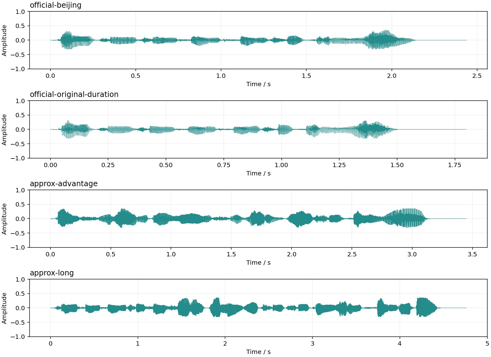

# KAN-TTS 部署指南

KAN-TTS 用于语音合成。本页说明 M.2 算力卡的接入条件、部署步骤与结果检查方法。

> 已实测，效果仍需评估。[查看部署效果](#查看部署效果)。

## 准备运行环境

本页效果展示使用 **RK3576 + AX8850 16GB M.2**；其他容量或平台需重新确认模型能否加载并正确运行。

在连接算力卡的 Linux 主机终端执行，RK3576 使用 ARM64 环境。首次部署先完成[驱动与设备检查](../../usage/device-check.md)、[准备主机环境](../../getting-started/prepare.md)和[下载工具安装](../../usage/download-models.md#使用-hugging-face-下载)。已完成这些步骤可直接下载模型。

后文使用设备 0，运行前用 `axcl-smi` 确认设备可用。

## 下载模型与样例

本页使用 `AXERA-TECH/KAN-TTS` 的固定版本。下面下载本页选用的 325 个文件。

```bash
MODEL_DIR=~/edgeaccel/models/kan-tts/7e8b1618599e
mkdir -p "$MODEL_DIR"
~/edgeaccel/hf-env/bin/hf download AXERA-TECH/KAN-TTS \
  --include "model/*" "sdk/include/*" "sdk/src/*" "sdk/tools/*" "sdk/build.sh" "sdk/CMakeLists.txt" "example/run_example.sh" "README.md" \
  --revision 7e8b1618599e4528b465af9973ffbbce6cb6d274 \
  --local-dir "$MODEL_DIR"
cd "$MODEL_DIR"
```

保留当前终端中的 `MODEL_DIR` 变量，后续命令沿用此目录。下载受阻或需要离线复制时，见[下载方式与文件校验](../../usage/download-models.md)。

## 安装编译和文本处理依赖

本页在 RK3576 主机和 AX8850 16GB M.2 算力卡上合成中文语音。五个神经网络使用原生 AXCL C API，PNCA 解码器和音素前后处理在主机 CPU 上执行。

沿用上方下载得到的 `$MODEL_DIR`，在 RK3576 主机执行：

```bash
sudo apt-get install -y g++ python3-venv unzip
python3 -m venv ~/edgeaccel/kantts-env
source ~/edgeaccel/kantts-env/bin/activate
python -m pip install 'numpy==1.26.4' 'jieba==0.42.1' 'pypinyin==0.55.0'
test -f /usr/include/axcl/axcl.h
test -f /usr/lib/axcl/libaxcl_rt.so
```

两项文件检查应成功；缺失时先完成 AXCL 主机包安装。运行本例不需要安装仓库附带的 SoC 运行库。

## 编译算力卡示例

下载 [KAN-TTS 算力卡示例包](../../../static/examples/kantts-card-example.zip)，保存到 `~/edgeaccel/`，执行：

```bash
mkdir -p ~/edgeaccel/kantts-example
unzip ~/edgeaccel/kantts-card-example.zip -d ~/edgeaccel/kantts-example
python ~/edgeaccel/kantts-example/build_kantts_card.py \
  --model-dir "$MODEL_DIR" \
  --build-dir ~/edgeaccel/kantts-build
ldd ~/edgeaccel/kantts-build/kantts_card
```

构建目录须尚不存在。编译成功后生成 `kantts_card` 和 `build.json`，动态库列表不能出现 `not found`。示例保留官方 CPU 计算流程，将设备调用改为 AXCL，并检查分段长度、输入尺寸和时长预测范围。

## 运行中文样例

```bash
python ~/edgeaccel/kantts-example/kantts_card.py \
  --model-dir "$MODEL_DIR" \
  --binary ~/edgeaccel/kantts-build/kantts_card \
  --output ~/edgeaccel/results/kantts-01
```

输出目录须尚不存在。程序依次运行官方“北京今天天气怎么样”符号样例、同句原始时长、两组文本分段合成，再重复官方样例。

| 输出目录 | 输入与设置 |
| --- | --- |
| `official-beijing` | 官方固定音素，时长系数 1.4 |
| `official-original-duration` | 相同音素，时长系数 1.0 |
| `approx-advantage` | 八十万对六十万，优势在我！ |
| `approx-long` | 今天天气很好，我们一起去公园散步吧。 |
| `official-beijing-repeat` | 重复第一组输入 |

每个目录中的 `output.wav` 为本次合成的 16 kHz 单声道 PCM16 音频。`deployment-result.json` 中 `completed` 为 `true` 表示流程完成；下方提供本次板端生成的音频，可直接播放比较。

## 输入自己的中文文本

```bash
python ~/edgeaccel/kantts-example/kantts_card.py \
  --model-dir "$MODEL_DIR" \
  --binary ~/edgeaccel/kantts-build/kantts_card \
  --text '今天天气很好，我们一起去公园散步吧。' \
  --duration-factor 1.4 \
  --output ~/edgeaccel/results/kantts-custom-01
```

打开输出目录中的 `custom/output.wav`。`--duration-factor` 是音素时长乘数，1.0 保留原始预测时长，1.4 会拉长时长，不代表加速 1.4 倍；当前示例接受 0.5～2.0。

文本入口使用官方校准脚本中的 jieba / pypinyin 近似前端，支持中文和中文标点。数字请写成中文；英文、阿拉伯数字、空输入及不支持的音素会被拒绝。它不等同于完整 ttsfrd，未覆盖多音字、变调和复杂文本规范化。

长句优先按较强标点分段，再按词或音节边界分成最多 22 个符号的小段；这里的符号包含声母、韵母和停顿，不能按 22 个汉字理解。段落依次合成拼接，整句末尾追加 0.3 秒静音。

## 检查音频与耗时

试听时核对漏字、错读、断句和失真。当前记录区分合成流程耗时与 AXCL 执行耗时：前者包含主机解码、设备传输和原始张量保存，不含模型初始化及最终 WAV 写入；后者仅为同步执行网络的时间。不能用网络时间代替整段语音的生成时间。

本次结果仅覆盖 F7 发音人、所列文本和 16GB 算力卡。其他发音人、长篇连续合成、自然度、识别错误率及真实 8GB 卡仍需单独验证。


## 查看部署效果

**已运行，效果仍需评估** · RK3576 + AX8850 16GB M.2。以下输入与输出来自本页固定版本的实际运行。

五个音频条目已做主机 ASR 对照：时长系数 1.4 的“北京”开头识别不完整，系数 1.0 的文字对应；近似前端样例主要句意对应。重复条目不计为独立文本，仍待发音和衔接听审。

**官方中文样例与时长调整**

使用仓库中“北京今天天气怎么样”的固定符号，合成两个时长版本。系数从1.4改为1.0后，音频由2.438秒缩短为1.800秒；两段都含句末0.3秒静音。下面是本次算力卡生成的WAV，没有使用官方预制音频。 下面使用独立 Whisper-base 在主机 CPU 上识别本页实际生成的 WAV，不向识别器提供目标文字。转写可能包含同音字、繁简体和识别器自身误差，用于定位复听位置，不是人工听审或语音合成准确率。

| 项目 | 本次结果 |
| --- | --- |
| 系数1.4 | 2.438秒，含证据保存合成0.543秒 |
| 系数1.0 | 1.800秒，含证据保存合成0.355秒 |

| 合成输入文字 | 实际音频的 ASR 辅助转写 | 核对说明 |
| --- | --- | --- |
| 北京今天天气怎么样 | 在今天天氣怎麼樣 | 时长系数 1.4 的开头“北京”未被完整识别。 |
| 北京今天天气怎么样 | 北京今天天气怎么样 | 时长系数 1.0 的文字对应；这不代表整体音质优于另一设置。 |

北京今天天气怎么样（official-beijing）

<audio controls preload="metadata" src="/validation/effects/kan-tts-20260928/official-beijing.wav" aria-label="北京今天天气怎么样（official-beijing）"></audio>

[下载音频](../../../static/validation/effects/kan-tts-20260928/official-beijing.wav)

北京今天天气怎么样（official-original-duration）

<audio controls preload="metadata" src="/validation/effects/kan-tts-20260928/official-original-duration.wav" aria-label="北京今天天气怎么样（official-original-duration）"></audio>

[下载音频](../../../static/validation/effects/kan-tts-20260928/official-original-duration.wav)

**文本分段合成**

输入“八十万对六十万，优势在我！”及“今天天气很好，我们一起去公园散步吧。”，通过官方校准脚本的近似中文前端生成音素，再分别按2段、3段串行合成。分段边界按标点、词或音节选择，每段不超过22个符号；没有在段间额外插入固定静音。 下面使用独立 Whisper-base 在主机 CPU 上识别本页实际生成的 WAV，不向识别器提供目标文字。转写可能包含同音字、繁简体和识别器自身误差，用于定位复听位置，不是人工听审或语音合成准确率。

| 项目 | 本次结果 |
| --- | --- |
| 优势在我 | 2段：17、11个符号；3.450秒音频 |
| 公园散步 | 3段：15、18、8个符号；4.763秒音频 |

| 合成输入文字 | 实际音频的 ASR 辅助转写 | 核对说明 |
| --- | --- | --- |
| 八十万对六十万，优势在我！ | 80萬對60萬優勢在我 | 数字采用阿拉伯数字书写，句意对应。 |
| 今天天气很好，我们一起去公园散步吧。 | 今天天气很好我们一起去公圆散步吧 | “公园”识别为同音的“公圆”，需复听分段衔接。 |

八十万对六十万，优势在我！（approx-advantage）

<audio controls preload="metadata" src="/validation/effects/kan-tts-20260928/approx-advantage.wav" aria-label="八十万对六十万，优势在我！（approx-advantage）"></audio>

[下载音频](../../../static/validation/effects/kan-tts-20260928/approx-advantage.wav)

今天天气很好，我们一起去公园散步吧。（approx-long）

<audio controls preload="metadata" src="/validation/effects/kan-tts-20260928/approx-long.wav" aria-label="今天天气很好，我们一起去公园散步吧。（approx-long）"></audio>

[下载音频](../../../static/validation/effects/kan-tts-20260928/approx-long.wav)

**重复运行与输出核对**

在其他输入和时长设置之后重复第一句，所有网络输入输出校验值及WAV均与首次完全一致。五组结果的声码器输出裁剪、拼接和PCM16转换可独立重建为相同音频；这些检查用于确认运行和保存过程，不能代替听感或识别准确率评估。 下面使用独立 Whisper-base 在主机 CPU 上识别本页实际生成的 WAV，不向识别器提供目标文字。转写可能包含同音字、繁简体和识别器自身误差，用于定位复听位置，不是人工听审或语音合成准确率。

| 项目 | 本次结果 |
| --- | --- |
| 重复输入 | 所有网络输入输出及WAV完全一致 |
| 输出格式 | 16 kHz，单声道，PCM16 |
| 幅度截断 | 五组均为0个采样点 |
| 输入检查 | 空文本和混合数字英文在NPU调用前被拒绝 |

| 合成输入文字 | 实际音频的 ASR 辅助转写 | 核对说明 |
| --- | --- | --- |
| 北京今天天气怎么样 | 在今天天氣怎麼樣 | 重复音频与首次 SHA 一致，辅助转写也相同，不算新的独立文本样本。 |

北京今天天气怎么样（official-beijing-repeat）

<audio controls preload="metadata" src="/validation/effects/kan-tts-20260928/official-beijing-repeat.wav" aria-label="北京今天天气怎么样（official-beijing-repeat）"></audio>

[下载音频](../../../static/validation/effects/kan-tts-20260928/official-beijing-repeat.wav)

**查看实际波形**

四组不同设置的实际音频波形如下。纵轴为原始浮点幅度，末尾平直段对应追加的0.3秒静音。波形只能显示幅度和时序；错读、多音字、分段衔接及自然度仍需试听评估。

<div className="model-effect-gallery">

<figure>

[](../../../static/validation/effects/kan-tts-20260928/waveforms.png)

<figcaption>本次合成音频的实际波形</figcaption>
</figure>

</div>

**比较合成耗时**

五个网络共执行45次AXCL调用，PNCA解码器在RK3576主机CPU上运行。合成流程包含音素编码、CPU解码、设备传输和张量保存，不含模型初始化与最终WAV写入；AXCL一列仅累计同步执行网络的时间，不含数据传输。当前数据不是常驻服务吞吐或长期稳定性测试。

| 输入 | AXCL调用次数 | AXCL执行合计 / ms | 含证据保存合成 / s |
| --- | --- | --- | --- |
| official-beijing | 6 | 29.301 | 0.543 |
| official-original-duration | 5 | 26.618 | 0.355 |
| approx-advantage | 11 | 54.628 | 0.769 |
| approx-long | 17 | 83.843 | 1.113 |
| official-beijing-repeat | 6 | 28.307 | 0.502 |

**使用时注意：**

- 中文文本入口采用官方校准脚本的近似前端，不等同于完整ttsfrd，未验收多音字、变调及复杂文本规范化。
- 没有独立浮点PNCA基线、听感评分、ASR字错率或长篇连续合成结果；只计基础部署通过。

这些结果用于对照部署后的输出，未覆盖完整数据集精度或长期连续运行。

<details>
<summary>查看样例环境与运行耗时</summary>

环境：RK3576 + AX8850 16GB M.2。模型版本：`7e8b1618599e4528b465af9973ffbbce6cb6d274`。

| 组件 | 版本或配置 |
| --- | --- |
| 主机 / 内核 | RK3576，约 4GB RAM，6.1.115-vendor-rk35xx |
| AXCL / 驱动 | V3.16.0_20260729180218 |
| 固件 / CMM | V3.16.0 / 15232 MiB |
| 运行方式 | 原生AXCL C API / ARM64 C++，Python 3.12负责输入和结果记录，PNCA由CPU执行 |

| 指标 | 实测值 | 计时或统计范围 |
| --- | --- | --- |
| 样例结果 | 5段WAV | 3种文本，包含时长调整与重复输入；均为16 kHz单声道。 |
| 官方句合成 | 0.543 s | 系数1.4，输出2.438秒；含CPU解码和张量保存，不含模型初始化和最终WAV写入。 |
| 算力卡调用 | 45次 | 5个AXMODEL；CPU解码器和文本前端单独保留。 |

适用范围：

- 仅F7发音人及RK3576 + AX8850 16GB；其他发音人和实际8GB卡需另测。
- 本次 Whisper-base 主机转写仅辅助核对内容，不代替人工听审、发音与自然度评测。

</details>

遇到加载、内存或后端错误时，按[常见问题](../../usage/troubleshooting.md)处理。需要更换输入或接入业务时，按[检查输出与记录结果](../../reference/validation.md)保留自己的结果。

<details>
<summary>查看文件用途与版本信息</summary>

| 文件 / 目录内路径 | 用途 |
| --- | --- |
| [`sdk/tools/text_to_symbols.py`](https://huggingface.co/AXERA-TECH/KAN-TTS/blob/7e8b1618599e4528b465af9973ffbbce6cb6d274/sdk/tools/text_to_symbols.py) | Python 程序 / 前后处理 |
| [`model/am_enc.axmodel`](https://huggingface.co/AXERA-TECH/KAN-TTS/blob/7e8b1618599e4528b465af9973ffbbce6cb6d274/model/am_enc.axmodel) | 编译模型；按目录区分芯片和规格 |
| [`model/duration.axmodel`](https://huggingface.co/AXERA-TECH/KAN-TTS/blob/7e8b1618599e4528b465af9973ffbbce6cb6d274/model/duration.axmodel) | 编译模型；按目录区分芯片和规格 |
| [`model/pitch_energy.axmodel`](https://huggingface.co/AXERA-TECH/KAN-TTS/blob/7e8b1618599e4528b465af9973ffbbce6cb6d274/model/pitch_energy.axmodel) | 编译模型；按目录区分芯片和规格 |
| [`model/postnet.axmodel`](https://huggingface.co/AXERA-TECH/KAN-TTS/blob/7e8b1618599e4528b465af9973ffbbce6cb6d274/model/postnet.axmodel) | 编译模型；按目录区分芯片和规格 |
| [`model/voc.axmodel`](https://huggingface.co/AXERA-TECH/KAN-TTS/blob/7e8b1618599e4528b465af9973ffbbce6cb6d274/model/voc.axmodel) | 编译模型；按目录区分芯片和规格 |
| [`config.json`](https://huggingface.co/AXERA-TECH/KAN-TTS/blob/7e8b1618599e4528b465af9973ffbbce6cb6d274/config.json) | 运行配置 |
| [`example/run_example.sh`](https://huggingface.co/AXERA-TECH/KAN-TTS/blob/7e8b1618599e4528b465af9973ffbbce6cb6d274/example/run_example.sh) | 启动或构建脚本 |

仓库提交：`7e8b1618599e4528b465af9973ffbbce6cb6d274`。仓库中的 5 个 `.axmodel` 文件可能包括多个芯片、规格和分片。运行时使用本页指定的配套文件，完整列表见[固定版本目录](https://huggingface.co/AXERA-TECH/KAN-TTS/tree/7e8b1618599e4528b465af9973ffbbce6cb6d274)。

</details>

## 参考资料

- [常用术语](../../reference/glossary.md)：AXCL、CMM、分词器与推理指标。
- [固定版本文件表](https://huggingface.co/AXERA-TECH/KAN-TTS/tree/7e8b1618599e4528b465af9973ffbbce6cb6d274)。
- [模型卡 / 使用说明](https://huggingface.co/AXERA-TECH/KAN-TTS/blob/7e8b1618599e4528b465af9973ffbbce6cb6d274/README.md)。
- [主要程序入口：sdk/tools/text_to_symbols.py](https://huggingface.co/AXERA-TECH/KAN-TTS/blob/7e8b1618599e4528b465af9973ffbbce6cb6d274/sdk/tools/text_to_symbols.py)。
- [配套项目：modelscope/KAN-TTS](https://github.com/modelscope/KAN-TTS)。

返回[完整模型目录](../catalog.mdx)。
