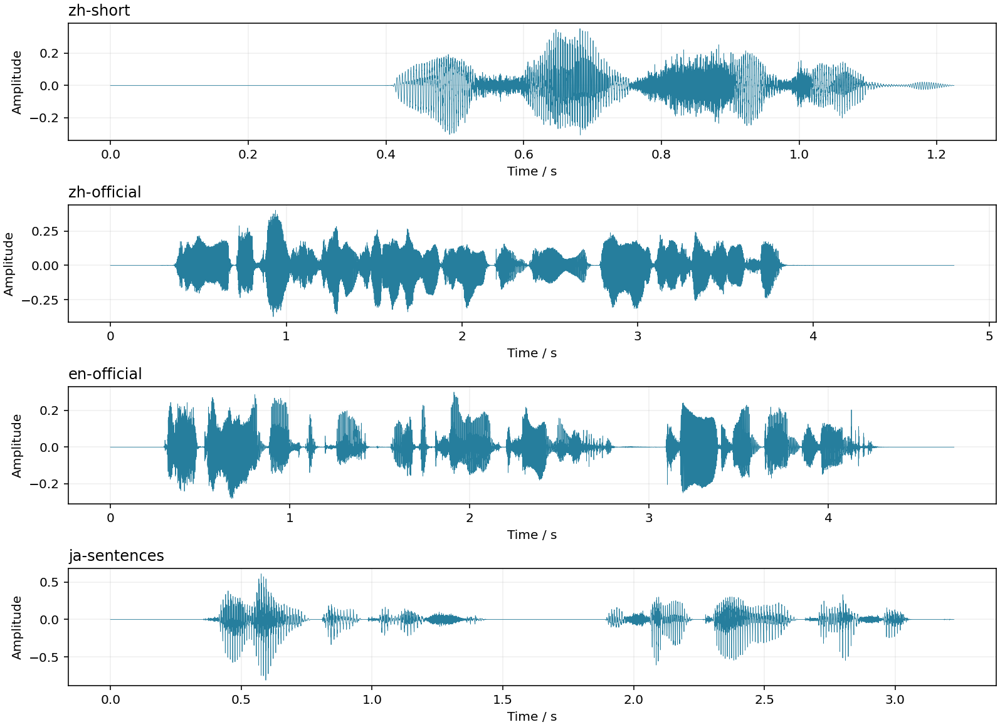

# kokoro.axera 部署指南

kokoro.axera 用于语音合成。本页说明 M.2 算力卡的接入条件、部署步骤与结果检查方法。

> 已实测，效果仍需评估。[查看部署效果](#查看部署效果)。

## 准备运行环境

本页效果展示使用 **RK3576 + AX8850 16GB M.2**；其他容量或平台需重新确认模型能否加载并正确运行。

在连接算力卡的 Linux 主机终端执行，RK3576 使用 ARM64 环境。首次部署先完成[驱动与设备检查](../../usage/device-check.md)、[安装 PyAXEngine](../../usage/python.md)和[下载工具安装](../../usage/download-models.md#使用-hugging-face-下载)。已完成这些步骤可直接下载模型。

后文使用设备 0，运行前用 `axcl-smi` 确认设备可用。

## 下载模型与样例

本页使用 `AXERA-TECH/kokoro.axera` 的固定版本。下面下载本页选用的 12 个文件。

```bash
MODEL_DIR=~/edgeaccel/models/kokoro-axera/db9625f02703
mkdir -p "$MODEL_DIR"
~/edgeaccel/hf-env/bin/hf download AXERA-TECH/kokoro.axera \
  "README.md" \
  "demo_kokoro_ax.py" \
  "inference_utils.py" \
  "requirements.txt" \
  "checkpoints/config.json" \
  "checkpoints/voices_npy/zf_xiaoyi.npy" \
  "checkpoints/voices_npy/af_heart.npy" \
  "checkpoints/voices_npy/jm_kumo.npy" \
  "models/kokoro_part1_96.axmodel" \
  "models/kokoro_part2_96.axmodel" \
  "models/kokoro_part3_96.axmodel" \
  "models/model4_har_sim.onnx" \
  --revision db9625f0270396c108d0273b01477d86b4e5e7fe \
  --local-dir "$MODEL_DIR"
cd "$MODEL_DIR"
```

保留当前终端中的 `MODEL_DIR` 变量，后续命令沿用此目录。下载受阻或需要离线复制时，见[下载方式与文件校验](../../usage/download-models.md)。

## 安装文本处理依赖

本页在 RK3576 主机与 AX8850 16GB M.2 算力卡上运行 Kokoro。三个语音网络使用 `AXCLRTExecutionProvider`，配套谐波模型使用 CPU 的 ONNX Runtime。

完成上方下载后，保留 `$MODEL_DIR`。在 RK3576 主机执行：

```bash
sudo apt-get update
sudo apt-get install -y g++ python3.12-dev unzip
source ~/edgeaccel/python-env/bin/activate
python -m pip install 'numpy==1.26.4' 'onnxruntime==1.20.1' \
  'misaki[zh]==0.9.4' 'spacy==3.7.5' 'num2words==0.5.14' \
  'typer==0.12.5' 'typer-slim==0.12.5' 'click==8.1.8' \
  'phonemizer-fork==3.3.2' 'espeakng-loader==0.2.4' \
  'fugashi==1.5.2' 'unidic-lite==1.0.8' 'pyopenjtalk==0.4.1' \
  'jaconv==0.5.0' 'mojimoji==0.0.13' 'soundfile==0.13.1' 'loguru==0.7.3'
python -m pip install --no-deps \
  https://github.com/explosion/spacy-models/releases/download/en_core_web_sm-3.7.0/en_core_web_sm-3.7.0-py3-none-any.whl
python -c "import axengine; print(axengine.get_available_providers())"
```

输出须包含 `AXCLRTExecutionProvider`。以上开发包对应本页的 Python 3.12；使用其他 Python 版本时，开发头文件须与解释器一致。日文依赖在 ARM64 上可能需要编译，首次安装耗时较长。

英语使用 `en_core_web_sm`，日语使用 `unidic-lite`。本例不启动 Gradio，也不下载其他平台的模型或全部发音人文件。

## 检查模型与声纹

| 文件 | 执行位置 / 用途 |
| --- | --- |
| `models/kokoro_part1_96.axmodel` | 算力卡，文本特征与时长预测 |
| `models/kokoro_part2_96.axmodel` | 算力卡，声学特征 |
| `models/model4_har_sim.onnx` | CPU，生成谐波特征 |
| `models/kokoro_part3_96.axmodel` | 算力卡，生成待还原的频谱 |
| `checkpoints/voices_npy/zf_xiaoyi.npy` | 中文声纹 |
| `checkpoints/voices_npy/af_heart.npy` | 美式英语声纹 |
| `checkpoints/voices_npy/jm_kumo.npy` | 日语声纹 |

保留下载目录结构。本页直接使用仓库的 NumPy 声纹文件，无需把 `.pt` 文件另行转换。主机负责音素转换、频谱还原、裁剪与音频拼接。

## 合成三种语言的语音

下载 [Kokoro 算力卡示例包](../../../static/examples/kokoro-card-example.zip)，保存到 `~/edgeaccel/`，执行：

```bash
mkdir -p ~/edgeaccel/kokoro-example
unzip ~/edgeaccel/kokoro-card-example.zip -d ~/edgeaccel/kokoro-example
python ~/edgeaccel/kokoro-example/kokoro_card.py \
  --model-dir "$MODEL_DIR" \
  --output ~/edgeaccel/results/kokoro-01
```

输出目录须尚不存在。程序依次合成中文短句、官方中文样例、官方英文样例、日文分句，再重复官方中文样例。

| 文件 | 输入 |
| --- | --- |
| `zh-short.wav` | 你好，世界。 |
| `zh-official.wav` | 致力于打造世界领先的人工智能感知与边缘计算芯片。 |
| `en-official.wav` | The sky above the port was the color of television, tuned to a dead channel. |
| `ja-sentences.wav` | 今日はいい天気です。一緒に公園へ行きましょう。 |
| `zh-official-repeat.wav` | 重复官方中文样例 |

生成音频为 24 kHz 单声道 PCM16。`deployment-result.json` 中 `completed` 为 `true` 表示全部样例执行完成。下方提供本次板端生成的音频、分段信息及耗时。

## 使用自己的文本

```bash
python ~/edgeaccel/kokoro-example/kokoro_card.py \
  --model-dir "$MODEL_DIR" \
  --lang z --text '你好，世界。' \
  --output ~/edgeaccel/results/kokoro-custom-01
```

打开 `custom.wav`。`--lang z` 使用中文声纹，`a` 使用美式英语声纹，`j` 使用日语声纹。每个输出目录对应一次独立运行。

文本按官方规则分句，长句进一步拆分，单组包含首尾标记在内最多 96 个 token。短组不超过 32 个 token 时，沿用官方重复输入后裁剪音频的处理。程序会检查 192 帧对齐矩阵；输入不支持、分段失败或任一模型失败时停止，不会把剩余分句当成完整结果。

## 检查生成结果

依次试听原文中的字词、标点停顿和分段衔接。CPU 谐波模型包含随机算子，本例每个样例设置种子 42，并重新创建该 CPU 会话；实际重复结果见下方记录。

合成流程计时包含文本转音素、CPU 和算力卡推理、频谱还原及原始张量保存，不含模型加载、语言前端创建和最终 WAV 写入。首次中文调用包含词典加载。AXCL 时间只统计对应网络的 Python `run` 调用，不能代替整个服务的响应时间。

本次沿用官方频谱还原和裁剪流程，未用浮点原模型或人工听感基准评估自然度。其他发音人、混合语言、长篇连续合成及实际 8GB 卡需另行验证。


## 查看部署效果

**已运行，效果仍需评估** · 2026-09-28 · RK3576 + AX8850 16GB M.2。以下输入与输出来自本页固定版本的实际运行。

完成中文、英语、日语及重复输入，展示五段板端生成音频、波形与分段耗时。

**合成中文短句与官方样例**

以下音频由本次 RK3576 + AX8850 16GB 算力卡运行生成。中文使用 zf_xiaoyi 声纹；短句的20个token先重复为40个再裁剪，官方样例含首尾标记共96个token，按一段合成。

| 文本 | 分段数 | 音频时长 / s | 声纹 |
| --- | --- | --- | --- |
| 你好，世界。 | 1 | 1.225 | zf_xiaoyi |
| 致力于打造世界领先的人工智能感知与边缘计算芯片。 | 1 | 4.800 | zf_xiaoyi |

你好，世界。（zh-short）

<audio controls preload="metadata" src="/validation/effects/kokoro-axera-20260928/zh-short.wav" aria-label="你好，世界。（zh-short）"></audio>

[下载音频](../../../static/validation/effects/kokoro-axera-20260928/zh-short.wav)

致力于打造世界领先的人工智能感知与边缘计算芯片。（zh-official）

<audio controls preload="metadata" src="/validation/effects/kokoro-axera-20260928/zh-official.wav" aria-label="致力于打造世界领先的人工智能感知与边缘计算芯片。（zh-official）"></audio>

[下载音频](../../../static/validation/effects/kokoro-axera-20260928/zh-official.wav)

**合成英语与日语**

英语使用仓库示例句和 af_heart 声纹，日语输入两句话并使用 jm_kumo 声纹。音素转换和音频还原在主机 CPU 上执行，三个 AXMODEL 在算力卡上执行。

| 文本 | 分段数 | 音频时长 / s | 声纹 |
| --- | --- | --- | --- |
| The sky above the port was the color of television, tuned to a dead channel. | 1 | 4.700 | af_heart |
| 今日はいい天気です。一緒に公園へ行きましょう。 | 1 | 3.225 | jm_kumo |

The sky above the port was the color of television, tuned to a dead channel.（en-official）

<audio controls preload="metadata" src="/validation/effects/kokoro-axera-20260928/en-official.wav" aria-label="The sky above the port was the color of television, tuned to a dead channel.（en-official）"></audio>

[下载音频](../../../static/validation/effects/kokoro-axera-20260928/en-official.wav)

今日はいい天気です。一緒に公園へ行きましょう。（ja-sentences）

<audio controls preload="metadata" src="/validation/effects/kokoro-axera-20260928/ja-sentences.wav" aria-label="今日はいい天気です。一緒に公園へ行きましょう。（ja-sentences）"></audio>

[下载音频](../../../static/validation/effects/kokoro-axera-20260928/ja-sentences.wav)

**重复合成与音频核对**

在其他语言输入之后重复官方中文句。CPU 谐波模型包含随机算子，本例逐样例重置种子并重建 CPU 会话；重复结果按实际文件核对。所有样例的跨网络输入、时长对齐、裁剪和 PCM16 保存均经过独立复核。

| 项目 | 本次结果 |
| --- | --- |
| 重复网络输入输出 | 完全一致 |
| 重复 WAV | 完全一致 |
| 音频格式 | 24 kHz，单声道，PCM16 |
| 超出 [-1, 1] 的采样点 | 0 |
| 空文本 | 在 NPU 调用前拒绝 |

致力于打造世界领先的人工智能感知与边缘计算芯片。（zh-official-repeat）

<audio controls preload="metadata" src="/validation/effects/kokoro-axera-20260928/zh-official-repeat.wav" aria-label="致力于打造世界领先的人工智能感知与边缘计算芯片。（zh-official-repeat）"></audio>

[下载音频](../../../static/validation/effects/kokoro-axera-20260928/zh-official-repeat.wav)

**查看实际波形**

下图由本次四组不同文本生成的音频绘制。波形用于观察幅度、时序和分段，不代表发音准确率或自然度。

<div className="model-effect-gallery">

<figure>

[](../../../static/validation/effects/kokoro-axera-20260928/waveforms.png)

<figcaption>中文、英语和日语的实际合成波形</figcaption>
</figure>

</div>

**比较各段合成耗时**

合成流程包含文本转音素、设备传输、CPU 谐波推理、频谱还原和原始张量保存，不含模型加载、语言前端创建及最终 WAV 写入。首次中文调用含词典加载，不能直接与后续调用比较。AXCL 和 CPU 列分别累计各网络的 Python run 调用时间；不是常驻服务吞吐。

| 输入 | 分段数 | AXCL合计 / ms | CPU谐波 / ms | 含证据保存合成 / s |
| --- | --- | --- | --- | --- |
| zh-short | 1 | 232.245 | 173.315 | 3.202 |
| zh-official | 1 | 231.312 | 168.002 | 1.304 |
| en-official | 1 | 230.656 | 148.029 | 1.319 |
| ja-sentences | 1 | 230.917 | 151.213 | 1.324 |
| zh-official-repeat | 1 | 243.836 | 148.624 | 1.342 |

**使用时注意：**

- 仅三种声纹及本页文本；其他发音人、混合语言和长篇连续合成需另测。
- 独立复核覆盖数据流和官方音频还原，不包含浮点原模型对照、ASR字错率或听感评分；只计基础部署通过。

这些结果用于对照部署后的输出，未覆盖完整数据集精度或长期连续运行。

<details>
<summary>查看样例环境与运行耗时</summary>

环境：RK3576 + AX8850 16GB M.2。日期：2026-09-28。模型版本：`db9625f0270396c108d0273b01477d86b4e5e7fe`。

| 组件 | 版本或配置 |
| --- | --- |
| 主机 / 内核 | RK3576，约 4GB RAM，6.1.115-vendor-rk35xx |
| AXCL / 驱动 | V3.16.0_20260729180218 |
| 固件 / CMM | V3.16.0 / 15232 MiB |
| Python 推理 | Python 3.12 / PyAXEngine 0.1.3.rc3 / NumPy 1.26.4 / AXCLRTExecutionProvider |

| 指标 | 实测值 | 计时或统计范围 |
| --- | --- | --- |
| 实际输出 | 5段WAV | 中文、英语、日语三种语言，包含短文本和重复样例。 |
| 算力卡调用 | 15次 | 3个AXMODEL；谐波模型和文本前端在主机CPU执行。 |
| 音频格式 | 24 kHz | 单声道PCM16，保存前的浮点音频和网络调用已归档。 |

适用范围：

- 仅三种声纹及本页文本；其他发音人、混合语言和长篇连续合成需另测。
- 独立复核覆盖数据流和官方音频还原，不包含浮点原模型对照、ASR字错率或听感评分；只计基础部署通过。
- 结果来自AX8850 16GB，不能替代实际8GB卡的容量和稳定性回归。

</details>

遇到加载、内存或后端错误时，按[常见问题](../../usage/troubleshooting.md)处理。需要更换输入或接入业务时，按[检查输出与记录结果](../../reference/validation.md)保留自己的结果。

<details>
<summary>查看文件用途与版本信息</summary>

| 文件 / 目录内路径 | 用途 |
| --- | --- |
| [`demo_kokoro_ax.py`](https://huggingface.co/AXERA-TECH/kokoro.axera/blob/db9625f0270396c108d0273b01477d86b4e5e7fe/demo_kokoro_ax.py) | Python 程序 / 前后处理 |
| [`gradio_demo.py`](https://huggingface.co/AXERA-TECH/kokoro.axera/blob/db9625f0270396c108d0273b01477d86b4e5e7fe/gradio_demo.py) | Python 程序 / 前后处理 |
| [`models/kokoro_part1_96.axmodel`](https://huggingface.co/AXERA-TECH/kokoro.axera/blob/db9625f0270396c108d0273b01477d86b4e5e7fe/models/kokoro_part1_96.axmodel) | 编译模型；按目录区分芯片和规格 |
| [`models/kokoro_part2_96.axmodel`](https://huggingface.co/AXERA-TECH/kokoro.axera/blob/db9625f0270396c108d0273b01477d86b4e5e7fe/models/kokoro_part2_96.axmodel) | 编译模型；按目录区分芯片和规格 |
| [`models/kokoro_part3_96.axmodel`](https://huggingface.co/AXERA-TECH/kokoro.axera/blob/db9625f0270396c108d0273b01477d86b4e5e7fe/models/kokoro_part3_96.axmodel) | 编译模型；按目录区分芯片和规格 |
| [`models_620E/kokoro_part1_96.axmodel`](https://huggingface.co/AXERA-TECH/kokoro.axera/blob/db9625f0270396c108d0273b01477d86b4e5e7fe/models_620E/kokoro_part1_96.axmodel) | 编译模型；按目录区分芯片和规格 |
| [`models_620E/kokoro_part2_96.axmodel`](https://huggingface.co/AXERA-TECH/kokoro.axera/blob/db9625f0270396c108d0273b01477d86b4e5e7fe/models_620E/kokoro_part2_96.axmodel) | 编译模型；按目录区分芯片和规格 |
| [`checkpoints/config.json`](https://huggingface.co/AXERA-TECH/kokoro.axera/blob/db9625f0270396c108d0273b01477d86b4e5e7fe/checkpoints/config.json) | 运行配置 |
| [`config.json`](https://huggingface.co/AXERA-TECH/kokoro.axera/blob/db9625f0270396c108d0273b01477d86b4e5e7fe/config.json) | 运行配置 |
| [`requirements.txt`](https://huggingface.co/AXERA-TECH/kokoro.axera/blob/db9625f0270396c108d0273b01477d86b4e5e7fe/requirements.txt) | Python 依赖清单 |

仓库提交：`db9625f0270396c108d0273b01477d86b4e5e7fe`。仓库中的 6 个 `.axmodel` 文件可能包括多个芯片、规格和分片。运行时使用本页指定的配套文件，完整列表见[固定版本目录](https://huggingface.co/AXERA-TECH/kokoro.axera/tree/db9625f0270396c108d0273b01477d86b4e5e7fe)。

</details>

## 参考资料

- [常用术语](../../reference/glossary.md)：AXCL、CMM、分词器与推理指标。
- [固定版本文件表](https://huggingface.co/AXERA-TECH/kokoro.axera/tree/db9625f0270396c108d0273b01477d86b4e5e7fe)。
- [模型卡 / 使用说明](https://huggingface.co/AXERA-TECH/kokoro.axera/blob/db9625f0270396c108d0273b01477d86b4e5e7fe/README.md)。
- [主要程序入口：demo_kokoro_ax.py](https://huggingface.co/AXERA-TECH/kokoro.axera/blob/db9625f0270396c108d0273b01477d86b4e5e7fe/demo_kokoro_ax.py)。
- [ModelScope 对应资源](https://modelscope.cn/models/AXERA-TECH/kokoro.axera)。不同平台的 revision 不通用，另行记录版本。

返回[完整模型目录](../catalog.mdx)。
