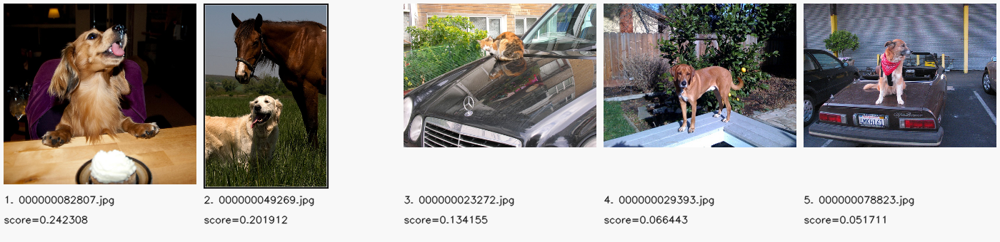
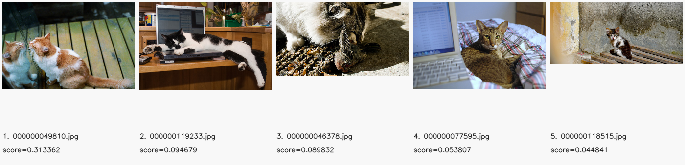
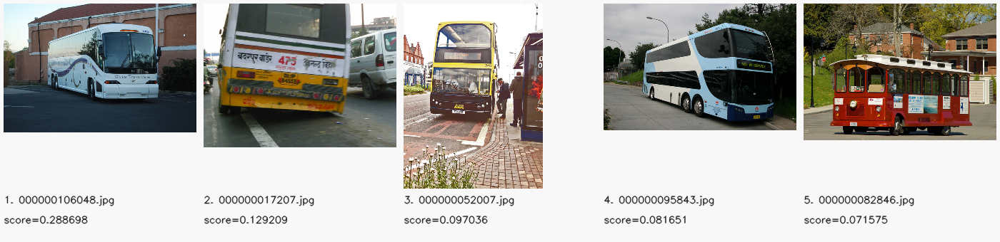
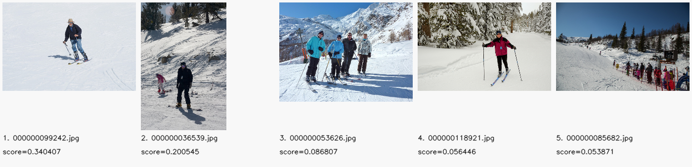
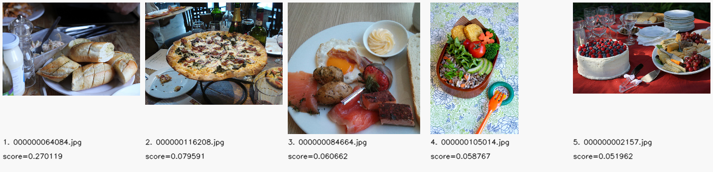
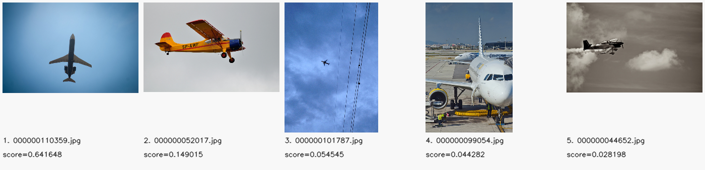
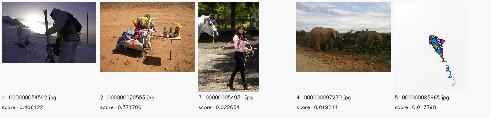
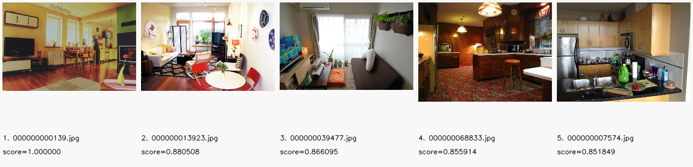

# LibCLIP 部署指南

LibCLIP 用于文本或图像向量。本页说明 M.2 算力卡的接入条件、部署步骤与结果检查方法。

> 已实测，效果仍需评估。[查看部署效果](#查看部署效果)。

## 准备运行环境

本页效果展示使用 **RK3576 + AX8850 16GB M.2**；其他容量或平台需重新确认模型能否加载并正确运行。

在连接算力卡的 Linux 主机终端执行，RK3576 使用 ARM64 环境。首次部署先完成[驱动与设备检查](../../usage/device-check.md)、[准备主机环境](../../getting-started/prepare.md)和[下载工具安装](../../usage/download-models.md#使用-hugging-face-下载)。已完成这些步骤可直接下载模型。

后文使用设备 0，运行前用 `axcl-smi` 确认设备可用。

## 下载模型与样例

本页使用 `AXERA-TECH/LibCLIP` 的固定版本。下面下载本页选用的 12 个文件。

```bash
MODEL_DIR=~/edgeaccel/models/libclip/ddfe0d68e419
mkdir -p "$MODEL_DIR"
~/edgeaccel/hf-env/bin/hf download AXERA-TECH/LibCLIP \
  "README.md" \
  "cnclip/cn_vocab.txt" \
  "cnclip/cnclip_vit_l14_336px_text_u16.axmodel" \
  "cnclip/cnclip_vit_l14_336px_vision_u16u8.axmodel" \
  "coco_1000.tar" \
  "install/lib/axcl_aarch64/libclip.so" \
  "install/include/clip.h" \
  "pyclip/pyaxdev.py" \
  "pyclip/pyclip.py" \
  "pyclip/requirements.txt" \
  "pyclip/gradio_example.py" \
  "install/examples/test_match_by_text.cpp" \
  --revision ddfe0d68e4197b224358bc658d052f626aec7220 \
  --local-dir "$MODEL_DIR"
cd "$MODEL_DIR"
```

保留当前终端中的 `MODEL_DIR` 变量，后续命令沿用此目录。下载受阻或需要离线复制时，见[下载方式与文件校验](../../usage/download-models.md)。

## 安装推理依赖

LibCLIP 用于自然语言搜图和相似图片检索。先将图片编码并写入本地索引，再用文字或图片查询。本页在 RK3576 + AX8850 16GB M.2 算力卡上运行官方 ARM64 SDK，显式选择 `AxDeviceType.axcl_device`、设备 0。

在已配置 Python 环境的 RK3576 主机执行：

```bash
source ~/edgeaccel/python-env/bin/activate
python -m pip install 'numpy==1.26.4' 'opencv-python-headless==4.11.0.86'
ldd "$MODEL_DIR/install/lib/axcl_aarch64/libclip.so"
```

动态库检查不应出现 `not found`。使用下载清单中的 `axcl_aarch64` 库，不能用 `host_650` 或 x86 库替换。本次使用板端系统库直接运行，没有安装 Gradio。

## 建立索引并检索

保留上方下载步骤中的 `$MODEL_DIR`。下载 [LibCLIP 算力卡示例](../../../static/examples/libclip_card.py)，保存为 `~/edgeaccel/libclip_card.py`：

```bash
python ~/edgeaccel/libclip_card.py \
  --model-dir "$MODEL_DIR" \
  --output ~/edgeaccel/results/libclip-01
```

输出目录须尚不存在，路径长度须小于 128 字节。程序读取仓库压缩包中的 1000 张 JPG，在 `images/` 保存输入图片，在 `index/` 建立索引，再执行七条中文查询、重复查询、以图搜图和索引重新加载。每条文字查询在独立进程中执行，避免固定版本 SDK 的前序输入影响结果；进程总耗时包含首次加载开销。

示例自动把固定的 ARM64 算力卡库放到 Python 封装的加载位置，并核对库与封装版本。图像按官方接口转为连续的 RGB 数据传入 SDK，图像编码、分词和检索由 SDK 执行。

`deployment-result.json` 中 `completed: true` 表示全部步骤执行完成。先打开 `query-1-top5.png` 查看“一只狗”的前五张检索图片，其他查询按编号查看 `query-2-top5.png` 至 `query-7-top5.png`。以图搜图结果为 `image-query-top5.png`。

| 输出 | 内容 |
| --- | --- |
| `query-N-top5.png` | 当前查询返回的前五张图片、文件名和分数 |
| `query-N-all-results.json` | 全部 1000 张图片的排名及重复查询结果 |
| `query-N-feature.npy` | 本次查询的 768 维文本特征 |
| `images/` | 实际入库图片 |
| `index/` | 本次生成的本地图片索引 |
| `deployment-result.json` | 查询、输入校验、SDK调用耗时和索引检查结果 |

示例会在这个新索引中删除并恢复一个条目，再结束建库进程，并在新进程中重新打开索引，以检查持久化行为。输入图片不会因此删除。保留结果目录即可继续分析本次排名；重新运行示例时应另选新的输出目录。

## 更换查询文字

使用 `--query` 指定查询，可重复传入多条，每条查询仍使用独立进程：

```bash
python ~/edgeaccel/libclip_card.py \
  --model-dir "$MODEL_DIR" \
  --query '一只狗' \
  --query '一辆公共汽车' \
  --output ~/edgeaccel/results/libclip-custom-01
```

这条命令仍使用官方 1000 张图片并建立一个新索引。更换业务图片库时，需要重新建立与当前图像编码器、文本编码器和词表匹配的索引；不能只替换模型文件而沿用其他模型生成的特征。

## 理解检索结果

文字查询返回当前图库中的相对匹配分数。分数受查询内容和图库组成影响，不是“图中存在这个对象”的可信概率。即使图库不包含查询描述，接口仍会返回排名靠前的图片；示例特意包含“火星上的紫色独角兽”，用于展示这种情况。

以图搜图的分数和文字检索的分数含义不同，不应直接比较。重复结果一致说明本次重复执行可复现，不代表已完成检索准确率、跨场景或长期稳定性评估。

本页示例使用配套 SDK 完成文字检索和以图搜图，并在新进程中读取已建立的索引。当前固定 SDK 的常驻查询存在前序输入影响，本页通过独立查询进程处理；接入常驻多轮服务前还需适配并验证。已验证的是 SDK 整体流程，没有记录每个底层推理调用的张量。业务效果还需用带检索标注的数据评估 Recall@K 等指标，并在实际 8GB 卡上单独回归。

下方四类指标使用固定版本的 [COCO 实例标注](https://huggingface.co/AXERA-TECH/yoloe-26n-seg/blob/92b80871e4f4d1223cd4824015931503c4b78879/datasets/annotations_val2017/annotations/instances_val2017.json)，只检查图片是否带对应类别。该检查不判断查询中的数量、动作或完整语义；其他三条查询未计入这组指标。


## 查看部署效果

**已运行，效果仍需评估** · RK3576 + AX8850 16GB M.2。以下输入与输出来自本页固定版本的实际运行。

完成1000张图片入库、七条中文查询、以图搜图及新进程索引重载，展示实际排名、错误匹配和四类标注核对。

**文字检索：一只狗**

前五名中，第三张实际上是猫；其余图片可见狗。这里保留完整前五名，不能将排序当作逐图正确判断。

<div className="model-effect-gallery">

<figure>

[](../../../static/validation/effects/libclip-20260928/query-1-top5.png)

<figcaption>一只狗：本次返回的前五名，点击可查看原图</figcaption>
</figure>

</div>

| 排名 | 图片文件 | 检索分数 |
| --- | --- | --- |
| 1 | 000000082807.jpg | 0.242308 |
| 2 | 000000049269.jpg | 0.201912 |
| 3 | 000000023272.jpg | 0.134155 |
| 4 | 000000029393.jpg | 0.066443 |
| 5 | 000000078823.jpg | 0.051711 |

**文字检索：一只猫**

前五名均可见猫，场景包括镜子、桌面、地毯和电脑旁。图中分数只反映当前查询与这份图库的相对匹配。

<div className="model-effect-gallery">

<figure>

[](../../../static/validation/effects/libclip-20260928/query-2-top5.png)

<figcaption>一只猫：本次返回的前五名，点击可查看原图</figcaption>
</figure>

</div>

| 排名 | 图片文件 | 检索分数 |
| --- | --- | --- |
| 1 | 000000049810.jpg | 0.313362 |
| 2 | 000000119233.jpg | 0.094679 |
| 3 | 000000046378.jpg | 0.089832 |
| 4 | 000000077595.jpg | 0.053807 |
| 5 | 000000118515.jpg | 0.044841 |

**文字检索：一辆公共汽车**

返回公交车辆图片，车型和拍摄角度不同。本页不根据排名判断具体车型或车辆数量。

<div className="model-effect-gallery">

<figure>

[](../../../static/validation/effects/libclip-20260928/query-3-top5.png)

<figcaption>一辆公共汽车：本次返回的前五名，点击可查看原图</figcaption>
</figure>

</div>

| 排名 | 图片文件 | 检索分数 |
| --- | --- | --- |
| 1 | 000000106048.jpg | 0.288698 |
| 2 | 000000017207.jpg | 0.129209 |
| 3 | 000000052007.jpg | 0.097036 |
| 4 | 000000095843.jpg | 0.081651 |
| 5 | 000000082846.jpg | 0.071575 |

**文字检索：人们在滑雪**

返回雪地中的人物与滑雪场景；查询中的人数、动作细节没有逐项标注验收。

<div className="model-effect-gallery">

<figure>

[](../../../static/validation/effects/libclip-20260928/query-4-top5.png)

<figcaption>人们在滑雪：本次返回的前五名，点击可查看原图</figcaption>
</figure>

</div>

| 排名 | 图片文件 | 检索分数 |
| --- | --- | --- |
| 1 | 000000099242.jpg | 0.340407 |
| 2 | 000000036539.jpg | 0.200545 |
| 3 | 000000053626.jpg | 0.086807 |
| 4 | 000000118921.jpg | 0.056446 |
| 5 | 000000085682.jpg | 0.053871 |

**文字检索：桌子上的食物**

返回面包、披萨、餐盘和其他餐食场景。没有将“桌子”关系或食物种类作为正式指标。

<div className="model-effect-gallery">

<figure>

[](../../../static/validation/effects/libclip-20260928/query-5-top5.png)

<figcaption>桌子上的食物：本次返回的前五名，点击可查看原图</figcaption>
</figure>

</div>

| 排名 | 图片文件 | 检索分数 |
| --- | --- | --- |
| 1 | 000000064084.jpg | 0.270119 |
| 2 | 000000116208.jpg | 0.079591 |
| 3 | 000000084664.jpg | 0.060662 |
| 4 | 000000105014.jpg | 0.058767 |
| 5 | 000000002157.jpg | 0.051962 |

**文字检索：一架飞机**

返回不同角度和距离的飞机图片，包括远处天空中的小目标。

<div className="model-effect-gallery">

<figure>

[](../../../static/validation/effects/libclip-20260928/query-6-top5.png)

<figcaption>一架飞机：本次返回的前五名，点击可查看原图</figcaption>
</figure>

</div>

| 排名 | 图片文件 | 检索分数 |
| --- | --- | --- |
| 1 | 000000110359.jpg | 0.641648 |
| 2 | 000000052017.jpg | 0.149015 |
| 3 | 000000101787.jpg | 0.054545 |
| 4 | 000000099054.jpg | 0.044282 |
| 5 | 000000044652.jpg | 0.028198 |

**文字检索：火星上的紫色独角兽**

该查询在当前图库中没有匹配的完整描述，接口仍返回雪地人物、摆设、马、大象和风筝等图片。第一名分数约0.406，不代表图库确实包含所描述的对象。

<div className="model-effect-gallery">

<figure>

[](../../../static/validation/effects/libclip-20260928/query-7-top5.png)

<figcaption>火星上的紫色独角兽：本次返回的前五名，点击可查看原图</figcaption>
</figure>

</div>

| 排名 | 图片文件 | 检索分数 |
| --- | --- | --- |
| 1 | 000000054592.jpg | 0.406122 |
| 2 | 000000020553.jpg | 0.371700 |
| 3 | 000000054931.jpg | 0.022654 |
| 4 | 000000097230.jpg | 0.019211 |
| 5 | 000000085665.jpg | 0.017798 |

**以图搜图与索引重新加载**

查询图片为图库中的000000000139.jpg，本图自身排第一，后续返回其他室内场景。两次以图搜图的1000项排名和分数一致。删除并恢复一个索引条目后，在新进程中重开索引，1000个条目均可读取，第一条文字查询的前五名保持一致。

<div className="model-effect-gallery">

<figure>

[](../../../static/validation/effects/libclip-20260928/image-query-top5.png)

<figcaption>以图搜图前五名：第一张同时是查询图片</figcaption>
</figure>

</div>

| 排名 | 图片文件 | 以图搜图分数 |
| --- | --- | --- |
| 1 | 000000000139.jpg | 1.000000 |
| 2 | 000000013923.jpg | 0.880508 |
| 3 | 000000039477.jpg | 0.866095 |
| 4 | 000000068833.jpg | 0.855914 |
| 5 | 000000007574.jpg | 0.851849 |

**四条查询的类别标注核对**

使用COCO实例标注，检查本次1000张图片中是否含dog、cat、bus、airplane类别。P@5为前五名中含该类别的比例，R@5为找回的该类别图片占图库全部同类图片的比例。只核对类别是否出现，不核对数量、动作或完整句意；不能代表全部文本检索精度。

| 查询 | 标注类别 | 图库同类图片 | 前五名命中 | P@5 | R@5 |
| --- | --- | --- | --- | --- | --- |
| 一只狗 | dog | 31 | 4/5 | 80.0% | 12.90% |
| 一只猫 | cat | 43 | 5/5 | 100.0% | 11.63% |
| 一辆公共汽车 | bus | 32 | 5/5 | 100.0% | 15.62% |
| 一架飞机 | airplane | 20 | 5/5 | 100.0% | 25.00% |

**SDK调用与独立进程耗时**

图片入库统计1000次初始clip_add，含SDK图像处理、编码、传输和索引写入。文字检索统计七条查询各第一次clip_match_text。前两项不含加载、读图、绘图和证据保存；第三项包含启动进程、加载模型、当前查询的重复复核和结果保存。没有预热，不能把API调用时间当成独立进程的完整响应时间。

| 阶段 | 调用次数 | 平均 / ms |
| --- | --- | --- |
| 首次图片入库 | 1000 | 99.956 |
| 首次文字检索 | 7 | 11.062 |
| 独立查询进程（含启动） | 7 | 8603.746 |

**使用时注意：**

- “一只狗”前五名包含一张猫；不存在于图库的完整描述仍会返回结果。分数不是对象存在概率。
- 本页对每条文字查询使用独立进程，处理固定SDK的查询顺序敏感性；常驻多轮检索服务需另行适配。

这些结果用于对照部署后的输出，未覆盖完整数据集精度或长期连续运行。

<details>
<summary>查看样例环境与运行耗时</summary>

环境：RK3576 + AX8850 16GB M.2。模型版本：`ddfe0d68e4197b224358bc658d052f626aec7220`。

| 组件 | 版本或配置 |
| --- | --- |
| 主机 / 内核 | RK3576，约 4GB RAM，6.1.115-vendor-rk35xx |
| AXCL / 驱动 | V3.16.0_20260729180218 |
| 固件 / CMM | V3.16.0 / 15232 MiB |
| 运行方式 | 官方 libclip.so ARM64 AXCL SDK / Python ctypes，显式 axcl_device、设备0 |

| 指标 | 实测值 | 计时或统计范围 |
| --- | --- | --- |
| 图库规模 | 1000 张 | 固定仓库压缩包实际提供的图片，非完整COCO验证集。 |
| 文字检索复现 | 7 条查询结果一致 | 文字直接检索、特征检索和重复文字检索，1000项排名与分数一致。 |
| 索引重载 | 新进程可读取1000条 | 本次删除恢复一个条目后重载，首条查询前五名一致。 |

适用范围：

- 四类标注核对是小范围检查；未完成全量中文检索基准、浮点对照、长时运行或实际8GB回归。
- 本次验证原生SDK整体流程，未记录每份权重的底层推理张量；没有测试Gradio网页界面。

</details>

遇到加载、内存或后端错误时，按[常见问题](../../usage/troubleshooting.md)处理。需要更换输入或接入业务时，按[检查输出与记录结果](../../reference/validation.md)保留自己的结果。

<details>
<summary>查看文件用途与版本信息</summary>

| 文件 / 目录内路径 | 用途 |
| --- | --- |
| [`pyclip/gradio_example.py`](https://huggingface.co/AXERA-TECH/LibCLIP/blob/ddfe0d68e4197b224358bc658d052f626aec7220/pyclip/gradio_example.py) | Python 程序 / 前后处理 |
| [`cnclip/cnclip_vit_l14_336px_text_u16.axmodel`](https://huggingface.co/AXERA-TECH/LibCLIP/blob/ddfe0d68e4197b224358bc658d052f626aec7220/cnclip/cnclip_vit_l14_336px_text_u16.axmodel) | 编译模型；按目录区分芯片和规格 |
| [`cnclip/cnclip_vit_l14_336px_vision_u16u8.axmodel`](https://huggingface.co/AXERA-TECH/LibCLIP/blob/ddfe0d68e4197b224358bc658d052f626aec7220/cnclip/cnclip_vit_l14_336px_vision_u16u8.axmodel) | 编译模型；按目录区分芯片和规格 |
| [`pyclip/requirements.txt`](https://huggingface.co/AXERA-TECH/LibCLIP/blob/ddfe0d68e4197b224358bc658d052f626aec7220/pyclip/requirements.txt) | Python 依赖清单 |

仓库提交：`ddfe0d68e4197b224358bc658d052f626aec7220`。仓库中的 2 个 `.axmodel` 文件可能包括多个芯片、规格和分片。运行时使用本页指定的配套文件，完整列表见[固定版本目录](https://huggingface.co/AXERA-TECH/LibCLIP/tree/ddfe0d68e4197b224358bc658d052f626aec7220)。

</details>

<details>
<summary>补充说明与版本差异</summary>

- 包含编码与相似度计算封装。先核对 lib 库的主机架构和 AXCL 后端，再接入检索服务。

</details>

## 参考资料

- [常用术语](../../reference/glossary.md)：AXCL、CMM、分词器与推理指标。
- [固定版本文件表](https://huggingface.co/AXERA-TECH/LibCLIP/tree/ddfe0d68e4197b224358bc658d052f626aec7220)。
- [模型卡 / 使用说明](https://huggingface.co/AXERA-TECH/LibCLIP/blob/ddfe0d68e4197b224358bc658d052f626aec7220/README.md)。
- [主要程序入口：pyclip/gradio_example.py](https://huggingface.co/AXERA-TECH/LibCLIP/blob/ddfe0d68e4197b224358bc658d052f626aec7220/pyclip/gradio_example.py)。
- [配套项目：AXERA-TECH/libclip.axera](https://github.com/AXERA-TECH/libclip.axera)。

返回[完整模型目录](../catalog.mdx)。
