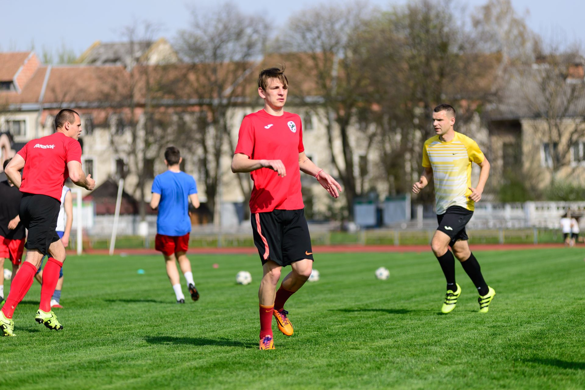
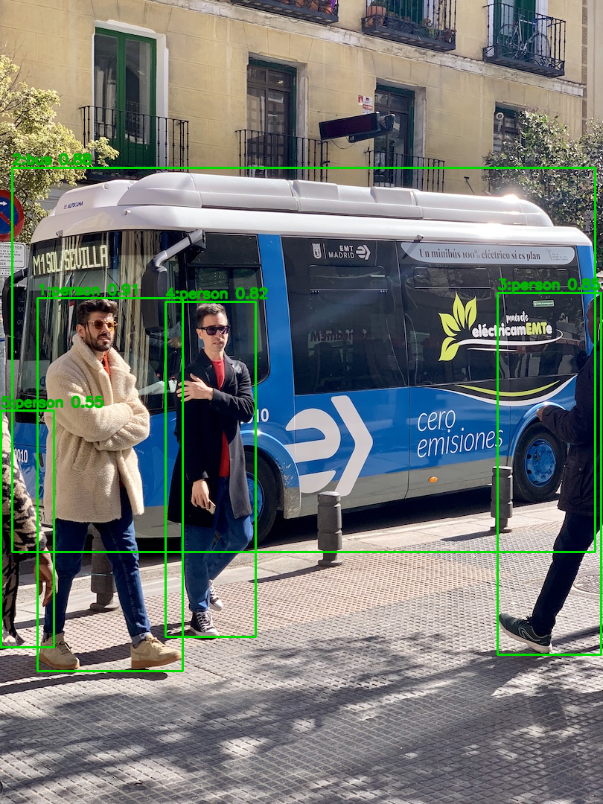
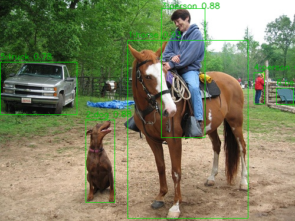
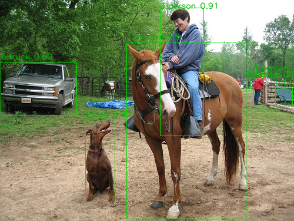
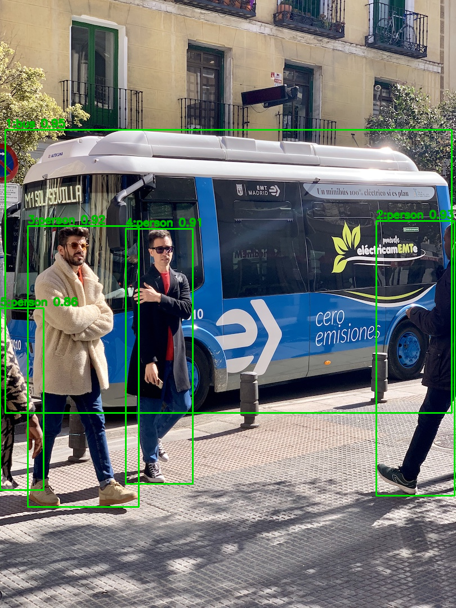
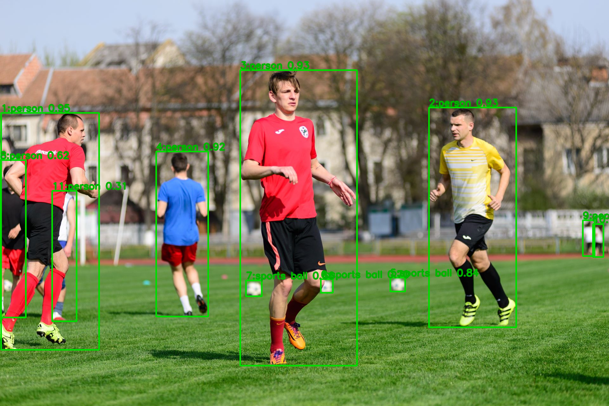
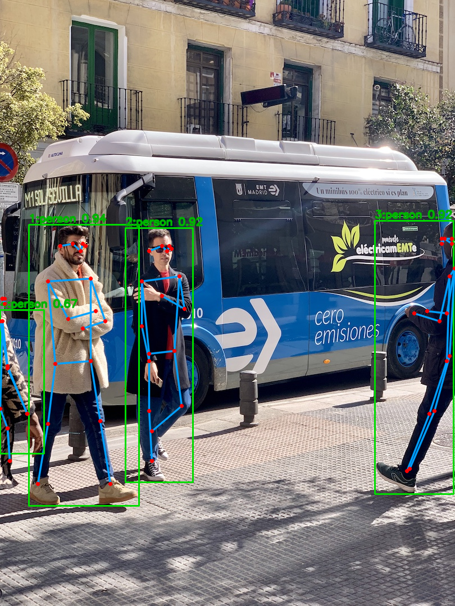
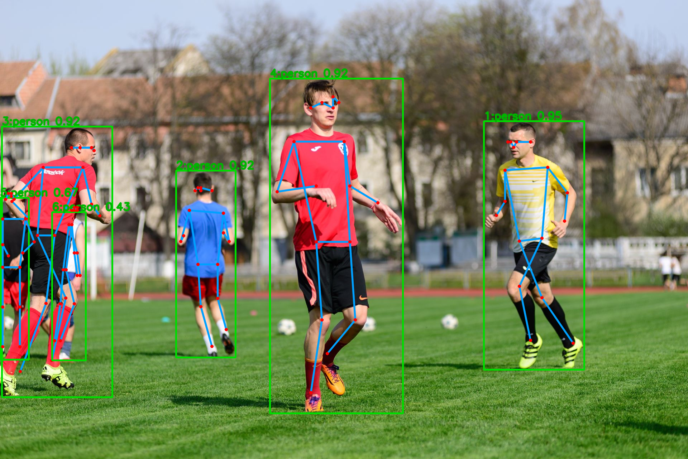

# libdet.axera 部署指南

libdet.axera 用于目标检测。本页说明 M.2 算力卡的接入条件、部署步骤与结果检查方法。

> 已实测，效果仍需评估。[查看部署效果](#查看部署效果)。

## 准备运行环境

本页效果展示使用 **RK3576 + AX8850 16GB M.2**；其他容量或平台需重新确认模型能否加载并正确运行。

在连接算力卡的 Linux 主机终端执行，RK3576 使用 ARM64 环境。首次部署先完成[驱动与设备检查](../../usage/device-check.md)、[准备主机环境](../../getting-started/prepare.md)和[下载工具安装](../../usage/download-models.md#使用-hugging-face-下载)。已完成这些步骤可直接下载模型。

后文使用设备 0，运行前用 `axcl-smi` 确认设备可用。

## 下载模型与样例

本页使用 `AXERA-TECH/libdet.axera` 的固定版本。下面下载本页选用的 10 个文件。

```bash
MODEL_DIR=~/edgeaccel/models/libdet-axera/0a50691f9581
mkdir -p "$MODEL_DIR"
~/edgeaccel/hf-env/bin/hf download AXERA-TECH/libdet.axera \
  "README.md" \
  "lib/aarch64/libdet.so" \
  "lib/pyaxdev.py" \
  "lib/pydet.py" \
  "lib/example.py" \
  "lib/gradio_example.py" \
  "lib/requirements.txt" \
  "include/libdet.h" \
  "include/ax_devices.h" \
  "examples/test_det.cpp" \
  --revision 0a50691f9581143c28be91c0e7247250fbc52daf \
  --local-dir "$MODEL_DIR"
cd "$MODEL_DIR"
```

保留当前终端中的 `MODEL_DIR` 变量，后续命令沿用此目录。下载受阻或需要离线复制时，见[下载方式与文件校验](../../usage/download-models.md)。

## 安装推理依赖

libdet.axera 提供统一的目标检测和人体姿态接口，模型权重来自配套的官方仓库。本页在 RK3576 + AX8850 16GB M.2 上运行官方 ARM64 SDK，显式选择 `AxDeviceType.axcl_device`、设备0。

在 RK3576 主机执行，`$MODEL_DIR` 为上方下载的 SDK 目录：

```bash
source ~/edgeaccel/python-env/bin/activate
python -m pip install 'numpy==1.26.4' 'opencv-python-headless==4.11.0.86'
ldd "$MODEL_DIR/lib/aarch64/libdet.so"
```

确认依赖没有 `not found`。示例检查固定版本库及 Python 封装的校验值；如果主机另外安装了 `/home/axera/libdet.axera/build/libdet.so`，先整理库的加载配置，避免官方封装优先加载另一份库。

## 下载配套权重和输入图片

SDK 与权重需要匹配。下面为 YOLOv8s 选用官方历史版本的三输出头权重；当前仓库的六输出头权重不能直接交给本页 SDK。YOLO11s、YOLO11x 和 YOLO11x-Pose 使用各自固定版本。

```bash
WEIGHTS_DIR=~/edgeaccel/models/libdet-weights
INPUT_DIR=~/edgeaccel/inputs/libdet
mkdir -p "$WEIGHTS_DIR" "$INPUT_DIR"

~/edgeaccel/hf-env/bin/hf download AXERA-TECH/YOLOv8 \
  ax650/yolov8s.axmodel \
  --revision 6380cf5da7db0efa8414ea0e3dbbc801fe22d9a0 \
  --local-dir "$WEIGHTS_DIR/yolov8"

~/edgeaccel/hf-env/bin/hf download AXERA-TECH/YOLO11 \
  ax650/yolo11s.axmodel ax650/yolo11x.axmodel \
  --revision e178719ba1b03eaf07c981f859027f3278c1cb29 \
  --local-dir "$WEIGHTS_DIR/yolo11"

~/edgeaccel/hf-env/bin/hf download AXERA-TECH/YOLO11-Pose \
  ax650/yolo11x-pose.axmodel \
  --revision 156938308275ed3dbe3772898d8766a399aeb173 \
  --local-dir "$WEIGHTS_DIR/yolo11-pose"

~/edgeaccel/hf-env/bin/hf download AXERA-TECH/YOLOv8 bus.jpg \
  --revision 65567714c2388b9c6b85bfb10b21535e7db0dee0 \
  --local-dir "$INPUT_DIR"

~/edgeaccel/hf-env/bin/hf download AXERA-TECH/YOLO11 \
  football.jpg ssd_horse.jpg \
  --revision e178719ba1b03eaf07c981f859027f3278c1cb29 \
  --local-dir "$INPUT_DIR"
```

四份权重合计约145 MB。下载受阻时可参考[下载方式与文件校验](../../usage/download-models.md)。请保留文件名和目录层级，示例会逐一校验权重与输入。

| 运行名称 | SDK模型类型 | 类别数 | 关键点数 |
| --- | ---: | ---: | ---: |
| `yolov8s` | 1 | 80 | 0 |
| `yolo11s`、`yolo11x` | 3 | 80 | 0 |
| `yolo11x-pose` | 4 | 1 | 17 |

姿态模型只检测人体，不会输出车辆或动物类别。本页没有验证 YOLOv5 和 YOLOv8-Pose 入口。

## 执行检测和姿态估计

下载 [LibDet 算力卡示例](../../../static/examples/libdet_card.py)，保存为 `~/edgeaccel/libdet_card.py`。沿用当前终端中的三个目录变量：

```bash
python ~/edgeaccel/libdet_card.py \
  --sdk-dir "$MODEL_DIR" \
  --yolov8-dir "$WEIGHTS_DIR/yolov8" \
  --yolo11-dir "$WEIGHTS_DIR/yolo11" \
  --pose-dir "$WEIGHTS_DIR/yolo11-pose" \
  --input-dir "$INPUT_DIR" \
  --output ~/edgeaccel/results/libdet-01
```

输出目录须尚不存在。程序逐个加载和释放四个模型，每个模型依次处理三张原图、足球图重复输入和灰色空白图。默认分数阈值为0.25。

`deployment-result.json` 中 `"completed": true` 表示全部步骤完成。打开 `yolo11s-bus-result.png` 查看车辆和行人检测，打开 `yolo11x-pose-football-result.png` 查看人体关键点。

| 输出 | 内容 |
| --- | --- |
| `<模型>-<样例>-input.png` | 实际输入图片 |
| `<模型>-<样例>-result.png` | 本次框、类别、分数和关键点绘图 |
| `deployment-result.json` | 完整坐标、输入输出校验值和SDK调用耗时 |
| `*-native.bin` | 原始SDK结果结构，可保留用于复核 |

检测框使用 `x、y、宽、高`。接口接收 RGB、`uint8` 的连续内存图像，示例负责从 OpenCV 的 BGR 格式转换。每次结果最多64个对象。

姿态接口只返回关键点坐标，没有逐点置信度或可见性。示例用固定人体拓扑连接图像范围内的点；连线不表示每个关节都准确可见，图像外的点保留在JSON中，但不绘制。

## 使用自己的图片

只运行 YOLO11s 时，可以省略其他两组权重目录，使用 `--image` 代替默认输入目录：

```bash
python ~/edgeaccel/libdet_card.py \
  --sdk-dir "$MODEL_DIR" \
  --yolo11-dir "$WEIGHTS_DIR/yolo11" \
  --variant yolo11s \
  --image ~/Pictures/input.jpg \
  --output ~/edgeaccel/results/libdet-custom-01
```

`--image` 可重复传入多张图片，自定义输入按 `custom-1` 等名称保存。示例限制每边不超过4096像素。用 `--threshold` 调整传入SDK的阈值后，需要重新检查漏检、误检及相邻目标的保留情况；本次效果展示只对应0.25。

本页检查了输入、SDK返回结构、重复执行和绘图坐标。检测数量不能直接当成正确目标数，不同模型的返回数量也不代表准确率排名。完整数据集精度、关键点误差、长期运行和实际8GB卡仍需分别验证。


## 查看部署效果

**已运行，效果仍需评估** · 2026-09-28 · RK3576 + AX8850 16GB M.2。以下输入与输出来自本页固定版本的实际运行。

使用固定SDK完成YOLOv8s、YOLO11s、YOLO11x与YOLO11x-Pose的20次串行调用，展示三种场景、原始检测数量与17点人体姿态。

**yolov8s 检测效果**

本次使用与SDK匹配的官方历史三输出头权重。公交图返回4个人和1辆公交车；足球图返回6个人、2个球；马匹场景返回6个框。小目标和被遮挡区域仍需逐项核对。

<div className="model-effect-gallery">

<figure>

[](../../../static/validation/effects/libdet-axera-20260928/bus-input.png)

<figcaption>公交与行人：本次实际输入</figcaption>
</figure>

<figure>

[](../../../static/validation/effects/libdet-axera-20260928/football-input.png)

<figcaption>足球场景：本次实际输入</figcaption>
</figure>

<figure>

[](../../../static/validation/effects/libdet-axera-20260928/ssd_horse-input.png)

<figcaption>马匹场景：本次实际输入</figcaption>
</figure>

<figure>

[](../../../static/validation/effects/libdet-axera-20260928/yolov8s-bus-result.png)

<figcaption>yolov8s / 公交与行人：本次实际输出</figcaption>
</figure>

<figure>

[](../../../static/validation/effects/libdet-axera-20260928/yolov8s-football-result.png)

<figcaption>yolov8s / 足球场景：本次实际输出</figcaption>
</figure>

<figure>

[](../../../static/validation/effects/libdet-axera-20260928/yolov8s-ssd_horse-result.png)

<figcaption>yolov8s / 马匹场景：本次实际输出</figcaption>
</figure>

</div>

| 输入 | 对象数 | SDK返回类别 | SDK调用 / ms |
| --- | --- | --- | --- |
| 公交与行人 | 5 | person × 4、bus × 1 | 36.458 |
| 足球场景 | 8 | person × 6、sports ball × 2 | 36.072 |
| 马匹场景 | 6 | horse × 1、dog × 1、person × 2、truck × 1、bench × 1 | 32.365 |
| 足球重复输入 | 8 | person × 6、sports ball × 2 | 35.808 |
| 灰色空白 | 0 | 无 | 30.599 |

**yolo11s 检测效果**

公交图返回5个框，足球图8个框，马匹图8个框。框内标注为类别与分数，结果保留远处的小目标；没有据此计算准确率或召回率。

<div className="model-effect-gallery">

<figure>

[](../../../static/validation/effects/libdet-axera-20260928/yolo11s-bus-result.png)

<figcaption>yolo11s / 公交与行人：本次实际输出</figcaption>
</figure>

<figure>

[](../../../static/validation/effects/libdet-axera-20260928/yolo11s-football-result.png)

<figcaption>yolo11s / 足球场景：本次实际输出</figcaption>
</figure>

<figure>

[](../../../static/validation/effects/libdet-axera-20260928/yolo11s-ssd_horse-result.png)

<figcaption>yolo11s / 马匹场景：本次实际输出</figcaption>
</figure>

</div>

| 输入 | 对象数 | SDK返回类别 | SDK调用 / ms |
| --- | --- | --- | --- |
| 公交与行人 | 5 | bus × 1、person × 4 | 34.476 |
| 足球场景 | 8 | person × 6、sports ball × 2 | 35.324 |
| 马匹场景 | 8 | horse × 1、dog × 1、person × 4、bench × 1、truck × 1 | 32.395 |
| 足球重复输入 | 8 | person × 6、sports ball × 2 | 36.188 |
| 灰色空白 | 0 | 无 | 33.098 |

**yolo11x 检测效果**

公交图返回5个框，足球图11个框，马匹图9个框。与较小版本相比，远处目标和车辆类别的结果有所不同；返回更多框不能直接判定效果更好。

<div className="model-effect-gallery">

<figure>

[](../../../static/validation/effects/libdet-axera-20260928/yolo11x-bus-result.png)

<figcaption>yolo11x / 公交与行人：本次实际输出</figcaption>
</figure>

<figure>

[](../../../static/validation/effects/libdet-axera-20260928/yolo11x-football-result.png)

<figcaption>yolo11x / 足球场景：本次实际输出</figcaption>
</figure>

<figure>

[](../../../static/validation/effects/libdet-axera-20260928/yolo11x-ssd_horse-result.png)

<figcaption>yolo11x / 马匹场景：本次实际输出</figcaption>
</figure>

</div>

| 输入 | 对象数 | SDK返回类别 | SDK调用 / ms |
| --- | --- | --- | --- |
| 公交与行人 | 5 | bus × 1、person × 4 | 59.201 |
| 足球场景 | 11 | person × 8、sports ball × 3 | 57.442 |
| 马匹场景 | 9 | horse × 2、dog × 1、person × 4、car × 1、bench × 1 | 54.160 |
| 足球重复输入 | 11 | person × 8、sports ball × 3 | 58.468 |
| 灰色空白 | 0 | 无 | 51.537 |

**yolo11x-pose 检测效果**

公交、足球和马匹图分别返回4、6、1个人体，每个对象返回17个坐标。公交图有一个关键点位于图像外，未绘制该点；JSON保留原始值。远处人物可能漏检，连接线未按逐点置信度筛选。

<div className="model-effect-gallery">

<figure>

[](../../../static/validation/effects/libdet-axera-20260928/yolo11x-pose-bus-result.png)

<figcaption>yolo11x-pose / 公交与行人：本次实际输出</figcaption>
</figure>

<figure>

[](../../../static/validation/effects/libdet-axera-20260928/yolo11x-pose-football-result.png)

<figcaption>yolo11x-pose / 足球场景：本次实际输出</figcaption>
</figure>

<figure>

[](../../../static/validation/effects/libdet-axera-20260928/yolo11x-pose-ssd_horse-result.png)

<figcaption>yolo11x-pose / 马匹场景：本次实际输出</figcaption>
</figure>

</div>

| 输入 | 对象数 | SDK返回类别 | SDK调用 / ms |
| --- | --- | --- | --- |
| 公交与行人 | 4 | person × 4 | 52.450 |
| 足球场景 | 6 | person × 6 | 54.649 |
| 马匹场景 | 1 | person × 1 | 50.895 |
| 足球重复输入 | 6 | person × 6 | 54.199 |
| 灰色空白 | 0 | 无 | 48.514 |

**重复输入、空白结果与接口范围**

四个模型的足球图重复输入，原始结果结构和标注PNG均完全一致；灰色空白图均返回0个对象，输出像素保持不变。SDK调用时间包含预处理、传输、推理和后处理，不含加载、文件读写、绘图与保存；每模型仅5次且包含首次调用，没有预热。

<div className="model-effect-gallery">

<figure>

[](../../../static/validation/effects/libdet-axera-20260928/blank-result.png)

<figcaption>灰色空白图：四个模型均未检出，图示为YOLOv8s本次输出</figcaption>
</figure>

</div>

| 模型 | 调用次数 | 平均SDK调用 / ms |
| --- | --- | --- |
| yolov8s | 5 | 34.260 |
| yolo11s | 5 | 34.296 |
| yolo11x | 5 | 56.161 |
| yolo11x-pose | 5 | 52.141 |

**使用时注意：**

- YOLOv8使用明确固定的历史三输出头权重；当前六输出头版本未通过本SDK的接口匹配，不能直接替换。
- 姿态结果没有逐点置信度；有一个坐标位于图像外，远处人物可能漏检。

这些结果用于对照部署后的输出，未覆盖完整数据集精度或长期连续运行。

<details>
<summary>查看样例环境与运行耗时</summary>

环境：RK3576 + AX8850 16GB M.2。日期：2026-09-28。模型版本：`0a50691f9581143c28be91c0e7247250fbc52daf`。

| 组件 | 版本或配置 |
| --- | --- |
| 主机 / 内核 | RK3576，约 4GB RAM，6.1.115-vendor-rk35xx |
| AXCL / 驱动 | V3.16.0_20260729180218 |
| 固件 / CMM | V3.16.0 / 15232 MiB |
| 运行方式 | 官方 libdet.so ARM64 AXCL SDK / Python ctypes，显式设备0；四模型依次加载与释放 |

| 指标 | 实测值 | 计时或统计范围 |
| --- | --- | --- |
| 已运行组合 | 4个模型 / 20次调用 | 固定SDK与本页列出的兼容权重，非所有模型类型或版本。 |
| 重复输入 | 4组结果一致 | 原始SDK结果结构、坐标分数及绘图文件一致。 |
| 空白输入 | 均为0个对象 | 固定灰色输入、分数阈值0.25。 |

适用范围：

- YOLOv8使用明确固定的历史三输出头权重；当前六输出头版本未通过本SDK的接口匹配，不能直接替换。
- 姿态结果没有逐点置信度；有一个坐标位于图像外，远处人物可能漏检。
- 检测数量不是正确目标数量；未完成COCO精度、关键点误差、浮点对照或实际8GB回归。
- 本次验证原生SDK整体流程，未捕获底层输入输出张量，也未测试Gradio网页界面。

</details>

遇到加载、内存或后端错误时，按[常见问题](../../usage/troubleshooting.md)处理。需要更换输入或接入业务时，按[检查输出与记录结果](../../reference/validation.md)保留自己的结果。

<details>
<summary>查看文件用途与版本信息</summary>

| 文件 / 目录内路径 | 用途 |
| --- | --- |
| [`lib/gradio_example.py`](https://huggingface.co/AXERA-TECH/libdet.axera/blob/0a50691f9581143c28be91c0e7247250fbc52daf/lib/gradio_example.py) | Python 程序 / 前后处理 |
| [`lib/requirements.txt`](https://huggingface.co/AXERA-TECH/libdet.axera/blob/0a50691f9581143c28be91c0e7247250fbc52daf/lib/requirements.txt) | Python 依赖清单 |

仓库提交：`0a50691f9581143c28be91c0e7247250fbc52daf`。仓库中的 0 个 `.axmodel` 文件可能包括多个芯片、规格和分片。运行时使用本页指定的配套文件，完整列表见[固定版本目录](https://huggingface.co/AXERA-TECH/libdet.axera/tree/0a50691f9581143c28be91c0e7247250fbc52daf)。

</details>

<details>
<summary>补充说明与版本差异</summary>

- 该提交未直接列出 .axmodel 文件；先核对模型卡指向的实际权重或程序仓库，不能将该目录直接交给 axcl_run_model。

</details>

## 参考资料

- [常用术语](../../reference/glossary.md)：AXCL、CMM、分词器与推理指标。
- [固定版本文件表](https://huggingface.co/AXERA-TECH/libdet.axera/tree/0a50691f9581143c28be91c0e7247250fbc52daf)。
- [模型卡 / 使用说明](https://huggingface.co/AXERA-TECH/libdet.axera/blob/0a50691f9581143c28be91c0e7247250fbc52daf/README.md)。
- [主要程序入口：lib/gradio_example.py](https://huggingface.co/AXERA-TECH/libdet.axera/blob/0a50691f9581143c28be91c0e7247250fbc52daf/lib/gradio_example.py)。
- [配套项目：AXERA-TECH/libdet.axera](https://github.com/AXERA-TECH/libdet.axera)。

返回[完整模型目录](../catalog.mdx)。
