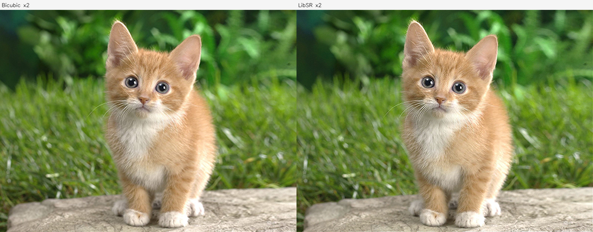
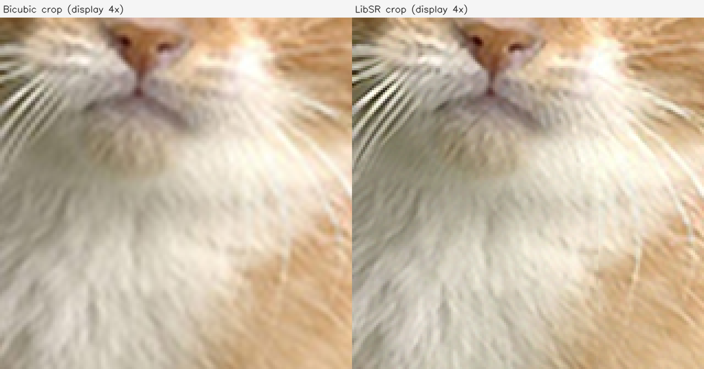
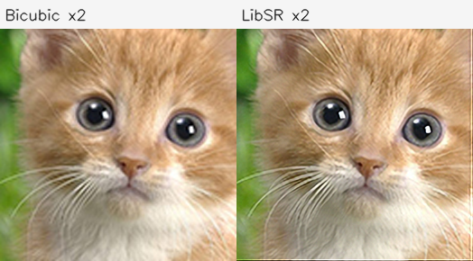
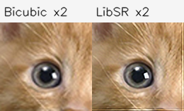
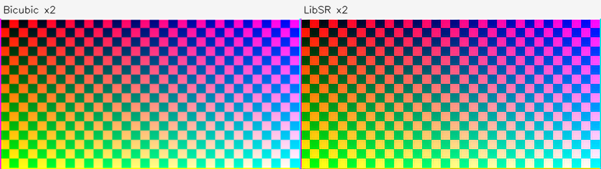
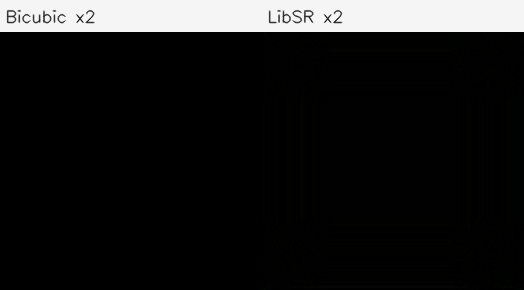
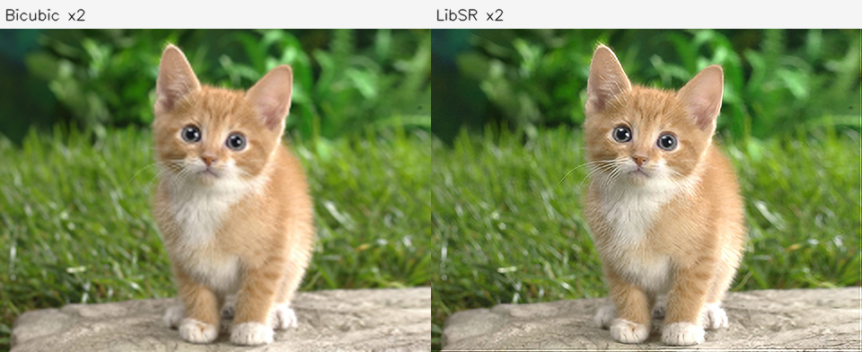
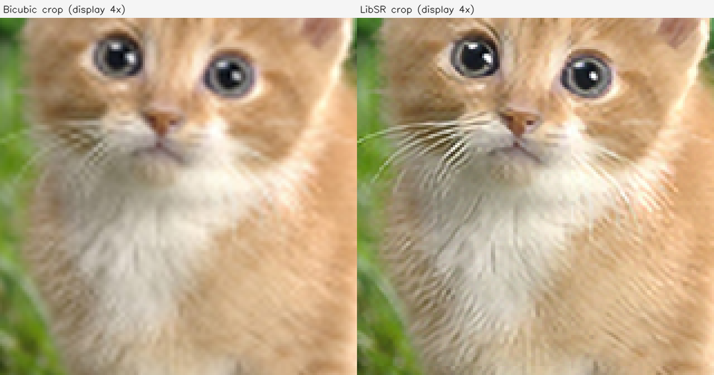

# libsr.axera 部署指南

libsr.axera 用于图像增强与修复。本页说明 M.2 算力卡的接入条件、部署步骤与结果检查方法。

> 已实测，效果仍需评估。[查看部署效果](#查看部署效果)。

## 准备运行环境

本页效果展示使用 **RK3576 + AX8850 16GB M.2**；其他容量或平台需重新确认模型能否加载并正确运行。

在连接算力卡的 Linux 主机终端执行，RK3576 使用 ARM64 环境。首次部署先完成[驱动与设备检查](../../usage/device-check.md)、[准备主机环境](../../getting-started/prepare.md)和[下载工具安装](../../usage/download-models.md#使用-hugging-face-下载)。已完成这些步骤可直接下载模型。

后文使用设备 0，运行前用 `axcl-smi` 确认设备可用。

## 下载模型与样例

本页使用 `AXERA-TECH/libsr.axera` 的固定版本。下面下载本页选用的 11 个文件。

```bash
MODEL_DIR=~/edgeaccel/models/libsr-axera/7748f88f9f6d
mkdir -p "$MODEL_DIR"
~/edgeaccel/hf-env/bin/hf download AXERA-TECH/libsr.axera \
  "README.md" \
  "Images/cat.jpg" \
  "edsr_x2_128.axmodel" \
  "lib/aarch64/libsr.so" \
  "lib/pyaxdev.py" \
  "lib/pysr.py" \
  "lib/example.py" \
  "lib/gradio_example.py" \
  "lib/requirements.txt" \
  "include/ax_sr.h" \
  "include/ax_devices.h" \
  --revision 7748f88f9f6dd8e536f2db920ba76822826fd52a \
  --local-dir "$MODEL_DIR"
cd "$MODEL_DIR"
```

保留当前终端中的 `MODEL_DIR` 变量，后续命令沿用此目录。下载受阻或需要离线复制时，见[下载方式与文件校验](../../usage/download-models.md)。

## 安装推理依赖

本页使用 `edsr_x2_128.axmodel` 和仓库配套的 ARM64 `libsr.so`，在 RK3576 + AX8850 16GB M.2 算力卡上将图片宽高各放大 2 倍。

在 RK3576 主机执行，沿用上方下载步骤中的 `$MODEL_DIR`：

```bash
source ~/edgeaccel/python-env/bin/activate
python -m pip install 'numpy==1.26.4' 'opencv-python-headless==4.11.0.86'
ldd "$MODEL_DIR/lib/aarch64/libsr.so"
```

动态库依赖不应出现 `not found`。本页示例使用 AXCL，显式选择 `AxDeviceType.axcl_device`、设备 0，不会自动切换到主机 NPU。

## 放大图片并保存结果

下载 [LibSR 算力卡示例](../../../static/examples/libsr_card.py)，保存为 `~/edgeaccel/libsr_card.py`，执行：

```bash
python ~/edgeaccel/libsr_card.py \
  --model-dir "$MODEL_DIR" \
  --output ~/edgeaccel/results/libsr-01
```

选择尚不存在的输出目录。默认运行官方猫图、重复图、两种裁剪尺寸、彩色边框图、空白图，以及缩小后恢复的猫图。程序核对 SDK 和权重版本，每次只处理一个 128×128 图块，再按原位置拼接；右侧和底部不足一块的部分补零，最后裁剪为原图宽高的 2 倍。

接口输入为 OpenCV 读取的 BGR、`uint8`、连续内存图像。图块无重叠，结果可能出现边界接缝；不要把分块放大直接当作已经验收的整图增强方案。

运行结束后，`deployment-result.json` 中应有 `"completed": true`。打开以下文件检查结果：

| 文件 | 内容 |
| --- | --- |
| `cat-input.png` | 实际输入，480×360 |
| `cat-sr.png` | 算力卡输出，960×720 |
| `cat-comparison.png` | 左侧双三次插值，右侧本次模型输出 |
| `cat-zoom.png` | 同一区域对照，两侧均额外放大 4 倍便于观察 |
| `cat-downsample-comparison.png` | 原图缩小到240×180后恢复到480×360的对照 |
| `deployment-result.json` | 输入、输出校验值、图块数量和调用耗时 |

其中 `*-zoom.png` 的 4 倍是展示缩放，模型本身仍为 2 倍超分辨率。`tiles/` 保存实际图块输出，用于核对拼接；完整结果目录保留后可离线查看。

## 更换输入图片

使用 `--image` 指定图片，可重复传入多个文件：

```bash
python ~/edgeaccel/libsr_card.py \
  --model-dir "$MODEL_DIR" \
  --image ~/Pictures/input.jpg \
  --output ~/edgeaccel/results/libsr-custom-01
```

自定义图片按 `custom-1`、`custom-2` 编号输出。本示例限制输入宽度不超过3840、高度不超过2160；较大图片需要更多图块、主机内存和保存空间。自定义模式不自动生成缩小后恢复的指标。

## 对照缩小后恢复的误差

默认样例先用 OpenCV `INTER_AREA` 将官方猫图缩小一半，再分别用模型和双三次插值恢复到原尺寸。原 JPEG 解码后的像素作为本次对照参考，只能说明这一张图片在指定缩小方式下的恢复误差。

下载 [样例指标计算脚本](../../../static/examples/evaluate_libsr.py)，保存为 `~/edgeaccel/evaluate_libsr.py`：

```bash
python ~/edgeaccel/evaluate_libsr.py \
  --results ~/edgeaccel/results/libsr-01
```

PSNR 使用全部 BGR 像素；SSIM 分别计算三个通道，采用11×11、σ=1.5的高斯窗口，排除无法容纳完整窗口的边缘中心后取平均。数值越高表示与这份参考像素越接近，不代表感知效果一定更好。本次模型的两项指标均低于双三次插值，实际结果见下方。

这组对照不替代带真实低清/高清配对图像的测试，也不证明量化与浮点模型一致。重复运行一致、输出尺寸正确属于运行检查；接缝、纹理、颜色和业务图片效果仍需单独确认。


## 查看部署效果

**已运行，效果仍需评估** · 2026-09-28 · RK3576 + AX8850 16GB M.2。以下输入与输出来自本页固定版本的实际运行。

完成七组输入、43次串行图块调用与实际2倍放大，展示插值对照、边缘行为及单图缩小后恢复指标。

**官方图片放大与局部对照**

输入为480×360猫图，输出960×720。对照图左侧为双三次插值，右侧为本次算力卡输出；模型使部分毛发和胡须边缘更锐利，也可见图块边界的细线。局部图两侧使用相同裁剪和展示倍率，没有替换为上游预制结果。

<div className="model-effect-gallery">

<figure>

[](../../../static/validation/effects/libsr-axera-20260928/cat-input.png)

<figcaption>本次实际输入：480×360</figcaption>
</figure>

<figure>

[](../../../static/validation/effects/libsr-axera-20260928/cat-sr.png)

<figcaption>本次实际输出：960×720，点击查看原尺寸</figcaption>
</figure>

<figure>

[](../../../static/validation/effects/libsr-axera-20260928/cat-comparison.png)

<figcaption>左：双三次插值；右：LibSR ×2</figcaption>
</figure>

<figure>

[](../../../static/validation/effects/libsr-axera-20260928/cat-zoom.png)

<figcaption>同一区域细节：左为插值，右为模型；额外4倍仅用于显示</figcaption>
</figure>

</div>

| 项目 | 实测结果 |
| --- | --- |
| 模型倍率 | 宽高各2倍 |
| 运行方式 | 128×128图块串行，无重叠 |
| 重复结果 | 两次完整输出逐像素一致 |

**小图片、奇数尺寸与边框**

131×129和65×63输入均生成正确的2倍尺寸，补零部分未留在最终画布。右侧和底部附近仍可能出现边缘纹理；彩色图中可见分块边界。尺寸通过不表示无接缝。

<div className="model-effect-gallery">

<figure>

[](../../../static/validation/effects/libsr-axera-20260928/cat-odd-comparison.png)

<figcaption>131×129裁剪输入的放大对照</figcaption>
</figure>

<figure>

[](../../../static/validation/effects/libsr-axera-20260928/cat-small-comparison.png)

<figcaption>65×63小图的放大对照</figcaption>
</figure>

<figure>

[](../../../static/validation/effects/libsr-axera-20260928/pattern-comparison.png)

<figcaption>257×129彩色边框图的放大对照</figcaption>
</figure>

</div>

| 项目 | 实测结果 |
| --- | --- |
| 猫图裁剪 | 131×129 → 262×258 |
| 小图裁剪 | 65×63 → 130×126 |
| 彩色边框图 | 257×129 → 514×258 |

**空白输入**

黑色输入的双三次插值仍为全零；模型输出通道值为0～7，包含45106个非零通道值，显示时接近黑色但不是严格全零。这不是新场景细节。

<div className="model-effect-gallery">

<figure>

[](../../../static/validation/effects/libsr-axera-20260928/blank-comparison.png)

<figcaption>黑色输入对照：左为插值，右为模型原始输出，未增强亮度</figcaption>
</figure>

</div>

| 项目 | 实测结果 |
| --- | --- |
| 输入 / 输出 | 131×129 → 262×258 |
| 输出范围 | 0～7 / uint8 |
| 非零通道值 | 45106 |

**同一张图缩小后恢复**

将官方猫图先按面积插值缩小到240×180，再恢复到480×360，与原JPEG解码像素对照。本次LibSR的PSNR和SSIM均低于双三次插值；图像锐化观感不能替代像素保真评估。这里只有一张人为缩小的图片，不是完整超分辨率基准。

<div className="model-effect-gallery">

<figure>

[](../../../static/validation/effects/libsr-axera-20260928/cat-downsample-comparison.png)

<figcaption>缩小后恢复：左为双三次插值，右为模型</figcaption>
</figure>

<figure>

[](../../../static/validation/effects/libsr-axera-20260928/cat-downsample-zoom.png)

<figcaption>恢复结果的同区域放大对照</figcaption>
</figure>

</div>

| 方法 | PSNR / dB | SSIM |
| --- | --- | --- |
| 双三次插值 | 34.7481 | 0.939726 |
| LibSR ×2 | 30.7730 | 0.935403 |

**SDK图块调用耗时**

每项统计该图片全部ax_sr_run调用的总耗时，包含原生处理与数据传输；不含加载模型、Python拼接、文件读写和展示图生成。43次图块调用均串行执行，包含首次调用且没有预热；这些数值不能当作整图端到端FPS。

| 输入 | 尺寸 | 图块数 | SDK调用合计 / ms |
| --- | --- | --- | --- |
| 官方猫图 | 480×360 | 12 | 126.549 |
| 猫图重复 | 480×360 | 12 | 116.075 |
| 奇数尺寸 | 131×129 | 4 | 38.707 |
| 小图片 | 65×63 | 1 | 9.711 |
| 彩色边框 | 257×129 | 6 | 57.467 |
| 黑色空白 | 131×129 | 4 | 37.902 |
| 缩小后恢复 | 240×180 | 4 | 37.998 |

**使用时注意：**

- 无重叠分块存在边界接缝，空白输入输出不严格为零；请查看本页原尺寸图片。
- 单图缩小后恢复中，模型PSNR/SSIM低于双三次插值；尚未完成真实LR/HR图集、浮点参考或实际8GB回归。

这些结果用于对照部署后的输出，未覆盖完整数据集精度或长期连续运行。

<details>
<summary>查看样例环境与运行耗时</summary>

环境：RK3576 + AX8850 16GB M.2。日期：2026-09-28。模型版本：`7748f88f9f6dd8e536f2db920ba76822826fd52a`。

| 组件 | 版本或配置 |
| --- | --- |
| 主机 / 内核 | RK3576，约 4GB RAM，6.1.115-vendor-rk35xx |
| AXCL / 驱动 | V3.16.0_20260729180218 |
| 固件 / CMM | V3.16.0 / 15232 MiB |
| 运行方式 | 官方 libsr.so ARM64 AXCL SDK / Python ctypes，显式设备0；128×128图块逐次调用 |

| 指标 | 实测值 | 计时或统计范围 |
| --- | --- | --- |
| 实际输出 | 960×720 | 480×360官方图片，模型宽高各2倍。 |
| 重复检查 | 逐像素一致 | 两次完整猫图输出；不代表画质或长期稳定性验收。 |
| SDK图块调用 | 平均 9.870 ms | 43次128×128图块调用，含首次、不含模型加载、Python拼接和文件保存。 |

适用范围：

- 无重叠分块存在边界接缝，空白输入输出不严格为零；请查看本页原尺寸图片。
- 单图缩小后恢复中，模型PSNR/SSIM低于双三次插值；尚未完成真实LR/HR图集、浮点参考或实际8GB回归。
- 仅验证配套SDK和本页串行图块示例；没有验证Gradio界面、原生整图并发入口或长期服务。

</details>

遇到加载、内存或后端错误时，按[常见问题](../../usage/troubleshooting.md)处理。需要更换输入或接入业务时，按[检查输出与记录结果](../../reference/validation.md)保留自己的结果。

<details>
<summary>查看文件用途与版本信息</summary>

| 文件 / 目录内路径 | 用途 |
| --- | --- |
| [`lib/example.py`](https://huggingface.co/AXERA-TECH/libsr.axera/blob/7748f88f9f6dd8e536f2db920ba76822826fd52a/lib/example.py) | Python 程序 / 前后处理 |
| [`lib/gradio_example.py`](https://huggingface.co/AXERA-TECH/libsr.axera/blob/7748f88f9f6dd8e536f2db920ba76822826fd52a/lib/gradio_example.py) | Python 程序 / 前后处理 |
| [`edsr_x2_128.axmodel`](https://huggingface.co/AXERA-TECH/libsr.axera/blob/7748f88f9f6dd8e536f2db920ba76822826fd52a/edsr_x2_128.axmodel) | 编译模型；按目录区分芯片和规格 |
| [`Images/gradio_demo.jpg`](https://huggingface.co/AXERA-TECH/libsr.axera/blob/7748f88f9f6dd8e536f2db920ba76822826fd52a/Images/gradio_demo.jpg) | 示例输入 |
| [`config.json`](https://huggingface.co/AXERA-TECH/libsr.axera/blob/7748f88f9f6dd8e536f2db920ba76822826fd52a/config.json) | 运行配置 |
| [`lib/gradio_demo.jpg`](https://huggingface.co/AXERA-TECH/libsr.axera/blob/7748f88f9f6dd8e536f2db920ba76822826fd52a/lib/gradio_demo.jpg) | 示例输入 |
| [`lib/requirements.txt`](https://huggingface.co/AXERA-TECH/libsr.axera/blob/7748f88f9f6dd8e536f2db920ba76822826fd52a/lib/requirements.txt) | Python 依赖清单 |

仓库提交：`7748f88f9f6dd8e536f2db920ba76822826fd52a`。仓库中的 1 个 `.axmodel` 文件可能包括多个芯片、规格和分片。运行时使用本页指定的配套文件，完整列表见[固定版本目录](https://huggingface.co/AXERA-TECH/libsr.axera/tree/7748f88f9f6dd8e536f2db920ba76822826fd52a)。

</details>

## 参考资料

- [常用术语](../../reference/glossary.md)：AXCL、CMM、分词器与推理指标。
- [固定版本文件表](https://huggingface.co/AXERA-TECH/libsr.axera/tree/7748f88f9f6dd8e536f2db920ba76822826fd52a)。
- [模型卡 / 使用说明](https://huggingface.co/AXERA-TECH/libsr.axera/blob/7748f88f9f6dd8e536f2db920ba76822826fd52a/README.md)。
- [主要程序入口：lib/example.py](https://huggingface.co/AXERA-TECH/libsr.axera/blob/7748f88f9f6dd8e536f2db920ba76822826fd52a/lib/example.py)。
- [配套项目：sanghyun-son/EDSR-PyTorch](https://github.com/sanghyun-son/EDSR-PyTorch)。

返回[完整模型目录](../catalog.mdx)。
