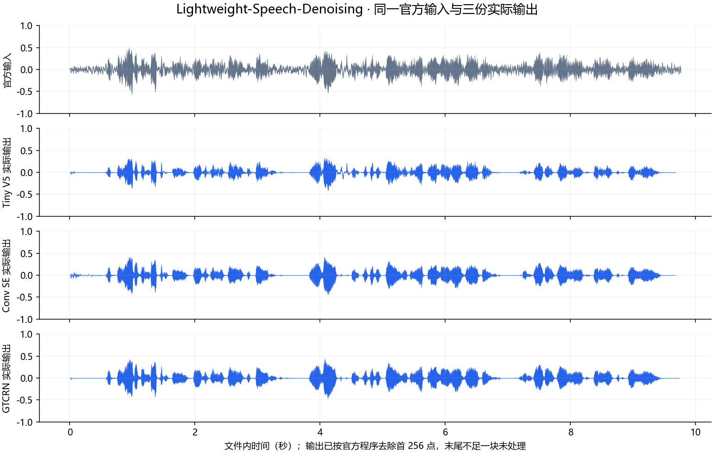
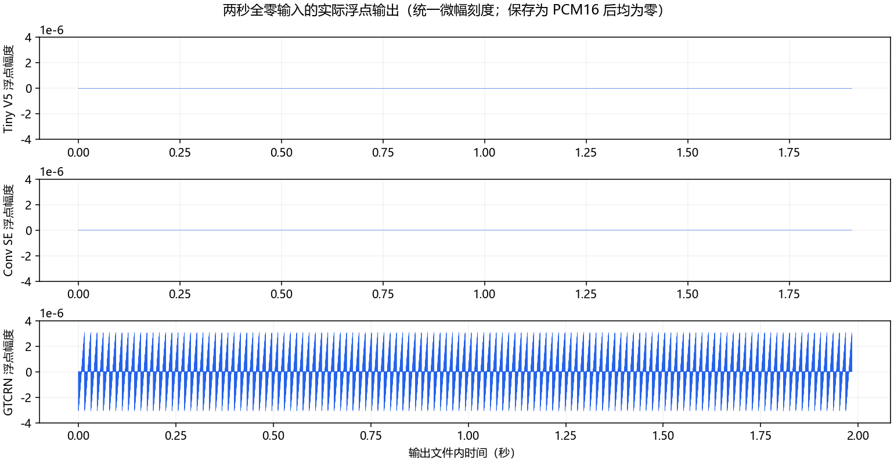

# Lightweight-Speech-Denoising.axera 部署指南

Lightweight-Speech-Denoising.axera 用于语音增强与分离。本页说明 M.2 算力卡的接入条件、部署步骤与结果检查方法。

> 已实测，效果仍需评估。[查看部署效果](#查看部署效果)。

## 准备运行环境

本页效果展示使用 **RK3576 + AX8850 16GB M.2**；其他容量或平台需重新确认模型能否加载并正确运行。

在连接算力卡的 Linux 主机终端执行，RK3576 使用 ARM64 环境。首次部署先完成[驱动与设备检查](../../usage/device-check.md)、[准备主机环境](../../getting-started/prepare.md)和[下载工具安装](../../usage/download-models.md#使用-hugging-face-下载)。已完成这些步骤可直接下载模型。

后文使用设备 0，运行前用 `axcl-smi` 确认设备可用。

## 下载模型与样例

本页使用 `AXERA-TECH/Lightweight-Speech-Denoising.axera` 的固定版本。下面下载本页选用的 9 个文件。

```bash
MODEL_DIR=~/edgeaccel/models/lightweight-speech-denoising-axera/55235db82957
mkdir -p "$MODEL_DIR"
~/edgeaccel/hf-env/bin/hf download AXERA-TECH/Lightweight-Speech-Denoising.axera \
  "README.md" \
  "run_ax650_all.sh" \
  "test_wavs/mix.wav" \
  "axmodels/ax650_tiny_v5_setrain.axmodel" \
  "axmodels/ax650_conv_se_setrain.axmodel" \
  "axmodels/ax650_gtcrn_setrain.axmodel" \
  "models/tiny_v5_ax650_config.ini" \
  "models/conv_se_ax650_config.ini" \
  "models/gtcrn_7input_ax650_config.ini" \
  --revision 55235db82957ad09943a9a808442d0172b72ee1e \
  --local-dir "$MODEL_DIR"
cd "$MODEL_DIR"
```

保留当前终端中的 `MODEL_DIR` 变量，后续命令沿用此目录。下载受阻或需要离线复制时，见[下载方式与文件校验](../../usage/download-models.md)。

## 编译算力卡例程

本例在 RK3576 主机通过 **AXCL C 接口**运行模型，保留官方 C 音频前后处理。Tiny V5、Conv SE 使用上下文掩码，GTCRN 使用七组输入和循环缓存。

安装编译工具，并准备 Python 音频检查环境：

```bash
sudo apt-get update
sudo apt-get install -y git cmake gcc libssl-dev python3-venv
python3 -m venv ~/edgeaccel/lightweight-env
source ~/edgeaccel/lightweight-env/bin/activate
python -m pip install 'numpy==1.26.4'
mkdir -p ~/edgeaccel/src
GIT_LFS_SKIP_SMUDGE=1 git clone \
  https://github.com/AXERA-TECH/Lightweight-Speech-Denoising.axera.git \
  ~/edgeaccel/src/lightweight
git -C ~/edgeaccel/src/lightweight checkout ede9b239cf6b347dbc26a3ce70b574937f4c5771
```

下载 [AXCL 适配脚本](../../../static/examples/lightweight_axcl_patch.py) 和 [音频处理示例](../../../static/examples/lightweight_card.py)，分别保存为 `~/edgeaccel/lightweight_axcl_patch.py`、`~/edgeaccel/lightweight_card.py`。在干净的固定版本源码上执行一次适配：

```bash
python ~/edgeaccel/lightweight_axcl_patch.py ~/edgeaccel/src/lightweight
cmake -S ~/edgeaccel/src/lightweight/c_infer \
  -B ~/edgeaccel/src/lightweight/build-axcl -DCMAKE_BUILD_TYPE=Release
cmake --build ~/edgeaccel/src/lightweight/build-axcl -j2
```

生成的程序为 `build-axcl/test_se_denoise_axcl`。适配将模型加载、内存传输和推理替换为 AXCL，检查浮点数值并记录调用耗时；官方 DSP、上下文拼接和缓存更新保持原样。保留源码文件中的版权与许可说明。

## 运行三份模型

保持下载步骤中的 `MODEL_DIR`，使用尚不存在的结果目录运行：

```bash
python ~/edgeaccel/lightweight_card.py \
  --model-dir "$MODEL_DIR" \
  --binary ~/edgeaccel/src/lightweight/build-axcl/test_se_denoise_axcl \
  --output ~/edgeaccel/results/lightweight-01
```

例程依次处理官方音频、两秒静音和三组块边界长度，每组重建模型和处理状态后运行两遍。`deployment-result.json` 中 `completed: true` 表示运行完成；各组 `repeatExact` 核对全部模型输入、输出、缓存的联合哈希及最终音频是否重复一致，不代表音质评分通过。

| 模型 | 一次处理 | 上下文长度 | 边界输入样本数 |
| --- | --- | --- | --- |
| Tiny V5 | 6 帧，共 1536 点 | 28 帧 | 4607 / 4608 / 4609 |
| Conv SE | 6 帧，共 1536 点 | 58 帧 | 4607 / 4608 / 4609 |
| GTCRN | 1 帧，共 256 点 | 循环缓存 | 767 / 768 / 769 |

输入为 **16 kHz、单声道、PCM16 WAV**。官方程序只处理完整块，写出前去掉最前面的 256 个输出点；本例保留这一行为。因此输出比输入短，没有补齐末尾。本次官方输入为 156302 点，Tiny V5、Conv SE 输出 154880 点，GTCRN 输出 155904 点。

## 处理自己的音频

可直接调用原生程序，最后两个参数选择配置和对应权重。例如使用 Tiny V5：

```bash
mkdir -p ~/edgeaccel/results
~/edgeaccel/src/lightweight/build-axcl/test_se_denoise_axcl \
  /绝对路径/录音.wav ~/edgeaccel/results/denoised.wav \
  "$MODEL_DIR/models/tiny_v5_ax650_config.ini" \
  "$MODEL_DIR/axmodels/ax650_tiny_v5_setrain.axmodel"
```

使用 Conv SE 时，替换为 `conv_se_ax650_config.ini` 与 `ax650_conv_se_setrain.axmodel`；使用 GTCRN 时，替换为 `gtcrn_7input_ax650_config.ini` 与 `ax650_gtcrn_setrain.axmodel`。本适配按这三组配置检查尺寸；Tiny V5、Conv SE 输入至少 3072 点，GTCRN 至少 512 点。

## 查看输出与试听

结果文件以模型和输入命名，例如 `tiny_v5-official-output.wav`：

| 文件 | 内容 |
| --- | --- |
| `*-input.wav` / `*-output.wav` | 实际输入与本次输出，可直接试听 |
| `*-raw.npz` | 保存前的浮点输入、输出 |
| `deployment-result.json` | 输入输出长度、逐次耗时及重复一致性 |

本次 Tiny V5、Conv SE 的静音浮点输出全零。GTCRN 有峰值约 `3.07e-6` 的微小浮点输出，保存为 PCM16 后为零；页面同时展示浮点波形，避免量化掩盖差别。

下方耗时覆盖完整处理循环，包括主机 DSP、传输、AXCL、数值检查和哈希记录；不含模型加载、文件读写及第二遍复测。RTF 是处理耗时与输入时长之比，不能替代麦克风端到端延迟和持续运行测试。

还比较了官方源码附带的 AX650 输出音频，输入文件哈希一致，结果接近。附带音频未提供可核对的权重哈希，因此该比较不等同于独立 ONNX/PyTorch 精度评测；噪声抑制、人声保真和真实麦克风效果仍需按应用场景评估。


## 查看部署效果

**已运行，效果仍需评估** · RK3576 + AX8850 16GB M.2。以下输入与输出来自本页固定版本的实际运行。

三模型共 15 组音频的长度、原始输出和重复结果已核对。分块边界样例是第 3 个分块前后，额外 1 点不改变输出；尚未覆盖不足一个分块的输入，音质与延迟仍待验证。

**Tiny V5**

五组输入的两次输出一致，数值均有限。静音浮点输出全零。 每块处理 1536 点；已测输入的输出长度为 floor(输入点数 / 1536) × 1536 − 256，对应未处理的不足一块尾段与移除的开头 256 个输出点。边界样例仅覆盖第 3 个分块前后，多出的 1 点不改变输出；最短允许输入和连续流尚未测试。表中缩短量不是算法延迟，录音归档或音视频同步前需检查时间对齐与完整性。

<div className="model-effect-gallery">

<figure>

[](../../../static/validation/effects/lightweight-speech-denoising-axera-20260928/official-comparison.png)

<figcaption>同一输入与三份模型的实际输出</figcaption>
</figure>

<figure>

[](../../../static/validation/effects/lightweight-speech-denoising-axera-20260928/silence-comparison.png)

<figcaption>静音浮点输出，统一微幅刻度</figcaption>
</figure>

</div>

| 输入 | 输入 / 输出点数 | 输出缩短 | 首遍 / 第二遍耗时 | 每遍调用数 |
| --- | --- | --- | --- | --- |
| 官方音频 | 156302 / 154880 | 88.875 ms | 0.2012 / 0.2287 s | 101 |
| 两秒静音 | 32000 / 30464 | 96.000 ms | 0.0948 / 0.0410 s | 20 |
| 第 3 分块前 1 点 | 4607 / 2816 | 111.938 ms | 0.0053 / 0.0063 s | 2 |
| 恰好 3 个分块 | 4608 / 4352 | 16.000 ms | 0.0069 / 0.0083 s | 3 |
| 第 3 分块后 1 点 | 4609 / 4352 | 16.062 ms | 0.0172 / 0.0069 s | 3 |

| 官方附带 AX650 音频对照 | 实际值 |
| --- | --- |
| 余弦相似度 | 0.999999990 |
| 平均绝对误差 | 0.000001488 |
| 逐样本完全相同 | 否；仅作附带样例对照 |

官方音频 · 实际输入

<audio controls preload="metadata" src="/validation/effects/lightweight-speech-denoising-axera-20260928/tiny_v5-official-input.wav" aria-label="官方音频 · 实际输入"></audio>

[下载音频](../../../static/validation/effects/lightweight-speech-denoising-axera-20260928/tiny_v5-official-input.wav)

官方音频 · Tiny V5 输出

<audio controls preload="metadata" src="/validation/effects/lightweight-speech-denoising-axera-20260928/tiny_v5-official-output.wav" aria-label="官方音频 · Tiny V5 输出"></audio>

[下载音频](../../../static/validation/effects/lightweight-speech-denoising-axera-20260928/tiny_v5-official-output.wav)

两秒静音 · 实际输入

<audio controls preload="metadata" src="/validation/effects/lightweight-speech-denoising-axera-20260928/tiny_v5-silence-input.wav" aria-label="两秒静音 · 实际输入"></audio>

[下载音频](../../../static/validation/effects/lightweight-speech-denoising-axera-20260928/tiny_v5-silence-input.wav)

两秒静音 · Tiny V5 输出

<audio controls preload="metadata" src="/validation/effects/lightweight-speech-denoising-axera-20260928/tiny_v5-silence-output.wav" aria-label="两秒静音 · Tiny V5 输出"></audio>

[下载音频](../../../static/validation/effects/lightweight-speech-denoising-axera-20260928/tiny_v5-silence-output.wav)

**Conv SE**

五组输入的两次输出一致，数值均有限。静音浮点输出全零。 每块处理 1536 点；已测输入的输出长度为 floor(输入点数 / 1536) × 1536 − 256，对应未处理的不足一块尾段与移除的开头 256 个输出点。边界样例仅覆盖第 3 个分块前后，多出的 1 点不改变输出；最短允许输入和连续流尚未测试。表中缩短量不是算法延迟，录音归档或音视频同步前需检查时间对齐与完整性。

| 输入 | 输入 / 输出点数 | 输出缩短 | 首遍 / 第二遍耗时 | 每遍调用数 |
| --- | --- | --- | --- | --- |
| 官方音频 | 156302 / 154880 | 88.875 ms | 0.4708 / 0.4898 s | 101 |
| 两秒静音 | 32000 / 30464 | 96.000 ms | 0.0928 / 0.1015 s | 20 |
| 第 3 分块前 1 点 | 4607 / 2816 | 111.938 ms | 0.0094 / 0.0096 s | 2 |
| 恰好 3 个分块 | 4608 / 4352 | 16.000 ms | 0.0144 / 0.0138 s | 3 |
| 第 3 分块后 1 点 | 4609 / 4352 | 16.062 ms | 0.0145 / 0.0273 s | 3 |

| 官方附带 AX650 音频对照 | 实际值 |
| --- | --- |
| 余弦相似度 | 0.999999992 |
| 平均绝对误差 | 0.000001793 |
| 逐样本完全相同 | 否；仅作附带样例对照 |

官方音频 · 实际输入

<audio controls preload="metadata" src="/validation/effects/lightweight-speech-denoising-axera-20260928/conv_se-official-input.wav" aria-label="官方音频 · 实际输入"></audio>

[下载音频](../../../static/validation/effects/lightweight-speech-denoising-axera-20260928/conv_se-official-input.wav)

官方音频 · Conv SE 输出

<audio controls preload="metadata" src="/validation/effects/lightweight-speech-denoising-axera-20260928/conv_se-official-output.wav" aria-label="官方音频 · Conv SE 输出"></audio>

[下载音频](../../../static/validation/effects/lightweight-speech-denoising-axera-20260928/conv_se-official-output.wav)

两秒静音 · 实际输入

<audio controls preload="metadata" src="/validation/effects/lightweight-speech-denoising-axera-20260928/conv_se-silence-input.wav" aria-label="两秒静音 · 实际输入"></audio>

[下载音频](../../../static/validation/effects/lightweight-speech-denoising-axera-20260928/conv_se-silence-input.wav)

两秒静音 · Conv SE 输出

<audio controls preload="metadata" src="/validation/effects/lightweight-speech-denoising-axera-20260928/conv_se-silence-output.wav" aria-label="两秒静音 · Conv SE 输出"></audio>

[下载音频](../../../static/validation/effects/lightweight-speech-denoising-axera-20260928/conv_se-silence-output.wav)

**GTCRN**

五组输入的两次输出一致，数值均有限。静音浮点峰值约 3.07e-6，保存为 PCM16 后为零。 每块处理 256 点；已测输入的输出长度为 floor(输入点数 / 256) × 256 − 256，对应未处理的不足一块尾段与移除的开头 256 个输出点。边界样例仅覆盖第 3 个分块前后，多出的 1 点不改变输出；最短允许输入和连续流尚未测试。表中缩短量不是算法延迟，录音归档或音视频同步前需检查时间对齐与完整性。

| 输入 | 输入 / 输出点数 | 输出缩短 | 首遍 / 第二遍耗时 | 每遍调用数 |
| --- | --- | --- | --- | --- |
| 官方音频 | 156302 / 155904 | 24.875 ms | 6.0522 / 6.5543 s | 610 |
| 两秒静音 | 32000 / 31744 | 16.000 ms | 1.4129 / 1.6696 s | 125 |
| 第 3 分块前 1 点 | 767 / 256 | 31.938 ms | 0.0218 / 0.0190 s | 2 |
| 恰好 3 个分块 | 768 / 512 | 16.000 ms | 0.0276 / 0.0307 s | 3 |
| 第 3 分块后 1 点 | 769 / 512 | 16.062 ms | 0.0305 / 0.0297 s | 3 |

| 官方附带 AX650 音频对照 | 实际值 |
| --- | --- |
| 余弦相似度 | 0.999999656 |
| 平均绝对误差 | 0.000031831 |
| 逐样本完全相同 | 否；仅作附带样例对照 |

官方音频 · 实际输入

<audio controls preload="metadata" src="/validation/effects/lightweight-speech-denoising-axera-20260928/gtcrn-official-input.wav" aria-label="官方音频 · 实际输入"></audio>

[下载音频](../../../static/validation/effects/lightweight-speech-denoising-axera-20260928/gtcrn-official-input.wav)

官方音频 · GTCRN 输出

<audio controls preload="metadata" src="/validation/effects/lightweight-speech-denoising-axera-20260928/gtcrn-official-output.wav" aria-label="官方音频 · GTCRN 输出"></audio>

[下载音频](../../../static/validation/effects/lightweight-speech-denoising-axera-20260928/gtcrn-official-output.wav)

两秒静音 · 实际输入

<audio controls preload="metadata" src="/validation/effects/lightweight-speech-denoising-axera-20260928/gtcrn-silence-input.wav" aria-label="两秒静音 · 实际输入"></audio>

[下载音频](../../../static/validation/effects/lightweight-speech-denoising-axera-20260928/gtcrn-silence-input.wav)

两秒静音 · GTCRN 输出

<audio controls preload="metadata" src="/validation/effects/lightweight-speech-denoising-axera-20260928/gtcrn-silence-output.wav" aria-label="两秒静音 · GTCRN 输出"></audio>

[下载音频](../../../static/validation/effects/lightweight-speech-denoising-axera-20260928/gtcrn-silence-output.wav)

**使用时注意：**

- 输出按官方程序舍弃首 256 点和不足完整块的尾部；接入业务时需处理长度和连续性。
- 与官方附带输出音频接近，但附带音频缺少可核对的权重版本，未完成独立参考、PESQ/STOI或主观音质评测。

这些结果用于对照部署后的输出，未覆盖完整数据集精度或长期连续运行。

<details>
<summary>查看样例环境与运行耗时</summary>

环境：RK3576 + AX8850 16GB M.2。模型版本：`55235db82957ad09943a9a808442d0172b72ee1e`。

| 组件 | 版本或配置 |
| --- | --- |
| 主机 / 内核 | RK3576，约 4GB RAM，6.1.115-vendor-rk35xx |
| AXCL / 驱动 | V3.16.0_20260729180218 |
| 固件 / CMM | V3.16.0 / 15232 MiB |
| 运行方式 | GCC 13.3 / 原生 AXCL C 接口；官方 C DSP；Python 3.12 / NumPy 1.26.4 组织样例和结果 |

| 指标 | 实测值 | 计时或统计范围 |
| --- | --- | --- |
| Tiny V5 官方音频 | 0.2012 s / RTF 0.0206 | 完整处理循环，含 DSP、传输、AXCL、数值检查和哈希；不含加载与文件读写。 |
| Conv SE 官方音频 | 0.4708 s / RTF 0.0482 | 完整处理循环，含 DSP、传输、AXCL、数值检查和哈希；不含加载与文件读写。 |
| GTCRN 官方音频 | 6.0522 s / RTF 0.6195 | 完整处理循环，含 DSP、传输、AXCL、数值检查和哈希；不含加载与文件读写。 |

适用范围：

- 文件 RTF 不代表麦克风延迟；真实8GB和长期运行需要另测。

</details>

遇到加载、内存或后端错误时，按[常见问题](../../usage/troubleshooting.md)处理。需要更换输入或接入业务时，按[检查输出与记录结果](../../reference/validation.md)保留自己的结果。

<details>
<summary>查看文件用途与版本信息</summary>

| 文件 / 目录内路径 | 用途 |
| --- | --- |
| [`axmodels/ax650_conv_se_setrain.axmodel`](https://huggingface.co/AXERA-TECH/Lightweight-Speech-Denoising.axera/blob/55235db82957ad09943a9a808442d0172b72ee1e/axmodels/ax650_conv_se_setrain.axmodel) | 编译模型；按目录区分芯片和规格 |
| [`axmodels/ax650_gtcrn_setrain.axmodel`](https://huggingface.co/AXERA-TECH/Lightweight-Speech-Denoising.axera/blob/55235db82957ad09943a9a808442d0172b72ee1e/axmodels/ax650_gtcrn_setrain.axmodel) | 编译模型；按目录区分芯片和规格 |
| [`axmodels/ax650_tiny_v5_setrain.axmodel`](https://huggingface.co/AXERA-TECH/Lightweight-Speech-Denoising.axera/blob/55235db82957ad09943a9a808442d0172b72ee1e/axmodels/ax650_tiny_v5_setrain.axmodel) | 编译模型；按目录区分芯片和规格 |
| [`config.json`](https://huggingface.co/AXERA-TECH/Lightweight-Speech-Denoising.axera/blob/55235db82957ad09943a9a808442d0172b72ee1e/config.json) | 运行配置 |
| [`run_ax620q_all.sh`](https://huggingface.co/AXERA-TECH/Lightweight-Speech-Denoising.axera/blob/55235db82957ad09943a9a808442d0172b72ee1e/run_ax620q_all.sh) | 启动或构建脚本 |
| [`run_ax630c_all.sh`](https://huggingface.co/AXERA-TECH/Lightweight-Speech-Denoising.axera/blob/55235db82957ad09943a9a808442d0172b72ee1e/run_ax630c_all.sh) | 启动或构建脚本 |
| [`run_ax650_all.sh`](https://huggingface.co/AXERA-TECH/Lightweight-Speech-Denoising.axera/blob/55235db82957ad09943a9a808442d0172b72ee1e/run_ax650_all.sh) | 启动或构建脚本 |

仓库提交：`55235db82957ad09943a9a808442d0172b72ee1e`。仓库中的 13 个 `.axmodel` 文件可能包括多个芯片、规格和分片。运行时使用本页指定的配套文件，完整列表见[固定版本目录](https://huggingface.co/AXERA-TECH/Lightweight-Speech-Denoising.axera/tree/55235db82957ad09943a9a808442d0172b72ee1e)。

</details>

## 参考资料

- [常用术语](../../reference/glossary.md)：AXCL、CMM、分词器与推理指标。
- [固定版本文件表](https://huggingface.co/AXERA-TECH/Lightweight-Speech-Denoising.axera/tree/55235db82957ad09943a9a808442d0172b72ee1e)。
- [模型卡 / 使用说明](https://huggingface.co/AXERA-TECH/Lightweight-Speech-Denoising.axera/blob/55235db82957ad09943a9a808442d0172b72ee1e/README.md)。
- [配套项目：AXERA-TECH/Lightweight-Speech-Denoising.axera](https://github.com/AXERA-TECH/Lightweight-Speech-Denoising.axera)。
- [配套项目：Xiaobin-Rong/gtcrn](https://github.com/Xiaobin-Rong/gtcrn)。
- [配套项目：xiph/rnnoise](https://github.com/xiph/rnnoise)。

返回[完整模型目录](../catalog.mdx)。
