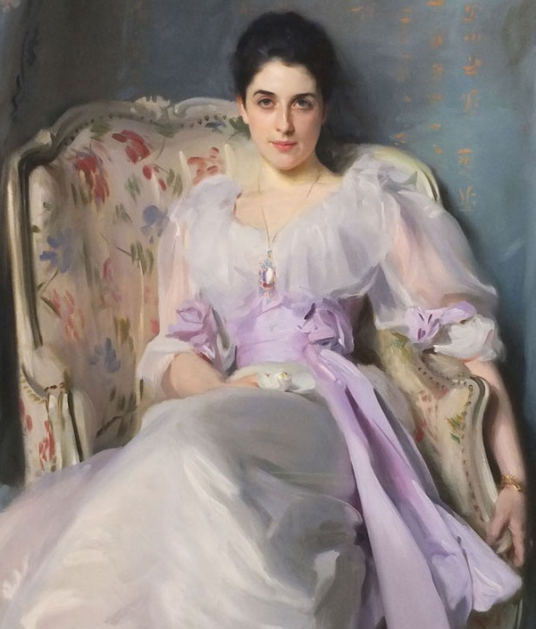
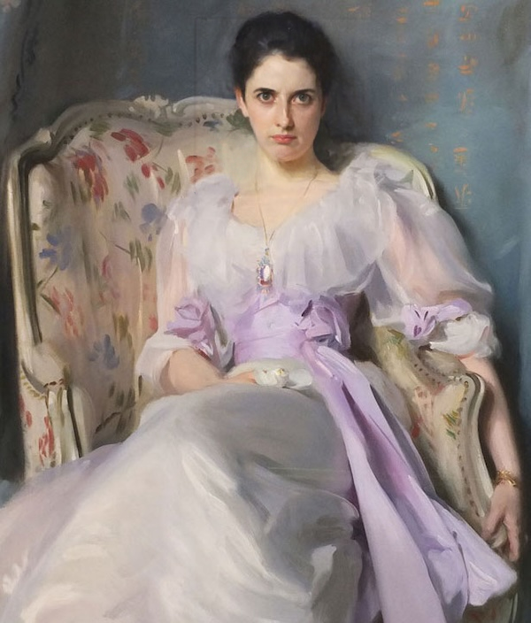
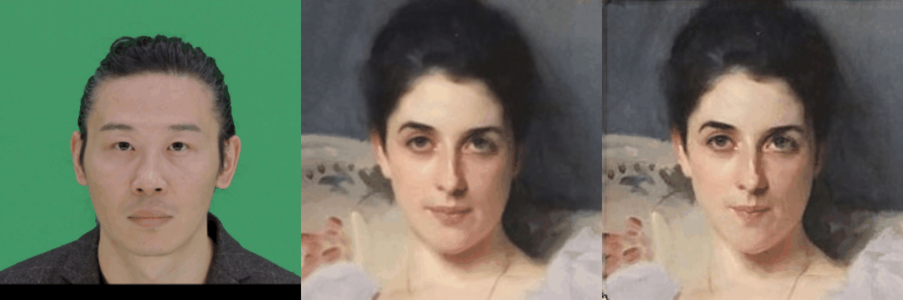
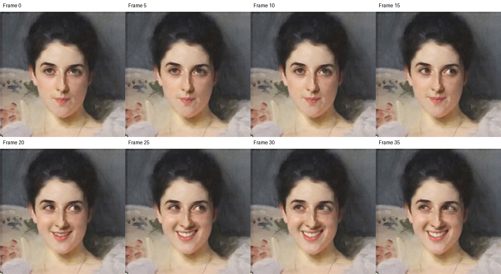

# LivePortrait 部署指南

LivePortrait 用于图像驱动视频。本页说明 M.2 算力卡的接入条件、部署步骤与结果检查方法。

> 已实测，效果仍需评估。[查看部署效果](#查看部署效果)。

## 准备运行环境

本页效果展示使用 **RK3576 + AX8850 16GB M.2**；其他容量或平台需重新确认模型能否加载并正确运行。

在连接算力卡的 Linux 主机终端执行，RK3576 使用 ARM64 环境。首次部署先完成[驱动与设备检查](../../usage/device-check.md)、[安装 PyAXEngine](../../usage/python.md)和[下载工具安装](../../usage/download-models.md#使用-hugging-face-下载)。已完成这些步骤可直接下载模型。

后文使用设备 0，运行前用 `axcl-smi` 确认设备可用。

## 下载模型与样例

本页使用 `AXERA-TECH/LivePortrait` 的固定版本。下面下载本页选用的 48 个文件。

```bash
MODEL_DIR=~/edgeaccel/models/liveportrait/c5664269a6b1
mkdir -p "$MODEL_DIR"
~/edgeaccel/hf-env/bin/hf download AXERA-TECH/LivePortrait \
  "README.md" \
  "python/requirements.txt" \
  "python/infer.py" \
  "python/cropper.py" \
  "python/utils/resources/lip_array.pkl" \
  "python/utils/resources/mask_template.png" \
  "python/utils/__init__.py" \
  "python/utils/crop.py" \
  "python/utils/dependencies/insightface/__init__.py" \
  "python/utils/dependencies/insightface/app/__init__.py" \
  "python/utils/dependencies/insightface/app/common.py" \
  "python/utils/dependencies/insightface/app/face_analysis.py" \
  "python/utils/dependencies/insightface/data/__init__.py" \
  "python/utils/dependencies/insightface/data/image.py" \
  "python/utils/dependencies/insightface/data/pickle_object.py" \
  "python/utils/dependencies/insightface/data/rec_builder.py" \
  "python/utils/dependencies/insightface/model_zoo/__init__.py" \
  "python/utils/dependencies/insightface/model_zoo/arcface_onnx.py" \
  "python/utils/dependencies/insightface/model_zoo/attribute.py" \
  "python/utils/dependencies/insightface/model_zoo/inswapper.py" \
  "python/utils/dependencies/insightface/model_zoo/landmark.py" \
  "python/utils/dependencies/insightface/model_zoo/model_store.py" \
  "python/utils/dependencies/insightface/model_zoo/model_zoo.py" \
  "python/utils/dependencies/insightface/model_zoo/retinaface.py" \
  "python/utils/dependencies/insightface/model_zoo/scrfd.py" \
  "python/utils/dependencies/insightface/utils/__init__.py" \
  "python/utils/dependencies/insightface/utils/constant.py" \
  "python/utils/dependencies/insightface/utils/download.py" \
  "python/utils/dependencies/insightface/utils/face_align.py" \
  "python/utils/dependencies/insightface/utils/filesystem.py" \
  "python/utils/dependencies/insightface/utils/storage.py" \
  "python/utils/dependencies/insightface/utils/transform.py" \
  "python/utils/face_analysis_diy.py" \
  "python/utils/human_landmark_runner.py" \
  "python/utils/rprint.py" \
  "python/utils/timer.py" \
  "python/axmodels/feature_extractor.axmodel" \
  "python/axmodels/motion_extractor.axmodel" \
  "python/axmodels/spade_generator.axmodel" \
  "python/axmodels/stitching_retargeting.axmodel" \
  "python/axmodels/warp.onnx" \
  "python/pretrained_weights/insightface/models/buffalo_l/det_10g.onnx" \
  "python/pretrained_weights/insightface/models/buffalo_l/2d106det.onnx" \
  "python/pretrained_weights/liveportrait/landmark.onnx" \
  "assets/examples/source/s0.jpg" \
  "assets/examples/source/s5.jpg" \
  "assets/examples/driving/d8.jpg" \
  "assets/examples/driving/d0.mp4" \
  --revision c5664269a6b14012164c999fbaa01899713e5692 \
  --local-dir "$MODEL_DIR"
cd "$MODEL_DIR"
```

保留当前终端中的 `MODEL_DIR` 变量，后续命令沿用此目录。下载受阻或需要离线复制时，见[下载方式与文件校验](../../usage/download-models.md)。

## 安装推理依赖

LivePortrait 用一张人像作为外观来源，再用图片或视频驱动其表情。下面在 RK3576 主机上运行 Python 示例，四个生成网络使用 M.2 算力卡的 `AXCLRTExecutionProvider`，人脸检测、关键点和 `warp.onnx` 使用 CPU。

沿用上方下载得到的 `$MODEL_DIR`，在已安装 PyAXEngine 的环境中执行：

```bash
source ~/edgeaccel/python-env/bin/activate
python -m pip install 'numpy==1.26.4' 'onnx==1.18.0' \
  'onnxruntime==1.20.1' 'opencv-python-headless==4.11.0.86' \
  'torch==2.5.1' 'scikit-image==0.25.2' \
  'loguru==0.7.3' 'imageio==2.37.4' 'imageio-ffmpeg==0.6.0' \
  requests tqdm
sudo apt-get install -y ffmpeg
ffmpeg -version
```

本页测试环境为约4GB内存的 RK3576 和16GB算力卡。下载文件约444MB，运行时还需保存中间结果和视频，请额外预留存储空间。

| 文件 | 执行位置 | 用途 |
| --- | --- | --- |
| `feature_extractor.axmodel` | 算力卡 | 提取源人像特征 |
| `motion_extractor.axmodel` | 算力卡 | 提取姿态和表情 |
| `stitching_retargeting.axmodel` | 算力卡 | 修正驱动关键点 |
| `spade_generator.axmodel` | 算力卡 | 生成512×512人像 |
| `warp.onnx` | CPU | 按驱动关键点变形特征 |
| `det_10g.onnx`、`2d106det.onnx`、`landmark.onnx` | CPU | 人脸检测、裁剪和关键点跟踪 |

保持上方下载清单的目录结构。示例只加载人像裁剪需要的模型；`buffalo_l` 目录中应仅有 `det_10g.onnx` 和 `2d106det.onnx`。身份特征、年龄性别、3D人脸和动物关键点模型不属于本页运行流程。

## 运行图片驱动

下载 [LivePortrait 算力卡示例](../../../static/examples/liveportrait_card.py)，保存为 `~/edgeaccel/liveportrait_card.py`：

```bash
python ~/edgeaccel/liveportrait_card.py \
  --model-dir "$MODEL_DIR" \
  --mode image \
  --output ~/edgeaccel/results/liveportrait-image-01
```

输出目录须尚不存在。程序依次运行 `s0.jpg + d8.jpg`、`s5.jpg + d8.jpg`，再重复第一组输入。它使用官方图像处理和动画计算流程，显式选择 AXCL 后端，将 CPU 推理限制为2线程，并保存真实输入输出。

| 输出 | 内容 |
| --- | --- |
| `s0-d8/s0--d8_concat.jpg` | 左：驱动图片；中：源人像裁剪；右：生成结果 |
| `s0-d8-000-crop.png` | 512×512生成图，无JPEG压缩 |
| `s0-d8-000-pasteback.png` | 将生成的人脸贴回原图后的结果 |
| `deployment-result.json` | 后端、输入输出校验值、调用耗时和完成状态 |
| `raw-*.npz` | 生成网络的原始张量及裁剪几何，可保留用于复核 |

`deployment-result.json` 中 `"completed": true` 表示本次流程执行完成。先查看本页下面的实际效果，再打开本机生成的拼接图核对。

## 运行短视频驱动

使用官方 `d0.mp4`，每5帧取1帧，共处理8帧：

```bash
python ~/edgeaccel/liveportrait_card.py \
  --model-dir "$MODEL_DIR" \
  --mode video --frames 8 --stride 5 \
  --output ~/edgeaccel/results/liveportrait-video-01
```

在输出目录的 `s0-d0-short` 子目录中打开 `s0--d0_concat.mp4` 查看“驱动帧—源人像—生成帧”对照，打开 `s0--d0.mp4` 查看贴回原图的动画。示例生成无声视频；播放帧率按原视频帧率除以采样间隔计算，与推理速度无关。

每帧的原始 PNG 也会保存。`--frames` 可设置为1～32，`--stride` 可设置为1～30；先用少量帧检查输入，再增加帧数。CPU变形网络耗时较长，当前示例用于离线生成。

## 使用自己的输入

源图片应包含清晰、无遮挡的人脸。驱动图片或视频应预先裁剪为以人脸为中心的画面；官方流程会直接缩放驱动画面，不能用宽幅全景视频替代人脸裁剪。

```bash
python ~/edgeaccel/liveportrait_card.py \
  --model-dir "$MODEL_DIR" \
  --source ~/Pictures/portrait.jpg \
  --driving ~/Pictures/expression.jpg \
  --output ~/edgeaccel/results/liveportrait-custom-01
```

视频输入使用 `--mode video --driving ~/Videos/face.mp4`，同时指定 `--source`。无脸图片会停止处理；检测到多人时按人脸大小选择一张，不会同时驱动全部人物。

本页验证了图片驱动、重复结果、短视频生成和贴回几何。表情生成会改变局部纹理和面部细节，尚未完成浮点参考、完整画质评估、长视频稳定性及实际8GB卡回归。


## 查看部署效果

**已运行，效果仍需评估** · 2026-09-28 · RK3576 + AX8850 16GB M.2。以下输入与输出来自本页固定版本的实际运行。

完成两组图片驱动、一次重复输入及8帧短视频生成，展示实际表情变化、贴回原图和分项耗时。

**图片驱动表情**

使用官方d8.jpg驱动两张人像，生成图中可见眉眼和嘴部变化。对照图从左到右为驱动图片、源人像裁剪、本次生成图；没有使用仓库中的预制输出。局部纹理和面部细节也会变化，不能只凭视觉观感判定画质完全通过。

<div className="model-effect-gallery">

<figure>

[](../../../static/validation/effects/liveportrait-20260928/s0-d8-s0--d8_concat.jpg)

<figcaption>第一组图片驱动：左为驱动，中为源人像，右为算力卡生成</figcaption>
</figure>

<figure>

[](../../../static/validation/effects/liveportrait-20260928/s5-d8-s5--d8_concat.jpg)

<figcaption>第二组图片驱动：同一表情作用于另一张源人像</figcaption>
</figure>

</div>

| 项目 | 实测结果 |
| --- | --- |
| 生成尺寸 | 512×512 |
| 生成网络 | 四个AXMODEL，显式AXCL后端 |
| 配套CPU网络 | 人脸检测、关键点和特征变形 |

**贴回原图**

生成的人脸按裁剪逆变换贴回原图。第一张恢复为600×704，第二张为720×720；独立重算的贴回像素与保存结果完全相同，遮罩外像素保持原值。这证明当前贴回过程一致，不代表生成细节与原人物完全一致。

<div className="model-effect-gallery">

<figure>

[](../../../static/validation/effects/liveportrait-20260928/s0-d8-source.png)

<figcaption>第一张源图</figcaption>
</figure>

<figure>

[](../../../static/validation/effects/liveportrait-20260928/s0-d8-000-pasteback.png)

<figcaption>第一张本次贴回结果</figcaption>
</figure>

<figure>

[](../../../static/validation/effects/liveportrait-20260928/s5-d8-000-pasteback.png)

<figcaption>第二张本次贴回结果</figcaption>
</figure>

</div>

| 项目 | 实测结果 |
| --- | --- |
| 第一张遮罩外 | 381312像素保持原值 |
| 第二张遮罩外 | 416369像素保持原值 |
| 重复第一组 | 所有网络输入输出哈希一致，生成图与贴回图逐像素一致 |

**短视频驱动**

从25FPS的官方d0.mp4中取第0、5、10、15、20、25、30、35帧，生成8帧无声动画。下图依次展示驱动帧、源人像和本次生成结果，可见视线和嘴部变化。预览按5FPS播放，约1.6秒；这是离线生成结果的播放速度，不是实时推理速度。

<div className="model-effect-gallery">

<figure>

[](../../../static/validation/effects/liveportrait-20260928/actual-short-preview.gif)

<figcaption>本次生成MP4解码得到的动画预览</figcaption>
</figure>

<figure>

[](../../../static/validation/effects/liveportrait-20260928/video-frames.png)

<figcaption>本次8帧生成图：标签为原视频帧号</figcaption>
</figure>

</div>

| 项目 | 实测结果 |
| --- | --- |
| 实际生成 | 8帧 |
| 播放帧率 | 5 FPS |
| 含证据保存的流程 | 215.315 s |
| CPU变形合计 | 179.097 s |
| AXCL调用合计 | 2.282 s |

**图片流程耗时**

AXCL一列汇总该图片涉及的生成网络调用；CPU变形单独计时。流程一列从执行单组输入开始计时，包含人脸处理、首组生成网络加载及张量和图片保存；不含脚本启动、CPU裁剪器初始化和预热。重复项复用模型。三列范围不同，AXCL时间不能换算为整条流程的实时FPS。

| 输入 | AXCL合计 / ms | CPU变形 / s | 含证据保存流程 / s |
| --- | --- | --- | --- |
| s0-d8 | 354.572 | 21.550 | 33.648 |
| s5-d8 | 347.518 | 20.808 | 28.256 |
| s0-d8-repeat | 337.505 | 21.174 | 25.619 |

**检查范围**

图片与视频共执行41次AXCL调用和11次CPU变形调用，全部生成网络张量为有限值。逐项核对了网络间传递、归一化、关键点拼接、图像还原及贴回结果；灰色无脸输入被拒绝。没有浮点生成网络参考或标注画质基准，本次只计基础部署通过。

| 项目 | 实测结果 |
| --- | --- |
| 图片重复 | 所有8个网络的输入输出哈希一致 |
| 关键点独立重算 | 最大绝对误差小于0.000001 |
| 贴回独立重算 | 11帧全部逐像素一致 |
| 实际硬件 | RK3576 + AX8850 16GB；8GB另行回归 |

**使用时注意：**

- CPU变形每帧约21～24秒，是当前主要耗时；不代表实时人像视频服务。
- 生成会改变局部纹理和细节，未完成浮点参考、完整画质评估或长视频稳定性测试。

这些结果用于对照部署后的输出，未覆盖完整数据集精度或长期连续运行。

<details>
<summary>查看样例环境与运行耗时</summary>

环境：RK3576 + AX8850 16GB M.2。日期：2026-09-28。模型版本：`c5664269a6b14012164c999fbaa01899713e5692`。

| 组件 | 版本或配置 |
| --- | --- |
| 主机 / 内核 | RK3576，约 4GB RAM，6.1.115-vendor-rk35xx |
| AXCL / 驱动 | V3.16.0_20260729180218 |
| 固件 / CMM | V3.16.0 / 15232 MiB |
| Python 推理 | Python 3.12 / PyAXEngine 0.1.3.rc3 / NumPy 1.26.4 / AXCLRTExecutionProvider |

| 指标 | 实测值 | 计时或统计范围 |
| --- | --- | --- |
| 实际生成 | 3张图片 + 8帧动画 | 包含第一组图片重复；官方输入，实际板端结果。 |
| 生成网络 | 41次AXCL调用 | 四个AXMODEL；人脸处理和11次warp仍由CPU执行。 |
| 视频流程 | 215.315 s | 8帧取样、生成、证据保存及编码；5FPS仅为输出播放速度。 |

适用范围：

- CPU变形每帧约21～24秒，是当前主要耗时；不代表实时人像视频服务。
- 生成会改变局部纹理和细节，未完成浮点参考、完整画质评估或长视频稳定性测试。
- 仅人像流程；未验证动物模型、其他辅助模型或实际8GB卡。

</details>

遇到加载、内存或后端错误时，按[常见问题](../../usage/troubleshooting.md)处理。需要更换输入或接入业务时，按[检查输出与记录结果](../../reference/validation.md)保留自己的结果。

<details>
<summary>查看文件用途与版本信息</summary>

| 文件 / 目录内路径 | 用途 |
| --- | --- |
| [`python/infer.py`](https://huggingface.co/AXERA-TECH/LivePortrait/blob/c5664269a6b14012164c999fbaa01899713e5692/python/infer.py) | Python 程序 / 前后处理 |
| [`python/axmodels/feature_extractor.axmodel`](https://huggingface.co/AXERA-TECH/LivePortrait/blob/c5664269a6b14012164c999fbaa01899713e5692/python/axmodels/feature_extractor.axmodel) | 编译模型；按目录区分芯片和规格 |
| [`python/axmodels/motion_extractor.axmodel`](https://huggingface.co/AXERA-TECH/LivePortrait/blob/c5664269a6b14012164c999fbaa01899713e5692/python/axmodels/motion_extractor.axmodel) | 编译模型；按目录区分芯片和规格 |
| [`python/axmodels/spade_generator.axmodel`](https://huggingface.co/AXERA-TECH/LivePortrait/blob/c5664269a6b14012164c999fbaa01899713e5692/python/axmodels/spade_generator.axmodel) | 编译模型；按目录区分芯片和规格 |
| [`python/axmodels/stitching_retargeting.axmodel`](https://huggingface.co/AXERA-TECH/LivePortrait/blob/c5664269a6b14012164c999fbaa01899713e5692/python/axmodels/stitching_retargeting.axmodel) | 编译模型；按目录区分芯片和规格 |
| [`config.json`](https://huggingface.co/AXERA-TECH/LivePortrait/blob/c5664269a6b14012164c999fbaa01899713e5692/config.json) | 运行配置 |
| [`python/requirements.txt`](https://huggingface.co/AXERA-TECH/LivePortrait/blob/c5664269a6b14012164c999fbaa01899713e5692/python/requirements.txt) | Python 依赖清单 |

仓库提交：`c5664269a6b14012164c999fbaa01899713e5692`。仓库中的 4 个 `.axmodel` 文件可能包括多个芯片、规格和分片。运行时使用本页指定的配套文件，完整列表见[固定版本目录](https://huggingface.co/AXERA-TECH/LivePortrait/tree/c5664269a6b14012164c999fbaa01899713e5692)。

</details>

<details>
<summary>补充说明与版本差异</summary>

- 驱动视频、源人像、运动与生成模型共同组成链路。先测短视频并核对帧数、音画时长与输出编码。

</details>

## 参考资料

- [常用术语](../../reference/glossary.md)：AXCL、CMM、分词器与推理指标。
- [固定版本文件表](https://huggingface.co/AXERA-TECH/LivePortrait/tree/c5664269a6b14012164c999fbaa01899713e5692)。
- [模型卡 / 使用说明](https://huggingface.co/AXERA-TECH/LivePortrait/blob/c5664269a6b14012164c999fbaa01899713e5692/README.md)。
- [主要程序入口：python/infer.py](https://huggingface.co/AXERA-TECH/LivePortrait/blob/c5664269a6b14012164c999fbaa01899713e5692/python/infer.py)。

返回[完整模型目录](../catalog.mdx)。
