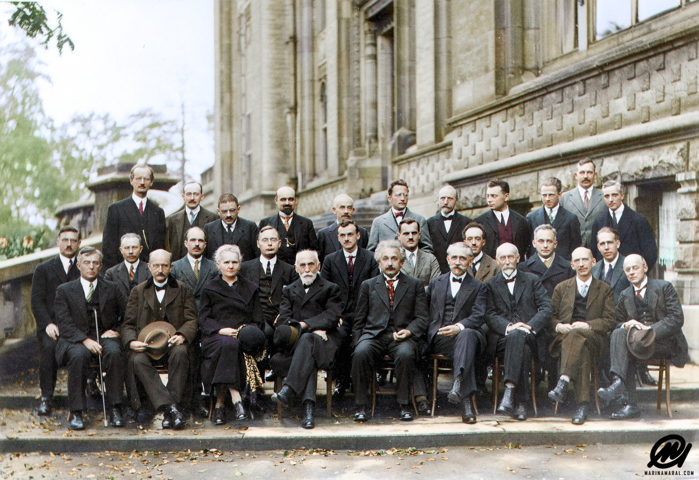
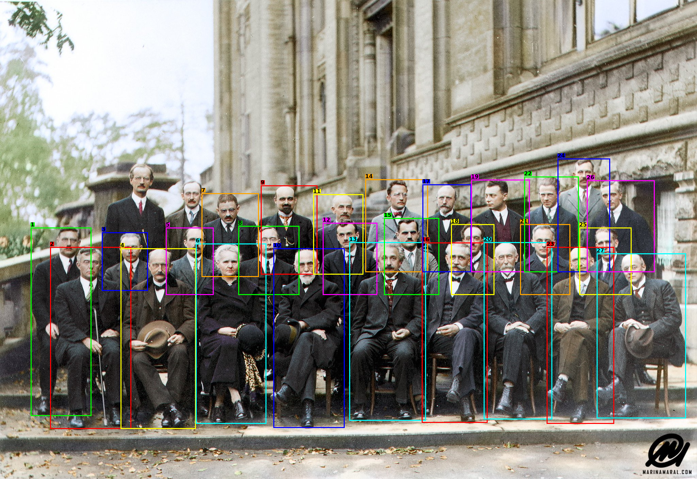
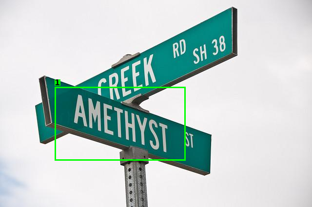

# LocateAnything-3B 部署指南

LocateAnything-3B 用于开放词汇检测与目标定位。本页说明 M.2 算力卡的接入条件、部署步骤与结果检查方法。

> 已实测，效果仍需评估。[查看部署效果](#查看部署效果)。

## 准备运行环境

本页效果展示使用 **RK3576 + AX8850 16GB M.2**；其他容量或平台需重新确认模型能否加载并正确运行。

在连接算力卡的 Linux 主机终端执行，RK3576 使用 ARM64 环境。首次部署先完成[驱动与设备检查](../../usage/device-check.md)、[安装 PyAXEngine](../../usage/python.md)和[下载工具安装](../../usage/download-models.md#使用-hugging-face-下载)。已完成这些步骤可直接下载模型。

后文使用设备 0，运行前用 `axcl-smi` 确认设备可用。

## 下载模型与样例

本页使用 `AXERA-TECH/LocateAnything-3B` 的固定版本。下面下载本页选用的 48 个文件。

```bash
MODEL_DIR=~/edgeaccel/models/locateanything-3b/c6ad2b1a52a6
mkdir -p "$MODEL_DIR"
~/edgeaccel/hf-env/bin/hf download AXERA-TECH/LocateAnything-3B \
  --include "config.json" "image_encoder_mlp.axmodel" "infer_locateanything_axengine.py" "model.embed_tokens.weight.bfloat16.bin" "post_config.json" "qwen2.5_tokenizer/tokenizer.json" "qwen2_p128_l0_together.axmodel" "qwen2_p128_l10_together.axmodel" "qwen2_p128_l11_together.axmodel" "qwen2_p128_l12_together.axmodel" "qwen2_p128_l13_together.axmodel" "qwen2_p128_l14_together.axmodel" "qwen2_p128_l15_together.axmodel" "qwen2_p128_l16_together.axmodel" "qwen2_p128_l17_together.axmodel" "qwen2_p128_l18_together.axmodel" "qwen2_p128_l19_together.axmodel" "qwen2_p128_l1_together.axmodel" "qwen2_p128_l20_together.axmodel" "qwen2_p128_l21_together.axmodel" "qwen2_p128_l22_together.axmodel" "qwen2_p128_l23_together.axmodel" "qwen2_p128_l24_together.axmodel" "qwen2_p128_l25_together.axmodel" "qwen2_p128_l26_together.axmodel" "qwen2_p128_l27_together.axmodel" "qwen2_p128_l28_together.axmodel" "qwen2_p128_l29_together.axmodel" "qwen2_p128_l2_together.axmodel" "qwen2_p128_l30_together.axmodel" "qwen2_p128_l31_together.axmodel" "qwen2_p128_l32_together.axmodel" "qwen2_p128_l33_together.axmodel" "qwen2_p128_l34_together.axmodel" "qwen2_p128_l35_together.axmodel" "qwen2_p128_l3_together.axmodel" "qwen2_p128_l4_together.axmodel" "qwen2_p128_l5_together.axmodel" "qwen2_p128_l6_together.axmodel" "qwen2_p128_l7_together.axmodel" "qwen2_p128_l8_together.axmodel" "qwen2_p128_l9_together.axmodel" "qwen2_post.axmodel" "requirements.txt" "test_data/book.jpg" "test_data/ocr.jpg" "test_data/person.jpg" "test_data/sushi.jpg" \
  --revision c6ad2b1a52a6c75ca604e3e4eb775240aa31718a \
  --local-dir "$MODEL_DIR"
cd "$MODEL_DIR"
```

保留当前终端中的 `MODEL_DIR` 变量，后续命令沿用此目录。下载受阻或需要离线复制时，见[下载方式与文件校验](../../usage/download-models.md)。

## 安装依赖与运行包

本例使用 RK3576 主机、AX8850 16GB M.2 算力卡和 AXCL 3.16.0，模型保存在板载存储。先确认 `axcl-smi` 能识别设备，模型目录所在存储建议预留至少 5GB 空间。运行前退出其他模型程序。

在已安装 PyAXEngine 的 Python 环境中安装配套依赖：

```bash
python -m pip install numpy==1.26.4 Pillow==11.3.0 ml-dtypes==0.5.3 tokenizers==0.22.2
python -c "import axengine; print(axengine.get_available_providers())"
```

提供器列表中应包含 `AXCLRTExecutionProvider`。下载[配套运行包](/examples/locateanything3b-20261001.tar.gz)，保存到 `~/edgeaccel`。保留前文设置的 `MODEL_DIR`，在同一终端执行：

```bash
cd ~/edgeaccel
tar -xzf locateanything3b-20261001.tar.gz
python locateanything3b/verify_models.py --model-dir "$MODEL_DIR"
mkdir -p locateanything-results
```

校验通过后应输出 `Verified 48 model files`。运行入口调用固定版本的官方 Python 程序，并指定算力卡提供器。图像编码器、36 个文本层和输出层由算力卡执行；图像缩放、分词、坐标转换和结果绘制由主机完成。

## 检测图片中的人物

```bash
python locateanything3b/run.py --model-dir "$MODEL_DIR" \
  --image "$MODEL_DIR/test_data/person.jpg" \
  --task object_detection --target person \
  --temperature 0 --repetition-penalty 1 --max-new-tokens 256 \
  --output locateanything-results/people.png \
  --save-response locateanything-results/people.json
```

程序将检测框绘制到 `people.png`，原始 token、坐标及运行参数保存在 `people.json`。打开图片，对照每个检测框与原图中的人物；检测框数量不等同于标注真值。

## 定位图片中的文字

定位路牌上的 `AMETHYST`：

```bash
python locateanything3b/run.py --model-dir "$MODEL_DIR" \
  --image "$MODEL_DIR/test_data/ocr.jpg" \
  --task text_grounding --target AMETHYST \
  --temperature 0 --repetition-penalty 1 --max-new-tokens 256 \
  --output locateanything-results/sign.png \
  --save-response locateanything-results/sign.json
```

将输入图片换为 `test_data/book.jpg`、目标换为 `GEORGE`，可定位书封面上的对应文字。此任务按输入文字定位区域，不代表完整 OCR 转录。

## 用一句话指定目标位置

```bash
python locateanything3b/run.py --model-dir "$MODEL_DIR" \
  --image "$MODEL_DIR/test_data/sushi.jpg" \
  --task pointing \
  --target 'the green wasabi paste in the small white dish' \
  --temperature 0 --repetition-penalty 1 --max-new-tokens 256 \
  --output locateanything-results/wasabi.png \
  --save-response locateanything-results/wasabi.json
```

打开 `wasabi.png`，检查定位点是否位于小白碟中的绿色芥末上。替换为自己的图片时，使用图片绝对路径，并在 `--target` 中描述需要定位的对象。

## 检查输出与释放状态

程序结束后检查退出码和设备状态：

```bash
echo $?
axcl-smi
```

退出码应为 `0`。同时检查输出图片和 JSON 是否生成、原始回答是否完整结束、坐标是否符合输入目标。输出文件存在仅表明完成了结果保存，定位是否正确仍需对照图片判断。


## 查看部署效果

**已运行，效果仍需评估** · RK3576 + AX8850 16GB M.2。以下输入与输出来自本页固定版本的实际运行。

已在 16GB M.2 算力卡完成图片人物检测、文字区域定位和描述目标点定位，实际输出如下。

**检测框、文字区域与目标点**

在四张图片上完成五次请求：人物检测两次均生成 27 个框，两次文字定位各生成一个框，芥末定位生成一个点。下面展示本次算力卡输出绘制的结果图。

<div className="model-effect-gallery">

<figure>

[](../../../static/validation/effects/locateanything-3b-20261001/people-input.jpg)

<figcaption>人物检测：原图</figcaption>
</figure>

<figure>

[](../../../static/validation/effects/locateanything-3b-20261001/people.png)

<figcaption>人物检测：本次模型输出</figcaption>
</figure>

<figure>

[](../../../static/validation/effects/locateanything-3b-20261001/sign-text-input.jpg)

<figcaption>路牌文字 AMETHYST：原图</figcaption>
</figure>

<figure>

[](../../../static/validation/effects/locateanything-3b-20261001/sign-text.png)

<figcaption>路牌文字 AMETHYST：本次模型输出</figcaption>
</figure>

<figure>

[](../../../static/validation/effects/locateanything-3b-20261001/book-text-input.jpg)

<figcaption>书封面文字 GEORGE：原图</figcaption>
</figure>

<figure>

[](../../../static/validation/effects/locateanything-3b-20261001/book-text.png)

<figcaption>书封面文字 GEORGE：本次模型输出</figcaption>
</figure>

<figure>

[](../../../static/validation/effects/locateanything-3b-20261001/wasabi-point-input.jpg)

<figcaption>描述目标点定位：原图</figcaption>
</figure>

<figure>

[](../../../static/validation/effects/locateanything-3b-20261001/wasabi-point.png)

<figcaption>描述目标点定位：本次模型输出</figcaption>
</figure>

</div>

| 输入 | 框数 | 点数 | 首 token / s | 完整请求 / s | 结果核对 |
| --- | --- | --- | --- | --- | --- |
| 人物检测 | 27 | 0 | 9.923 | 98.693 | 生成 27 个框；后排左侧两人未被框出。 |
| 路牌文字 AMETHYST | 1 | 0 | 4.827 | 10.989 | 框覆盖目标文字，范围较宽，包含部分周边区域。 |
| 书封面文字 GEORGE | 1 | 0 | 4.294 | 10.480 | 框覆盖白色书封面上的 GEORGE。 |
| 描述目标点定位 | 0 | 1 | 4.774 | 13.348 | 定位点落在上方白碟中的绿色芥末区域。 |
| 人物检测重复请求 | 27 | 0 | 5.211 | 93.132 | 原始 token 与坐标和首次一致，仍存在相同漏检。 |

**使用时注意：**

- 人物检测漏掉后排左侧两人；路牌文字框较宽。结果可用于核对基本部署，不能作为无漏检或精确边界的保证。
- 本次仅覆盖 16GB 算力卡基本运行；8GB、长时间连续服务和数据集精度另行验证。

这些结果用于对照部署后的输出，未覆盖完整数据集精度或长期连续运行。

<details>
<summary>查看样例环境与运行耗时</summary>

环境：RK3576 + AX8850 16GB M.2。模型版本：`c6ad2b1a52a6c75ca604e3e4eb775240aa31718a`。

| 组件 | 版本或配置 |
| --- | --- |
| 主机 / 内核 | RK3576，约 4GB RAM，6.1.115-vendor-rk35xx |
| AXCL / 驱动 | V3.16.0_20260729180218 |
| 固件 / CMM | V3.16.0 / 15232 MiB |
| 运行方式 | 固定官方 Python 推理脚本 / PyAXEngine 0.1.3.rc3 / AXCLRTExecutionProvider |

| 指标 | 实测值 | 计时或统计范围 |
| --- | --- | --- |
| 首次加载 | 52.2s | 包含模型与词嵌入准备；单次请求耗时不包含首次加载。 |
| 算力卡执行 | 38 个 AXModel | 视觉编码器、36 个文本层及输出层，共 14420 次调用。 |
| 输入覆盖 | 4 张图片 / 5 次请求 | 人物检测重复一次；结果图由本次生成坐标绘制。 |

适用范围：

- 输入缩放到 560 × 560，坐标映射回原图；样例结果不代表全场景检测或文字定位准确率。
- 本次耗时包含逐次输出校验和记录开销，不作为峰值性能指标。

</details>

遇到加载、内存或后端错误时，按[常见问题](../../usage/troubleshooting.md)处理。需要更换输入或接入业务时，按[检查输出与记录结果](../../reference/validation.md)保留自己的结果。

<details>
<summary>查看文件用途与版本信息</summary>

| 文件 / 目录内路径 | 用途 |
| --- | --- |
| [`gradio_locateanything_axengine.py`](https://huggingface.co/AXERA-TECH/LocateAnything-3B/blob/c6ad2b1a52a6c75ca604e3e4eb775240aa31718a/gradio_locateanything_axengine.py) | Python 程序 / 前后处理 |
| [`locateanything_webui.py`](https://huggingface.co/AXERA-TECH/LocateAnything-3B/blob/c6ad2b1a52a6c75ca604e3e4eb775240aa31718a/locateanything_webui.py) | Python 程序 / 前后处理 |
| [`config.json`](https://huggingface.co/AXERA-TECH/LocateAnything-3B/blob/c6ad2b1a52a6c75ca604e3e4eb775240aa31718a/config.json) | 运行配置 |
| [`qwen2_post.axmodel`](https://huggingface.co/AXERA-TECH/LocateAnything-3B/blob/c6ad2b1a52a6c75ca604e3e4eb775240aa31718a/qwen2_post.axmodel) | 编译模型；按目录区分芯片和规格 |
| [`model.embed_tokens.weight.bfloat16.bin`](https://huggingface.co/AXERA-TECH/LocateAnything-3B/blob/c6ad2b1a52a6c75ca604e3e4eb775240aa31718a/model.embed_tokens.weight.bfloat16.bin) | Embedding 权重 |
| [`qwen2_5_tokenizer.txt`](https://huggingface.co/AXERA-TECH/LocateAnything-3B/blob/c6ad2b1a52a6c75ca604e3e4eb775240aa31718a/qwen2_5_tokenizer.txt) | 分词器 / 字典，必须配套 |
| [`image_encoder_mlp.axmodel`](https://huggingface.co/AXERA-TECH/LocateAnything-3B/blob/c6ad2b1a52a6c75ca604e3e4eb775240aa31718a/image_encoder_mlp.axmodel) | 编译模型；按目录区分芯片和规格 |
| [`post_config.json`](https://huggingface.co/AXERA-TECH/LocateAnything-3B/blob/c6ad2b1a52a6c75ca604e3e4eb775240aa31718a/post_config.json) | 运行配置 |
| [`qwen2_p128_l0_together.axmodel`](https://huggingface.co/AXERA-TECH/LocateAnything-3B/blob/c6ad2b1a52a6c75ca604e3e4eb775240aa31718a/qwen2_p128_l0_together.axmodel) | 编译模型；按目录区分芯片和规格 |
| [`qwen2_p128_l10_together.axmodel`](https://huggingface.co/AXERA-TECH/LocateAnything-3B/blob/c6ad2b1a52a6c75ca604e3e4eb775240aa31718a/qwen2_p128_l10_together.axmodel) | 编译模型；按目录区分芯片和规格 |
| [`qwen2_p128_l11_together.axmodel`](https://huggingface.co/AXERA-TECH/LocateAnything-3B/blob/c6ad2b1a52a6c75ca604e3e4eb775240aa31718a/qwen2_p128_l11_together.axmodel) | 编译模型；按目录区分芯片和规格 |
| [`qwen2_p128_l12_together.axmodel`](https://huggingface.co/AXERA-TECH/LocateAnything-3B/blob/c6ad2b1a52a6c75ca604e3e4eb775240aa31718a/qwen2_p128_l12_together.axmodel) | 编译模型；按目录区分芯片和规格 |
| [`qwen2.5_tokenizer/config.json`](https://huggingface.co/AXERA-TECH/LocateAnything-3B/blob/c6ad2b1a52a6c75ca604e3e4eb775240aa31718a/qwen2.5_tokenizer/config.json) | 运行配置 |
| [`qwen2.5_tokenizer/configuration_qwen2.py`](https://huggingface.co/AXERA-TECH/LocateAnything-3B/blob/c6ad2b1a52a6c75ca604e3e4eb775240aa31718a/qwen2.5_tokenizer/configuration_qwen2.py) | 旧版分词服务入口 |

仓库提交：`c6ad2b1a52a6c75ca604e3e4eb775240aa31718a`。仓库中的 38 个 `.axmodel` 文件可能包括多个芯片、规格和分片。运行时使用本页指定的配套文件，完整列表见[固定版本目录](https://huggingface.co/AXERA-TECH/LocateAnything-3B/tree/c6ad2b1a52a6c75ca604e3e4eb775240aa31718a)。

</details>

## 参考资料

- [常用术语](../../reference/glossary.md)：AXCL、CMM、分词器与推理指标。
- [固定版本文件表](https://huggingface.co/AXERA-TECH/LocateAnything-3B/tree/c6ad2b1a52a6c75ca604e3e4eb775240aa31718a)。
- [模型卡 / 使用说明](https://huggingface.co/AXERA-TECH/LocateAnything-3B/blob/c6ad2b1a52a6c75ca604e3e4eb775240aa31718a/README.md)。
- [主要程序入口：infer_locateanything_axengine.py](https://huggingface.co/AXERA-TECH/LocateAnything-3B/blob/c6ad2b1a52a6c75ca604e3e4eb775240aa31718a/infer_locateanything_axengine.py)。

返回[完整模型目录](../catalog.mdx)。
