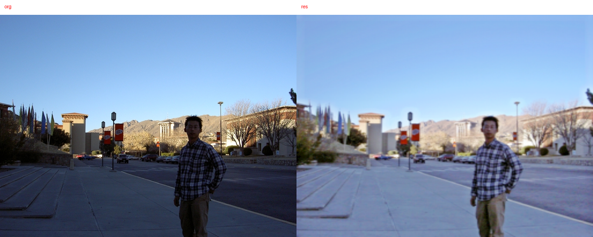
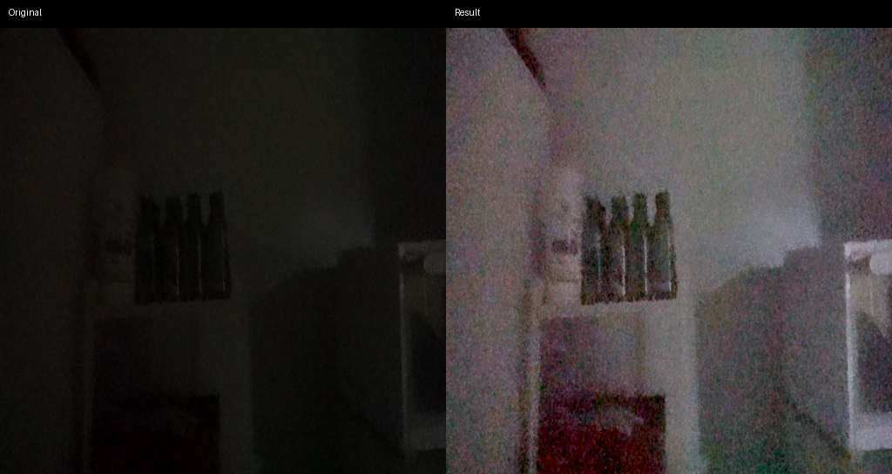
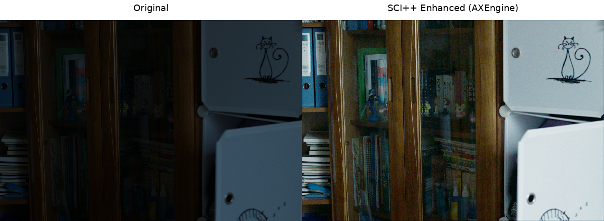
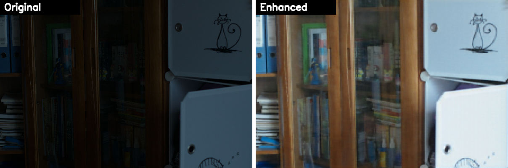

# LowLightImageEnhancement 部署指南

LowLightImageEnhancement 用于图像增强与修复。本页说明 M.2 算力卡的接入条件、部署步骤与结果检查方法。

> 已实测，效果仍需评估。[查看部署效果](#查看部署效果)。

## 准备运行环境

本页效果展示使用 **RK3576 + AX8850 16GB M.2**；其他容量或平台需重新确认模型能否加载并正确运行。

在连接算力卡的 Linux 主机终端执行，RK3576 使用 ARM64 环境。首次部署先完成[驱动与设备检查](../../usage/device-check.md)、[安装 PyAXEngine](../../usage/python.md)和[下载工具安装](../../usage/download-models.md#使用-hugging-face-下载)。已完成这些步骤可直接下载模型。

后文使用设备 0，运行前用 `axcl-smi` 确认设备可用。

## 下载模型与样例

本页使用 `AXERA-TECH/LowLightImageEnhancement` 的固定版本。下面下载本页选用的 12 个文件。

```bash
MODEL_DIR=~/edgeaccel/models/lowlightimageenhancement/61df6da7399d
mkdir -p "$MODEL_DIR"
~/edgeaccel/hf-env/bin/hf download AXERA-TECH/LowLightImageEnhancement \
  "Zero-DCE/python/axmodel_infer.py" \
  "Zero-DCE/pic/10.jpg" \
  "Zero-DCE/model_convert/axmodel/Zero-DCE.axmodel" \
  "Zero-DCE++/python/axmodel_infer.py" \
  "Zero-DCE++/pic/101_3_.png" \
  "Zero-DCE++/model_convert/axmodel/zerodcepp_512_sf8.axmodel" \
  "SCI/python/axmodel_infer.py" \
  "SCI/pic/00001.png" \
  "SCI/model_convert/axmodel/SCI_TPAMI_600_400.axmodel" \
  "Retinexformer/python/axmodel_infer.py" \
  "Retinexformer/pic/1.png" \
  "Retinexformer/model_convert/axmodel/Retinexformer_224_224.axmodel" \
  --revision 61df6da7399d54fbe8786235ceb06a5cef1118fa \
  --local-dir "$MODEL_DIR"
cd "$MODEL_DIR"
```

保留当前终端中的 `MODEL_DIR` 变量，后续命令沿用此目录。下载受阻或需要离线复制时，见[下载方式与文件校验](../../usage/download-models.md)。

## 安装图像处理依赖

在 RK3576 主机激活已安装 PyAXEngine 的环境：

```bash
source ~/edgeaccel/python-env/bin/activate
python -m pip install 'numpy==1.26.4' 'opencv-python-headless==4.11.0.86' 'pillow==11.3.0'
python -m pip check
```

下载 [enhancement_card.py](../../../static/examples/enhancement_card.py) 和 [image-enhancement-cases.json](../../../static/examples/image-enhancement-cases.json)，保存到 `$MODEL_DIR`。运行脚本复用固定版本官方前后处理，指定 `AXCLRTExecutionProvider`，并把输入、模型和输出目录替换为本页路径。

## 运行配套样例

以下命令按顺序运行本仓库全部已选变体。使用新的结果目录；同名目录已存在时脚本停止，避免混入旧图。

```bash
cd "$MODEL_DIR"
for name in zero-dce zero-dcepp sci retinexformer; do
  python enhancement_card.py --model-dir . \
    --cases image-enhancement-cases.json --case "$name" \
    --output "results/$name" || break
done
```

确认日志使用 `AXCLRTExecutionProvider`，退出码为 0，并在 `results/变体名称/outputs/` 中生成图片。`enhancement-result.json` 记录实际执行的权重、输入校验值、输出尺寸和耗时。只运行一种算法时，将循环中的名称改为对应名称。

输出用于观察本次处理效果；是否符合业务要求，还需用自己的图片检查颜色、细节和伪影。


## 查看部署效果

**已运行，效果仍需评估** · RK3576 + AX8850 16GB M.2。以下输入与输出来自本页固定版本的实际运行。

四个权重均完成暗光样例推理。暗部亮度提高，但 Zero-DCE 与 Retinexformer 的细节变软，Zero-DCE++ 与 SCI 的噪点被放大；下方逐项展示实际差异。

以下图片由本次运行生成，点击可查看原尺寸。各算法的输入、模型分辨率和后处理不同，不能直接根据这些样例比较算法优劣。

**Zero-DCE**

人物及道路暗部变亮，但右侧结果中的人脸、树枝和建筑边缘明显变软。该图只展示亮度提升，不证明细节得到恢复。

<div className="model-effect-gallery">

<figure>

[](../../../static/validation/effects/lowlightimageenhancement/outputs/zero-dce.png)

<figcaption>本次运行输出</figcaption>
</figure>

</div>

**Zero-DCE++**

暗室墙面和家具更易辨认，同时出现明显彩色噪点；不能把提亮等同于降噪。

<div className="model-effect-gallery">

<figure>

[](../../../static/validation/effects/lowlightimageenhancement/outputs/zero-dcepp.png)

<figcaption>本次运行输出</figcaption>
</figure>

</div>

**SCI**

书柜、书脊和猫图案的暗部更清楚，细节大体保留；书柜暗区的彩色噪点同时被放大。

<div className="model-effect-gallery">

<figure>

[](../../../static/validation/effects/lowlightimageenhancement/outputs/sci.png)

<figcaption>本次运行输出</figcaption>
</figure>

</div>

**Retinexformer**

书柜和白色柜面变亮；书脊、门框和猫图案边缘明显变软，低分辨率处理后的细节损失可见。

<div className="model-effect-gallery">

<figure>

[](../../../static/validation/effects/lowlightimageenhancement/outputs/retinexformer.png)

<figcaption>本次运行输出</figcaption>
</figure>

</div>

**使用时注意：**

- 提亮伴随细节变软或噪点放大，不能将亮度提升等同于细节恢复或降噪。
- 每种算法仅使用一张配套图片；未进行有参考图的亮度、颜色或细节恢复评估。

这些结果用于对照部署后的输出，未覆盖完整数据集精度或长期连续运行。

<details>
<summary>查看样例环境与运行耗时</summary>

环境：RK3576 + AX8850 16GB M.2。模型版本：`61df6da7399d54fbe8786235ceb06a5cef1118fa`。

| 组件 | 版本或配置 |
| --- | --- |
| 主机系统 | Ubuntu 24.04 / Armbian 25.11.0-trunk，aarch64，主机内存约 4GB |
| 内核 | 6.1.115-vendor-rk35xx |
| AXCL / 驱动 | V3.16.0_20260729180218 |
| 固件 / CMM | V3.16.0；CMM 总量 15232MiB |
| Python / PyAXEngine | Python 3.12；官方 0.1.3.rc3 wheel；AXCLRTExecutionProvider |
| NumPy / OpenCV / Pillow | 1.26.4 / 4.11.0.86 / 11.3.0 |
| Torch / Torchvision | 2.5.1 / 0.20.1 |

| 指标 | 实测值 | 计时或统计范围 |
| --- | --- | --- |
| Zero-DCE 样例总耗时 | 1.204629 s | Python 示例主体，包括模型加载、前后处理、推理和保存图片；不单独作为 NPU 性能 |
| Zero-DCE++ 样例总耗时 | 1.280266 s | Python 示例主体，包括模型加载、前后处理、推理和保存图片；不单独作为 NPU 性能 |
| SCI 样例总耗时 | 1.189178 s | Python 示例主体，包括模型加载、前后处理、推理和保存图片；不单独作为 NPU 性能 |
| Retinexformer 样例总耗时 | 0.887781 s | Python 示例主体，包括模型加载、前后处理、推理和保存图片；不单独作为 NPU 性能 |

适用范围：

- SCI 图片标题沿用上游脚本的 AXEngine 字样，本次实际推理后端为 AXCLRTExecutionProvider。
- 使用 16GB 算力卡，未验证 8GB 容量、并发或长期连续运行。

</details>

遇到加载、内存或后端错误时，按[常见问题](../../usage/troubleshooting.md)处理。需要更换输入或接入业务时，按[检查输出与记录结果](../../reference/validation.md)保留自己的结果。

<details>
<summary>查看文件用途与版本信息</summary>

| 文件 / 目录内路径 | 用途 |
| --- | --- |
| [`Retinexformer/python/axmodel_infer.py`](https://huggingface.co/AXERA-TECH/LowLightImageEnhancement/blob/61df6da7399d54fbe8786235ceb06a5cef1118fa/Retinexformer/python/axmodel_infer.py) | Python 程序 / 前后处理 |
| [`SCI/python/axmodel_infer.py`](https://huggingface.co/AXERA-TECH/LowLightImageEnhancement/blob/61df6da7399d54fbe8786235ceb06a5cef1118fa/SCI/python/axmodel_infer.py) | Python 程序 / 前后处理 |
| [`Retinexformer/model_convert/axmodel/Retinexformer_224_224.axmodel`](https://huggingface.co/AXERA-TECH/LowLightImageEnhancement/blob/61df6da7399d54fbe8786235ceb06a5cef1118fa/Retinexformer/model_convert/axmodel/Retinexformer_224_224.axmodel) | 编译模型；按目录区分芯片和规格 |
| [`SCI/model_convert/axmodel/SCI_TPAMI_600_400.axmodel`](https://huggingface.co/AXERA-TECH/LowLightImageEnhancement/blob/61df6da7399d54fbe8786235ceb06a5cef1118fa/SCI/model_convert/axmodel/SCI_TPAMI_600_400.axmodel) | 编译模型；按目录区分芯片和规格 |
| [`Zero-DCE++/model_convert/axmodel/zerodcepp_512_sf8.axmodel`](https://huggingface.co/AXERA-TECH/LowLightImageEnhancement/blob/61df6da7399d54fbe8786235ceb06a5cef1118fa/Zero-DCE%2B%2B/model_convert/axmodel/zerodcepp_512_sf8.axmodel) | 编译模型；按目录区分芯片和规格 |
| [`Zero-DCE/model_convert/axmodel/Zero-DCE.axmodel`](https://huggingface.co/AXERA-TECH/LowLightImageEnhancement/blob/61df6da7399d54fbe8786235ceb06a5cef1118fa/Zero-DCE/model_convert/axmodel/Zero-DCE.axmodel) | 编译模型；按目录区分芯片和规格 |
| [`Retinexformer/python/onnx_infer.py`](https://huggingface.co/AXERA-TECH/LowLightImageEnhancement/blob/61df6da7399d54fbe8786235ceb06a5cef1118fa/Retinexformer/python/onnx_infer.py) | Python 程序 / 前后处理 |
| [`SCI/python/onnx_infer.py`](https://huggingface.co/AXERA-TECH/LowLightImageEnhancement/blob/61df6da7399d54fbe8786235ceb06a5cef1118fa/SCI/python/onnx_infer.py) | Python 程序 / 前后处理 |
| [`Zero-DCE++/python/axmodel_infer.py`](https://huggingface.co/AXERA-TECH/LowLightImageEnhancement/blob/61df6da7399d54fbe8786235ceb06a5cef1118fa/Zero-DCE%2B%2B/python/axmodel_infer.py) | Python 程序 / 前后处理 |
| [`Zero-DCE++/python/onnx_infer.py`](https://huggingface.co/AXERA-TECH/LowLightImageEnhancement/blob/61df6da7399d54fbe8786235ceb06a5cef1118fa/Zero-DCE%2B%2B/python/onnx_infer.py) | Python 程序 / 前后处理 |
| [`Zero-DCE/python/axmodel_infer.py`](https://huggingface.co/AXERA-TECH/LowLightImageEnhancement/blob/61df6da7399d54fbe8786235ceb06a5cef1118fa/Zero-DCE/python/axmodel_infer.py) | Python 程序 / 前后处理 |
| [`Zero-DCE/python/onnx_infer.py`](https://huggingface.co/AXERA-TECH/LowLightImageEnhancement/blob/61df6da7399d54fbe8786235ceb06a5cef1118fa/Zero-DCE/python/onnx_infer.py) | Python 程序 / 前后处理 |
| [`config.json`](https://huggingface.co/AXERA-TECH/LowLightImageEnhancement/blob/61df6da7399d54fbe8786235ceb06a5cef1118fa/config.json) | 运行配置 |

仓库提交：`61df6da7399d54fbe8786235ceb06a5cef1118fa`。仓库中的 4 个 `.axmodel` 文件可能包括多个芯片、规格和分片。运行时使用本页指定的配套文件，完整列表见[固定版本目录](https://huggingface.co/AXERA-TECH/LowLightImageEnhancement/tree/61df6da7399d54fbe8786235ceb06a5cef1118fa)。

</details>

## 参考资料

- [常用术语](../../reference/glossary.md)：AXCL、CMM、分词器与推理指标。
- [固定版本文件表](https://huggingface.co/AXERA-TECH/LowLightImageEnhancement/tree/61df6da7399d54fbe8786235ceb06a5cef1118fa)。
- [模型卡 / 使用说明](https://huggingface.co/AXERA-TECH/LowLightImageEnhancement/blob/61df6da7399d54fbe8786235ceb06a5cef1118fa/README.md)。
- [主要程序入口：Retinexformer/python/axmodel_infer.py](https://huggingface.co/AXERA-TECH/LowLightImageEnhancement/blob/61df6da7399d54fbe8786235ceb06a5cef1118fa/Retinexformer/python/axmodel_infer.py)。

返回[完整模型目录](../catalog.mdx)。
