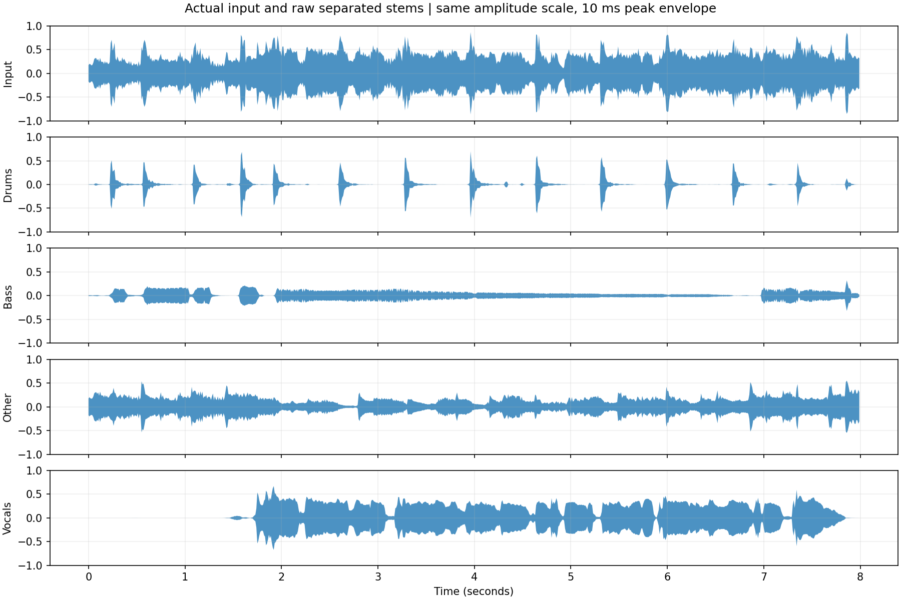

# mel_band_roformer 部署指南

mel_band_roformer 用于语音增强与分离。本页说明 M.2 算力卡的接入条件、部署步骤与结果检查方法。

> 已实测，效果仍需评估。[查看部署效果](#查看部署效果)。

## 准备运行环境

本页效果展示使用 **RK3576 + AX8850 16GB M.2**；其他容量或平台需重新确认模型能否加载并正确运行。

在连接算力卡的 Linux 主机终端执行，RK3576 使用 ARM64 环境。首次部署先完成[驱动与设备检查](../../usage/device-check.md)、[安装 PyAXEngine](../../usage/python.md)和[下载工具安装](../../usage/download-models.md#使用-hugging-face-下载)。已完成这些步骤可直接下载模型。

后文使用设备 0，运行前用 `axcl-smi` 确认设备可用。

## 下载模型与样例

本页使用 `AXERA-TECH/mel_band_roformer` 的固定版本。下面下载本页选用的 7 个文件。

```bash
MODEL_DIR=~/edgeaccel/models/mel-band-roformer/f104690c6af6
mkdir -p "$MODEL_DIR"
~/edgeaccel/hf-env/bin/hf download AXERA-TECH/mel_band_roformer \
  ".gitignore" \
  "MelBandRoformer.py" \
  "README.md" \
  "gradio_app.py" \
  "main.py" \
  "mel_band_roformer.axmodel" \
  "requirements.txt" \
  --revision f104690c6af6e4258aaad61124114fe0819451bb \
  --local-dir "$MODEL_DIR"
cd "$MODEL_DIR"
```

保留当前终端中的 `MODEL_DIR` 变量，后续命令沿用此目录。下载受阻或需要离线复制时，见[下载方式与文件校验](../../usage/download-models.md)。

## 准备 Python 环境

先按 [Python 接口](../../usage/python.md) 安装 PyAXEngine，再在连接算力卡的 RK3576 主机执行：

```bash
source ~/edgeaccel/python-env/bin/activate
python -m pip install 'numpy==1.26.4' 'torch==2.5.1' 'librosa==0.11.0' 'soundfile==0.13.1' 'einops==0.8.1' tqdm
python -c "import axengine; print(axengine.get_available_providers())"
```

输出须包含 `AXCLRTExecutionProvider`。本页以 44.1 kHz 立体声音乐为输入，输出鼓、贝斯、其他伴奏和人声四路音频。

## 准备音乐片段

下载本页的 [实际输入片段](../../../static/validation/effects/mel-band-roformer-20260928/input.wav)，保存到上方下载步骤使用的 `$MODEL_DIR/input.wav`，并校验：

```bash
echo '331a96b35f6140659447e163cf785bf024ed503c752beeef07e643f2f0d9d3b3  '"$MODEL_DIR/input.wav" | sha256sum -c -
```

结果须为 `OK`。样例取自 Karissa Hobbs 的 **Let's Go Fishin'** 第 20～28 秒，经 Vorbis 解码后保存为 PCM24 WAV，未调整音量。原曲采用 [CC BY 3.0](https://creativecommons.org/licenses/by/3.0/)；见 [作者作品页](https://freemusicarchive.org/music/Karissa_Hobbs/Age_of_Flowers/09_Lets_Go_Fishin) 和 [Librosa 固定版本来源](https://github.com/librosa/data/blob/38f4b06556fa0ff1acda5e677d8ba05d1bc0fff0/audio/Karissa_Hobbs_-_Lets_Go_Fishin.txt)。下方分轨由本次模型处理生成，属于对原片段的修改。

## 运行四路分离

下载 [MelBandRoformer 算力卡示例](../../../static/examples/mel_roformer_card.py)，保存为 `~/edgeaccel/mel_roformer_card.py`：

```bash
python ~/edgeaccel/mel_roformer_card.py \
  --model-dir "$MODEL_DIR" \
  --audio "$MODEL_DIR/input.wav" \
  --output ~/edgeaccel/results/mel-roformer-01
```

输出目录须尚不存在。程序处理音乐片段、重复同一片段，再处理两秒静音。模型经 AXCL 在 M.2 算力卡运行，音频前后处理由主机完成。

沿用官方参数：每块 2 秒、重叠比例 25%、STFT 点数 2048、帧移 441。八秒输入共运行六块；不足两秒的最后一块补零，输出按实际长度裁切后拼接。

## 查看分离音频

输出目录中的 `music-drums.wav`、`music-bass.wav`、`music-other.wav` 和 `music-vocals.wav` 分别为鼓、贝斯、其他伴奏和人声预测。下方提供与输入对应的四路实际音频，便于对照。

`deployment-result.json` 记录每路的峰值、均方根幅度、保存时的缩放系数和推理调用。保存规则沿用官方入口：除以 `max(1.01 × 峰值, 1)`，再编码为 PCM24。`music-stems.npz` 保留缩放前的浮点结果，`io-*.npz` 和 `chunk-*.npz` 用于复核频谱、掩码和拼接过程。

程序记录的文件处理时间包含前后处理及原始证据压缩写入。重复输入会复用相同输入输出的证据文件，因此首轮与重复耗时不能直接用来比较模型速度。单次 AXCL 调用耗时另列。

四路输出有声音或波形不代表分离质量已达标。本次没有原始独立分轨参考，尚未计算 SDR 等分离指标；人声残留、乐器串音及音乐细节需结合目标素材评估。

## 更换音乐输入

将 `--audio` 改为自己的 WAV 路径。当前示例要求 44.1 kHz、双声道、最长 15 秒，需先裁剪并转换其他格式。更长歌曲的连续处理、不同音乐风格与分离质量仍需进一步验证。


## 查看部署效果

**已运行，效果仍需评估** · RK3576 + AX8850 16GB M.2。以下输入与输出来自本页固定版本的实际运行。

四路分轨均保留 8 秒、44.1 kHz 立体声长度；原始分轨之和与输入的差值 RMS 为输入 RMS 的 3.574%。这仅核对混合一致性，没有独立分轨参考，不能作为分离质量评分。

**八秒音乐：四路实际分离结果**

以下依次为输入、鼓、贝斯、其他伴奏和人声。波形来自缩放前的实际输出；本次四路保存系数均为1，没有单独放大。原曲署名、授权及裁剪说明见上方准备步骤。 四路输出均与输入等长。下方重混残差使用保存前的原始分轨直接相加，未拟合增益；该比例仅描述重混差异。即使分轨之和接近输入，也可能仍有串音或错误分离，不能把它解释为准确率、SDR 或听感评分。

<div className="model-effect-gallery">

<figure>

[](../../../static/validation/effects/mel-band-roformer-20260928/stems.png)

<figcaption>输入与四路原始输出的10毫秒峰值包络，全部使用相同幅度刻度</figcaption>
</figure>

</div>

| 分轨 | 原始峰值 | 原始RMS | 保存除数 |
| --- | --- | --- | --- |
| 鼓 | 0.698651 | 0.064374 | 1.000000 |
| 贝斯 | 0.321492 | 0.048943 | 1.000000 |
| 其他伴奏 | 0.550106 | 0.069448 | 1.000000 |
| 人声 | 0.672144 | 0.115956 | 1.000000 |

| 重混检查 | 实际值 |
| --- | --- |
| 输入及每路输出长度 | 352800 点 / 声道，44.1 kHz，双声道，8 秒 |
| 输入 RMS | 0.16140980 |
| 四路原始分轨相加后的 RMS | 0.16176095 |
| 输入减去分轨和的 RMS | 0.00576824 |
| 残差 RMS / 输入 RMS | 3.574% |

输入：Karissa Hobbs《Let's Go Fishin'》20–28秒片段（CC BY 3.0）

<audio controls preload="metadata" src="/validation/effects/mel-band-roformer-20260928/input.wav" aria-label="输入：Karissa Hobbs《Let's Go Fishin'》20–28秒片段（CC BY 3.0）"></audio>

[下载音频](../../../static/validation/effects/mel-band-roformer-20260928/input.wav)

鼓：本次模型分离输出，8秒立体声

<audio controls preload="metadata" src="/validation/effects/mel-band-roformer-20260928/music-drums.wav" aria-label="鼓：本次模型分离输出，8秒立体声"></audio>

[下载音频](../../../static/validation/effects/mel-band-roformer-20260928/music-drums.wav)

贝斯：本次模型分离输出，8秒立体声

<audio controls preload="metadata" src="/validation/effects/mel-band-roformer-20260928/music-bass.wav" aria-label="贝斯：本次模型分离输出，8秒立体声"></audio>

[下载音频](../../../static/validation/effects/mel-band-roformer-20260928/music-bass.wav)

其他伴奏：本次模型分离输出，8秒立体声

<audio controls preload="metadata" src="/validation/effects/mel-band-roformer-20260928/music-other.wav" aria-label="其他伴奏：本次模型分离输出，8秒立体声"></audio>

[下载音频](../../../static/validation/effects/mel-band-roformer-20260928/music-other.wav)

人声：本次模型分离输出，8秒立体声

<audio controls preload="metadata" src="/validation/effects/mel-band-roformer-20260928/music-vocals.wav" aria-label="人声：本次模型分离输出，8秒立体声"></audio>

[下载音频](../../../static/validation/effects/mel-band-roformer-20260928/music-vocals.wav)

**重复输出与静音**

重复输入的每块模型输入、掩码及重建音频完全一致，四个WAV文件的校验值也一致。两秒静音仍实际调用模型两次，四路原始输出均为零。

| 输入 | 时长 / s | 调用次数 | 处理时间 / s |
| --- | --- | --- | --- |
| 音乐首轮 | 8.0 | 6 | 23.815985 |
| 重复音乐 | 8.0 | 6 | 6.258259 |
| 静音 | 2.0 | 2 | 2.120644 |

**使用时注意：**

- 没有原始独立分轨参考，未计算SDR等分离指标，也未做主观听感验收；波形差异不能代替质量结论。
- 当前输入为八秒歌曲片段；整曲、更多音乐风格和长时间处理仍需验证。首轮包含大量证据写入，不能据此给出实时性能承诺。

这些结果用于对照部署后的输出，未覆盖完整数据集精度或长期连续运行。

<details>
<summary>查看样例环境与运行耗时</summary>

环境：RK3576 + AX8850 16GB M.2。模型版本：`f104690c6af6e4258aaad61124114fe0819451bb`。

| 组件 | 版本或配置 |
| --- | --- |
| 主机 / 内核 | RK3576，约 4GB RAM，6.1.115-vendor-rk35xx |
| AXCL / 驱动 | V3.16.0_20260729180218 |
| 固件 / CMM | V3.16.0 / 15232 MiB |
| Python 推理 | Python 3.12 / PyAXEngine 0.1.3.rc3 / NumPy 1.26.4 / AXCLRTExecutionProvider |

| 指标 | 实测值 | 计时或统计范围 |
| --- | --- | --- |
| 实际模型调用 | 14 次 | 音乐6块、重复6块、静音2块，每块最多2秒，25%重叠。 |
| AXCL 调用平均耗时 | 489.174 ms / 块 | 包括首块和静音；包含AXCL调用传输，不含STFT、ISTFT、拼接和证据写入。 |
| 音乐首轮处理耗时 | 23.816 s | 八秒音乐，包含原始频谱和掩码压缩写入，不代表不记录证据时的实时性能。 |
| 重建数值复核 | 全部14块通过 | 独立计算STFT、复数掩码平均、ISTFT及三角窗拼接；不是浮点模型精度对照。 |

适用范围：

- 本次为16GB卡，真实8GB容量仍需回归。

</details>

遇到加载、内存或后端错误时，按[常见问题](../../usage/troubleshooting.md)处理。需要更换输入或接入业务时，按[检查输出与记录结果](../../reference/validation.md)保留自己的结果。

<details>
<summary>查看文件用途与版本信息</summary>

| 文件 / 目录内路径 | 用途 |
| --- | --- |
| [`gradio_app.py`](https://huggingface.co/AXERA-TECH/mel_band_roformer/blob/f104690c6af6e4258aaad61124114fe0819451bb/gradio_app.py) | Python 程序 / 前后处理 |
| [`main.py`](https://huggingface.co/AXERA-TECH/mel_band_roformer/blob/f104690c6af6e4258aaad61124114fe0819451bb/main.py) | Python 程序 / 前后处理 |
| [`mel_band_roformer.axmodel`](https://huggingface.co/AXERA-TECH/mel_band_roformer/blob/f104690c6af6e4258aaad61124114fe0819451bb/mel_band_roformer.axmodel) | 编译模型；按目录区分芯片和规格 |
| [`config.json`](https://huggingface.co/AXERA-TECH/mel_band_roformer/blob/f104690c6af6e4258aaad61124114fe0819451bb/config.json) | 运行配置 |
| [`requirements.txt`](https://huggingface.co/AXERA-TECH/mel_band_roformer/blob/f104690c6af6e4258aaad61124114fe0819451bb/requirements.txt) | Python 依赖清单 |

仓库提交：`f104690c6af6e4258aaad61124114fe0819451bb`。仓库中的 1 个 `.axmodel` 文件可能包括多个芯片、规格和分片。运行时使用本页指定的配套文件，完整列表见[固定版本目录](https://huggingface.co/AXERA-TECH/mel_band_roformer/tree/f104690c6af6e4258aaad61124114fe0819451bb)。

</details>

<details>
<summary>补充说明与版本差异</summary>

- 分离人声与伴奏，输入为实际音频。检查分离结果的通道数、时长和混合回放，不用波形文件数代替效果检查。

</details>

## 参考资料

- [常用术语](../../reference/glossary.md)：AXCL、CMM、分词器与推理指标。
- [固定版本文件表](https://huggingface.co/AXERA-TECH/mel_band_roformer/tree/f104690c6af6e4258aaad61124114fe0819451bb)。
- [模型卡 / 使用说明](https://huggingface.co/AXERA-TECH/mel_band_roformer/blob/f104690c6af6e4258aaad61124114fe0819451bb/README.md)。
- [主要程序入口：gradio_app.py](https://huggingface.co/AXERA-TECH/mel_band_roformer/blob/f104690c6af6e4258aaad61124114fe0819451bb/gradio_app.py)。

返回[完整模型目录](../catalog.mdx)。
