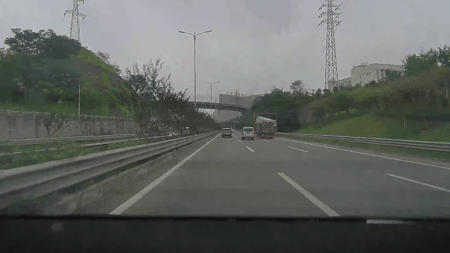
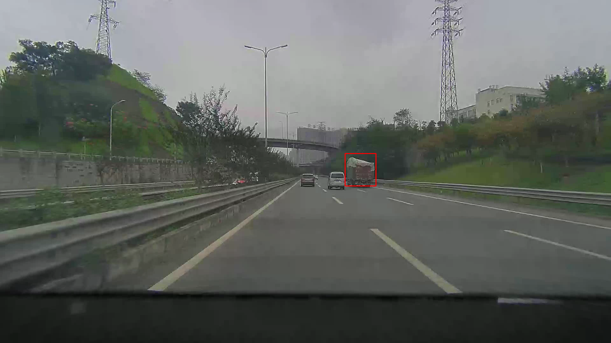
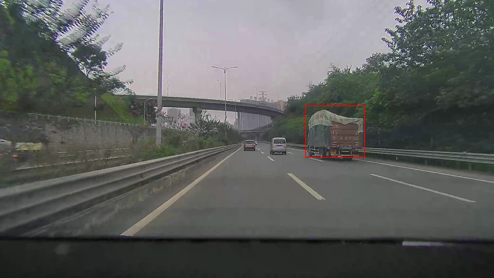

# MixFormerV2 部署指南

MixFormerV2 用于单目标跟踪。本页说明 M.2 算力卡的接入条件、部署步骤与结果检查方法。

> 已实测，效果仍需评估。[查看部署效果](#查看部署效果)。

## 准备运行环境

本页效果展示使用 **RK3576 + AX8850 16GB M.2**；其他容量或平台需重新确认模型能否加载并正确运行。

在连接算力卡的 Linux 主机终端执行，RK3576 使用 ARM64 环境。首次部署先完成[驱动与设备检查](../../usage/device-check.md)、[安装 PyAXEngine](../../usage/python.md)和[下载工具安装](../../usage/download-models.md#使用-hugging-face-下载)。已完成这些步骤可直接下载模型。

后文使用设备 0，运行前用 `axcl-smi` 确认设备可用。

## 下载模型与样例

本页使用 `AXERA-TECH/MixFormerV2` 的固定版本。下面下载本页选用的 4 个文件。

```bash
MODEL_DIR=~/edgeaccel/models/mixformerv2/f4f94e988421
mkdir -p "$MODEL_DIR"
~/edgeaccel/hf-env/bin/hf download AXERA-TECH/MixFormerV2 \
  "README.md" \
  "ax650/mixformer_v2.axmodel" \
  "run_mixformer2_axmodel.py" \
  "car.avi" \
  --revision f4f94e988421b7a03fb70148ea97ab5811297d09 \
  --local-dir "$MODEL_DIR"
cd "$MODEL_DIR"
```

保留当前终端中的 `MODEL_DIR` 变量，后续命令沿用此目录。下载受阻或需要离线复制时，见[下载方式与文件校验](../../usage/download-models.md)。

## 安装例程依赖

在 RK3576 主机激活已安装 PyAXEngine 的虚拟环境：

```bash
source ~/edgeaccel/python-env/bin/activate
python -m pip install 'numpy==1.26.4' 'opencv-python-headless==4.11.0.86' 'pillow==11.3.0'
```

下载 [vision_card.py](../../../static/examples/vision_card.py)，保存到 `$MODEL_DIR`。例程指定 `AXCLRTExecutionProvider`，使用本页固定版本的权重和样例，并保存本次输出。

## 跟踪视频中的指定目标

```bash
cd "$MODEL_DIR"
python vision_card.py --model-dir . --task mixformer --variant car60 \
  --output results/tracking
```

输入为 `car.avi`。沿用官方首帧目标框 `[1079, 482, 99, 106]`，四个数依次为 x、y、宽、高；随后连续处理 60 帧。此坐标只适用于该样例，换视频时需要重新指定初始目标。

打开 `results/tracking/tracking.gif` 查看连续跟踪，`frame-001.png`、`frame-030.png`、`frame-060.png` 保留原尺寸关键帧。动画每两帧取一帧，按源视频时间间隔播放，不代表实际推理帧率。每帧坐标和置信度见 `deployment-result.json`。


## 查看部署效果

**已运行，效果仍需评估** · 2026-09-24 · RK3576 + AX8850 16GB M.2。以下输入与输出来自本页固定版本的实际运行。

在官方道路视频中指定货车后连续跟踪 60 帧，保存动画与原尺寸关键帧。

**货车连续跟踪**

首帧使用官方指定框，随后跟踪 60 帧。动画每两帧取一帧，按源视频时间间隔播放；红框为模型跟踪结果。

<div className="model-effect-gallery">

<figure>

[](../../../static/validation/effects/mixformerv2-20260924/mixformer-car60/tracking.gif)

<figcaption>60 帧跟踪效果（每两帧采样）</figcaption>
</figure>

<figure>

[](../../../static/validation/effects/mixformerv2-20260924/mixformer-car60/frame-001.webp)

<figcaption>第 1 帧推理结果</figcaption>
</figure>

<figure>

[](../../../static/validation/effects/mixformerv2-20260924/mixformer-car60/frame-060.webp)

<figcaption>第 60 帧推理结果</figcaption>
</figure>

</div>

| 帧号 | x / y / 宽 / 高 | 跟踪分数 |
| --- | --- | --- |
| 1 | 1084.7 / 483.5 / 96.9 / 101.7 | 0.999947 |
| 30 | 1122.7 / 459.4 / 134.3 / 130.6 | 0.999871 |
| 60 | 1187.9 / 410.4 / 228.2 / 201.6 | 0.998467 |

**使用时注意：**

- 未测试长时遮挡、目标离开画面后的恢复或人工标注跟踪指标；动画播放速度不是推理帧率。
- 结论限于 RK3576 + AX8850 16GB 的上述固定样例，不等同于 8GB 容量验证或长期稳定性测试。

这些结果用于对照部署后的输出，未覆盖完整数据集精度或长期连续运行。

<details>
<summary>查看样例环境与运行耗时</summary>

环境：RK3576 + AX8850 16GB M.2。日期：2026-09-24。模型版本：`f4f94e988421b7a03fb70148ea97ab5811297d09`。

| 组件 | 版本或配置 |
| --- | --- |
| 主机系统 | Ubuntu 24.04 / Armbian 25.11.0-trunk，aarch64，主机内存约 4GB |
| 内核 | 6.1.115-vendor-rk35xx |
| AXCL / 驱动 | V3.16.0_20260729180218 |
| 固件 / CMM | V3.16.0；CMM 总量 15232MiB |
| Python / PyAXEngine | Python 3.12；官方 0.1.3.rc3 wheel；AXCLRTExecutionProvider |
| NumPy / OpenCV / Pillow | 1.26.4 / 4.11.0.86 / 11.3.0 |
| Torch / Torchvision | 2.5.1 / 0.20.1 |
| 图文前处理 | Transformers 4.51.3 / Tokenizers 0.21.4；ftfy 6.3.1 / regex 2025.9.18 |
| VAD SDK | silero-vad-axera 0.1.2，复用 SileroAx；权重来自页面固定仓库提交 |
| C++ 检测 | axcl-samples cbfa4c76891758983ca2b0c99c11d6621d59af39 / OpenCV 4.6.0 |

| 指标 | 实测值 | 计时或统计范围 |
| --- | --- | --- |
| mixformer-car60 / mixformer_v2.axmodel | 18.447 ms（60 次平均） | AXCL session.run 调用，含输入输出传输；不含模型加载和前后处理，未剔除首轮。 |

适用范围：

- 未测试长时遮挡、目标离开画面后的恢复或人工标注跟踪指标；动画播放速度不是推理帧率。
- 结论限于 RK3576 + AX8850 16GB 的上述固定样例，不等同于 8GB 容量验证或长期稳定性测试。

</details>

遇到加载、内存或后端错误时，按[常见问题](../../usage/troubleshooting.md)处理。需要更换输入或接入业务时，按[检查输出与记录结果](../../reference/validation.md)保留自己的结果。

<details>
<summary>查看文件用途与版本信息</summary>

| 文件 / 目录内路径 | 用途 |
| --- | --- |
| [`run_mixformer2_axmodel.py`](https://huggingface.co/AXERA-TECH/MixFormerV2/blob/f4f94e988421b7a03fb70148ea97ab5811297d09/run_mixformer2_axmodel.py) | Python 程序 / 前后处理 |
| [`ax650/mixformer_v2.axmodel`](https://huggingface.co/AXERA-TECH/MixFormerV2/blob/f4f94e988421b7a03fb70148ea97ab5811297d09/ax650/mixformer_v2.axmodel) | 编译模型；按目录区分芯片和规格 |
| [`config.json`](https://huggingface.co/AXERA-TECH/MixFormerV2/blob/f4f94e988421b7a03fb70148ea97ab5811297d09/config.json) | 运行配置 |

仓库提交：`f4f94e988421b7a03fb70148ea97ab5811297d09`。仓库中的 2 个 `.axmodel` 文件可能包括多个芯片、规格和分片。运行时使用本页指定的配套文件，完整列表见[固定版本目录](https://huggingface.co/AXERA-TECH/MixFormerV2/tree/f4f94e988421b7a03fb70148ea97ab5811297d09)。

</details>

<details>
<summary>补充说明与版本差异</summary>

- 目标跟踪需要首帧目标框以及后续帧；初始框、模板更新和失跟处理应与示例一致。

</details>

## 参考资料

- [常用术语](../../reference/glossary.md)：AXCL、CMM、分词器与推理指标。
- [固定版本文件表](https://huggingface.co/AXERA-TECH/MixFormerV2/tree/f4f94e988421b7a03fb70148ea97ab5811297d09)。
- [模型卡 / 使用说明](https://huggingface.co/AXERA-TECH/MixFormerV2/blob/f4f94e988421b7a03fb70148ea97ab5811297d09/README.md)。
- [主要程序入口：run_mixformer2_axmodel.py](https://huggingface.co/AXERA-TECH/MixFormerV2/blob/f4f94e988421b7a03fb70148ea97ab5811297d09/run_mixformer2_axmodel.py)。

返回[完整模型目录](../catalog.mdx)。
