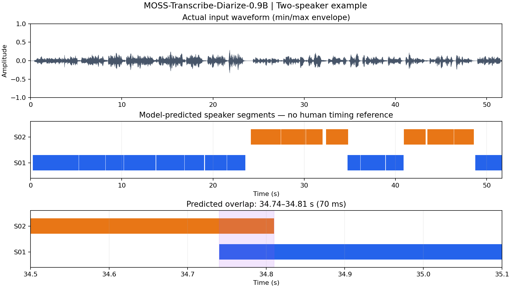
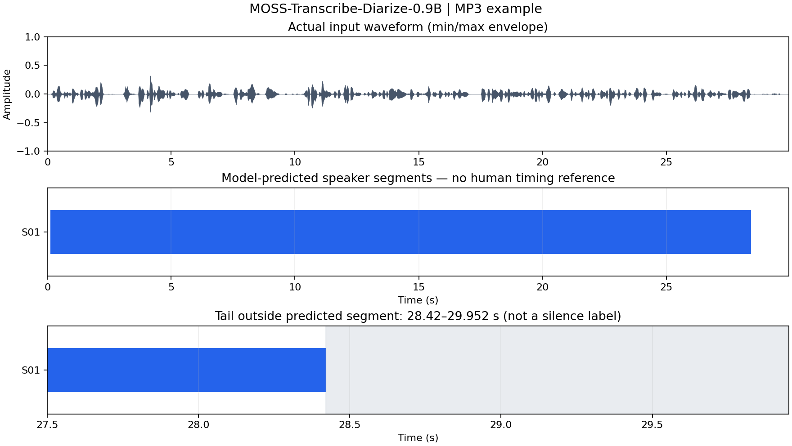

# MOSS-Transcribe-Diarize-0.9B 部署指南

MOSS-Transcribe-Diarize-0.9B 用于语音识别。本页说明 M.2 算力卡的接入条件、部署步骤与结果检查方法。

> 已实测，效果仍需评估。[查看部署效果](#查看部署效果)。

## 准备运行环境

本页效果展示使用 **RK3576 + AX8850 16GB M.2**；其他容量或平台需重新确认模型能否加载并正确运行。

在连接算力卡的 Linux 主机终端执行，RK3576 使用 ARM64 环境。首次部署先完成[驱动与设备检查](../../usage/device-check.md)、[安装 PyAXEngine](../../usage/python.md)和[下载工具安装](../../usage/download-models.md#使用-hugging-face-下载)。已完成这些步骤可直接下载模型。

后文使用设备 0，运行前用 `axcl-smi` 确认设备可用。

## 下载模型与样例

本页使用 `AXERA-TECH/MOSS-Transcribe-Diarize-0.9B` 的固定版本。下面下载本页选用的 41 个文件。

```bash
MODEL_DIR=~/edgeaccel/models/moss-transcribe-diarize-0-9b/c627e9bad59a
mkdir -p "$MODEL_DIR"
~/edgeaccel/hf-env/bin/hf download AXERA-TECH/MOSS-Transcribe-Diarize-0.9B \
  --include "*.axmodel" "README.md" "config.json" "infer_moss_axengine.py" "model.embed_tokens.weight.bfloat16.bin" "post_config.json" "preprocessor_config.json" "requirements.txt" "tokenizer.json" "utils/infer_func.py" "wav/002.mp3" "wav/2speakers_example.wav" \
  --revision c627e9bad59af4074d95c4bc24a87483141d5cc7 \
  --local-dir "$MODEL_DIR"
cd "$MODEL_DIR"
```

保留当前终端中的 `MODEL_DIR` 变量，后续命令沿用此目录。下载受阻或需要离线复制时，见[下载方式与文件校验](../../usage/download-models.md)。

## 准备语音转写依赖

本例在 RK3576 主机连接 AX8850 **16GB M.2 算力卡**上运行，输出转写文本、每段起止时间和说话人编号。选用固定版本的 30 个 AXModel 与 BF16 词嵌入，模型及配套文件约 2.12GB；另需预留 Python 依赖和结果空间。

激活已安装 [PyAXEngine](../../usage/python.md) 的主机虚拟环境：

```bash
source ~/edgeaccel/python-env/bin/activate
python -m pip install 'numpy==1.26.4' 'torch==2.5.1' \
  'transformers==4.51.3' 'tokenizers==0.21.4' 'ml-dtypes==0.5.3' \
  'soundfile==0.13.1' 'scipy==1.17.1' tqdm
python -c "import axengine; print(axengine.get_available_providers())"
```

输出须包含 `AXCLRTExecutionProvider`。本例使用 Python 3.12 与 PyAXEngine 0.1.3.rc3；原生 AX650 的 `AxEngineExecutionProvider` 不适用于本页的 PCIe 算力卡步骤。

下载[算力卡运行脚本](../../../static/examples/moss_asr_card.py)，保存为 `~/edgeaccel/moss_asr_card.py`。下载[固定文件校验清单](../../../static/validation/effects/moss-transcribe-diarize-0-9b-20260930/download-manifest.json)，保存为 `$MODEL_DIR/download-manifest.json`。在 Windows 下载时，将文件复制到 Linux 主机的对应位置。

## 转写双人对话

在连接算力卡的 Linux 主机执行，沿用下载步骤的 `MODEL_DIR`：

```bash
python ~/edgeaccel/moss_asr_card.py \
  --model-dir "$MODEL_DIR" \
  --audio "$MODEL_DIR/wav/2speakers_example.wav" \
  --kv-transfer incremental \
  --output ~/edgeaccel/results/moss-meeting-01
```

输出目录须尚不存在。程序通过官方音频编码和语言模型流程完成转写，成功后生成：

- `response.json`：原始文本、分段结果、token 与分阶段耗时。
- `deployment-result.json`：模型版本、文件校验和执行状态。
- `calls.jsonl`：实际算力卡调用记录。

`incremental` 首次传输完整历史缓存，随后只更新上一 token 改变的缓存行，减少 PCIe 重复传输。本页效果来自该模式。`full` 保留官方每次完整传输缓存的行为，可用于同输入对照，运行更慢。

使用同一仓库的 MP3 样例验证另一段输入：

```bash
python ~/edgeaccel/moss_asr_card.py \
  --model-dir "$MODEL_DIR" \
  --audio "$MODEL_DIR/wav/002.mp3" \
  --kv-transfer incremental \
  --output ~/edgeaccel/results/moss-mp3-01
```

## 查看分段结果

```bash
python - <<'PY'
import json
from pathlib import Path
folder = Path.home() / 'edgeaccel/results/moss-meeting-01'
run = json.loads((folder / 'deployment-result.json').read_text())
response = json.loads((folder / 'response.json').read_text())
assert run['completed'] and run['terminatedWithEos']
assert all(s['providerActual'] == 'AXCLRTExecutionProvider' for s in run['sessions'])
print(response['formatted_text'])
print('转写流程：', round(run['pipelineSeconds'], 3), 's')
PY
```

每行格式为 `[起始秒][结束秒][说话人编号]文本`。`S01`、`S02` 表示同一段音频内的说话人分组，不能解释为已识别姓名，也不能直接用于跨录音身份匹配。

## 替换输入音频

将 `--audio` 改为自己的音频路径，并更换输出目录。程序将多声道音频取均值转为单声道、重采样到 16kHz，再按 30 秒分块编码。

本页展示短音频与官方双人对话的实测输出。更长会议、多说话人重叠、噪声和方言仍需独立评估；程序输出成功不等于文字和说话人标签全部正确。流程耗时包含前处理、模型加载、推理和结果保存，不含 Python 启动、依赖导入及运行前后的文件校验；算力卡调用耗时包含数据传输，不代表纯 NPU 计算时间。


## 查看部署效果

**已运行，效果仍需评估** · RK3576 + AX8850 16GB M.2。以下输入与输出来自本页固定版本的实际运行。

16GB 卡完成双人对话和 MP3 转写，20 个分段时间戳均在音频范围内。双人样例有 70 毫秒预测重叠，MP3 末尾 1.532 秒未覆盖；已展示输入波形和预测时间轴，尚无人工标注确认文字、边界及说话人是否正确。

**官方双人对话 · 51.663 秒**

实际返回 19 段文本，说话人标签为 S01, S02，生成 473 个 token 后遇到 EOS。时间单位为秒。以下保留原始分段输出，可播放输入音频逐句核对。 19 段的起止时间均在音频内，S01/S02 标签按时间先后切换 4 次。第 12、13 段在 34.74–34.81 秒重叠 0.070 秒；可能对应交叠发言，也可能是边界偏差，需要听音或标注确认。 图中波形来自实际输入，彩条仅表示模型生成的文字时间区间，段内可能含停顿，不是逐帧语音活动标注。编号只用于本段录音，不代表跨录音身份。 本次含加载流程的 RTF 大于 1，处理耗时长于录音时长；不能据此当作实时麦克风服务效果。

<div className="model-effect-gallery">

<figure>

[](../../../static/validation/effects/moss-transcribe-diarize-0-9b-20260930/moss-asr-meeting-inc2-timeline.png)

<figcaption>输入波形与模型预测分段；下图放大 34.74–34.81 秒的预测重叠</figcaption>
</figure>

</div>

| 起始秒 | 结束秒 | 说话人 | 实际转写 |
| --- | --- | --- | --- |
| 0.25 | 5.28 | S01 | 嗯，那么今天我们就简单的进行一下那个新生招聘的。 |
| 5.32 | 8.21 | S01 | 嗯，讨论吧，因为现在不是。 |
| 8.24 | 10.21 | S01 | 马上就新生到校嘛。 |
| 10.23 | 13.72 | S01 | 然后我们社团呢，也需要招聘一些新的社员。 |
| 13.78 | 16.86 | S01 | 然后就今天就大概就讨论一下。 |
| 16.88 | 19.01 | S01 | 嗯，怎么招聘的内容吧。 |
| 19.13 | 21.51 | S01 | 嗯，我们就首先想一下那个。 |
| 21.53 | 23.54 | S01 | 招新的地点在哪里吧。 |
| 24.14 | 27.41 | S02 | 嗯，地点的话，我们现在可以有三个选择。 |
| 27.46 | 30.16 | S02 | 嗯，第一个的话，我们可以选择在。 |
| 30.20 | 32.01 | S02 | 操场，因为那儿。 |
| 32.38 | 34.81 | S02 | 嗯，学生流动量也挺大的。 |
| 34.74 | 36.13 | S01 | 操场的话。 |
| 36.17 | 38.89 | S01 | 这这段时间太热了，我怕。 |
| 38.94 | 40.88 | S01 | 那个人流量有点少。 |
| 40.91 | 43.32 | S02 | 嗯，那我们还可以有第二个选择呀。 |
| 43.51 | 46.38 | S02 | 嗯，我们可以在图书馆楼下。 |
| 46.41 | 48.58 | S02 | 那里有一块可以遮荫的地方。 |
| 48.75 | 51.66 | S01 | 哦，图书馆我觉得应该还可以吧。 |

| 音频编码 | 文本预填充 | 逐字生成 | 转写流程（含加载） |
| --- | --- | --- | --- |
| 1.183 s | 6.632 s | 142.123 s | 189.911 s |

| 时间范围检查 | 本次结果 |
| --- | --- |
| 时间戳越界 | 0 段 |
| 预测区间并集 | 49.530 s |
| 未落入任何预测分段 | 2.133 s |
| 预测分段之间的重叠 | 0.070 s |
| 完整流程 / 音频时长（RTF） | 3.676（包含模型加载） |

播放本次输入音频

<audio controls preload="metadata" src="/validation/effects/moss-transcribe-diarize-0-9b-20260930/moss-asr-meeting-inc2.wav" aria-label="播放本次输入音频"></audio>

[下载音频](../../../static/validation/effects/moss-transcribe-diarize-0-9b-20260930/moss-asr-meeting-inc2.wav)

**官方 MP3 语音 · 29.952 秒**

实际返回 1 段文本，说话人标签为 S01，生成 108 个 token 后遇到 EOS。时间单位为秒。以下保留原始分段输出，可播放输入音频逐句核对。 唯一文字分段覆盖 0.12–28.42 秒，音频总长 29.952 秒；开头 0.120 秒、末尾 1.532 秒未落入文字分段。未覆盖区间不能直接判为静音或漏字。 图中波形来自实际输入，彩条仅表示模型生成的文字时间区间，段内可能含停顿，不是逐帧语音活动标注。编号只用于本段录音，不代表跨录音身份。 本次含加载流程的 RTF 大于 1，处理耗时长于录音时长；不能据此当作实时麦克风服务效果。

<div className="model-effect-gallery">

<figure>

[](../../../static/validation/effects/moss-transcribe-diarize-0-9b-20260930/moss-asr-mp3-inc1-timeline.png)

<figcaption>输入波形与模型预测分段；下图放大 28.42 秒后的未覆盖区间</figcaption>
</figure>

</div>

| 起始秒 | 结束秒 | 说话人 | 实际转写 |
| --- | --- | --- | --- |
| 0.12 | 28.42 | S01 | 种的，那么一般是非本人意愿的，那么单位停保的时候如实给你妻子填写停保原因，或者说呃如果单位停保原因填写错了，导致你妻子生育津贴这个呃申请失业金申请的这个原因，就是非本人意愿中断这个原因不符合的，那么需要提呃申请失业金的时候，提供一个单位开具的解除劳动关系证明，简明具体解除劳动关系原因，证明是非本人意愿的。 |

| 音频编码 | 文本预填充 | 逐字生成 | 转写流程（含加载） |
| --- | --- | --- | --- |
| 0.596 s | 3.620 s | 38.372 s | 82.655 s |

| 时间范围检查 | 本次结果 |
| --- | --- |
| 时间戳越界 | 0 段 |
| 预测区间并集 | 28.300 s |
| 未落入任何预测分段 | 1.652 s |
| 预测分段之间的重叠 | 0.000 s |
| 完整流程 / 音频时长（RTF） | 2.760（包含模型加载） |

播放本次输入音频

<audio controls preload="metadata" src="/validation/effects/moss-transcribe-diarize-0-9b-20260930/moss-asr-mp3-inc1.mp3" aria-label="播放本次输入音频"></audio>

[下载音频](../../../static/validation/effects/moss-transcribe-diarize-0-9b-20260930/moss-asr-mp3-inc1.mp3)

**使用时注意：**

- 本次为 16GB 卡的基本运行验证，未完成真实 8GB 容量、并发或长期稳定性回归。
- 没有独立人工标注稿，未计算字错率、词错率或说话人区分错误率；上游示例输出不作为人工真值。

这些结果用于对照部署后的输出，未覆盖完整数据集精度或长期连续运行。

<details>
<summary>查看样例环境与运行耗时</summary>

环境：RK3576 + AX8850 16GB M.2。模型版本：`c627e9bad59af4074d95c4bc24a87483141d5cc7`。

| 组件 | 版本或配置 |
| --- | --- |
| 主机 / 内核 | RK3576，约 4GB RAM，6.1.115-vendor-rk35xx |
| AXCL / 驱动 | V3.16.0_20260729180218 |
| 固件 / CMM | V3.16.0 / 15232 MiB |
| Python 推理 | Python 3.12 / PyAXEngine 0.1.3.rc3 / NumPy 1.26.4 / AXCLRTExecutionProvider |

| 指标 | 实测值 | 计时或统计范围 |
| --- | --- | --- |
| 编译权重 | 30 个子模型实际执行 | 音频编码器、28 层语言模型与输出层。 |
| 完整音频 | 51.663 秒 WAV / 29.952 秒 MP3 | 分别覆盖两块、单块 30 秒音频编码与分段转写。 |
| 缓存传输对照 | 2,930 次调用输出逐字节一致 | 官方对话前 12 秒；完整缓存与增量缓存传输均生成相同的 100 个 token。 |

适用范围：

- 说话人编号及时间戳均由模型生成；双人样例有 70 毫秒预测重叠，MP3 末尾未覆盖 1.532 秒。段内可能含停顿，未覆盖区间不等于静音或漏字；编号不能用于跨录音身份认证。
- 未验证六分钟长录音、重叠说话、噪声、方言或更多说话人的效果。
- 计时来自当前 Python 文件转写流程，含 PCIe 传输；不代表常驻服务吞吐或实时识别能力。

</details>

遇到加载、内存或后端错误时，按[常见问题](../../usage/troubleshooting.md)处理。需要更换输入或接入业务时，按[检查输出与记录结果](../../reference/validation.md)保留自己的结果。

<details>
<summary>查看文件用途与版本信息</summary>

| 文件 / 目录内路径 | 用途 |
| --- | --- |
| [`infer_moss_axengine.py`](https://huggingface.co/AXERA-TECH/MOSS-Transcribe-Diarize-0.9B/blob/c627e9bad59af4074d95c4bc24a87483141d5cc7/infer_moss_axengine.py) | Python 程序 / 前后处理 |
| [`moss_openai_api.py`](https://huggingface.co/AXERA-TECH/MOSS-Transcribe-Diarize-0.9B/blob/c627e9bad59af4074d95c4bc24a87483141d5cc7/moss_openai_api.py) | Python 程序 / 前后处理 |
| [`config.json`](https://huggingface.co/AXERA-TECH/MOSS-Transcribe-Diarize-0.9B/blob/c627e9bad59af4074d95c4bc24a87483141d5cc7/config.json) | 运行配置 |
| [`qwen3_post.axmodel`](https://huggingface.co/AXERA-TECH/MOSS-Transcribe-Diarize-0.9B/blob/c627e9bad59af4074d95c4bc24a87483141d5cc7/qwen3_post.axmodel) | 编译模型；按目录区分芯片和规格 |
| [`model.embed_tokens.weight.bfloat16.bin`](https://huggingface.co/AXERA-TECH/MOSS-Transcribe-Diarize-0.9B/blob/c627e9bad59af4074d95c4bc24a87483141d5cc7/model.embed_tokens.weight.bfloat16.bin) | Embedding 权重 |
| [`qwen3_tokenizer.txt`](https://huggingface.co/AXERA-TECH/MOSS-Transcribe-Diarize-0.9B/blob/c627e9bad59af4074d95c4bc24a87483141d5cc7/qwen3_tokenizer.txt) | 分词器 / 字典，必须配套 |
| [`post_config.json`](https://huggingface.co/AXERA-TECH/MOSS-Transcribe-Diarize-0.9B/blob/c627e9bad59af4074d95c4bc24a87483141d5cc7/post_config.json) | 运行配置 |
| [`qwen3_p256_l0_together.axmodel`](https://huggingface.co/AXERA-TECH/MOSS-Transcribe-Diarize-0.9B/blob/c627e9bad59af4074d95c4bc24a87483141d5cc7/qwen3_p256_l0_together.axmodel) | 编译模型；按目录区分芯片和规格 |
| [`qwen3_p256_l10_together.axmodel`](https://huggingface.co/AXERA-TECH/MOSS-Transcribe-Diarize-0.9B/blob/c627e9bad59af4074d95c4bc24a87483141d5cc7/qwen3_p256_l10_together.axmodel) | 编译模型；按目录区分芯片和规格 |
| [`qwen3_p256_l11_together.axmodel`](https://huggingface.co/AXERA-TECH/MOSS-Transcribe-Diarize-0.9B/blob/c627e9bad59af4074d95c4bc24a87483141d5cc7/qwen3_p256_l11_together.axmodel) | 编译模型；按目录区分芯片和规格 |
| [`qwen3_p256_l12_together.axmodel`](https://huggingface.co/AXERA-TECH/MOSS-Transcribe-Diarize-0.9B/blob/c627e9bad59af4074d95c4bc24a87483141d5cc7/qwen3_p256_l12_together.axmodel) | 编译模型；按目录区分芯片和规格 |
| [`qwen3_p256_l13_together.axmodel`](https://huggingface.co/AXERA-TECH/MOSS-Transcribe-Diarize-0.9B/blob/c627e9bad59af4074d95c4bc24a87483141d5cc7/qwen3_p256_l13_together.axmodel) | 编译模型；按目录区分芯片和规格 |
| [`preprocessor_config.json`](https://huggingface.co/AXERA-TECH/MOSS-Transcribe-Diarize-0.9B/blob/c627e9bad59af4074d95c4bc24a87483141d5cc7/preprocessor_config.json) | 运行配置 |
| [`requirements.txt`](https://huggingface.co/AXERA-TECH/MOSS-Transcribe-Diarize-0.9B/blob/c627e9bad59af4074d95c4bc24a87483141d5cc7/requirements.txt) | Python 依赖清单 |

仓库提交：`c627e9bad59af4074d95c4bc24a87483141d5cc7`。仓库中的 30 个 `.axmodel` 文件可能包括多个芯片、规格和分片。运行时使用本页指定的配套文件，完整列表见[固定版本目录](https://huggingface.co/AXERA-TECH/MOSS-Transcribe-Diarize-0.9B/tree/c627e9bad59af4074d95c4bc24a87483141d5cc7)。

</details>

<details>
<summary>补充说明与版本差异</summary>

- 同时输出转写、时间戳和说话人编号。除文字准确性外，还需检查时间单位、分段顺序和同一说话人的编号连续性。

</details>

## 参考资料

- [常用术语](../../reference/glossary.md)：AXCL、CMM、分词器与推理指标。
- [固定版本文件表](https://huggingface.co/AXERA-TECH/MOSS-Transcribe-Diarize-0.9B/tree/c627e9bad59af4074d95c4bc24a87483141d5cc7)。
- [模型卡 / 使用说明](https://huggingface.co/AXERA-TECH/MOSS-Transcribe-Diarize-0.9B/blob/c627e9bad59af4074d95c4bc24a87483141d5cc7/README.md)。
- [主要程序入口：infer_moss_axengine.py](https://huggingface.co/AXERA-TECH/MOSS-Transcribe-Diarize-0.9B/blob/c627e9bad59af4074d95c4bc24a87483141d5cc7/infer_moss_axengine.py)。

返回[完整模型目录](../catalog.mdx)。
