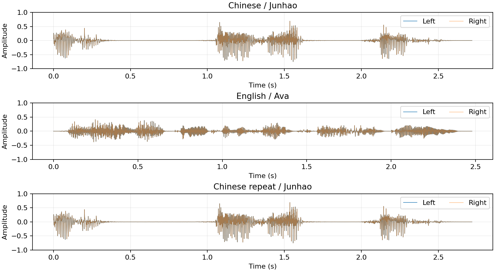

# MOSS-TTS-Nano.AXERA 部署指南

MOSS-TTS-Nano.AXERA 用于语音合成。本页说明 M.2 算力卡的接入条件、部署步骤与结果检查方法。

> 已实测，效果仍需评估。[查看部署效果](#查看部署效果)。

## 准备运行环境

本页效果展示使用 **RK3576 + AX8850 16GB M.2**；其他容量或平台需重新确认模型能否加载并正确运行。

在连接算力卡的 Linux 主机终端执行，RK3576 使用 ARM64 环境。首次部署先完成[驱动与设备检查](../../usage/device-check.md)、[安装 PyAXEngine](../../usage/python.md)和[下载工具安装](../../usage/download-models.md#使用-hugging-face-下载)。已完成这些步骤可直接下载模型。

后文使用设备 0，运行前用 `axcl-smi` 确认设备可用。

## 下载模型与样例

本页使用 `AXERA-TECH/MOSS-TTS-Nano.AXERA` 的固定版本。下面下载本页选用的 20 个文件。

```bash
MODEL_DIR=~/edgeaccel/models/moss-tts-nano-axera/74e28d5b9f1d
mkdir -p "$MODEL_DIR"
~/edgeaccel/hf-env/bin/hf download AXERA-TECH/MOSS-TTS-Nano.AXERA \
  --include "README.md" "config.json" "config/browser_poc_manifest.json" "config/codec_browser_onnx_meta.json" "config/tokenizer.model" "config/tts_browser_onnx_meta.json" "configuration.json" "models/axmodels_650/codec_decode.axmodel" "models/axmodels_650/tts_decode_step.axmodel" "models/axmodels_650/tts_local_fixed_sampled_frame.axmodel" "models/axmodels_650/tts_prefill.axmodel" "models/onnxmodels/moss_tts_decode_step.data" "models/onnxmodels/moss_tts_decode_step.onnx" "python/infer_moss_tts.py" "python/prepare_request.py" "requirements.txt" "run_ax650.sh" "scripts/__init__.py" "scripts/axe_session.py" "scripts/tts_runtime.py" \
  --revision 74e28d5b9f1d91634b85fdb77ab245744ee7e3f7 \
  --local-dir "$MODEL_DIR"
cd "$MODEL_DIR"
```

保留当前终端中的 `MODEL_DIR` 变量，后续命令沿用此目录。下载受阻或需要离线复制时，见[下载方式与文件校验](../../usage/download-models.md)。

## 准备算力卡运行环境

本页在 RK3576 主机上使用 AX8850 16GB M.2 算力卡，将中英文文字合成为 48 kHz 双声道 WAV。预填充、逐帧语音采样和声码器在算力卡上运行；自回归解码使用 RK3576 CPU 上的 ONNX Runtime，这是该版本推荐的组合。

保留上方下载得到的 `$MODEL_DIR`，在 RK3576 主机执行：

```bash
source ~/edgeaccel/python-env/bin/activate
python -m pip install 'numpy==1.26.4' 'sentencepiece==0.2.1' 'onnxruntime==1.20.1'
python -c "import axengine; print(axengine.get_available_providers())"
```

输出须包含 `AXCLRTExecutionProvider`。保持算力卡散热风扇开启，完成上方固定版本下载；本示例不需要 PyTorch。

## 检查模型文件

| 文件 | 执行位置 |
| --- | --- |
| `models/axmodels_650/tts_prefill.axmodel` | 算力卡：处理文本与内置音色条件 |
| `models/axmodels_650/tts_local_fixed_sampled_frame.axmodel` | 算力卡：生成一帧的 16 个语音 token |
| `models/axmodels_650/codec_decode.axmodel` | 算力卡：将语音 token 转为音频 |
| `models/onnxmodels/moss_tts_decode_step.onnx` | 主机 CPU：逐帧更新隐藏状态 |
| `models/onnxmodels/moss_tts_decode_step.data` | ONNX 外部权重，须与 `.onnx` 文件同目录 |
| `config/`、`scripts/` | 分词器、内置音色、参数和运行代码 |

示例按实际模型接口处理 512 行预填充和 320 行 CPU 解码缓存，并逐文件检查 SHA256。请保持权重、配置和示例版本一致。

仓库另有 `tts_decode_step.axmodel`。上游将全 NPU 解码列为诊断路径，本页的部署效果使用推荐的 CPU 解码组合。仓库中的 AX650 SoC 可执行程序不适用于本页 M.2 算力卡流程。

## 运行中英文合成

下载 [MOSS-TTS-Nano.AXERA 算力卡示例包](../../../static/examples/moss-axera-card-example.zip)，保存到 `~/edgeaccel/` 后执行：

```bash
mkdir -p ~/edgeaccel/moss-axera-example
unzip ~/edgeaccel/moss-axera-card-example.zip -d ~/edgeaccel/moss-axera-example
python ~/edgeaccel/moss-axera-example/moss_axera_card.py \
  --model-dir "$MODEL_DIR" \
  --output ~/edgeaccel/results/moss-axera-01
```

输出目录须尚不存在。程序依次合成中文、英文和一次中文重复样例，默认随机种子为 42，每句最多生成 110 帧。

## 使用自己的文字

```bash
python ~/edgeaccel/moss-axera-example/moss_axera_card.py \
  --model-dir "$MODEL_DIR" \
  --text '你好，欢迎使用算力卡。' \
  --voice Junhao \
  --max-frames 110 \
  --output ~/edgeaccel/results/moss-axera-custom-01
```

中文示例使用 `Junhao`，英文示例使用 `Ava`。可用音色见 `config/browser_poc_manifest.json` 的 `builtin_voices`；其他音色尚未逐一验证。

缓存容量限制为“实际提示行数 + `--max-frames` ≤ 320”。文字和内置音色条件都会占用提示行数。超出时缩短文字、改用较短音色条件，或降低帧数；降低帧数可能使语音提前截断。每帧对应 0.08 秒，单句最多 128 帧。`result.json` 中的 `stopReason` 为 `model-end` 表示模型自行结束；`frame-limit` 表示达到设置上限，需检查是否读完。

当前示例使用仓库内置音色，不提供自定义参考 WAV 克隆：该发布包没有配套的 `codec_encode` 权重。

## 检查并播放结果

`deployment-result.json` 中的 `completed` 应为 `true`。默认样例输出如下：

| 文件 | 输入 | 本次音频长度 |
| --- | --- | --- |
| `zh/output.wav` | 你好，欢迎使用算力卡。 | 2.72 秒 |
| `en/output.wav` | Hello, welcome to the edge AI demo. | 2.48 秒 |
| `zh-repeat/output.wav` | 相同中文与随机种子 | 2.72 秒 |

音频为 48 kHz、双声道、PCM16。复制到桌面主机播放，或在配置了音频输出的 Linux 主机执行：

```bash
aplay ~/edgeaccel/results/moss-axera-01/zh/output.wav
```

自定义文字的音频位于 `custom/output.wav`。每个样例还保存 `result.json`、`tokens.npy`、`waveform.npy` 和原始输入输出，便于核对实际结果。

下方展示本次实测音频和波形。中文两次运行的模型输入、输出和 WAV 完全一致；英文的独立 ASR 转写与输入词语相符，中文转写存在偏差，发音和音色质量仍需试听核对。耗时包含原始张量保存，不能作为关闭记录后的性能基准。本次为 16GB 卡实测，实际 8GB 卡另行回归。


## 查看部署效果

**已运行，效果仍需评估** · RK3576 + AX8850 16GB M.2。以下输入与输出来自本页固定版本的实际运行。

完成推荐的 AXCL + CPU 解码部署，展示中文 2.72 秒、英文 2.48 秒及中文重复音频。

**合成中文语音**

输入“你好，欢迎使用算力卡。”，使用内置 Junhao 音色，生成 34 帧、2.72 秒音频，模型自行结束。运行代码将中文逗号规范化为英文逗号。

| 项目 | 结果 |
| --- | --- |
| 输入 | 你好，欢迎使用算力卡。 |
| 音色 / 随机种子 | Junhao / 42 |
| 格式 | 48 kHz / 双声道 / PCM16 |

中文：Junhao 实际生成音频

<audio controls preload="metadata" src="/validation/effects/moss-tts-nano-axera-20260928/zh.wav" aria-label="中文：Junhao 实际生成音频"></audio>

[下载音频](../../../static/validation/effects/moss-tts-nano-axera-20260928/zh.wav)

**合成英文语音**

输入“Hello, welcome to the edge AI demo.”，使用内置 Ava 音色，生成 31 帧、2.48 秒音频，模型自行结束。

| 项目 | 结果 |
| --- | --- |
| 输入 | Hello, welcome to the edge AI demo. |
| 音色 / 随机种子 | Ava / 42 |

英文：Ava 实际生成音频

<audio controls preload="metadata" src="/validation/effects/moss-tts-nano-axera-20260928/en.wav" aria-label="英文：Ava 实际生成音频"></audio>

[下载音频](../../../static/validation/effects/moss-tts-nano-axera-20260928/en.wav)

**核对音频内容**

使用独立 Whisper base 在桌面 CPU 上转写，未提供原句提示。英文词语相符，中文转写存在偏差；ASR 结果不代替试听和发音质量验收。

| 输入文字 | 实际 ASR 转写 |
| --- | --- |
| 你好，欢迎使用算力卡。 | 您好 欢迎使用算订阅 |
| Hello, welcome to the edge AI demo. | Hello, welcome to the Edge AI demo. |

**核对重复结果**

相同中文、音色和随机种子重复一次，所有网络输入、输出及 WAV 字节完全一致；三段音频均无超出 [-1,1] 的采样点。

| 项目 | 结果 |
| --- | --- |
| 中文重复 | 网络输入输出与 WAV 一致 |
| 有效音频发生限幅的采样点 | 0 |

中文：相同条件重复生成

<audio controls preload="metadata" src="/validation/effects/moss-tts-nano-axera-20260928/zh-repeat.wav" aria-label="中文：相同条件重复生成"></audio>

[下载音频](../../../static/validation/effects/moss-tts-nano-axera-20260928/zh-repeat.wav)

**查看实际波形**

下图来自本次生成的三段双声道音频。

<div className="model-effect-gallery">

<figure>

[](../../../static/validation/effects/moss-tts-nano-axera-20260928/waveforms.png)

<figcaption>中英文及重复样例的实际波形</figcaption>
</figure>

</div>

**查看实际运行耗时**

AXCL 和 CPU 解码列仅累计对应 session.run 调用。流程耗时另含 CPU 处理、张量归档和 WAV 写入，不含模型加载，不作为关闭记录后的性能基准。

| 样例 | AXCL 调用 | AXCL / ms | CPU 解码 / ms | 含记录流程 / s | 音频 / s |
| --- | --- | --- | --- | --- | --- |
| zh | 37 | 1230.880 | 3372.235 | 11.488 | 2.72 |
| en | 34 | 1199.471 | 3267.071 | 11.006 | 2.48 |
| zh-repeat | 37 | 1231.389 | 3652.224 | 11.860 | 2.72 |

**使用时注意：**

- 独立 ASR 的英文词语相符，中文转写存在偏差；听感、发音准确率和音色质量尚未验收。
- 全 NPU 解码为上游诊断路径；本页展示推荐的 CPU 解码结果。未逐一验证全部内置音色、长文本或参考 WAV 克隆。

这些结果用于对照部署后的输出，未覆盖完整数据集精度或长期连续运行。

<details>
<summary>查看样例环境与运行耗时</summary>

环境：RK3576 + AX8850 16GB M.2。模型版本：`74e28d5b9f1d91634b85fdb77ab245744ee7e3f7`。

| 组件 | 版本或配置 |
| --- | --- |
| 主机 / 内核 | RK3576，约 4GB RAM，6.1.115-vendor-rk35xx |
| AXCL / 驱动 | V3.16.0_20260729180218 |
| 固件 / CMM | V3.16.0 / 15232 MiB |
| Python 推理 | Python 3.12 / PyAXEngine 0.1.3.rc3 / NumPy 1.26.4 / AXCLRTExecutionProvider |

| 指标 | 实测值 | 计时或统计范围 |
| --- | --- | --- |
| 部署路径 | 3 个 AXModel + CPU ONNX | 预填充、逐帧采样、声码器使用算力卡；自回归解码使用主机 CPU。 |
| 音频 | 3 段，48 kHz 双声道 | 中文与重复各 2.72 秒，英文 2.48 秒。 |
| 重复性 | 网络输入输出与 WAV 一致 | 相同中文条件重复一次。 |

适用范围：

- 当前为 AX8850 16GB 实测，实际 8GB 卡容量和长期稳定性另行验证。

</details>

遇到加载、内存或后端错误时，按[常见问题](../../usage/troubleshooting.md)处理。需要更换输入或接入业务时，按[检查输出与记录结果](../../reference/validation.md)保留自己的结果。

<details>
<summary>查看文件用途与版本信息</summary>

| 文件 / 目录内路径 | 用途 |
| --- | --- |
| [`python/infer_moss_tts.py`](https://huggingface.co/AXERA-TECH/MOSS-TTS-Nano.AXERA/blob/74e28d5b9f1d91634b85fdb77ab245744ee7e3f7/python/infer_moss_tts.py) | Python 程序 / 前后处理 |
| [`models/axmodels_650/codec_decode.axmodel`](https://huggingface.co/AXERA-TECH/MOSS-TTS-Nano.AXERA/blob/74e28d5b9f1d91634b85fdb77ab245744ee7e3f7/models/axmodels_650/codec_decode.axmodel) | 编译模型；按目录区分芯片和规格 |
| [`models/axmodels_650/tts_decode_step.axmodel`](https://huggingface.co/AXERA-TECH/MOSS-TTS-Nano.AXERA/blob/74e28d5b9f1d91634b85fdb77ab245744ee7e3f7/models/axmodels_650/tts_decode_step.axmodel) | 编译模型；按目录区分芯片和规格 |
| [`models/axmodels_650/tts_local_fixed_sampled_frame.axmodel`](https://huggingface.co/AXERA-TECH/MOSS-TTS-Nano.AXERA/blob/74e28d5b9f1d91634b85fdb77ab245744ee7e3f7/models/axmodels_650/tts_local_fixed_sampled_frame.axmodel) | 编译模型；按目录区分芯片和规格 |
| [`models/axmodels_650/tts_prefill.axmodel`](https://huggingface.co/AXERA-TECH/MOSS-TTS-Nano.AXERA/blob/74e28d5b9f1d91634b85fdb77ab245744ee7e3f7/models/axmodels_650/tts_prefill.axmodel) | 编译模型；按目录区分芯片和规格 |
| [`config.json`](https://huggingface.co/AXERA-TECH/MOSS-TTS-Nano.AXERA/blob/74e28d5b9f1d91634b85fdb77ab245744ee7e3f7/config.json) | 运行配置 |
| [`requirements.txt`](https://huggingface.co/AXERA-TECH/MOSS-TTS-Nano.AXERA/blob/74e28d5b9f1d91634b85fdb77ab245744ee7e3f7/requirements.txt) | Python 依赖清单 |
| [`run_ax650.sh`](https://huggingface.co/AXERA-TECH/MOSS-TTS-Nano.AXERA/blob/74e28d5b9f1d91634b85fdb77ab245744ee7e3f7/run_ax650.sh) | 启动或构建脚本 |

仓库提交：`74e28d5b9f1d91634b85fdb77ab245744ee7e3f7`。仓库中的 4 个 `.axmodel` 文件可能包括多个芯片、规格和分片。运行时使用本页指定的配套文件，完整列表见[固定版本目录](https://huggingface.co/AXERA-TECH/MOSS-TTS-Nano.AXERA/tree/74e28d5b9f1d91634b85fdb77ab245744ee7e3f7)。

</details>

<details>
<summary>补充说明与版本差异</summary>

- 与 moss-tts-nano 仓库分开部署，保留本仓库自己的模型布局、词表与推理脚本。

</details>

## 参考资料

- [常用术语](../../reference/glossary.md)：AXCL、CMM、分词器与推理指标。
- [固定版本文件表](https://huggingface.co/AXERA-TECH/MOSS-TTS-Nano.AXERA/tree/74e28d5b9f1d91634b85fdb77ab245744ee7e3f7)。
- [模型卡 / 使用说明](https://huggingface.co/AXERA-TECH/MOSS-TTS-Nano.AXERA/blob/74e28d5b9f1d91634b85fdb77ab245744ee7e3f7/README.md)。
- [主要程序入口：python/infer_moss_tts.py](https://huggingface.co/AXERA-TECH/MOSS-TTS-Nano.AXERA/blob/74e28d5b9f1d91634b85fdb77ab245744ee7e3f7/python/infer_moss_tts.py)。

返回[完整模型目录](../catalog.mdx)。
