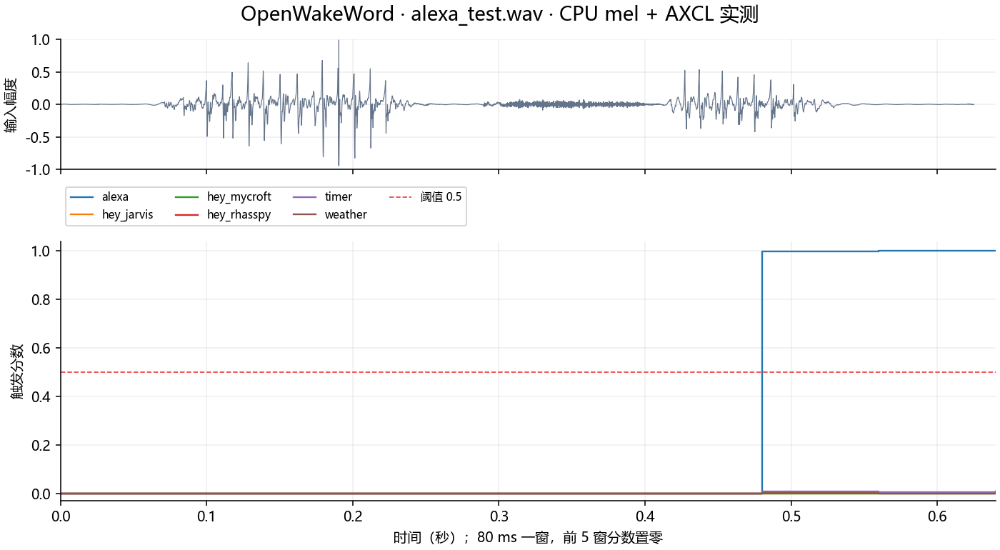
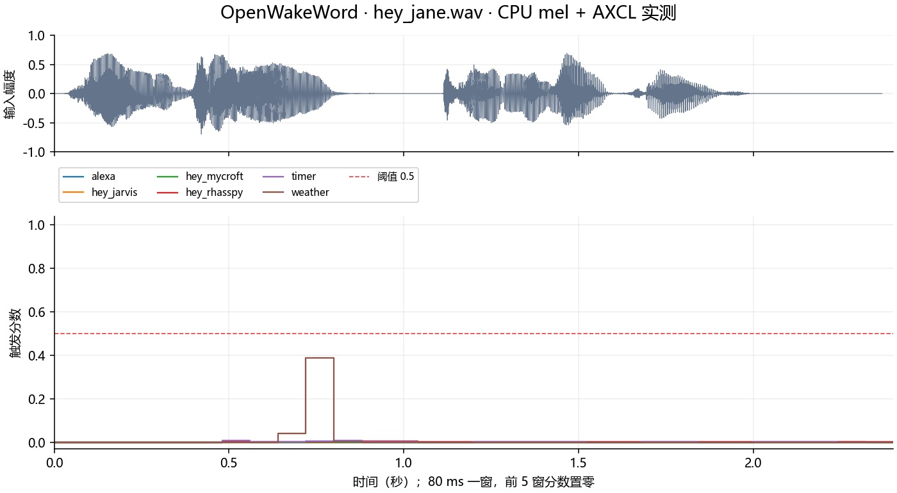
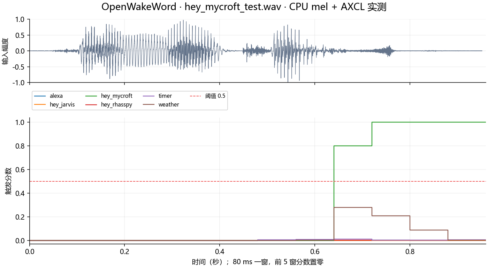
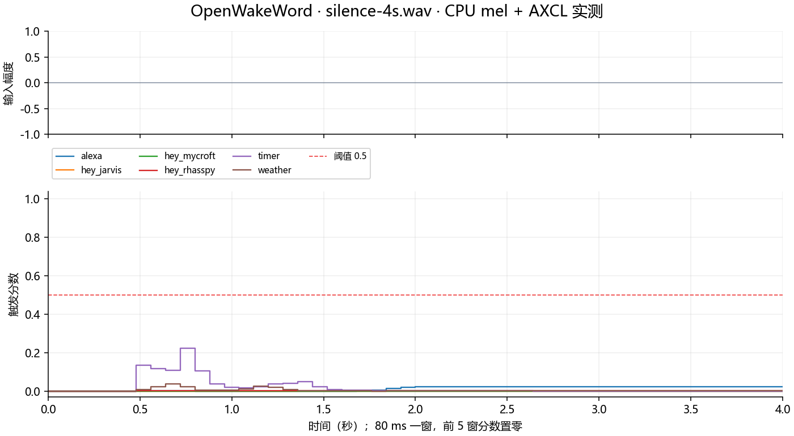

# OpenWakeWord.AXERA 部署指南

OpenWakeWord.AXERA 用于语音活动或唤醒检测。本页说明 M.2 算力卡的接入条件、部署步骤与结果检查方法。

> 已实测，效果仍需评估。[查看部署效果](#查看部署效果)。

## 准备运行环境

本页效果展示使用 **RK3576 + AX8850 16GB M.2**；其他容量或平台需重新确认模型能否加载并正确运行。

在连接算力卡的 Linux 主机终端执行，RK3576 使用 ARM64 环境。首次部署先完成[驱动与设备检查](../../usage/device-check.md)、[安装 PyAXEngine](../../usage/python.md)和[下载工具安装](../../usage/download-models.md#使用-hugging-face-下载)。已完成这些步骤可直接下载模型。

后文使用设备 0，运行前用 `axcl-smi` 确认设备可用。

## 下载模型与样例

本页使用 `AXERA-TECH/OpenWakeWord.AXERA` 的固定版本。下面下载本页选用的 16 个文件。

```bash
MODEL_DIR=~/edgeaccel/models/openwakeword-axera/3b8f2926204e
mkdir -p "$MODEL_DIR"
~/edgeaccel/hf-env/bin/hf download AXERA-TECH/OpenWakeWord.AXERA \
  "README.md" \
  "audio/openwakeword/alexa_test.wav" \
  "audio/openwakeword/hey_jane.wav" \
  "audio/openwakeword/hey_mycroft_test.wav" \
  "config.json" \
  "config/openwakeword_mel_weights.npz" \
  "models/650/openwakeword__alexa_v0.1.axmodel" \
  "models/650/openwakeword__embedding_model.axmodel" \
  "models/650/openwakeword__hey_jarvis_v0.1.axmodel" \
  "models/650/openwakeword__hey_mycroft_v0.1.axmodel" \
  "models/650/openwakeword__hey_rhasspy_v0.1.axmodel" \
  "models/650/openwakeword__timer_v0.1.axmodel" \
  "models/650/openwakeword__weather_v0.1.axmodel" \
  "reference/local_inference_results.json" \
  "scripts/openwakeword_ax.py" \
  "scripts/runtime.py" \
  --revision 3b8f2926204e69a36a9b55edeb60c75749589470 \
  --local-dir "$MODEL_DIR"
cd "$MODEL_DIR"
```

保留当前终端中的 `MODEL_DIR` 变量，后续命令沿用此目录。下载受阻或需要离线复制时，见[下载方式与文件校验](../../usage/download-models.md)。

## 准备唤醒例程

在 RK3576 主机激活已安装 [PyAXEngine](../../usage/python.md) 的环境，确认算力卡后端可用：

```bash
source ~/edgeaccel/python-env/bin/activate
python -m pip install 'numpy==1.26.4'
python -c "import axengine; print(axengine.get_available_providers())"
```

输出应包含 `AXCLRTExecutionProvider`。下载 [OpenWakeWord 算力卡例程](../../../static/examples/openwakeword_card.py)，保存为 `~/edgeaccel/openwakeword_card.py`。

本页在主机计算 mel 音频特征，在算力卡上执行特征编码和六组分类器。保留 `config/openwakeword_mel_weights.npz`，不要将其替换为 `melspectrogram.axmodel`；该替换路径未通过本环境的样例触发准确性核对。

## 运行音频唤醒检测

保持下载步骤中的 `MODEL_DIR`，执行：

```bash
python ~/edgeaccel/openwakeword_card.py \
  --model-dir "$MODEL_DIR" \
  --mode wake-word \
  --output ~/edgeaccel/results/openwakeword
```

结果目录需要尚不存在。例程处理三段官方 16kHz、单声道 PCM16 音频，并生成四秒静音作为负例；每份输入从空状态运行两次。

处理窗口为 1280 个采样点，即 80ms。前五个窗口是初始化阶段，分数按官方流程置零；最后不足一窗的音频补零。检测阈值为 `0.5`。

## 查看触发结果

打开 `deployment-result.json`，查看各音频的 `triggeredModels`：

| 输入 | 本次结果 |
| --- | --- |
| `alexa_test.wav` | `alexa_v0.1` |
| `hey_mycroft_test.wav` | `hey_mycroft_v0.1` |
| `hey_jane.wav` | 未触发 |
| `silence-4s.wav` | 未触发 |

每个 `*-input.wav` 是对应的实际输入，`detectionScores` 保存逐窗口触发分数。完成标志为 `completed: true`，七个子模型均有调用记录，重复输出一致。分数图和实际音频见下方效果展示。

timer 是七通道输出。按照[官方类别映射](https://github.com/dscripka/openWakeWord/blob/368c03716d1e92591906a84949bc477f3a834455/openwakeword/__init__.py)，第 1–6 通道分别对应 1、5、10、20、30 分钟和 1 小时计时指令；第 0 通道不作为触发类别。例程的 timer 触发分数取第 1–6 通道最大值，完整七通道值仍保存在 `frame_scores` 中。

这些样例只包含 Alexa、Hey Mycroft 两类正样本。其他分类器需要对应指令、不同说话人和噪声环境的音频才能进一步评估，不要把“未触发”视为该类别识别准确率已验证。


## 查看部署效果

**已运行，效果仍需评估** · 2026-09-28 · RK3576 + AX8850 16GB M.2。以下输入与输出来自本页固定版本的实际运行。

CPU mel 特征处理配合 AXCL 特征编码和六组分类器，完成三段官方音频及四秒静音。Alexa 与 Hey Mycroft 正确触发对应项，另两份输入未触发。

**alexa_test.wav**

仅 Alexa 达到阈值，峰值 1.0。 每份输入从空状态运行两次，全部 NPU 原始输出和最终分数一致。

<div className="model-effect-gallery">

<figure>

[](../../../static/validation/effects/openwakeword-axera-20260928/alexa_test-scores.png)

<figcaption>本次输入波形与触发分数</figcaption>
</figure>

</div>

| 分类器 | 触发分数峰值 | 达到阈值的窗口数 |
| --- | --- | --- |
| alexa | 1.000000 | 3 |
| hey_jarvis | 0.000000 | 0 |
| hey_mycroft | 0.000839 | 0 |
| hey_rhasspy | 0.001383 | 0 |
| timer | 0.007334 | 0 |
| weather | 0.006394 | 0 |

实际输入 · alexa_test.wav

<audio controls preload="metadata" src="/validation/effects/openwakeword-axera-20260928/alexa_test-input.wav" aria-label="实际输入 · alexa_test.wav"></audio>

[下载音频](../../../static/validation/effects/openwakeword-axera-20260928/alexa_test-input.wav)

**hey_jane.wav**

未触发本页六组分类器；此音频不是 Hey Jarvis 的正样本。 每份输入从空状态运行两次，全部 NPU 原始输出和最终分数一致。

<div className="model-effect-gallery">

<figure>

[](../../../static/validation/effects/openwakeword-axera-20260928/hey_jane-scores.png)

<figcaption>本次输入波形与触发分数</figcaption>
</figure>

</div>

| 分类器 | 触发分数峰值 | 达到阈值的窗口数 |
| --- | --- | --- |
| alexa | 0.000931 | 0 |
| hey_jarvis | 0.000122 | 0 |
| hey_mycroft | 0.000000 | 0 |
| hey_rhasspy | 0.004953 | 0 |
| timer | 0.007133 | 0 |
| weather | 0.387915 | 0 |

实际输入 · hey_jane.wav

<audio controls preload="metadata" src="/validation/effects/openwakeword-axera-20260928/hey_jane-input.wav" aria-label="实际输入 · hey_jane.wav"></audio>

[下载音频](../../../static/validation/effects/openwakeword-axera-20260928/hey_jane-input.wav)

**hey_mycroft_test.wav**

仅 Hey Mycroft 达到阈值，峰值 1.0。 每份输入从空状态运行两次，全部 NPU 原始输出和最终分数一致。

<div className="model-effect-gallery">

<figure>

[](../../../static/validation/effects/openwakeword-axera-20260928/hey_mycroft_test-scores.png)

<figcaption>本次输入波形与触发分数</figcaption>
</figure>

</div>

| 分类器 | 触发分数峰值 | 达到阈值的窗口数 |
| --- | --- | --- |
| alexa | 0.000671 | 0 |
| hey_jarvis | 0.000030 | 0 |
| hey_mycroft | 1.000000 | 5 |
| hey_rhasspy | 0.002781 | 0 |
| timer | 0.011225 | 0 |
| weather | 0.280079 | 0 |

实际输入 · hey_mycroft_test.wav

<audio controls preload="metadata" src="/validation/effects/openwakeword-axera-20260928/hey_mycroft_test-input.wav" aria-label="实际输入 · hey_mycroft_test.wav"></audio>

[下载音频](../../../static/validation/effects/openwakeword-axera-20260928/hey_mycroft_test-input.wav)

**silence-4s.wav**

4 秒全零静音没有触发；不能据此推算长时误唤醒率。 每份输入从空状态运行两次，全部 NPU 原始输出和最终分数一致。

<div className="model-effect-gallery">

<figure>

[](../../../static/validation/effects/openwakeword-axera-20260928/silence-4s-scores.png)

<figcaption>本次输入波形与触发分数</figcaption>
</figure>

</div>

| 分类器 | 触发分数峰值 | 达到阈值的窗口数 |
| --- | --- | --- |
| alexa | 0.023224 | 0 |
| hey_jarvis | 0.000000 | 0 |
| hey_mycroft | 0.000000 | 0 |
| hey_rhasspy | 0.002142 | 0 |
| timer | 0.221756 | 0 |
| weather | 0.036210 | 0 |

实际输入 · silence-4s.wav

<audio controls preload="metadata" src="/validation/effects/openwakeword-axera-20260928/silence-4s-input.wav" aria-label="实际输入 · silence-4s.wav"></audio>

[下载音频](../../../static/validation/effects/openwakeword-axera-20260928/silence-4s-input.wav)

**使用时注意：**

- 仅覆盖 Alexa、Hey Mycroft 两类正样本；Hey Jarvis、Hey Rhasspy、timer、weather 还需各自正样本及噪声场景验证。
- 本页使用 CPU mel；NPU mel 路径未通过样例触发准确性核对，不能直接替换。分数不是经过校准的事件概率。

这些结果用于对照部署后的输出，未覆盖完整数据集精度或长期连续运行。

<details>
<summary>查看样例环境与运行耗时</summary>

环境：RK3576 + AX8850 16GB M.2。日期：2026-09-28。模型版本：`3b8f2926204e69a36a9b55edeb60c75749589470`。

| 组件 | 版本或配置 |
| --- | --- |
| 主机 / 内核 | RK3576，约 4GB RAM，6.1.115-vendor-rk35xx |
| AXCL / 驱动 | V3.16.0_20260729180218 |
| 固件 / CMM | V3.16.0 / 15232 MiB |
| Python 推理 | Python 3.12 / PyAXEngine 0.1.3.rc3 / NumPy 1.26.4 / AXCLRTExecutionProvider |

| 指标 | 实测值 | 计时或统计范围 |
| --- | --- | --- |
| alexa_test.wav 完整处理 | 0.150 s / RTF 0.240 | 单遍 0.625 秒音频，包含 CPU mel、AXCL 推理及分数记录；不含加载、文件保存和第二次复测。 |
| hey_jane.wav 完整处理 | 0.538 s / RTF 0.227 | 单遍 2.368 秒音频，包含 CPU mel、AXCL 推理及分数记录；不含加载、文件保存和第二次复测。 |
| hey_mycroft_test.wav 完整处理 | 0.221 s / RTF 0.232 | 单遍 0.952 秒音频，包含 CPU mel、AXCL 推理及分数记录；不含加载、文件保存和第二次复测。 |
| silence-4s.wav 完整处理 | 0.886 s / RTF 0.222 | 单遍 4.000 秒音频，包含 CPU mel、AXCL 推理及分数记录；不含加载、文件保存和第二次复测。 |

适用范围：

- 仅覆盖 Alexa、Hey Mycroft 两类正样本；Hey Jarvis、Hey Rhasspy、timer、weather 还需各自正样本及噪声场景验证。
- 本页使用 CPU mel；NPU mel 路径未通过样例触发准确性核对，不能直接替换。分数不是经过校准的事件概率。
- 仅在 16GB 卡运行，真实 8GB、麦克风和长期误唤醒率待验证。

</details>

遇到加载、内存或后端错误时，按[常见问题](../../usage/troubleshooting.md)处理。需要更换输入或接入业务时，按[检查输出与记录结果](../../reference/validation.md)保留自己的结果。

<details>
<summary>查看文件用途与版本信息</summary>

| 文件 / 目录内路径 | 用途 |
| --- | --- |
| [`scripts/openwakeword_ax630c.py`](https://huggingface.co/AXERA-TECH/OpenWakeWord.AXERA/blob/3b8f2926204e69a36a9b55edeb60c75749589470/scripts/openwakeword_ax630c.py) | Python 程序 / 前后处理 |
| [`scripts/openwakeword_ax650.py`](https://huggingface.co/AXERA-TECH/OpenWakeWord.AXERA/blob/3b8f2926204e69a36a9b55edeb60c75749589470/scripts/openwakeword_ax650.py) | Python 程序 / 前后处理 |
| [`models/630C/openwakeword__alexa_v0.1.axmodel`](https://huggingface.co/AXERA-TECH/OpenWakeWord.AXERA/blob/3b8f2926204e69a36a9b55edeb60c75749589470/models/630C/openwakeword__alexa_v0.1.axmodel) | 编译模型；按目录区分芯片和规格 |
| [`models/630C/openwakeword__embedding_model.axmodel`](https://huggingface.co/AXERA-TECH/OpenWakeWord.AXERA/blob/3b8f2926204e69a36a9b55edeb60c75749589470/models/630C/openwakeword__embedding_model.axmodel) | 编译模型；按目录区分芯片和规格 |
| [`models/630C/openwakeword__hey_jarvis_v0.1.axmodel`](https://huggingface.co/AXERA-TECH/OpenWakeWord.AXERA/blob/3b8f2926204e69a36a9b55edeb60c75749589470/models/630C/openwakeword__hey_jarvis_v0.1.axmodel) | 编译模型；按目录区分芯片和规格 |
| [`models/630C/openwakeword__hey_mycroft_v0.1.axmodel`](https://huggingface.co/AXERA-TECH/OpenWakeWord.AXERA/blob/3b8f2926204e69a36a9b55edeb60c75749589470/models/630C/openwakeword__hey_mycroft_v0.1.axmodel) | 编译模型；按目录区分芯片和规格 |
| [`models/630C/openwakeword__hey_rhasspy_v0.1.axmodel`](https://huggingface.co/AXERA-TECH/OpenWakeWord.AXERA/blob/3b8f2926204e69a36a9b55edeb60c75749589470/models/630C/openwakeword__hey_rhasspy_v0.1.axmodel) | 编译模型；按目录区分芯片和规格 |
| [`audio/openwakeword/alexa_test.wav`](https://huggingface.co/AXERA-TECH/OpenWakeWord.AXERA/blob/3b8f2926204e69a36a9b55edeb60c75749589470/audio/openwakeword/alexa_test.wav) | 示例输入 |
| [`audio/openwakeword/hey_mycroft_test.wav`](https://huggingface.co/AXERA-TECH/OpenWakeWord.AXERA/blob/3b8f2926204e69a36a9b55edeb60c75749589470/audio/openwakeword/hey_mycroft_test.wav) | 示例输入 |
| [`config.json`](https://huggingface.co/AXERA-TECH/OpenWakeWord.AXERA/blob/3b8f2926204e69a36a9b55edeb60c75749589470/config.json) | 运行配置 |
| [`cpp/run_openwakeword_ax.sh`](https://huggingface.co/AXERA-TECH/OpenWakeWord.AXERA/blob/3b8f2926204e69a36a9b55edeb60c75749589470/cpp/run_openwakeword_ax.sh) | 启动或构建脚本 |
| [`cpp/run_openwakeword_ax630c.sh`](https://huggingface.co/AXERA-TECH/OpenWakeWord.AXERA/blob/3b8f2926204e69a36a9b55edeb60c75749589470/cpp/run_openwakeword_ax630c.sh) | 启动或构建脚本 |
| [`cpp/run_openwakeword_ax650.sh`](https://huggingface.co/AXERA-TECH/OpenWakeWord.AXERA/blob/3b8f2926204e69a36a9b55edeb60c75749589470/cpp/run_openwakeword_ax650.sh) | 启动或构建脚本 |
| [`requirements.txt`](https://huggingface.co/AXERA-TECH/OpenWakeWord.AXERA/blob/3b8f2926204e69a36a9b55edeb60c75749589470/requirements.txt) | Python 依赖清单 |

仓库提交：`3b8f2926204e69a36a9b55edeb60c75749589470`。仓库中的 16 个 `.axmodel` 文件可能包括多个芯片、规格和分片。运行时使用本页指定的配套文件，完整列表见[固定版本目录](https://huggingface.co/AXERA-TECH/OpenWakeWord.AXERA/tree/3b8f2926204e69a36a9b55edeb60c75749589470)。

</details>

<details>
<summary>补充说明与版本差异</summary>

- 音频特征前端、embedding 和唤醒分类器组成链路；模型窗口与输入分块大小必须配套。

</details>

## 参考资料

- [常用术语](../../reference/glossary.md)：AXCL、CMM、分词器与推理指标。
- [固定版本文件表](https://huggingface.co/AXERA-TECH/OpenWakeWord.AXERA/tree/3b8f2926204e69a36a9b55edeb60c75749589470)。
- [模型卡 / 使用说明](https://huggingface.co/AXERA-TECH/OpenWakeWord.AXERA/blob/3b8f2926204e69a36a9b55edeb60c75749589470/README.md)。
- [主要程序入口：scripts/openwakeword_ax630c.py](https://huggingface.co/AXERA-TECH/OpenWakeWord.AXERA/blob/3b8f2926204e69a36a9b55edeb60c75749589470/scripts/openwakeword_ax630c.py)。

返回[完整模型目录](../catalog.mdx)。
