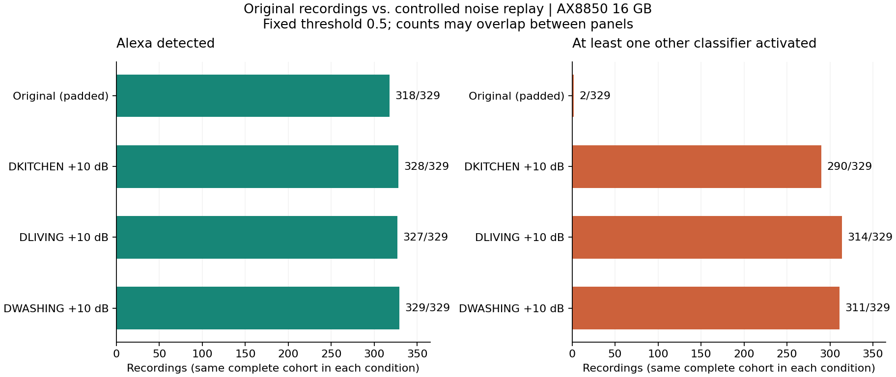
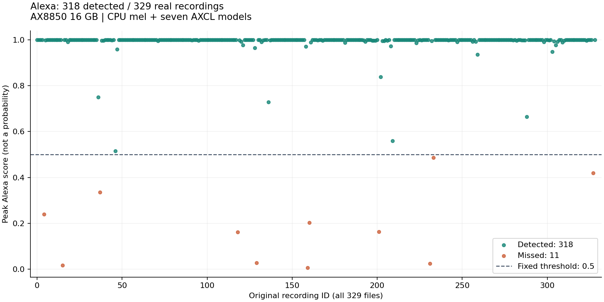
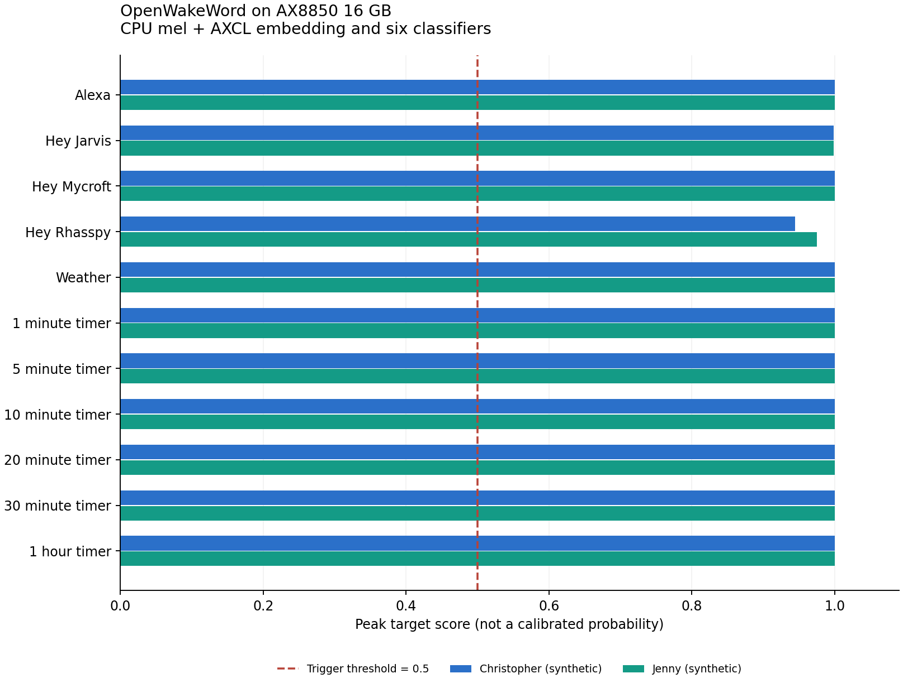

# OpenWakeWord.AXERA 部署指南

OpenWakeWord.AXERA 用于语音活动或唤醒检测。本页说明 M.2 算力卡的接入条件、部署步骤与结果检查方法。

> 已实测，效果仍需评估。[查看部署效果](#查看部署效果)。

## 准备运行环境

本页效果展示使用 **RK3576 + AX8850 16GB M.2**；其他容量或平台需重新确认模型能否加载并正确运行。

在连接算力卡的 Linux 主机终端执行，RK3576 使用 ARM64 环境。首次部署先完成[驱动与设备检查](../../usage/device-check.md)、[安装 PyAXEngine](../../usage/python.md)和[下载工具安装](../../usage/download-models.md#使用-hugging-face-下载)。已完成这些步骤可直接下载模型。

后文使用设备 0，运行前用 `axcl-smi` 确认设备可用。

## 下载模型与样例

本页使用 `AXERA-TECH/OpenWakeWord.AXERA` 的固定版本。下面下载本页选用的 16 个文件。

```bash
MODEL_DIR=~/edgeaccel/models/openwakeword-axera/3b8f2926204e
mkdir -p "$MODEL_DIR"
~/edgeaccel/hf-env/bin/hf download AXERA-TECH/OpenWakeWord.AXERA \
  "README.md" \
  "audio/openwakeword/alexa_test.wav" \
  "audio/openwakeword/hey_jane.wav" \
  "audio/openwakeword/hey_mycroft_test.wav" \
  "config.json" \
  "config/openwakeword_mel_weights.npz" \
  "models/650/openwakeword__alexa_v0.1.axmodel" \
  "models/650/openwakeword__embedding_model.axmodel" \
  "models/650/openwakeword__hey_jarvis_v0.1.axmodel" \
  "models/650/openwakeword__hey_mycroft_v0.1.axmodel" \
  "models/650/openwakeword__hey_rhasspy_v0.1.axmodel" \
  "models/650/openwakeword__timer_v0.1.axmodel" \
  "models/650/openwakeword__weather_v0.1.axmodel" \
  "reference/local_inference_results.json" \
  "scripts/openwakeword_ax.py" \
  "scripts/runtime.py" \
  --revision 3b8f2926204e69a36a9b55edeb60c75749589470 \
  --local-dir "$MODEL_DIR"
cd "$MODEL_DIR"
```

保留当前终端中的 `MODEL_DIR` 变量，后续命令沿用此目录。下载受阻或需要离线复制时，见[下载方式与文件校验](../../usage/download-models.md)。

## 准备唤醒例程

在 RK3576 主机激活已安装 [PyAXEngine](../../usage/python.md) 的环境，确认算力卡后端可用：

```bash
source ~/edgeaccel/python-env/bin/activate
python -m pip install 'numpy==1.26.4'
python -c "import axengine; print(axengine.get_available_providers())"
```

输出应包含 `AXCLRTExecutionProvider`。下载 [OpenWakeWord 算力卡例程](../../../static/examples/openwakeword_card.py)，保存为 `~/edgeaccel/openwakeword_card.py`。

本页在主机计算 mel 音频特征，在算力卡上执行特征编码和六组分类器。保留 `config/openwakeword_mel_weights.npz`，不要将其替换为 `melspectrogram.axmodel`；该替换路径未通过本环境的样例触发准确性核对。

## 运行音频唤醒检测

保持下载步骤中的 `MODEL_DIR`，执行：

```bash
python ~/edgeaccel/openwakeword_card.py \
  --model-dir "$MODEL_DIR" \
  --mode wake-word \
  --output ~/edgeaccel/results/openwakeword
```

结果目录需要尚不存在。例程处理三段官方 16kHz、单声道 PCM16 音频，并生成四秒静音作为负例；每份输入从空状态运行两次。

处理窗口为 1280 个采样点，即 80ms。前五个窗口是初始化阶段，分数按官方流程置零；最后不足一窗的音频补零。检测阈值为 `0.5`。

## 查看触发结果

打开 `deployment-result.json`，查看各音频的 `triggeredModels`：

| 输入 | 本次结果 |
| --- | --- |
| `alexa_test.wav` | `alexa_v0.1` |
| `hey_mycroft_test.wav` | `hey_mycroft_v0.1` |
| `hey_jane.wav` | 未触发 |
| `silence-4s.wav` | 未触发 |

每个 `*-input.wav` 是对应的实际输入，`detectionScores` 保存逐窗口触发分数。`completed: true` 表示处理已结束；默认样例还应满足 `functionalChecks` 全部为 `true`，七个子模型均有调用记录，且 `repeatExact` 为 `true`。实际音频和追加的唤醒词效果见下方展示。

timer 是七通道输出。按照[官方类别映射](https://github.com/dscripka/openWakeWord/blob/368c03716d1e92591906a84949bc477f3a834455/openwakeword/__init__.py)，第 1–6 通道分别对应 1、5、10、20、30 分钟和 1 小时计时指令；第 0 通道不作为触发类别。例程的 timer 触发分数取第 1–6 通道最大值，完整七通道值仍保存在 `frame_scores` 中。

`triggeredTimerClasses` 给出实际达到阈值的计时类别编号，`timerClassPeaks` 保存各类别峰值。判断“十分钟计时”时应检查第 3 类，不能只检查 timer 总体是否触发。

## 检测自己的录音

在 RK3576 主机安装 FFmpeg，将录音转换成 16kHz、单声道 PCM16 WAV。下面的 `recording.wav` 替换为自己的输入文件；录音前后各留约 1 秒静音。

```bash
sudo apt install -y ffmpeg
mkdir -p ~/edgeaccel/audio/openwakeword
ffmpeg -i recording.wav -ar 16000 -ac 1 -c:a pcm_s16le \
  ~/edgeaccel/audio/openwakeword/microphone.wav

python ~/edgeaccel/openwakeword_card.py \
  --model-dir "$MODEL_DIR" \
  --audio-dir ~/edgeaccel/audio/openwakeword \
  --mode wake-word \
  --output ~/edgeaccel/results/openwakeword-custom
```

例程会处理目录中的全部 WAV，并额外检查四秒静音。结果目录需尚不存在。将 `triggeredModels`、`triggeredTimerClasses` 与实际说出的指令核对；自备录音没有预设标签，`completed` 和重复输出一致都不能代替识别正确性判断。

下方追加样例采用[官方的合成音频生成方法](https://github.com/AXERA-TECH/openWakeWord.AXERA/blob/517ce5609726680eea98dae0c0a91a771fd7b71a/python/generate_calibration_audio.py)，覆盖 Alexa、Hey Jarvis、Hey Mycroft、Hey Rhasspy、天气查询及六种计时指令。合成音频的触发结果不能替代麦克风、距离、噪声和长时间连续录音测试。


## 查看部署效果

**已运行，效果仍需评估** · RK3576 + AX8850 16GB M.2。以下输入与输出来自本页固定版本的实际运行。

CPU mel 配合七个 AXCL 子模型，已完成全部 11 个目标的合成样例、329 条原始 Alexa 真人录音，以及同组录音在三种 10 dB 噪声条件下的 987 条带噪输入。下方保留完整检出、漏检和其他类别触发结果。

**三种环境噪声：987 条完整录音回放**

在同一组 329 条 Alexa 真人录音上，分别叠加 [DEMAND 数据集](https://zenodo.org/records/1227121) 的 DKITCHEN、DLIVING 和 DWASHING 环境录音，共 987 条带噪输入。每条仍在前后各保留 1 秒，噪声连续覆盖整段；按原始语音区间的均方根幅值配置 10 dB 信噪比，必要时同步降低语音和噪声幅值以避免削波。固定使用第 1 通道，阈值为 0.5，每条清空状态后运行两遍。下表同时列出 Alexa 检出、漏检及其他类别触发；两类触发可以发生在同一条录音中，不能把其他类别触发数当成 Alexa 漏检数。

三段完整背景录音也触发了 Alexa，带噪输入还频繁触发其他类别。因此，较高的 Alexa 检出数不能直接解释为识别质量提高；当前阈值下的噪声区分能力仍需评估。

每个环境另回放完整的 300.004 秒背景录音，其人声内容未经标注，因此只报告触发类别，不计算每小时误唤醒率。本结果属于受控混音文件回放，未模拟混响，也不代表实际麦克风或远场表现。

<div className="model-effect-gallery">

<figure>

[](../../../static/validation/effects/openwakeword-axera-20261004/real-alexa-domestic-noise.png)

<figcaption>同一组 329 条原始录音与三种 10 dB 混音条件的实际结果</figcaption>
</figure>

</div>

| 输入条件（每组 329 条） | Alexa 检出 | Alexa 漏检 | 触发其他类别 |
| --- | --- | --- | --- |
| 原始录音 | 318 | 11 | 2 |
| DKITCHEN，10 dB | 328 | 1 | 290 |
| DLIVING，10 dB | 327 | 2 | 314 |
| DWASHING，10 dB | 329 | 0 | 311 |

| 带噪条件 | 原始和带噪均检出 | 原始检出、带噪漏检 | 原始漏检、带噪检出 | 原始和带噪均漏检 |
| --- | --- | --- | --- | --- |
| DKITCHEN | 318 | 0 | 10 | 1 |
| DLIVING | 317 | 1 | 10 | 1 |
| DWASHING | 318 | 0 | 11 | 0 |

| 完整背景录音 | 输入时长 | 实际触发类别 |
| --- | --- | --- |
| DKITCHEN | 300.004 秒 | alexa_v0.1、hey_mycroft_v0.1、weather_v0.1 |
| DLIVING | 300.004 秒 | alexa_v0.1、weather_v0.1 |
| DWASHING | 300.004 秒 | alexa_v0.1 |

**真人 Alexa 录音：全量 329 条**

使用 [Picovoice 公开众包录音](https://github.com/Picovoice/wake-word-benchmark/tree/84919190fb1891bf0936dcb577d9268e467f876f/audio/alexa)中的全部 329 条 Alexa 样本，原音频共 831.116 秒。无损解码为 16 kHz 单声道 PCM16，前后各加 1 秒静音；阈值固定为 0.5，每条从空状态处理两遍。检出 318 条、漏检 11 条，两遍输出一致。图中保留全部样本；下方分别播放编号 0 和最低分样本。这是录音文件回放结果，不代表本机麦克风、远场或带噪声场景的识别率。数据由 Picovoice 提供，沿用其仓库 Apache-2.0 许可。

<div className="model-effect-gallery">

<figure>

[](../../../static/validation/effects/openwakeword-axera-20261004/real-alexa-peaks.png)

<figcaption>全部真人 Alexa 样本的实际峰值分数</figcaption>
</figure>

</div>

| 检查项 | 实际结果 |
| --- | --- |
| Alexa 检出 | 318 / 329（96.66%） |
| Alexa 漏检 | 11 / 329 |
| 录音触发其他类别 | 2 / 329 |
| 批次静音对照 | 6 段均未触发 |
| 重复运行 | 329 条的两遍输出逐值一致 |

| 漏检样本编号 | 实际峰值 | 触发阈值 |
| --- | --- | --- |
| 4 | 0.239368 | 0.5 |
| 15 | 0.017258 | 0.5 |
| 37 | 0.334981 | 0.5 |
| 118 | 0.161547 | 0.5 |
| 129 | 0.027802 | 0.5 |
| 159 | 0.005509 | 0.5 |
| 160 | 0.202472 | 0.5 |
| 201 | 0.162387 | 0.5 |
| 231 | 0.024033 | 0.5 |
| 233 | 0.486229 | 0.5 |
| 327 | 0.418875 | 0.5 |

真人录音 0 · 检出 · 峰值 0.999969

<audio controls preload="metadata" src="/validation/effects/openwakeword-axera-20261004/real-alexa-0.wav" aria-label="真人录音 0 · 检出 · 峰值 0.999969"></audio>

[下载音频](../../../static/validation/effects/openwakeword-axera-20261004/real-alexa-0.wav)

真人录音 159 · 未检出 · 峰值 0.005509

<audio controls preload="metadata" src="/validation/effects/openwakeword-axera-20261004/real-alexa-159.wav" aria-label="真人录音 159 · 未检出 · 峰值 0.005509"></audio>

[下载音频](../../../static/validation/effects/openwakeword-axera-20261004/real-alexa-159.wav)

**两种合成音色：11 个检测目标**

使用 Christopher、Jenny 两种合成音色，各包含五类唤醒语句、六种计时指令及三条非唤醒语句。每段语音前后各添加 1 秒静音，以相同的 0.5 阈值从空状态运行两次。22 条正样本只触发对应项，六条非唤醒语句及额外静音均未触发；重复输出一致。

<div className="model-effect-gallery">

<figure>

[](../../../static/validation/effects/openwakeword-axera-20261004/keyword-peaks.png)

<figcaption>11 个目标的实际峰值分数</figcaption>
</figure>

</div>

| 目标 | Christopher 峰值 | Jenny 峰值 | 结果 |
| --- | --- | --- | --- |
| Alexa | 1.000000 | 1.000000 | 仅对应项触发 |
| Hey Jarvis | 0.998633 | 0.998816 | 仅对应项触发 |
| Hey Mycroft | 1.000000 | 1.000000 | 仅对应项触发 |
| Hey Rhasspy | 0.944599 | 0.974717 | 仅对应项触发 |
| 天气查询 | 1.000000 | 1.000000 | 仅对应项触发 |
| 1 分钟计时 | 1.000000 | 1.000000 | 仅对应项触发 |
| 5 分钟计时 | 1.000000 | 1.000000 | 仅对应项触发 |
| 10 分钟计时 | 0.999985 | 0.999832 | 仅对应项触发 |
| 20 分钟计时 | 0.999985 | 1.000000 | 仅对应项触发 |
| 30 分钟计时 | 1.000000 | 1.000000 | 仅对应项触发 |
| 1 小时计时 | 1.000000 | 1.000000 | 仅对应项触发 |

| 负例文本 | Christopher 最高触发分数 | Jenny 最高触发分数 | 结果 |
| --- | --- | --- | --- |
| turn on the office lights | 0.221756 | 0.221756 | 均未触发 |
| open the door please | 0.221756 | 0.221756 | 均未触发 |
| good morning everyone | 0.221756 | 0.221756 | 均未触发 |
| 4 秒全零静音 | 0.221756 | — | 未触发 |

**官方录音与静音**

以下为默认命令本次处理的三段官方录音和四秒静音。Alexa、Hey Mycroft 触发对应项，Hey Jane 与静音不触发。可播放输入音频，并对照自己的部署结果。

| 输入 | 实际触发 | 处理耗时 | RTF |
| --- | --- | --- | --- |
| alexa_test.wav | alexa_v0.1 | 0.177 s | 0.283 |
| hey_jane.wav | 未触发 | 0.440 s | 0.186 |
| hey_mycroft_test.wav | hey_mycroft_v0.1 | 0.170 s | 0.179 |
| silence-4s.wav | 未触发 | 0.729 s | 0.182 |

实际输入 · alexa_test.wav

<audio controls preload="metadata" src="/validation/effects/openwakeword-axera-20261004/alexa_test-input.wav" aria-label="实际输入 · alexa_test.wav"></audio>

[下载音频](../../../static/validation/effects/openwakeword-axera-20261004/alexa_test-input.wav)

实际输入 · hey_jane.wav

<audio controls preload="metadata" src="/validation/effects/openwakeword-axera-20261004/hey_jane-input.wav" aria-label="实际输入 · hey_jane.wav"></audio>

[下载音频](../../../static/validation/effects/openwakeword-axera-20261004/hey_jane-input.wav)

实际输入 · hey_mycroft_test.wav

<audio controls preload="metadata" src="/validation/effects/openwakeword-axera-20261004/hey_mycroft_test-input.wav" aria-label="实际输入 · hey_mycroft_test.wav"></audio>

[下载音频](../../../static/validation/effects/openwakeword-axera-20261004/hey_mycroft_test-input.wav)

实际输入 · silence-4s.wav

<audio controls preload="metadata" src="/validation/effects/openwakeword-axera-20261004/silence-4s-input.wav" aria-label="实际输入 · silence-4s.wav"></audio>

[下载音频](../../../static/validation/effects/openwakeword-axera-20261004/silence-4s-input.wav)

**使用时注意：**

- 真人录音仅覆盖 Alexa；三种环境噪声测试采用受控混音回放。尚未验证本机麦克风、远场和有人工标注的长期连续误唤醒率；检测分数不是校准后的事件概率。
- 本页采用 CPU mel。可选 NPU mel 路径此前出现误触发，仍未通过质量核对；本轮未重复该路径。

这些结果用于对照部署后的输出，未覆盖完整数据集精度或长期连续运行。

<details>
<summary>查看样例环境与运行耗时</summary>

环境：RK3576 + AX8850 16GB M.2。模型版本：`3b8f2926204e69a36a9b55edeb60c75749589470`。

| 组件 | 版本或配置 |
| --- | --- |
| 主机 / 内核 | RK3576，约 4GB RAM，6.1.115-vendor-rk35xx |
| AXCL / 驱动 | V3.16.0_20260729180218 |
| 固件 / CMM | V3.16.0 / 15232 MiB |
| Python 推理 | Python 3.12 / PyAXEngine 0.1.3.rc3 / NumPy 1.26.4 / AXCLRTExecutionProvider |

| 指标 | 实测值 | 计时或统计范围 |
| --- | --- | --- |
| 合成音频与静音 | 29 段 / 121.368 s | 28 段合成语音（每段含前后各 1 秒静音）及 4 秒全零静音。 |
| 合成样本分支执行 | 21,420 次 | 七个 AXCL 子模型各执行 3,060 次；每段音频从空状态处理两次。 |
| 官方样例分支执行 | 1,400 次 | 三段官方录音和静音，每段处理两次；七个子模型各执行 200 次。 |
| 合成音频单遍 RTF | 0.201–0.263 | 文件离线处理耗时 / 含静音输入时长；含 CPU mel、AXCL 调用和输出校验，不含模型加载、保存及第二次复测。 |
| 真人录音单遍时长 | 831.116 s / 1489.116 s | 原始 329 条录音 / 每条前后各加 1 秒静音后的输入。 |
| 真人录音测试分支执行 | 266,966 次 | 含 329 条真人录音及六段批次静音，各运行两遍；七个 AXCL 子模型的调用总和。 |
| 真人录音单遍 RTF | 中位数 0.240 | 含 CPU mel、AXCL 调用和输出校验，除以含静音的输入时长；不含模型加载、保存及第二遍复测。 |
| 带噪录音测试分支执行 | 960,540 次 | 987 条带噪录音、3 段完整背景及21段静音，各运行两遍；七个 AXCL 子模型的总调用次数。 |
| 带噪录音重复运行 | 987 / 987 逐值一致 | 每条分别从空状态处理两遍；不代表识别内容或部署质量已全部通过。 |

适用范围：

- 仅在 AX8850 16GB 上测试，真实 8GB 容量回归仍需对应硬件。

</details>

遇到加载、内存或后端错误时，按[常见问题](../../usage/troubleshooting.md)处理。需要更换输入或接入业务时，按[检查输出与记录结果](../../reference/validation.md)保留自己的结果。

<details>
<summary>查看文件用途与版本信息</summary>

| 文件 / 目录内路径 | 用途 |
| --- | --- |
| [`scripts/openwakeword_ax630c.py`](https://huggingface.co/AXERA-TECH/OpenWakeWord.AXERA/blob/3b8f2926204e69a36a9b55edeb60c75749589470/scripts/openwakeword_ax630c.py) | Python 程序 / 前后处理 |
| [`scripts/openwakeword_ax650.py`](https://huggingface.co/AXERA-TECH/OpenWakeWord.AXERA/blob/3b8f2926204e69a36a9b55edeb60c75749589470/scripts/openwakeword_ax650.py) | Python 程序 / 前后处理 |
| [`models/630C/openwakeword__alexa_v0.1.axmodel`](https://huggingface.co/AXERA-TECH/OpenWakeWord.AXERA/blob/3b8f2926204e69a36a9b55edeb60c75749589470/models/630C/openwakeword__alexa_v0.1.axmodel) | 编译模型；按目录区分芯片和规格 |
| [`models/630C/openwakeword__embedding_model.axmodel`](https://huggingface.co/AXERA-TECH/OpenWakeWord.AXERA/blob/3b8f2926204e69a36a9b55edeb60c75749589470/models/630C/openwakeword__embedding_model.axmodel) | 编译模型；按目录区分芯片和规格 |
| [`models/630C/openwakeword__hey_jarvis_v0.1.axmodel`](https://huggingface.co/AXERA-TECH/OpenWakeWord.AXERA/blob/3b8f2926204e69a36a9b55edeb60c75749589470/models/630C/openwakeword__hey_jarvis_v0.1.axmodel) | 编译模型；按目录区分芯片和规格 |
| [`models/630C/openwakeword__hey_mycroft_v0.1.axmodel`](https://huggingface.co/AXERA-TECH/OpenWakeWord.AXERA/blob/3b8f2926204e69a36a9b55edeb60c75749589470/models/630C/openwakeword__hey_mycroft_v0.1.axmodel) | 编译模型；按目录区分芯片和规格 |
| [`models/630C/openwakeword__hey_rhasspy_v0.1.axmodel`](https://huggingface.co/AXERA-TECH/OpenWakeWord.AXERA/blob/3b8f2926204e69a36a9b55edeb60c75749589470/models/630C/openwakeword__hey_rhasspy_v0.1.axmodel) | 编译模型；按目录区分芯片和规格 |
| [`audio/openwakeword/alexa_test.wav`](https://huggingface.co/AXERA-TECH/OpenWakeWord.AXERA/blob/3b8f2926204e69a36a9b55edeb60c75749589470/audio/openwakeword/alexa_test.wav) | 示例输入 |
| [`audio/openwakeword/hey_mycroft_test.wav`](https://huggingface.co/AXERA-TECH/OpenWakeWord.AXERA/blob/3b8f2926204e69a36a9b55edeb60c75749589470/audio/openwakeword/hey_mycroft_test.wav) | 示例输入 |
| [`config.json`](https://huggingface.co/AXERA-TECH/OpenWakeWord.AXERA/blob/3b8f2926204e69a36a9b55edeb60c75749589470/config.json) | 运行配置 |
| [`cpp/run_openwakeword_ax.sh`](https://huggingface.co/AXERA-TECH/OpenWakeWord.AXERA/blob/3b8f2926204e69a36a9b55edeb60c75749589470/cpp/run_openwakeword_ax.sh) | 启动或构建脚本 |
| [`cpp/run_openwakeword_ax630c.sh`](https://huggingface.co/AXERA-TECH/OpenWakeWord.AXERA/blob/3b8f2926204e69a36a9b55edeb60c75749589470/cpp/run_openwakeword_ax630c.sh) | 启动或构建脚本 |
| [`cpp/run_openwakeword_ax650.sh`](https://huggingface.co/AXERA-TECH/OpenWakeWord.AXERA/blob/3b8f2926204e69a36a9b55edeb60c75749589470/cpp/run_openwakeword_ax650.sh) | 启动或构建脚本 |
| [`requirements.txt`](https://huggingface.co/AXERA-TECH/OpenWakeWord.AXERA/blob/3b8f2926204e69a36a9b55edeb60c75749589470/requirements.txt) | Python 依赖清单 |

仓库提交：`3b8f2926204e69a36a9b55edeb60c75749589470`。仓库中的 16 个 `.axmodel` 文件可能包括多个芯片、规格和分片。运行时使用本页指定的配套文件，完整列表见[固定版本目录](https://huggingface.co/AXERA-TECH/OpenWakeWord.AXERA/tree/3b8f2926204e69a36a9b55edeb60c75749589470)。

</details>

<details>
<summary>补充说明与版本差异</summary>

- 音频特征前端、embedding 和唤醒分类器组成链路；模型窗口与输入分块大小必须配套。

</details>

## 参考资料

- [常用术语](../../reference/glossary.md)：AXCL、CMM、分词器与推理指标。
- [固定版本文件表](https://huggingface.co/AXERA-TECH/OpenWakeWord.AXERA/tree/3b8f2926204e69a36a9b55edeb60c75749589470)。
- [模型卡 / 使用说明](https://huggingface.co/AXERA-TECH/OpenWakeWord.AXERA/blob/3b8f2926204e69a36a9b55edeb60c75749589470/README.md)。
- [主要程序入口：scripts/openwakeword_ax630c.py](https://huggingface.co/AXERA-TECH/OpenWakeWord.AXERA/blob/3b8f2926204e69a36a9b55edeb60c75749589470/scripts/openwakeword_ax630c.py)。

返回[完整模型目录](../catalog.mdx)。
