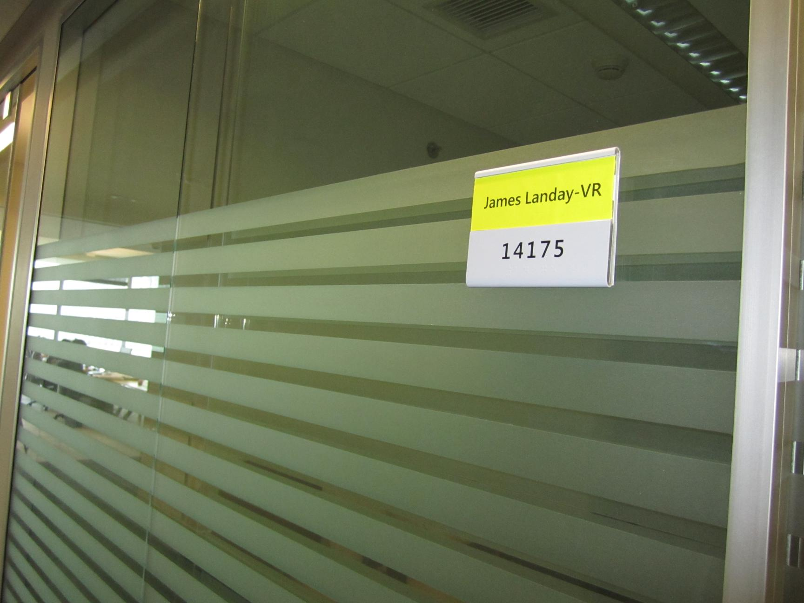

# PaddleOCR-VL-1.5 部署指南

PaddleOCR-VL-1.5 用于文字检测与识别。本页说明 M.2 算力卡的接入条件、部署步骤与结果检查方法。

> 已实测，固定样例已核对。[查看部署效果](#查看部署效果)。

## 准备运行环境

本页效果展示使用 **RK3576 + AX8850 16GB M.2**；其他容量或平台需重新确认模型能否加载并正确运行。

在连接算力卡的 Linux 主机终端执行，RK3576 使用 ARM64 环境。首次部署先完成[驱动与设备检查](../../usage/device-check.md)、[编译 AXCL 大模型运行时](../llm-runtime.md)和[下载工具安装](../../usage/download-models.md#使用-hugging-face-下载)。已完成这些步骤可直接下载模型。

后文使用设备 0，运行前用 `axcl-smi` 确认设备可用。

## 下载模型与样例

本页使用 `AXERA-TECH/PaddleOCR-VL-1.5` 的固定版本。下面下载本页选用的 27 个文件。

```bash
MODEL_DIR=~/edgeaccel/models/paddleocr-vl-1-5/820bbe67aeae
mkdir -p "$MODEL_DIR"
~/edgeaccel/hf-env/bin/hf download AXERA-TECH/PaddleOCR-VL-1.5 \
  "config.json" \
  "paddleocr_vl_p128_l0_together.axmodel" \
  "paddleocr_vl_p128_l1_together.axmodel" \
  "paddleocr_vl_p128_l2_together.axmodel" \
  "paddleocr_vl_p128_l3_together.axmodel" \
  "paddleocr_vl_p128_l4_together.axmodel" \
  "paddleocr_vl_p128_l5_together.axmodel" \
  "paddleocr_vl_p128_l6_together.axmodel" \
  "paddleocr_vl_p128_l7_together.axmodel" \
  "paddleocr_vl_p128_l8_together.axmodel" \
  "paddleocr_vl_p128_l9_together.axmodel" \
  "paddleocr_vl_p128_l10_together.axmodel" \
  "paddleocr_vl_p128_l11_together.axmodel" \
  "paddleocr_vl_p128_l12_together.axmodel" \
  "paddleocr_vl_p128_l13_together.axmodel" \
  "paddleocr_vl_p128_l14_together.axmodel" \
  "paddleocr_vl_p128_l15_together.axmodel" \
  "paddleocr_vl_p128_l16_together.axmodel" \
  "paddleocr_vl_p128_l17_together.axmodel" \
  "paddleocr_vl_post.axmodel" \
  "model.embed_tokens.weight.bfloat16.bin" \
  "paddleocr_vl_tokenizer.txt" \
  "vit_576x768.axmodel" \
  "post_config.json" \
  "assets/IMG_0059.JPG" \
  "assets/IMG_0462.JPG" \
  "assets/IMG_0675.JPG" \
  --revision 820bbe67aeae0e803f80272a238db1884100cfa4 \
  --local-dir "$MODEL_DIR"
cd "$MODEL_DIR"
```

保留当前终端中的 `MODEL_DIR` 变量，后续命令沿用此目录。下载受阻或需要离线复制时，见[下载方式与文件校验](../../usage/download-models.md)。
## 核对运行配置

配置文件：`config.json`。

| 项目 | 当前配置 |
| --- | --- |
| 运行时模型名称 | `AXERA-TECH/PaddleOCR-VL-1.5` |
| 分词器类型（tokenizer_type） | `PaddleOCRVL` |
| 多模态类型（vlm_type） | `PaddleOCRVL` |
| Transformer 层数 | 18 |
| 分片命名模板 | `paddleocr_vl_p128_l%d_together.axmodel` |
| Embedding 模式 | 否 |

| 配置字段 | 文件路径 | 同提交文件表 |
| --- | --- | --- |
| `filename_post_axmodel` | `paddleocr_vl_post.axmodel` | 已找到 |
| `filename_tokens_embed` | `model.embed_tokens.weight.bfloat16.bin` | 已找到 |
| `url_tokenizer_model` | `paddleocr_vl_tokenizer.txt` | 已找到 |
| `filename_image_encoder_axmodel` | `vit_576x768.axmodel` | 已找到 |
| `post_config_path` | `post_config.json` | 已找到 |

逐层核对 18 个分片，不能用同系列其他版本补缺。文件名检查只能证明文件布局一致，实际张量和后端兼容性仍需加载验证。

## 检查完整模型包

在模型根目录执行文件检查：

```bash
cd "$MODEL_DIR"
python3 - <<'PY'
import json
from pathlib import Path
p = Path(".")
c = json.loads((p / "config.json").read_text())
files = [c["template_filename_axmodel"] % i for i in range(c["axmodel_num"])]
files += [c[k] for k in ["filename_post_axmodel","filename_tokens_embed","url_tokenizer_model","filename_image_encoder_axmodel","post_config_path"] if c.get(k)]
missing = [str(p / f) for f in files if not (p / f).is_file()]
assert not missing, missing
print("模型配套文件齐全")
PY
```

此包按新 `axllm` 配置接口核对。使用[本站编译的 AXCL 程序](../llm-runtime.md)，包内 `bin/axllm` 可能是 AX650 板端程序，不能仅因同为 ARM64 就直接使用。

## 启动单卡服务

终端 1 执行，保持服务前台运行：

```bash
AXLLM=~/edgeaccel/src/ax-llm/build-axcl/install/bin/axllm
"$AXLLM" version
AXLLM_DEVICES=0 "$AXLLM" serve "$MODEL_DIR" --port 8000
```

版本输出必须显示 AXCL 后端。保留内存预检；若提示 CMM 不足，先缩小模型或使用较短上下文的独立编译包，不关闭内存预检强制运行。

## 发送图片问答请求

在同一主机终端 2 执行。先从 `/v1/models` 获取实际模型名称。本例使用下载包内的 `assets/IMG_0462.JPG`。

```bash
python3 - <<'PY'
import json, urllib.request, base64
from pathlib import Path
base = "http://127.0.0.1:8000"
with urllib.request.urlopen(base + "/v1/models", timeout=30) as r:
    model = json.load(r)["data"][0]["id"]
image = Path("~/edgeaccel/models/paddleocr-vl-1-5/820bbe67aeae/assets/IMG_0462.JPG").expanduser()
mime = "image/png" if image.suffix.lower() == ".png" else "image/jpeg"
encoded = base64.b64encode(image.read_bytes()).decode()
payload = {"model": model, "messages": [{"role": "user", "content": [
    {"type": "text", "text": "OCR:"},
    {"type": "image_url", "image_url": {"url": f"data:{mime};base64,{encoded}"}}
]}], "max_tokens": 128, "temperature": 0}
endpoint = "/v1/chat/completions"
payload.update(enable_thinking=False, stream=False)
request = urllib.request.Request(base + endpoint,
    data=json.dumps(payload).encode(), headers={"Content-Type": "application/json"})
with urllib.request.urlopen(request, timeout=300) as r:
    result = json.load(r)
print(result["choices"][0]["message"]["content"])
PY
```

检查 choices 中的回复是否完整且与输入相关。替换 messages 中的提问文字，可复现下方其他问题；保持其余输入和生成参数一致。回复达到 max_tokens 上限时可能被截断，可先要求简短回答。HTTP 请求成功只说明接口可用，仍需按下节核对效果。

运行时依据：[固定源码版本](https://github.com/AXERA-TECH/ax-llm/tree/8501c22b940f8c5804cb35044c5ffc136918b8f1)、[配置接口](https://github.com/AXERA-TECH/ax-llm/blob/8501c22b940f8c5804cb35044c5ffc136918b8f1/docs/configuration.md)。

## 查看部署效果

**固定样例已核对** · 2026-09-23 · RK3576 + AX8850 16GB M.2。以下输入与输出来自本页固定版本的实际运行。

对仓库门牌图片连续执行三次 OCR，均输出 James Landay-VR 和 14175；已逐行对照输入图片，三次文本完全一致。

点击图片可查看原尺寸。

<div className="model-effect-gallery">

<figure>

[](../../../static/validation/effects/paddleocr-vl-1-5/input.jpg)

<figcaption>输入图片</figcaption>
</figure>

</div>

**示例 1：输入**

```text
OCR:
```

**实际回复**

```text
James Landay-VR
14175
```

**使用时注意：**

- 本次是同一张英文与数字图片的三次重复请求，下面合并展示一次相同的回复，不是三种 OCR 场景。
- 尚未测试中文、表格、公式、印章、旋转文字和整页文档，不能据此推断这些任务的效果。

这些结果用于对照部署后的输出，未覆盖完整数据集精度或长期连续运行。

<details>
<summary>查看样例环境与运行耗时</summary>

环境：RK3576 + AX8850 16GB M.2。日期：2026-09-23。模型版本：`820bbe67aeae0e803f80272a238db1884100cfa4`。

| 组件 | 版本或配置 |
| --- | --- |
| 主机系统 | Ubuntu 24.04 / Armbian 25.11.0-trunk，aarch64，主机内存约 4GB |
| 内核 | 6.1.115-vendor-rk35xx |
| AXCL / 驱动 | V3.16.0_20260729180218 |
| 固件 / CMM | V3.16.0；CMM 总量 15232MiB |
| AX-LLM 提交 | 8501c22b940f8c5804cb35044c5ffc136918b8f1；原版 Release / AXCL / Linux aarch64 |

| 指标 | 实测值 | 计时或统计范围 |
| --- | --- | --- |
| 完成的生成请求 | 3 | 本页三个短请求；接口完成与回答质量分别判断 |
| 三次请求耗时 | 4.244 / 4.382 / 4.492 s | 按展示顺序；HTTP 请求至完整响应的墙钟耗时，不含模型加载 |
| 服务就绪等待 | 40.06 s | 启动进程至健康检查成功，包含模型加载和轮询等待 |
| 三次首 token 延迟 | 3361.82 / 3254.30 / 3420.04 ms | 运行程序返回的 usage.ttft_ms，不是客户端流式到达时间 |

适用范围：

- 本次是同一张英文与数字图片的三次重复请求，下面合并展示一次相同的回复，不是三种 OCR 场景。
- 尚未测试中文、表格、公式、印章、旋转文字和整页文档，不能据此推断这些任务的效果。
- 本页结果来自 16GB 卡，不作为 8GB 卡的容量验证。temperature=0、enable_thinking=false、stream=false、max_tokens=128。
- 仅测试本页固定样例，未覆盖完整数据集、多图、视频、最大上下文或长期连续运行。

</details>

遇到加载、内存或后端错误时，按[常见问题](../../usage/troubleshooting.md)处理。需要更换输入或接入业务时，按[检查输出与记录结果](../../reference/validation.md)保留自己的结果。

<details>
<summary>查看文件用途与版本信息</summary>

| 文件 / 目录内路径 | 用途 |
| --- | --- |
| [`python/infer_axmodel.py`](https://huggingface.co/AXERA-TECH/PaddleOCR-VL-1.5/blob/820bbe67aeae0e803f80272a238db1884100cfa4/python/infer_axmodel.py) | Python 程序 / 前后处理 |
| [`config.json`](https://huggingface.co/AXERA-TECH/PaddleOCR-VL-1.5/blob/820bbe67aeae0e803f80272a238db1884100cfa4/config.json) | 运行配置 |
| [`paddleocr_vl_post.axmodel`](https://huggingface.co/AXERA-TECH/PaddleOCR-VL-1.5/blob/820bbe67aeae0e803f80272a238db1884100cfa4/paddleocr_vl_post.axmodel) | 编译模型；按目录区分芯片和规格 |
| [`model.embed_tokens.weight.bfloat16.bin`](https://huggingface.co/AXERA-TECH/PaddleOCR-VL-1.5/blob/820bbe67aeae0e803f80272a238db1884100cfa4/model.embed_tokens.weight.bfloat16.bin) | Embedding 权重 |
| [`paddleocr_vl_tokenizer.txt`](https://huggingface.co/AXERA-TECH/PaddleOCR-VL-1.5/blob/820bbe67aeae0e803f80272a238db1884100cfa4/paddleocr_vl_tokenizer.txt) | 分词器 / 字典，必须配套 |
| [`vit_576x768.axmodel`](https://huggingface.co/AXERA-TECH/PaddleOCR-VL-1.5/blob/820bbe67aeae0e803f80272a238db1884100cfa4/vit_576x768.axmodel) | 编译模型；按目录区分芯片和规格 |
| [`post_config.json`](https://huggingface.co/AXERA-TECH/PaddleOCR-VL-1.5/blob/820bbe67aeae0e803f80272a238db1884100cfa4/post_config.json) | 运行配置 |
| [`paddleocr_vl_p128_l0_together.axmodel`](https://huggingface.co/AXERA-TECH/PaddleOCR-VL-1.5/blob/820bbe67aeae0e803f80272a238db1884100cfa4/paddleocr_vl_p128_l0_together.axmodel) | 编译模型；按目录区分芯片和规格 |
| [`paddleocr_vl_p128_l10_together.axmodel`](https://huggingface.co/AXERA-TECH/PaddleOCR-VL-1.5/blob/820bbe67aeae0e803f80272a238db1884100cfa4/paddleocr_vl_p128_l10_together.axmodel) | 编译模型；按目录区分芯片和规格 |
| [`paddleocr_vl_p128_l11_together.axmodel`](https://huggingface.co/AXERA-TECH/PaddleOCR-VL-1.5/blob/820bbe67aeae0e803f80272a238db1884100cfa4/paddleocr_vl_p128_l11_together.axmodel) | 编译模型；按目录区分芯片和规格 |
| [`paddleocr_vl_p128_l12_together.axmodel`](https://huggingface.co/AXERA-TECH/PaddleOCR-VL-1.5/blob/820bbe67aeae0e803f80272a238db1884100cfa4/paddleocr_vl_p128_l12_together.axmodel) | 编译模型；按目录区分芯片和规格 |
| [`paddleocr_vl_p128_l13_together.axmodel`](https://huggingface.co/AXERA-TECH/PaddleOCR-VL-1.5/blob/820bbe67aeae0e803f80272a238db1884100cfa4/paddleocr_vl_p128_l13_together.axmodel) | 编译模型；按目录区分芯片和规格 |
| [`assets/gradio_demo.png`](https://huggingface.co/AXERA-TECH/PaddleOCR-VL-1.5/blob/820bbe67aeae0e803f80272a238db1884100cfa4/assets/gradio_demo.png) | 示例输入 |
| [`python/paddleocr_vl_1-5_tokenizer/config.json`](https://huggingface.co/AXERA-TECH/PaddleOCR-VL-1.5/blob/820bbe67aeae0e803f80272a238db1884100cfa4/python/paddleocr_vl_1-5_tokenizer/config.json) | 运行配置 |

仓库提交：`820bbe67aeae0e803f80272a238db1884100cfa4`。仓库中的 20 个 `.axmodel` 文件可能包括多个芯片、规格和分片。运行时使用本页指定的配套文件，完整列表见[固定版本目录](https://huggingface.co/AXERA-TECH/PaddleOCR-VL-1.5/tree/820bbe67aeae0e803f80272a238db1884100cfa4)。

</details>

## 参考资料

- [常用术语](../../reference/glossary.md)：AXCL、CMM、分词器与推理指标。
- [固定版本文件表](https://huggingface.co/AXERA-TECH/PaddleOCR-VL-1.5/tree/820bbe67aeae0e803f80272a238db1884100cfa4)。
- [模型卡 / 使用说明](https://huggingface.co/AXERA-TECH/PaddleOCR-VL-1.5/blob/820bbe67aeae0e803f80272a238db1884100cfa4/README.md)。
- [主要程序入口：python/infer_axmodel.py](https://huggingface.co/AXERA-TECH/PaddleOCR-VL-1.5/blob/820bbe67aeae0e803f80272a238db1884100cfa4/python/infer_axmodel.py)。
- [ModelScope 对应资源](https://modelscope.cn/models/AXERA-TECH/PaddleOCR-VL-1.5)。不同平台的 revision 不通用，另行记录版本。

返回[完整模型目录](../catalog.mdx)。
