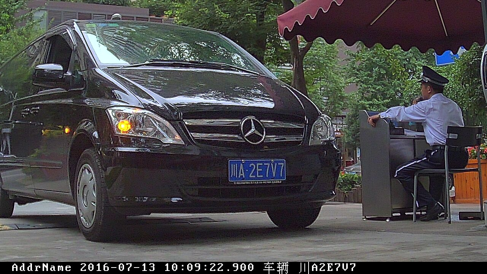
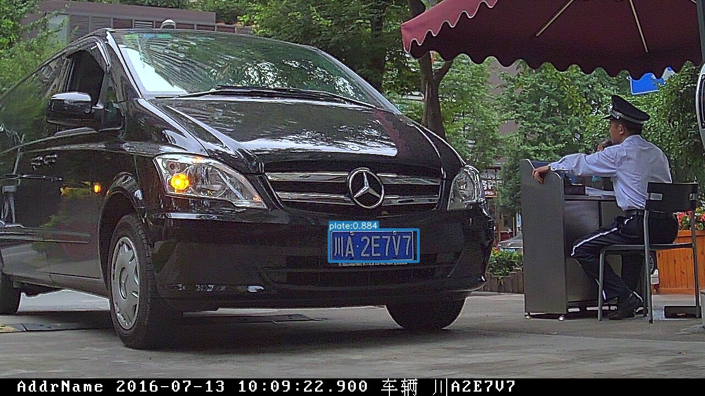
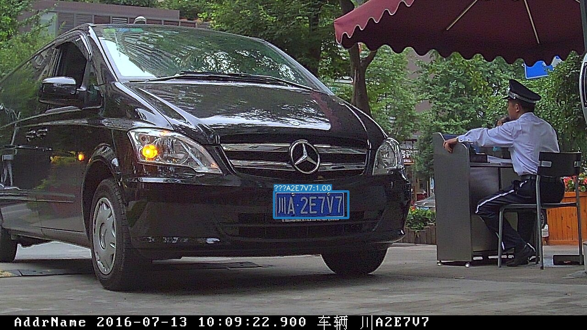

# Plate-axera 部署指南

Plate-axera 用于目标检测。本页说明 M.2 算力卡的接入条件、部署步骤与结果检查方法。本页选择 `AX650/pld_650_npu3.axmodel`。

> 已实测，固定样例已核对。[查看部署效果](#查看部署效果)。

## 准备运行环境

本页包含 **RK3576 DshanPi A1 + AX8850 16GB M.2** 与 **RK3576 DshanPi A1 + AX8850 8GB M.2** 的样例。按效果展示中的权重和容量对应使用，不同环境的结果不能互相替代。

在连接算力卡的 Linux 主机终端执行，RK3576 使用 ARM64 环境。首次部署先完成[驱动与设备检查](../../usage/device-check.md)、[安装 PyAXEngine](../../usage/python.md)和[下载工具安装](../../usage/download-models.md#使用-hugging-face-下载)。已完成这些步骤可直接下载模型。

后文使用设备 0，运行前用 `axcl-smi` 确认设备可用。

## 下载模型与样例

本页使用 `AXERA-TECH/Plate-axera` 的固定版本。下面下载本页选用的 4 个文件。

```bash
MODEL_DIR=~/edgeaccel/models/plate-axera/e528f3e145f0
mkdir -p "$MODEL_DIR"
~/edgeaccel/hf-env/bin/hf download AXERA-TECH/Plate-axera \
  "axmodel_infer_plate_end2end.py" \
  "AX650/pld_650_npu3.axmodel" \
  "AX650/plr_650_npu3.axmodel" \
  "test.jpg" \
  --revision e528f3e145f0ec35e3c2c05a019d8369d6fdef3c \
  --local-dir "$MODEL_DIR"
cd "$MODEL_DIR"
```

保留当前终端中的 `MODEL_DIR` 变量，后续命令沿用此目录。下载受阻或需要离线复制时，见[下载方式与文件校验](../../usage/download-models.md)。

## 配置 Python 后端

激活已安装 PyAXEngine 的主机虚拟环境。先检查可用 provider：

```bash
source ~/edgeaccel/python-env/bin/activate
python -c "import axengine; print(axengine.get_available_providers())"
```

必须包含 `AXCLRTExecutionProvider`。保留已安装的 PyAXEngine，按下面命令安装本例依赖。

在已激活的环境中安装该入口直接使用的依赖；以下依赖用于本页的命令行示例：

```bash
python -m pip install numpy==1.26.4 ml-dtypes==0.5.3 opencv-python-headless==4.11.0.86 matplotlib
```


按本页已核对的修改配置 AXCL 后端。脚本在首次修改前保留 `.upstream` 备份；原表达式不匹配时停止，避免误改其他版本。

```bash
cd "$MODEL_DIR"
python - <<'PY'
from pathlib import Path
edits = [
    {"path": "axmodel_infer_plate_end2end.py", "old": "providers = [\"AxEngineExecutionProvider\"]", "new": "providers = [\"AXCLRTExecutionProvider\"]"}
]
for edit in edits:
    path = Path(edit.get("path", "axmodel_infer_plate_end2end.py"))
    source = path.read_text(encoding="utf-8")
    if edit["old"] not in source:
        assert edit["new"] in source, f"补丁目标不匹配：{path}"
        continue
    backup = path.with_name(path.name + ".upstream")
    if not backup.exists():
        backup.write_text(source, encoding="utf-8")
    path.write_text(source.replace(edit["old"], edit["new"]), encoding="utf-8")
    print(f"已修改 {path}")
PY
```

重新下载原始源码后，需要再次执行此修改。

## 运行模型

在模型根目录执行，输入与权重使用该提交的实际路径：

```bash
cd "$MODEL_DIR"
test -s AX650/pld_650_npu3.axmodel
test -s test.jpg
set -o pipefail
python axmodel_infer_plate_end2end.py --weights_pld AX650/pld_650_npu3.axmodel --weights_plr AX650/plr_650_npu3.axmodel --source test.jpg --save_name plate_end2end_res.jpg 2>&1 | tee run.log
```

日志中的实际执行后端应为 `AXCLRTExecutionProvider`。检查 `plate_end2end_res.jpg` 是本次新生成的文件，内容与输入相符。使用仓库现成结果图或只检查程序退出码均不足以判断效果。

参数依据：[`axmodel_infer_plate_end2end.py` 源码](https://huggingface.co/AXERA-TECH/Plate-axera/blob/e528f3e145f0ec35e3c2c05a019d8369d6fdef3c/axmodel_infer_plate_end2end.py)。

## 运行 NHWC 变体（可选）

默认步骤使用NCHW权重。下列NHWC变体需要配套的输入布局处理，不能只替换模型文件名。

### 准备例程

在RK3576主机激活前文安装的PyAXEngine环境。下载[NHWC视觉运行包](../../../static/examples/vision-nhwc-deployment-20261005.zip)，保存到 `~/edgeaccel`，然后解压：

```bash
source ~/edgeaccel/python-env/bin/activate
python -m zipfile -e ~/edgeaccel/vision-nhwc-deployment-20261005.zip ~/edgeaccel
```

### 下载对应权重和样例

```bash
NHWC_MODELS=~/edgeaccel/models-nhwc
~/edgeaccel/hf-env/bin/hf download AXERA-TECH/Plate-axera \
  --revision e528f3e145f0ec35e3c2c05a019d8369d6fdef3c \
  --include "axmodel_infer_pld.py" "test.jpg" "AX650/pld_650_nhwc_npu3.axmodel" "axmodel_infer_plr.py" "苏A8A68Y.jpg" "AX650/plr_650_nhwc_npu3.axmodel" \
  --local-dir "$NHWC_MODELS/Plate-axera"
```

### 运行并查看输出

```bash
python ~/edgeaccel/vision-nhwc/vision_nhwc.py \
  --models-root "$NHWC_MODELS" --case plate-detection \
  --output ~/edgeaccel/results/plate-detection-nhwc
python ~/edgeaccel/vision-nhwc/vision_nhwc.py \
  --models-root "$NHWC_MODELS" --case plate-recognition \
  --output ~/edgeaccel/results/plate-recognition-nhwc
```

每次使用尚不存在的结果目录。程序应显示 `AXCLRTExecutionProvider`；输出图或终端识别文字应与下方NHWC效果一致。运行包保留固定版本原始前后处理，实际使用的输入布局为NHWC。

`plate-detection` 使用整车图生成 `det_res.jpg`；`plate-recognition` 使用仓库裁剪车牌图，在终端输出识别文字与颜色。本节验证两个独立入口，未将NHWC检测框裁剪结果串接到识别模型。


## 查看部署效果

### NHWC：配套运行包

**固定样例已核对** · RK3576 DshanPi A1 + AX8850 16GB M.2。以下输入与输出来自本页固定版本的实际运行。

2 个 NHWC 权重完成固定样例测试，每个权重独立运行三次，原始输出与效果图一致。下方展示本次输入、输出及样例范围。

**plate-detection · pld_650_nhwc_npu3.axmodel**

车牌检测框覆盖车辆前方蓝牌，显示plate 0.884；此步骤只检测车牌位置，不输出识别文字。

<div className="model-effect-gallery">

<figure>

[](../../../static/validation/effects/plate-axera-nhwc-20261005/inputs/plate-detection.jpg)

<figcaption>输入：test.jpg</figcaption>
</figure>

<figure>

[](../../../static/validation/effects/plate-axera-nhwc-20261005/outputs/plate-detection.jpg)

<figcaption>NHWC实际输出：plate-detection</figcaption>
</figure>

</div>

**plate-recognition · plr_650_nhwc_npu3.axmodel**

独立裁剪蓝牌识别为苏A8A68Y，文字与输入图一致；字符序列分数0.9997，颜色blue、分数1.0000。

<div className="model-effect-gallery">

<figure>

[](../../../static/validation/effects/plate-axera-nhwc-20261005/inputs/plate-recognition.jpg)

<figcaption>输入：苏A8A68Y.jpg</figcaption>
</figure>

</div>

| 识别文字 | 序列分数 | 颜色 | 颜色分数 |
| --- | --- | --- | --- |
| 苏A8A68Y | 0.9997 | blue | 1.0000 |

**使用时注意：**

- 固定官方样例，未覆盖独立数据集精度、视频连续运行或长期稳定性。
- 本次使用16GB算力卡；不替代该NHWC权重在8GB卡上的实测。

这些结果用于对照部署后的输出，未覆盖完整数据集精度或长期连续运行。

### NCHW：原部署入口

**固定样例已核对** · RK3576 DshanPi A1 + AX8850 8GB M.2。以下输入与输出来自本页固定版本的实际运行。

检测和识别两个 AXCL 模型完成单张蓝牌测试；控制台识别为“川A2E7V7”，与原图车牌一致，颜色为 blue。

点击图片可查看原尺寸。

<div className="model-effect-gallery">

<figure>

[](../../../static/validation/effects/plate-axera/inputs/test.jpg)

<figcaption>输入图片</figcaption>
</figure>

<figure>

[](../../../static/validation/effects/plate-axera/outputs/plate_end2end_res.jpg)

<figcaption>实际输出</figcaption>
</figure>

</div>

控制台识别内容：

```text
车牌：川A2E7V7
颜色：blue
识别分数：0.9991
```

结果图中的省份汉字可能显示为问号，以控制台文字核对。

**使用时注意：**

- OpenCV 图上的省份汉字显示为问号，应以控制台 Unicode 文本核对。
- 仅一个清晰蓝牌样本，未覆盖双层牌、新能源牌、模糊和倾斜场景。

这些结果用于对照部署后的输出，未覆盖完整数据集精度或长期连续运行。

**NHWC：配套运行包**

<details>
<summary>查看样例环境与运行耗时</summary>

环境：RK3576 DshanPi A1 + AX8850 16GB M.2。模型版本：`e528f3e145f0ec35e3c2c05a019d8369d6fdef3c`。

| 组件 | 版本或配置 |
| --- | --- |
| 主机系统 / 内核 | Ubuntu 24.04 / Armbian；aarch64；6.1.115-vendor-rk35xx |
| AXCL / 驱动 | V3.16.0_20260729180218 |
| 固件 / CMM | V3.16.0；总量 15232 MiB，空闲占用 18 MiB |
| Python 后端 | AXCLRTExecutionProvider；NumPy 1.26.4；OpenCV 4.11.0 |
| 输入与后处理 | 固定仓库原始样例；保留原始色序和后处理，按模型元数据转换 NHWC 布局 |

| 指标 | 实测值 | 计时或统计范围 |
| --- | --- | --- |
| pld_650_nhwc_npu3.axmodel | 10.908 / 11.168 / 10.965 ms | 三次独立进程各一次session.run墙钟，含传输，不含加载和后处理；非预热平均性能。 |
| plr_650_nhwc_npu3.axmodel | 7.284 / 7.226 / 7.044 ms | 三次独立进程各一次session.run墙钟，含传输，不含加载和后处理；非预热平均性能。 |

适用范围：

- 仅单张蓝牌检测样例；未覆盖双层牌与多车牌。
- 识别输入为仓库单张裁剪图；与上方检测输入不同，不能称为NHWC端到端检测识别链路。
- 字符序列分数不是数据集识别准确率。

</details>

**NCHW：原部署入口**

<details>
<summary>查看样例环境与运行耗时</summary>

环境：RK3576 DshanPi A1 + AX8850 8GB M.2。模型版本：`e528f3e145f0ec35e3c2c05a019d8369d6fdef3c`。

| 组件 | 版本或配置 |
| --- | --- |
| 主机系统 | Ubuntu 24.04 / Armbian 25.11.0-trunk，aarch64 |
| 内核 | 6.1.115-vendor-rk35xx |
| AXCL / 驱动 | V3.16.0_20260729180218 |
| 固件 / CMM | V3.16.0；CMM 总量 7040 MiB，空闲基线占用 18 MiB |
| C++ 视觉示例提交 | cbfa4c76891758983ca2b0c99c11d6621d59af39 |
| Python 后端 | Python 3.12.3；PyAXEngine 0.1.3.rc3 发布的 0.1.3 wheel；NumPy 1.26.4 / ml-dtypes 0.5.3 |
| AX-LLM 提交 | 8501c22b940f8c5804cb35044c5ffc136918b8f1；Release / AXCL / Linux aarch64 |

| 指标 | 实测值 | 计时或统计范围 |
| --- | --- | --- |
| 车牌文本 | 川A2E7V7 | 本次控制台识别，已与输入图片人工核对 |
| 识别分数 | 0.9991 | 该单个样本的模型分数，不是识别准确率 |
| session.run：pld_650_npu3.axmodel | 12.556 ms / 1 次 | 实际 AXCL Python 调用墙钟，含数据复制；不含返回后的张量统计。含首次调用，非统一预热基准；多阶段模型各自计时 |
| session.run：plr_650_npu3.axmodel | 3.324 ms / 1 次 | 实际 AXCL Python 调用墙钟，含数据复制；不含返回后的张量统计。含首次调用，非统一预热基准；多阶段模型各自计时 |

适用范围：

- 运行源码包含显式 AXCL 后端或本页说明的适配修改；result.json 保存逐项替换及修改后 SHA256。

</details>

遇到加载、内存或后端错误时，按[常见问题](../../usage/troubleshooting.md)处理。需要更换输入或接入业务时，按[检查输出与记录结果](../../reference/validation.md)保留自己的结果。

<details>
<summary>查看文件用途与版本信息</summary>

| 文件 / 目录内路径 | 用途 |
| --- | --- |
| [`axmodel_infer_plate_end2end.py`](https://huggingface.co/AXERA-TECH/Plate-axera/blob/e528f3e145f0ec35e3c2c05a019d8369d6fdef3c/axmodel_infer_plate_end2end.py) | Python 程序 / 前后处理 |
| [`AX650/pld_650_npu3.axmodel`](https://huggingface.co/AXERA-TECH/Plate-axera/blob/e528f3e145f0ec35e3c2c05a019d8369d6fdef3c/AX650/pld_650_npu3.axmodel) | 编译模型；按目录区分芯片和规格 |
| [`AX650/plr_650_npu3.axmodel`](https://huggingface.co/AXERA-TECH/Plate-axera/blob/e528f3e145f0ec35e3c2c05a019d8369d6fdef3c/AX650/plr_650_npu3.axmodel) | 编译模型；按目录区分芯片和规格 |
| [`test.jpg`](https://huggingface.co/AXERA-TECH/Plate-axera/blob/e528f3e145f0ec35e3c2c05a019d8369d6fdef3c/test.jpg) | 示例输入 |

仓库提交：`e528f3e145f0ec35e3c2c05a019d8369d6fdef3c`。仓库中的 4 个 `.axmodel` 文件可能包括多个芯片、规格和分片。运行时使用本页指定的配套文件，完整列表见[固定版本目录](https://huggingface.co/AXERA-TECH/Plate-axera/tree/e528f3e145f0ec35e3c2c05a019d8369d6fdef3c)。

</details>

<details>
<summary>补充说明与版本差异</summary>

- 车牌检测、裁剪和字符识别分开验证，再检查端到端输出。保存字符字典及车牌方向处理配置。
- 输出图的 OpenCV ASCII 绘字不能正确显示中文车牌，正确性以终端 Rec---Plate 文本与原图逐字对照。
- 上游仅在有识别结果时写图，无文件不能计为通过。

</details>

## 参考资料

- [常用术语](../../reference/glossary.md)：AXCL、CMM、分词器与推理指标。
- [固定版本文件表](https://huggingface.co/AXERA-TECH/Plate-axera/tree/e528f3e145f0ec35e3c2c05a019d8369d6fdef3c)。
- [模型卡 / 使用说明](https://huggingface.co/AXERA-TECH/Plate-axera/blob/e528f3e145f0ec35e3c2c05a019d8369d6fdef3c/README.md)。
- [主要程序入口：axmodel_infer_plate_end2end.py](https://huggingface.co/AXERA-TECH/Plate-axera/blob/e528f3e145f0ec35e3c2c05a019d8369d6fdef3c/axmodel_infer_plate_end2end.py)。
- [ModelScope 对应资源](https://modelscope.cn/models/AXERA-TECH/Plate-axera)。不同平台的 revision 不通用，另行记录版本。

返回[完整模型目录](../catalog.mdx)。
