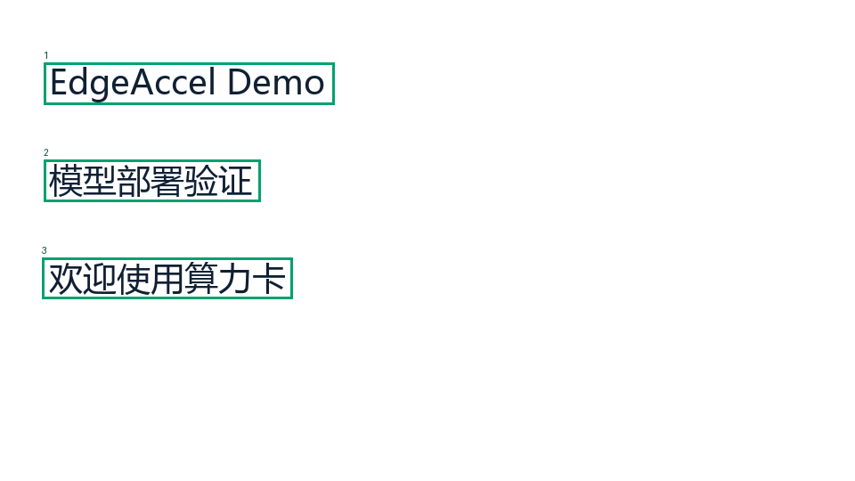
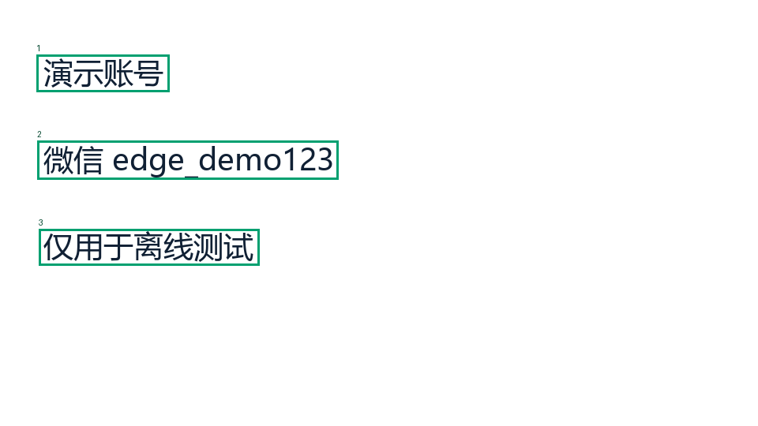
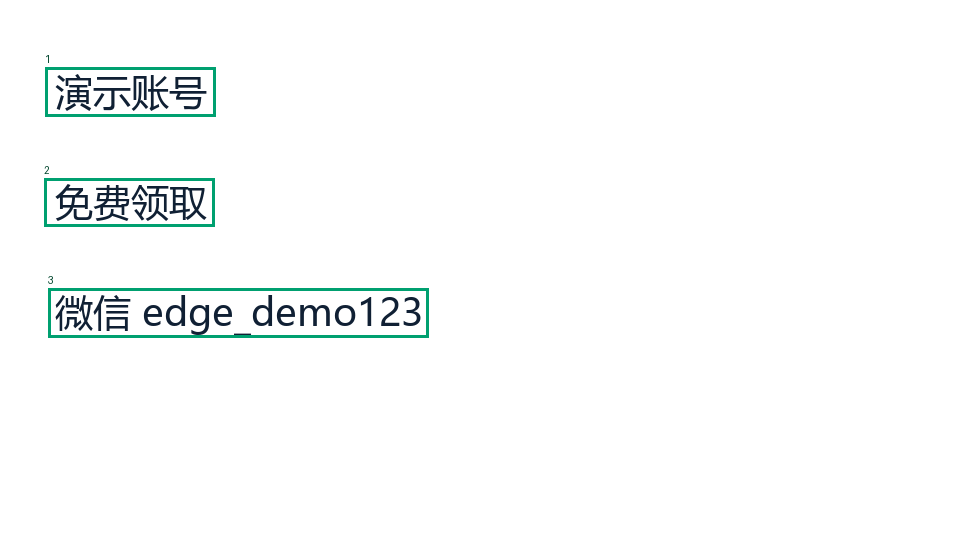
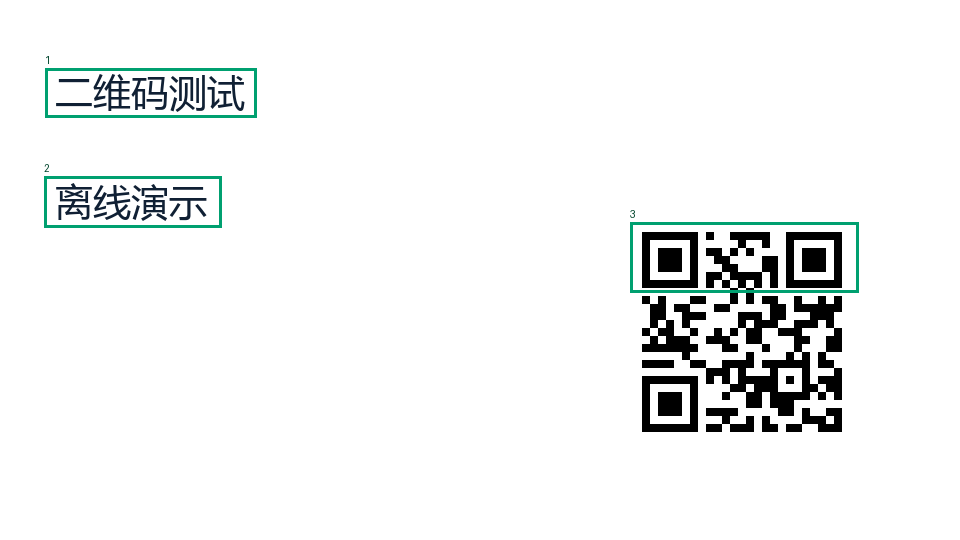
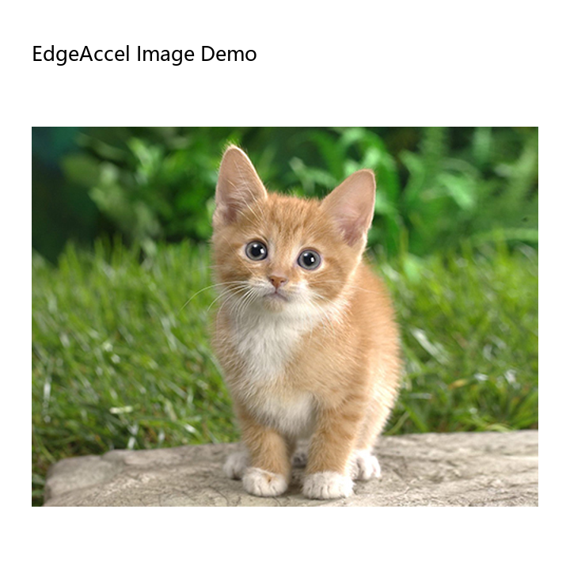
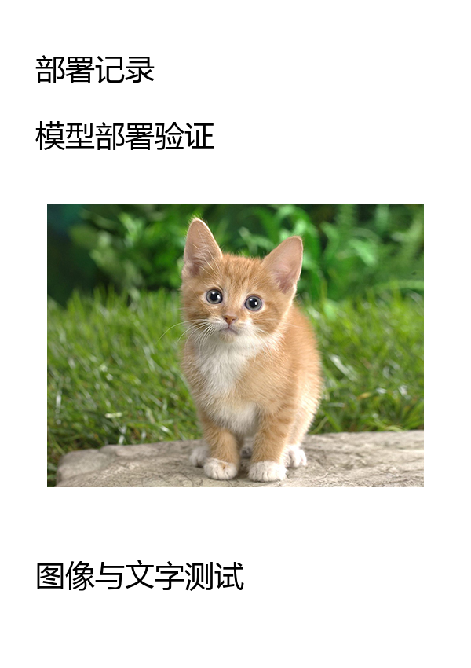
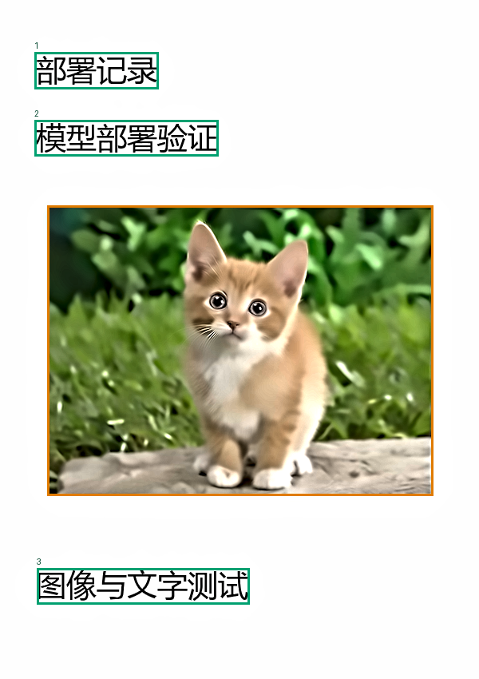

# pp-nsfw_Inspector 部署指南

pp-nsfw_Inspector 用于图像内容分类。本页说明 M.2 算力卡的接入条件、部署步骤与结果检查方法。

> 已实测，效果仍需评估。[查看部署效果](#查看部署效果)。

## 准备运行环境

本页效果展示使用 **RK3576 + AX8850 16GB M.2**；其他容量或平台需重新确认模型能否加载并正确运行。

在连接算力卡的 Linux 主机终端执行，RK3576 使用 ARM64 环境。首次部署先完成[驱动与设备检查](../../usage/device-check.md)、[安装 PyAXEngine](../../usage/python.md)和[下载工具安装](../../usage/download-models.md#使用-hugging-face-下载)。已完成这些步骤可直接下载模型。

后文使用设备 0，运行前用 `axcl-smi` 确认设备可用。

## 下载模型与样例

本页使用 `AXERA-TECH/pp-nsfw_Inspector` 的固定版本。下面下载本页选用的 34 个文件。

```bash
MODEL_DIR=~/edgeaccel/models/pp-nsfw-inspector/e7e143272e4f
mkdir -p "$MODEL_DIR"
~/edgeaccel/hf-env/bin/hf download AXERA-TECH/pp-nsfw_Inspector \
  --include "axmodel/*" "src/*" "AGENTS.md" "README.md" "README-ZH.md" "config.json" "requirements.txt" \
  --revision e7e143272e4f9e95d97849bac58c5c67629efed1 \
  --local-dir "$MODEL_DIR"
cd "$MODEL_DIR"
```

保留当前终端中的 `MODEL_DIR` 变量，后续命令沿用此目录。下载受阻或需要离线复制时，见[下载方式与文件校验](../../usage/download-models.md)。

## 安装图像处理依赖

本页使用 RK3576 主机和 AX8850 16GB M.2 算力卡，运行 OCR、版面分析、图像分类和规则决策。五个 `.axmodel` 均使用 AXCL；二维码解析、文本规则和图像处理在主机 CPU 上执行。

保留上方下载得到的 `$MODEL_DIR`，在 RK3576 主机执行：

```bash
sudo apt-get install -y libzbar0 unzip
source ~/edgeaccel/python-env/bin/activate
python -m pip install 'numpy==1.26.4' 'opencv-python-headless==4.11.0.86' \
  'Pillow==11.3.0' 'pyzbar==0.1.9' 'pyahocorasick==2.3.1' 'google-re2==1.1.20251105' \
  'opencc-python-reimplemented==0.1.7' 'pyclipper==1.4.0'
python -c "import axengine; print(axengine.get_available_providers())"
```

输出须包含 `AXCLRTExecutionProvider`。本例无需安装 Flask，也不要同时安装 `opencv-python` 和 `opencv-python-headless`。

## 检查配套文件

| 文件 | 用途 |
| --- | --- |
| `axmodel/ppocrv5/det_npu1.axmodel` | 检测文字区域 |
| `axmodel/ppocrv5/cls_npu1.axmodel` | 判断文字方向 |
| `axmodel/ppocrv5/rec_npu1.axmodel` | 识别文字 |
| `axmodel/ppstructurev3/ppstructure_npu1.axmodel` | 分析图文版面 |
| `axmodel/nsfw/nsfw_npu1.axmodel` | 输出图像内容分类分数 |
| `src/perception/dict/ppocrv5_dict.txt` | OCR 字典 |
| `src/understanding/keywords/` | 关键词规则 |
| `src/understanding/blacklists/` | 二维码域名规则 |

保留全部 `src/` 目录和字典、规则文件。当前固定版本实际提供上述五个 NPU1 权重；运行示例会核对文件版本与校验值。

## 运行八组示例

下载 [图像审核算力卡示例包](../../../static/examples/inspector-card-example.zip)，保存到 `~/edgeaccel/` 后执行：

```bash
mkdir -p ~/edgeaccel/inspector-example
unzip ~/edgeaccel/inspector-card-example.zip -d ~/edgeaccel/inspector-example
python ~/edgeaccel/inspector-example/inspector_card.py \
  --model-dir "$MODEL_DIR" \
  --inputs ~/edgeaccel/inspector-example/inputs \
  --output ~/edgeaccel/results/inspector-01
```

输出目录须尚不存在。八组输入包含普通文字、虚构联系账号、营销组合、离线二维码、图文版面、竖版文档、空白图和重复输入。

`deployment-result.json` 中 `completed` 为 `true` 表示所有样例完成。每组记录包含原图、预处理图、文字框、OCR 文本、图像分类分数、规则命中和最终决策。绿色框标记 OCR 区域，橙色框标记版面中的图片区域；框上的序号对应文字块顺序。

| 决策 | 含义 |
| --- | --- |
| `PASS` | 本次规则和阈值没有触发复核或拒绝条件 |
| `REVIEW` | 需要人工复核，例如联系信息、未知二维码或缺少预期文字 |
| `REJECT` | 命中较强规则或图像分类拒绝阈值 |

决策是模型信号与规则的组合，不是某一个模型的“正确率”。最终 `score` 也不是通过概率；规则触发拒绝时，该字段仍可能为 0。

## 检查自己的图片

```bash
python ~/edgeaccel/inspector-example/inspector_card.py \
  --model-dir "$MODEL_DIR" \
  --inputs ~/edgeaccel/inspector-example/inputs \
  --image ~/Pictures/example.png \
  --output ~/edgeaccel/results/inspector-custom-01
```

打开结果目录中的 `overlay.png` 结尾文件，并对照 JSON 中的实际文字和决策理由。竖版文档采用 0.5°～15° 的小角度矫正；超过该范围时保留原图，必要时先手动调整方向。

本例按串行方式调用算力卡，二维码保留离线解析和域名规则，不访问二维码中的网址，也不展开短链接。需要接入联网审核服务时，应另行验证跳转、域名规则和并发行为。

## 查看结果和耗时

下方展示本次算力卡生成的文字框、实际识别文本与决策。OCR 可能出现多余字符或大小写混淆，应结合原图查看。

流程耗时包含预处理、延迟加载模型、CPU 规则、设备调用、原始张量保存和结果绘制；首次调用还包含模型初始化。AXCL 时间仅累计网络的 Python `run` 调用，不代表整张图片的处理时间或服务吞吐。

本次使用普通图片和合成规则样例，未验收 NSFW 类别的召回率、误报率或完整审核规则覆盖，也未进行长期运行和实际 8GB 卡回归。


## 查看部署效果

**已运行，效果仍需评估** · 2026-09-28 · RK3576 + AX8850 16GB M.2。以下输入与输出来自本页固定版本的实际运行。

五个AXCL网络完成八组图像输入，展示实际OCR、版面框、二维码解码及PASS / REVIEW / REJECT决策。

**比较普通文字、联系信息与营销组合**

三张合成图片分别得到 PASS、REVIEW 和 REJECT。联系账号 edge_demo123 是虚构测试内容；添加“免费领取”后，实际 OCR 文本触发了联系信息与营销组合规则。绿色框是本次检测到的文字，序号对应文字块顺序。

<div className="model-effect-gallery">

<figure>

[](../../../static/validation/effects/pp-nsfw-inspector-20260928/normal-result.png)

<figcaption>normal 实际文字框与图片区域</figcaption>
</figure>

<figure>

[](../../../static/validation/effects/pp-nsfw-inspector-20260928/contact-only-result.png)

<figcaption>contact-only 实际文字框与图片区域</figcaption>
</figure>

<figure>

[](../../../static/validation/effects/pp-nsfw-inspector-20260928/contact-marketing-result.png)

<figcaption>contact-marketing 实际文字框与图片区域</figcaption>
</figure>

</div>

| 输入 | 实际OCR文本 | 决策 | 主要理由 |
| --- | --- | --- | --- |
| normal | EdgeAccel Demo \| 模型部署验证- \| 欢迎使用算力卡 | PASS | 无触发条件 |
| contact-only | 演示账号- \| 微信 edge_demo123 \| 仅用于离线测试 | REVIEW | rule_weak |
| contact-marketing | 演示账号 \| 免费领取- \| 微信 edge_demo123 | REJECT | rule_strong |

**解析离线二维码**

二维码实际解码为 EDGEACCEL-DEMO，按仓库规则进入 REVIEW。此内容不是网址，未发生网络访问。OCR 还把二维码中的图案识别为“□回”，因此应分别查看二维码解码值与 OCR 文字，不能混用。

<div className="model-effect-gallery">

<figure>

[](../../../static/validation/effects/pp-nsfw-inspector-20260928/qr-offline-result.png)

<figcaption>qr-offline 实际文字框与图片区域</figcaption>
</figure>

</div>

| 项目 | 本次结果 |
| --- | --- |
| 二维码实际内容 | EDGEACCEL-DEMO |
| 决策与理由 | REVIEW / qr_unknown |
| 实际OCR文本 | 二维码测试- \| 离线演示 \| □回 |

**查看图文版面与竖版文档**

两组图文输入执行了版面分析和图片区域分类。橙色框为模型检测到的图片区域，绿色框为整理后的文字区域。竖版样例保留直立方向，本次矫正角度为0°；普通图文样例中的 Image 被识别成 lmage，实际输出保留如下。

<div className="model-effect-gallery">

<figure>

[](../../../static/validation/effects/pp-nsfw-inspector-20260928/photo-layout-input.png)

<figcaption>photo-layout 原图</figcaption>
</figure>

<figure>

[](../../../static/validation/effects/pp-nsfw-inspector-20260928/photo-layout-result.png)

<figcaption>photo-layout 实际文字框与图片区域</figcaption>
</figure>

<figure>

[](../../../static/validation/effects/pp-nsfw-inspector-20260928/document-layout-input.png)

<figcaption>document-layout 原图</figcaption>
</figure>

<figure>

[](../../../static/validation/effects/pp-nsfw-inspector-20260928/document-layout-result.png)

<figcaption>document-layout 实际文字框与图片区域</figcaption>
</figure>

</div>

| 输入 | 实际OCR文本 | 图片区域数 | 决策 |
| --- | --- | --- | --- |
| photo-layout | EdgeAccel lmage Demo | 1 | PASS |
| document-layout | 部署记录 \| 模型部署验证 \| 图像与文字测试 | 1 | PASS |

**检查空白图与重复输入**

空白截图没有检测到文字，进入 REVIEW，理由为缺少预期文字。在其他输入之后重复普通文字图，所有网络输入输出校验值一致。以上检查确认运行与重复性，不等同于审核准确率或长期稳定性。

<div className="model-effect-gallery">

<figure>

[](../../../static/validation/effects/pp-nsfw-inspector-20260928/blank-result.png)

<figcaption>blank 实际文字框与图片区域</figcaption>
</figure>

</div>

| 项目 | 本次结果 |
| --- | --- |
| 空白图 | 0个文字块，REVIEW / ocr_missing_expected_text |
| 重复输入 | 全部网络输入输出完全一致 |
| 可见OCR差异 | 部分文字末尾多出“-”，Image出现I/l混淆 |

**比较实际调用与耗时**

八组输入共执行90次AXCL调用。图像分类分数是整图及图片区域中的最大值；最终决策还使用 OCR、二维码和文字规则。流程时间含预处理、延迟加载模型、证据保存和绘图，首次调用包含模型初始化；不能用 AXCL 时间代替整图处理时间。

| 输入 | AXCL调用 | AXCL合计 / ms | 含证据保存流程 / s | 图像分类分数 |
| --- | --- | --- | --- | --- |
| normal | 8 | 225.844 | 4.174 | 0.000404 |
| contact-only | 8 | 200.076 | 1.186 | 0.000727 |
| contact-marketing | 10 | 232.376 | 1.394 | 0.000876 |
| qr-offline | 10 | 251.002 | 1.539 | 0.009762 |
| photo-layout | 26 | 485.862 | 6.917 | 0.000150 |
| document-layout | 18 | 378.231 | 6.841 | 0.000139 |
| blank | 2 | 152.889 | 0.828 | 0.165387 |
| normal-repeat | 8 | 225.175 | 1.437 | 0.000404 |

**使用时注意：**

- 本次未使用NSFW阳性评估集，未验收分类召回率、误报率、完整关键词规则或域名规则覆盖。
- OCR存在多余字符和I/l混淆；仅计基础部署通过，不能把PASS理解为内容审核无误。

这些结果用于对照部署后的输出，未覆盖完整数据集精度或长期连续运行。

<details>
<summary>查看样例环境与运行耗时</summary>

环境：RK3576 + AX8850 16GB M.2。日期：2026-09-28。模型版本：`e7e143272e4f9e95d97849bac58c5c67629efed1`。

| 组件 | 版本或配置 |
| --- | --- |
| 主机 / 内核 | RK3576，约 4GB RAM，6.1.115-vendor-rk35xx |
| AXCL / 驱动 | V3.16.0_20260729180218 |
| 固件 / CMM | V3.16.0 / 15232 MiB |
| Python 推理 | Python 3.12 / PyAXEngine 0.1.3.rc3 / NumPy 1.26.4 / AXCLRTExecutionProvider |

| 指标 | 实测值 | 计时或统计范围 |
| --- | --- | --- |
| 实际输入 | 8组 | 普通文字、联系规则、二维码、图文版面、空白和重复输入。 |
| 算力卡调用 | 90次 | OCR det/cls/rec、DocLayout与NSFW五个固定NPU1权重均执行。 |
| 重复结果 | 一致 | 普通文字图重复运行，全部网络输入输出校验值相同。 |

适用范围：

- 本次未使用NSFW阳性评估集，未验收分类召回率、误报率、完整关键词规则或域名规则覆盖。
- OCR存在多余字符和I/l混淆；仅计基础部署通过，不能把PASS理解为内容审核无误。
- 二维码为离线模式；短链跳转、并发、长图切片、其他平台和实际8GB卡仍需单独验证。

</details>

遇到加载、内存或后端错误时，按[常见问题](../../usage/troubleshooting.md)处理。需要更换输入或接入业务时，按[检查输出与记录结果](../../reference/validation.md)保留自己的结果。

<details>
<summary>查看文件用途与版本信息</summary>

| 文件 / 目录内路径 | 用途 |
| --- | --- |
| [`app.py`](https://huggingface.co/AXERA-TECH/pp-nsfw_Inspector/blob/e7e143272e4f9e95d97849bac58c5c67629efed1/app.py) | Python 程序 / 前后处理 |
| [`test.py`](https://huggingface.co/AXERA-TECH/pp-nsfw_Inspector/blob/e7e143272e4f9e95d97849bac58c5c67629efed1/test.py) | Python 程序 / 前后处理 |
| [`axmodel/nsfw/nsfw_npu1.axmodel`](https://huggingface.co/AXERA-TECH/pp-nsfw_Inspector/blob/e7e143272e4f9e95d97849bac58c5c67629efed1/axmodel/nsfw/nsfw_npu1.axmodel) | 编译模型；按目录区分芯片和规格 |
| [`axmodel/ppocrv5/cls_npu1.axmodel`](https://huggingface.co/AXERA-TECH/pp-nsfw_Inspector/blob/e7e143272e4f9e95d97849bac58c5c67629efed1/axmodel/ppocrv5/cls_npu1.axmodel) | 编译模型；按目录区分芯片和规格 |
| [`axmodel/ppocrv5/det_npu1.axmodel`](https://huggingface.co/AXERA-TECH/pp-nsfw_Inspector/blob/e7e143272e4f9e95d97849bac58c5c67629efed1/axmodel/ppocrv5/det_npu1.axmodel) | 编译模型；按目录区分芯片和规格 |
| [`axmodel/ppocrv5/rec_npu1.axmodel`](https://huggingface.co/AXERA-TECH/pp-nsfw_Inspector/blob/e7e143272e4f9e95d97849bac58c5c67629efed1/axmodel/ppocrv5/rec_npu1.axmodel) | 编译模型；按目录区分芯片和规格 |
| [`axmodel/ppstructurev3/ppstructure_npu1.axmodel`](https://huggingface.co/AXERA-TECH/pp-nsfw_Inspector/blob/e7e143272e4f9e95d97849bac58c5c67629efed1/axmodel/ppstructurev3/ppstructure_npu1.axmodel) | 编译模型；按目录区分芯片和规格 |
| [`config.json`](https://huggingface.co/AXERA-TECH/pp-nsfw_Inspector/blob/e7e143272e4f9e95d97849bac58c5c67629efed1/config.json) | 运行配置 |
| [`images/test.jpg`](https://huggingface.co/AXERA-TECH/pp-nsfw_Inspector/blob/e7e143272e4f9e95d97849bac58c5c67629efed1/images/test.jpg) | 示例输入 |
| [`requirements.txt`](https://huggingface.co/AXERA-TECH/pp-nsfw_Inspector/blob/e7e143272e4f9e95d97849bac58c5c67629efed1/requirements.txt) | Python 依赖清单 |
| [`tools/nsfw-config.json`](https://huggingface.co/AXERA-TECH/pp-nsfw_Inspector/blob/e7e143272e4f9e95d97849bac58c5c67629efed1/tools/nsfw-config.json) | 运行配置 |
| [`tools/ppstructurev3-config.json`](https://huggingface.co/AXERA-TECH/pp-nsfw_Inspector/blob/e7e143272e4f9e95d97849bac58c5c67629efed1/tools/ppstructurev3-config.json) | 运行配置 |

仓库提交：`e7e143272e4f9e95d97849bac58c5c67629efed1`。仓库中的 5 个 `.axmodel` 文件可能包括多个芯片、规格和分片。运行时使用本页指定的配套文件，完整列表见[固定版本目录](https://huggingface.co/AXERA-TECH/pp-nsfw_Inspector/tree/e7e143272e4f9e95d97849bac58c5c67629efed1)。

</details>

<details>
<summary>补充说明与版本差异</summary>

- 输出内容分类分数。需用有标注的样本校准业务阈值，模型分数不能直接解释为确定结论。

</details>

## 参考资料

- [常用术语](../../reference/glossary.md)：AXCL、CMM、分词器与推理指标。
- [固定版本文件表](https://huggingface.co/AXERA-TECH/pp-nsfw_Inspector/tree/e7e143272e4f9e95d97849bac58c5c67629efed1)。
- [模型卡 / 使用说明](https://huggingface.co/AXERA-TECH/pp-nsfw_Inspector/blob/e7e143272e4f9e95d97849bac58c5c67629efed1/README.md)。
- [主要程序入口：app.py](https://huggingface.co/AXERA-TECH/pp-nsfw_Inspector/blob/e7e143272e4f9e95d97849bac58c5c67629efed1/app.py)。

返回[完整模型目录](../catalog.mdx)。
