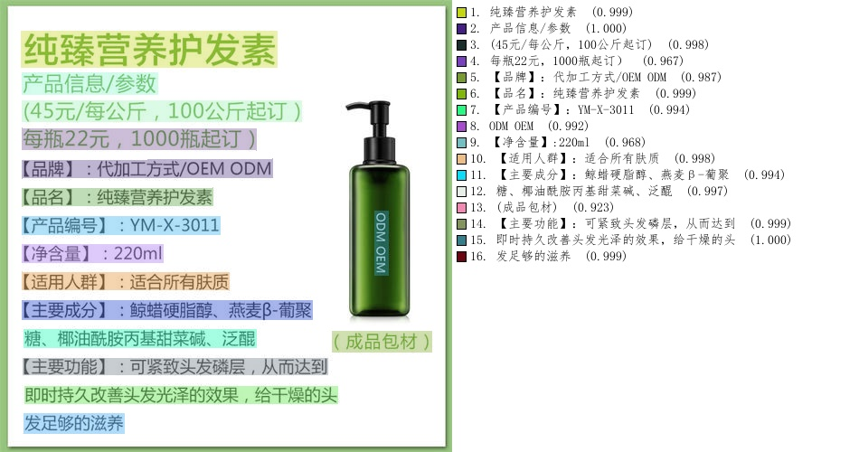

# PPOCR_v6 部署指南

PPOCR_v6 用于文字检测与识别。本页说明 M.2 算力卡的接入条件、部署步骤与结果检查方法。本页选择 `axmodel/ax650/det_npu1.axmodel`。

> 已实测，固定样例已核对。[查看部署效果](#查看部署效果)。

## 准备运行环境

本页效果展示使用 **RK3576 DshanPi A1 + AX8850 8GB M.2**；其他容量或平台需重新确认模型能否加载并正确运行。

在连接算力卡的 Linux 主机终端执行，RK3576 使用 ARM64 环境。首次部署先完成[驱动与设备检查](../../usage/device-check.md)、[安装 PyAXEngine](../../usage/python.md)和[下载工具安装](../../usage/download-models.md#使用-hugging-face-下载)。已完成这些步骤可直接下载模型。

后文使用设备 0，运行前用 `axcl-smi` 确认设备可用。

## 下载模型与样例

本页使用 `AXERA-TECH/PPOCR_v6` 的固定版本。下面下载本页选用的 7 个文件。

```bash
MODEL_DIR=~/edgeaccel/models/ppocr-v6/932f227f22b4
mkdir -p "$MODEL_DIR"
~/edgeaccel/hf-env/bin/hf download AXERA-TECH/PPOCR_v6 \
  "ppocrv6_ax.py" \
  "axmodel/ax650/det_npu1.axmodel" \
  "11.jpg" \
  "axmodel/ax650/rec_npu1.axmodel" \
  "axmodel/ax650/cls_npu1.axmodel" \
  "onnx/rec_inference.yml" \
  "fonts/simfang.ttf" \
  --revision 932f227f22b4f838d2cff2b54161aafe30d77a80 \
  --local-dir "$MODEL_DIR"
cd "$MODEL_DIR"
```

保留当前终端中的 `MODEL_DIR` 变量，后续命令沿用此目录。下载受阻或需要离线复制时，见[下载方式与文件校验](../../usage/download-models.md)。

## 配置 Python 后端

激活已安装 PyAXEngine 的主机虚拟环境。先检查可用 provider：

```bash
source ~/edgeaccel/python-env/bin/activate
python -c "import axengine; print(axengine.get_available_providers())"
```

必须包含 `AXCLRTExecutionProvider`。保留已安装的 PyAXEngine，按下面命令安装本例依赖。

在已激活的环境中安装该入口直接使用的依赖；以下依赖用于本页的命令行示例：

```bash
python -m pip install Pillow PyYAML numpy==1.26.4 ml-dtypes==0.5.3 opencv-python-headless==4.11.0.86 pyclipper shapely
```


按本页已核对的修改配置 AXCL 后端。脚本在首次修改前保留 `.upstream` 备份；原表达式不匹配时停止，避免误改其他版本。

```bash
cd "$MODEL_DIR"
python - <<'PY'
from pathlib import Path
edits = [
    {"path": "ppocrv6_ax.py", "old": "ort.InferenceSession(det_onnx)", "new": "ort.InferenceSession(det_onnx, providers=[\"AXCLRTExecutionProvider\"])"},
    {"path": "ppocrv6_ax.py", "old": "ort.InferenceSession(rec_onnx)", "new": "ort.InferenceSession(rec_onnx, providers=[\"AXCLRTExecutionProvider\"])"},
    {"path": "ppocrv6_ax.py", "old": "ort.InferenceSession(cls_onnx)", "new": "ort.InferenceSession(cls_onnx, providers=[\"AXCLRTExecutionProvider\"])"}
]
for edit in edits:
    path = Path(edit.get("path", "ppocrv6_ax.py"))
    source = path.read_text(encoding="utf-8")
    if edit["old"] not in source:
        assert edit["new"] in source, f"补丁目标不匹配：{path}"
        continue
    backup = path.with_name(path.name + ".upstream")
    if not backup.exists():
        backup.write_text(source, encoding="utf-8")
    path.write_text(source.replace(edit["old"], edit["new"]), encoding="utf-8")
    print(f"已修改 {path}")
PY
```

重新下载原始源码后，需要再次执行此修改。

## 运行模型

在模型根目录执行，输入与权重使用该提交的实际路径：

```bash
cd "$MODEL_DIR"
test -s axmodel/ax650/det_npu1.axmodel
test -s 11.jpg
set -o pipefail
python ppocrv6_ax.py --det_onnx axmodel/ax650/det_npu1.axmodel --rec_onnx axmodel/ax650/rec_npu1.axmodel --cls_onnx axmodel/ax650/cls_npu1.axmodel --char_dict onnx/rec_inference.yml --use_angle_cls --visualize --image 11.jpg --json result.json 2>&1 | tee run.log
```

日志中的实际执行后端应为 `AXCLRTExecutionProvider`。检查 `res-ax.jpg` 是本次新生成的文件，内容与输入相符。使用仓库现成结果图或只检查程序退出码均不足以判断效果。

参数依据：[`ppocrv6_ax.py` 源码](https://huggingface.co/AXERA-TECH/PPOCR_v6/blob/932f227f22b4f838d2cff2b54161aafe30d77a80/ppocrv6_ax.py)。

## 查看部署效果

**固定样例已核对** · 2026-09-23 · RK3576 DshanPi A1 + AX8850 8GB M.2。以下输入与输出来自本页固定版本的实际运行。

对同一护发素商品图人工核对，result.json 与标注图均包含 16 个文本区域；标题、产品编号“YM-X-3011”、净含量“220ml”和主要说明与原图基本一致，品牌行保留 OEM ODM 间空格，瓶身竖排文字输出 ODM OEM。

点击图片可查看原尺寸。

<div className="model-effect-gallery">

<figure>

[](../../../static/validation/effects/ppocr-v6/inputs/11.jpg)

<figcaption>输入图片</figcaption>
</figure>

<figure>

[](../../../static/validation/effects/ppocr-v6/outputs/res-ax.jpg)

<figcaption>实际输出</figcaption>
</figure>

</div>

识别内容节选：

```text
纯臻营养护发素
YM-X-3011
220ml
```

**使用时注意：**

- correctness 仅限这张固定图主要字词的人工对照；未计算全文 CER/WER，也不能据此宣称整体优于 v5。
- 净含量行的冒号、价格行括号等标点与原图存在全半角差异，排版空格不保证逐字符保留。

这些结果用于对照部署后的输出，未覆盖完整数据集精度或长期连续运行。

<details>
<summary>查看样例环境与运行耗时</summary>

环境：RK3576 DshanPi A1 + AX8850 8GB M.2。日期：2026-09-23。模型版本：`932f227f22b4f838d2cff2b54161aafe30d77a80`。

| 组件 | 版本或配置 |
| --- | --- |
| 主机系统 | Ubuntu 24.04 / Armbian 25.11.0-trunk，aarch64 |
| 内核 | 6.1.115-vendor-rk35xx |
| AXCL / 驱动 | V3.16.0_20260729180218 |
| 固件 / CMM | V3.16.0；CMM 总量 7040 MiB，空闲基线占用 18 MiB |
| C++ 视觉示例提交 | cbfa4c76891758983ca2b0c99c11d6621d59af39 |
| Python 后端 | Python 3.12.3；PyAXEngine 0.1.3.rc3 发布的 0.1.3 wheel；NumPy 1.26.4 / ml-dtypes 0.5.3 |
| AX-LLM 提交 | 8501c22b940f8c5804cb35044c5ffc136918b8f1；Release / AXCL / Linux aarch64 |

| 指标 | 实测值 | 计时或统计范围 |
| --- | --- | --- |
| 检出并识别的文本区域 | 16 | outputs/result.json 数组长度；已对照输入图与 res-ax.jpg |
| 检测 session.run 时延 | 143.35 | 毫秒；1 次主机墙钟，包含 AXCL 调用及复制，排除张量统计 |
| 文本识别平均 session.run 时延 | 17.56 | 毫秒/裁剪；同图 16 次识别调用的算术平均，包含 AXCL 调用及复制 |
| 方向分类平均 session.run 时延 | 2.25 | 毫秒/裁剪；同图 16 次分类调用的算术平均，包含 AXCL 调用及复制 |
| 输入图片尺寸 | 500×500 | 实际 11.jpg 文件头；可视化输出 res-ax.jpg 为 950×500 拼图 |
| session.run：det_npu1.axmodel | 143.350 ms / 1 次 | 实际 AXCL Python 调用墙钟，含数据复制；不含返回后的张量统计。含首次调用，非统一预热基准；多阶段模型各自计时 |
| session.run：rec_npu1.axmodel | 17.561 ms / 16 次 | 实际 AXCL Python 调用墙钟，含数据复制；不含返回后的张量统计。含首次调用，非统一预热基准；多阶段模型各自计时 |
| session.run：cls_npu1.axmodel | 2.252 ms / 16 次 | 实际 AXCL Python 调用墙钟，含数据复制；不含返回后的张量统计。含首次调用，非统一预热基准；多阶段模型各自计时 |

适用范围：

- correctness 仅限这张固定图主要字词的人工对照；未计算全文 CER/WER，也不能据此宣称整体优于 v5。
- 净含量行的冒号、价格行括号等标点与原图存在全半角差异，排版空格不保证逐字符保留。
- v6 本次使用 npu1，v5 使用 npu3；时延不能直接当作同条件版本性能比较。
- run.log 记录 rec/cls 编译版本含 dirty 标记，应原样保留实际编译版本；不能把置信度当成准确率。
- 运行源码包含显式 AXCL 后端或本页说明的适配修改；result.json 保存逐项替换及修改后 SHA256。

</details>

遇到加载、内存或后端错误时，按[常见问题](../../usage/troubleshooting.md)处理。需要更换输入或接入业务时，按[检查输出与记录结果](../../reference/validation.md)保留自己的结果。

<details>
<summary>查看文件用途与版本信息</summary>

| 文件 / 目录内路径 | 用途 |
| --- | --- |
| [`ppocrv6_ax.py`](https://huggingface.co/AXERA-TECH/PPOCR_v6/blob/932f227f22b4f838d2cff2b54161aafe30d77a80/ppocrv6_ax.py) | Python 程序 / 前后处理 |
| [`axmodel/ax650/det_npu1.axmodel`](https://huggingface.co/AXERA-TECH/PPOCR_v6/blob/932f227f22b4f838d2cff2b54161aafe30d77a80/axmodel/ax650/det_npu1.axmodel) | 编译模型；按目录区分芯片和规格 |
| [`11.jpg`](https://huggingface.co/AXERA-TECH/PPOCR_v6/blob/932f227f22b4f838d2cff2b54161aafe30d77a80/11.jpg) | 示例输入 |
| [`axmodel/ax650/rec_npu1.axmodel`](https://huggingface.co/AXERA-TECH/PPOCR_v6/blob/932f227f22b4f838d2cff2b54161aafe30d77a80/axmodel/ax650/rec_npu1.axmodel) | 编译模型；按目录区分芯片和规格 |
| [`axmodel/ax650/cls_npu1.axmodel`](https://huggingface.co/AXERA-TECH/PPOCR_v6/blob/932f227f22b4f838d2cff2b54161aafe30d77a80/axmodel/ax650/cls_npu1.axmodel) | 编译模型；按目录区分芯片和规格 |
| [`onnx/rec_inference.yml`](https://huggingface.co/AXERA-TECH/PPOCR_v6/blob/932f227f22b4f838d2cff2b54161aafe30d77a80/onnx/rec_inference.yml) | 配套资源 |
| [`fonts/simfang.ttf`](https://huggingface.co/AXERA-TECH/PPOCR_v6/blob/932f227f22b4f838d2cff2b54161aafe30d77a80/fonts/simfang.ttf) | 配套资源 |

仓库提交：`932f227f22b4f838d2cff2b54161aafe30d77a80`。仓库中的 21 个 `.axmodel` 文件可能包括多个芯片、规格和分片。运行时使用本页指定的配套文件，完整列表见[固定版本目录](https://huggingface.co/AXERA-TECH/PPOCR_v6/tree/932f227f22b4f838d2cff2b54161aafe30d77a80)。

</details>

<details>
<summary>补充说明与版本差异</summary>

- 与 v5 分别保留字典、识别模型和前后处理，不能只替换权重沿用旧配置。
- 源码 _detect_fixed_dims 中 onnx 是异常捕获内可选回退，本矩阵不要求下载 ONNX 权重或安装 onnx。
- 保留 onnx/rec_inference.yml 中的字符字典及 fonts/simfang.ttf。命令中的 --json result.json 保存识别文本，不能只检查 res-ax.jpg。

</details>

## 参考资料

- [常用术语](../../reference/glossary.md)：AXCL、CMM、分词器与推理指标。
- [固定版本文件表](https://huggingface.co/AXERA-TECH/PPOCR_v6/tree/932f227f22b4f838d2cff2b54161aafe30d77a80)。
- [模型卡 / 使用说明](https://huggingface.co/AXERA-TECH/PPOCR_v6/blob/932f227f22b4f838d2cff2b54161aafe30d77a80/README.md)。
- [主要程序入口：ppocrv6_ax.py](https://huggingface.co/AXERA-TECH/PPOCR_v6/blob/932f227f22b4f838d2cff2b54161aafe30d77a80/ppocrv6_ax.py)。

返回[完整模型目录](../catalog.mdx)。
