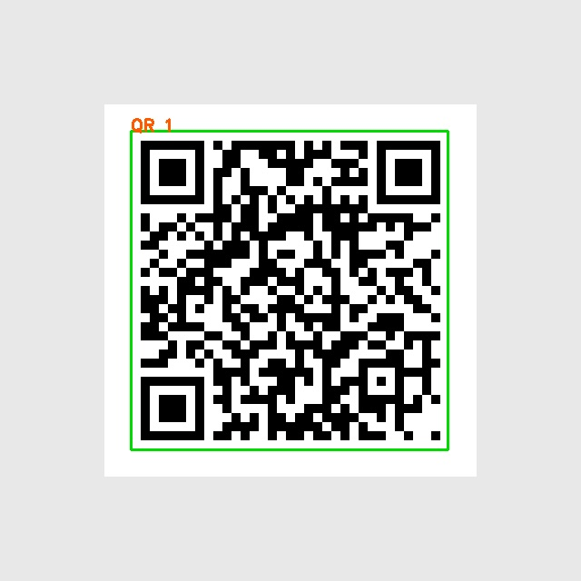
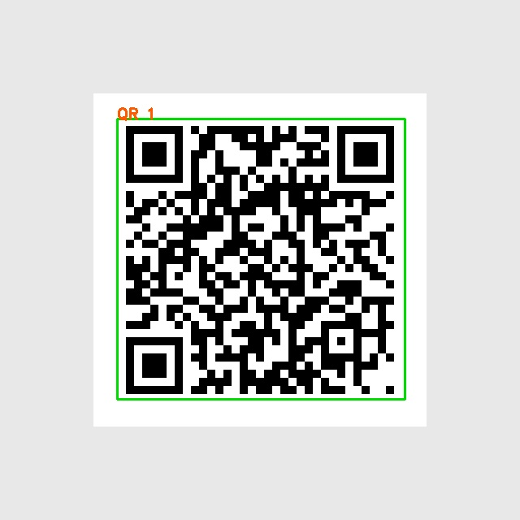

# QRCode-axera 部署指南

QRCode-axera 用于目标检测。本页说明 M.2 算力卡的接入条件、部署步骤与结果检查方法。

> 已实测，效果仍需评估。[查看部署效果](#查看部署效果)。

## 准备运行环境

本页效果展示使用 **RK3576 + AX8850 16GB M.2**；其他容量或平台需重新确认模型能否加载并正确运行。

在连接算力卡的 Linux 主机终端执行，RK3576 使用 ARM64 环境。首次部署先完成[驱动与设备检查](../../usage/device-check.md)、[安装 PyAXEngine](../../usage/python.md)和[下载工具安装](../../usage/download-models.md#使用-hugging-face-下载)。已完成这些步骤可直接下载模型。

后文使用设备 0，运行前用 `axcl-smi` 确认设备可用。

## 下载模型与样例

本页使用 `AXERA-TECH/QRCode-axera` 的固定版本。下面下载本页选用的 62 个文件。

```bash
MODEL_DIR=~/edgeaccel/models/qrcode-axera/4d52916f792b
mkdir -p "$MODEL_DIR"
~/edgeaccel/hf-env/bin/hf download AXERA-TECH/QRCode-axera \
  "images/qrcode_01.jpg" \
  "images/qrcode_02.jpg" \
  "images/qrcode_03.jpg" \
  "images/qrcode_05.jpg" \
  "images/qrcode_06.jpg" \
  "images/qrcode_08.jpg" \
  "images/qrcode_09.jpg" \
  "images/qrcode_11.jpg" \
  "images/qrcode_12.jpg" \
  "images/qrcode_13.jpg" \
  "images/qrcode_14.jpg" \
  "images/qrcode_15.jpg" \
  "images/qrcode_16.jpg" \
  "images/qrcode_17.jpg" \
  "images/qrcode_18.jpg" \
  "images/qrcode_19.jpg" \
  "images/qrcode_20.jpg" \
  "images/qrcode_21.jpg" \
  "images/qrcode_22.jpg" \
  "images/qrcode_23.jpg" \
  "images/qrcode_24.jpg" \
  "images/qrcode_26.jpg" \
  "images/qrcode_27.jpg" \
  "images/qrcode_28.jpg" \
  "images/qrcode_29.jpg" \
  "images/qrcode_31.jpg" \
  "images/qrcode_33.jpg" \
  "images/qrcode_34.jpg" \
  "images/qrcode_35.jpg" \
  "images/qrcode_36.jpg" \
  "images/qrcode_37.jpg" \
  "images/qrcode_38.jpg" \
  "images/qrcode_39.jpg" \
  "images/qrcode_41.jpg" \
  "images/qrcode_42.jpg" \
  "images/qrcode_43.jpg" \
  "images/qrcode_44.jpg" \
  "images/qrcode_45.jpg" \
  "images/qrcode_46.jpg" \
  "images/qrcode_47.jpg" \
  "images/qrcode_48.jpg" \
  "images/qrcode_49.jpg" \
  "images/qrcode_50.jpg" \
  "images/qrcode_51.jpg" \
  "images/qrcode_52.jpg" \
  "images/qrcode_53.jpg" \
  "images/qrcode_54.jpg" \
  "images/qrcode_55.jpg" \
  "model/AX650/deimv2_femto_650_npu1_u16.axmodel" \
  "model/AX650/nanodet-plus-m_650_npu1.axmodel" \
  "model/AX650/yolo11n_650_npu1.axmodel" \
  "model/AX650/yolo12n_650_npu1.axmodel" \
  "model/AX650/yolo26n_650_npu1.axmodel" \
  "model/AX650/yolov10n_650_npu1.axmodel" \
  "model/AX650/yolov5n_650_npu1.axmodel" \
  "model/AX650/yolov8n_650_npu1.axmodel" \
  "model/AX650/yolov9t_650_npu1.axmodel" \
  "python/QRCode_axmodel_infer_26.py" \
  "python/QRCode_axmodel_infer_DEIMv2.py" \
  "python/QRCode_axmodel_infer_Nanodet.py" \
  "python/QRCode_axmodel_infer_v5.py" \
  "python/QRCode_axmodel_infer_v8.py" \
  --revision 4d52916f792b841ed9ff73df3758cdf4d5e135fe \
  --local-dir "$MODEL_DIR"
cd "$MODEL_DIR"
```

保留当前终端中的 `MODEL_DIR` 变量，后续命令沿用此目录。下载受阻或需要离线复制时，见[下载方式与文件校验](../../usage/download-models.md)。

## 安装检测与解码依赖

本页使用仓库内全部 9 个 AX650 模型及 48 张样例图片。神经网络检测在 M.2 卡上执行，图像前后处理和 ZBar 二维码解码在 RK3576 主机执行。

在 Ubuntu 24.04 主机安装解码库，并激活已安装 PyAXEngine 的独立环境：

```bash
sudo apt-get install -y libzbar0t64
source ~/edgeaccel/python-env/bin/activate
python -m pip install \
  'numpy==1.26.4' 'pillow==11.3.0' \
  'torch==2.5.1' 'torchvision==0.20.1' \
  'matplotlib==3.10.8' 'pyyaml==6.0.3' 'pyzbar==0.1.9'
python -m pip check
```

下载配套运行脚本 [qrcode_card.py](../../../static/examples/qrcode_card.py)，复制到主机的 `$MODEL_DIR/qrcode_card.py`。脚本调用同版本官方前后处理，将推理后端显式设为 `AXCLRTExecutionProvider`，并保留修改前的源码副本。

## 运行一个检测模型

先运行 YOLO11n。下载本页的[测试二维码](../../../static/validation/effects/qrcode-axera/inputs/edgeaccel-qr.png)，保存为 `$MODEL_DIR/images/edgeaccel-qr.png`。输出目录必须尚不存在，防止混入上一次的结果。

```bash
cd "$MODEL_DIR"
python qrcode_card.py --model-dir . \
  --weight yolo11n_650_npu1.axmodel \
  --images edgeaccel-qr.png \
  --output results/yolo11n
```

日志应显示 `AXCLRTExecutionProvider`，随后逐张输出 `boxes` 和 `decoded` 数量。`boxes` 表示检测到的区域数量；`decoded` 表示在裁剪区域中成功解码的结果数量。存在检测框不代表一定能够读出二维码文字。

脚本会生成标注图片和 `qrcode-result.json`，其中保留框坐标、解码文字、输入文件校验值及单图耗时。此图的正确解码文字为 `EdgeAccel AX8850 M.2 - deployment test 2026-09-23`。省略 `--images` 时处理仓库内的 48 张 JPG 样例。

## 运行其余模型

以下命令在主机上依次运行全部 9 个 AX650 权重，每个权重处理同一张测试二维码。`results/all` 应是新的输出目录：

```bash
cd "$MODEL_DIR"
for weight in model/AX650/*.axmodel; do
  name=$(basename "$weight" .axmodel)
  python qrcode_card.py --model-dir . \
    --weight "$(basename "$weight")" \
    --images edgeaccel-qr.png \
    --output "results/all/$name" || break
done
```

YOLOv5、YOLOv8 系列、YOLO26、NanoDet 和 DEIMv2 分别采用仓库中的对应前后处理。AX620E、AX637 目录面向其他芯片，本页没有下载或验证这些权重。

本次 NanoDet 未检测到这张测试图中的二维码；其余 8 个变体解码文字与原文一致。默认阈值和前后处理保持官方实现，不能仅根据推理进程正常退出判断识别正确。


## 查看部署效果

**已运行，效果仍需评估** · 2026-09-23 · RK3576 + AX8850 16GB M.2。以下输入与输出来自本页固定版本的实际运行。

全部 9 个 AX650 变体分别处理 48 张官方图片，并各自复测本页的测试二维码，共完成 441 次图像处理。测试二维码上 8 个变体检测与解码正确，NanoDet 未检测到区域。

点击图片可查看原尺寸。

<div className="model-effect-gallery">

<figure>

[](../../../static/validation/effects/qrcode-axera/inputs/edgeaccel-qr.png)

<figcaption>输入图片</figcaption>
</figure>

</div>

以下 9 个 AX650 权重分别处理同版本仓库内的 48 张图片。统计“至少解码出一个结果”的图片数量，不能解释为检测准确率；一张图可能含多个二维码。

| 编译模型 | 完成图片 | 检测到区域的图片 | 成功解码的图片 |
| --- | --- | --- | --- |
| deimv2_femto_650_npu1_u16 | 48 | 48 | 35 |
| nanodet-plus-m_650_npu1 | 48 | 48 | 33 |
| yolo11n_650_npu1 | 48 | 48 | 36 |
| yolo12n_650_npu1 | 48 | 48 | 36 |
| yolo26n_650_npu1 | 48 | 48 | 22 |
| yolov10n_650_npu1 | 48 | 48 | 35 |
| yolov5n_650_npu1 | 48 | 48 | 34 |
| yolov8n_650_npu1 | 48 | 48 | 37 |
| yolov9t_650_npu1 | 48 | 48 | 35 |

下面用同一张 640×640 测试二维码复测全部 9 个变体。二维码原文为 `EdgeAccel AX8850 M.2 - deployment test 2026-09-23`。其中 8 个模型完成检测与解码；NanoDet 没有检测到区域，下方保留实际空结果。

**deimv2_femto_650_npu1_u16 · edgeaccel-qr.png**

[](../../../static/validation/effects/qrcode-axera/outputs/deimv2_femto_650_npu1_u16.jpg)

实际解码文字：

```text
EdgeAccel AX8850 M.2 - deployment test 2026-09-23
```

**nanodet-plus-m_650_npu1 · edgeaccel-qr.png**

[](../../../static/validation/effects/qrcode-axera/outputs/nanodet-plus-m_650_npu1.jpg)

实际解码文字：

```text
本次未解码出文字。
```

**yolo11n_650_npu1 · edgeaccel-qr.png**

[](../../../static/validation/effects/qrcode-axera/outputs/yolo11n_650_npu1.jpg)

实际解码文字：

```text
EdgeAccel AX8850 M.2 - deployment test 2026-09-23
```

**yolo12n_650_npu1 · edgeaccel-qr.png**

[](../../../static/validation/effects/qrcode-axera/outputs/yolo12n_650_npu1.jpg)

实际解码文字：

```text
EdgeAccel AX8850 M.2 - deployment test 2026-09-23
```

**yolo26n_650_npu1 · edgeaccel-qr.png**

[](../../../static/validation/effects/qrcode-axera/outputs/yolo26n_650_npu1.jpg)

实际解码文字：

```text
EdgeAccel AX8850 M.2 - deployment test 2026-09-23
```

**yolov10n_650_npu1 · edgeaccel-qr.png**

[](../../../static/validation/effects/qrcode-axera/outputs/yolov10n_650_npu1.jpg)

实际解码文字：

```text
EdgeAccel AX8850 M.2 - deployment test 2026-09-23
```

**yolov5n_650_npu1 · edgeaccel-qr.png**

[](../../../static/validation/effects/qrcode-axera/outputs/yolov5n_650_npu1.jpg)

实际解码文字：

```text
EdgeAccel AX8850 M.2 - deployment test 2026-09-23
```

**yolov8n_650_npu1 · edgeaccel-qr.png**

[](../../../static/validation/effects/qrcode-axera/outputs/yolov8n_650_npu1.jpg)

实际解码文字：

```text
EdgeAccel AX8850 M.2 - deployment test 2026-09-23
```

**yolov9t_650_npu1 · edgeaccel-qr.png**

[](../../../static/validation/effects/qrcode-axera/outputs/yolov9t_650_npu1.jpg)

实际解码文字：

```text
EdgeAccel AX8850 M.2 - deployment test 2026-09-23
```

以上标注图均为本次检测框绘制的结果。解码使用主机上的 ZBar；未执行二维码中的链接或内容，也未采用仓库预置效果图。

**使用时注意：**

- NanoDet 在本页测试二维码上未检测到区域；48 张官方图的解码计数也不代表检测准确率。
- 神经网络在 AX8850 卡上执行，二维码文字解码由 RK3576 上的 ZBar 执行；未评估完整标注集、视频流或长期连续运行。

这些结果用于对照部署后的输出，未覆盖完整数据集精度或长期连续运行。

<details>
<summary>查看样例环境与运行耗时</summary>

环境：RK3576 + AX8850 16GB M.2。日期：2026-09-23。模型版本：`4d52916f792b841ed9ff73df3758cdf4d5e135fe`。

| 组件 | 版本或配置 |
| --- | --- |
| 主机系统 | Ubuntu 24.04 / Armbian 25.11.0-trunk，aarch64，主机内存约 4GB |
| 内核 | 6.1.115-vendor-rk35xx |
| AXCL / 驱动 | V3.16.0_20260729180218 |
| 固件 / CMM | V3.16.0；CMM 总量 15232MiB |
| Python / PyAXEngine | Python 3.12；官方 0.1.3.rc3 wheel；AXCLRTExecutionProvider |
| NumPy / OpenCV / Pillow | 1.26.4 / 4.11.0.86 / 11.3.0 |
| Torch / Torchvision | 2.5.1 / 0.20.1 |
| 二维码解码 | pyzbar 0.1.9；libzbar0t64 0.23.93-4build3 |

| 指标 | 实测值 | 计时或统计范围 |
| --- | --- | --- |
| deimv2_femto_650_npu1_u16.axmodel 单图平均耗时 | 0.118679 s | 48 张官方图片；包括前后处理、卡端推理、ZBar 解码与标注，不含模型加载 |
| nanodet-plus-m_650_npu1.axmodel 单图平均耗时 | 0.112474 s | 48 张官方图片；包括前后处理、卡端推理、ZBar 解码与标注，不含模型加载 |
| yolo11n_650_npu1.axmodel 单图平均耗时 | 0.133374 s | 48 张官方图片；包括前后处理、卡端推理、ZBar 解码与标注，不含模型加载 |
| yolo12n_650_npu1.axmodel 单图平均耗时 | 0.139834 s | 48 张官方图片；包括前后处理、卡端推理、ZBar 解码与标注，不含模型加载 |
| yolo26n_650_npu1.axmodel 单图平均耗时 | 0.091736 s | 48 张官方图片；包括前后处理、卡端推理、ZBar 解码与标注，不含模型加载 |
| yolov10n_650_npu1.axmodel 单图平均耗时 | 0.134128 s | 48 张官方图片；包括前后处理、卡端推理、ZBar 解码与标注，不含模型加载 |
| yolov5n_650_npu1.axmodel 单图平均耗时 | 0.063023 s | 48 张官方图片；包括前后处理、卡端推理、ZBar 解码与标注，不含模型加载 |
| yolov8n_650_npu1.axmodel 单图平均耗时 | 0.132465 s | 48 张官方图片；包括前后处理、卡端推理、ZBar 解码与标注，不含模型加载 |
| yolov9t_650_npu1.axmodel 单图平均耗时 | 0.133626 s | 48 张官方图片；包括前后处理、卡端推理、ZBar 解码与标注，不含模型加载 |

适用范围：

- NanoDet 在本页测试二维码上未检测到区域；48 张官方图的解码计数也不代表检测准确率。
- 神经网络在 AX8850 卡上执行，二维码文字解码由 RK3576 上的 ZBar 执行；未评估完整标注集、视频流或长期连续运行。
- 只验证 AX650 目录中的全部 9 个权重；AX620E 与 AX637 权重需要对应硬件。

</details>

遇到加载、内存或后端错误时，按[常见问题](../../usage/troubleshooting.md)处理。需要更换输入或接入业务时，按[检查输出与记录结果](../../reference/validation.md)保留自己的结果。

<details>
<summary>查看文件用途与版本信息</summary>

| 文件 / 目录内路径 | 用途 |
| --- | --- |
| [`python/QRCode_axmodel_infer_DEIMv2.py`](https://huggingface.co/AXERA-TECH/QRCode-axera/blob/4d52916f792b841ed9ff73df3758cdf4d5e135fe/python/QRCode_axmodel_infer_DEIMv2.py) | Python 程序 / 前后处理 |
| [`model/AX650/deimv2_femto_650_npu1_u16.axmodel`](https://huggingface.co/AXERA-TECH/QRCode-axera/blob/4d52916f792b841ed9ff73df3758cdf4d5e135fe/model/AX650/deimv2_femto_650_npu1_u16.axmodel) | 编译模型；按目录区分芯片和规格 |
| [`model/AX650/nanodet-plus-m_650_npu1.axmodel`](https://huggingface.co/AXERA-TECH/QRCode-axera/blob/4d52916f792b841ed9ff73df3758cdf4d5e135fe/model/AX650/nanodet-plus-m_650_npu1.axmodel) | 编译模型；按目录区分芯片和规格 |
| [`model/AX650/yolo11n_650_npu1.axmodel`](https://huggingface.co/AXERA-TECH/QRCode-axera/blob/4d52916f792b841ed9ff73df3758cdf4d5e135fe/model/AX650/yolo11n_650_npu1.axmodel) | 编译模型；按目录区分芯片和规格 |
| [`model/AX650/yolo12n_650_npu1.axmodel`](https://huggingface.co/AXERA-TECH/QRCode-axera/blob/4d52916f792b841ed9ff73df3758cdf4d5e135fe/model/AX650/yolo12n_650_npu1.axmodel) | 编译模型；按目录区分芯片和规格 |
| [`model/AX650/yolo26n_650_npu1.axmodel`](https://huggingface.co/AXERA-TECH/QRCode-axera/blob/4d52916f792b841ed9ff73df3758cdf4d5e135fe/model/AX650/yolo26n_650_npu1.axmodel) | 编译模型；按目录区分芯片和规格 |
| [`config.json`](https://huggingface.co/AXERA-TECH/QRCode-axera/blob/4d52916f792b841ed9ff73df3758cdf4d5e135fe/config.json) | 运行配置 |
| [`python/requirements.txt`](https://huggingface.co/AXERA-TECH/QRCode-axera/blob/4d52916f792b841ed9ff73df3758cdf4d5e135fe/python/requirements.txt) | Python 依赖清单 |

仓库提交：`4d52916f792b841ed9ff73df3758cdf4d5e135fe`。仓库中的 25 个 `.axmodel` 文件可能包括多个芯片、规格和分片。运行时使用本页指定的配套文件，完整列表见[固定版本目录](https://huggingface.co/AXERA-TECH/QRCode-axera/tree/4d52916f792b841ed9ff73df3758cdf4d5e135fe)。

</details>

<details>
<summary>补充说明与版本差异</summary>

- 检测二维码区域与解码二维码内容是两个步骤。AXMODEL 输出区域后仍需配套解码器。

</details>

## 参考资料

- [常用术语](../../reference/glossary.md)：AXCL、CMM、分词器与推理指标。
- [固定版本文件表](https://huggingface.co/AXERA-TECH/QRCode-axera/tree/4d52916f792b841ed9ff73df3758cdf4d5e135fe)。
- [模型卡 / 使用说明](https://huggingface.co/AXERA-TECH/QRCode-axera/blob/4d52916f792b841ed9ff73df3758cdf4d5e135fe/README.md)。
- [主要程序入口：python/QRCode_axmodel_infer_DEIMv2.py](https://huggingface.co/AXERA-TECH/QRCode-axera/blob/4d52916f792b841ed9ff73df3758cdf4d5e135fe/python/QRCode_axmodel_infer_DEIMv2.py)。
- [ModelScope 对应资源](https://modelscope.cn/models/AXERA-TECH/QRCode-axera)。不同平台的 revision 不通用，另行记录版本。

返回[完整模型目录](../catalog.mdx)。
